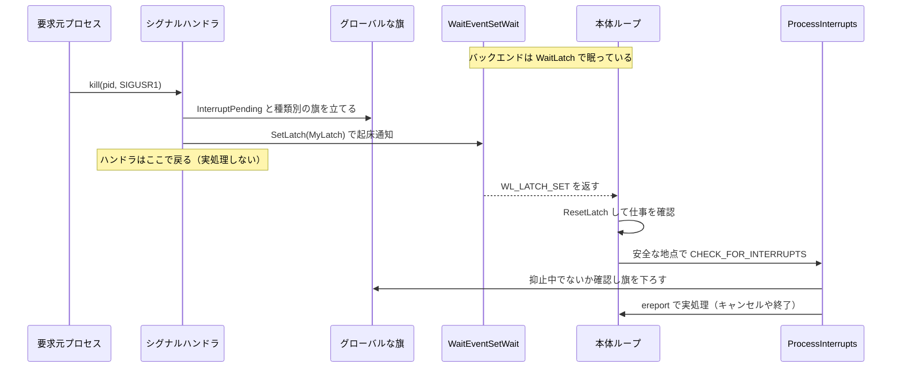

# 第7章 ラッチとシグナル処理

> **本章で読むソース**
>
> - [`src/backend/storage/ipc/latch.c`](https://github.com/postgres/postgres/blob/REL_18_4/src/backend/storage/ipc/latch.c)
> - [`src/backend/storage/ipc/waiteventset.c`](https://github.com/postgres/postgres/blob/REL_18_4/src/backend/storage/ipc/waiteventset.c)
> - [`src/backend/storage/ipc/procsignal.c`](https://github.com/postgres/postgres/blob/REL_18_4/src/backend/storage/ipc/procsignal.c)
> - [`src/backend/tcop/postgres.c`](https://github.com/postgres/postgres/blob/REL_18_4/src/backend/tcop/postgres.c)
> - [`src/include/storage/latch.h`](https://github.com/postgres/postgres/blob/REL_18_4/src/include/storage/latch.h)
> - [`src/include/miscadmin.h`](https://github.com/postgres/postgres/blob/REL_18_4/src/include/miscadmin.h)

## この章の狙い

PostgreSQL のプロセスは、つねに何かを計算しているわけではない。
バックエンドはクライアントからの次の問い合わせを待ち、補助プロセスは仕事が発生するまで眠る。
眠っている間も、別のプロセスから「問い合わせをキャンセルせよ」「設定を読み直せ」「シャットダウンせよ」といった要求が届く。
本章は、眠るプロセスを安全に起こし、届いた要求を安全な地点で処理する仕組みを読む。

仕組みは三つの層に分かれる。
最下層が**ラッチ**であり、シグナルとイベント待ちを取りこぼしなく橋渡しする。
その上に**WaitEventSet**があり、ラッチと複数のソケットをまとめて待つ。
さらに上に**ProcSignal**があり、プロセス間で具体的な要求の種類をやり取りする。
これらの上で、シグナルハンドラが旗を立て、`CHECK_FOR_INTERRUPTS` が安全な地点で `ProcessInterrupts` を呼び出す割り込み処理が動く。

本章を貫く設計思想は一つである。
非同期に届くシグナルのハンドラでは旗を立てるだけにとどめ、実際の処理はプロセスが自分の都合のよい地点まで進んでから行う。
この分離が、非同期シグナルによる内部状態の破壊を避けている。

## 前提

第5章で共有メモリとプロセス間通信の基礎を、第6章でメモリコンテキストを扱った。
本章ではプロセスがイベントを待つ仕組みを読むため、UNIX のシグナル、`poll`／`epoll` などの多重化システムコール、シグナルハンドラの中で安全に呼べる関数が限られること（async-signal-safe の制約）を前提とする。

## なぜラッチが必要か

素朴に「シグナルが届くまで眠る」を実装しようとすると、競合状態にはまる。
グローバルな旗をシグナルハンドラで立て、本体ループで旗を確認してから `poll` で眠る方式を考える。
旗を確認した直後、`poll` に入る前にシグナルが届くと、旗はすでに立っているのに `poll` は何も知らずに眠り込む。
シグナルそのものは、プラットフォームによっては `poll` を中断しないし、中断する場合でも `poll` 呼び出しの直前に届いたシグナルは眠りを妨げない。

`Latch` は、この取りこぼしを起こさないイベント通知の仕組みである。
構造体は小さい。

[`src/include/storage/latch.h` L113-L122](https://github.com/postgres/postgres/blob/REL_18_4/src/include/storage/latch.h#L113-L122)

```c
typedef struct Latch
{
	sig_atomic_t is_set;
	sig_atomic_t maybe_sleeping;
	bool		is_shared;
	int			owner_pid;
#ifdef WIN32
	HANDLE		event;
#endif
} Latch;
```

`is_set` がラッチの状態を表す旗である。
`maybe_sleeping` は所有者が眠ろうとしているかを示し、無駄な起床通知を省くために使う。
`owner_pid` はこのラッチを待てる唯一のプロセスを記録する。
ラッチには二種類ある。
プロセスローカルなラッチは同じプロセスからしか設定できず、自分のシグナルハンドラから `SetLatch` を呼んで眠りを解く用途に使う。
共有ラッチは共有メモリに置かれ、`InitSharedLatch` で初期化したあと `OwnLatch` で特定のプロセスに結び付ける。
所有プロセスだけが待てるが、設定はどのプロセスからでもできる。

ラッチの正しい使い方は、ヘッダのコメントが定型として示している。

[`src/include/storage/latch.h` L41-L53](https://github.com/postgres/postgres/blob/REL_18_4/src/include/storage/latch.h#L41-L53)

```c
 * The correct pattern to wait for event(s) is:
 *
 * for (;;)
 * {
 *	   ResetLatch();
 *	   if (work to do)
 *		   Do Stuff();
 *	   WaitLatch();
 * }
 *
 * It's important to reset the latch *before* checking if there's work to
 * do. Otherwise, if someone sets the latch between the check and the
 * ResetLatch call, you will miss it and Wait will incorrectly block.
```

`ResetLatch` を「仕事があるかの確認」より前に呼ぶ点が肝心である。
確認のあとにリセットすると、確認とリセットの間に届いた設定を取りこぼし、本来仕事があるのに眠ってしまう。
この順序を守る限り、`SetLatch` する側は「旗を立てる対象（グローバルな旗）を先に書き、そのあとで `SetLatch` を呼ぶ」だけでよく、待つ側は取りこぼさない。

## SetLatch、ResetLatch、WaitLatch

`SetLatch` はラッチを立て、待っているプロセスを起こす。
すでに立っているなら何もせずに戻るため、繰り返し呼んでも安い。

[`src/backend/storage/ipc/latch.c` L289-L345](https://github.com/postgres/postgres/blob/REL_18_4/src/backend/storage/ipc/latch.c#L289-L345)

```c
void
SetLatch(Latch *latch)
{
#ifndef WIN32
	pid_t		owner_pid;
#else
	HANDLE		handle;
#endif

	/*
	 * The memory barrier has to be placed here to ensure that any flag
	 * variables possibly changed by this process have been flushed to main
	 * memory, before we check/set is_set.
	 */
	pg_memory_barrier();

	/* Quick exit if already set */
	if (latch->is_set)
		return;

	latch->is_set = true;

	pg_memory_barrier();
	if (!latch->maybe_sleeping)
		return;

#ifndef WIN32

	// ... (中略) ...
	owner_pid = latch->owner_pid;
	if (owner_pid == 0)
		return;
	else if (owner_pid == MyProcPid)
		WakeupMyProc();
	else
		WakeupOtherProc(owner_pid);
```

冒頭のメモリバリアが、この関数の正しさを支えている。
`SetLatch` を呼ぶ側は、起こす理由となるグローバルな旗を先に書き込んでいる。
バリアによってその書き込みを主記憶へ確実に反映してから `is_set` を読み書きするため、起こされた側がループの先頭で旗を確認したときに、書き込みを見落とさない。
`is_set` を立てたあとのバリアと `maybe_sleeping` の確認は、相手が眠ろうとしていないなら起床通知（システムコール）を省くための最適化である。

起こす相手が自分自身か他プロセスかで経路が分かれる。
自分のシグナルハンドラから呼ばれた場合は `WakeupMyProc`、他プロセスなら `WakeupOtherProc` を使う。
どちらの実体も、眠っている `WaitEventSetWait` を確実に叩き起こすために用意されている。
注意すべきは、`owner_pid` を一度だけ読み出している点である。
ラッチの所有権が並行して移ると、最悪の場合は誤ったプロセスへ通知が飛ぶが、PostgreSQL のプロセスは余分な `SIGURG`／`SIGUSR1` を無害に処理できるよう作られているため問題にならない、とコメントが説明する。

`ResetLatch` は旗を下ろす。

[`src/backend/storage/ipc/latch.c` L373-L389](https://github.com/postgres/postgres/blob/REL_18_4/src/backend/storage/ipc/latch.c#L373-L389)

```c
void
ResetLatch(Latch *latch)
{
	/* Only the owner should reset the latch */
	Assert(latch->owner_pid == MyProcPid);
	Assert(latch->maybe_sleeping == false);

	latch->is_set = false;

	/*
	 * Ensure that the write to is_set gets flushed to main memory before we
	 * examine any flag variables.  Otherwise a concurrent SetLatch might
	 * falsely conclude that it needn't signal us, even though we have missed
	 * seeing some flag updates that SetLatch was supposed to inform us of.
	 */
	pg_memory_barrier();
}
```

ここでもメモリバリアが、`is_set` のクリアを主記憶へ反映してからグローバルな旗を確認する順序を保証する。
この順序がないと、並行する `SetLatch` が「相手はまだ起きているから通知不要」と誤判断し、こちらは旗の更新を見落としたまま眠る危険がある。

`WaitLatch` は、ラッチが立つか、postmaster の死か、タイムアウトのいずれかまで眠る。
実体は共通の `WaitEventSet` への薄いラッパーである。

[`src/backend/storage/ipc/latch.c` L187-L202](https://github.com/postgres/postgres/blob/REL_18_4/src/backend/storage/ipc/latch.c#L187-L202)

```c
	if (!(wakeEvents & WL_LATCH_SET))
		latch = NULL;
	ModifyWaitEvent(LatchWaitSet, LatchWaitSetLatchPos, WL_LATCH_SET, latch);

	if (IsUnderPostmaster)
		ModifyWaitEvent(LatchWaitSet, LatchWaitSetPostmasterDeathPos,
						(wakeEvents & (WL_EXIT_ON_PM_DEATH | WL_POSTMASTER_DEATH)),
						NULL);

	if (WaitEventSetWait(LatchWaitSet,
						 (wakeEvents & WL_TIMEOUT) ? timeout : -1,
						 &event, 1,
						 wait_event_info) == 0)
		return WL_TIMEOUT;
	else
		return event.events;
```

`WaitLatch` は呼ぶたびに使い捨ての待機集合を作らず、`InitializeLatchWaitSet` で一度だけ作った共通の `LatchWaitSet` を再利用し、対象だけ `ModifyWaitEvent` で差し替える。
集合の生成と `epoll` への登録には費用がかかるため、頻繁に呼ばれる `WaitLatch` で毎回作り直すのは無駄になる。

## 自己パイプと signalfd によるシグナルの橋渡し

ラッチの核心は、シグナルとイベント待ちの橋渡しにある。
`waiteventset.c` の冒頭コメントが、プラットフォームごとの手法を説明している。

[`src/backend/storage/ipc/waiteventset.c` L20-L33](https://github.com/postgres/postgres/blob/REL_18_4/src/backend/storage/ipc/waiteventset.c#L20-L33)

```c
 * The poll() implementation uses the so-called self-pipe trick to overcome the
 * race condition involved with poll() and setting a global flag in the signal
 * handler. When a latch is set and the current process is waiting for it, the
 * signal handler wakes up the poll() in WaitLatch by writing a byte to a pipe.
 * A signal by itself doesn't interrupt poll() on all platforms, and even on
 * platforms where it does, a signal that arrives just before the poll() call
 * does not prevent poll() from entering sleep. An incoming byte on a pipe
 * however reliably interrupts the sleep, and causes poll() to return
 * immediately even if the signal arrives before poll() begins.
 *
 * The epoll() implementation overcomes the race with a different technique: it
 * keeps SIGURG blocked and consumes from a signalfd() descriptor instead.  We
 * don't need to register a signal handler or create our own self-pipe.  We
 * assume that any system that has Linux epoll() also has Linux signalfd().
```

要点は、シグナルそのものでは眠りを確実に中断できないという制約を、ファイル記述子の読み取り可能性に変換して回避することである。
`poll` を使う実装では、自分自身へパイプを張る**自己パイプ**を用いる。
ラッチを起こすべきシグナルが届くと、ハンドラがパイプに1バイト書き込む。
パイプにバイトが届けば `poll` は確実に目を覚ますため、シグナルが `poll` の直前に届いても眠りに入らずに済む。

Linux の `epoll` を使う実装では、自己パイプもシグナルハンドラも不要になる。
`SIGURG` をブロックしたまま `signalfd` の記述子から消費するため、シグナルの到来がそのままファイル記述子の読み取り可能性として `epoll_wait` に伝わる。

`poll` 経路でハンドラがパイプへ書き込む処理を見る。

[`src/backend/storage/ipc/waiteventset.c` L1895-L1931](https://github.com/postgres/postgres/blob/REL_18_4/src/backend/storage/ipc/waiteventset.c#L1895-L1931)

```c
static void
latch_sigurg_handler(SIGNAL_ARGS)
{
	if (waiting)
		sendSelfPipeByte();
}

/* Send one byte to the self-pipe, to wake up WaitLatch */
static void
sendSelfPipeByte(void)
{
	int			rc;
	char		dummy = 0;

retry:
	rc = write(selfpipe_writefd, &dummy, 1);
	if (rc < 0)
	{
		/* If interrupted by signal, just retry */
		if (errno == EINTR)
			goto retry;

		/*
		 * If the pipe is full, we don't need to retry, the data that's there
		 * already is enough to wake up WaitLatch.
		 */
		if (errno == EAGAIN || errno == EWOULDBLOCK)
			return;

		// ... (中略) ...
		return;
	}
}
```

ハンドラがすることは、`waiting` が真なら1バイト書くことだけである。
`waiting` は `WaitEventSetWait` が眠りに入る区間でのみ真になるので、眠っていないときの無駄な書き込みを避けられる。
パイプが満杯なら何もしない。
すでにバイトが入っている以上、目を覚ますには十分だからである。
書き込み端は非ブロッキングに設定されており、ハンドラの中でブロックする危険がない。

`SetLatch` から呼ばれる `WakeupMyProc` と `WakeupOtherProc` も、この橋渡しに収束する。

[`src/backend/storage/ipc/waiteventset.c` L2019-L2036](https://github.com/postgres/postgres/blob/REL_18_4/src/backend/storage/ipc/waiteventset.c#L2019-L2036)

```c
void
WakeupMyProc(void)
{
#if defined(WAIT_USE_SELF_PIPE)
	if (waiting)
		sendSelfPipeByte();
#else
	if (waiting)
		kill(MyProcPid, SIGURG);
#endif
}

/* Similar to WakeupMyProc, but wake up another process */
void
WakeupOtherProc(int pid)
{
	kill(pid, SIGURG);
}
```

自己パイプ経路では、自分を起こすのにシグナルを経由せず、直接パイプへ書く。
他プロセスを起こすときと、`signalfd` 経路で自分を起こすときは `SIGURG` を送る。
`signalfd` 経路では、その `SIGURG` がブロックされたまま `signalfd` の記述子に積まれ、`epoll_wait` が読み取り可能として検知する。

## WaitEventSet で複数のイベントをまとめて待つ

`WaitEventSet` は、ラッチ、postmaster の死、複数ソケットの読み書き可能性を一つの待機集合にまとめ、`epoll`（または `poll`、`kqueue`）の単一呼び出しで待つ仕組みである。
`postmaster` の `ServerLoop` も、バックエンドがクライアントとラッチを同時に待つのも、この上に乗っている。

待機の本体は `WaitEventSetWait` である。
眠る前にラッチの状態を確認する部分を見る。

[`src/backend/storage/ipc/waiteventset.c` L1101-L1144](https://github.com/postgres/postgres/blob/REL_18_4/src/backend/storage/ipc/waiteventset.c#L1101-L1144)

```c
		if (set->latch && !set->latch->is_set)
		{
			/* about to sleep on a latch */
			set->latch->maybe_sleeping = true;
			pg_memory_barrier();
			/* and recheck */
		}

		if (set->latch && set->latch->is_set)
		{
			occurred_events->fd = PGINVALID_SOCKET;
			occurred_events->pos = set->latch_pos;
			occurred_events->user_data =
				set->events[set->latch_pos].user_data;
			occurred_events->events = WL_LATCH_SET;
			occurred_events++;
			returned_events++;

			/* could have been set above */
			set->latch->maybe_sleeping = false;

			// ... (中略) ...
		}

		/*
		 * Wait for events using the readiness primitive chosen at the top of
		 * this file. If -1 is returned, a timeout has occurred, if 0 we have
		 * to retry, everything >= 1 is the number of returned events.
		 */
		rc = WaitEventSetWaitBlock(set, cur_timeout,
								   occurred_events, nevents - returned_events);

		if (set->latch &&
			set->latch->maybe_sleeping)
			set->latch->maybe_sleeping = false;
```

眠ろうとする直前に `maybe_sleeping` を立て、メモリバリアを挟んでから `is_set` を読み直す。
この順序が、ラッチを立てる側との競合を解消する。
もし `maybe_sleeping` を立てる前にラッチが立っていれば、ここで `is_set` を見て即座に返り、眠らない。
もし `maybe_sleeping` を立てたあとにラッチが立てば、`SetLatch` 側は `maybe_sleeping` が真だと見て起床通知を送るため、`WaitEventSetWaitBlock` の眠りは確実に破られる。
どちらの順序でも取りこぼしが起きない。

`epoll` を使う `WaitEventSetWaitBlock` は、`epoll_wait` が返したイベントを走査し、ラッチ起床なら記述子を読み捨ててから報告する。

[`src/backend/storage/ipc/waiteventset.c` L1231-L1244](https://github.com/postgres/postgres/blob/REL_18_4/src/backend/storage/ipc/waiteventset.c#L1231-L1244)

```c
		if (cur_event->events == WL_LATCH_SET &&
			cur_epoll_event->events & (EPOLLIN | EPOLLERR | EPOLLHUP))
		{
			/* Drain the signalfd. */
			drain();

			if (set->latch && set->latch->maybe_sleeping && set->latch->is_set)
			{
				occurred_events->fd = PGINVALID_SOCKET;
				occurred_events->events = WL_LATCH_SET;
				occurred_events++;
				returned_events++;
			}
		}
```

`drain` が `signalfd`（または自己パイプ）に溜まったバイトを読み切り、次の `epoll_wait` が同じ通知で空回りしないようにする。
そのうえで `is_set` を再確認してからラッチ起床として報告するため、記述子は読めても旗が立っていない場合に空振りの起床を返さない。

## ProcSignal で要求の種類を伝える

シグナルは「何かが起きた」しか伝えない。
`SIGUSR1` が届いても、それがクエリキャンセルなのか、`NOTIFY` の配信なのか、並列ワーカーからのメッセージなのかは、シグナル番号だけでは区別できない。
**ProcSignal**は、共有メモリ上のスロットに「どの種類の要求か」を記録してからシグナルを送ることで、この区別を運ぶ仕組みである。

各プロセスは `ProcSignalInit` で自分のスロットを確保し、PID を書き込む。
スロットには種類ごとの旗の配列があり、スピンロック `pss_mutex` で保護される。

[`src/backend/storage/ipc/procsignal.c` L64-L76](https://github.com/postgres/postgres/blob/REL_18_4/src/backend/storage/ipc/procsignal.c#L64-L76)

```c
typedef struct
{
	pg_atomic_uint32 pss_pid;
	int			pss_cancel_key_len; /* 0 means no cancellation is possible */
	uint8		pss_cancel_key[MAX_CANCEL_KEY_LENGTH];
	volatile sig_atomic_t pss_signalFlags[NUM_PROCSIGNALS];
	slock_t		pss_mutex;		/* protects the above fields */

	/* Barrier-related fields (not protected by pss_mutex) */
	pg_atomic_uint64 pss_barrierGeneration;
	pg_atomic_uint32 pss_barrierCheckMask;
	ConditionVariable pss_barrierCV;
} ProcSignalSlot;
```

要求を送る `SendProcSignal` は、相手のスロットに種類の旗を立ててから `SIGUSR1` を送る。

[`src/backend/storage/ipc/procsignal.c` L284-L304](https://github.com/postgres/postgres/blob/REL_18_4/src/backend/storage/ipc/procsignal.c#L284-L304)

```c
int
SendProcSignal(pid_t pid, ProcSignalReason reason, ProcNumber procNumber)
{
	volatile ProcSignalSlot *slot;

	if (procNumber != INVALID_PROC_NUMBER)
	{
		Assert(procNumber < NumProcSignalSlots);
		slot = &ProcSignal->psh_slot[procNumber];

		SpinLockAcquire(&slot->pss_mutex);
		if (pg_atomic_read_u32(&slot->pss_pid) == pid)
		{
			/* Atomically set the proper flag */
			slot->pss_signalFlags[reason] = true;
			SpinLockRelease(&slot->pss_mutex);
			/* Send signal */
			return kill(pid, SIGUSR1);
		}
		SpinLockRelease(&slot->pss_mutex);
	}
```

`ProcNumber` が分かっていればスロットを添字一発で引ける。
配列を `ProcNumber` で添字付けする設計のおかげで、送り先が分かっているときは配列を探索せずに済む。
`ProcNumber` がない場合（送り先が補助プロセスのことが多い）は、配列を末尾から線形に探す。

受信側の `procsignal_sigusr1_handler` は、立っている旗を一つずつ確認し、対応するハンドラを呼ぶ。

[`src/backend/storage/ipc/procsignal.c` L674-L723](https://github.com/postgres/postgres/blob/REL_18_4/src/backend/storage/ipc/procsignal.c#L674-L723)

```c
void
procsignal_sigusr1_handler(SIGNAL_ARGS)
{
	if (CheckProcSignal(PROCSIG_CATCHUP_INTERRUPT))
		HandleCatchupInterrupt();

	if (CheckProcSignal(PROCSIG_NOTIFY_INTERRUPT))
		HandleNotifyInterrupt();

	if (CheckProcSignal(PROCSIG_PARALLEL_MESSAGE))
		HandleParallelMessageInterrupt();

	// ... (中略) ...

	if (CheckProcSignal(PROCSIG_RECOVERY_CONFLICT_BUFFERPIN))
		HandleRecoveryConflictInterrupt(PROCSIG_RECOVERY_CONFLICT_BUFFERPIN);

	SetLatch(MyLatch);
}
```

`CheckProcSignal` は旗が立っていれば下ろして真を返す。

[`src/backend/storage/ipc/procsignal.c` L649-L669](https://github.com/postgres/postgres/blob/REL_18_4/src/backend/storage/ipc/procsignal.c#L649-L669)

```c
static bool
CheckProcSignal(ProcSignalReason reason)
{
	volatile ProcSignalSlot *slot = MyProcSignalSlot;

	if (slot != NULL)
	{
		/*
		 * Careful here --- don't clear flag if we haven't seen it set.
		 * pss_signalFlags is of type "volatile sig_atomic_t" to allow us to
		 * read it here safely, without holding the spinlock.
		 */
		if (slot->pss_signalFlags[reason])
		{
			slot->pss_signalFlags[reason] = false;
			return true;
		}
	}

	return false;
}
```

ここで各 `Handle...Interrupt` が実処理そのものを行わない点に注目する。
たとえば `HandleRecoveryConflictInterrupt` は、後述するように別の旗を立てるだけで戻る。
そしてハンドラの最後で `SetLatch(MyLatch)` を呼ぶ。
この一行が、ProcSignal とラッチをつなぐ要である。
旗を立て終えたら自分のプロセスラッチを立て、`WaitLatch` で眠っているかもしれない本体ループを起こす。
起こされた本体は、安全な地点で旗を確認して実処理に入る。

## CHECK_FOR_INTERRUPTS と ProcessInterrupts

ここまでの仕組みは、最終的に「シグナルハンドラは旗を立てるだけ、実処理は安全な地点で」という割り込み処理に集約される。
その設計意図を、`miscadmin.h` のコメントが述べている。

[`src/include/miscadmin.h` L40-L47](https://github.com/postgres/postgres/blob/REL_18_4/src/include/miscadmin.h#L40-L47)

```c
 * In both cases, we need to be able to clean up the current transaction
 * gracefully, so we can't respond to the interrupt instantaneously ---
 * there's no guarantee that internal data structures would be self-consistent
 * if the code is interrupted at an arbitrary instant.  Instead, the signal
 * handlers set flags that are checked periodically during execution.
 *
 * The CHECK_FOR_INTERRUPTS() macro is called at strategically located spots
 * where it is normally safe to accept a cancel or die interrupt.  In some
```

任意の瞬間にコードを中断すると、内部のデータ構造が一貫した状態とは限らない。
だからシグナルハンドラは旗を立てるだけにとどめ、実行中の安全な地点に置いた `CHECK_FOR_INTERRUPTS` が旗を確認する。

死亡要求のハンドラ `die` と、クエリキャンセルのハンドラ `StatementCancelHandler` が、この方針をそのまま体現している。

[`src/backend/tcop/postgres.c` L3026-L3070](https://github.com/postgres/postgres/blob/REL_18_4/src/backend/tcop/postgres.c#L3026-L3070)

```c
void
die(SIGNAL_ARGS)
{
	/* Don't joggle the elbow of proc_exit */
	if (!proc_exit_inprogress)
	{
		InterruptPending = true;
		ProcDiePending = true;
	}

	/* for the cumulative stats system */
	pgStatSessionEndCause = DISCONNECT_KILLED;

	/* If we're still here, waken anything waiting on the process latch */
	SetLatch(MyLatch);

	// ... (中略) ...
}

/*
 * Query-cancel signal from postmaster: abort current transaction
 * at soonest convenient time
 */
void
StatementCancelHandler(SIGNAL_ARGS)
{
	/*
	 * Don't joggle the elbow of proc_exit
	 */
	if (!proc_exit_inprogress)
	{
		InterruptPending = true;
		QueryCancelPending = true;
	}

	/* If we're still here, waken anything waiting on the process latch */
	SetLatch(MyLatch);
}
```

どちらも `InterruptPending` を立て、種類を表す旗（`ProcDiePending` または `QueryCancelPending`）を立て、`SetLatch(MyLatch)` で眠っている本体を起こすだけである。
実際のトランザクション中断やプロセス終了はここでは行わない。
これらの旗は `volatile sig_atomic_t` 型で、シグナルハンドラと本体が安全に共有できる。

本体側は `CHECK_FOR_INTERRUPTS` でこれを拾う。

[`src/include/miscadmin.h` L111-L132](https://github.com/postgres/postgres/blob/REL_18_4/src/include/miscadmin.h#L111-L132)

```c
/* Test whether an interrupt is pending */
#ifndef WIN32
#define INTERRUPTS_PENDING_CONDITION() \
	(unlikely(InterruptPending))
#else
#define INTERRUPTS_PENDING_CONDITION() \
	(unlikely(UNBLOCKED_SIGNAL_QUEUE()) ? \
	 pgwin32_dispatch_queued_signals() : (void) 0, \
	 unlikely(InterruptPending))
#endif

/* Service interrupt, if one is pending and it's safe to service it now */
#define CHECK_FOR_INTERRUPTS() \
do { \
	if (INTERRUPTS_PENDING_CONDITION()) \
		ProcessInterrupts(); \
} while(0)

/* Is ProcessInterrupts() guaranteed to clear InterruptPending? */
#define INTERRUPTS_CAN_BE_PROCESSED() \
	(InterruptHoldoffCount == 0 && CritSectionCount == 0 && \
	 QueryCancelHoldoffCount == 0)
```

`CHECK_FOR_INTERRUPTS` は、`InterruptPending` が立っているときだけ `ProcessInterrupts` を呼び出すマクロである。
`unlikely` を付けて分岐予測のヒントを与え、旗が立っていない通常時に近い費用へ抑えている。
このマクロは、問い合わせ実行ループやスキャン、ソートなど、長く回りうる処理の随所に埋め込まれる。

実処理を担う `ProcessInterrupts` は、まず割り込みを受けてよい地点かを確かめる。

[`src/backend/tcop/postgres.c` L3298-L3357](https://github.com/postgres/postgres/blob/REL_18_4/src/backend/tcop/postgres.c#L3298-L3357)

```c
void
ProcessInterrupts(void)
{
	/* OK to accept any interrupts now? */
	if (InterruptHoldoffCount != 0 || CritSectionCount != 0)
		return;
	InterruptPending = false;

	if (ProcDiePending)
	{
		ProcDiePending = false;
		QueryCancelPending = false; /* ProcDie trumps QueryCancel */
		LockErrorCleanup();
		// ... (中略) ...
		else
			ereport(FATAL,
					(errcode(ERRCODE_ADMIN_SHUTDOWN),
					 errmsg("terminating connection due to administrator command")));
	}
```

冒頭の確認が、安全な地点という考えを具体化している。
`InterruptHoldoffCount` が非ゼロなら割り込みを抑止中であり、`CritSectionCount` が非ゼロならクリティカルセクションの最中である。
どちらの場合も即座に戻り、旗は立てたまま残す。
旗が残っていれば、次に安全な地点へ出たときの `CHECK_FOR_INTERRUPTS` が再び拾う。

安全であれば `InterruptPending` を下ろし、種類の旗ごとに分岐する。
`ProcDiePending` なら、ロック待ちの後始末をしてから `ereport(FATAL)` で接続を終える。
`die` が `ProcDiePending` を立てるだけだったのに対し、実際の終了処理はここで、トランザクションを安全に畳める地点で起きる。

クエリキャンセルは、本体がクライアントから入力を読んでいる最中には処理しない。

[`src/backend/tcop/postgres.c` L3398-L3409](https://github.com/postgres/postgres/blob/REL_18_4/src/backend/tcop/postgres.c#L3398-L3409)

```c
	if (QueryCancelPending && QueryCancelHoldoffCount != 0)
	{
		/*
		 * Re-arm InterruptPending so that we process the cancel request as
		 * soon as we're done reading the message.  (XXX this is seriously
		 * ugly: it complicates INTERRUPTS_CAN_BE_PROCESSED(), and it means we
		 * can't use that macro directly as the initial test in this function,
		 * meaning that this code also creates opportunities for other bugs to
		 * appear.)
		 */
		InterruptPending = true;
	}
```

`QueryCancelHoldoffCount` が非ゼロのときにキャンセルを処理すると、フロントエンドとバックエンドのプロトコルが同期を失う恐れがある。
そこで `InterruptPending` を立て直し、メッセージを読み終えてから処理を再開させる。
死亡要求はこの抑止を受けない。
それ以上クライアントからメッセージを読まないため、プロトコルの同期を崩さないからである。

旗を立てるだけで戻る方針は、`SIGUSR1` 経由の要求でも同じである。

[`src/backend/tcop/postgres.c` L3089-L3096](https://github.com/postgres/postgres/blob/REL_18_4/src/backend/tcop/postgres.c#L3089-L3096)

```c
void
HandleRecoveryConflictInterrupt(ProcSignalReason reason)
{
	RecoveryConflictPendingReasons[reason] = true;
	RecoveryConflictPending = true;
	InterruptPending = true;
	/* latch will be set by procsignal_sigusr1_handler */
}
```

`procsignal_sigusr1_handler` から呼ばれるこのハンドラは、種類別の旗と `InterruptPending` を立てるだけで戻る。
ラッチは呼び出し元のハンドラ末尾の `SetLatch(MyLatch)` がまとめて立てる、とコメントが明示している。
こうして ProcSignal の要求も、最終的に `CHECK_FOR_INTERRUPTS` と `ProcessInterrupts` の同じ安全点処理へ合流する。

## 全体の流れ

シグナルの到来から実処理までの流れを図にまとめる。
キャンセル要求を例に、旗を立てる、ラッチで起こす、安全点で処理する、の三段を追う。



図の左側（シグナルハンドラ）は最小限の仕事しかしない。
旗を立て、ラッチで起こし、すぐ戻る。
右側（本体）は、自分の進行が安全な地点に達したときにだけ旗を確認し、実処理に入る。
この左右の分離が、本章の設計思想そのものである。

## 高速化と堅牢性の工夫

本章の中心的な工夫は、**シグナルハンドラの仕事を旗を立てることに限り、実処理を安全な地点まで遅らせる**点にある。
これは速度ではなく堅牢性のための設計である。
シグナルは任意の機械語命令の境界で割り込む。
その瞬間に内部のデータ構造を書き換えれば、半端な更新で一貫性が壊れる。
ハンドラを旗立てに限れば、実処理は `ProcessInterrupts` が安全と判断した地点でだけ走り、トランザクションを安全に畳んだうえでキャンセルや終了を行える。
async-signal-safe でない関数をハンドラから呼ぶ危険も避けられる。

速度面の工夫も随所にある。
`SetLatch` は冒頭で `is_set` を確認し、すでに立っていればシステムコールを伴う起床通知を出さずに戻る。
さらに `maybe_sleeping` を確認し、相手が眠っていなければ通知自体を省く。
`CHECK_FOR_INTERRUPTS` は `InterruptPending` を `unlikely` 付きで確認するだけなので、割り込みのない通常経路では関数呼び出しすら発生しない。
`WaitLatch` が共通の `LatchWaitSet` を再利用するのも、`epoll` への登録費用を毎回払わないための工夫である。

これらの正しさを支えるのが、`SetLatch`／`ResetLatch`／`WaitEventSetWait` に置かれたメモリバリアである。
「旗を先に書いてから `SetLatch`」「`ResetLatch` してから旗を確認」という順序を、弱いメモリ順序の機械でも保証する。
バリアがあるおかげで、起こす側の旗の書き込みと起こされる側の確認がすれ違わず、起床通知の取りこぼしが起きない。

## まとめ

PostgreSQL のプロセスは、ラッチ、WaitEventSet、ProcSignal の三層と割り込み処理で、眠りと反応を実現する。
ラッチは自己パイプまたは `signalfd` を使い、シグナルとイベント待ちを取りこぼしなく橋渡しする。
WaitEventSet はラッチと複数ソケットを単一の `epoll` 呼び出しでまとめて待つ。
ProcSignal は共有メモリのスロットに要求の種類を記録してから `SIGUSR1` を送り、シグナル番号だけでは運べない情報を伝える。
そして割り込み処理は、シグナルハンドラに旗立てだけをさせ、`CHECK_FOR_INTERRUPTS` と `ProcessInterrupts` が安全な地点で実処理を行う。
非同期に届くシグナルが内部状態を壊さないのは、この「旗を立てて安全点で処理する」分離があるからである。

## 関連する章

- [第5章 共有メモリとプロセス間通信](05-shared-memory-and-ipc.md)：ProcSignal のスロット配列やラッチが置かれる共有メモリの確保を扱う。
- [第4章 postmaster とプロセスの起動](04-postmaster-and-processes.md)：本章のラッチを使って `ServerLoop` が接続とシグナルを待つ。
- [第9章 フロントエンド／バックエンドプロトコルとメインループ](../part02-connection-protocol/09-frontend-backend-protocol.md)：`CHECK_FOR_INTERRUPTS` が埋め込まれる問い合わせ処理ループを扱う。
- [第36章 スピンロック](../part08-transactions-concurrency/36-spinlocks.md)：ProcSignal スロットを保護する `pss_mutex` の実装を扱う。
