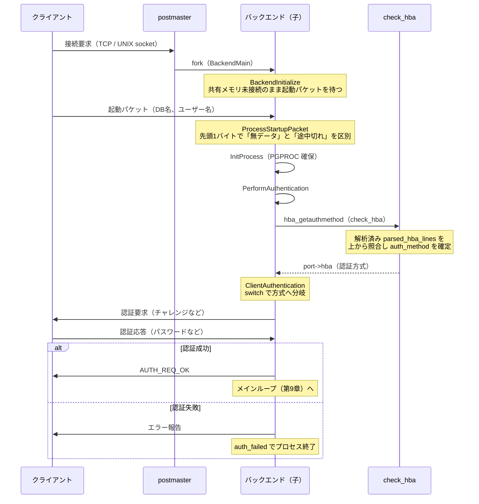

# 第8章 接続の確立と認証

> **本章で読むソース**
>
> - [`src/backend/tcop/backend_startup.c`](https://github.com/postgres/postgres/blob/REL_18_4/src/backend/tcop/backend_startup.c)
> - [`src/backend/utils/init/postinit.c`](https://github.com/postgres/postgres/blob/REL_18_4/src/backend/utils/init/postinit.c)
> - [`src/backend/libpq/auth.c`](https://github.com/postgres/postgres/blob/REL_18_4/src/backend/libpq/auth.c)
> - [`src/backend/libpq/hba.c`](https://github.com/postgres/postgres/blob/REL_18_4/src/backend/libpq/hba.c)

## この章の狙い

第4章で見たとおり、PostgreSQL は接続を1つ受けるたびに `postmaster` が `fork()` し、専用のバックエンドプロセスを生む。
生まれたばかりの子プロセスは、まだクライアントが何者かを知らない。
データベース名もユーザー名も受け取っておらず、その接続を許可してよいかも判断していない。

本章は、`fork()` された子プロセスが、クライアントから送られる**起動パケット**を読み、`pg_hba.conf` の規則に照らして認証方式を決め、その方式で認証を通すまでを読む。
処理は3つの段階に分かれる。
最初に子プロセスを初期化して起動パケットを集める段階、次に接続元と認証方式を突き合わせる段階、最後に決まった方式で実際に認証する段階である。

これらをすべて子プロセス側で行うことには理由がある。
ネットワーク越しのクライアントは応答が遅く、悪意があれば故意に黙り込むこともできる。
その待ち時間を `postmaster` が引き受けると、クラスタ全体の入口が1つのクライアントに塞がれてしまう。
第4章で見た「`postmaster` を危険な操作から隔離する」設計は、認証という遅くて信用ならない処理にもそのまま及んでいる。

## 前提

第4章で `postmaster` が接続ごとにバックエンドを `fork()` する流れを、第7章でラッチとシグナル、`CHECK_FOR_INTERRUPTS` による割り込み処理を扱った。
本章ではそれらを前提に、`fork()` 後の子プロセスがクライアントとの最初のやり取りをどう進めるかを読む。
フロントエンドとバックエンドのプロトコルそのもの、認証後のメインループは第9章で扱う。

PostgreSQL 18 では、バックエンド起動の入口は `src/backend/tcop/backend_startup.c` に分離されている。
以前 `postmaster.c` にあった起動パケット処理がこのファイルへ移されており、本章の出発点もここに置く。

## バックエンド起動の入口

`fork()` した子は、種類ごとに決められたメイン関数へ分岐する。
クライアント接続を処理するバックエンドの入口が `BackendMain` である。

[`src/backend/tcop/backend_startup.c` L76-L125](https://github.com/postgres/postgres/blob/REL_18_4/src/backend/tcop/backend_startup.c#L76-L125)

```c
BackendMain(const void *startup_data, size_t startup_data_len)
{
	const BackendStartupData *bsdata = startup_data;

	Assert(startup_data_len == sizeof(BackendStartupData));
	Assert(MyClientSocket != NULL);

// ... (中略) ...

	/* Perform additional initialization and collect startup packet */
	BackendInitialize(MyClientSocket, bsdata->canAcceptConnections);

	/*
	 * Create a per-backend PGPROC struct in shared memory.  We must do this
	 * before we can use LWLocks or access any shared memory.
	 */
	InitProcess();

	/*
	 * Make sure we aren't in PostmasterContext anymore.  (We can't delete it
	 * just yet, though, because InitPostgres will need the HBA data.)
	 */
	MemoryContextSwitchTo(TopMemoryContext);

	PostgresMain(MyProcPort->database_name, MyProcPort->user_name);
}
```

`BackendMain` は3つの呼び出しに集約される。
`BackendInitialize` でクライアントとの接続を整え起動パケットを集め、`InitProcess` で共有メモリ上の `PGPROC` を確保し、最後に `PostgresMain` へ制御を渡す。

注目すべきは順序である。
起動パケットの収集を担う `BackendInitialize` は、共有メモリ上の `PGPROC` を確保する `InitProcess` より前に置かれている。
クライアントが起動パケットをいつまでも送ってこない場合に備えて、この段階のバックエンドはまだ共有メモリに触れないのである。
その意図は `BackendInitialize` のコメントに明記されている。

[`src/backend/tcop/backend_startup.c` L186-L199](https://github.com/postgres/postgres/blob/REL_18_4/src/backend/tcop/backend_startup.c#L186-L199)

```c
	/*
	 * We arrange to do _exit(1) if we receive SIGTERM or timeout while trying
	 * to collect the startup packet; while SIGQUIT results in _exit(2).
	 * Otherwise the postmaster cannot shutdown the database FAST or IMMED
	 * cleanly if a buggy client fails to send the packet promptly.
	 *
	 * Exiting with _exit(1) is only possible because we have not yet touched
	 * shared memory; therefore no outside-the-process state needs to get
	 * cleaned up.
	 */
	pqsignal(SIGTERM, process_startup_packet_die);
	/* SIGQUIT handler was already set up by InitPostmasterChild */
	InitializeTimeouts();		/* establishes SIGALRM handler */
	sigprocmask(SIG_SETMASK, &StartupBlockSig, NULL);
```

起動パケットを待つ間にクライアントが沈黙したら、タイムアウトかシグナルで `_exit(1)` して即座に抜ける。
共有メモリにまだ触れていないため、後始末すべきプロセス外の状態が何もなく、乱暴に終了して構わない。
言い換えると、起動パケットの収集を `InitProcess` より前に置く設計は、応答しないクライアントをコストなく切り捨てるための布石である。

`BackendInitialize` はクライアントのホスト名を解決し、起動パケット待ちのタイムアウトを仕掛けてから `ProcessStartupPacket` を呼ぶ。

[`src/backend/tcop/backend_startup.c` L284-L295](https://github.com/postgres/postgres/blob/REL_18_4/src/backend/tcop/backend_startup.c#L284-L295)

```c
	RegisterTimeout(STARTUP_PACKET_TIMEOUT, StartupPacketTimeoutHandler);
	enable_timeout_after(STARTUP_PACKET_TIMEOUT, AuthenticationTimeout * 1000);

	/* Handle direct SSL handshake */
	status = ProcessSSLStartup(port);

	/*
	 * Receive the startup packet (which might turn out to be a cancel request
	 * packet).
	 */
	if (status == STATUS_OK)
		status = ProcessStartupPacket(port, false, false);
```

`AuthenticationTimeout` 秒以内に起動パケットが届かなければ、`StartupPacketTimeoutHandler` が発火して接続を打ち切る。
クライアントに無限に待たされる事態を、この段階から防いでいる。

## 起動パケットの処理

`ProcessStartupPacket` は、クライアントが最初に送るパケットを1つ読む。
パケットは長さ4バイトのワードで始まり、その先頭1バイトだけを別に読む工夫がある。

[`src/backend/tcop/backend_startup.c` L499-L534](https://github.com/postgres/postgres/blob/REL_18_4/src/backend/tcop/backend_startup.c#L499-L534)

```c
retry:
	pq_startmsgread();

	/*
	 * Grab the first byte of the length word separately, so that we can tell
	 * whether we have no data at all or an incomplete packet.  (This might
	 * sound inefficient, but it's not really, because of buffering in
	 * pqcomm.c.)
	 */
	if (pq_getbytes(&len, 1) == EOF)
	{
		/*
		 * If we get no data at all, don't clutter the log with a complaint;
		 * such cases often occur for legitimate reasons.  An example is that
		 * we might be here after responding to NEGOTIATE_SSL_CODE, and if the
		 * client didn't like our response, it'll probably just drop the
		 * connection.  Service-monitoring software also often just opens and
		 * closes a connection without sending anything.  (So do port
		 * scanners, which may be less benign, but it's not really our job to
		 * notice those.)
		 */
		return STATUS_ERROR;
	}

	if (pq_getbytes(((char *) &len) + 1, 3) == EOF)
	{
		/* Got a partial length word, so bleat about that */
		if (!ssl_done && !gss_done)
			ereport(COMMERROR,
					(errcode(ERRCODE_PROTOCOL_VIOLATION),
					 errmsg("incomplete startup packet")));
		return STATUS_ERROR;
	}

	len = pg_ntoh32(len);
	len -= 4;
```

先頭1バイトだけを先に読むのは、「何も送られてこなかった」と「長さの途中で切れた」を区別するためである。
データがまったく来ないのは監視ソフトやポートスキャナでも起こる正常な事象なので、ログを汚さずに静かに `STATUS_ERROR` を返す。
長さワードが途中で切れたときだけ、プロトコル違反としてログに残す。
パケット長を確定すると、その分の領域を確保して本体を読み込み、先頭フィールドを取り出す。

[`src/backend/tcop/backend_startup.c` L562-L576](https://github.com/postgres/postgres/blob/REL_18_4/src/backend/tcop/backend_startup.c#L562-L576)

```c
	/*
	 * The first field is either a protocol version number or a special
	 * request code.
	 */
	port->proto = proto = pg_ntoh32(*((ProtocolVersion *) buf));

	if (proto == CANCEL_REQUEST_CODE)
	{
		ProcessCancelRequestPacket(port, buf, len);
		/* Not really an error, but we don't want to proceed further */
		return STATUS_ERROR;
	}

	if (proto == NEGOTIATE_SSL_CODE && !ssl_done)
	{
```

先頭フィールドは、通常のプロトコルバージョン番号か、特別な要求コードのいずれかである。
問い合わせのキャンセル要求（`CANCEL_REQUEST_CODE`）や SSL ネゴシエーション要求（`NEGOTIATE_SSL_CODE`）はここで分岐して処理され、通常の接続だけが先へ進む。
この先で起動パケットに含まれるデータベース名やユーザー名が `port` 構造体へ取り出され、認証の入力になる。

起動パケットを読み終えたバックエンドは、`PostgresMain` から呼ばれる `InitPostgres` の中で認証へ進む。
その入口が `PerformAuthentication` である。

## 認証の入口 PerformAuthentication

`PerformAuthentication` は認証専用のタイムアウトを仕掛けてから、認証の本体 `ClientAuthentication` を呼ぶ。

[`src/backend/utils/init/postinit.c` L242-L253](https://github.com/postgres/postgres/blob/REL_18_4/src/backend/utils/init/postinit.c#L242-L253)

```c
	/*
	 * Set up a timeout in case a buggy or malicious client fails to respond
	 * during authentication.  Since we're inside a transaction and might do
	 * database access, we have to use the statement_timeout infrastructure.
	 */
	enable_timeout_after(STATEMENT_TIMEOUT, AuthenticationTimeout * 1000);

	/*
	 * Now perform authentication exchange.
	 */
	set_ps_display("authentication");
	ClientAuthentication(port); /* might not return, if failure */
```

起動パケットを待つ間にも `AuthenticationTimeout` を仕掛けていたが、認証のやり取りでも同じ時間制限を改めて設ける。
認証ではクライアントとパスワードやチャレンジを往復するため、その応答待ちでも黙り込まれないようにするためである。
コメントが述べるように、悪意あるクライアントは起動パケット待ちと認証待ちを合わせて最大で `AuthenticationTimeout` の約2倍までプロセスを拘束できるが、それ以上は許されない。

`ClientAuthentication` が認証に失敗すると、この関数は返らずにバックエンドが終了する。
認証を子プロセス側で完結させているため、失敗してもクラッシュしても、影響はその1接続のプロセスに閉じる。

## pg_hba.conf によるマッチング

`ClientAuthentication` が最初に行うのは、この接続にどの認証方式を使うかの決定である。
それを `hba_getauthmethod` に委ねる。

[`src/backend/libpq/hba.c` L3110-L3113](https://github.com/postgres/postgres/blob/REL_18_4/src/backend/libpq/hba.c#L3110-L3113)

```c
hba_getauthmethod(hbaPort *port)
{
	check_hba(port);
}
```

`hba_getauthmethod` は `check_hba` を呼ぶだけの薄いラッパーである。
肝心の照合は `check_hba` が担う。

ここで重要なのは、`check_hba` が `pg_hba.conf` をその場で読まない点である。
設定ファイルの解析は別の段階で済んでおり、結果は `parsed_hba_lines` という `HbaLine` のリストに保持されている。
`check_hba` は、この解析済みリストを接続情報と上から順に突き合わせるだけである。

[`src/backend/libpq/hba.c` L2540-L2549](https://github.com/postgres/postgres/blob/REL_18_4/src/backend/libpq/hba.c#L2540-L2549)

```c
	foreach(line, parsed_hba_lines)
	{
		hba = (HbaLine *) lfirst(line);

		/* Check connection type */
		if (hba->conntype == ctLocal)
		{
			if (port->raddr.addr.ss_family != AF_UNIX)
				continue;
		}
```

各行について、まず接続種別（`local`、`host`、`hostssl` など）を照合する。
UNIX ドメインソケットからの接続なら `local` 行とだけ合致し、TCP 接続なら SSL の有無に応じて `host` 系の行と合致する。
種別が合わなければ `continue` で次の行へ進む。

種別が合致した行については、続いて接続元アドレス、データベース、ロールを順に照合する。

[`src/backend/libpq/hba.c` L2582-L2625](https://github.com/postgres/postgres/blob/REL_18_4/src/backend/libpq/hba.c#L2582-L2625)

```c
			/* Check IP address */
			switch (hba->ip_cmp_method)
			{
				case ipCmpMask:
					if (hba->hostname)
					{
						if (!check_hostname(port,
											hba->hostname))
							continue;
					}
					else
					{
						if (!check_ip(&port->raddr,
									  (struct sockaddr *) &hba->addr,
									  (struct sockaddr *) &hba->mask))
							continue;
					}
					break;
				case ipCmpAll:
					break;
				case ipCmpSameHost:
				case ipCmpSameNet:
					if (!check_same_host_or_net(&port->raddr,
												hba->ip_cmp_method))
						continue;
					break;
				default:
					/* shouldn't get here, but deem it no-match if so */
					continue;
			}
		}						/* != ctLocal */

		/* Check database and role */
		if (!check_db(port->database_name, port->user_name, roleid,
					  hba->databases))
			continue;

		if (!check_role(port->user_name, roleid, hba->roles, false))
			continue;

		/* Found a record that matched! */
		port->hba = hba;
		return;
	}
```

接続元 IP は、設定された比較方式に従って `check_ip` か `check_hostname` で照合する。
さらにデータベース名とロールを `check_db`、`check_role` で照合し、すべて合致した最初の行を `port->hba` に記録して即座に返る。
最初に合致した行で確定するため、`pg_hba.conf` は記述順が意味を持つ。

どの行にも合致しなかった場合は、暗黙の拒否を表す行を作って返す。

[`src/backend/libpq/hba.c` L2627-L2631](https://github.com/postgres/postgres/blob/REL_18_4/src/backend/libpq/hba.c#L2627-L2631)

```c
	/* If no matching entry was found, then implicitly reject. */
	hba = palloc0(sizeof(HbaLine));
	hba->auth_method = uaImplicitReject;
	port->hba = hba;
}
```

合致する行がないことは、設定漏れではなく拒否として扱う。
`uaImplicitReject` を持つ行を `port->hba` に置くことで、後段の認証方式の分岐がそのまま拒否処理に流れる。

### 解析と照合を分ける parse_hba_line の役割

`check_hba` が突き合わせる `HbaLine` のリストは、`parse_hba_line` が `pg_hba.conf` の各行から作る。
この関数は1行を、接続種別、接続元、データベース、ロール、認証方式の各フィールドへ分解する。
接続種別を `HbaLine` の列挙値に変換する部分を見る。

[`src/backend/libpq/hba.c` L1365-L1375](https://github.com/postgres/postgres/blob/REL_18_4/src/backend/libpq/hba.c#L1365-L1375)

```c
	token = linitial(tokens);
	if (strcmp(token->string, "local") == 0)
	{
		parsedline->conntype = ctLocal;
	}
	else if (strcmp(token->string, "host") == 0 ||
			 strcmp(token->string, "hostssl") == 0 ||
			 strcmp(token->string, "hostnossl") == 0 ||
			 strcmp(token->string, "hostgssenc") == 0 ||
			 strcmp(token->string, "hostnogssenc") == 0)
	{
```

文字列 `"local"` や `"host"` を、照合のときに使う列挙値 `ctLocal`、`ctHost` などへ翻訳している。
同じように認証方式の名前も列挙値へ翻訳する。

[`src/backend/libpq/hba.c` L1699-L1725](https://github.com/postgres/postgres/blob/REL_18_4/src/backend/libpq/hba.c#L1699-L1725)

```c
	unsupauth = NULL;
	if (strcmp(token->string, "trust") == 0)
		parsedline->auth_method = uaTrust;
	else if (strcmp(token->string, "ident") == 0)
		parsedline->auth_method = uaIdent;
	else if (strcmp(token->string, "peer") == 0)
		parsedline->auth_method = uaPeer;
	else if (strcmp(token->string, "password") == 0)
		parsedline->auth_method = uaPassword;
	else if (strcmp(token->string, "gss") == 0)
#ifdef ENABLE_GSS
		parsedline->auth_method = uaGSS;
#else
		unsupauth = "gss";
#endif
	else if (strcmp(token->string, "sspi") == 0)
#ifdef ENABLE_SSPI
		parsedline->auth_method = uaSSPI;
#else
		unsupauth = "sspi";
#endif
	else if (strcmp(token->string, "reject") == 0)
		parsedline->auth_method = uaReject;
	else if (strcmp(token->string, "md5") == 0)
		parsedline->auth_method = uaMD5;
	else if (strcmp(token->string, "scram-sha-256") == 0)
		parsedline->auth_method = uaSCRAM;
```

文字列比較とビルド構成（`ENABLE_GSS` など）の判定は、ここで一度だけ行われる。
`parse_hba_line` が文字列を列挙値へ畳み込んでおくことで、接続のたびに走る `check_hba` は `strcmp` を繰り返さず、列挙値の比較と `continue` の連鎖だけで済む。
解析と照合を分けるこの構造が、本章の後半で述べる最適化の核心になる。

## 認証方式の分岐 ClientAuthentication

`port->hba` に認証方式が定まると、`ClientAuthentication` はその方式へ分岐する。
分岐は1つの `switch` 文に集約されている。

[`src/backend/libpq/auth.c` L419-L426](https://github.com/postgres/postgres/blob/REL_18_4/src/backend/libpq/auth.c#L419-L426)

```c
	/*
	 * Now proceed to do the actual authentication check
	 */
	switch (port->hba->auth_method)
	{
		case uaReject:

			/*
```

`switch` の各 `case` が認証方式に対応する。
方式ごとの詳細には立ち入らず、分岐の骨格だけを追う。
まず、明示的な拒否（`uaReject`）と暗黙の拒否（`uaImplicitReject`）は、いずれもエラーを報告して接続を打ち切る。
証明書を使う方式や外部サービスを使う方式は、それぞれの実装へ委ねる。

[`src/backend/libpq/auth.c` L579-L630](https://github.com/postgres/postgres/blob/REL_18_4/src/backend/libpq/auth.c#L579-L630)

```c
		case uaPeer:
			status = auth_peer(port);
			break;

		case uaIdent:
			status = ident_inet(port);
			break;

		case uaMD5:
		case uaSCRAM:
			status = CheckPWChallengeAuth(port, &logdetail);
			break;

		case uaPassword:
			status = CheckPasswordAuth(port, &logdetail);
			break;

		case uaPAM:
#ifdef USE_PAM
			status = CheckPAMAuth(port, port->user_name, "");
#else
			Assert(false);
#endif							/* USE_PAM */
			break;

		case uaBSD:
#ifdef USE_BSD_AUTH
			status = CheckBSDAuth(port, port->user_name);
#else
			Assert(false);
#endif							/* USE_BSD_AUTH */
			break;

		case uaLDAP:
#ifdef USE_LDAP
			status = CheckLDAPAuth(port);
#else
			Assert(false);
#endif
			break;
		case uaRADIUS:
			status = CheckRADIUSAuth(port);
			break;
		case uaCert:
			/* uaCert will be treated as if clientcert=verify-full (uaTrust) */
		case uaTrust:
			status = STATUS_OK;
			break;
		case uaOAuth:
			status = CheckSASLAuth(&pg_be_oauth_mech, port, NULL, NULL);
			break;
	}
```

方式ごとの対応関係が、この `case` の並びに読み取れる。
`peer` はカーネルに問い合わせて接続元の OS ユーザーを確認し（`auth_peer`）、`password` は平文パスワードを受け取って照合する（`CheckPasswordAuth`）。
`md5` と `scram-sha-256` は同じ `CheckPWChallengeAuth` に集約され、その内部で実際の方式が選ばれる（後述）。
そして `trust` は何も確認せず `STATUS_OK` を返す。
各方式の `status` が出そろうと、最後にそれを判定して結果をクライアントへ返す。

[`src/backend/libpq/auth.c` L666-L669](https://github.com/postgres/postgres/blob/REL_18_4/src/backend/libpq/auth.c#L666-L669)

```c
	if (status == STATUS_OK)
		sendAuthRequest(port, AUTH_REQ_OK, NULL, 0);
	else
		auth_failed(port, status, logdetail);
```

認証が成功すれば `AUTH_REQ_OK` をクライアントへ送り、ここで初めて接続が認証済みになる。
失敗すれば `auth_failed` が方式に応じたエラーを報告し、この関数は返らずにバックエンドが終了する。

### md5 と scram の合流 CheckPWChallengeAuth

`md5` と `scram-sha-256` を1つの関数に集約する設計には、利用者の保存パスワードの形式に追従する狙いがある。
`CheckPWChallengeAuth` は、保存されているパスワードの種類を見て実際の方式を選ぶ。

[`src/backend/libpq/auth.c` L859-L863](https://github.com/postgres/postgres/blob/REL_18_4/src/backend/libpq/auth.c#L859-L863)

```c
	if (port->hba->auth_method == uaMD5 && pwtype == PASSWORD_TYPE_MD5)
		auth_result = CheckMD5Auth(port, shadow_pass, logdetail);
	else
		auth_result = CheckSASLAuth(&pg_be_scram_mech, port, shadow_pass,
									logdetail);
```

`pg_hba.conf` で `md5` を指定していても、利用者の保存パスワードが SCRAM 形式なら SCRAM 認証へ回す。
古い設定のまま新しいパスワード形式へ移行できるよう、設定と実体の食い違いをここで吸収している。

この関数には、利用者の存在を相手に悟らせないための工夫もある。

[`src/backend/libpq/auth.c` L835-L847](https://github.com/postgres/postgres/blob/REL_18_4/src/backend/libpq/auth.c#L835-L847)

```c
	/*
	 * If the user does not exist, or has no password or it's expired, we
	 * still go through the motions of authentication, to avoid revealing to
	 * the client that the user didn't exist.  If 'md5' is allowed, we choose
	 * whether to use 'md5' or 'scram-sha-256' authentication based on current
	 * password_encryption setting.  The idea is that most genuine users
	 * probably have a password of that type, and if we pretend that this user
	 * had a password of that type, too, it "blends in" best.
	 */
	if (!shadow_pass)
		pwtype = Password_encryption;
	else
		pwtype = get_password_type(shadow_pass);
```

存在しない利用者に対しても、認証の手順をひととおり踏む。
すぐ拒否すると、応答の速さや方式の違いから「その利用者は存在しない」と相手に推測されてしまう。
そこで `password_encryption` 設定に従って、いかにも実在しそうな方式を選び、本物の利用者の中に紛れ込ませる。
利用者列挙攻撃への、タイミングと挙動の両面からの対策である。

## 最適化の工夫 解析済み規則の使い回しと子プロセスでの認証

本章で読んだ流れには、機構レベルの工夫が2つある。

1つは、`pg_hba.conf` の解析を接続のたびに繰り返さない点である。
`check_hba` は設定ファイルを開かず、`parse_hba_line` が前もって作った `parsed_hba_lines`（`HbaLine` のリスト）を上から照合するだけだった。
解析の段階で文字列 `"host"` や `"scram-sha-256"` は列挙値 `ctHost`、`uaSCRAM` へ畳み込まれているため、接続ごとのホットパスである `check_hba` は `strcmp` を1回も呼ばずに済む。
照合は列挙値の比較と、合致しない行を読み飛ばす `continue` の連鎖だけで進む。
解析という重い処理を設定読み込み時の一度きりに寄せ、照合という頻繁な処理を軽い比較に保つ構造が、接続確立の速さを支えている。

もう1つは、この一連の処理をすべて `fork()` 済みの子プロセスで行う点である。
認証はネットワーク越しにクライアントの応答を待つ、遅くて信用ならない処理である。
これを `postmaster` が担えば、1つのクライアントの沈黙がクラスタ全体の接続受け入れを止めてしまう。
子プロセスで認証することにより、遅い応答も悪意ある沈黙も、その接続専用のプロセス1つに封じ込められる。
`AuthenticationTimeout` で時間を区切り、共有メモリに触れる前の段階なら `_exit(1)` で乱暴に抜けられるようにしてあるのも、この隔離があってこそ安全に成り立つ。
第4章で見た「`postmaster` を危険な操作から隔離する」という設計思想が、認証という具体的な場面で効いている。

## 接続確立から認証成功までのシーケンス

ここまでの流れを、クライアントから認証成功までのやり取りとしてまとめる。



## まとめ

`fork()` されたバックエンドは、共有メモリに触れる前に起動パケットを集め、応答しないクライアントをコストなく切り捨てられる状態を保つ。
起動パケットからデータベース名とユーザー名を取り出すと、`hba_getauthmethod` が解析済みの `pg_hba.conf` 規則を上から照合し、最初に合致した行の認証方式を確定する。
`ClientAuthentication` はその方式へ `switch` で分岐し、結果に応じて `AUTH_REQ_OK` を返すか、`auth_failed` で接続を打ち切る。

設計の要は2つである。
設定の解析を読み込み時の一度に寄せ、接続ごとの照合を列挙値の軽い比較に保つこと。
そして遅くて信用ならない認証を子プロセスに閉じ込め、`postmaster` を巻き込まないことである。

## 関連する章

- [第4章 postmaster とプロセスの起動](../part01-process-memory/04-postmaster-and-processes.md)
- [第7章 ラッチとシグナル処理](../part01-process-memory/07-latches-and-signals.md)
- [第9章 フロントエンド／バックエンドプロトコルとメインループ](09-frontend-backend-protocol.md)
