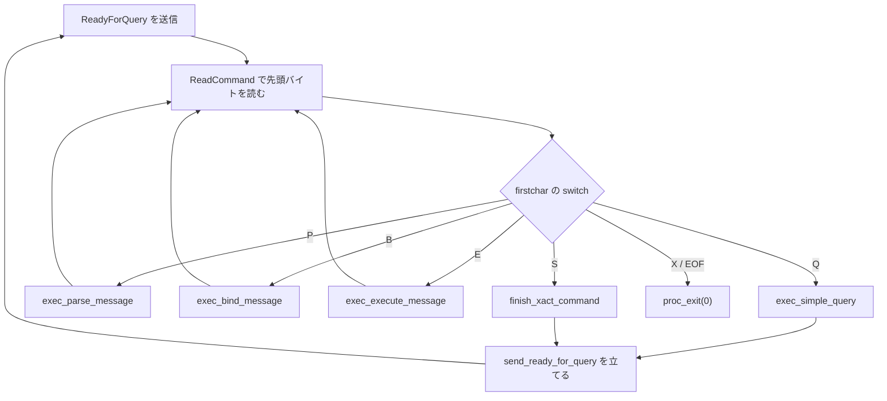
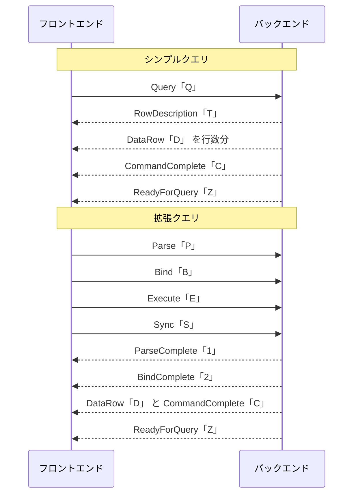

# 第9章 フロントエンド／バックエンドプロトコルとメインループ

> **本章で読むソース**
>
> - [`src/backend/tcop/postgres.c`](https://github.com/postgres/postgres/blob/REL_18_4/src/backend/tcop/postgres.c)
> - [`src/backend/tcop/backend_startup.c`](https://github.com/postgres/postgres/blob/REL_18_4/src/backend/tcop/backend_startup.c)
> - [`src/include/libpq/protocol.h`](https://github.com/postgres/postgres/blob/REL_18_4/src/include/libpq/protocol.h)
> - [`src/include/libpq/pqcomm.h`](https://github.com/postgres/postgres/blob/REL_18_4/src/include/libpq/pqcomm.h)

## この章の狙い

第8章で接続が確立し、認証が通り、起動パラメータがバックエンドに渡った。
ここから先、バックエンドはそのクライアント1本に専従し、接続が切れるまで問い合わせを受け付け続ける。
本章は、専従に入ったバックエンドの**メインループ**を読む。
クライアントが送ってくるのは、先頭1バイトの種別コードと長さ、本体からなる**メッセージ**である。
ループはこの先頭バイトを読み、種別ごとに処理を振り分ける。

振り分けの先は大きく二系統に分かれる。
一つは**シンプルクエリ**であり、SQL 文字列を1通のメッセージで丸ごと送り、解析から実行までを一気に走らせる。
もう一つは**拡張クエリ**であり、解析（Parse）、パラメータの束縛（Bind）、実行（Execute）を別々のメッセージに分け、解析済みの計画を後続の実行で使い回せるようにする。
本章は、この二系統がメインループからどう呼び分けられ、それぞれが何をクライアントへ返すかを追う。

解析、計画、実行の各段そのものは第3部以降で詳しく読む。
本章はその入口として、メッセージがどこで解釈され、どの関数へ落ちていくかという制御の流れに焦点を絞る。

## 前提

第8章で、接続の確立と認証、起動パケットによるプロトコルバージョンの受け渡しを扱った。
第7章で、バックエンドが入力を待つ間に眠り、シグナルで安全に起こされる仕組みを読んだ。
本章のループは、まさにその「クライアント入力待ち」を毎周回で行う。
メッセージの整数はネットワークバイトオーダ（ビッグエンディアン）で運ばれ、文字列はヌル終端で区切られる点を前提とする。

## メッセージの種別コード

プロトコルの語彙は、メッセージ先頭の1バイトに割り当てた文字コードで表される。
フロントエンドが送る要求と、バックエンドが返す応答とで、別々の表に定義がある。

[`src/include/libpq/protocol.h` L17-L33](https://github.com/postgres/postgres/blob/REL_18_4/src/include/libpq/protocol.h#L17-L33)

```c
/* These are the request codes sent by the frontend. */

#define PqMsg_Bind					'B'
#define PqMsg_Close					'C'
#define PqMsg_Describe				'D'
#define PqMsg_Execute				'E'
#define PqMsg_FunctionCall			'F'
#define PqMsg_Flush					'H'
#define PqMsg_Parse					'P'
#define PqMsg_Query					'Q'
#define PqMsg_Sync					'S'
#define PqMsg_Terminate				'X'
#define PqMsg_CopyFail				'f'
#define PqMsg_GSSResponse			'p'
#define PqMsg_PasswordMessage		'p'
#define PqMsg_SASLInitialResponse	'p'
#define PqMsg_SASLResponse			'p'
```

`'Q'` がシンプルクエリ、`'P'`／`'B'`／`'E'` が拡張クエリの解析、束縛、実行に対応する。
`'X'` は接続終了の通知である。
これらの綴りは、本章で読むメインループの `switch` のラベルにそのまま現れる。

応答側のコードも同じヘッダに並ぶ。

[`src/include/libpq/protocol.h` L38-L59](https://github.com/postgres/postgres/blob/REL_18_4/src/include/libpq/protocol.h#L38-L59)

```c
#define PqMsg_ParseComplete			'1'
#define PqMsg_BindComplete			'2'
#define PqMsg_CloseComplete			'3'
#define PqMsg_NotificationResponse	'A'
#define PqMsg_CommandComplete		'C'
#define PqMsg_DataRow				'D'
#define PqMsg_ErrorResponse			'E'
#define PqMsg_CopyInResponse		'G'
#define PqMsg_CopyOutResponse		'H'
#define PqMsg_EmptyQueryResponse	'I'
#define PqMsg_BackendKeyData		'K'
#define PqMsg_NoticeResponse		'N'
#define PqMsg_AuthenticationRequest 'R'
#define PqMsg_ParameterStatus		'S'
#define PqMsg_RowDescription		'T'
#define PqMsg_FunctionCallResponse	'V'
#define PqMsg_CopyBothResponse		'W'
#define PqMsg_ReadyForQuery			'Z'
#define PqMsg_NoData				'n'
#define PqMsg_PortalSuspended		's'
#define PqMsg_ParameterDescription	't'
#define PqMsg_NegotiateProtocolVersion 'v'
```

問い合わせを処理する流れでは、`RowDescription`（`'T'`）で結果列の名前と型を、`DataRow`（`'D'`）で各行の値を、`CommandComplete`（`'C'`）で1コマンドの完了を返す。
そしてバックエンドが次の入力を待てる状態になると `ReadyForQuery`（`'Z'`）を送る。
各コードの役割は、本章の後半で流れに即して見ていく。

## メインループの骨格

クライアント専従に入ったバックエンドの本体は `PostgresMain` である。
シグナルハンドラの設定、`InitPostgres` によるデータベース接続の初期化を終えたあと、エラー回復のための `sigsetjmp` を据え、無限ループに入る。

[`src/backend/tcop/postgres.c` L4187-L4189](https://github.com/postgres/postgres/blob/REL_18_4/src/backend/tcop/postgres.c#L4187-L4189)

```c
void
PostgresMain(const char *dbname, const char *username)
{
```

ループ本体は番号付きのコメントで段階が区切られている。
要点は、入力を待つ前に `ReadyForQuery` を送り、入力を読み、その種別で処理を振り分けることである。
まず、 idle 状態に達したら準備完了を通知する段が来る。

[`src/backend/tcop/postgres.c` L4687-L4702](https://github.com/postgres/postgres/blob/REL_18_4/src/backend/tcop/postgres.c#L4687-L4702)

```c
			ReadyForQuery(whereToSendOutput);
			send_ready_for_query = false;
		}

		/*
		 * (2) Allow asynchronous signals to be executed immediately if they
		 * come in while we are waiting for client input. (This must be
		 * conditional since we don't want, say, reads on behalf of COPY FROM
		 * STDIN doing the same thing.)
		 */
		DoingCommandRead = true;

		/*
		 * (3) read a command (loop blocks here)
		 */
		firstchar = ReadCommand(&input_message);
```

`ReadyForQuery` を送ることが、プロトコル上は「サーバは新しい問い合わせを受け付けられる」という合図になる。
クライアントはこれを見てから次のメッセージを送ってよい。
`DoingCommandRead` を立てるのは、入力待ちの間に届いたキャンセルやシャットダウンのシグナルを、その場で処理してよい状態にするためである。
`ReadCommand` が次のメッセージを読み終えるまで、ループはこの行で眠る。

毎周回の冒頭では、前回の問い合わせが使ったメモリをまとめて解放している。

[`src/backend/tcop/postgres.c` L4542-L4545](https://github.com/postgres/postgres/blob/REL_18_4/src/backend/tcop/postgres.c#L4542-L4545)

```c
		MemoryContextSwitchTo(MessageContext);
		MemoryContextReset(MessageContext);

		initStringInfo(&input_message);
```

問い合わせ1件ごとに `MessageContext` を丸ごとリセットする設計により、解析木や計画木が確保した一時メモリを1件ずつ個別に解放する必要がなくなる。
メモリコンテキストの仕組みは第6章で読んだとおりで、ここはその恩恵を受ける典型的な場所である。

## メッセージを読む ReadCommand

`ReadCommand` は出力先によって読み取り経路を選ぶ。

[`src/backend/tcop/postgres.c` L480-L490](https://github.com/postgres/postgres/blob/REL_18_4/src/backend/tcop/postgres.c#L480-L490)

```c
static int
ReadCommand(StringInfo inBuf)
{
	int			result;

	if (whereToSendOutput == DestRemote)
		result = SocketBackend(inBuf);
	else
		result = InteractiveBackend(inBuf);
	return result;
}
```

通常のクライアント接続では `whereToSendOutput` が `DestRemote` であり、`SocketBackend` がソケットから読む。
単独起動モード（`postgres --single`）のときだけ標準入力を読む `InteractiveBackend` に分かれる。

`SocketBackend` は、まず種別コードを1バイト読み、それを検証してから本体の長さに上限を課す。

[`src/backend/tcop/postgres.c` L386-L418](https://github.com/postgres/postgres/blob/REL_18_4/src/backend/tcop/postgres.c#L386-L418)

```c
	/*
	 * Validate message type code before trying to read body; if we have lost
	 * sync, better to say "command unknown" than to run out of memory because
	 * we used garbage as a length word.  We can also select a type-dependent
	 * limit on what a sane length word could be.  (The limit could be chosen
	 * more granularly, but it's not clear it's worth fussing over.)
	 *
	 * This also gives us a place to set the doing_extended_query_message flag
	 * as soon as possible.
	 */
	switch (qtype)
	{
		case PqMsg_Query:
			maxmsglen = PQ_LARGE_MESSAGE_LIMIT;
			doing_extended_query_message = false;
			break;

		case PqMsg_FunctionCall:
			maxmsglen = PQ_LARGE_MESSAGE_LIMIT;
			doing_extended_query_message = false;
			break;

		case PqMsg_Terminate:
			maxmsglen = PQ_SMALL_MESSAGE_LIMIT;
			doing_extended_query_message = false;
			ignore_till_sync = false;
			break;

		case PqMsg_Bind:
		case PqMsg_Parse:
			maxmsglen = PQ_LARGE_MESSAGE_LIMIT;
			doing_extended_query_message = true;
			break;
```

種別を本体より先に検証するのは、長さワードがゴミだったときに巨大なメモリ確保へ走るのを防ぐためである。
拡張クエリのメッセージでは `doing_extended_query_message` を立てる。
この旗は、拡張クエリの途中でエラーが起きたとき、`Sync` が来るまで後続メッセージを読み飛ばすエラー回復の制御に使われる。
種別が既知の集合に入っていなければ、メッセージ境界の同期を失った可能性が高いとみなし、`FATAL` で接続を打ち切る。

検証を終えると、長さワードに従って本体を `inBuf` に読み込み、種別コードを返す。
接続が切れていれば `EOF` を返す。
こうして `ReadCommand` が返した先頭バイトが、メインループの `switch` の分岐対象になる。

## 種別による振り分け

`PostgresMain` のループは、`ReadCommand` が返した `firstchar` を `switch` で振り分ける。
シンプルクエリの分岐は次のとおりである。

[`src/backend/tcop/postgres.c` L4752-L4776](https://github.com/postgres/postgres/blob/REL_18_4/src/backend/tcop/postgres.c#L4752-L4776)

```c
		switch (firstchar)
		{
			case PqMsg_Query:
				{
					const char *query_string;

					/* Set statement_timestamp() */
					SetCurrentStatementStartTimestamp();

					query_string = pq_getmsgstring(&input_message);
					pq_getmsgend(&input_message);

					if (am_walsender)
					{
						if (!exec_replication_command(query_string))
							exec_simple_query(query_string);
					}
					else
						exec_simple_query(query_string);

					valgrind_report_error_query(query_string);

					send_ready_for_query = true;
				}
				break;
```

`'Q'` は SQL 文字列を本体から1本取り出し、`exec_simple_query` に丸ごと渡す。
処理が終わると `send_ready_for_query` を立て、次の周回の冒頭で `ReadyForQuery` を返す段取りになる。
このように、シンプルクエリでは1通のメッセージで1往復が完結する。

拡張クエリの3メッセージは、それぞれ別の関数を呼ぶ。

[`src/backend/tcop/postgres.c` L4778-L4806](https://github.com/postgres/postgres/blob/REL_18_4/src/backend/tcop/postgres.c#L4778-L4806)

```c
			case PqMsg_Parse:
				{
					const char *stmt_name;
					const char *query_string;
					int			numParams;
					Oid		   *paramTypes = NULL;

					forbidden_in_wal_sender(firstchar);

					/* Set statement_timestamp() */
					SetCurrentStatementStartTimestamp();

					stmt_name = pq_getmsgstring(&input_message);
					query_string = pq_getmsgstring(&input_message);
					numParams = pq_getmsgint(&input_message, 2);
					if (numParams > 0)
					{
						paramTypes = palloc_array(Oid, numParams);
						for (int i = 0; i < numParams; i++)
							paramTypes[i] = pq_getmsgint(&input_message, 4);
					}
					pq_getmsgend(&input_message);

					exec_parse_message(query_string, stmt_name,
									   paramTypes, numParams);

					valgrind_report_error_query(query_string);
				}
				break;
```

`Parse` は、プリペアドステートメント名、SQL 文字列、パラメータ型の配列を取り出して `exec_parse_message` に渡す。
注目すべきは、`Parse` の分岐の末尾で `send_ready_for_query` を立てていない点である。
拡張クエリの各メッセージは `ReadyForQuery` を返さず、`Bind` の分岐（`exec_bind_message`）、`Execute` の分岐（`exec_execute_message`）と続けて受け取る。

[`src/backend/tcop/postgres.c` L4823-L4841](https://github.com/postgres/postgres/blob/REL_18_4/src/backend/tcop/postgres.c#L4823-L4841)

```c
			case PqMsg_Execute:
				{
					const char *portal_name;
					int			max_rows;

					forbidden_in_wal_sender(firstchar);

					/* Set statement_timestamp() */
					SetCurrentStatementStartTimestamp();

					portal_name = pq_getmsgstring(&input_message);
					max_rows = pq_getmsgint(&input_message, 4);
					pq_getmsgend(&input_message);

					exec_execute_message(portal_name, max_rows);

					/* exec_execute_message does valgrind_report_error_query */
				}
				break;
```

準備完了を返すのは、別途送られてくる `Sync`（`'S'`）メッセージである。

[`src/backend/tcop/postgres.c` L4964-L4976](https://github.com/postgres/postgres/blob/REL_18_4/src/backend/tcop/postgres.c#L4964-L4976)

```c
			case PqMsg_Sync:
				pq_getmsgend(&input_message);

				/*
				 * If pipelining was used, we may be in an implicit
				 * transaction block. Close it before calling
				 * finish_xact_command.
				 */
				EndImplicitTransactionBlock();
				finish_xact_command();
				valgrind_report_error_query("SYNC message");
				send_ready_for_query = true;
				break;
```

`Sync` が来て初めて `send_ready_for_query` が立つ。
つまり拡張クエリでは、クライアントは `Parse`、`Bind`、`Execute` をまとめて送り、最後に `Sync` を1通送る。
バックエンドは各メッセージに応答（`ParseComplete`、`BindComplete`、結果行、`CommandComplete`）を返しつつ、`Sync` まで来たところで `ReadyForQuery` を返す。
1往復の中に複数のコマンドを詰め込めるこの構造が、後述するパイプライン処理の土台になる。

接続終了は `'X'` または `EOF` で扱う。
どちらも `proc_exit(0)` でバックエンドを正常終了させる。
既知のどの種別にも当てはまらないメッセージは、`default` で `FATAL` にして接続を切る。

メインループの分岐を図にすると次のようになる。



シンプルクエリと `Sync` だけが準備完了の通知へ戻り、拡張クエリの個々のメッセージは通知を返さずに次の読み取りへ戻る。
この非対称が、二系統の往復構造の違いをそのまま表している。

## シンプルクエリの一気通貫

`exec_simple_query` は、受け取った SQL 文字列を解析、書き換え、計画、実行まで一息に通す。

[`src/backend/tcop/postgres.c` L1011-L1012](https://github.com/postgres/postgres/blob/REL_18_4/src/backend/tcop/postgres.c#L1011-L1012)

```c
static void
exec_simple_query(const char *query_string)
```

まずトランザクションコマンドを開始し、生の構文解析だけを先に済ませる。

[`src/backend/tcop/postgres.c` L1061-L1065](https://github.com/postgres/postgres/blob/REL_18_4/src/backend/tcop/postgres.c#L1061-L1065)

```c
	/*
	 * Do basic parsing of the query or queries (this should be safe even if
	 * we are in aborted transaction state!)
	 */
	parsetree_list = pg_parse_query(query_string);
```

`pg_parse_query` は SQL 文字列を生の構文木のリストに変換する。
1通のシンプルクエリに複数の SQL 文をセミコロンで並べてよいため、戻り値はリストになる。
リストの各要素について、解析、書き換え、計画、実行を順に行う。

[`src/backend/tcop/postgres.c` L1190-L1194](https://github.com/postgres/postgres/blob/REL_18_4/src/backend/tcop/postgres.c#L1190-L1194)

```c
		querytree_list = pg_analyze_and_rewrite_fixedparams(parsetree, query_string,
															NULL, 0, NULL);

		plantree_list = pg_plan_queries(querytree_list, query_string,
										CURSOR_OPT_PARALLEL_OK, NULL);
```

`pg_analyze_and_rewrite_fixedparams` が意味解析とリライタを通し、`pg_plan_queries` がプランナを通す。
シンプルクエリではパラメータがないため、型が確定した固定パラメータ版を使う。
これらの中身は第10章から第15章で詳しく読む。

計画ができたら、実行のための入れ物である**ポータル**を作り、計画を結び付けて起動する。

[`src/backend/tcop/postgres.c` L1274-L1283](https://github.com/postgres/postgres/blob/REL_18_4/src/backend/tcop/postgres.c#L1274-L1283)

```c
		(void) PortalRun(portal,
						 FETCH_ALL,
						 true,	/* always top level */
						 receiver,
						 receiver,
						 &qc);

		receiver->rDestroy(receiver);

		PortalDrop(portal, false);
```

`PortalRun` がエグゼキュータを駆動し、結果を `receiver`（`DestReceiver`）へ流す。
クライアント宛ての受け手は、結果列の記述を `RowDescription` として、各行を `DataRow` として送り出す。
`PortalRun` には `FETCH_ALL` を渡すため、結果は最後まで一気に取り出される。
1文の処理が終わるたびに、完了を知らせる `CommandComplete` を返す。

[`src/backend/tcop/postgres.c` L1331-L1337](https://github.com/postgres/postgres/blob/REL_18_4/src/backend/tcop/postgres.c#L1331-L1337)

```c
		/*
		 * Tell client that we're done with this query.  Note we emit exactly
		 * one EndCommand report for each raw parsetree, thus one for each SQL
		 * command the client sent, regardless of rewriting. (But a command
		 * aborted by error will not send an EndCommand report at all.)
		 */
		EndCommand(&qc, dest, false);
```

シンプルクエリでは、解析、計画、実行が1呼び出しの中で連続して走る。
同じ SQL を繰り返し送れば、毎回まるごと解析と計画をやり直す。
ここが拡張クエリとの分かれ目になる。

## 拡張クエリと計画の使い回し

拡張クエリは、シンプルクエリが一息に行う処理を三つのメッセージに分解する。
`Parse` で SQL を解析して名前付きのプリペアドステートメントとして保存し、`Bind` でパラメータ値を与えて実行可能なポータルを作り、`Execute` でポータルを走らせる。
この分解の狙いは、解析と計画の成果を保存し、後続の `Bind` と `Execute` で使い回すことにある。

`exec_parse_message` は、解析した結果を**CachedPlanSource**として登録する。

[`src/backend/tcop/postgres.c` L1503-L1504](https://github.com/postgres/postgres/blob/REL_18_4/src/backend/tcop/postgres.c#L1503-L1504)

```c
		psrc = CreateCachedPlan(raw_parse_tree, query_string,
								CreateCommandTag(raw_parse_tree->stmt));
```

`CreateCachedPlan` が作る `CachedPlanSource` は、解析木と書き換え後の問い合わせ木を保持するプランキャッシュの入口である。
名前付きのプリペアドステートメントなら `StorePreparedStatement` でカタログ的な領域に保存し、無名なら専用のスロットに置く。
解析が済むと `ParseComplete`（`'1'`）を返す。

[`src/backend/tcop/postgres.c` L1587-L1591](https://github.com/postgres/postgres/blob/REL_18_4/src/backend/tcop/postgres.c#L1587-L1591)

```c
	/*
	 * Send ParseComplete.
	 */
	if (whereToSendOutput == DestRemote)
		pq_putemptymessage(PqMsg_ParseComplete);
```

`exec_bind_message` は、`Bind` メッセージが指すプリペアドステートメントを引き当て、パラメータ値を読み取って、そこから実行可能な計画を得る。
計画を引き出す中心が `GetCachedPlan` である。

[`src/backend/tcop/postgres.c` L2013-L2018](https://github.com/postgres/postgres/blob/REL_18_4/src/backend/tcop/postgres.c#L2013-L2018)

```c
	/*
	 * Obtain a plan from the CachedPlanSource.  Any cruft from (re)planning
	 * will be generated in MessageContext.  The plan refcount will be
	 * assigned to the Portal, so it will be released at portal destruction.
	 */
	cplan = GetCachedPlan(psrc, params, NULL, NULL);
```

`GetCachedPlan` は、登録済みの `CachedPlanSource` から実行可能な計画（`CachedPlan`）を取り出す。
ここに最適化の核心がある。
プランキャッシュは、同じプリペアドステートメントに対する計画を保持し、条件が許せば前回の計画をそのまま返す。
パラメータ値が変わっても計画の構造が変わらない**汎用計画**を再利用できれば、`Bind` のたびに解析と計画をやり直さずに済む。
これにより、解析と計画の費用を一度の `Parse` に集約し、繰り返す `Bind` と `Execute` で償却できる。

得られた計画はポータルに結び付けられ、実行可能な状態になる。

[`src/backend/tcop/postgres.c` L2026-L2031](https://github.com/postgres/postgres/blob/REL_18_4/src/backend/tcop/postgres.c#L2026-L2031)

```c
	PortalDefineQuery(portal,
					  saved_stmt_name,
					  query_string,
					  psrc->commandTag,
					  cplan->stmt_list,
					  cplan);
```

束縛が済むと `BindComplete`（`'2'`）を返す。

[`src/backend/tcop/postgres.c` L2065-L2069](https://github.com/postgres/postgres/blob/REL_18_4/src/backend/tcop/postgres.c#L2065-L2069)

```c
	/*
	 * Send BindComplete.
	 */
	if (whereToSendOutput == DestRemote)
		pq_putemptymessage(PqMsg_BindComplete);
```

`exec_execute_message` は、名前で引いたポータルを `PortalRun` で走らせる。

[`src/backend/tcop/postgres.c` L2273-L2278](https://github.com/postgres/postgres/blob/REL_18_4/src/backend/tcop/postgres.c#L2273-L2278)

```c
	completed = PortalRun(portal,
						  max_rows,
						  true, /* always top level */
						  receiver,
						  receiver,
						  &qc);
```

`Execute` メッセージには取得行数の上限 `max_rows` が含まれる。
シンプルクエリが `FETCH_ALL` で全行を取り切るのに対し、拡張クエリでは行数を区切って取り出せる。
ポータルが最後まで走り切ったかどうかで、応答が分かれる。

[`src/backend/tcop/postgres.c` L2285-L2341](https://github.com/postgres/postgres/blob/REL_18_4/src/backend/tcop/postgres.c#L2285-L2341)

```c
	if (completed)
	{
		if (is_xact_command || (MyXactFlags & XACT_FLAGS_NEEDIMMEDIATECOMMIT))
		{
			/*
			 * If this was a transaction control statement, commit it.  We
			 * will start a new xact command for the next command (if any).
			 * Likewise if the statement required immediate commit.  Without
			 * this provision, we wouldn't force commit until Sync is
			 * received, which creates a hazard if the client tries to
			 * pipeline immediate-commit statements.
			 */
			finish_xact_command();

			/*
			 * These commands typically don't have any parameters, and even if
			 * one did we couldn't print them now because the storage went
			 * away during finish_xact_command.  So pretend there were none.
			 */
			portalParams = NULL;
		}
		else
		{
			/*
			 * We need a CommandCounterIncrement after every query, except
			 * those that start or end a transaction block.
			 */
			CommandCounterIncrement();

			/*
			 * Set XACT_FLAGS_PIPELINING whenever we complete an Execute
			 * message without immediately committing the transaction.
			 */
			MyXactFlags |= XACT_FLAGS_PIPELINING;

			/*
			 * Disable statement timeout whenever we complete an Execute
			 * message.  The next protocol message will start a fresh timeout.
			 */
			disable_statement_timeout();
		}

		/* Send appropriate CommandComplete to client */
		EndCommand(&qc, dest, false);
	}
	else
	{
		/* Portal run not complete, so send PortalSuspended */
		if (whereToSendOutput == DestRemote)
			pq_putemptymessage(PqMsg_PortalSuspended);

		/*
		 * Set XACT_FLAGS_PIPELINING whenever we suspend an Execute message,
		 * too.
		 */
		MyXactFlags |= XACT_FLAGS_PIPELINING;
	}
```

走り切ったときは `CommandComplete`（`'C'`）を返す。
`max_rows` で打ち切られて途中なら `PortalSuspended`（`'s'`）を返す。
クライアントは続きを取りたければ、同じポータルに対してもう一度 `Execute` を送ればよい。

二系統の往復の違いを並べると次のようになる。



拡張クエリは1往復の中に `Parse`、`Bind`、`Execute` を詰め込め、`Sync` まで応答を待たずに送り続けられる。
これが**パイプライン**であり、ネットワークの往復遅延を隠して連続したコマンドの待ち時間を縮める。
解析と計画の再利用に加え、この往復削減も拡張クエリが速い理由になる。

## プロトコルバージョンの折衝

接続の最初に、クライアントは起動パケットで自分が使いたいプロトコルバージョンを送る。
バックエンドが対応する範囲は、最古と最新を定数で持つ。

[`src/include/libpq/pqcomm.h` L96-L97](https://github.com/postgres/postgres/blob/REL_18_4/src/include/libpq/pqcomm.h#L96-L97)

```c
#define PG_PROTOCOL_EARLIEST	PG_PROTOCOL(3,0)
#define PG_PROTOCOL_LATEST		PG_PROTOCOL(3,2)
```

PostgreSQL 18 は、メジャー 3、マイナー 0 から 2 までを受け付ける。
本章で読んだメッセージ構造は、このメジャーバージョン 3 のものである。
バックエンドは、クライアントが要求したバージョンと自分の最新版の小さいほうを採用する。

[`src/backend/tcop/backend_startup.c` L721-L732](https://github.com/postgres/postgres/blob/REL_18_4/src/backend/tcop/backend_startup.c#L721-L732)

```c
	FrontendProtocol = Min(proto, PG_PROTOCOL_LATEST);

	/* Check that the major protocol version is in range. */
	if (PG_PROTOCOL_MAJOR(proto) < PG_PROTOCOL_MAJOR(PG_PROTOCOL_EARLIEST) ||
		PG_PROTOCOL_MAJOR(proto) > PG_PROTOCOL_MAJOR(PG_PROTOCOL_LATEST))
		ereport(FATAL,
				(errcode(ERRCODE_FEATURE_NOT_SUPPORTED),
				 errmsg("unsupported frontend protocol %u.%u: server supports %u.0 to %u.%u",
						PG_PROTOCOL_MAJOR(proto), PG_PROTOCOL_MINOR(proto),
						PG_PROTOCOL_MAJOR(PG_PROTOCOL_EARLIEST),
						PG_PROTOCOL_MAJOR(PG_PROTOCOL_LATEST),
						PG_PROTOCOL_MINOR(PG_PROTOCOL_LATEST))));
```

メジャーバージョンが範囲外なら接続を拒否する。
クライアントがバックエンドより新しいマイナーバージョンを要求した場合は、バックエンドが自分の最新マイナーに切り下げ、`NegotiateProtocolVersion`（`'v'`）を送って実際に使うバージョンを通知する。
この折衝が済んだあとに、本章で読んだメインループへ入る。

## まとめ

クライアント専従に入ったバックエンドは、`PostgresMain` の無限ループでメッセージを読み続ける。
ループは入力待ちの前に `ReadyForQuery` を送り、`ReadCommand` で先頭1バイトの種別コードを読み、`switch` で処理を振り分ける。
種別の綴りは `protocol.h` の定数に対応する。

振り分けの先は二系統に分かれる。
シンプルクエリ（`'Q'`）は `exec_simple_query` で解析から実行までを一気に通し、1通のメッセージで1往復を完結させる。
拡張クエリは `Parse`、`Bind`、`Execute` の三つに分解し、解析と計画の成果をプランキャッシュに保存して後続で使い回す。
`GetCachedPlan` が汎用計画を返せれば、繰り返しの実行で解析と計画の費用を償却でき、さらに `Sync` までまとめて送るパイプラインで往復遅延も隠せる。

`exec_simple_query` の各段、すなわち `pg_parse_query`、`pg_analyze_and_rewrite_fixedparams`、`pg_plan_queries`、`PortalRun` の中身は、第3部以降で読む。
本章はその入口として、メッセージがどこで解釈され、どの関数へ落ちるかという制御の流れだけを押さえた。

## 関連する章

- [第7章 ラッチとシグナル処理](../part01-process-memory/07-latches-and-signals.md)：メインループが入力待ちで眠り、シグナルで起こされる仕組み。
- [第8章 接続の確立と認証](08-connection-and-auth.md)：本章のループに入る前の、接続確立と起動パケットの処理。
- [第10章 パーサ](../part03-query-frontend/10-parser.md)：`pg_parse_query` が生の構文木を作る段。
- [第13章 プランナの全体像](../part03-query-frontend/13-planner-overview.md)：`pg_plan_queries` が計画を作る段。
- [第16章 エグゼキュータの骨格](../part04-executor/16-executor-overview.md)：`PortalRun` が駆動するエグゼキュータの構造。
