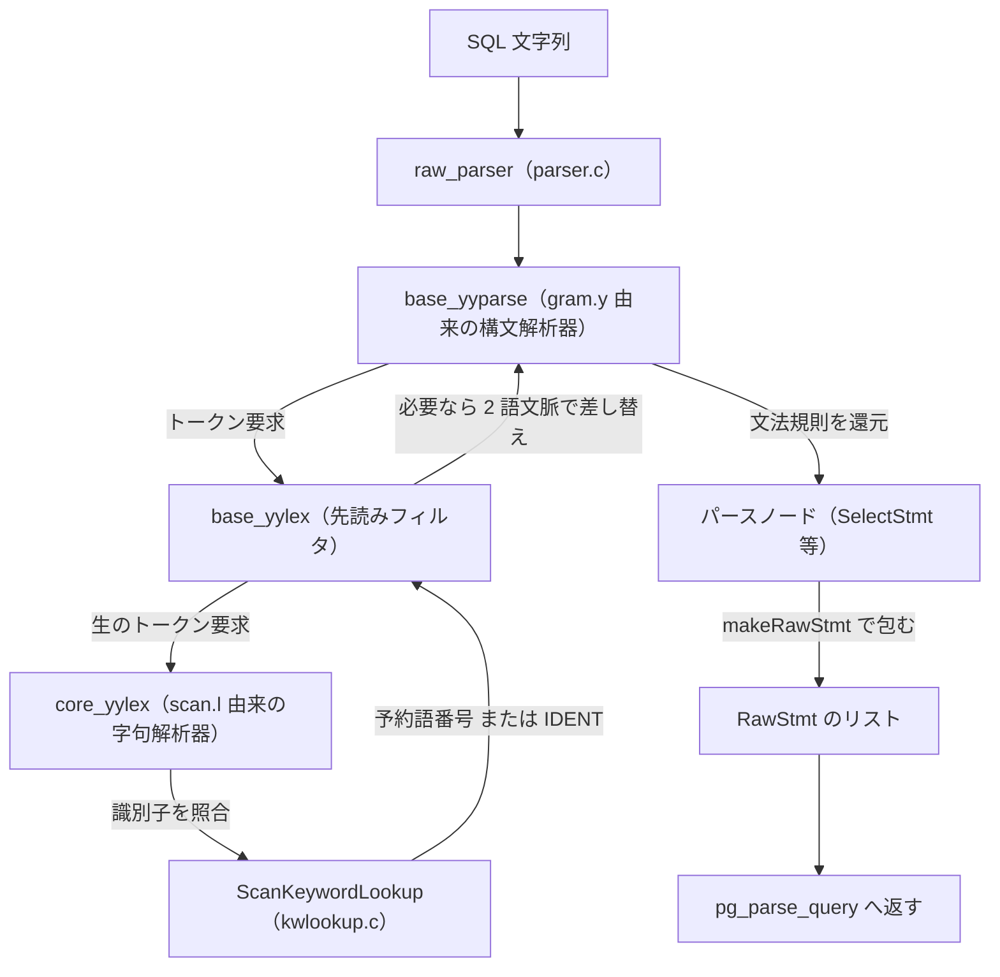

# 第10章 パーサ

> **本章で読むソース**
>
> - [`src/backend/parser/parser.c`](https://github.com/postgres/postgres/blob/REL_18_4/src/backend/parser/parser.c)
> - [`src/backend/parser/gram.y`](https://github.com/postgres/postgres/blob/REL_18_4/src/backend/parser/gram.y)
> - [`src/backend/parser/scan.l`](https://github.com/postgres/postgres/blob/REL_18_4/src/backend/parser/scan.l)
> - [`src/common/kwlookup.c`](https://github.com/postgres/postgres/blob/REL_18_4/src/common/kwlookup.c)
> - [`src/include/common/kwlookup.h`](https://github.com/postgres/postgres/blob/REL_18_4/src/include/common/kwlookup.h)
> - [`src/include/parser/kwlist.h`](https://github.com/postgres/postgres/blob/REL_18_4/src/include/parser/kwlist.h)
> - [`src/include/nodes/parsenodes.h`](https://github.com/postgres/postgres/blob/REL_18_4/src/include/nodes/parsenodes.h)

## この章の狙い

第9章で、シンプルクエリのメインループが `pg_parse_query` を呼ぶところまで読んだ。
その `pg_parse_query` が実際に駆動するのが本章の主役、**パーサ**である。
パーサの仕事は一つに絞られている。
SQL 文字列を受け取り、それが構文として正しいかを判定し、正しければ文の構造をそのまま写した木を返す。
返ってくる木を**生のパースツリー**と呼び、その実体は `RawStmt` ノードのリストである。

ここで「生の」と付くのは、この段がカタログを一切引かないからである。
テーブルが存在するか、列の型が何か、関数が定義されているかは、この段では問わない。
それらは次章のアナライザが意味解析として行う。
パーサが保証するのは構文だけであり、たとえば `SELECT * FROM` で文が終われば構文エラーになるが、`SELECT * FROM nonexistent` は構文として正しいので素通りする。

本章は、入口の `raw_parser` から始め、字句解析（`scan.l`）と構文解析（`gram.y`）の二段がどう噛み合うかを読む。
途中、識別子が予約語かどうかを定数時間で判定する仕組みに立ち寄り、最後に生のパースツリーがどんな形をしているかを `RawStmt` と `SelectStmt` で確かめる。

## 前提

第9章で、`pg_parse_query` が `raw_parser` を呼び、生のパースツリーのリストを受け取ることを見た。
第6章のメモリコンテキストを前提とする。
パーサが確保するノードはすべて palloc で確保され、エラー時には文ごとに割り当てたコンテキストを破棄するだけで後始末が済む。

字句解析器は **flex**、構文解析器は **bison** で生成される。
`scan.l` と `gram.y` はそれぞれ flex と bison への入力記述であり、ビルド時に C ソース（`scan.c`、`gram.c`）へ変換される。
本章はこの2つの記述ファイルの入口と要所だけを読む。
どちらも数千行から1万行を超える規模なので、規則の全文ではなく、役割を語るコメントと代表的な規則を引く。

## 入口の `raw_parser`

パーサの入口は `raw_parser` である。
ファイル冒頭のコメントが、この段の制約を明確に述べている。

[`src/backend/parser/parser.c` L1-L20](https://github.com/postgres/postgres/blob/REL_18_4/src/backend/parser/parser.c#L1-L20)

```c
/*-------------------------------------------------------------------------
 *
 * parser.c
 *		Main entry point/driver for PostgreSQL grammar
 *
 * Note that the grammar is not allowed to perform any table access
 * (since we need to be able to do basic parsing even while inside an
 * aborted transaction).  Therefore, the data structures returned by
 * the grammar are "raw" parsetrees that still need to be analyzed by
 * analyze.c and related files.
 *
 *
 * Portions Copyright (c) 1996-2025, PostgreSQL Global Development Group
 * Portions Copyright (c) 1994, Regents of the University of California
 *
 * IDENTIFICATION
 *	  src/backend/parser/parser.c
 *
 *-------------------------------------------------------------------------
 */
```

文法はテーブルアクセスを禁じられている。
理由はコメントが述べるとおりで、トランザクションがアボートした状態でも基本的な構文解析を動かせる必要があるからである。
アボート後のバックエンドは、次の `ROLLBACK` か `COMMIT` を探して入力を読み続ける。
このとき1文字も解析できないと、文の切れ目すら見つけられない。
だからパーサはカタログから切り離され、構文だけを見る道具になっている。

`raw_parser` の本体は短い。
字句解析器を初期化し、構文解析器を初期化し、`base_yyparse` を1回呼ぶだけである。

[`src/backend/parser/parser.c` L41-L86](https://github.com/postgres/postgres/blob/REL_18_4/src/backend/parser/parser.c#L41-L86)

```c
List *
raw_parser(const char *str, RawParseMode mode)
{
	core_yyscan_t yyscanner;
	base_yy_extra_type yyextra;
	int			yyresult;

	/* initialize the flex scanner */
	yyscanner = scanner_init(str, &yyextra.core_yy_extra,
							 &ScanKeywords, ScanKeywordTokens);

	/* base_yylex() only needs us to initialize the lookahead token, if any */
	if (mode == RAW_PARSE_DEFAULT)
		yyextra.have_lookahead = false;
	else
	{
		/* this array is indexed by RawParseMode enum */
		static const int mode_token[] = {
			[RAW_PARSE_DEFAULT] = 0,
			[RAW_PARSE_TYPE_NAME] = MODE_TYPE_NAME,
			[RAW_PARSE_PLPGSQL_EXPR] = MODE_PLPGSQL_EXPR,
			[RAW_PARSE_PLPGSQL_ASSIGN1] = MODE_PLPGSQL_ASSIGN1,
			[RAW_PARSE_PLPGSQL_ASSIGN2] = MODE_PLPGSQL_ASSIGN2,
			[RAW_PARSE_PLPGSQL_ASSIGN3] = MODE_PLPGSQL_ASSIGN3,
		};

		yyextra.have_lookahead = true;
		yyextra.lookahead_token = mode_token[mode];
		yyextra.lookahead_yylloc = 0;
		yyextra.lookahead_end = NULL;
	}

	/* initialize the bison parser */
	parser_init(&yyextra);

	/* Parse! */
	yyresult = base_yyparse(yyscanner);

	/* Clean up (release memory) */
	scanner_finish(yyscanner);

	if (yyresult)				/* error */
		return NIL;

	return yyextra.parsetree;
}
```

`scanner_init` には文字列とともに `ScanKeywords` と `ScanKeywordTokens` の2つを渡す。
前者は予約語の一覧、後者は予約語ごとの bison トークン番号の配列である。
字句解析器はこの2つを使い、識別子を読むたびに予約語かどうかを判定する。
判定の中身は後述する。

`mode` は通常の SQL 文では `RAW_PARSE_DEFAULT` であり、このとき先読みトークンは空で始まる。
それ以外のモードは PL/pgSQL の式や型名だけを解析するための入口で、文法の冒頭に注入する疑似トークンを先読みに仕込んでおく。
本章はシンプルクエリ（`RAW_PARSE_DEFAULT`）の経路だけを追う。

`base_yyparse` が成功すると、結果は引数では返らず `yyextra.parsetree` に置かれる。
bison の構文解析器は、最上位の規則の動作で結果をこのフィールドへ書き込む。
`raw_parser` はそれをそのまま返す。
エラーなら `base_yyparse` が非ゼロを返し、`NIL`（空リスト）を返す。

## 二段構成、字句解析と構文解析

`base_yyparse` の内部は二段に分かれる。
構文解析器はトークンを1つ要求するたびに字句解析器を呼ぶ。
字句解析器は文字列を前から舐め、空白とコメントを読み飛ばし、意味のある最小単位を1つ切り出して返す。
この最小単位を**トークン**と呼ぶ。
`SELECT`、識別子、文字列定数、`,`、`(` などが、それぞれ1つのトークンになる。

字句解析の記述は `scan.l` にある。
冒頭のコメントが、この字句解析器の設計上の要を一つ述べている。

[`src/backend/parser/scan.l` L1-L32](https://github.com/postgres/postgres/blob/REL_18_4/src/backend/parser/scan.l#L1-L32)

```c
%top{
/*-------------------------------------------------------------------------
 *
 * scan.l
 *	  lexical scanner for PostgreSQL
 *
 * NOTE NOTE NOTE:
 *
 * The rules in this file must be kept in sync with src/fe_utils/psqlscan.l
 * and src/interfaces/ecpg/preproc/pgc.l!
 *
 * The rules are designed so that the scanner never has to backtrack,
 * in the sense that there is always a rule that can match the input
 * consumed so far (the rule action may internally throw back some input
 * with yyless(), however).  As explained in the flex manual, this makes
 * for a useful speed increase --- several percent faster when measuring
 * raw parsing (Flex + Bison).  The extra complexity is mostly in the rules
 * for handling float numbers and continued string literals.  If you change
 * the lexical rules, verify that you haven't broken the no-backtrack
 * property by running flex with the "-b" option and checking that the
 * resulting "lex.backup" file says that no backing up is needed.  (As of
 * Postgres 9.2, this check is made automatically by the Makefile.)
 *
 *
 * Portions Copyright (c) 1996-2025, PostgreSQL Global Development Group
 * Portions Copyright (c) 1994, Regents of the University of California
 *
 * IDENTIFICATION
 *	  src/backend/parser/scan.l
 *
 *-------------------------------------------------------------------------
 */
```

コメントは、規則が**バックトラックしない**ように設計されていると述べる。
flex が生成する字句解析器は、入力をある規則に当てはめようとして途中で失敗すると、消費した文字を戻して別の規則を試す。
この戻りがバックトラックであり、その分だけ走査が遅くなる。
`scan.l` の規則は、これまでに消費した入力に対して必ずどれかの規則が当てはまるよう組まれている。
浮動小数点数や連続した文字列定数の規則が複雑なのは、この無バックトラック性を保つための代償だと、コメント自身が認めている。
これは字句解析の段で効く最適化であり、生の構文解析の速度を数パーセント押し上げると述べている。

字句解析器が切り出したトークンの種類を、構文解析器が文法規則に照らして組み上げる。
構文解析の記述は `gram.y` にある。
冒頭の NOTES が、終端記号と非終端記号の表記、それにテーブルアクセス禁止の理由を改めて述べている。

[`src/backend/parser/gram.y` L21-L45](https://github.com/postgres/postgres/blob/REL_18_4/src/backend/parser/gram.y#L21-L45)

```c
 * NOTES
 *	  CAPITALS are used to represent terminal symbols.
 *	  non-capitals are used to represent non-terminals.
 *
 *	  In general, nothing in this file should initiate database accesses
 *	  nor depend on changeable state (such as SET variables).  If you do
 *	  database accesses, your code will fail when we have aborted the
 *	  current transaction and are just parsing commands to find the next
 *	  ROLLBACK or COMMIT.  If you make use of SET variables, then you
 *	  will do the wrong thing in multi-query strings like this:
 *			SET constraint_exclusion TO off; SELECT * FROM foo;
 *	  because the entire string is parsed by gram.y before the SET gets
 *	  executed.  Anything that depends on the database or changeable state
 *	  should be handled during parse analysis so that it happens at the
 *	  right time not the wrong time.
 *
 * WARNINGS
 *	  If you use a list, make sure the datum is a node so that the printing
 *	  routines work.
 *
 *	  Sometimes we assign constants to makeStrings. Make sure we don't free
 *	  those.
 *
 *-------------------------------------------------------------------------
 */
```

ここで2つ目の理由が補強される。
`SET constraint_exclusion TO off; SELECT * FROM foo;` のように複数の文を1つの文字列で送ると、`gram.y` は文字列全体を一度に解析してから実行に回す。
だから先頭の `SET` が変えた設定は、後続の `SELECT` の解析時にはまだ反映されていない。
設定や状態に依存する判断は、解析ではなく次章のアナライザに置かれる。
構文解析が状態を持たないからこそ、文字列全体を一気に解析できる。

## 構文と意味の間に挟まる先読みフィルタ

`base_yyparse` が直接呼ぶのは、`scan.l` の生の字句解析器（`core_yylex`）ではなく、`parser.c` の `base_yylex` である。
これは字句解析器と構文解析器の間に挟まる薄いフィルタで、その必要性をコメントが説明している。

[`src/backend/parser/parser.c` L89-L109](https://github.com/postgres/postgres/blob/REL_18_4/src/backend/parser/parser.c#L89-L109)

```c
/*
 * Intermediate filter between parser and core lexer (core_yylex in scan.l).
 *
 * This filter is needed because in some cases the standard SQL grammar
 * requires more than one token lookahead.  We reduce these cases to one-token
 * lookahead by replacing tokens here, in order to keep the grammar LALR(1).
 *
 * Using a filter is simpler than trying to recognize multiword tokens
 * directly in scan.l, because we'd have to allow for comments between the
 * words.  Furthermore it's not clear how to do that without re-introducing
 * scanner backtrack, which would cost more performance than this filter
 * layer does.
 *
 * We also use this filter to convert UIDENT and USCONST sequences into
 * plain IDENT and SCONST tokens.  While that could be handled by additional
 * productions in the main grammar, it's more efficient to do it like this.
 *
 * The filter also provides a convenient place to translate between
 * the core_YYSTYPE and YYSTYPE representations (which are really the
 * same thing anyway, but notationally they're different).
 */
```

bison が生成する構文解析器は **LALR(1)** であり、先読みは1トークンに限られる。
ところが標準 SQL の文法には、1トークンの先読みでは決められない箇所がいくつかある。
たとえば `NOT` は、後ろに `BETWEEN` や `IN` が続くと別の意味を持つ。
`WITH` は後ろに `TIME` が続くかどうかで扱いが変わる。
こうした2語の組み合わせを、字句解析器の段で1つのトークンにまとめてしまうと、語と語の間にコメントを書けるという SQL の性質に対処しづらい。

そこで `base_yylex` は、自分が1トークン先まで覗き、必要なときだけ現在のトークンを別のトークンに差し替える。
たとえば `NOT` の直後が `BETWEEN` などなら、`NOT` を `NOT_LA` に差し替える。

[`src/backend/parser/parser.c` L207-L219](https://github.com/postgres/postgres/blob/REL_18_4/src/backend/parser/parser.c#L207-L219)

```c
		case NOT:
			/* Replace NOT by NOT_LA if it's followed by BETWEEN, IN, etc */
			switch (next_token)
			{
				case BETWEEN:
				case IN_P:
				case LIKE:
				case ILIKE:
				case SIMILAR:
					cur_token = NOT_LA;
					break;
			}
			break;
```

差し替えで生まれた `NOT_LA` のような特別なトークンを文法側に用意しておくことで、本体の文法は1トークン先読みのまま保たれる。
覗いた次のトークンは捨てずに先読みバッファ（`have_lookahead`）に取っておき、構文解析器が次に要求したときにそれを返す。
このフィルタが、字句解析器と構文解析器の間で1トークンの記憶を持つことで、LALR(1) の枠を壊さずに2語の文脈を表現している。

## 識別子が予約語かどうかを定数時間で判定する

字句解析器が識別子の形をした文字列を切り出したとき、最初にすることは、それが予約語かどうかの判定である。
`scan.l` の識別子規則がこれを行う。

[`src/backend/parser/scan.l` L1072-L1095](https://github.com/postgres/postgres/blob/REL_18_4/src/backend/parser/scan.l#L1072-L1095)

```c
{identifier}	{
					int			kwnum;
					char	   *ident;

					SET_YYLLOC();

					/* Is it a keyword? */
					kwnum = ScanKeywordLookup(yytext,
											  yyextra->keywordlist);
					if (kwnum >= 0)
					{
						yylval->keyword = GetScanKeyword(kwnum,
														 yyextra->keywordlist);
						return yyextra->keyword_tokens[kwnum];
					}

					/*
					 * No.  Convert the identifier to lower case, and truncate
					 * if necessary.
					 */
					ident = downcase_truncate_identifier(yytext, yyleng, true);
					yylval->str = ident;
					return IDENT;
				}
```

`ScanKeywordLookup` が予約語の番号を返せば、その番号で `keyword_tokens` を引いて対応する bison トークンを返す。
返らなければ、その文字列はただの識別子（`IDENT`）として扱う。
予約語の総数は500近い（`kwlist.h` の `PG_KEYWORD` エントリは494個ある）。
識別子を1つ切り出すたびにこの照合が走るので、照合の速さは解析全体の速さに直結する。

予約語の一覧は `kwlist.h` に、ASCII 順で1行ずつ並んでいる。

[`src/include/parser/kwlist.h` L21-L44](https://github.com/postgres/postgres/blob/REL_18_4/src/include/parser/kwlist.h#L21-L44)

```c
/*
 * List of keyword (name, token-value, category, bare-label-status) entries.
 *
 * Note: gen_keywordlist.pl requires the entries to appear in ASCII order.
 */

/* name, value, category, is-bare-label */
PG_KEYWORD("abort", ABORT_P, UNRESERVED_KEYWORD, BARE_LABEL)
PG_KEYWORD("absent", ABSENT, UNRESERVED_KEYWORD, BARE_LABEL)
PG_KEYWORD("absolute", ABSOLUTE_P, UNRESERVED_KEYWORD, BARE_LABEL)
PG_KEYWORD("access", ACCESS, UNRESERVED_KEYWORD, BARE_LABEL)
PG_KEYWORD("action", ACTION, UNRESERVED_KEYWORD, BARE_LABEL)
PG_KEYWORD("add", ADD_P, UNRESERVED_KEYWORD, BARE_LABEL)
PG_KEYWORD("admin", ADMIN, UNRESERVED_KEYWORD, BARE_LABEL)
PG_KEYWORD("after", AFTER, UNRESERVED_KEYWORD, BARE_LABEL)
PG_KEYWORD("aggregate", AGGREGATE, UNRESERVED_KEYWORD, BARE_LABEL)
PG_KEYWORD("all", ALL, RESERVED_KEYWORD, BARE_LABEL)
PG_KEYWORD("also", ALSO, UNRESERVED_KEYWORD, BARE_LABEL)
PG_KEYWORD("alter", ALTER, UNRESERVED_KEYWORD, BARE_LABEL)
PG_KEYWORD("always", ALWAYS, UNRESERVED_KEYWORD, BARE_LABEL)
PG_KEYWORD("analyse", ANALYSE, RESERVED_KEYWORD, BARE_LABEL)		/* British spelling */
PG_KEYWORD("analyze", ANALYZE, RESERVED_KEYWORD, BARE_LABEL)
PG_KEYWORD("and", AND, RESERVED_KEYWORD, BARE_LABEL)
PG_KEYWORD("any", ANY, RESERVED_KEYWORD, BARE_LABEL)
```

`PG_KEYWORD` はマクロで、利用側がその展開を定義する。
`scan.l` は予約語ごとの bison トークン番号だけを取り出すよう定義し、`ScanKeywordTokens` の配列を作る。
この同じ `kwlist.h` を別々のマクロ定義で何度も取り込むことで、トークン番号の表、分類の表、ラベル可否の表を、一つの一覧から食い違いなく生成している。

照合の本体が `ScanKeywordLookup` である。
ここに、本章で取り上げる機構レベルの最適化がある。

[`src/common/kwlookup.c` L37-L85](https://github.com/postgres/postgres/blob/REL_18_4/src/common/kwlookup.c#L37-L85)

```c
int
ScanKeywordLookup(const char *str,
				  const ScanKeywordList *keywords)
{
	size_t		len;
	int			h;
	const char *kw;

	/*
	 * Reject immediately if too long to be any keyword.  This saves useless
	 * hashing and downcasing work on long strings.
	 */
	len = strlen(str);
	if (len > keywords->max_kw_len)
		return -1;

	/*
	 * Compute the hash function.  We assume it was generated to produce
	 * case-insensitive results.  Since it's a perfect hash, we need only
	 * match to the specific keyword it identifies.
	 */
	h = keywords->hash(str, len);

	/* An out-of-range result implies no match */
	if (h < 0 || h >= keywords->num_keywords)
		return -1;

	/*
	 * Compare character-by-character to see if we have a match, applying an
	 * ASCII-only downcasing to the input characters.  We must not use
	 * tolower() since it may produce the wrong translation in some locales
	 * (eg, Turkish).
	 */
	kw = GetScanKeyword(h, keywords);
	while (*str != '\0')
	{
		char		ch = *str++;

		if (ch >= 'A' && ch <= 'Z')
			ch += 'a' - 'A';
		if (ch != *kw++)
			return -1;
	}
	if (*kw != '\0')
		return -1;

	/* Success! */
	return h;
}
```

照合は3手で済む。
まず文字列長が最長予約語より長ければ、即座に予約語ではないと判定する。
次に**完全ハッシュ関数**（`keywords->hash`）を1回呼んで、候補となる予約語の番号を1つだけ得る。
最後に、その1個の予約語と1文字ずつ突き合わせて確定する。

ここでの肝は `keywords->hash` が完全ハッシュであることである。
コメントが述べるとおり、完全ハッシュは予約語集合に対して衝突がなく、各予約語をただ一つの番号へ写す。
だから候補は常に1個に絞られ、突き合わせも1個で済む。
予約語が494個あっても、二分探索のように `log N` 回比較する必要はなく、線形探索のように全件を舐める必要もない。
文字列長で弾き、ハッシュで番号を1つ引き、1個と照合する。
この一連が予約語数に依存しない定数的な手数で終わる。

完全ハッシュ関数は手書きではなく、ビルド時に `src/tools/gen_keywordlist.pl` が `kwlist.h` から生成する。
この一覧専用のハッシュ関数を計算し、衝突しない写像を作り込む。
予約語を1つ増減すると写像も作り直しになるが、その代わりに実行時の照合が最小の手数で済む。
照合に渡す材料は `ScanKeywordList` という構造体にまとまっている。

[`src/include/common/kwlookup.h` L25-L42](https://github.com/postgres/postgres/blob/REL_18_4/src/include/common/kwlookup.h#L25-L42)

```c
typedef struct ScanKeywordList
{
	const char *kw_string;		/* all keywords in order, separated by \0 */
	const uint16 *kw_offsets;	/* offsets to the start of each keyword */
	ScanKeywordHashFunc hash;	/* perfect hash function for keywords */
	int			num_keywords;	/* number of keywords */
	int			max_kw_len;		/* length of longest keyword */
} ScanKeywordList;


extern int	ScanKeywordLookup(const char *str, const ScanKeywordList *keywords);

/* Code that wants to retrieve the text of the N'th keyword should use this. */
static inline const char *
GetScanKeyword(int n, const ScanKeywordList *keywords)
{
	return keywords->kw_string + keywords->kw_offsets[n];
}
```

予約語の綴りは `kw_string` に、ヌル文字で区切って全部つなげて持つ。
`kw_offsets` が各予約語の先頭位置を指す。
`GetScanKeyword` は番号からその先頭を引くだけの薄い関数で、ハッシュが返した番号を実際の綴りへ変える。
`max_kw_len` が長さによる足切りに使われ、`hash` が番号を引く。
照合に要るものがこの一つの構造体に閉じているので、`ScanKeywordLookup` は予約語の集合に依存しない汎用の手続きになっている。

## 生成されるノード、`RawStmt` と `SelectStmt`

構文解析器が文法規則を最後まで還元しきると、文1つにつき1つのノードが組み上がる。
最上位の規則は、組み上がった文を `RawStmt` で包む。
`SELECT ...` なら `SelectStmt` が組み上がり、それを `RawStmt` が包む。
まず最上位の規則を見る。

[`src/backend/parser/gram.y` L955-L980](https://github.com/postgres/postgres/blob/REL_18_4/src/backend/parser/gram.y#L955-L980)

```c
/*
 * At top level, we wrap each stmt with a RawStmt node carrying start location
 * and length of the stmt's text.
 * We also take care to discard empty statements entirely (which among other
 * things dodges the problem of assigning them a location).
 */
stmtmulti:	stmtmulti ';' toplevel_stmt
				{
					if ($1 != NIL)
					{
						/* update length of previous stmt */
						updateRawStmtEnd(llast_node(RawStmt, $1), @2);
					}
					if ($3 != NULL)
						$$ = lappend($1, makeRawStmt($3, @3));
					else
						$$ = $1;
				}
			| toplevel_stmt
				{
					if ($1 != NULL)
						$$ = list_make1(makeRawStmt($1, @1));
					else
						$$ = NIL;
				}
		;
```

`stmtmulti` は、セミコロンで区切られた複数の文を1つのリストへ集める規則である。
文を1つ還元するたびに `makeRawStmt` で `RawStmt` に包み、リストへ追加する。
空文は捨てる。
`@2` や `@3` は、その記号が始まった入力位置を表す bison の擬似変数で、文の開始位置と長さを記録するために使う。

`makeRawStmt` は包むだけの小さな関数である。

[`src/backend/parser/gram.y` L18697-L18706](https://github.com/postgres/postgres/blob/REL_18_4/src/backend/parser/gram.y#L18697-L18706)

```c
static RawStmt *
makeRawStmt(Node *stmt, int stmt_location)
{
	RawStmt    *rs = makeNode(RawStmt);

	rs->stmt = stmt;
	rs->stmt_location = stmt_location;
	rs->stmt_len = 0;			/* might get changed later */
	return rs;
}
```

`RawStmt` の構造体は、文そのものを指すポインタと、入力文字列のどこからどこまでがこの文かを表す2つの値だけを持つ。

[`src/include/nodes/parsenodes.h` L2081-L2089](https://github.com/postgres/postgres/blob/REL_18_4/src/include/nodes/parsenodes.h#L2081-L2089)

```c
typedef struct RawStmt
{
	pg_node_attr(no_query_jumble)

	NodeTag		type;
	Node	   *stmt;			/* raw parse tree */
	ParseLoc	stmt_location;	/* start location, or -1 if unknown */
	ParseLoc	stmt_len;		/* length in bytes; 0 means "rest of string" */
} RawStmt;
```

`stmt` が指す先が、文の種類ごとのパースノードである。
`stmt_location` と `stmt_len` は、複数文の文字列で各文の範囲を切り出すために使う。
1つの文字列で `SET ...; SELECT ...;` を送ると、`RawStmt` が2つ並び、それぞれが自分の範囲を覚えている。
これにより、後続の処理が文ごとに元の SQL 断片を取り出せる。

`stmt` の中身を `SELECT` で具体化する。
`simple_select` の規則が `SelectStmt` を組み立てる。

[`src/backend/parser/gram.y` L12935-L12951](https://github.com/postgres/postgres/blob/REL_18_4/src/backend/parser/gram.y#L12935-L12951)

```c
simple_select:
			SELECT opt_all_clause opt_target_list
			into_clause from_clause where_clause
			group_clause having_clause window_clause
				{
					SelectStmt *n = makeNode(SelectStmt);

					n->targetList = $3;
					n->intoClause = $4;
					n->fromClause = $5;
					n->whereClause = $6;
					n->groupClause = ($7)->list;
					n->groupDistinct = ($7)->distinct;
					n->havingClause = $8;
					n->windowClause = $9;
					$$ = (Node *) n;
				}
```

規則の右辺は `SELECT` 以下の句の並びで、各句に対応する文法記号（`$3` から `$9`）が、すでに組み上がった部分木を持っている。
動作部はそれらを `SelectStmt` の対応するフィールドへ差し込むだけである。
`opt_target_list` を還元した結果がそのまま `targetList` に入り、`from_clause` の結果が `fromClause` に入る。
構文木は、SQL の句の構造をほぼそのまま写している。

`SelectStmt` の構造体は、SQL の句に1対1で対応するフィールドを持つ。

[`src/include/nodes/parsenodes.h` L2180-L2196](https://github.com/postgres/postgres/blob/REL_18_4/src/include/nodes/parsenodes.h#L2180-L2196)

```c
typedef struct SelectStmt
{
	NodeTag		type;

	/*
	 * These fields are used only in "leaf" SelectStmts.
	 */
	List	   *distinctClause; /* NULL, list of DISTINCT ON exprs, or
								 * lcons(NIL,NIL) for all (SELECT DISTINCT) */
	IntoClause *intoClause;		/* target for SELECT INTO */
	List	   *targetList;		/* the target list (of ResTarget) */
	List	   *fromClause;		/* the FROM clause */
	Node	   *whereClause;	/* WHERE qualification */
	List	   *groupClause;	/* GROUP BY clauses */
	bool		groupDistinct;	/* Is this GROUP BY DISTINCT? */
	Node	   *havingClause;	/* HAVING conditional-expression */
	List	   *windowClause;	/* WINDOW window_name AS (...), ... */
```

ここで注意したいのは、フィールドの中身が構文の写しにとどまる点である。
`fromClause` には FROM 句に書いた名前が `RangeVar` などの形で入るが、その名前が実在のテーブルを指すかどうかは確かめていない。
`whereClause` には WHERE の式の構造が入るが、列名が解決されているわけでも、型が決まっているわけでもない。
これらの解決は次章のアナライザの仕事である。
パーサが返すのは、あくまで構文の形を写した木であり、意味を確かめた木ではない。

## SQL 文字列からパースツリーまでの流れ

ここまでの段を1枚にまとめる。
`raw_parser` が字句解析器と構文解析器を初期化し、`base_yyparse` を回す。
構文解析器はトークンを要求するたびに `base_yylex` を呼び、`base_yylex` は `core_yylex`（flex 生成の字句解析器）を呼ぶ。
字句解析器は識別子を切り出すと `ScanKeywordLookup` で予約語かどうかを判定する。
トークンが揃って文法規則が還元しきると、`RawStmt` のリストが組み上がる。



この木がそのまま次章のアナライザへ渡り、カタログを引いて意味を確かめた `Query` へと変換される。

## まとめ

パーサは SQL 文字列を受け取り、構文として正しいかを判定し、生のパースツリー（`RawStmt` のリスト）を返す。
入口の `raw_parser` は字句解析器と構文解析器を初期化し、`base_yyparse` を1回回すだけである。
この段はカタログを一切引かない。
アボートしたトランザクションの最中でも文の切れ目を見つけられるよう、構文解析を状態から切り離してある。

二段構成は flex の字句解析器と bison の構文解析器からなる。
字句解析器はバックトラックしないよう規則が組まれ、生の構文解析を数パーセント速める。
両者の間に `base_yylex` という先読みフィルタが挟まり、1トークンを覗いて現在のトークンを差し替えることで、2語の文脈を LALR(1) の枠の中で表現する。

機構レベルの最適化は、予約語照合に置かれている。
識別子を切り出すたびに走る `ScanKeywordLookup` は、文字列長で足切りし、ビルド時に生成した完全ハッシュで候補を1個に絞り、その1個と1文字ずつ突き合わせる。
完全ハッシュには衝突がないので、494個ある予約語に対して照合の手数が予約語数に依存しない。

最後に組み上がるノードは、SQL の句の構造をそのまま写した形をしている。
`SelectStmt` のフィールドは SQL の句に1対1で対応し、`RawStmt` がそれを包んで文の元位置を覚える。
名前の解決も型の決定もこの段では行わない。
それらは次章のアナライザが意味解析として担う。

## 関連する章

- [第6章 メモリコンテキストと palloc](../part01-process-memory/06-memory-contexts.md)：パーサがノードを確保する palloc と、文ごとの後始末の仕組み。
- [第9章 フロントエンド／バックエンドプロトコルとメインループ](../part02-connection-protocol/09-frontend-backend-protocol.md)：`pg_parse_query` が本章の `raw_parser` を呼ぶ入口。
- [第11章 アナライザ（意味解析）](11-analyzer.md)：本章の生のパースツリーを、カタログを引いて `Query` へ変換する段。
- [第13章 プランナの全体像](13-planner-overview.md)：意味解析後の `Query` から実行計画を作る段。
