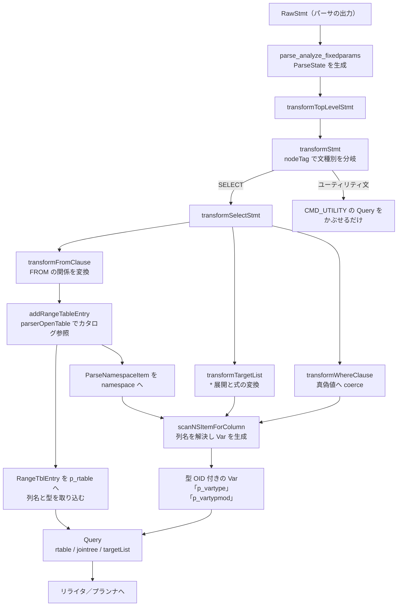

# 第11章 アナライザ（意味解析）

> **本章で読むソース**
>
> - [`src/backend/parser/analyze.c`](https://github.com/postgres/postgres/blob/REL_18_4/src/backend/parser/analyze.c)
> - [`src/backend/parser/parse_clause.c`](https://github.com/postgres/postgres/blob/REL_18_4/src/backend/parser/parse_clause.c)
> - [`src/backend/parser/parse_target.c`](https://github.com/postgres/postgres/blob/REL_18_4/src/backend/parser/parse_target.c)
> - [`src/backend/parser/parse_relation.c`](https://github.com/postgres/postgres/blob/REL_18_4/src/backend/parser/parse_relation.c)
> - [`src/include/nodes/parsenodes.h`](https://github.com/postgres/postgres/blob/REL_18_4/src/include/nodes/parsenodes.h)
> - [`src/include/parser/parse_node.h`](https://github.com/postgres/postgres/blob/REL_18_4/src/include/parser/parse_node.h)
> - [`src/include/nodes/primnodes.h`](https://github.com/postgres/postgres/blob/REL_18_4/src/include/nodes/primnodes.h)

## この章の狙い

第10章のパーサは、SQL 文字列を文法に従って `RawStmt` に組み立てた。
その段階では `SELECT name FROM users WHERE id = 1` の `users` が実在するテーブルなのか、`name` がその列なのか、`id = 1` の比較が型として成立するのかを、まだ誰も確かめていない。
パーサは文字列の構造だけを見ており、データベースの中身を一切参照しないからである。

本章で読む**アナライザ**（意味解析、parse analysis）は、その `RawStmt` を入力に取り、名前解決と型付けを済ませた `Query` ツリーへ変換する段である。
FROM 句に書かれた関係をカタログで引いて実在を確かめ、その列の名前と型を `Query` の中に取り込む。
ターゲットリストや WHERE 句の式に現れる列参照を、どのテーブルのどの列かに結び付け、列の型を持った `Var` ノードへ置き換える。
WHERE が真偽値になるか、`id = 1` の `=` がどの型の演算子かといった型の整合も、この段で決まる。

入口は `parse_analyze_fixedparams` であり、内部の中心は `transformStmt` の文種別ごとの分岐と、その代表例である `transformSelectStmt` である。
本章は、`SELECT` を例に取りながら、構文だけを見るパーサと、カタログを参照する意味解析との違いを追う。

## 前提

第10章で、字句解析と文法規則によって SQL 文字列が `RawStmt`（生のパースツリー）になるところまでを読んだ。
第9章で、シンプルクエリのメインループが `pg_parse_query` の次に `pg_analyze_and_rewrite` を呼び、解析と書き換えへ進む流れを見た。
本章はその `pg_analyze_and_rewrite` の前半、`RawStmt` から `Query` を作る部分にあたる。

意味解析はカタログ（`pg_class`、`pg_attribute`、`pg_type` など）を読む。
カタログとリレーションキャッシュ（relcache）の仕組み自体は第10部で詳しく扱うので、本章では「テーブルを開くとその列定義と型が手に入る」という事実の利用にとどめる。
解析の結果である `Query` がこのあとリライタとプランナへ渡る流れは、第12章以降で読む。

## 入口の `parse_analyze_fixedparams`

意味解析の入口は `parse_analyze_fixedparams` である。
`RawStmt` と元の SQL 文字列、それにプリペアド文で渡される `$n` パラメータの型情報を受け取り、`Query` を一つ返す。

[`src/backend/parser/analyze.c` L104-L135](https://github.com/postgres/postgres/blob/REL_18_4/src/backend/parser/analyze.c#L104-L135)

```c
Query *
parse_analyze_fixedparams(RawStmt *parseTree, const char *sourceText,
						  const Oid *paramTypes, int numParams,
						  QueryEnvironment *queryEnv)
{
	ParseState *pstate = make_parsestate(NULL);
	Query	   *query;
	JumbleState *jstate = NULL;

	Assert(sourceText != NULL); /* required as of 8.4 */

	pstate->p_sourcetext = sourceText;

	if (numParams > 0)
		setup_parse_fixed_parameters(pstate, paramTypes, numParams);

	pstate->p_queryEnv = queryEnv;

	query = transformTopLevelStmt(pstate, parseTree);

	if (IsQueryIdEnabled())
		jstate = JumbleQuery(query);

	if (post_parse_analyze_hook)
		(*post_parse_analyze_hook) (pstate, query, jstate);

	free_parsestate(pstate);

	pgstat_report_query_id(query->queryId, false);

	return query;
}
```

最初の `make_parsestate` が作る `ParseState` が、この段の作業領域である。
解析の途中で組み上げていく range table（後述）、名前空間、次に割り当てるターゲットの通し番号などを、すべてこの構造体が保持する。
変換の本体は `transformTopLevelStmt` に委ねられ、戻ってきた `Query` に対してクエリ ID の計算（`JumbleQuery`）と `post_parse_analyze_hook` の呼び出しが続く。
作業を終えると `free_parsestate` で `ParseState` を解放する。

`$n` パラメータの型をどう扱うかで入口は三つに分かれる。
`parse_analyze_fixedparams` は呼び出し側が型を固定して渡す場合、`parse_analyze_varparams` は `$n` の型を文脈から推論してよい場合、`parse_analyze_withcb` は呼び出し側が独自のパラメータ解決コールバックを持つ場合である。
三つとも本体は同じ `transformTopLevelStmt` を呼び、違いは `ParseState` へのパラメータ設定の作り方だけにある。

## `transformTopLevelStmt` と `transformStmt` の分岐

`transformTopLevelStmt` は、トップレベル特有の前処理を一つだけ行う。
`SELECT ... INTO` を `CREATE TABLE AS` へ読み替える処理であり、これはトップレベルでしか許されないため、再帰的な `transformStmt` に入る手前で済ませる。
そのうえで、変換し終えた `Query` に文の位置情報（`stmt_location`、`stmt_len`）を書き戻す。

[`src/backend/parser/analyze.c` L248-L260](https://github.com/postgres/postgres/blob/REL_18_4/src/backend/parser/analyze.c#L248-L260)

```c
Query *
transformTopLevelStmt(ParseState *pstate, RawStmt *parseTree)
{
	Query	   *result;

	/* We're at top level, so allow SELECT INTO */
	result = transformOptionalSelectInto(pstate, parseTree->stmt);

	result->stmt_location = parseTree->stmt_location;
	result->stmt_len = parseTree->stmt_len;

	return result;
}
```

変換の中心は `transformStmt` である。
これはパースツリーのノードタグ（`nodeTag`）で文種別を判別し、種別ごとの変換関数へ振り分ける。

[`src/backend/parser/analyze.c` L346-L428](https://github.com/postgres/postgres/blob/REL_18_4/src/backend/parser/analyze.c#L346-L428)

```c
	switch (nodeTag(parseTree))
	{
			/*
			 * Optimizable statements
			 */
		case T_InsertStmt:
			result = transformInsertStmt(pstate, (InsertStmt *) parseTree);
			break;

		case T_DeleteStmt:
			result = transformDeleteStmt(pstate, (DeleteStmt *) parseTree);
			break;

		case T_UpdateStmt:
			result = transformUpdateStmt(pstate, (UpdateStmt *) parseTree);
			break;

		case T_MergeStmt:
			result = transformMergeStmt(pstate, (MergeStmt *) parseTree);
			break;

		case T_SelectStmt:
			{
				SelectStmt *n = (SelectStmt *) parseTree;

				if (n->valuesLists)
					result = transformValuesClause(pstate, n);
				else if (n->op == SETOP_NONE)
					result = transformSelectStmt(pstate, n);
				else
					result = transformSetOperationStmt(pstate, n);
			}
			break;

		case T_ReturnStmt:
			result = transformReturnStmt(pstate, (ReturnStmt *) parseTree);
			break;

		case T_PLAssignStmt:
			result = transformPLAssignStmt(pstate,
										   (PLAssignStmt *) parseTree);
			break;

			/*
			 * Special cases
			 */
		case T_DeclareCursorStmt:
			result = transformDeclareCursorStmt(pstate,
												(DeclareCursorStmt *) parseTree);
			break;

		case T_ExplainStmt:
			result = transformExplainStmt(pstate,
										  (ExplainStmt *) parseTree);
			break;

		case T_CreateTableAsStmt:
			result = transformCreateTableAsStmt(pstate,
												(CreateTableAsStmt *) parseTree);
			break;

		case T_CallStmt:
			result = transformCallStmt(pstate,
									   (CallStmt *) parseTree);
			break;

		default:

			/*
			 * other statements don't require any transformation; just return
			 * the original parsetree with a Query node plastered on top.
			 */
			result = makeNode(Query);
			result->commandType = CMD_UTILITY;
			result->utilityStmt = (Node *) parseTree;
			break;
	}

	/* Mark as original query until we learn differently */
	result->querySource = QSRC_ORIGINAL;
	result->canSetTag = true;

	return result;
```

分岐は二つの群に分かれる。
`INSERT`、`DELETE`、`UPDATE`、`MERGE`、`SELECT` は「最適化可能文」（optimizable statement）であり、それぞれ専用の変換関数が名前解決と型付けを行って中身の詰まった `Query` を組み立てる。
`SELECT` はさらに、`VALUES` 句かどうか、集合演算（`UNION` など）かどうかで三つの関数に分かれる。

これに対し `default` のラベルが受けるのは、`CREATE TABLE` や `GRANT` のようなユーティリティ文である。
ここでは変換を行わず、元のパースツリーをそのまま `utilityStmt` に格納し、`commandType` を `CMD_UTILITY` にした空の `Query` をかぶせるだけで返す。
ユーティリティ文の意味づけは、実行段（プロセスユーティリティ）まで遅延される。
意味解析が本格的に働くのは最適化可能文に限られると言ってよい。

## `transformSelectStmt` を読む

最適化可能文の代表として `SELECT` を見る。
`transformSelectStmt` は新しい `Query` を作り、`SelectStmt` の各句を順に変換しながらそのフィールドを埋めていく。
句の処理順には依存関係があり、たとえば FROM 句を先に処理して関係を可視にしてからでないと、ターゲットリストや WHERE 句の列参照を解決できない。

[`src/backend/parser/analyze.c` L1419-L1435](https://github.com/postgres/postgres/blob/REL_18_4/src/backend/parser/analyze.c#L1419-L1435)

```c
	/* process the FROM clause */
	transformFromClause(pstate, stmt->fromClause);

	/* transform targetlist */
	qry->targetList = transformTargetList(pstate, stmt->targetList,
										  EXPR_KIND_SELECT_TARGET);

	/* mark column origins */
	markTargetListOrigins(pstate, qry->targetList);

	/* transform WHERE */
	qual = transformWhereClause(pstate, stmt->whereClause,
								EXPR_KIND_WHERE, "WHERE");

	/* initial processing of HAVING clause is much like WHERE clause */
	qry->havingQual = transformWhereClause(pstate, stmt->havingClause,
										   EXPR_KIND_HAVING, "HAVING");
```

FROM 句、ターゲットリスト、WHERE 句がこの順に変換される。
このあと ORDER BY、GROUP BY、DISTINCT、LIMIT、ウィンドウ句の変換が続き、最後に組み上がった作業状態を `Query` へ移す。

[`src/backend/parser/analyze.c` L1500-L1521](https://github.com/postgres/postgres/blob/REL_18_4/src/backend/parser/analyze.c#L1500-L1521)

```c
	qry->rtable = pstate->p_rtable;
	qry->rteperminfos = pstate->p_rteperminfos;
	qry->jointree = makeFromExpr(pstate->p_joinlist, qual);

	qry->hasSubLinks = pstate->p_hasSubLinks;
	qry->hasWindowFuncs = pstate->p_hasWindowFuncs;
	qry->hasTargetSRFs = pstate->p_hasTargetSRFs;
	qry->hasAggs = pstate->p_hasAggs;

	foreach(l, stmt->lockingClause)
	{
		transformLockingClause(pstate, qry,
							   (LockingClause *) lfirst(l), false);
	}

	assign_query_collations(pstate, qry);

	/* this must be done after collations, for reliable comparison of exprs */
	if (pstate->p_hasAggs || qry->groupClause || qry->groupingSets || qry->havingQual)
		parseCheckAggregates(pstate, qry);

	return qry;
```

ここで `ParseState` に溜め込んだ range table（`p_rtable`）が `Query` の `rtable` に移される。
FROM 句で見た関係の並びと WHERE の条件（`qual`）が `makeFromExpr` で結合ツリー（`jointree`）にまとまり、`Query` の中核ができあがる。
`hasAggs` や `hasSubLinks` のような真偽値は、変換の途中で集約関数やサブクエリを見つけたときに `ParseState` 側に立てておいたフラグであり、それをまとめて `Query` へ写している。

## FROM 句の変換と range table への登録

`transformFromClause` は FROM のリストを左から順に処理し、各項目を range table へ登録しながら名前空間（namespace）と結合リストへ加える。

[`src/backend/parser/parse_clause.c` L111-L151](https://github.com/postgres/postgres/blob/REL_18_4/src/backend/parser/parse_clause.c#L111-L151)

```c
void
transformFromClause(ParseState *pstate, List *frmList)
{
	ListCell   *fl;

	/*
	 * The grammar will have produced a list of RangeVars, RangeSubselects,
	 * RangeFunctions, and/or JoinExprs. Transform each one (possibly adding
	 * entries to the rtable), check for duplicate refnames, and then add it
	 * to the joinlist and namespace.
	 *
	 * Note we must process the items left-to-right for proper handling of
	 * LATERAL references.
	 */
	foreach(fl, frmList)
	{
		Node	   *n = lfirst(fl);
		ParseNamespaceItem *nsitem;
		List	   *namespace;

		n = transformFromClauseItem(pstate, n,
									&nsitem,
									&namespace);

		checkNameSpaceConflicts(pstate, pstate->p_namespace, namespace);

		/* Mark the new namespace items as visible only to LATERAL */
		setNamespaceLateralState(namespace, true, true);

		pstate->p_joinlist = lappend(pstate->p_joinlist, n);
		pstate->p_namespace = list_concat(pstate->p_namespace, namespace);
	}

	/*
	 * We're done parsing the FROM list, so make all namespace items
	 * unconditionally visible.  Note that this will also reset lateral_only
	 * for any namespace items that were already present when we were called;
	 * but those should have been that way already.
	 */
	setNamespaceLateralState(pstate->p_namespace, false, true);
}
```

`transformFromClauseItem` がテーブル参照（`RangeVar`）や副問い合わせ、関数、結合といった各形を変換する。
このうちテーブル参照の場合に、カタログ参照の核心である `addRangeTableEntry` に至る。

`addRangeTableEntry` は、テーブル名から `RangeTblEntry`（range table の1項目、RTE と略す）を作る。
ここが構文だけを見るパーサとの最大の違いである。

[`src/backend/parser/parse_relation.c` L1487-L1529](https://github.com/postgres/postgres/blob/REL_18_4/src/backend/parser/parse_relation.c#L1487-L1529)

```c
addRangeTableEntry(ParseState *pstate,
				   RangeVar *relation,
				   Alias *alias,
				   bool inh,
				   bool inFromCl)
{
	RangeTblEntry *rte = makeNode(RangeTblEntry);
	RTEPermissionInfo *perminfo;
	char	   *refname = alias ? alias->aliasname : relation->relname;
	LOCKMODE	lockmode;
	Relation	rel;
	ParseNamespaceItem *nsitem;

	Assert(pstate != NULL);

	rte->rtekind = RTE_RELATION;
	rte->alias = alias;

	/*
	 * Identify the type of lock we'll need on this relation.  It's not the
	 * query's target table (that case is handled elsewhere), so we need
	 * either RowShareLock if it's locked by FOR UPDATE/SHARE, or plain
	 * AccessShareLock otherwise.
	 */
	lockmode = isLockedRefname(pstate, refname) ? RowShareLock : AccessShareLock;

	/*
	 * Get the rel's OID.  This access also ensures that we have an up-to-date
	 * relcache entry for the rel.  Since this is typically the first access
	 * to a rel in a statement, we must open the rel with the proper lockmode.
	 */
	rel = parserOpenTable(pstate, relation, lockmode);
	rte->relid = RelationGetRelid(rel);
	rte->inh = inh;
	rte->relkind = rel->rd_rel->relkind;
	rte->rellockmode = lockmode;

	/*
	 * Build the list of effective column names using user-supplied aliases
	 * and/or actual column names.
	 */
	rte->eref = makeAlias(refname, NIL);
	buildRelationAliases(rel->rd_att, alias, rte->eref);
```

`parserOpenTable` がテーブルを開き、その OID と列定義（`rel->rd_att`、TupleDesc）を手に入れる。
取れた OID は `rte->relid` に、列名は `buildRelationAliases` によって RTE の `eref` に格納される。
ここで初めて、SQL に書かれた名前がカタログ上の実体に結び付く。

テーブルを開く `parserOpenTable` は、名前を引けなかったとき、構文エラーではなく「リレーションが存在しない」というエラーを返す。

[`src/backend/parser/parse_relation.c` L1434-L1474](https://github.com/postgres/postgres/blob/REL_18_4/src/backend/parser/parse_relation.c#L1434-L1474)

```c
Relation
parserOpenTable(ParseState *pstate, const RangeVar *relation, int lockmode)
{
	Relation	rel;
	ParseCallbackState pcbstate;

	setup_parser_errposition_callback(&pcbstate, pstate, relation->location);
	rel = table_openrv_extended(relation, lockmode, true);
	if (rel == NULL)
	{
		if (relation->schemaname)
			ereport(ERROR,
					(errcode(ERRCODE_UNDEFINED_TABLE),
					 errmsg("relation \"%s.%s\" does not exist",
							relation->schemaname, relation->relname)));
		else
		{
			/*
			 * An unqualified name might have been meant as a reference to
			 * some not-yet-in-scope CTE.  The bare "does not exist" message
			 * has proven remarkably unhelpful for figuring out such problems,
			 * so we take pains to offer a specific hint.
			 */
			if (isFutureCTE(pstate, relation->relname))
				ereport(ERROR,
						(errcode(ERRCODE_UNDEFINED_TABLE),
						 errmsg("relation \"%s\" does not exist",
								relation->relname),
						 errdetail("There is a WITH item named \"%s\", but it cannot be referenced from this part of the query.",
								   relation->relname),
						 errhint("Use WITH RECURSIVE, or re-order the WITH items to remove forward references.")));
			else
				ereport(ERROR,
						(errcode(ERRCODE_UNDEFINED_TABLE),
						 errmsg("relation \"%s\" does not exist",
								relation->relname)));
		}
	}
	cancel_parser_errposition_callback(&pcbstate);
	return rel;
}
```

文法上は正しい `SELECT * FROM no_such_table` が、ここで初めて落ちる。
パーサはこの文を問題なく `RawStmt` にできてしまう。
名前がカタログの実体を指すかどうかは、意味解析でしか分からないからである。

登録の結果として作られる `ParseNamespaceItem` が、その関係を以後の式の中から参照できるようにする手がかりとなる。
これは RTE そのものではなく、RTE と、その range table 内での添字（`p_rtindex`）と、列ごとの解決用データ（`p_nscolumns`）をひとまとめにした、解析中だけの作業用構造体である。

[`src/include/parser/parse_node.h` L292-L305](https://github.com/postgres/postgres/blob/REL_18_4/src/include/parser/parse_node.h#L292-L305)

```c
struct ParseNamespaceItem
{
	Alias	   *p_names;		/* Table and column names */
	RangeTblEntry *p_rte;		/* The relation's rangetable entry */
	int			p_rtindex;		/* The relation's index in the rangetable */
	RTEPermissionInfo *p_perminfo;	/* The relation's rteperminfos entry */
	/* array of same length as p_names->colnames: */
	ParseNamespaceColumn *p_nscolumns;	/* per-column data */
	bool		p_rel_visible;	/* Relation name is visible? */
	bool		p_cols_visible; /* Column names visible as unqualified refs? */
	bool		p_lateral_only; /* Is only visible to LATERAL expressions? */
	bool		p_lateral_ok;	/* If so, does join type allow use? */
	VarReturningType p_returning_type;	/* Is OLD/NEW for use in RETURNING? */
};
```

`p_nscolumns` は列ごとに型 OID（`p_vartype`）と型修飾子（`p_vartypmod`）と照合順序を保持する。
これらは `addRangeTableEntry` でテーブルを開いたときに、TupleDesc から取った値で埋められる。
列参照の解決で `Var` を組み立てるとき、この配列から型を読み出す。

## ターゲットリストの変換

`transformTargetList` は、`SELECT` のあとに並ぶ式（`ResTarget` のリスト）を `TargetEntry` のリストへ変換する。

[`src/backend/parser/parse_target.c` L120-L203](https://github.com/postgres/postgres/blob/REL_18_4/src/backend/parser/parse_target.c#L120-L203)

```c
List *
transformTargetList(ParseState *pstate, List *targetlist,
					ParseExprKind exprKind)
{
	List	   *p_target = NIL;
	bool		expand_star;
	ListCell   *o_target;

	/* Shouldn't have any leftover multiassign items at start */
	Assert(pstate->p_multiassign_exprs == NIL);

	/* Expand "something.*" in SELECT and RETURNING, but not UPDATE */
	expand_star = (exprKind != EXPR_KIND_UPDATE_SOURCE);

	foreach(o_target, targetlist)
	{
		ResTarget  *res = (ResTarget *) lfirst(o_target);

		/*
		 * Check for "something.*".  Depending on the complexity of the
		 * "something", the star could appear as the last field in ColumnRef,
		 * or as the last indirection item in A_Indirection.
		 */
		if (expand_star)
		{
			if (IsA(res->val, ColumnRef))
			{
				ColumnRef  *cref = (ColumnRef *) res->val;

				if (IsA(llast(cref->fields), A_Star))
				{
					/* It is something.*, expand into multiple items */
					p_target = list_concat(p_target,
										   ExpandColumnRefStar(pstate,
															   cref,
															   true));
					continue;
				}
			}
			else if (IsA(res->val, A_Indirection))
			{
				A_Indirection *ind = (A_Indirection *) res->val;

				if (IsA(llast(ind->indirection), A_Star))
				{
					/* It is something.*, expand into multiple items */
					p_target = list_concat(p_target,
										   ExpandIndirectionStar(pstate,
																 ind,
																 true,
																 exprKind));
					continue;
				}
			}
		}

		/*
		 * Not "something.*", or we want to treat that as a plain whole-row
		 * variable, so transform as a single expression
		 */
		p_target = lappend(p_target,
						   transformTargetEntry(pstate,
												res->val,
												NULL,
												exprKind,
												res->name,
												false));
	}

	/*
	 * If any multiassign resjunk items were created, attach them to the end
	 * of the targetlist.  This should only happen in an UPDATE tlist.  We
	 * don't need to worry about numbering of these items; transformUpdateStmt
	 * will set their resnos.
	 */
	if (pstate->p_multiassign_exprs)
	{
		Assert(exprKind == EXPR_KIND_UPDATE_SOURCE);
		p_target = list_concat(p_target, pstate->p_multiassign_exprs);
		pstate->p_multiassign_exprs = NIL;
	}

	return p_target;
}
```

ターゲットリストの最初の仕事は `*` の展開である。
`SELECT *` や `SELECT users.*` の `*` は、FROM 句で登録した関係の列を一つずつ並べたものへ広げられる。
この展開ができるのも、FROM 句の変換で各関係の列名が namespace に揃っているからである。

`*` でない式は `transformTargetEntry` が `TargetEntry` 一つに変換する。

[`src/backend/parser/parse_target.c` L74-L109](https://github.com/postgres/postgres/blob/REL_18_4/src/backend/parser/parse_target.c#L74-L109)

```c
TargetEntry *
transformTargetEntry(ParseState *pstate,
					 Node *node,
					 Node *expr,
					 ParseExprKind exprKind,
					 char *colname,
					 bool resjunk)
{
	/* Transform the node if caller didn't do it already */
	if (expr == NULL)
	{
		/*
		 * If it's a SetToDefault node and we should allow that, pass it
		 * through unmodified.  (transformExpr will throw the appropriate
		 * error if we're disallowing it.)
		 */
		if (exprKind == EXPR_KIND_UPDATE_SOURCE && IsA(node, SetToDefault))
			expr = node;
		else
			expr = transformExpr(pstate, node, exprKind);
	}

	if (colname == NULL && !resjunk)
	{
		/*
		 * Generate a suitable column name for a column without any explicit
		 * 'AS ColumnName' clause.
		 */
		colname = FigureColname(node);
	}

	return makeTargetEntry((Expr *) expr,
						   (AttrNumber) pstate->p_next_resno++,
						   colname,
						   resjunk);
}
```

中身は `transformExpr` への委譲である。
`transformExpr` が式の中の列参照や演算子を解決し、型の付いた式ツリーを返す。
そのうえで、`AS` の付かない列に出力名を補い（`FigureColname`）、`p_next_resno` から取った通し番号を `resno` に割り当てて `TargetEntry` を作る。

出来上がる `TargetEntry` は、評価する式と、出力上の列番号、列名を持つ。

[`src/include/nodes/primnodes.h` L2221-L2238](https://github.com/postgres/postgres/blob/REL_18_4/src/include/nodes/primnodes.h#L2221-L2238)

```c
typedef struct TargetEntry
{
	Expr		xpr;
	/* expression to evaluate */
	Expr	   *expr;
	/* attribute number (see notes above) */
	AttrNumber	resno;
	/* name of the column (could be NULL) */
	char	   *resname pg_node_attr(query_jumble_ignore);
	/* nonzero if referenced by a sort/group clause */
	Index		ressortgroupref;
	/* OID of column's source table */
	Oid			resorigtbl pg_node_attr(query_jumble_ignore);
	/* column's number in source table */
	AttrNumber	resorigcol pg_node_attr(query_jumble_ignore);
	/* set to true to eliminate the attribute from final target list */
	bool		resjunk pg_node_attr(query_jumble_ignore);
} TargetEntry;
```

`resorigtbl` と `resorigcol` は、その列が基底テーブルのどの列を素直に指しているかを記録する。
これらは `transformSelectStmt` の `markTargetListOrigins` が埋め、列の出自を後段に伝える。

## 列参照の解決と型付け

ターゲットリストや WHERE 句に書かれた `id` のような列名は、`transformExpr` の中の `transformColumnRef` を経て、最終的に `scanNSItemForColumn` で `Var` に変換される。
ここが名前解決と型付けが一体になって起きる場所である。

[`src/backend/parser/parse_relation.c` L688-L704](https://github.com/postgres/postgres/blob/REL_18_4/src/backend/parser/parse_relation.c#L688-L704)

```c
scanNSItemForColumn(ParseState *pstate, ParseNamespaceItem *nsitem,
					int sublevels_up, const char *colname, int location)
{
	RangeTblEntry *rte = nsitem->p_rte;
	int			attnum;
	Var		   *var;

	/*
	 * Scan the nsitem's column names (or aliases) for a match.  Complain if
	 * multiple matches.
	 */
	attnum = scanRTEForColumn(pstate, rte, nsitem->p_names,
							  colname, location,
							  0, NULL);

	if (attnum == InvalidAttrNumber)
		return NULL;			/* Return NULL if no match */
```

列名を namespace の中で探し、属性番号（`attnum`）を得る。
見つかれば、その属性番号から `p_nscolumns` の該当エントリを引き、そこに入っている型 OID と型修飾子と照合順序を使って `Var` を組み立てる。

[`src/backend/parser/parse_relation.c` L753-L761](https://github.com/postgres/postgres/blob/REL_18_4/src/backend/parser/parse_relation.c#L753-L761)

```c
		var = makeVar(nscol->p_varno,
					  nscol->p_varattno,
					  nscol->p_vartype,
					  nscol->p_vartypmod,
					  nscol->p_varcollid,
					  sublevels_up);
		/* makeVar doesn't offer parameters for these, so set them by hand: */
		var->varnosyn = nscol->p_varnosyn;
		var->varattnosyn = nscol->p_varattnosyn;
```

`makeVar` の第3、第4引数に渡る `p_vartype` と `p_vartypmod` が、その列の型である。
これらはカタログから取った値であり、SQL 文字列のどこにも書かれていない。
意味解析が `Var` に型を埋め込むことで、その上に立つ演算子（`id = 1` の `=` など）をどの型のものに解決するか、WHERE 全体が真偽値になるかといった判断が可能になる。
WHERE 句の `transformWhereClause` は、式を変換したあと `coerce_to_boolean` で結果を真偽値へ強制する。

[`src/backend/parser/parse_clause.c` L1853-L1867](https://github.com/postgres/postgres/blob/REL_18_4/src/backend/parser/parse_clause.c#L1853-L1867)

```c
Node *
transformWhereClause(ParseState *pstate, Node *clause,
					 ParseExprKind exprKind, const char *constructName)
{
	Node	   *qual;

	if (clause == NULL)
		return NULL;

	qual = transformExpr(pstate, clause, exprKind);

	qual = coerce_to_boolean(pstate, qual, constructName);

	return qual;
}
```

`WHERE length(name)` のように真偽値でない式を書けば、ここで型エラーになる。
文法上は通っても意味として通らない例であり、構文解析だけでは検出できない。

## 変換の全体像

ここまでの流れを一つの図にまとめる。
`RawStmt` が名前解決と型付けを経て `Query` になるまでの、`SELECT` を例にした変換である。



## 高速化と設計の工夫

意味解析の設計上の工夫は、関係を一度開いて得た列の型情報を `ParseNamespaceItem` の `p_nscolumns` 配列にまとめて持ち、列参照のたびにそこから定数時間で引く点にある。

仕組みはこうである。
FROM 句で関係を登録する `addRangeTableEntry` が、テーブルを一度だけ開き、TupleDesc から全列の型 OID と型修飾子と照合順序を取り出して `p_nscolumns` に配列として並べる。
そのあとターゲットリストや WHERE 句で `id` のような列参照を解決するとき、`scanNSItemForColumn` は名前から属性番号を引き当て、`p_nscolumns[attnum - 1]` を読むだけで型が手に入る。
列が何度参照されても、テーブルを開き直したりカタログを引き直したりしない。
列の型はクエリ1本のあいだ変わらないので、関係ごとに一度だけ型を取り、添字でアクセスできる配列に展開しておくのが、参照の多い式の変換では効く。

照合順序の確定を式の変換と分けている点も、同じ発想の工夫である。
`transformSelectStmt` の末尾で `assign_query_collations` をまとめて呼び、変換し終えた `Query` 全体に対して照合順序を一度に割り当てる。
さらにそのコメント（L1517）が示すとおり、集約の検査（`parseCheckAggregates`）は照合順序の確定後に回す。
式の比較を確実に行うには照合順序が揃っている必要があり、各式の変換時に逐次決めるのではなく、ツリーが揃ってから一括で決めることで、順序依存を避けている。

## まとめ

アナライザは `RawStmt` を `Query` へ変換する段であり、構文だけを見るパーサと違って、カタログを参照して名前解決と型付けを行う。

入口の `parse_analyze_fixedparams` が `ParseState` を用意し、`transformStmt` が文種別ごとに変換関数へ振り分ける。
最適化可能文だけが本格的な意味解析を受け、ユーティリティ文は変換されずに `CMD_UTILITY` の `Query` をかぶせて通される。

`SELECT` の変換では、FROM 句が関係を range table に登録するときにテーブルを開いて列の型を取り込み、ターゲットリストと WHERE 句の列参照がその型情報を使って `Var` へ解決される。
存在しないテーブルや列、真偽値にならない WHERE は、この段で初めてエラーになる。
出来上がった `Query` は range table、結合ツリー、ターゲットリストを備え、次のリライタとプランナへ渡る。

## 関連する章

- [第10章 パーサ](10-parser.md)
- [第12章 リライタとルールシステム](12-rewriter.md)
- [第13章 プランナの全体像](13-planner-overview.md)
