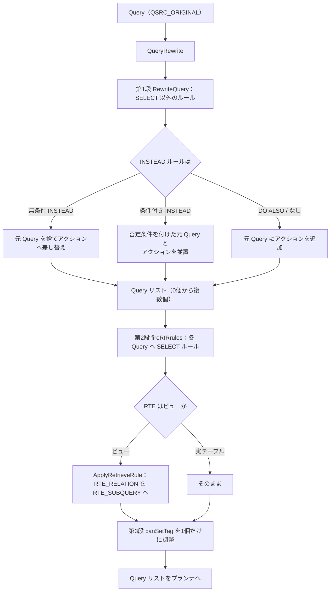

# 第12章 リライタとルールシステム

> **本章で読むソース**
>
> - [`src/backend/rewrite/rewriteHandler.c`](https://github.com/postgres/postgres/blob/REL_18_4/src/backend/rewrite/rewriteHandler.c)
> - [`src/include/rewrite/rewriteHandler.h`](https://github.com/postgres/postgres/blob/REL_18_4/src/include/rewrite/rewriteHandler.h)
> - [`src/include/rewrite/prs2lock.h`](https://github.com/postgres/postgres/blob/REL_18_4/src/include/rewrite/prs2lock.h)
> - [`src/include/nodes/parsenodes.h`](https://github.com/postgres/postgres/blob/REL_18_4/src/include/nodes/parsenodes.h)

## この章の狙い

第11章で、パーサが組み立てた生の構文木をアナライザが意味解析し、テーブルや列を解決した `Query` ツリーが得られた。
この `Query` はまだプランナにかけられない。
ビュー参照は実テーブルではないし、テーブルに `CREATE RULE` で定義したルールが付いていれば、書き込み先や追加の問い合わせが変わりうる。
これらを解決して、プランナがそのまま扱える形に `Query` を変換するのが**リライタ**である。

本章はリライタの入口 `QueryRewrite` から読み、二つの仕事を追う。
一つは**ルールの発火**であり、テーブルに付いた `INSERT`／`UPDATE`／`DELETE` ルールを `Query` に適用して、別の問い合わせへ差し替えたり、追加の問い合わせを生んだりする。
もう一つは**ビューの展開**であり、ビュー参照をその定義問い合わせ（サブクエリ）へ置き換える。

リライタの出力は1個の `Query` ではなく `Query` の**リスト**である。
ルールによって1個の問い合わせが0個にも複数個にもなりうるからだ。
本章は、なぜリストになるのか、ビューがどの仕組みでサブクエリへ化けるのか、そしてこの段がプランナの最適化にどう効くのかを読む。

## 前提

第10章でパーサ、第11章でアナライザを読み、`Query` ツリーの構造を前提とする。
リライタが触る範囲テーブル（range table）は `Query` の `rtable` フィールドに並ぶ `RangeTblEntry`（以下 RTE）のリストであり、各 RTE が `rtekind` で種別を持つ。
ビュー参照は当初、実テーブルと同じ `RTE_RELATION` として `rtable` に入っている。
ルールはカタログ `pg_rewrite` に格納され、リレーションを開いたときに `RuleLock` としてキャッシュへ載る。

## 入口の `QueryRewrite`

リライタの入口は `QueryRewrite` である。
受け取るのはアナライザが返したトップレベルの `Query` 1個で、返すのは `Query` のリストだ。

[`src/backend/rewrite/rewriteHandler.c` L4634-L4675](https://github.com/postgres/postgres/blob/REL_18_4/src/backend/rewrite/rewriteHandler.c#L4634-L4675)

```c
List *
QueryRewrite(Query *parsetree)
{
	int64		input_query_id = parsetree->queryId;
	List	   *querylist;
	List	   *results;
	ListCell   *l;
	CmdType		origCmdType;
	bool		foundOriginalQuery;
	Query	   *lastInstead;

	/*
	 * This function is only applied to top-level original queries
	 */
	Assert(parsetree->querySource == QSRC_ORIGINAL);
	Assert(parsetree->canSetTag);

	/*
	 * Step 1
	 *
	 * Apply all non-SELECT rules possibly getting 0 or many queries
	 */
	querylist = RewriteQuery(parsetree, NIL, 0, 0);

	/*
	 * Step 2
	 *
	 * Apply all the RIR rules on each query
	 *
	 * This is also a handy place to mark each query with the original queryId
	 */
	results = NIL;
	foreach(l, querylist)
	{
		Query	   *query = (Query *) lfirst(l);

		query = fireRIRrules(query, NIL);

		query->queryId = input_query_id;

		results = lappend(results, query);
	}
```

処理は3段に分かれる。
第1段の `RewriteQuery` が `SELECT` 以外のルール（`INSERT`／`UPDATE`／`DELETE`／`MERGE` に対するルール）を適用し、ここで `Query` が0個にも複数個にもなりうる。
第2段は、第1段が返した各 `Query` に対して `fireRIRrules` を呼び、ビュー参照などの `SELECT` ルールを展開する。
入口の冒頭にある `Assert` が示すとおり、`QueryRewrite` はトップレベルの元問い合わせ（`QSRC_ORIGINAL`）だけに適用される。

第3段は、結果リストのうちどの `Query` がコマンドの結果タグ（`INSERT 0 1` のような応答）を決めるかを定める。
元問い合わせがリストに残っていればそれがタグを決め、残っていなければ同種の最後の INSTEAD 問い合わせがタグを決める。

[`src/backend/rewrite/rewriteHandler.c` L4693-L4724](https://github.com/postgres/postgres/blob/REL_18_4/src/backend/rewrite/rewriteHandler.c#L4693-L4724)

```c
	origCmdType = parsetree->commandType;
	foundOriginalQuery = false;
	lastInstead = NULL;

	foreach(l, results)
	{
		Query	   *query = (Query *) lfirst(l);

		if (query->querySource == QSRC_ORIGINAL)
		{
			Assert(query->canSetTag);
			Assert(!foundOriginalQuery);
			foundOriginalQuery = true;
#ifndef USE_ASSERT_CHECKING
			break;
#endif
		}
		else
		{
			Assert(!query->canSetTag);
			if (query->commandType == origCmdType &&
				(query->querySource == QSRC_INSTEAD_RULE ||
				 query->querySource == QSRC_QUAL_INSTEAD_RULE))
				lastInstead = query;
		}
	}

	if (!foundOriginalQuery && lastInstead != NULL)
		lastInstead->canSetTag = true;

	return results;
}
```

各 `Query` がどう生まれたかは `querySource` フィールドに記録される。
このフィールドの値は次の `QuerySource` 列挙で定義される。

[`src/include/nodes/parsenodes.h` L34-L41](https://github.com/postgres/postgres/blob/REL_18_4/src/include/nodes/parsenodes.h#L34-L41)

```c
typedef enum QuerySource
{
	QSRC_ORIGINAL,				/* original parsetree (explicit query) */
	QSRC_PARSER,				/* added by parse analysis (now unused) */
	QSRC_INSTEAD_RULE,			/* added by unconditional INSTEAD rule */
	QSRC_QUAL_INSTEAD_RULE,		/* added by conditional INSTEAD rule */
	QSRC_NON_INSTEAD_RULE,		/* added by non-INSTEAD rule */
} QuerySource;
```

ユーザーが書いた問い合わせは `QSRC_ORIGINAL`、ルールが生んだ問い合わせは INSTEAD か否か、条件付きか否かで残り3種に分かれる。
第3段の判定はこの値を頼りに、結果リストのうち高々1個だけが `canSetTag` を持つように調整する。

## ルールの表現と発火

ルールは `pg_rewrite` に格納され、リレーションを開くと `RewriteRule` の配列としてリレーションキャッシュに載る。
1個のルールは次の構造体で表される。

[`src/include/rewrite/prs2lock.h` L24-L44](https://github.com/postgres/postgres/blob/REL_18_4/src/include/rewrite/prs2lock.h#L24-L44)

```c
typedef struct RewriteRule
{
	Oid			ruleId;
	CmdType		event;
	Node	   *qual;
	List	   *actions;
	char		enabled;
	bool		isInstead;
} RewriteRule;

/*
 * RuleLock -
 *	  all rules that apply to a particular relation. Even though we only
 *	  have the rewrite rule system left and these are not really "locks",
 *	  the name is kept for historical reasons.
 */
typedef struct RuleLock
{
	int			numLocks;
	RewriteRule **rules;
} RuleLock;
```

`event` がルールの対象コマンド（`SELECT`／`INSERT`／`UPDATE`／`DELETE`）、`actions` が発火時に実行する問い合わせのリスト、`isInstead` が INSTEAD ルールか否かを表す。
`qual` は条件付きルール（`WHERE` 付き）の条件式で、無条件ルールでは `NULL` になる。
構造体名と型名に残る「lock」は歴史的な名残であり、コメントが明記するとおり実体はルールの集合である。

`SELECT` 以外のルールを発火させる中心が `fireRules` である。
適用すべきルールのリストを順にたどり、各ルールの種別を見て、結果として実行する問い合わせ（アクション）を組み立てて返す。

[`src/backend/rewrite/rewriteHandler.c` L2457-L2536](https://github.com/postgres/postgres/blob/REL_18_4/src/backend/rewrite/rewriteHandler.c#L2457-L2536)

```c
static List *
fireRules(Query *parsetree,
		  int rt_index,
		  CmdType event,
		  List *locks,
		  bool *instead_flag,
		  bool *returning_flag,
		  Query **qual_product)
{
	List	   *results = NIL;
	ListCell   *l;

	foreach(l, locks)
	{
		RewriteRule *rule_lock = (RewriteRule *) lfirst(l);
		Node	   *event_qual = rule_lock->qual;
		List	   *actions = rule_lock->actions;
		QuerySource qsrc;
		ListCell   *r;

		/* Determine correct QuerySource value for actions */
		if (rule_lock->isInstead)
		{
			if (event_qual != NULL)
				qsrc = QSRC_QUAL_INSTEAD_RULE;
			else
			{
				qsrc = QSRC_INSTEAD_RULE;
				*instead_flag = true;	/* report unqualified INSTEAD */
			}
		}
		else
			qsrc = QSRC_NON_INSTEAD_RULE;

		if (qsrc == QSRC_QUAL_INSTEAD_RULE)
		{
			/*
			 * If there are INSTEAD rules with qualifications, the original
			 * query is still performed. But all the negated rule
			 * qualifications of the INSTEAD rules are added so it does its
			 * actions only in cases where the rule quals of all INSTEAD rules
			 * are false. Think of it as the default action in a case. We save
			 * this in *qual_product so RewriteQuery() can add it to the query
			 * list after we mangled it up enough.
			 *
			 * If we have already found an unqualified INSTEAD rule, then
			 * *qual_product won't be used, so don't bother building it.
			 */
			if (!*instead_flag)
			{
				if (*qual_product == NULL)
					*qual_product = copyObject(parsetree);
				*qual_product = CopyAndAddInvertedQual(*qual_product,
													   event_qual,
													   rt_index,
													   event);
			}
		}

		/* Now process the rule's actions and add them to the result list */
		foreach(r, actions)
		{
			Query	   *rule_action = lfirst(r);

			if (rule_action->commandType == CMD_NOTHING)
				continue;

			rule_action = rewriteRuleAction(parsetree, rule_action,
											event_qual, rt_index, event,
											returning_flag);

			rule_action->querySource = qsrc;
			rule_action->canSetTag = false; /* might change later */

			results = lappend(results, rule_action);
		}
	}

	return results;
}
```

ルールの種別ごとの扱いは、`isInstead` と `qual`（条件式）の有無で3通りに分かれる。

無条件 INSTEAD ルール（`isInstead` が真で `qual` が `NULL`）は、`instead_flag` を立てる。
このフラグが立つと、呼び出し元の `RewriteQuery` は元問い合わせをいっさい実行しない。
元の `DELETE` を別のテーブルへの `INSERT` に丸ごと差し替える、といった置き換えがこれで成立する。

条件付き INSTEAD ルール（`qual` が非 `NULL`）は、元問い合わせを捨てない。
代わりに、すべての INSTEAD 条件を否定して AND したものを元問い合わせに付け足し、`qual_product` として保存する。
コメントが言う「`case` の `default` 節」がこれで、条件に当てはまる行はルールのアクションが、当てはまらない行は元問い合わせが処理する。

非 INSTEAD ルール（`isInstead` が偽、`DO ALSO`）は、`instead_flag` も `qual_product` も触らない。
アクションを `results` に足すだけで、元問い合わせと並んで追加実行される。
いずれの種別でも、アクションは `rewriteRuleAction` を通して元問い合わせの条件や対象に合わせて調整され、`querySource` を付けて返される。

`fireRules` を呼ぶ `RewriteQuery` 側は、得たアクション（`product_queries`）を再帰的に `RewriteQuery` へ通し、最後に元問い合わせの扱いを `instead` フラグに従って決める。

[`src/backend/rewrite/rewriteHandler.c` L4451-L4467](https://github.com/postgres/postgres/blob/REL_18_4/src/backend/rewrite/rewriteHandler.c#L4451-L4467)

```c
	if (!instead)
	{
		if (parsetree->commandType == CMD_INSERT)
		{
			if (qual_product != NULL)
				rewritten = lcons(qual_product, rewritten);
			else
				rewritten = lcons(parsetree, rewritten);
		}
		else
		{
			if (qual_product != NULL)
				rewritten = lappend(rewritten, qual_product);
			else
				rewritten = lappend(rewritten, parsetree);
		}
	}
```

無条件 INSTEAD があれば（`instead` が真）、元問い合わせはどの形でもリストに入らない。
そうでなければ、条件付き INSTEAD があれば加工後の `qual_product` を、なければ元問い合わせをそのまま加える。
`INSERT` は先頭、`UPDATE`／`DELETE` は末尾へ置く順序は、ルールアクションが元の行を参照しそこねないための配慮で、コメントが理由を述べている。
ここまでで、1個の `Query` が0個（無条件 INSTEAD `DO NOTHING`）にも複数個（`DO ALSO`）にもなりうる仕組みが揃う。

## ビューの展開

ビューは独立した実装を持たない。
`CREATE VIEW` は、ビューに `ON SELECT DO INSTEAD` ルール（内部名 `_RETURN`）を1個付けるだけで実現される。
このルールのアクションがビューの定義問い合わせそのものだ。
したがって、ビュー参照の解決はルールの発火と同じ枠組みで進む。
担当するのが `SELECT` ルールを RTE 単位で適用する `fireRIRrules` である。

`fireRIRrules` は `Query` の範囲テーブルを先頭から走査する。
`rtable` は走査中に伸びうるので、`foreach` ではなく添字で回す。

[`src/backend/rewrite/rewriteHandler.c` L2053-L2102](https://github.com/postgres/postgres/blob/REL_18_4/src/backend/rewrite/rewriteHandler.c#L2053-L2102)

```c
	rt_index = 0;
	while (rt_index < list_length(parsetree->rtable))
	{
		RangeTblEntry *rte;
		Relation	rel;
		List	   *locks;
		RuleLock   *rules;
		RewriteRule *rule;
		int			i;

		++rt_index;

		rte = rt_fetch(rt_index, parsetree->rtable);

		/*
		 * A subquery RTE can't have associated rules, so there's nothing to
		 * do to this level of the query, but we must recurse into the
		 * subquery to expand any rule references in it.
		 */
		if (rte->rtekind == RTE_SUBQUERY)
		{
			rte->subquery = fireRIRrules(rte->subquery, activeRIRs);

			/*
			 * While we are here, make sure the query is marked as having row
			 * security if any of its subqueries do.
			 */
			parsetree->hasRowSecurity |= rte->subquery->hasRowSecurity;

			continue;
		}

		/*
		 * Joins and other non-relation RTEs can be ignored completely.
		 */
		if (rte->rtekind != RTE_RELATION)
			continue;

		/*
		 * Always ignore RIR rules for materialized views referenced in
		 * queries.  (This does not prevent refreshing MVs, since they aren't
		 * referenced in their own query definitions.)
		 *
		 * Note: in the future we might want to allow MVs to be conditionally
		 * expanded as if they were regular views, if they are not scannable.
		 * In that case this test would need to be postponed till after we've
		 * opened the rel, so that we could check its state.
		 */
		if (rte->relkind == RELKIND_MATVIEW)
			continue;
```

`RTE_SUBQUERY` には自前のルールが付かないので、サブクエリの中へ再帰するだけだ。
ビュー参照は当初 `RTE_RELATION` なので、ここを素通りせず実リレーションとして開かれる。
マテリアライズドビューは実体を持つため、ここでは展開せず読み飛ばす。

各リレーションを開いたあと、`SELECT` イベントのルールだけを集める。
ビューならここに `_RETURN` ルールが1個見つかり、`ApplyRetrieveRule` へ渡される。
名前の RIR は「retrieve instead retrieve」、すなわち読み取りを読み取りへ差し替えるルールを指す。

[`src/backend/rewrite/rewriteHandler.c` L2143-L2183](https://github.com/postgres/postgres/blob/REL_18_4/src/backend/rewrite/rewriteHandler.c#L2143-L2183)

```c
		rules = rel->rd_rules;
		if (rules != NULL)
		{
			locks = NIL;
			for (i = 0; i < rules->numLocks; i++)
			{
				rule = rules->rules[i];
				if (rule->event != CMD_SELECT)
					continue;

				locks = lappend(locks, rule);
			}

			/*
			 * If we found any, apply them --- but first check for recursion!
			 */
			if (locks != NIL)
			{
				ListCell   *l;

				if (list_member_oid(activeRIRs, RelationGetRelid(rel)))
					ereport(ERROR,
							(errcode(ERRCODE_INVALID_OBJECT_DEFINITION),
							 errmsg("infinite recursion detected in rules for relation \"%s\"",
									RelationGetRelationName(rel))));
				activeRIRs = lappend_oid(activeRIRs, RelationGetRelid(rel));

				foreach(l, locks)
				{
					rule = lfirst(l);

					parsetree = ApplyRetrieveRule(parsetree,
												  rule,
												  rt_index,
												  rel,
												  activeRIRs);
				}

				activeRIRs = list_delete_last(activeRIRs);
			}
		}
```

展開中のビュー OID を `activeRIRs` に積み、すでに積んであるものに再び出会えば無限再帰として弾く。
ビューが自身を直接または間接に参照する循環定義を、ここで検出する。

### RTE をサブクエリへ差し替える

ビュー展開の核は `ApplyRetrieveRule` にある。
ビューの定義問い合わせをコピーし、その中のビュー参照を先に再帰展開してから、元の `RTE_RELATION` を `RTE_SUBQUERY` へ書き換える。

[`src/backend/rewrite/rewriteHandler.c` L1866-L1894](https://github.com/postgres/postgres/blob/REL_18_4/src/backend/rewrite/rewriteHandler.c#L1866-L1894)

```c
	/*
	 * Recursively expand any view references inside the view.
	 */
	rule_action = fireRIRrules(rule_action, activeRIRs);

	/*
	 * Make sure the query is marked as having row security if the view query
	 * does.
	 */
	parsetree->hasRowSecurity |= rule_action->hasRowSecurity;

	/*
	 * Now, plug the view query in as a subselect, converting the relation's
	 * original RTE to a subquery RTE.
	 */
	rte = rt_fetch(rt_index, parsetree->rtable);

	rte->rtekind = RTE_SUBQUERY;
	rte->subquery = rule_action;
	rte->security_barrier = RelationIsSecurityView(relation);

	/*
	 * Clear fields that should not be set in a subquery RTE.  Note that we
	 * leave the relid, relkind, rellockmode, and perminfoindex fields set, so
	 * that the view relation can be appropriately locked before execution and
	 * its permissions checked.
	 */
	rte->tablesample = NULL;
	rte->inh = false;			/* must not be set for a subquery */
```

`rte->rtekind` を `RTE_SUBQUERY` に変え、`rte->subquery` にビューの定義問い合わせを差し込む。
これでビュー参照は、`FROM` 句に書かれたサブクエリと同じものになる。
ビューの中でさらにビューを参照していれば、差し込む前に呼んだ `fireRIRrules` がそれらも先に展開しているので、最終的にすべてのビューが実テーブルへのサブクエリへ畳まれる。

注目すべきは、書き換え後も `relid`、`relkind`、`rellockmode`、`perminfoindex` を消さずに残す点だ。
コメントが述べるとおり、ビューはもう問い合わせに直接は現れないが、実行前にビュー本体へのロックと権限チェックは依然として必要だからである。
この特例は RTE の定義側にも明記されている。

[`src/include/nodes/parsenodes.h` L1103-L1117](https://github.com/postgres/postgres/blob/REL_18_4/src/include/nodes/parsenodes.h#L1103-L1117)

```c
	 * As a special case, relid, relkind, rellockmode, and perminfoindex can
	 * also be set (nonzero) in an RTE_SUBQUERY RTE.  This occurs when we
	 * convert an RTE_RELATION RTE naming a view into an RTE_SUBQUERY
	 * containing the view's query.  We still need to perform run-time locking
	 * and permission checks on the view, even though it's not directly used
	 * in the query anymore, and the most expedient way to do that is to
	 * retain these fields from the old state of the RTE.
	 *
	 * As a special case, RTE_NAMEDTUPLESTORE can also set relid to indicate
	 * that the tuple format of the tuplestore is the same as the referenced
	 * relation.  This allows plans referencing AFTER trigger transition
	 * tables to be invalidated if the underlying table is altered.
	 */
	/* OID of the relation */
	Oid			relid pg_node_attr(query_jumble_ignore);
```

`security_barrier` ビューであれば `rte->security_barrier` を立て、プランナがビューの条件を勝手に下へ押し込んで内部を漏らさないよう印を付ける。
ビュー越しのデータ書き換え（更新可能ビューや INSTEAD ルール、INSTEAD OF トリガ）には別の経路があり、`SELECT` ルールでないビュー参照の解決は本章の `fireRIRrules` ではなく `RewriteQuery` の側で扱われる。

## 全体の流れ

ここまでの3段をまとめると、`Query` 1個が `Query` のリストへ展開される過程は次のようになる。



第1段でルールが問い合わせの個数を変え、第2段でビュー参照がサブクエリへ畳まれ、第3段で結果タグの担当を決める。
リライタを出た各 `Query` は、プランナがそのまま最適化できる形になっている。

## 高速化と最適化の工夫

ビューをサブクエリ RTE として本体問い合わせに織り込む設計は、プランナの最適化を効かせるための仕組みである。

ビューを実行時に独立した問い合わせとして評価し、その結果を本体へ渡す方式も考えられる。
だがリライタは、`ApplyRetrieveRule` でビューの定義問い合わせを `rte->subquery` に差し込み、本体問い合わせと一体の `Query` ツリーへ畳み込む。
ビュー展開がプランナより前に終わるため、プランナはビューの中身と本体を区別なく1個のツリーとして見る。

この一体化が効くのは、プランナのサブクエリ平坦化（subquery pull-up）と述語の押し下げ（predicate pushdown）が、ビューの境界をまたいで働けるからだ。
本体の `WHERE` 条件をビュー内のスキャンへ押し下げて読む行を絞ったり、単純なビューを本体の `FROM` へ展開して結合順序の探索対象に含めたりできる。
ビューを別建てで評価していたら、その境界で最適化が分断され、ビューが返した全行を本体が受けてから絞ることになりかねない。
プランナ前に展開して本体と一緒に最適化させることで、ビューの抽象化を保ちつつ実行コストを実テーブル直書きの問い合わせに近づけられる。

`security_barrier` ビューでこの押し下げをあえて止める印を `RTE_SUBQUERY` に残すのも、同じ最適化が前提にあるからこそ必要になる安全弁である。

## まとめ

リライタは、アナライザが返した `Query` をプランナにかけられる形へ変換する段である。
入口 `QueryRewrite` は3段で動き、第1段 `RewriteQuery` が `SELECT` 以外のルールを発火させ、第2段 `fireRIRrules` がビュー参照を展開し、第3段が結果タグの担当を1個に定める。
出力が `Query` のリストになるのは、無条件 INSTEAD で元問い合わせが消え、`DO ALSO` で問い合わせが増えるからだ。

ビューは `ON SELECT DO INSTEAD` ルールとして実装され、`ApplyRetrieveRule` がビュー参照の `RTE_RELATION` を `RTE_SUBQUERY` へ書き換えて定義問い合わせを差し込む。
このとき `relid` などを残してロックと権限チェックの手がかりを保つ。
ビューをプランナ前に本体と一体化させる設計は、述語の押し下げやサブクエリ平坦化をビュー境界越しに効かせ、ビューの抽象化と実行効率を両立させる。

## 関連する章

- [第11章 アナライザ（意味解析）](11-analyzer.md)：リライタの入力となる `Query` ツリーを組み立てる段。
- [第13章 プランナの全体像](13-planner-overview.md)：リライタが返した `Query` リストを受け取り、最適化する段。
