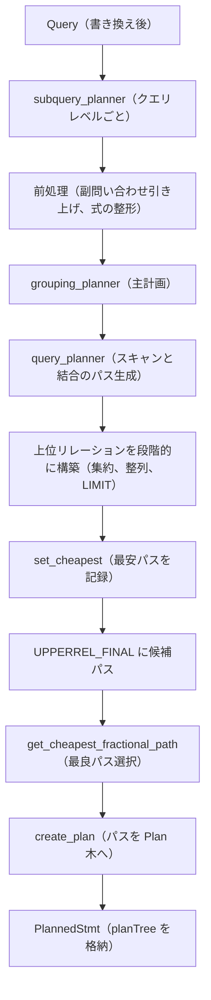

# 第13章 プランナの全体像

> **本章で読むソース**
>
> - [`src/backend/optimizer/plan/planner.c`](https://github.com/postgres/postgres/blob/REL_18_4/src/backend/optimizer/plan/planner.c)
> - [`src/include/nodes/pathnodes.h`](https://github.com/postgres/postgres/blob/REL_18_4/src/include/nodes/pathnodes.h)
> - [`src/include/nodes/plannodes.h`](https://github.com/postgres/postgres/blob/REL_18_4/src/include/nodes/plannodes.h)

## この章の狙い

第10章から第12章で、SQL 文字列は生の構文木になり、意味解析を経て `Query` になり、ルールシステムで書き換えられた。
書き換え後の `Query` は、まだ「何を求めるか」を表すだけで、どう実行するかは決まっていない。
同じ問い合わせを満たす実行手順は無数にあり、テーブルを順スキャンするかインデックスを引くか、結合をどの順で組むかで、所要時間は桁で変わる。
本章で読む**プランナ**は、この `Query` を受け取り、エグゼキュータがそのまま実行できる `PlannedStmt` を生み出す。

プランナの中心にある考え方は、候補となる実行手順を**パス**として複数作り、見積もりコストの最も小さいものを選ぶことである。
本章は、その入口である `planner` から `standard_planner`、`subquery_planner`、`grouping_planner` までの骨格をたどり、コストベース最適化の流れを俯瞰する。
パスの具体的な作り方とコスト式は第14章へ、選ばれたパスをプランノードへ変換する段は第15章へ送る。
本章が押さえるのは、入口から出口までの制御の流れと、`PlannerInfo`、`RelOptInfo` という二つの中心データ構造の役割である。

## 前提

第9章で、シンプルクエリが `pg_plan_queries` を経てプランナへ入ることを読んだ。
`pg_plan_queries` は問い合わせごとに `planner` を呼ぶ。
本章はこの `planner` を入口として、`PlannedStmt` が組み上がるまでを追う。

入力の `Query` は、第11章で意味解析を終えた問い合わせ木である。
範囲表（`rtable`）にスキャン対象のリレーションや副問い合わせが並び、`jointree` が結合の構造を、`targetList` が出力列を表す。
本章はこれらの内容そのものではなく、プランナがこの木をどう作業対象に変えていくかに焦点を絞る。

## 入口の planner とフック

問い合わせの計画づくりは `planner` から始まる。
この関数は薄く、計画の本体を `standard_planner` に委ねる。

[`src/backend/optimizer/plan/planner.c` L304-L318](https://github.com/postgres/postgres/blob/REL_18_4/src/backend/optimizer/plan/planner.c#L304-L318)

```c
PlannedStmt *
planner(Query *parse, const char *query_string, int cursorOptions,
		ParamListInfo boundParams)
{
	PlannedStmt *result;

	if (planner_hook)
		result = (*planner_hook) (parse, query_string, cursorOptions, boundParams);
	else
		result = standard_planner(parse, query_string, cursorOptions, boundParams);

	pgstat_report_plan_id(result->planId, false);

	return result;
}
```

`planner_hook` が設定されていればそちらを呼び、なければ標準実装の `standard_planner` を呼ぶ。
この分岐は、計画づくりの前後に処理を差し込みたい拡張のための入口である。
拡張は自前のフックを登録し、その中で `standard_planner` を呼ぶのが通例で、こうして標準の計画処理を保ちつつ前後に独自処理を挟める。
本章は標準経路を読むので、以後は `standard_planner` の中身を追う。

## standard_planner の骨格

`standard_planner` は、計画づくりの全工程を一望できる関数である。
冒頭で計画実行全体にまたがるグローバル状態 `PlannerGlobal` を確保し、並列実行の可否やカーソル向けの取得割合を見積もったあと、計画の本体に入る。
本体は四つの段に分かれる。

[`src/backend/optimizer/plan/planner.c` L452-L459](https://github.com/postgres/postgres/blob/REL_18_4/src/backend/optimizer/plan/planner.c#L452-L459)

```c
	/* primary planning entry point (may recurse for subqueries) */
	root = subquery_planner(glob, parse, NULL, false, tuple_fraction, NULL);

	/* Select best Path and turn it into a Plan */
	final_rel = fetch_upper_rel(root, UPPERREL_FINAL, NULL);
	best_path = get_cheapest_fractional_path(final_rel, tuple_fraction);

	top_plan = create_plan(root, best_path);
```

第1段の `subquery_planner` が、問い合わせ1レベル分の計画づくりを行い、結果を `PlannerInfo`（`root`）に詰めて返す。
このとき、最終結果を表すリレーション（`UPPERREL_FINAL` の `RelOptInfo`）には、問い合わせを実現する候補パスが何本か付いている。

第2段は、その最終リレーションを `fetch_upper_rel` で取り出し、`get_cheapest_fractional_path` で最良の1本を選ぶ。
ここが「コストで選ぶ」段である。
`tuple_fraction` は、結果のうちどれだけの割合を取り出すと見込むかを表す。
全件を取り切る通常の問い合わせでは総コストの安いパスを、カーソルのように先頭の数件だけ早く欲しい場合は起動コストの安いパスを選ぶ。

第3段の `create_plan` が、選ばれたパスを再帰的にたどり、エグゼキュータが実行できる `Plan` ノードの木へ変換する。
パスは「どう実行するか」を抽象的に持つ設計図であり、`Plan` はその設計図を具体的なノードに起こした実行木である。
この変換の詳細は第15章で読む。

第4段は仕上げである。
`top_plan` を頂点とする `Plan` 木に対し、初期計画のコスト調整や、範囲表参照の確定（`set_plan_references`）を施し、最後に `PlannedStmt` を組み立てる。

[`src/backend/optimizer/plan/planner.c` L574-L585](https://github.com/postgres/postgres/blob/REL_18_4/src/backend/optimizer/plan/planner.c#L574-L585)

```c
	/* build the PlannedStmt result */
	result = makeNode(PlannedStmt);

	result->commandType = parse->commandType;
	result->queryId = parse->queryId;
	result->hasReturning = (parse->returningList != NIL);
	result->hasModifyingCTE = parse->hasModifyingCTE;
	result->canSetTag = parse->canSetTag;
	result->transientPlan = glob->transientPlan;
	result->dependsOnRole = glob->dependsOnRole;
	result->parallelModeNeeded = glob->parallelModeNeeded;
	result->planTree = top_plan;
```

`PlannedStmt` の `planTree` に、頂点の `Plan` ノードを格納する。
計画づくりの間にグローバル状態 `glob` へ集めておいた範囲表、副計画、依存リレーションの OID などを、この `PlannedStmt` の各フィールドへ移し替える。
これでエグゼキュータが必要とする「一度きりの情報」が一つの構造体にまとまる。

## 出力としての PlannedStmt

プランナの出力 `PlannedStmt` は、`Plan` 木を頭に乗せた、実行に必要な情報の入れ物である。
ヘッダコメントがその位置づけを述べている。

[`src/include/nodes/plannodes.h` L46-L83](https://github.com/postgres/postgres/blob/REL_18_4/src/include/nodes/plannodes.h#L46-L83)

```c
typedef struct PlannedStmt
{
	pg_node_attr(no_equal, no_query_jumble)

	NodeTag		type;

	/* select|insert|update|delete|merge|utility */
	CmdType		commandType;

	/* query identifier (copied from Query) */
	int64		queryId;

	/* plan identifier (can be set by plugins) */
	int64		planId;

	/* is it insert|update|delete|merge RETURNING? */
	bool		hasReturning;

	/* has insert|update|delete|merge in WITH? */
	bool		hasModifyingCTE;

	/* do I set the command result tag? */
	bool		canSetTag;

	/* redo plan when TransactionXmin changes? */
	bool		transientPlan;

	/* is plan specific to current role? */
	bool		dependsOnRole;

	/* parallel mode required to execute? */
	bool		parallelModeNeeded;

	/* which forms of JIT should be performed */
	int			jitFlags;

	/* tree of Plan nodes */
	struct Plan *planTree;
```

中核は `planTree` で、実行木の頂点ノードを指す。
それ以外のフィールドは、コマンド種別、範囲表、結果リレーション、副計画など、実行木をたどるだけでは得られない補助情報である。

`Plan` は、すべての実行ノードが先頭に埋め込む共通の親構造体である。

[`src/include/nodes/plannodes.h` L158-L180](https://github.com/postgres/postgres/blob/REL_18_4/src/include/nodes/plannodes.h#L158-L180)

```c
typedef struct Plan
{
	pg_node_attr(abstract, no_equal, no_query_jumble)

	NodeTag		type;

	/*
	 * estimated execution costs for plan (see costsize.c for more info)
	 */
	/* count of disabled nodes */
	int			disabled_nodes;
	/* cost expended before fetching any tuples */
	Cost		startup_cost;
	/* total cost (assuming all tuples fetched) */
	Cost		total_cost;

	/*
	 * planner's estimate of result size of this plan step
	 */
	/* number of rows plan is expected to emit */
	Cardinality plan_rows;
	/* average row width in bytes */
	int			plan_width;
```

`startup_cost` は最初の1行を取り出すまでの費用、`total_cost` は全行を取り切るまでの費用である。
この二つの見積もりが、パスの段階で計算され、`Plan` まで引き継がれる。
プランナは結局のところ、この `total_cost`（または起動寄りの `startup_cost`）が最小になる木を探す装置である。

## subquery_planner と PlannerInfo

`subquery_planner` は、問い合わせ1レベル分の計画づくりをひとまとめに担う。
名前のとおり、副問い合わせを見つけるたびに再帰的に呼ばれ、各レベルを独立に処理する。

[`src/backend/optimizer/plan/planner.c` L668-L688](https://github.com/postgres/postgres/blob/REL_18_4/src/backend/optimizer/plan/planner.c#L668-L688)

```c
PlannerInfo *
subquery_planner(PlannerGlobal *glob, Query *parse, PlannerInfo *parent_root,
				 bool hasRecursion, double tuple_fraction,
				 SetOperationStmt *setops)
{
	PlannerInfo *root;
	List	   *newWithCheckOptions;
	List	   *newHaving;
	Bitmapset  *havingCollationConflicts;
	int			havingIdx;
	bool		hasOuterJoins;
	bool		hasResultRTEs;
	RelOptInfo *final_rel;
	ListCell   *l;

	/* Create a PlannerInfo data structure for this subquery */
	root = makeNode(PlannerInfo);
	root->parse = parse;
	root->glob = glob;
	root->query_level = parent_root ? parent_root->query_level + 1 : 1;
	root->parent_root = parent_root;
```

最初の仕事は、この問い合わせレベル用の `PlannerInfo` を作ることである。
`PlannerInfo` は、プランナの作業状態をすべて束ねる構造体で、コード中では一貫して `root` と呼ばれる。

[`src/include/nodes/pathnodes.h` L189-L226](https://github.com/postgres/postgres/blob/REL_18_4/src/include/nodes/pathnodes.h#L189-L226)

```c
/*----------
 * PlannerInfo
 *		Per-query information for planning/optimization
 *
 * This struct is conventionally called "root" in all the planner routines.
 * It holds links to all of the planner's working state, in addition to the
 * original Query.  Note that at present the planner extensively modifies
 * the passed-in Query data structure; someday that should stop.
 *
 * For reasons explained in optimizer/optimizer.h, we define the typedef
 * either here or in that header, whichever is read first.
 *
// ... (中略) ...
 *----------
 */
#ifndef HAVE_PLANNERINFO_TYPEDEF
typedef struct PlannerInfo PlannerInfo;
#define HAVE_PLANNERINFO_TYPEDEF 1
#endif

struct PlannerInfo
{
	pg_node_attr(no_copy_equal, no_read, no_query_jumble)

	NodeTag		type;

	/* the Query being planned */
	Query	   *parse;

	/* global info for current planner run */
	PlannerGlobal *glob;
```

`root->parse` が計画対象の `Query`、`root->glob` が計画実行全体で共有するグローバル状態を指す。
`query_level` は最外周を1とする入れ子の深さで、`parent_root` が一段外側の `PlannerInfo` を指す。
副問い合わせごとに `PlannerInfo` を作って親子で連結するこの構造により、各レベルの作業状態を混ぜずに独立して扱える。

`PlannerInfo` はこのあと、計画づくりが進むにつれて中身が埋まっていく。
作業対象のリレーションを並べた配列（`simple_rel_array`）、後段処理の結果を表す上位リレーションの配列（`upper_rels`）などが、その代表である。

## 各クエリレベルの前処理

`subquery_planner` の前半は、`Query` を最適化しやすい形に整える前処理にあてられる。
要点だけ挙げると、副問い合わせの引き上げ、関数の展開、式の整形である。

副問い合わせの引き上げは、`FROM` 句に置かれた副問い合わせを、可能なら親の問い合わせに溶け込ませる処理である。

[`src/backend/optimizer/plan/planner.c` L775-L788](https://github.com/postgres/postgres/blob/REL_18_4/src/backend/optimizer/plan/planner.c#L775-L788)

```c
	/*
	 * Check to see if any subqueries in the jointree can be merged into this
	 * query.
	 */
	pull_up_subqueries(root);

	/*
	 * If this is a simple UNION ALL query, flatten it into an appendrel. We
	 * do this now because it requires applying pull_up_subqueries to the leaf
	 * queries of the UNION ALL, which weren't touched above because they
	 * weren't referenced by the jointree (they will be after we do this).
	 */
	if (parse->setOperations)
		flatten_simple_union_all(root);
```

`pull_up_subqueries` が副問い合わせを親へ引き上げると、別々の問い合わせレベルに分かれていた表が、同じレベルの結合候補として一緒に並ぶ。
この平坦化により、結合順序の選択肢が広がり、より良い計画が見つかりやすくなる。

前処理の後半では、`targetList` や `WHERE` 句などに含まれる式を一つずつ整形する。

[`src/backend/optimizer/plan/planner.c` L943-L946](https://github.com/postgres/postgres/blob/REL_18_4/src/backend/optimizer/plan/planner.c#L943-L946)

```c
	preprocess_qual_conditions(root, (Node *) parse->jointree);

	parse->havingQual = preprocess_expression(root, parse->havingQual,
											  EXPRKIND_QUAL);
```

`preprocess_expression` は、定数畳み込みや関数の簡約を施し、計画段で扱いやすい形に式を直す。
たとえば定数どうしの演算をあらかじめ計算しておけば、実行時に毎行計算し直さずに済む。
こうした前処理は問い合わせレベルごとに一度だけ行えばよいので、`grouping_planner` から切り離して `subquery_planner` に置かれている。

前処理を終えると、`subquery_planner` は主計画を `grouping_planner` に委ねる。

[`src/backend/optimizer/plan/planner.c` L1271-L1298](https://github.com/postgres/postgres/blob/REL_18_4/src/backend/optimizer/plan/planner.c#L1271-L1298)

```c
	/*
	 * Do the main planning.
	 */
	grouping_planner(root, tuple_fraction, setops);

	/*
	 * Capture the set of outer-level param IDs we have access to, for use in
	 * extParam/allParam calculations later.
	 */
	SS_identify_outer_params(root);

	/*
	 * If any initPlans were created in this query level, adjust the surviving
	 * Paths' costs and parallel-safety flags to account for them.  The
	 * initPlans won't actually get attached to the plan tree till
	 * create_plan() runs, but we must include their effects now.
	 */
	final_rel = fetch_upper_rel(root, UPPERREL_FINAL, NULL);
	SS_charge_for_initplans(root, final_rel);

	/*
	 * Make sure we've identified the cheapest Path for the final rel.  (By
	 * doing this here not in grouping_planner, we include initPlan costs in
	 * the decision, though it's unlikely that will change anything.)
	 */
	set_cheapest(final_rel);

	return root;
```

`grouping_planner` が終わると、最終リレーション（`UPPERREL_FINAL`）にはこの問い合わせを実現する候補パスが付いている。
`set_cheapest` がその中から最も安いパスを選び、リレーションに記録する。
こうして `subquery_planner` は、計画の結論を `PlannerInfo` に詰めて返す。

## grouping_planner と上位リレーション

`grouping_planner` は、スキャンと結合より上の段、すなわちグループ化、集約、ウィンドウ関数、重複除去、整列、`LIMIT` を計画する。
処理の出発点は `query_planner` の呼び出しである。

[`src/backend/optimizer/plan/planner.c` L1889-L1896](https://github.com/postgres/postgres/blob/REL_18_4/src/backend/optimizer/plan/planner.c#L1889-L1896)

```c
		/*
		 * Generate the best unsorted and presorted paths for the scan/join
		 * portion of this Query, ie the processing represented by the
		 * FROM/WHERE clauses.  (Note there may not be any presorted paths.)
		 * We also generate (in standard_qp_callback) pathkey representations
		 * of the query's sort clause, distinct clause, etc.
		 */
		current_rel = query_planner(root, standard_qp_callback, &qp_extra);
```

`query_planner` は、`FROM` と `WHERE` が表すスキャンと結合の部分について、候補パスを生成する。
ここで初めて、各テーブルのスキャン方法や結合順序が、コストの計算とともに比較される。
この内部、すなわちパスの生成とコスト見積もりの中身は第14章で読む。
`query_planner` は、スキャンと結合を済ませた結果のリレーション（`current_rel`）を返す。

`grouping_planner` はこの `current_rel` を起点に、後段の処理を段階的に積み上げる。
各段の結果は**上位リレーション**として表され、段ごとに新しい `RelOptInfo` が作られる。
最後の段が、本章で何度も触れてきた最終リレーションである。

[`src/backend/optimizer/plan/planner.c` L2108-L2110](https://github.com/postgres/postgres/blob/REL_18_4/src/backend/optimizer/plan/planner.c#L2108-L2110)

```c
	 * Now we are prepared to build the final-output upperrel.
	 */
	final_rel = fetch_upper_rel(root, UPPERREL_FINAL, NULL);
```

スキャンと結合の結果から始め、グループ化、整列といった後段処理を上位リレーションとして1段ずつ重ね、最後に `UPPERREL_FINAL` へ到達する。
各段が前段のパスを入力に取り、その段の処理を載せた新しいパスを作るため、後段の処理も例外なくコスト比較の対象になる。
この段階化された構造のおかげで、たとえば整列が必要な問い合わせで、すでに整列済みのパスをスキャン段から受け取れる場合と、新たにソートを足す場合を、同じコスト土俵で比べられる。

## RelOptInfo とパスの集合

スキャンや結合、後段処理の各段で扱う作業対象が `RelOptInfo` である。
1個のリレーション、複数表の結合、後段処理の結果のいずれも、この同じ構造体で表す。

[`src/include/nodes/pathnodes.h` L883-L901](https://github.com/postgres/postgres/blob/REL_18_4/src/include/nodes/pathnodes.h#L883-L901)

```c
typedef struct RelOptInfo
{
	pg_node_attr(no_copy_equal, no_read, no_query_jumble)

	NodeTag		type;

	RelOptKind	reloptkind;

	/*
	 * all relations included in this RelOptInfo; set of base + OJ relids
	 * (rangetable indexes)
	 */
	Relids		relids;

	/*
	 * size estimates generated by planner
	 */
	/* estimated number of result tuples */
	Cardinality rows;
```

`reloptkind` がこのリレーションの種別（単一テーブル、結合、上位処理など）を表し、`rows` がこのリレーションを出力したときの推定行数を持つ。
推定行数は、後段でこのリレーションを使う処理のコストを見積もる土台になる。

`RelOptInfo` の核心は、この対象を実現する候補パスを保持する点にある。

[`src/include/nodes/pathnodes.h` L922-L928](https://github.com/postgres/postgres/blob/REL_18_4/src/include/nodes/pathnodes.h#L922-L928)

```c
	List	   *pathlist;		/* Path structures */
	List	   *ppilist;		/* ParamPathInfos used in pathlist */
	List	   *partial_pathlist;	/* partial Paths */
	struct Path *cheapest_startup_path;
	struct Path *cheapest_total_path;
	struct Path *cheapest_unique_path;
	List	   *cheapest_parameterized_paths;
```

`pathlist` が、このリレーションを実現する候補パスの一覧である。
1個のテーブルなら、順スキャンのパス、インデックススキャンのパスなどが並ぶ。
`cheapest_startup_path` と `cheapest_total_path` は、その一覧から選んだ起動コスト最小のパスと総コスト最小のパスを指す。
このフィールドが、後述する最適化の鍵になる。

候補パスそのものは `Path` 構造体で表す。

[`src/include/nodes/pathnodes.h` L1753-L1801](https://github.com/postgres/postgres/blob/REL_18_4/src/include/nodes/pathnodes.h#L1753-L1801)

```c
typedef struct Path
{
	pg_node_attr(no_copy_equal, no_read, no_query_jumble)

	NodeTag		type;

	/* tag identifying scan/join method */
	NodeTag		pathtype;

	/*
	 * the relation this path can build
	 *
	 * We do NOT print the parent, else we'd be in infinite recursion.  We can
	 * print the parent's relids for identification purposes, though.
	 */
	RelOptInfo *parent pg_node_attr(write_only_relids);

	/*
	 * list of Vars/Exprs, cost, width
	 *
	 * We print the pathtarget only if it's not the default one for the rel.
	 */
	PathTarget *pathtarget pg_node_attr(write_only_nondefault_pathtarget);

	/*
	 * parameterization info, or NULL if none
	 *
	 * We do not print the whole of param_info, since it's printed via
	 * RelOptInfo; it's sufficient and less cluttering to print just the
	 * required outer relids.
	 */
	ParamPathInfo *param_info pg_node_attr(write_only_req_outer);

	/* engage parallel-aware logic? */
	bool		parallel_aware;
	/* OK to use as part of parallel plan? */
	bool		parallel_safe;
	/* desired # of workers; 0 = not parallel */
	int			parallel_workers;

	/* estimated size/costs for path (see costsize.c for more info) */
	Cardinality rows;			/* estimated number of result tuples */
	int			disabled_nodes; /* count of disabled nodes */
	Cost		startup_cost;	/* cost expended before fetching any tuples */
	Cost		total_cost;		/* total cost (assuming all tuples fetched) */

	/* sort ordering of path's output; a List of PathKey nodes; see above */
	List	   *pathkeys;
} Path;
```

`pathtype` がスキャンや結合の方式を表し、`parent` がこのパスが実現するリレーションを指す。
`startup_cost` と `total_cost` が見積もりコストで、これがパスを比較する物差しになる。
`pathkeys` はパスの出力がどの順序に整列しているかを表し、上位の整列処理がソートを省けるかどうかの判断に使われる。
パスは、こうしたコストと性質だけを軽量に持つ設計図である。
これにより、実行木そのものを作らずに多数の候補を安く生成し、比べられる。

## 最適化の核心、最安パスの即時記録

候補パスを作って最安を選ぶという枠組みは素直だが、候補の数が問題になる。
結合する表の数が増えると、結合順序と結合方式の組み合わせは爆発的に増える。
プランナは、すべての候補を最後まで保持して総当たりするのではなく、各リレーションについて「最安のパス」を作るたびに記録しておく。

その記録を担うのが `set_cheapest` である。
`subquery_planner` の末尾で最終リレーションに対して呼ばれ、各上位リレーションでも段ごとに呼ばれる。

[`src/backend/optimizer/plan/planner.c` L1291-L1296](https://github.com/postgres/postgres/blob/REL_18_4/src/backend/optimizer/plan/planner.c#L1291-L1296)

```c
	/*
	 * Make sure we've identified the cheapest Path for the final rel.  (By
	 * doing this here not in grouping_planner, we include initPlan costs in
	 * the decision, though it's unlikely that will change anything.)
	 */
	set_cheapest(final_rel);
```

`set_cheapest` は、リレーションの `pathlist` を走査し、起動コスト最小と総コスト最小のパスを `cheapest_startup_path`、`cheapest_total_path` に書き込む。
この記録があるおかげで、上位の段や外側の結合は、下位リレーションの候補を毎回すべて見直す必要がない。
すでに選ばれた最安パスを入力として受け取り、その上に自分の処理を載せたコストだけを足せばよい。

機構として速い理由はこうである。
N 個の表の結合を計画するとき、各部分集合のリレーションについて最安パスだけを保持すれば、より大きな結合を組むときに参照する候補が部分集合ごとに1本（厳密には整列性などで数本）に抑えられる。
個々の最良解を再利用してより大きな問題の最良解を組み立てるこの構造は、動的計画法そのものである。
全候補を末端まで展開して比べる素朴な方法に比べ、探索の幅が部分問題の数に比例する程度に収まり、結合数の増加に対する計算量の爆発を抑える。

最終リレーションに対して `set_cheapest` が走り終えれば、`cheapest_total_path` がこの問い合わせの最良パスを指す。
`standard_planner` の第2段が `get_cheapest_fractional_path` でこのパスを取り出し、第3段の `create_plan` が `Plan` 木へ変換する。

## 全体の流れ

ここまでの流れを図にまとめる。



`subquery_planner` は副問い合わせを見つけるたびに再帰し、各レベルが同じ流れをたどる。
スキャンと結合のパス生成、上位リレーションの段階的な構築、最安パスの記録という一連が、コストベース最適化の本体である。

## まとめ

プランナは、書き換え後の `Query` を受け取り、エグゼキュータが実行できる `PlannedStmt` を作る。
入口の `planner` は `planner_hook` の有無で分岐し、標準経路では `standard_planner` を呼ぶ。
`standard_planner` は四段構成で、`subquery_planner` で候補パスを作り、最安パスを選び、`create_plan` で `Plan` 木に変換し、`PlannedStmt` を組み立てる。

問い合わせ1レベル分の計画は `subquery_planner` が担う。
前半で副問い合わせの引き上げや式の整形といった前処理を一度だけ行い、後半の主計画を `grouping_planner` に委ねる。
`grouping_planner` は `query_planner` でスキャンと結合のパスを作り、その上にグループ化や整列を上位リレーションとして段階的に積み上げ、最終リレーションに候補パスを残す。

作業状態は `PlannerInfo`（`root`）が束ね、各リレーションは `RelOptInfo` が表し、候補は `Path` が表す。
`set_cheapest` が各リレーションで最安パスを即座に記録するため、より大きな結合や上位の段はその最安パスだけを再利用でき、結合数が増えても探索が爆発しない。
このコストベースの探索の中身、すなわちパスの種類とコスト式は第14章で、選ばれたパスを `Plan` へ変換する段は第15章で読む。

## 関連する章

- [第9章 フロントエンド／バックエンドプロトコルとメインループ](../part02-connection-protocol/09-frontend-backend-protocol.md)：`pg_plan_queries` がプランナを呼ぶまでの流れ。
- [第11章 アナライザ（意味解析）](11-analyzer.md)：プランナの入力 `Query` を作る段。
- [第12章 リライタとルールシステム](12-rewriter.md)：プランナへ渡る前に `Query` を書き換える段。
- [第14章 パス生成とコスト見積もり](14-paths-and-costing.md)：`query_planner` が作るパスの種類とコスト式。
- [第15章 プランの実体化](15-plan-creation.md)：`create_plan` がパスを `Plan` 木へ変換する段。
- [第16章 エグゼキュータの骨格](../part04-executor/16-executor-overview.md)：`PlannedStmt` を受け取って実行する段。
