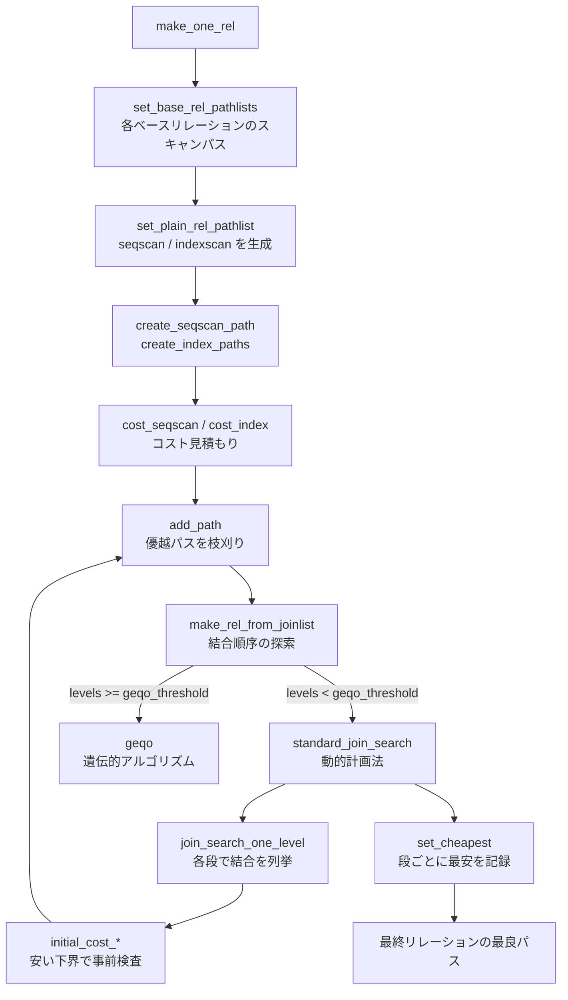

# 第14章 パス生成とコスト見積もり

> **本章で読むソース**
>
> - [`src/backend/optimizer/path/allpaths.c`](https://github.com/postgres/postgres/blob/REL_18_4/src/backend/optimizer/path/allpaths.c)
> - [`src/backend/optimizer/util/pathnode.c`](https://github.com/postgres/postgres/blob/REL_18_4/src/backend/optimizer/util/pathnode.c)
> - [`src/backend/optimizer/path/costsize.c`](https://github.com/postgres/postgres/blob/REL_18_4/src/backend/optimizer/path/costsize.c)
> - [`src/backend/optimizer/path/joinrels.c`](https://github.com/postgres/postgres/blob/REL_18_4/src/backend/optimizer/path/joinrels.c)

## この章の狙い

第13章で、プランナが問い合わせを `RelOptInfo` の木として捉え、各リレーションをどう読み、どの順で結合するかを決める段に入った。
本章は、その決定の心臓部を読む。
プランナは一つの結果に対して複数の**パス**（アクセス手段の候補）を作り、それぞれに**コスト**という数値見積もりを与え、最も安いものを選ぶ。

候補を作るとは、たとえば1枚のテーブルに対して「全件を順に読む」「インデックスをたどる」という別々の読み方を、それぞれ `Path` ノードとして用意することである。
結合についても「入れ子ループ」「ハッシュ結合」「マージ結合」という別々のアルゴリズムが候補になる。
これらの候補が無数に膨れあがらないよう、プランナは作るそばから劣るものを捨てる。
本章は、候補の生成（`make_one_rel`）、劣る候補の枝刈り（`add_path`）、コストの計算（`cost_seqscan`、`cost_index`）、そして結合順序の探索（`join_search_one_level`）という四つの仕組みを順に追う。

実際にタプルを読み出す実行コードは第4部で扱う。
本章が読むのは、あくまで「どの実行手段を選ぶか」を決める見積もりの層である。

## 前提

第13章で、プランナの入口 `subquery_planner` から `query_planner` を経て、ベースリレーションごとの `RelOptInfo` が用意されるところまでを読んだ。
本章はその続きとして、`query_planner` が呼ぶ `make_one_rel` から始める。
コストは無次元の相対値であり、既定では1ページの順次読み出しを `1.0` とした比で表す。
絶対的な実時間ではなく、候補どうしの大小だけが意味を持つ。

## パス生成の入口 make_one_rel

`make_one_rel` は、問い合わせに現れる全リレーションを結合し終えた最終的な1つの `RelOptInfo` を返す。
その手前で、まず各ベースリレーションの大きさを見積もり、続いてベースリレーションごとのパスを作り、最後に結合木全体のパスを組み立てる。

[`src/backend/optimizer/path/allpaths.c` L171-L234](https://github.com/postgres/postgres/blob/REL_18_4/src/backend/optimizer/path/allpaths.c#L171-L234)

```c
make_one_rel(PlannerInfo *root, List *joinlist)
{
	RelOptInfo *rel;
	Index		rti;
	double		total_pages;

	/* Mark base rels as to whether we care about fast-start plans */
	set_base_rel_consider_startup(root);

	/*
	 * Compute size estimates and consider_parallel flags for each base rel.
	 */
	set_base_rel_sizes(root);

	// ... (中略) ...
	root->total_table_pages = total_pages;

	/*
	 * Generate access paths for each base rel.
	 */
	set_base_rel_pathlists(root);

	/*
	 * Generate access paths for the entire join tree.
	 */
	rel = make_rel_from_joinlist(root, joinlist);

	/*
	 * The result should join all and only the query's base + outer-join rels.
	 */
	Assert(bms_equal(rel->relids, root->all_query_rels));

	return rel;
}
```

`set_base_rel_sizes` で各テーブルの行数とページ数を見積もり、コスト計算が使う `pages`／`tuples` をそろえる。
`set_base_rel_pathlists` でベースリレーション単独の読み方（スキャンパス）を作る。
`make_rel_from_joinlist` で、それらを結合していく順序の探索に入る。
この三段が、本章の前半（スキャンパス）と後半（結合）に対応する。

## ベースリレーションごとのスキャンパス

`set_base_rel_pathlists` は、ベースリレーションの配列を走査し、本物のベースリレーションだけに対して `set_rel_pathlist` を呼ぶ。

[`src/backend/optimizer/path/allpaths.c` L333-L353](https://github.com/postgres/postgres/blob/REL_18_4/src/backend/optimizer/path/allpaths.c#L333-L353)

```c
set_base_rel_pathlists(PlannerInfo *root)
{
	Index		rti;

	for (rti = 1; rti < root->simple_rel_array_size; rti++)
	{
		RelOptInfo *rel = root->simple_rel_array[rti];

		/* there may be empty slots corresponding to non-baserel RTEs */
		if (rel == NULL)
			continue;

		Assert(rel->relid == rti);	/* sanity check on array */

		/* ignore RTEs that are "other rels" */
		if (rel->reloptkind != RELOPT_BASEREL)
			continue;

		set_rel_pathlist(root, rel, rti, root->simple_rte_array[rti]);
	}
}
```

`set_rel_pathlist` は、リレーションの種別ごとに処理を振り分ける。
通常のテーブル（`RTE_RELATION` で外部表でもサンプリングでもないもの）は `set_plain_rel_pathlist` に落ちる。

[`src/backend/optimizer/path/allpaths.c` L469-L501](https://github.com/postgres/postgres/blob/REL_18_4/src/backend/optimizer/path/allpaths.c#L469-L501)

```c
set_rel_pathlist(PlannerInfo *root, RelOptInfo *rel,
				 Index rti, RangeTblEntry *rte)
{
	if (IS_DUMMY_REL(rel))
	{
		/* We already proved the relation empty, so nothing more to do */
	}
	else if (rte->inh)
	{
		/* It's an "append relation", process accordingly */
		set_append_rel_pathlist(root, rel, rti, rte);
	}
	else
	{
		switch (rel->rtekind)
		{
			case RTE_RELATION:
				if (rte->relkind == RELKIND_FOREIGN_TABLE)
				{
					/* Foreign table */
					set_foreign_pathlist(root, rel, rte);
				}
				else if (rte->tablesample != NULL)
				{
					/* Sampled relation */
					set_tablesample_rel_pathlist(root, rel, rte);
				}
				else
				{
					/* Plain relation */
					set_plain_rel_pathlist(root, rel, rte);
				}
				break;
```

`set_plain_rel_pathlist` が、通常テーブルに対する候補を実際に積む。
順次スキャンを1つ、必要なら並列順次スキャンを1つ、そしてインデックススキャン群を作る。

[`src/backend/optimizer/path/allpaths.c` L768-L799](https://github.com/postgres/postgres/blob/REL_18_4/src/backend/optimizer/path/allpaths.c#L768-L799)

```c
set_plain_rel_pathlist(PlannerInfo *root, RelOptInfo *rel, RangeTblEntry *rte)
{
	Relids		required_outer;

	/*
	 * We don't support pushing join clauses into the quals of a seqscan, but
	 * it could still have required parameterization due to LATERAL refs in
	 * its tlist.
	 */
	required_outer = rel->lateral_relids;

	/*
	 * Consider TID scans.
	 *
	 * If create_tidscan_paths returns true, then a TID scan path is forced.
	 * This happens when rel->baserestrictinfo contains CurrentOfExpr, because
	 * the executor can't handle any other type of path for such queries.
	 * Hence, we return without adding any other paths.
	 */
	if (create_tidscan_paths(root, rel))
		return;

	/* Consider sequential scan */
	add_path(rel, create_seqscan_path(root, rel, required_outer, 0));

	/* If appropriate, consider parallel sequential scan */
	if (rel->consider_parallel && required_outer == NULL)
		create_plain_partial_paths(root, rel);

	/* Consider index scans */
	create_index_paths(root, rel);
}
```

`create_seqscan_path` が `Path` ノードを1つ作り、`add_path` がそれをリレーションのパスリストに登録する。
インデックススキャンは `create_index_paths` の中で、使えるインデックスごとに候補を作って同様に `add_path` する。
ここで候補が積み上がり、`add_path` が劣るものを捨てていく。

`create_seqscan_path` 自体は素朴で、ノードに種別 `T_SeqScan` を設定し、コスト計算を `cost_seqscan` に委ねるだけである。

[`src/backend/optimizer/util/pathnode.c` L986-L1004](https://github.com/postgres/postgres/blob/REL_18_4/src/backend/optimizer/util/pathnode.c#L986-L1004)

```c
create_seqscan_path(PlannerInfo *root, RelOptInfo *rel,
					Relids required_outer, int parallel_workers)
{
	Path	   *pathnode = makeNode(Path);

	pathnode->pathtype = T_SeqScan;
	pathnode->parent = rel;
	pathnode->pathtarget = rel->reltarget;
	pathnode->param_info = get_baserel_parampathinfo(root, rel,
													 required_outer);
	pathnode->parallel_aware = (parallel_workers > 0);
	pathnode->parallel_safe = rel->consider_parallel;
	pathnode->parallel_workers = parallel_workers;
	pathnode->pathkeys = NIL;	/* seqscan has unordered result */

	cost_seqscan(pathnode, root, rel, pathnode->param_info);

	return pathnode;
}
```

`pathkeys` が `NIL` である点に注目しておきたい。
順次スキャンは結果に順序を保証しないため、並び順を表す `pathkeys` が空になる。
インデックススキャンならインデックスのキー順が `pathkeys` に入る。
この並び順の有無が、後段の `add_path` で「安いだけでなく並びも有利か」を比べる材料になる。

## コスト見積もり cost_seqscan

`cost_seqscan` は、順次スキャンの費用をディスクと CPU の二本立てで積む。

[`src/backend/optimizer/path/costsize.c` L295-L360](https://github.com/postgres/postgres/blob/REL_18_4/src/backend/optimizer/path/costsize.c#L295-L360)

```c
cost_seqscan(Path *path, PlannerInfo *root,
			 RelOptInfo *baserel, ParamPathInfo *param_info)
{
	Cost		startup_cost = 0;
	Cost		cpu_run_cost;
	Cost		disk_run_cost;
	double		spc_seq_page_cost;
	QualCost	qpqual_cost;
	Cost		cpu_per_tuple;

	/* Should only be applied to base relations */
	Assert(baserel->relid > 0);
	Assert(baserel->rtekind == RTE_RELATION);

	/* Mark the path with the correct row estimate */
	if (param_info)
		path->rows = param_info->ppi_rows;
	else
		path->rows = baserel->rows;

	/* fetch estimated page cost for tablespace containing table */
	get_tablespace_page_costs(baserel->reltablespace,
							  NULL,
							  &spc_seq_page_cost);

	/*
	 * disk costs
	 */
	disk_run_cost = spc_seq_page_cost * baserel->pages;

	/* CPU costs */
	get_restriction_qual_cost(root, baserel, param_info, &qpqual_cost);

	startup_cost += qpqual_cost.startup;
	cpu_per_tuple = cpu_tuple_cost + qpqual_cost.per_tuple;
	cpu_run_cost = cpu_per_tuple * baserel->tuples;
	/* tlist eval costs are paid per output row, not per tuple scanned */
	startup_cost += path->pathtarget->cost.startup;
	cpu_run_cost += path->pathtarget->cost.per_tuple * path->rows;

	// ... (中略) ...

	path->disabled_nodes = enable_seqscan ? 0 : 1;
	path->startup_cost = startup_cost;
	path->total_cost = startup_cost + cpu_run_cost + disk_run_cost;
}
```

ディスク費用は `spc_seq_page_cost * baserel->pages` であり、テーブルのページ数に1ページあたりの順次読み出し費用を掛けただけである。
CPU 費用は、走査する全タプル `baserel->tuples` に対し、1タプルあたりの処理費用 `cpu_tuple_cost + qpqual_cost.per_tuple` を掛ける。
`qpqual_cost` は `WHERE` 句などの絞り込み条件を1タプルごとに評価する費用であり、条件が重いほど CPU 費用が増える。
最終的な `total_cost` は、起動費用にこの CPU 費用とディスク費用を足したものになる。

費用の単位を決めるのが、`costsize.c` の冒頭に並ぶコストパラメータの既定値である。

[`src/backend/optimizer/path/costsize.c` L130-L134](https://github.com/postgres/postgres/blob/REL_18_4/src/backend/optimizer/path/costsize.c#L130-L134)

```c
double		seq_page_cost = DEFAULT_SEQ_PAGE_COST;
double		random_page_cost = DEFAULT_RANDOM_PAGE_COST;
double		cpu_tuple_cost = DEFAULT_CPU_TUPLE_COST;
double		cpu_index_tuple_cost = DEFAULT_CPU_INDEX_TUPLE_COST;
double		cpu_operator_cost = DEFAULT_CPU_OPERATOR_COST;
```

これらの既定値は次のとおりである。

| パラメータ | 既定値 | 意味 |
|------|------|------|
| `seq_page_cost` | 1.0 | 1ページを順次読む費用（基準） |
| `random_page_cost` | 4.0 | 1ページをランダムに読む費用 |
| `cpu_tuple_cost` | 0.01 | 1タプルを処理する CPU 費用 |
| `cpu_index_tuple_cost` | 0.005 | インデックスエントリ1件を処理する費用 |
| `cpu_operator_cost` | 0.0025 | 演算子や関数1回の評価費用 |

`random_page_cost` が `seq_page_cost` の4倍に設定されている点が、スキャン選択を左右する。
順次読みは連続したページを一度になめるのに対し、ランダム読みは飛び飛びのページを拾うため、回転磁気ディスクでは平均待ち時間が大きい。
この4倍という比が、インデックススキャンが多数のページに飛ぶときに不利になる根拠を与える。

## インデックススキャンのコスト cost_index

インデックススキャンのコストは `cost_index` が計算する。
中核は、インデックスをたどって取得するタプルが、テーブル上でどれだけ散らばっているか（相関）に応じてページ取得費用を見積もる点にある。

[`src/backend/optimizer/path/costsize.c` L653-L679](https://github.com/postgres/postgres/blob/REL_18_4/src/backend/optimizer/path/costsize.c#L653-L679)

```c
	/*----------
	 * Estimate number of main-table pages fetched, and compute I/O cost.
	 *
	 * When the index ordering is uncorrelated with the table ordering,
	 * we use an approximation proposed by Mackert and Lohman (see
	 * index_pages_fetched() for details) to compute the number of pages
	 * fetched, and then charge spc_random_page_cost per page fetched.
	 *
	 * When the index ordering is exactly correlated with the table ordering
	 * (just after a CLUSTER, for example), the number of pages fetched should
	 * be exactly selectivity * table_size.  What's more, all but the first
	 * will be sequential fetches, not the random fetches that occur in the
	 * uncorrelated case.  So if the number of pages is more than 1, we
	 * ought to charge
	 *		spc_random_page_cost + (pages_fetched - 1) * spc_seq_page_cost
	 * For partially-correlated indexes, we ought to charge somewhere between
	 * these two estimates.  We currently interpolate linearly between the
	 * estimates based on the correlation squared (XXX is that appropriate?).
	 *
	 * If it's an index-only scan, then we will not need to fetch any heap
	 * pages for which the visibility map shows all tuples are visible.
	 * Hence, reduce the estimated number of heap fetches accordingly.
	 * We use the measured fraction of the entire heap that is all-visible,
	 * which might not be particularly relevant to the subset of the heap
	 * that this query will fetch; but it's not clear how to do better.
	 *----------
	 */
```

インデックスの並びとテーブルの並びが無相関なときは、取得するタプルがテーブル全体に散らばるとみなし、各ページ取得に `spc_random_page_cost` を課す。
完全に相関しているとき（`CLUSTER` 直後など）は、取得ページがほぼ連続するため、先頭1ページだけランダムで残りは順次として `spc_random_page_cost + (pages_fetched - 1) * spc_seq_page_cost` を課す。
部分的に相関しているときは、相関係数の二乗で両者を線形補間する。
このため、同じインデックスでも、テーブルが物理的に整列していればコストが下がり、順次スキャンに対して有利になりうる。

可視性マップ（VM）による最適化もここに現れる。
インデックスオンリースキャンでは、可視性マップが「全タプル可視」と示すページについてはヒープを読まずに済むため、`allvisfrac`（ヒープ全体に占める全可視ページの割合）を使って取得ページ数を割り引く。
VM が広く立っているテーブルほど、インデックスオンリースキャンが安くなる。

## add_path による優越パスの枝刈り

ここまで `add_path` を「候補を登録する」関数として扱ってきた。
実際にはもう一つ、本章の中心となる役割を持つ。
新しいパスが既存のパスより劣るなら登録せず、逆に既存のパスが新しいパスに劣るなら既存のほうを捨てる。
この双方向の枝刈りによって、リレーションのパスリストには互いに優越関係のない候補だけが残る。

`add_path` のヘッダコメントが、優越の判定基準を述べている。

[`src/backend/optimizer/util/pathnode.c` L391-L417](https://github.com/postgres/postgres/blob/REL_18_4/src/backend/optimizer/util/pathnode.c#L391-L417)

```c
/*
 * add_path
 *	  Consider a potential implementation path for the specified parent rel,
 *	  and add it to the rel's pathlist if it is worthy of consideration.
 *
 *	  A path is worthy if it has a better sort order (better pathkeys) or
 *	  cheaper cost (as defined below), or generates fewer rows, than any
 *    existing path that has the same or superset parameterization rels.  We
 *    also consider parallel-safe paths more worthy than others.
 *
 *    Cheaper cost can mean either a cheaper total cost or a cheaper startup
 *    cost; if one path is cheaper in one of these aspects and another is
 *    cheaper in the other, we keep both. However, when some path type is
 *    disabled (e.g. due to enable_seqscan=false), the number of times that
 *    a disabled path type is used is considered to be a higher-order
 *    component of the cost. Hence, if path A uses no disabled path type,
 *    and path B uses 1 or more disabled path types, A is cheaper, no matter
 *    what we estimate for the startup and total costs. The startup and total
 *    cost essentially act as a tiebreak when comparing paths that use equal
 *    numbers of disabled path nodes; but in practice this tiebreak is almost
 *    always used, since normally no path types are disabled.
 *
 *	  In addition to possibly adding new_path, we also remove from the rel's
 *    pathlist any old paths that are dominated by new_path --- that is,
 *    new_path is cheaper, at least as well ordered, generates no more rows,
 *    requires no outer rels not required by the old path, and is no less
 *    parallel-safe.
```

あるパスが「価値がある」のは、並び順、コスト、行数、並列安全性のいずれかで既存パスに勝るときである。
逆に、新しいパスが既存パスに対し、コストが安くなく、並びも勝らず、行数も多く、必要とする外側リレーションも増え、並列安全性も劣るなら、その新パスは捨てられる。
重要なのは、コストの安さと並び順の良さが別々の評価軸になっている点である。
合計コストが安いパスと、起動コストが安いパス、あるいはコストは高いが望ましい並び順を持つパスは、互いに優越せず両方が残る。
これは、後段の処理（`ORDER BY` やマージ結合）がどの並び順を要求するか、この時点では分からないためである。

本体のループは、新パスを既存の各パスと突き合わせる。
まずファジーなコスト比較を行い、コストで差がつくなら並び順や外側リレーションの比較は省く。

[`src/backend/optimizer/util/pathnode.c` L485-L517](https://github.com/postgres/postgres/blob/REL_18_4/src/backend/optimizer/util/pathnode.c#L485-L517)

```c
	foreach(p1, parent_rel->pathlist)
	{
		Path	   *old_path = (Path *) lfirst(p1);
		bool		remove_old = false; /* unless new proves superior */
		PathCostComparison costcmp;
		PathKeysComparison keyscmp;
		BMS_Comparison outercmp;

		/*
		 * Do a fuzzy cost comparison with standard fuzziness limit.
		 */
		costcmp = compare_path_costs_fuzzily(new_path, old_path,
											 STD_FUZZ_FACTOR);

		/*
		 * If the two paths compare differently for startup and total cost,
		 * then we want to keep both, and we can skip comparing pathkeys and
		 * required_outer rels.  If they compare the same, proceed with the
		 * other comparisons.  Row count is checked last.  (We make the tests
		 * in this order because the cost comparison is most likely to turn
		 * out "different", and the pathkeys comparison next most likely.  As
		 * explained above, row count very seldom makes a difference, so even
		 * though it's cheap to compare there's not much point in checking it
		 * earlier.)
		 */
		if (costcmp != COSTS_DIFFERENT)
		{
			/* Similarly check to see if either dominates on pathkeys */
			List	   *old_path_pathkeys;

			old_path_pathkeys = old_path->param_info ? NIL : old_path->pathkeys;
			keyscmp = compare_pathkeys(new_path_pathkeys,
									   old_path_pathkeys);
```

比較を「コスト、並び順、外側リレーション、行数」の順に並べたのは、最も差がつきやすい比較を先に置いて、早く決着させるためである。
コストで差がつけば（`COSTS_DIFFERENT`）両方を残すと決まり、残りの比較を飛ばせる。

優越が判定されたあとの処理は、ループ末尾の二か所に分かれる。
既存パスが新パスに優越されるなら、その場でパスリストから外して `pfree` する。
新パスが既存パスに優越されるなら、`accept_new` を倒してループを抜ける。

[`src/backend/optimizer/util/pathnode.c` L624-L671](https://github.com/postgres/postgres/blob/REL_18_4/src/backend/optimizer/util/pathnode.c#L624-L671)

```c
		/*
		 * Remove current element from pathlist if dominated by new.
		 */
		if (remove_old)
		{
			parent_rel->pathlist = foreach_delete_current(parent_rel->pathlist,
														  p1);

			/*
			 * Delete the data pointed-to by the deleted cell, if possible
			 */
			if (!IsA(old_path, IndexPath))
				pfree(old_path);
		}
		else
		{
			/*
			 * new belongs after this old path if it has more disabled nodes
			 * or if it has the same number of nodes but a greater total cost
			 */
			if (new_path->disabled_nodes > old_path->disabled_nodes ||
				(new_path->disabled_nodes == old_path->disabled_nodes &&
				 new_path->total_cost >= old_path->total_cost))
				insert_at = foreach_current_index(p1) + 1;
		}

		/*
		 * If we found an old path that dominates new_path, we can quit
		 * scanning the pathlist; we will not add new_path, and we assume
		 * new_path cannot dominate any other elements of the pathlist.
		 */
		if (!accept_new)
			break;
	}

	if (accept_new)
	{
		/* Accept the new path: insert it at proper place in pathlist */
		parent_rel->pathlist =
			list_insert_nth(parent_rel->pathlist, insert_at, new_path);
	}
	else
	{
		/* Reject and recycle the new path */
		if (!IsA(new_path, IndexPath))
			pfree(new_path);
	}
}
```

### 枝刈りが探索空間を抑える仕組み

`add_path` の枝刈りは、本章で説明する**高速化の工夫**の核心である。
パスリストは `disabled_nodes`、続いて `total_cost` の昇順に保たれる（安いパスが前）。
この並びは正しさには不要だが、ヘッダコメントが「speed hack」と呼ぶ通り、速さのための仕掛けである。
新パスを安い順に突き合わせていけば、新パスを優越する既存パスが前方に現れる確率が高く、数回の比較で `accept_new` を倒して `break` できる。
リストを最後までなめずに済むため、1回の `add_path` が平均的に軽くなる。

枝刈りそのものの効果はさらに大きい。
パスリストには互いに優越し合わないパスだけが残るので、リレーションあたりの候補数が抑えられる。
候補数が抑えられると、これらを材料に上位の結合パスを組むときの組み合わせも減る。
結合は下位リレーションのパスどうしの直積で候補を作るため、各リレーションのパス数が線形に減るだけでも、結合段での候補は積として効いて大きく減る。
劣るパスを早期に捨てることが、結合順序探索の指数的な膨張を根元で抑えている。

破棄したパスを即座に `pfree` する点も、大きな結合木でのプランナのメモリ消費を抑える。
ただし `IndexPath` だけは、`BitmapHeapPath` の子として共有されうるため解放しない。

## 結合パスの候補と二段階コスト

結合のパスにも、入れ子ループ、ハッシュ結合、マージ結合という別々のアルゴリズムが候補になる。
これらは結合する2つのリレーションの組ごとに作られ、やはり `add_path` でパスリストに積まれる。
ここでプランナは、コスト計算を二段階に分けるという工夫を使う。

[`src/backend/optimizer/path/joinpath.c` L909-L941](https://github.com/postgres/postgres/blob/REL_18_4/src/backend/optimizer/path/joinpath.c#L909-L941)

```c
	/*
	 * Do a precheck to quickly eliminate obviously-inferior paths.  We
	 * calculate a cheap lower bound on the path's cost and then use
	 * add_path_precheck() to see if the path is clearly going to be dominated
	 * by some existing path for the joinrel.  If not, do the full pushup with
	 * creating a fully valid path structure and submitting it to add_path().
	 * The latter two steps are expensive enough to make this two-phase
	 * methodology worthwhile.
	 */
	initial_cost_nestloop(root, &workspace, jointype,
						  outer_path, inner_path, extra);

	if (add_path_precheck(joinrel, workspace.disabled_nodes,
						  workspace.startup_cost, workspace.total_cost,
						  pathkeys, required_outer))
	{
		add_path(joinrel, (Path *)
				 create_nestloop_path(root,
									  joinrel,
									  jointype,
									  &workspace,
									  extra,
									  outer_path,
									  inner_path,
									  extra->restrictlist,
									  pathkeys,
									  required_outer));
	}
	else
	{
		/* Waste no memory when we reject a path here */
		bms_free(required_outer);
	}
```

`initial_cost_nestloop` がコストの安価な下界だけを素早く求め、`add_path_precheck` がその下界で「既存パスに明らかに優越されるか」を判定する。
明らかに劣ると分かれば、完全な `Path` 構造を組み立てずに捨てられる。
この事前検査を通ったものだけが、`create_nestloop_path` で完全なコスト計算とノード生成に進み、`add_path` に渡る。
完全なコスト計算とノード生成は重いため、安い下界で先に落とす二段階が割に合う。
マージ結合とハッシュ結合も、それぞれ `initial_cost_mergejoin`、`initial_cost_hashjoin` で同じ二段階を踏む。

入れ子ループの下界計算は、外側と内側のパスの起動コストの扱いに結合特有の事情を含む。

[`src/backend/optimizer/path/costsize.c` L3281-L3298](https://github.com/postgres/postgres/blob/REL_18_4/src/backend/optimizer/path/costsize.c#L3281-L3298)

```c
	/* Count up disabled nodes. */
	disabled_nodes = enable_nestloop ? 0 : 1;
	disabled_nodes += inner_path->disabled_nodes;
	disabled_nodes += outer_path->disabled_nodes;

	/* estimate costs to rescan the inner relation */
	cost_rescan(root, inner_path,
				&inner_rescan_start_cost,
				&inner_rescan_total_cost);

	/* cost of source data */

	/*
	 * NOTE: clearly, we must pay both outer and inner paths' startup_cost
	 * before we can start returning tuples, so the join's startup cost is
	 * their sum.  We'll also pay the inner path's rescan startup cost
	 * multiple times.
	 */
```

入れ子ループは外側の各行ごとに内側を読み直すため、内側の再走査費用 `cost_rescan` が効く。
内側に安く再走査できるパス（マテリアライズ済みやインデックススキャンなど）があるほど、入れ子ループが有利になる。

## 結合順序の探索 join_search_one_level

`make_rel_from_joinlist` は、結合すべきリレーションが2つ以上あるとき、結合順序の探索方式を選ぶ。
プラグイン、GEQO、標準の動的計画法のいずれかに分岐する。

[`src/backend/optimizer/path/allpaths.c` L3407-L3424](https://github.com/postgres/postgres/blob/REL_18_4/src/backend/optimizer/path/allpaths.c#L3407-L3424)

```c
	else
	{
		/*
		 * Consider the different orders in which we could join the rels,
		 * using a plugin, GEQO, or the regular join search code.
		 *
		 * We put the initial_rels list into a PlannerInfo field because
		 * has_legal_joinclause() needs to look at it (ugly :-().
		 */
		root->initial_rels = initial_rels;

		if (join_search_hook)
			return (*join_search_hook) (root, levels_needed, initial_rels);
		else if (enable_geqo && levels_needed >= geqo_threshold)
			return geqo(root, levels_needed, initial_rels);
		else
			return standard_join_search(root, levels_needed, initial_rels);
	}
```

結合するリレーション数 `levels_needed` が `geqo_threshold`（既定12）以上で `enable_geqo` が有効なら、遺伝的アルゴリズムによる近似探索 `geqo` に分岐する。
それ未満なら、すべての結合順序を網羅する `standard_join_search`（動的計画法）に進む。
リレーション数が増えると結合順序の数が階乗的に膨れあがるため、ある規模を超えたら網羅をあきらめ、近似で妥当な順序を探す。
この閾値分岐が、探索時間が破綻しないための安全弁になっている。

`standard_join_search` は、ボトムアップの動的計画法を採る。
まず2リレーションの結合を全通り作り、次にそれらと単独リレーションから3リレーションの結合を作り、と段を上げていく。

[`src/backend/optimizer/path/allpaths.c` L3468-L3527](https://github.com/postgres/postgres/blob/REL_18_4/src/backend/optimizer/path/allpaths.c#L3468-L3527)

```c
	/*
	 * We employ a simple "dynamic programming" algorithm: we first find all
	 * ways to build joins of two jointree items, then all ways to build joins
	 * of three items (from two-item joins and single items), then four-item
	 * joins, and so on until we have considered all ways to join all the
	 * items into one rel.
	 *
	 * root->join_rel_level[j] is a list of all the j-item rels.  Initially we
	 * set root->join_rel_level[1] to represent all the single-jointree-item
	 * relations.
	 */
	root->join_rel_level = (List **) palloc0((levels_needed + 1) * sizeof(List *));

	root->join_rel_level[1] = initial_rels;

	for (lev = 2; lev <= levels_needed; lev++)
	{
		ListCell   *lc;

		/*
		 * Determine all possible pairs of relations to be joined at this
		 * level, and build paths for making each one from every available
		 * pair of lower-level relations.
		 */
		join_search_one_level(root, lev);

		// ... (中略) ...
		foreach(lc, root->join_rel_level[lev])
		{
			rel = (RelOptInfo *) lfirst(lc);

			/* Create paths for partitionwise joins. */
			generate_partitionwise_join_paths(root, rel);

			/*
			 * Except for the topmost scan/join rel, consider gathering
			 * partial paths.  We'll do the same for the topmost scan/join rel
			 * once we know the final targetlist (see grouping_planner's and
			 * its call to apply_scanjoin_target_to_paths).
			 */
			if (!bms_equal(rel->relids, root->all_query_rels))
				generate_useful_gather_paths(root, rel, false);

			/* Find and save the cheapest paths for this rel */
			set_cheapest(rel);

#ifdef OPTIMIZER_DEBUG
			pprint(rel);
#endif
		}
	}
```

`join_rel_level[j]` は、ちょうど j 個のリレーションを含む結合の `RelOptInfo` のリストである。
各段で `join_search_one_level` を呼び、その段の全結合のパスを作る。
段を終えるたびに、その段の各結合リレーションについて `set_cheapest` を呼び、最安パスを記録する。
ここで記録された最安パスが、次の段で結合の材料に使われる。

`join_search_one_level` が、1段分の結合を実際に列挙する。
まず左側系と右側系のプラン（level-1 個の結合に単独リレーションを足す形）を考える。

[`src/backend/optimizer/path/joinrels.c` L84-L138](https://github.com/postgres/postgres/blob/REL_18_4/src/backend/optimizer/path/joinrels.c#L84-L138)

```c
	/*
	 * First, consider left-sided and right-sided plans, in which rels of
	 * exactly level-1 member relations are joined against initial relations.
	 * We prefer to join using join clauses, but if we find a rel of level-1
	 * members that has no join clauses, we will generate Cartesian-product
	 * joins against all initial rels not already contained in it.
	 */
	foreach(r, joinrels[level - 1])
	{
		RelOptInfo *old_rel = (RelOptInfo *) lfirst(r);

		if (old_rel->joininfo != NIL || old_rel->has_eclass_joins ||
			has_join_restriction(root, old_rel))
		{
			int			first_rel;

			// ... (中略) ...
			if (level == 2)		/* consider remaining initial rels */
				first_rel = foreach_current_index(r) + 1;
			else
				first_rel = 0;

			make_rels_by_clause_joins(root, old_rel, joinrels[1], first_rel);
		}
		else
		{
			/*
			 * Oops, we have a relation that is not joined to any other
			 * relation, either directly or by join-order restrictions.
			 * Cartesian product time.
			 *
			 * We consider a cartesian product with each not-already-included
			 * initial rel, whether it has other join clauses or not.  At
			 * level 2, if there are two or more clauseless initial rels, we
			 * will redundantly consider joining them in both directions; but
			 * such cases aren't common enough to justify adding complexity to
			 * avoid the duplicated effort.
			 */
			make_rels_by_clauseless_joins(root,
										  old_rel,
										  joinrels[1]);
		}
	}
```

結合句を持つリレーションどうしを優先して結合する（`make_rels_by_clause_joins`）。
結合句がまったくないリレーションだけは、やむなく直積（`make_rels_by_clauseless_joins`）を作る。
続いて、k 個と level-k 個を結合する「ブッシー」なプランも考えるが、こちらは結合句を持つ組に限る。

[`src/backend/optimizer/path/joinrels.c` L140-L172](https://github.com/postgres/postgres/blob/REL_18_4/src/backend/optimizer/path/joinrels.c#L140-L172)

```c
	/*
	 * Now, consider "bushy plans" in which relations of k initial rels are
	 * joined to relations of level-k initial rels, for 2 <= k <= level-2.
	 *
	 * We only consider bushy-plan joins for pairs of rels where there is a
	 * suitable join clause (or join order restriction), in order to avoid
	 * unreasonable growth of planning time.
	 */
	for (k = 2;; k++)
	{
		int			other_level = level - k;

		/*
		 * Since make_join_rel(x, y) handles both x,y and y,x cases, we only
		 * need to go as far as the halfway point.
		 */
		if (k > other_level)
			break;

		foreach(r, joinrels[k])
		{
			RelOptInfo *old_rel = (RelOptInfo *) lfirst(r);
			int			first_rel;
			ListCell   *r2;

			/*
			 * We can ignore relations without join clauses here, unless they
			 * participate in join-order restrictions --- then we might have
			 * to force a bushy join plan.
			 */
			if (old_rel->joininfo == NIL && !old_rel->has_eclass_joins &&
				!has_join_restriction(root, old_rel))
				continue;
```

ブッシープランを結合句のある組だけに絞るのも、探索時間の不当な増大を避けるためである。
結合句を持たない直積は、句のないリレーションがほかに結合相手を持たないときに限って生成される。
こうして、意味のある結合だけを優先的に列挙し、`add_path` が各段でパスを枝刈りすることで、動的計画法は現実的な時間で最良順序を見つけられる。

## 全体の流れ

ここまでの流れをまとめる。
ベースリレーションごとにスキャンパスを作って `add_path` で枝刈りし、その最安パスを材料に動的計画法で結合順序を探索し、各段でも `add_path` が劣る結合パスを捨てる。



枝刈り `add_path` が、スキャンパスの生成（`F` への流入）と結合パスの生成（`K` から `F` への流入）の両方で繰り返し効く点が、図から読み取れる。
各段で候補が絞られるからこそ、結合順序探索の組み合わせ爆発が抑えられる。

## まとめ

本章では、プランナが候補パスを作りコストで選ぶ仕組みを読んだ。
`make_one_rel` がベースリレーションのスキャンパスを作り、`set_plain_rel_pathlist` が順次スキャンとインデックススキャンを候補に積む。
`cost_seqscan` はページ数と行数からディスクと CPU の費用を、`cost_index` はインデックスとテーブルの相関に応じたページ取得費用を見積もり、`seq_page_cost`／`random_page_cost`／`cpu_*` の各パラメータがその単位を与える。
`add_path` が、コストと並び順の両面で劣るパスを捨て、互いに優越しない候補だけを残す。
この枝刈りが、結合順序を探索する動的計画法 `join_search_one_level` で組み合わせ爆発を抑える土台になる。
リレーション数が `geqo_threshold` を超えると、網羅をあきらめて GEQO の近似探索に切り替わる。

選ばれた最良パスを、実行可能なプランツリーへ変換する段は次章で読む。

## 関連する章

- [第13章 プランナの全体像](13-planner-overview.md)
- [第15章 プランの実体化](15-plan-creation.md)
- [第17章 スキャンノード](../part04-executor/17-scan-nodes.md)
- [第18章 結合ノード](../part04-executor/18-join-nodes.md)
