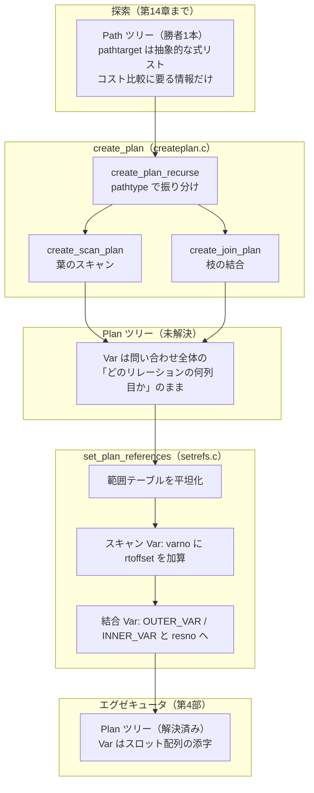

# 第15章 プランの実体化

> **本章で読むソース**
>
> - [`src/backend/optimizer/plan/createplan.c`](https://github.com/postgres/postgres/blob/REL_18_4/src/backend/optimizer/plan/createplan.c)
> - [`src/backend/optimizer/plan/setrefs.c`](https://github.com/postgres/postgres/blob/REL_18_4/src/backend/optimizer/plan/setrefs.c)
> - [`src/include/nodes/plannodes.h`](https://github.com/postgres/postgres/blob/REL_18_4/src/include/nodes/plannodes.h)
> - [`src/include/nodes/pathnodes.h`](https://github.com/postgres/postgres/blob/REL_18_4/src/include/nodes/pathnodes.h)
> - [`src/include/nodes/primnodes.h`](https://github.com/postgres/postgres/blob/REL_18_4/src/include/nodes/primnodes.h)

## この章の狙い

第14章までで、プランナは結合順序とアクセス方法を総当たりに近い形で探索し、各リレーションについて多数の**パス**（`Path`）を作り、コストが最小のものを残した。
探索の出力は最上位リレーションの最良パス1本である。
ところがエグゼキュータはこの `Path` を実行できない。
エグゼキュータが受け取るのは**プラン**（`Plan`）のツリーであり、`Path` と `Plan` は別の構造体である。

本章は、最良パスを `Plan` ツリーへ変換する2段を読む。
前半は `create_plan`（`createplan.c`）であり、`Path` ツリーを根から再帰的にたどって対応する `Plan` ノードを組み立てる。
後半は `set_plan_references`（`setrefs.c`）であり、組み上がった `Plan` ツリーの中の変数参照を、実行時にエグゼキュータが添字一つで引けるスロット番号へ最終解決する。

この2段を分けて読むと、なぜ PostgreSQL がコスト探索用の `Path` と実行用の `Plan` を別々に持つのか、という設計の意味が見えてくる。
最適化の工夫としては、後半の変数参照解決が実行時のオーバーヘッドをどう削るかを機構レベルで取り上げる。

## 前提

第13章でプランナの全体像を、第14章でパス生成とコスト見積もりを読んだ。
本章の入口にある最良パスは、第14章までの探索の結果として `final_rel` から取り出された1本である。

問い合わせ全体の処理を駆動する `standard_planner` は、パス探索のあとでまさにこの2段を順に呼ぶ。

[`src/backend/optimizer/plan/planner.c` L455-L459](https://github.com/postgres/postgres/blob/REL_18_4/src/backend/optimizer/plan/planner.c#L455-L459)

```c
	/* Select best Path and turn it into a Plan */
	final_rel = fetch_upper_rel(root, UPPERREL_FINAL, NULL);
	best_path = get_cheapest_fractional_path(final_rel, tuple_fraction);

	top_plan = create_plan(root, best_path);
```

`create_plan` が `Plan` ツリーを返し、その後に `set_plan_references` が呼ばれる（後述）。
本章はこの `best_path` を入口、`set_plan_references` の出力を出口として、あいだの変換を追う。

## `Path` と `Plan` を分ける設計

`Path` は探索の最中に大量に作られ、コストを比べて捨てられる。
そのため `Path` は、コスト比較に要る情報だけを持つ軽い構造体である。

[`src/include/nodes/pathnodes.h` L1753-L1801](https://github.com/postgres/postgres/blob/REL_18_4/src/include/nodes/pathnodes.h#L1753-L1801)

```c
typedef struct Path
{
	pg_node_attr(no_copy_equal, no_read, no_query_jumble)

	NodeTag		type;

	/* tag identifying scan/join method */
	NodeTag		pathtype;

	/*
	 * the relation this path can build
	 *
	 * We do NOT print the parent, else we'd be in infinite recursion.  We can
	 * print the parent's relids for identification purposes, though.
	 */
	RelOptInfo *parent pg_node_attr(write_only_relids);

	/*
	 * list of Vars/Exprs, cost, width
	 *
	 * We print the pathtarget only if it's not the default one for the rel.
	 */
	PathTarget *pathtarget pg_node_attr(write_only_nondefault_pathtarget);

	/*
	 * parameterization info, or NULL if none
	 *
	 * We do not print the whole of param_info, since it's printed via
	 * RelOptInfo; it's sufficient and less cluttering to print just the
	 * required outer relids.
	 */
	ParamPathInfo *param_info pg_node_attr(write_only_req_outer);

	/* engage parallel-aware logic? */
	bool		parallel_aware;
	/* OK to use as part of parallel plan? */
	bool		parallel_safe;
	/* desired # of workers; 0 = not parallel */
	int			parallel_workers;

	/* estimated size/costs for path (see costsize.c for more info) */
	Cardinality rows;			/* estimated number of result tuples */
	int			disabled_nodes; /* count of disabled nodes */
	Cost		startup_cost;	/* cost expended before fetching any tuples */
	Cost		total_cost;		/* total cost (assuming all tuples fetched) */

	/* sort ordering of path's output; a List of PathKey nodes; see above */
	List	   *pathkeys;
} Path;
```

`pathtype` がスキャンや結合の方式を表し、`parent` がどのリレーションを生むかを指す。
`pathtarget` は出力する列の集合、`param_info` はパラメータ化（後述）の有無、残りはコストとソート順である。
出力列は `pathtarget` が指す式のリストとして抽象的に保持され、実行時にどのスロットから値を取るかという情報はまだ持たない。
コストを比較するだけならこれで足りる。

これに対して `Plan` は、エグゼキュータが1度だけ受け取って何度も実行する構造体である。

[`src/include/nodes/plannodes.h` L158-L224](https://github.com/postgres/postgres/blob/REL_18_4/src/include/nodes/plannodes.h#L158-L224)

```c
typedef struct Plan
{
	pg_node_attr(abstract, no_equal, no_query_jumble)

	NodeTag		type;

	/*
	 * estimated execution costs for plan (see costsize.c for more info)
	 */
	/* count of disabled nodes */
	int			disabled_nodes;
	/* cost expended before fetching any tuples */
	Cost		startup_cost;
	/* total cost (assuming all tuples fetched) */
	Cost		total_cost;

	/*
	 * planner's estimate of result size of this plan step
	 */
	/* number of rows plan is expected to emit */
	Cardinality plan_rows;
	/* average row width in bytes */
	int			plan_width;

	/*
	 * information needed for parallel query
	 */
	/* engage parallel-aware logic? */
	bool		parallel_aware;
	/* OK to use as part of parallel plan? */
	bool		parallel_safe;

	/*
	 * information needed for asynchronous execution
	 */
	/* engage asynchronous-capable logic? */
	bool		async_capable;

	/*
	 * Common structural data for all Plan types.
	 */
	/* unique across entire final plan tree */
	int			plan_node_id;
	/* target list to be computed at this node */
	List	   *targetlist;
	/* implicitly-ANDed qual conditions */
	List	   *qual;
	/* input plan tree(s) */
	struct Plan *lefttree;
	struct Plan *righttree;
	/* Init Plan nodes (un-correlated expr subselects) */
	List	   *initPlan;

	/*
	 * Information for management of parameter-change-driven rescanning
	 *
	 * extParam includes the paramIDs of all external PARAM_EXEC params
	 * affecting this plan node or its children.  setParam params from the
	 * node's initPlans are not included, but their extParams are.
	 *
	 * allParam includes all the extParam paramIDs, plus the IDs of local
	 * params that affect the node (i.e., the setParams of its initplans).
	 * These are _all_ the PARAM_EXEC params that affect this node.
	 */
	Bitmapset  *extParam;
	Bitmapset  *allParam;
} Plan;
```

`Plan` は子を `lefttree` と `righttree` という固定2本の枝で持つ。
`targetlist` と `qual` には実際に評価する式のリストが入り、`plan_node_id` はツリー全体で一意な番号、`extParam` と `allParam` は再スキャンの管理に使う集合である。
`Path` が `parent` でリレーションを参照していたのに対し、`Plan` は子プランへの直接ポインタを持つ。
コストは両者にあるが、`Plan` 側のコストはエグゼキュータ自身はほとんど使わず、主に `EXPLAIN` の表示のために運ばれる。

二つを分ける理由は、探索と実行で要求が正反対だからである。
探索では構造体を軽く保ち、大量に生成しては捨てる回転の速さが効く。
実行では逆に、1度組んだ構造を何度もたどるので、たどる側が添字一つで値を引ける形に固めておきたい。
同じ構造体で両方をまかなおうとすると、探索中は使わない実行用フィールドを毎回作って捨てることになり、探索の回転が鈍る。
`create_plan` は、探索を終えて勝者が1本に決まった時点で初めて、その勝者だけを重い `Plan` へ作り直す。

## `create_plan`：パスツリーを根からたどる

`create_plan` の入口は短い。
最良パスを根として再帰呼び出しに渡し、戻ってきた `Plan` ツリーの頂点に仕上げの処理を加えるだけである。

[`src/backend/optimizer/plan/createplan.c` L336-L381](https://github.com/postgres/postgres/blob/REL_18_4/src/backend/optimizer/plan/createplan.c#L336-L381)

```c
Plan *
create_plan(PlannerInfo *root, Path *best_path)
{
	Plan	   *plan;

	/* plan_params should not be in use in current query level */
	Assert(root->plan_params == NIL);

	/* Initialize this module's workspace in PlannerInfo */
	root->curOuterRels = NULL;
	root->curOuterParams = NIL;

	/* Recursively process the path tree, demanding the correct tlist result */
	plan = create_plan_recurse(root, best_path, CP_EXACT_TLIST);

	/*
	 * Make sure the topmost plan node's targetlist exposes the original
	 * column names and other decorative info.  Targetlists generated within
	 * the planner don't bother with that stuff, but we must have it on the
	 * top-level tlist seen at execution time.  However, ModifyTable plan
	 * nodes don't have a tlist matching the querytree targetlist.
	 */
	if (!IsA(plan, ModifyTable))
		apply_tlist_labeling(plan->targetlist, root->processed_tlist);

	/*
	 * Attach any initPlans created in this query level to the topmost plan
	 * node.  (In principle the initplans could go in any plan node at or
	 * above where they're referenced, but there seems no reason to put them
	 * any lower than the topmost node for the query level.  Also, see
	 * comments for SS_finalize_plan before you try to change this.)
	 */
	SS_attach_initplans(root, plan);

	/* Check we successfully assigned all NestLoopParams to plan nodes */
	if (root->curOuterParams != NIL)
		elog(ERROR, "failed to assign all NestLoopParams to plan nodes");

	/*
	 * Reset plan_params to ensure param IDs used for nestloop params are not
	 * re-used later
	 */
	root->plan_params = NIL;

	return plan;
}
```

実際の変換は `create_plan_recurse` が担う。
冒頭のコメント（L328-L330）が述べるとおり、ここで作られる `Plan` ツリーの `targetlist` と `qual` の中の `Var` は、まだパーサ時代の番号付け、つまり問い合わせ内のどのリレーションの何列目かという表現のままである。
それを実行用に直すのは後半の `setrefs.c` の仕事であり、`create_plan` は構造の骨組みだけを組む。

`create_plan_recurse` は、パスの `pathtype` を見て対応する生成関数へ振り分ける巨大な `switch` である。

[`src/backend/optimizer/plan/createplan.c` L387-L420](https://github.com/postgres/postgres/blob/REL_18_4/src/backend/optimizer/plan/createplan.c#L387-L420)

```c
static Plan *
create_plan_recurse(PlannerInfo *root, Path *best_path, int flags)
{
	Plan	   *plan;

	/* Guard against stack overflow due to overly complex plans */
	check_stack_depth();

	switch (best_path->pathtype)
	{
		case T_SeqScan:
		case T_SampleScan:
		case T_IndexScan:
		case T_IndexOnlyScan:
		case T_BitmapHeapScan:
		case T_TidScan:
		case T_TidRangeScan:
		case T_SubqueryScan:
		case T_FunctionScan:
		case T_TableFuncScan:
		case T_ValuesScan:
		case T_CteScan:
		case T_WorkTableScan:
		case T_NamedTuplestoreScan:
		case T_ForeignScan:
		case T_CustomScan:
			plan = create_scan_plan(root, best_path, flags);
			break;
		case T_HashJoin:
		case T_MergeJoin:
		case T_NestLoop:
			plan = create_join_plan(root,
									(JoinPath *) best_path);
			break;
```

スキャン系のパスはすべて `create_scan_plan` に集約され、結合系の3種は `create_join_plan` に集約される。
それ以外に `Append`、`Sort`、`Agg`、`Limit` などの上位ノードが続く（L421 以降）。
`switch` の各分岐は、子を持つノードなら自分の子パスについて `create_plan_recurse` を再び呼ぶ。
こうして根から葉へ再帰が降り、葉のスキャンに達したところで具体的な `Plan` ノードが作られ、戻りながら結合や集約の `Plan` が積み上がる。

### 葉：スキャンプランの生成

スキャン系の入口 `create_scan_plan` は、まずスキャンに適用する制約条件を集める。

[`src/backend/optimizer/plan/createplan.c` L558-L598](https://github.com/postgres/postgres/blob/REL_18_4/src/backend/optimizer/plan/createplan.c#L558-L598)

```c
static Plan *
create_scan_plan(PlannerInfo *root, Path *best_path, int flags)
{
	RelOptInfo *rel = best_path->parent;
	List	   *scan_clauses;
	List	   *gating_clauses;
	List	   *tlist;
	Plan	   *plan;

	/*
	 * Extract the relevant restriction clauses from the parent relation. The
	 * executor must apply all these restrictions during the scan, except for
	 * pseudoconstants which we'll take care of below.
	 *
	 * If this is a plain indexscan or index-only scan, we need not consider
	 * restriction clauses that are implied by the index's predicate, so use
	 * indrestrictinfo not baserestrictinfo.  Note that we can't do that for
	 * bitmap indexscans, since there's not necessarily a single index
	 * involved; but it doesn't matter since create_bitmap_scan_plan() will be
	 * able to get rid of such clauses anyway via predicate proof.
	 */
	switch (best_path->pathtype)
	{
		case T_IndexScan:
		case T_IndexOnlyScan:
			scan_clauses = castNode(IndexPath, best_path)->indexinfo->indrestrictinfo;
			break;
		default:
			scan_clauses = rel->baserestrictinfo;
			break;
	}

	/*
	 * If this is a parameterized scan, we also need to enforce all the join
	 * clauses available from the outer relation(s).
	 *
	 * For paranoia's sake, don't modify the stored baserestrictinfo list.
	 */
	if (best_path->param_info)
		scan_clauses = list_concat_copy(scan_clauses,
										best_path->param_info->ppi_clauses);
```

`scan_clauses` には、そのリレーションに掛かる `WHERE` 由来の制約が入る。
パラメータ化スキャン（`param_info` が非 NULL）の場合は、外側リレーションから値をもらって評価する結合条件もここに足す。
このあと、生成する出力列リスト（`tlist`）を決め、`pathtype` ごとの最終的な生成関数へ振り分ける（L677 以降）。

`SeqScan` の生成関数 `create_seqscan_plan` を見ると、`Path` から `Plan` への変換の最小単位がよくわかる。

[`src/backend/optimizer/plan/createplan.c` L2909-L2940](https://github.com/postgres/postgres/blob/REL_18_4/src/backend/optimizer/plan/createplan.c#L2909-L2940)

```c
static SeqScan *
create_seqscan_plan(PlannerInfo *root, Path *best_path,
					List *tlist, List *scan_clauses)
{
	SeqScan    *scan_plan;
	Index		scan_relid = best_path->parent->relid;

	/* it should be a base rel... */
	Assert(scan_relid > 0);
	Assert(best_path->parent->rtekind == RTE_RELATION);

	/* Sort clauses into best execution order */
	scan_clauses = order_qual_clauses(root, scan_clauses);

	/* Reduce RestrictInfo list to bare expressions; ignore pseudoconstants */
	scan_clauses = extract_actual_clauses(scan_clauses, false);

	/* Replace any outer-relation variables with nestloop params */
	if (best_path->param_info)
	{
		scan_clauses = (List *)
			replace_nestloop_params(root, (Node *) scan_clauses);
	}

	scan_plan = make_seqscan(tlist,
							 scan_clauses,
							 scan_relid);

	copy_generic_path_info(&scan_plan->scan.plan, best_path);

	return scan_plan;
}
```

この関数は4つの仕事をする。
`order_qual_clauses` は条件式を実行に有利な順へ並べ替える。
`extract_actual_clauses` は、探索中は条件を `RestrictInfo` という付帯情報付きの容れ物で持っていたのを、評価対象の生の式だけに剥がす。
`replace_nestloop_params` は、パラメータ化スキャンに含まれる外側リレーションの変数を実行時パラメータ参照へ置き換える。
最後に `make_seqscan` が `SeqScan` ノードを `makeNode` で確保し、出力列とスキャン対象リレーション番号を詰める。

`make_seqscan` 自身は構造体を組むだけの薄い関数である。

[`src/backend/optimizer/plan/createplan.c` L5643-L5657](https://github.com/postgres/postgres/blob/REL_18_4/src/backend/optimizer/plan/createplan.c#L5643-L5657)

```c
make_seqscan(List *qptlist,
			 List *qpqual,
			 Index scanrelid)
{
	SeqScan    *node = makeNode(SeqScan);
	Plan	   *plan = &node->scan.plan;

	plan->targetlist = qptlist;
	plan->qual = qpqual;
	plan->lefttree = NULL;
	plan->righttree = NULL;
	node->scan.scanrelid = scanrelid;

	return node;
}
```

`SeqScan` は `Scan` を、`Scan` は `Plan` を先頭フィールドに埋め込む入れ子構造になっている。

[`src/include/nodes/plannodes.h` L470-L486](https://github.com/postgres/postgres/blob/REL_18_4/src/include/nodes/plannodes.h#L470-L486)

```c
typedef struct Scan
{
	pg_node_attr(abstract)

	Plan		plan;
	/* relid is index into the range table */
	Index		scanrelid;
} Scan;

/* ----------------
 *		sequential scan node
 * ----------------
 */
typedef struct SeqScan
{
	Scan		scan;
} SeqScan;
```

`Plan` を構造体の先頭に置くこの入れ子は、どの `Plan` 派生ノードも `Plan *` へ安全にキャストできることを保証する。
エグゼキュータがノード種別を問わず `Plan *` として扱える理由がここにある。

`make_seqscan` の直後に呼ばれる `copy_generic_path_info` は、`Path` が見積もったコストと行数を `Plan` 側へ書き写す。

[`src/backend/optimizer/plan/createplan.c` L5508-L5523](https://github.com/postgres/postgres/blob/REL_18_4/src/backend/optimizer/plan/createplan.c#L5508-L5523)

```c
/*
 * Copy cost and size info from a Path node to the Plan node created from it.
 * The executor usually won't use this info, but it's needed by EXPLAIN.
 * Also copy the parallel-related flags, which the executor *will* use.
 */
static void
copy_generic_path_info(Plan *dest, Path *src)
{
	dest->disabled_nodes = src->disabled_nodes;
	dest->startup_cost = src->startup_cost;
	dest->total_cost = src->total_cost;
	dest->plan_rows = src->rows;
	dest->plan_width = src->pathtarget->width;
	dest->parallel_aware = src->parallel_aware;
	dest->parallel_safe = src->parallel_safe;
}
```

コメントが明言するとおり、コストと行数はエグゼキュータがふだん使わず、`EXPLAIN` のために運ぶ。
並列関連のフラグだけはエグゼキュータも使う。

### 枝：結合プランの生成

結合系の入口 `create_join_plan` は、3種の結合方式を専用関数へ振り分ける。

[`src/backend/optimizer/plan/createplan.c` L1081-L1131](https://github.com/postgres/postgres/blob/REL_18_4/src/backend/optimizer/plan/createplan.c#L1081-L1131)

```c
create_join_plan(PlannerInfo *root, JoinPath *best_path)
{
	Plan	   *plan;
	List	   *gating_clauses;

	switch (best_path->path.pathtype)
	{
		case T_MergeJoin:
			plan = (Plan *) create_mergejoin_plan(root,
												  (MergePath *) best_path);
			break;
		case T_HashJoin:
			plan = (Plan *) create_hashjoin_plan(root,
												 (HashPath *) best_path);
			break;
		case T_NestLoop:
			plan = (Plan *) create_nestloop_plan(root,
												 (NestPath *) best_path);
			break;
		default:
			elog(ERROR, "unrecognized node type: %d",
				 (int) best_path->path.pathtype);
			plan = NULL;		/* keep compiler quiet */
			break;
	}

	/*
	 * If there are any pseudoconstant clauses attached to this node, insert a
	 * gating Result node that evaluates the pseudoconstants as one-time
	 * quals.
	 */
	gating_clauses = get_gating_quals(root, best_path->joinrestrictinfo);
	if (gating_clauses)
		plan = create_gating_plan(root, (Path *) best_path, plan,
								  gating_clauses);

// ... (中略) ...

	return plan;
}
```

`create_nestloop_plan` は、結合プランが子の再帰呼び出しをどう束ねるかを示す好例である。
外側と内側のそれぞれについて `create_plan_recurse` を呼び、戻ってきた2つの `Plan` を左右の枝に据える。

[`src/backend/optimizer/plan/createplan.c` L4374-L4385](https://github.com/postgres/postgres/blob/REL_18_4/src/backend/optimizer/plan/createplan.c#L4374-L4385)

```c
	/* NestLoop can project, so no need to be picky about child tlists */
	outer_plan = create_plan_recurse(root, best_path->jpath.outerjoinpath, 0);

	/* For a nestloop, include outer relids in curOuterRels for inner side */
	outerrelids = best_path->jpath.outerjoinpath->parent->relids;
	root->curOuterRels = bms_union(root->curOuterRels, outerrelids);

	inner_plan = create_plan_recurse(root, best_path->jpath.innerjoinpath, 0);

	/* Restore curOuterRels */
	bms_free(root->curOuterRels);
	root->curOuterRels = saveOuterRels;
```

注目すべきは、内側を再帰する前に外側リレーションの識別子を `root->curOuterRels` へ足し、再帰後に元へ戻す点である。
ネステッドループ結合では、内側スキャンが外側の現在行の値を参照してよい。
内側を組むあいだだけ「いま外側として使えるリレーションはこれだ」という文脈を立てておくことで、内側のスキャンプランは外側由来の変数をパラメータ参照へ正しく置き換えられる。
組み上がった `NestLoop` ノードは、内側へ渡す値の一覧を `nestParams` に持つ。

[`src/include/nodes/plannodes.h` L938-L943](https://github.com/postgres/postgres/blob/REL_18_4/src/include/nodes/plannodes.h#L938-L943)

```c
typedef struct NestLoop
{
	Join		join;
	/* list of NestLoopParam nodes */
	List	   *nestParams;
} NestLoop;
```

これでパス1本が `Plan` ツリーへ変換された。
ただし、この時点のツリーには実行できない箇所が残っている。
`targetlist` と `qual` の中の `Var` は、まだ問い合わせ全体での「どのリレーションの何列目か」を指したままで、エグゼキュータが手元の子タプルから値を引く番号にはなっていない。

## `set_plan_references`：変数参照の最終解決

組み上がった `Plan` ツリーを実行可能にする最後の段が `set_plan_references` である。
`standard_planner` は `create_plan` の戻り値をこの関数へ通す。

[`src/backend/optimizer/plan/planner.c` L563-L563](https://github.com/postgres/postgres/blob/REL_18_4/src/backend/optimizer/plan/planner.c#L563-L563)

```c
	top_plan = set_plan_references(root, top_plan);
```

この関数が何をするかは、冒頭のコメントが番号付きで列挙している。

[`src/backend/optimizer/plan/setrefs.c` L228-L255](https://github.com/postgres/postgres/blob/REL_18_4/src/backend/optimizer/plan/setrefs.c#L228-L255)

```c
 * 1. We flatten the various subquery rangetables into a single list, and
 * zero out RangeTblEntry fields that are not useful to the executor.
 *
 * 2. We adjust Vars in scan nodes to be consistent with the flat rangetable.
 *
 * 3. We adjust Vars in upper plan nodes to refer to the outputs of their
 * subplans.
 *
 * 4. Aggrefs in Agg plan nodes need to be adjusted in some cases involving
 * partial aggregation or minmax aggregate optimization.
 *
 * 5. PARAM_MULTIEXPR Params are replaced by regular PARAM_EXEC Params,
 * now that we have finished planning all MULTIEXPR subplans.
 *
 * 6. AlternativeSubPlan expressions are replaced by just one of their
 * alternatives, using an estimate of how many times they'll be executed.
 *
 * 7. We compute regproc OIDs for operators (ie, we look up the function
 * that implements each op).
 *
 * 8. We create lists of specific objects that the plan depends on.
 * This will be used by plancache.c to drive invalidation of cached plans.
 * Relation dependencies are represented by OIDs, and everything else by
 * PlanInvalItems (this distinction is motivated by the shared-inval APIs).
 * Currently, relations, user-defined functions, and domains are the only
 * types of objects that are explicitly tracked this way.
 *
 * 9. We assign every plan node in the tree a unique ID.
```

本章の主題は2番と3番、すなわち `Var` の付け替えである。
それ以外にも、複数のサブクエリに分かれていた範囲テーブルを1本へ平坦化し（1番）、演算子の実装関数の OID を引き（7番）、プランが依存するオブジェクトの一覧を作る（8番、第42章のプランキャッシュ無効化が使う）。

入口の `set_plan_references` は、まず範囲テーブルを平坦化してから `set_plan_refs` で木をたどる。

[`src/backend/optimizer/plan/setrefs.c` L287-L300](https://github.com/postgres/postgres/blob/REL_18_4/src/backend/optimizer/plan/setrefs.c#L287-L300)

```c
Plan *
set_plan_references(PlannerInfo *root, Plan *plan)
{
	Plan	   *result;
	PlannerGlobal *glob = root->glob;
	int			rtoffset = list_length(glob->finalrtable);
	ListCell   *lc;

	/*
	 * Add all the query's RTEs to the flattened rangetable.  The live ones
	 * will have their rangetable indexes increased by rtoffset.  (Additional
	 * RTEs, not referenced by the Plan tree, might get added after those.)
	 */
	add_rtes_to_flat_rtable(root, false);
```

`rtoffset` は、この問い合わせの範囲テーブルを最終的な平坦テーブルの末尾へ継ぎ足すときのずらし幅である。
サブクエリごとに1から振り直されていたリレーション番号を、全体で一意な番号へ寄せるために、各 `Var` の `varno` にこの `rtoffset` を足していく。

### スキャンノード：番号をずらす

木をたどる `set_plan_refs` は、ノード種別ごとの `switch` である。
`SeqScan` の枝はごく短い。

[`src/backend/optimizer/plan/setrefs.c` L634-L646](https://github.com/postgres/postgres/blob/REL_18_4/src/backend/optimizer/plan/setrefs.c#L634-L646)

```c
		case T_SeqScan:
			{
				SeqScan    *splan = (SeqScan *) plan;

				splan->scan.scanrelid += rtoffset;
				splan->scan.plan.targetlist =
					fix_scan_list(root, splan->scan.plan.targetlist,
								  rtoffset, NUM_EXEC_TLIST(plan));
				splan->scan.plan.qual =
					fix_scan_list(root, splan->scan.plan.qual,
								  rtoffset, NUM_EXEC_QUAL(plan));
			}
			break;
```

スキャン対象リレーション番号 `scanrelid` に `rtoffset` を足し、出力列リストと条件式の中の `Var` を `fix_scan_list` でまとめて補正する。
スキャンノードは平坦化した範囲テーブルを直に引くので、`Var` の付け替えは番号をずらすだけで済む。

### 結合ノード：OUTER_VAR と INNER_VAR へ

おもしろいのは結合ノードである。
結合は左右2本の子プランの出力を受け取り、その上で式を評価する。
そこで結合ノードの中の `Var` は、「どのリレーションの何列目か」ではなく、「左右どちらの子の、出力の何番目か」を指すように付け替えられる。
この付け替えを担うのが `set_join_references` である。

[`src/backend/optimizer/plan/setrefs.c` L2331-L2356](https://github.com/postgres/postgres/blob/REL_18_4/src/backend/optimizer/plan/setrefs.c#L2331-L2356)

```c
static void
set_join_references(PlannerInfo *root, Join *join, int rtoffset)
{
	Plan	   *outer_plan = join->plan.lefttree;
	Plan	   *inner_plan = join->plan.righttree;
	indexed_tlist *outer_itlist;
	indexed_tlist *inner_itlist;

	outer_itlist = build_tlist_index(outer_plan->targetlist);
	inner_itlist = build_tlist_index(inner_plan->targetlist);

	/*
	 * First process the joinquals (including merge or hash clauses).  These
	 * are logically below the join so they can always use all values
	 * available from the input tlists.  It's okay to also handle
	 * NestLoopParams now, because those couldn't refer to nullable
	 * subexpressions.
	 */
	join->joinqual = fix_join_expr(root,
								   join->joinqual,
								   outer_itlist,
								   inner_itlist,
								   (Index) 0,
								   rtoffset,
								   NRM_EQUAL,
								   NUM_EXEC_QUAL((Plan *) join));
```

まず左右の子の出力列リストから索引（`indexed_tlist`）を作る。
この索引は、子が出力する各 `Var` について「どのリレーションの何列目だったか」と「子の出力の何番目か（`resno`）」の対応を持つ。
`fix_join_expr` が結合条件の中の `Var` をこの索引で引き、左右どちらの子から来るかに応じて付け替える。

付け替えの核心は `search_indexed_tlist_for_var` にある。

[`src/backend/optimizer/plan/setrefs.c` L2867-L2920](https://github.com/postgres/postgres/blob/REL_18_4/src/backend/optimizer/plan/setrefs.c#L2867-L2920)

```c
static Var *
search_indexed_tlist_for_var(Var *var, indexed_tlist *itlist,
							 int newvarno, int rtoffset,
							 NullingRelsMatch nrm_match)
{
	int			varno = var->varno;
	AttrNumber	varattno = var->varattno;
	tlist_vinfo *vinfo;
	int			i;

	vinfo = itlist->vars;
	i = itlist->num_vars;
	while (i-- > 0)
	{
		if (vinfo->varno == varno && vinfo->varattno == varattno)
		{
			/* Found a match */
			Var		   *newvar = copyVar(var);

			/*
			 * Verify that we kept all the nullingrels machinations straight.
			 *
			 * XXX we skip the check for system columns and whole-row Vars.
			 * That's because such Vars might be row identity Vars, which are
			 * generated without any varnullingrels.  It'd be hard to do
			 * otherwise, since they're normally made very early in planning,
			 * when we haven't looked at the jointree yet and don't know which
			 * joins might null such Vars.  Doesn't seem worth the expense to
			 * make them fully valid.  (While it's slightly annoying that we
			 * thereby lose checking for user-written references to such
			 * columns, it seems unlikely that a bug in nullingrels logic
			 * would affect only system columns.)
			 */
			if (!(varattno <= 0 ||
				  (nrm_match == NRM_SUBSET ?
				   bms_is_subset(var->varnullingrels, vinfo->varnullingrels) :
				   nrm_match == NRM_SUPERSET ?
				   bms_is_subset(vinfo->varnullingrels, var->varnullingrels) :
				   bms_equal(vinfo->varnullingrels, var->varnullingrels))))
				elog(ERROR, "wrong varnullingrels %s (expected %s) for Var %d/%d",
					 bmsToString(var->varnullingrels),
					 bmsToString(vinfo->varnullingrels),
					 varno, varattno);

			newvar->varno = newvarno;
			newvar->varattno = vinfo->resno;
			if (newvar->varnosyn > 0)
				newvar->varnosyn += rtoffset;
			return newvar;
		}
		vinfo++;
	}
	return NULL;				/* no match */
}
```

要は最後の2行（L2911-L2912）である。
子の出力に同じ `Var` が見つかったら、新しい `Var` の `varno` を呼び出し側が渡した `newvarno` に、`varattno` を子の出力での位置 `resno` に書き換える。
結合条件の処理では、外側の子を引くときに `newvarno` として `OUTER_VAR` を、内側の子を引くときに `INNER_VAR` を渡す。
この2つは負の特別な番号である。

[`src/include/nodes/primnodes.h` L242-L245](https://github.com/postgres/postgres/blob/REL_18_4/src/include/nodes/primnodes.h#L242-L245)

```c
#define    INNER_VAR		(-1)	/* reference to inner subplan */
#define    OUTER_VAR		(-2)	/* reference to outer subplan */
#define    INDEX_VAR		(-3)	/* reference to index column */
#define    ROWID_VAR		(-4)	/* row identity column during planning */
```

付け替えが済むと、結合条件の中の `Var` は「`OUTER_VAR` の第3列」「`INNER_VAR` の第1列」のような形になる。
エグゼキュータは結合ノードを実行するとき、左右の子から1タプルずつ受け取って手元のスロットに置く。
`OUTER_VAR` は外側スロット、`INNER_VAR` は内側スロットを指す決め打ちの番号なので、変数参照はスロット配列への添字一つに化け、列名の照合もリレーション番号の引き直しもいらなくなる。

## 最適化：参照解決を実行前に固める

この変数参照解決そのものが、本章の機構レベルの最適化である。

一つの問い合わせは1度だけ計画され、その計画は多数の行に対して繰り返し実行される。
もし `Var` が問い合わせ全体での「どのリレーションの何列目か」という意味のまま実行時に残っていたら、エグゼキュータは1行ごと、1ノードごとに、その `Var` がいま手元のどのタプルのどこに対応するかを照合し直すことになる。
照合は範囲テーブルや子の出力リストを走査する作業であり、行数に比例して効く。

`set_plan_references` は、この照合を計画時に1度だけ済ませてしまう。
スキャンノードの `Var` は平坦化した範囲テーブルの番号に、結合ノードの `Var` は `OUTER_VAR` または `INNER_VAR` とスロット内の位置に、それぞれ固定される。
固定の根拠は `search_indexed_tlist_for_var` が `resno`、つまり子の出力リストでの絶対位置を書き込む点にある（L2912）。
実行時には、エグゼキュータはこの番号をスロット配列の添字としてそのまま使い、走査も照合もせずに値へ届く。
計画は1本、実行は何百万行という非対称があるからこそ、解決を実行前へ前倒しする一度きりの作業が、行ごとに繰り返されるはずだった作業を丸ごと消す。

`Path` と `Plan` を分ける設計は、この前倒しを成り立たせる土台でもある。
探索中の `Path` は軽さを優先して `pathtarget` という抽象的な式リストしか持たない。
勝者が決まってから `create_plan` で `Plan` を起こし、`set_plan_references` でスロット番号まで埋めるという順序があるからこそ、重い解決処理を勝者1本にだけ掛けて済ませられる。

## エグゼキュータへの橋渡し

`set_plan_references` を抜けた `Plan` ツリーは、エグゼキュータがそのまま実行できる形になっている。



この `Plan` ツリーは、`PlannedStmt` に包まれてプランナの最終成果となる。
第4部のエグゼキュータは、この `Plan` ツリーを鏡写しの実行状態ツリー（`PlanState`）へ展開し、根のノードに1行ずつ要求しては葉へ要求を伝播させる方式で実行する。
そのとき各ノードが評価する `targetlist` と `qual` は、本章で番号を固めた `Var` を含む。
第16章でエグゼキュータの骨格を、第17章でスキャンノードの実行を、第18章で結合ノードの実行を読むとき、ノードが手元のスロットから添字一つで値を引けるのは、まさに本章の `set_plan_references` がその添字を埋めておいたからである。

## まとめ

第14章までの探索は、最上位リレーションについてコスト最小のパス1本を残した。
本章はそのパスを、エグゼキュータが実行できる `Plan` ツリーへ変換する2段を読んだ。

`create_plan` は最良パスを根として `create_plan_recurse` で再帰的にたどり、`pathtype` ごとに `Plan` ノードを起こす。
葉では `create_scan_plan` がスキャンノードを、枝では `create_join_plan` が結合ノードを作り、結合は子パスをさらに再帰してから左右の枝に据える。
この段階の `Plan` の中の `Var` は、まだパーサ時代の番号付けのままである。

`set_plan_references` がその番号を実行用に固める。
スキャンノードでは `Var` の `varno` を平坦化した範囲テーブルの番号へずらし、結合ノードでは `Var` を `OUTER_VAR` または `INNER_VAR` と子出力スロット内の位置 `resno` へ付け替える。
この付け替えは計画時に1度だけ行われ、実行時には変数参照がスロット配列の添字一つに化けるので、行ごとの照合が消える。

`Path` と `Plan` を別構造体にする設計は、軽い `Path` で大量に探索し、勝者1本だけを重い `Plan` へ起こして参照解決まで前倒しする、という非対称な作業配分を可能にする。
ここで仕上がった `Plan` ツリーが、第4部のエグゼキュータへの入力となる。

## 関連する章

- [第13章 プランナの全体像](13-planner-overview.md)：`standard_planner` がパス探索とプラン化を駆動する流れ。
- [第14章 パス生成とコスト見積もり](14-paths-and-costing.md)：本章の入口となる最良パスを残す探索の段。
- [第16章 エグゼキュータの骨格](../part04-executor/16-executor-overview.md)：本章が仕上げた `Plan` ツリーを `PlanState` へ展開して実行する段。
- [第17章 スキャンノード](../part04-executor/17-scan-nodes.md)：`SeqScan` などのスキャンノードが番号解決済みの `Var` をどう評価するか。
- [第18章 結合ノード](../part04-executor/18-join-nodes.md)：`NestLoop` などの結合ノードが `OUTER_VAR` と `INNER_VAR` をどう引くか。
