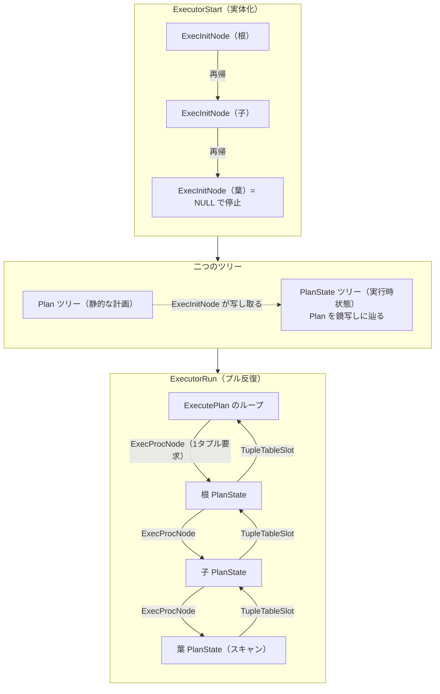

# 第16章 エグゼキュータの骨格

> **本章で読むソース**
>
> - [`src/backend/executor/execMain.c`](https://github.com/postgres/postgres/blob/REL_18_4/src/backend/executor/execMain.c)
> - [`src/backend/executor/execProcnode.c`](https://github.com/postgres/postgres/blob/REL_18_4/src/backend/executor/execProcnode.c)
> - [`src/include/executor/executor.h`](https://github.com/postgres/postgres/blob/REL_18_4/src/include/executor/executor.h)
> - [`src/include/nodes/execnodes.h`](https://github.com/postgres/postgres/blob/REL_18_4/src/include/nodes/execnodes.h)
> - [`src/include/executor/tuptable.h`](https://github.com/postgres/postgres/blob/REL_18_4/src/include/executor/tuptable.h)

## この章の狙い

第15章までで、プランナは最良パスを `Plan` ツリーへ変換し、変数参照をスロット番号まで固めた `PlannedStmt` を仕上げた。
本章はこの `PlannedStmt` を受け取り、結果のタプルを返すエグゼキュータの骨格を読む。

エグゼキュータの入口は3段に分かれる。
`ExecutorStart` が実行のための状態を用意し、`ExecutorRun` がタプルを取り出し、`ExecutorEnd` が後始末をする。
この3段はいずれも `execMain.c` にあり、すべて同じ形をしている。
プラグイン用のフック変数を見て、フックがなければ `standard_` 接頭辞の標準実装を呼ぶ。

骨格を貫く考え方は2つある。
一つは、静的な `Plan` ツリーを実行時状態の `PlanState` ツリーへ写し取る**実体化**であり、これは `ExecInitNode`（`execProcnode.c`）が担う。
もう一つは、根のノードが子へ「1タプルくれ」と要求し、子がさらにその子へ要求を伝える**プルモデル**の反復であり、これは `ExecProcNode` が担う。
本章はこの2つを軸に骨格をたどり、各ノードの中身（第17章から第19章）と式評価（第20章）への橋渡しまでを見る。

最適化の工夫としては、このプルモデルそのものを取り上げる。
親が必要な分だけ子を回す需要駆動の構造が、`LIMIT` のような場面で下位ノードの無駄な計算をどう省くかを機構レベルで説明する。

## 前提

第15章で、最良パスが `Plan` ツリーへ変換され、`set_plan_references` によって `Var` がスロット配列の添字へ固められるまでを読んだ。
その出力である `Plan` ツリーは `PlannedStmt` に包まれてプランナの最終成果となる。
本章はその `PlannedStmt`（`queryDesc->plannedstmt` 経由で渡される）を入口とする。

`QueryDesc` は、実行するプランと、その実行に必要な周辺情報（スナップショット、パラメータ、出力先）をまとめた容れ物である。
ポータルがこの `QueryDesc` を組み立ててエグゼキュータの3段を順に呼ぶ流れは、第9章のメインループで読んだ。

## 3段の入口：Start、Run、End

エグゼキュータの公開関数は、いずれもフックを挟んで標準実装へ振り分ける同じ形をしている。
`ExecutorStart` がその典型である。

[`src/backend/executor/execMain.c` L121-L138](https://github.com/postgres/postgres/blob/REL_18_4/src/backend/executor/execMain.c#L121-L138)

```c
void
ExecutorStart(QueryDesc *queryDesc, int eflags)
{
	/*
	 * In some cases (e.g. an EXECUTE statement or an execute message with the
	 * extended query protocol) the query_id won't be reported, so do it now.
	 *
	 * Note that it's harmless to report the query_id multiple times, as the
	 * call will be ignored if the top level query_id has already been
	 * reported.
	 */
	pgstat_report_query_id(queryDesc->plannedstmt->queryId, false);

	if (ExecutorStart_hook)
		(*ExecutorStart_hook) (queryDesc, eflags);
	else
		standard_ExecutorStart(queryDesc, eflags);
}
```

フック変数 `ExecutorStart_hook` が設定されていればそれを呼び、なければ `standard_ExecutorStart` を呼ぶ。
`ExecutorRun` と `ExecutorEnd` も同じ構造で、`pg_stat_statements` のような拡張は、このフックに割り込んで標準実装を包む形で計測や監査を差し込む。
本章では標準実装の側を読む。

3段の役割は次のとおりである。

- **`standard_ExecutorStart`**：実行時状態 `EState` を作り、`Plan` ツリーを `PlanState` ツリーへ実体化する。
- **`standard_ExecutorRun`**：根のノードを繰り返し回してタプルを取り出し、出力先へ送る。
- **`standard_ExecutorEnd`**：`PlanState` ツリーを後始末し、`EState` を解放する。

この3段が分かれているのは、呼び出し側がタプルの取り出しを複数回に分けて行えるようにするためである。
`ExecutorStart` で一度実体化したプランに対し、`ExecutorRun` を必要な回数だけ呼んで少しずつタプルを引ける。

## ExecutorStart：EState の構築と実体化

`standard_ExecutorStart` は実行時状態の器を用意する。
入口で `EState` を作り、以後の確保をすべて問い合わせ専用のメモリコンテキストの中で行う。

[`src/backend/executor/execMain.c` L141-L202](https://github.com/postgres/postgres/blob/REL_18_4/src/backend/executor/execMain.c#L141-L202)

```c
standard_ExecutorStart(QueryDesc *queryDesc, int eflags)
{
	EState	   *estate;
	MemoryContext oldcontext;

	/* sanity checks: queryDesc must not be started already */
	Assert(queryDesc != NULL);
	Assert(queryDesc->estate == NULL);

	/* caller must ensure the query's snapshot is active */
	Assert(GetActiveSnapshot() == queryDesc->snapshot);

// ... (中略) ...

	/*
	 * Build EState, switch into per-query memory context for startup.
	 */
	estate = CreateExecutorState();
	queryDesc->estate = estate;

	oldcontext = MemoryContextSwitchTo(estate->es_query_cxt);

	/*
	 * Fill in external parameters, if any, from queryDesc; and allocate
	 * workspace for internal parameters
	 */
	estate->es_param_list_info = queryDesc->params;

	if (queryDesc->plannedstmt->paramExecTypes != NIL)
	{
		int			nParamExec;

		nParamExec = list_length(queryDesc->plannedstmt->paramExecTypes);
		estate->es_param_exec_vals = (ParamExecData *)
			palloc0(nParamExec * sizeof(ParamExecData));
	}

	/* We now require all callers to provide sourceText */
	Assert(queryDesc->sourceText != NULL);
	estate->es_sourceText = queryDesc->sourceText;

	/*
	 * Fill in the query environment, if any, from queryDesc.
	 */
	estate->es_queryEnv = queryDesc->queryEnv;
```

`CreateExecutorState` が `EState` を作り、その中に問い合わせ専用のメモリコンテキスト `es_query_cxt` を持たせる。
直後の `MemoryContextSwitchTo` でこのコンテキストへ切り替えてから、パラメータや実行環境を `EState` へ書き写す。
切り替えの意味は、第6章で読んだメモリコンテキストの解放の作法にある。
実行中に確保したものはすべてこのコンテキストにぶら下がるので、`ExecutorEnd` でコンテキストごと捨てれば、ノードが個別に解放処理を書かなくても確保したメモリが一掃される。

`standard_ExecutorStart` の最後は、プランの実体化を `InitPlan` に委ねる。

[`src/backend/executor/execMain.c` L258-L264](https://github.com/postgres/postgres/blob/REL_18_4/src/backend/executor/execMain.c#L258-L264)

```c
	/*
	 * Initialize the plan state tree
	 */
	InitPlan(queryDesc, eflags);

	MemoryContextSwitchTo(oldcontext);
}
```

`InitPlan` を抜けると元のコンテキストへ戻す。
`Plan` ツリーから `PlanState` ツリーを起こす実体化が、ここで完了する。

### EState：実行全体で共有する状態

`EState` は、プラン全体で1個だけ存在し、すべての `PlanState` ノードから共有される実行時状態である。

[`src/include/nodes/execnodes.h` L649-L658](https://github.com/postgres/postgres/blob/REL_18_4/src/include/nodes/execnodes.h#L649-L658)

```c
typedef struct EState
{
	NodeTag		type;

	/* Basic state for all query types: */
	ScanDirection es_direction; /* current scan direction */
	Snapshot	es_snapshot;	/* time qual to use */
	Snapshot	es_crosscheck_snapshot; /* crosscheck time qual for RI */
	List	   *es_range_table; /* List of RangeTblEntry */
	Index		es_range_table_size;	/* size of the range table arrays */
```

`es_direction` は現在のスキャン方向、`es_snapshot` は可視性判定に使うスナップショットである。
範囲テーブルやパラメータといった問い合わせ単位の情報も、ここから続くフィールドにまとめて持つ。
本章で繰り返し使う作業用のフィールドは、構造体の後半にある。

[`src/include/nodes/execnodes.h` L704-L712](https://github.com/postgres/postgres/blob/REL_18_4/src/include/nodes/execnodes.h#L704-L712)

```c
	/* Other working state: */
	MemoryContext es_query_cxt; /* per-query context in which EState lives */

	List	   *es_tupleTable;	/* List of TupleTableSlots */

	uint64		es_processed;	/* # of tuples processed during one
								 * ExecutorRun() call. */
	uint64		es_total_processed; /* total # of tuples aggregated across all
									 * ExecutorRun() calls. */
```

`es_query_cxt` は前述の問い合わせ専用メモリコンテキストである。
`es_tupleTable` は、実行中に使うタプルスロット（後述）をまとめて持つリストで、解放はこのリストをたどって一括で行う。
`es_processed` は1回の `ExecutorRun` で処理したタプル数で、`SELECT` の結果行数として呼び出し側へ返る。

`EState` を1個に集約する設計の利点は、スナップショットやメモリコンテキストのような問い合わせ単位の状態を、各ノードが個別に持たず1か所で管理できる点にある。
どのノードも自分の `PlanState` から `state` ポインタをたどればこの共有状態に届く。

### InitPlan：範囲テーブルを開き、ノードを初期化する

`InitPlan` は実体化の本体である。
権限チェックと範囲テーブルの初期化を済ませてから、`Plan` ツリーの根に対して `ExecInitNode` を呼ぶ。

[`src/backend/executor/execMain.c` L986-L996](https://github.com/postgres/postgres/blob/REL_18_4/src/backend/executor/execMain.c#L986-L996)

```c
	/*
	 * Initialize the private state information for all the nodes in the query
	 * tree.  This opens files, allocates storage and leaves us ready to start
	 * processing tuples.
	 */
	planstate = ExecInitNode(plan, estate, eflags);

	/*
	 * Get the tuple descriptor describing the type of tuples to return.
	 */
	tupType = ExecGetResultType(planstate);
```

コメントが述べるとおり、この1行 `ExecInitNode(plan, estate, eflags)` が、ファイルを開きストレージを確保し、タプルを処理できる状態まで持っていく。
戻ってきた `planstate` が `PlanState` ツリーの根である。
`ExecGetResultType` で結果タプルの型（`TupleDesc`）を取り出し、`queryDesc` に保存して `InitPlan` は終わる。
範囲テーブルを開く `ExecInitRangeTable` や `ExecCheckPermissions` も `InitPlan` の冒頭で呼ばれるが、本章の主題は `ExecInitNode` による実体化なので、次節でそこへ進む。

## ExecInitNode：Plan ツリーを PlanState ツリーへ

`ExecInitNode` は、`Plan` ノード1個を受け取り、対応する `PlanState` ノードを返す。
`Plan` のノード種別（`nodeTag`）を見て、種別ごとの初期化関数へ振り分ける巨大な `switch` である。

[`src/backend/executor/execProcnode.c` L141-L169](https://github.com/postgres/postgres/blob/REL_18_4/src/backend/executor/execProcnode.c#L141-L169)

```c
PlanState *
ExecInitNode(Plan *node, EState *estate, int eflags)
{
	PlanState  *result;
	List	   *subps;
	ListCell   *l;

	/*
	 * do nothing when we get to the end of a leaf on tree.
	 */
	if (node == NULL)
		return NULL;

	/*
	 * Make sure there's enough stack available. Need to check here, in
	 * addition to ExecProcNode() (via ExecProcNodeFirst()), to ensure the
	 * stack isn't overrun while initializing the node tree.
	 */
	check_stack_depth();

	switch (nodeTag(node))
	{
			/*
			 * control nodes
			 */
		case T_Result:
			result = (PlanState *) ExecInitResult((Result *) node,
												  estate, eflags);
			break;
```

入口でまず `node == NULL` を返り値 `NULL` で受け止める。
これは葉の先（子を持たないスキャンノードの `lefttree` など）に達したことを表す。
次の `check_stack_depth` は、深いプランで再帰がスタックを食い尽くすのを防ぐ。
そして `switch` がノード種別ごとの `ExecInit...` 関数へ分岐する。

各分岐の中で何が起きるかが要点である。
スキャンノードの初期化関数 `ExecInitSeqScan` などは、自分の状態を組み立てる過程で、自分の子 `Plan` に対して `ExecInitNode` を再び呼ぶ。
結合ノードの初期化関数なら、左右2本の子に対してそれぞれ `ExecInitNode` を呼ぶ。
こうして根から葉へ再帰が降り、`Plan` ツリーと同じ形の `PlanState` ツリーが下から組み上がる。
冒頭のファイルコメントが、ネステッドループの例でこの再帰を述べている。

[`src/backend/executor/execProcnode.c` L47-L52](https://github.com/postgres/postgres/blob/REL_18_4/src/backend/executor/execProcnode.c#L47-L52)

```c
 *	  * ExecInitNode() notices that it is looking at a nest loop and
 *		as the code below demonstrates, it calls ExecInitNestLoop().
 *		Eventually this calls ExecInitNode() on the right and left subplans
 *		and so forth until the entire plan is initialized.  The result
 *		of ExecInitNode() is a plan state tree built with the same structure
 *		as the underlying plan tree.
```

`switch` を抜けた後の共通処理が、骨格のもう一つの要点である。

[`src/backend/executor/execProcnode.c` L389-L420](https://github.com/postgres/postgres/blob/REL_18_4/src/backend/executor/execProcnode.c#L389-L420)

```c
	}

	ExecSetExecProcNode(result, result->ExecProcNode);

	/*
	 * Initialize any initPlans present in this node.  The planner put them in
	 * a separate list for us.
	 *
	 * The defining characteristic of initplans is that they don't have
	 * arguments, so we don't need to evaluate them (in contrast to
	 * ExecInitSubPlanExpr()).
	 */
	subps = NIL;
	foreach(l, node->initPlan)
	{
		SubPlan    *subplan = (SubPlan *) lfirst(l);
		SubPlanState *sstate;

		Assert(IsA(subplan, SubPlan));
		Assert(subplan->args == NIL);
		sstate = ExecInitSubPlan(subplan, result);
		subps = lappend(subps, sstate);
	}
	result->initPlan = subps;

	/* Set up instrumentation for this node if requested */
	if (estate->es_instrument)
		result->instrument = InstrAlloc(1, estate->es_instrument,
										result->async_capable);

	return result;
}
```

`ExecSetExecProcNode` が、各種別の初期化関数が `result->ExecProcNode` に入れておいた「次のタプルを返す関数」をラッパーで包む。
このラッパーが実行時の反復の入口になる（後述）。
続いて、このノードに付いた `initPlan`（相関のないサブクエリ）を初期化し、計測が要求されていれば計測用の領域を確保する。

### PlanState：実行時状態の共通の頭

`switch` のどの分岐も、種別固有の状態構造体を作って返す。
それらはいずれも先頭に `PlanState` を埋め込んでおり、`PlanState` がすべての実行ノードの共通の頭である。

[`src/include/nodes/execnodes.h` L1149-L1182](https://github.com/postgres/postgres/blob/REL_18_4/src/include/nodes/execnodes.h#L1149-L1182)

```c
typedef struct PlanState
{
	pg_node_attr(abstract)

	NodeTag		type;

	Plan	   *plan;			/* associated Plan node */

	EState	   *state;			/* at execution time, states of individual
								 * nodes point to one EState for the whole
								 * top-level plan */

	ExecProcNodeMtd ExecProcNode;	/* function to return next tuple */
	ExecProcNodeMtd ExecProcNodeReal;	/* actual function, if above is a
										 * wrapper */

	Instrumentation *instrument;	/* Optional runtime stats for this node */
	WorkerInstrumentation *worker_instrument;	/* per-worker instrumentation */

	/* Per-worker JIT instrumentation */
	struct SharedJitInstrumentation *worker_jit_instrument;

	/*
	 * Common structural data for all Plan types.  These links to subsidiary
	 * state trees parallel links in the associated plan tree (except for the
	 * subPlan list, which does not exist in the plan tree).
	 */
	ExprState  *qual;			/* boolean qual condition */
	struct PlanState *lefttree; /* input plan tree(s) */
	struct PlanState *righttree;

	List	   *initPlan;		/* Init SubPlanState nodes (un-correlated expr
								 * subselects) */
	List	   *subPlan;		/* SubPlanState nodes in my expressions */
```

`plan` は対応する静的な `Plan` ノードへの逆ポインタ、`state` は前述の共有 `EState` への逆ポインタである。
`lefttree` と `righttree` が子の `PlanState` への枝で、`Plan` ツリーの同名フィールドと並行する。
ここが実体化の核心である。
`PlanState` ツリーは `Plan` ツリーを鏡写しに辿る別のツリーであり、静的な計画（`Plan`）と動的な状態（`PlanState`）を分けて持つ。

`ExecProcNode` フィールドは、このノードから次のタプルを返す関数へのポインタである。
`qual` は条件式をコンパイルした `ExprState` で、式の評価は第20章で読む。
種別ごとの状態は、この `PlanState` の後に固有のフィールドを足した構造体になる。
たとえば `SeqScanState` は先頭に `ScanState` を、`ScanState` は先頭に `PlanState` を埋め込む入れ子で、どの実行ノードも `PlanState *` へ安全にキャストできる。

## ExecProcNode：プルモデルの反復

実体化を終えると、`ExecutorRun` が反復に入る。
`standard_ExecutorRun` は出力先を起動してから `ExecutePlan` を呼ぶ。

[`src/backend/executor/execMain.c` L306-L389](https://github.com/postgres/postgres/blob/REL_18_4/src/backend/executor/execMain.c#L306-L389)

```c
void
standard_ExecutorRun(QueryDesc *queryDesc,
					 ScanDirection direction, uint64 count)
{
	EState	   *estate;
	CmdType		operation;
	DestReceiver *dest;
	bool		sendTuples;
	MemoryContext oldcontext;

// ... (中略) ...

	sendTuples = (operation == CMD_SELECT ||
				  queryDesc->plannedstmt->hasReturning);

	if (sendTuples)
		dest->rStartup(dest, operation, queryDesc->tupDesc);

	/*
	 * Run plan, unless direction is NoMovement.
	 *
	 * Note: pquery.c selects NoMovement if a prior call already reached
	 * end-of-data in the user-specified fetch direction.  This is important
	 * because various parts of the executor can misbehave if called again
	 * after reporting EOF.  For example, heapam.c would actually restart a
	 * heapscan and return all its data afresh.  There is also some doubt
	 * about whether a parallel plan would operate properly if an additional,
	 * necessarily non-parallel execution request occurs after completing a
	 * parallel execution.  (That case should work, but it's untested.)
	 */
	if (!ScanDirectionIsNoMovement(direction))
		ExecutePlan(queryDesc,
					operation,
					sendTuples,
					count,
					direction,
					dest);

// ... (中略) ...

	MemoryContextSwitchTo(oldcontext);
}
```

`sendTuples` は、結果タプルを出力先（`DestReceiver`）へ送るかを表す。
`SELECT` か `RETURNING` 付きの更新ならタプルを送る。
`count` は取り出すタプルの上限で、`0` なら無制限である。
この `count` が、後で見るプルモデルと `LIMIT` の関係に効く。

反復の本体は `ExecutePlan` にある。

[`src/backend/executor/execMain.c` L1700-L1762](https://github.com/postgres/postgres/blob/REL_18_4/src/backend/executor/execMain.c#L1700-L1762)

```c
	/*
	 * Loop until we've processed the proper number of tuples from the plan.
	 */
	for (;;)
	{
		/* Reset the per-output-tuple exprcontext */
		ResetPerTupleExprContext(estate);

		/*
		 * Execute the plan and obtain a tuple
		 */
		slot = ExecProcNode(planstate);

		/*
		 * if the tuple is null, then we assume there is nothing more to
		 * process so we just end the loop...
		 */
		if (TupIsNull(slot))
			break;

		/*
		 * If we have a junk filter, then project a new tuple with the junk
		 * removed.
		 *
		 * Store this new "clean" tuple in the junkfilter's resultSlot.
		 * (Formerly, we stored it back over the "dirty" tuple, which is WRONG
		 * because that tuple slot has the wrong descriptor.)
		 */
		if (estate->es_junkFilter != NULL)
			slot = ExecFilterJunk(estate->es_junkFilter, slot);

		/*
		 * If we are supposed to send the tuple somewhere, do so. (In
		 * practice, this is probably always the case at this point.)
		 */
		if (sendTuples)
		{
			/*
			 * If we are not able to send the tuple, we assume the destination
			 * has closed and no more tuples can be sent. If that's the case,
			 * end the loop.
			 */
			if (!dest->receiveSlot(slot, dest))
				break;
		}

		/*
		 * Count tuples processed, if this is a SELECT.  (For other operation
		 * types, the ModifyTable plan node must count the appropriate
		 * events.)
		 */
		if (operation == CMD_SELECT)
			(estate->es_processed)++;

		/*
		 * check our tuple count.. if we've processed the proper number then
		 * quit, else loop again and process more tuples.  Zero numberTuples
		 * means no limit.
		 */
		current_tuple_count++;
		if (numberTuples && numberTuples == current_tuple_count)
			break;
	}
```

この `for` ループがエグゼキュータの心臓である。
各周回で `ExecProcNode(planstate)` を1回呼び、根のノードから1タプルを引く。
返ったスロットが空（`TupIsNull`）ならデータが尽きたとみなしてループを抜ける。
空でなければ、出力先へ送り、`SELECT` ならカウンタを進める。
そして `numberTuples`（`standard_ExecutorRun` の `count`）に達したら抜ける。
ループは1タプルずつ進み、上限に達するか根が空を返すまで続く。

`ExecProcNode` の実体は `executor.h` のインライン関数である。

[`src/include/executor/executor.h` L308-L317](https://github.com/postgres/postgres/blob/REL_18_4/src/include/executor/executor.h#L308-L317)

```c
#ifndef FRONTEND
static inline TupleTableSlot *
ExecProcNode(PlanState *node)
{
	if (node->chgParam != NULL) /* something changed? */
		ExecReScan(node);		/* let ReScan handle this */

	return node->ExecProcNode(node);
}
#endif
```

`ExecProcNode` は、パラメータが変わっていれば再スキャンを挟んでから、ノードの `ExecProcNode` 関数ポインタを呼ぶだけの薄い関数である。
このポインタは `PlanState` ごとに種別固有の関数を指す。
スキャンノードなら自分のテーブルから1行読む関数、結合ノードなら子から引いて結合する関数である。
要点は、親が子へ `ExecProcNode` を呼ぶと、子の関数が自分の子へさらに `ExecProcNode` を呼ぶ点にある。
こうして1回の根への要求が、ツリーを葉まで降りる連鎖の要求になる。

### ExecProcNodeFirst：初回だけ走るラッパー

`ExecInitNode` の共通処理で見た `ExecSetExecProcNode` は、各ノードの `ExecProcNode` を `ExecProcNodeFirst` というラッパーへ差し替えていた。

[`src/backend/executor/execProcnode.c` L447-L470](https://github.com/postgres/postgres/blob/REL_18_4/src/backend/executor/execProcnode.c#L447-L470)

```c
static TupleTableSlot *
ExecProcNodeFirst(PlanState *node)
{
	/*
	 * Perform stack depth check during the first execution of the node.  We
	 * only do so the first time round because it turns out to not be cheap on
	 * some common architectures (eg. x86).  This relies on the assumption
	 * that ExecProcNode calls for a given plan node will always be made at
	 * roughly the same stack depth.
	 */
	check_stack_depth();

	/*
	 * If instrumentation is required, change the wrapper to one that just
	 * does instrumentation.  Otherwise we can dispense with all wrappers and
	 * have ExecProcNode() directly call the relevant function from now on.
	 */
	if (node->instrument)
		node->ExecProcNode = ExecProcNodeInstr;
	else
		node->ExecProcNode = node->ExecProcNodeReal;

	return node->ExecProcNode(node);
}
```

`ExecProcNodeFirst` は初回の呼び出しでだけスタック深さを点検し、その後は自分自身を本来の関数（計測ありなら `ExecProcNodeInstr`、なしなら `ExecProcNodeReal`）へ差し替える。
コメントが述べるとおり、スタック点検は一部のアーキテクチャで安くないので、毎タプルではなく初回1回に限る。
ノードへの要求は同じスタック深さで繰り返されるという前提に立った工夫である。
2回目以降は `ExecProcNode` がラッパーを介さず本来の関数を直に呼ぶので、反復の経路から点検と分岐が消える。

## TupleTableSlot：タプルの受け渡し

ノードからノードへ渡るタプルは、生のタプルそのものではなく `TupleTableSlot` に収まって渡る。

[`src/include/executor/tuptable.h` L114-L131](https://github.com/postgres/postgres/blob/REL_18_4/src/include/executor/tuptable.h#L114-L131)

```c
typedef struct TupleTableSlot
{
	NodeTag		type;
#define FIELDNO_TUPLETABLESLOT_FLAGS 1
	uint16		tts_flags;		/* Boolean states */
#define FIELDNO_TUPLETABLESLOT_NVALID 2
	AttrNumber	tts_nvalid;		/* # of valid values in tts_values */
	const TupleTableSlotOps *const tts_ops; /* implementation of slot */
#define FIELDNO_TUPLETABLESLOT_TUPLEDESCRIPTOR 4
	TupleDesc	tts_tupleDescriptor;	/* slot's tuple descriptor */
#define FIELDNO_TUPLETABLESLOT_VALUES 5
	Datum	   *tts_values;		/* current per-attribute values */
#define FIELDNO_TUPLETABLESLOT_ISNULL 6
	bool	   *tts_isnull;		/* current per-attribute isnull flags */
	MemoryContext tts_mcxt;		/* slot itself is in this context */
	ItemPointerData tts_tid;	/* stored tuple's tid */
	Oid			tts_tableOid;	/* table oid of tuple */
} TupleTableSlot;
```

スロットは、1タプルを保持する器である。
`tts_values` が列ごとの値の配列、`tts_isnull` が列ごとの NULL フラグ、`tts_nvalid` がそのうち現在有効な値の個数である。
`tts_tupleDescriptor` がタプルの型を表し、`tts_ops` がスロットの実装方式（仮想スロット、ヒープタプルを包むスロットなど）を指す関数表である。

スロットを挟む理由は2つある。
一つは、タプルの物理形式の違いを覆い隠すことである。
ヒープから読んだタプルも、結合や射影で作った仮想タプルも、上位ノードからは同じスロットに見える。
`tts_ops` がその違いを吸収するので、上位ノードは相手の物理形式を気にせず値を引ける。

もう一つは、値の取り出しを必要な分だけに遅らせることである。
スロットは作られた時点では値を展開しておらず、`tts_nvalid` 列目までしか有効な値を持たない。
ある列の値が初めて要求されたとき、`tts_ops` の関数がそこまでの列を展開して `tts_values` に詰める。
末尾の列が結局使われないなら、その列はデコードされない。
ノード間をスロットで受け渡すことで、この遅延展開がツリー全体で効く。

スロットは `EState` の `es_tupleTable` にまとめて登録され、`ExecutorEnd` で一括して解放される。
1タプルごとに新しいスロットを作らず、ノードが持つ少数のスロットを上書きしながら使い回すので、反復のたびに確保と解放を繰り返さずに済む。

## ExecutorEnd：後始末

タプルを取り終えると `ExecutorEnd` が後始末をする。
`standard_ExecutorEnd` は `PlanState` ツリーを末端から閉じ、`EState` を解放する。

[`src/backend/executor/execMain.c` L499-L526](https://github.com/postgres/postgres/blob/REL_18_4/src/backend/executor/execMain.c#L499-L526)

```c
	/*
	 * Switch into per-query memory context to run ExecEndPlan
	 */
	oldcontext = MemoryContextSwitchTo(estate->es_query_cxt);

	ExecEndPlan(queryDesc->planstate, estate);

	/* do away with our snapshots */
	UnregisterSnapshot(estate->es_snapshot);
	UnregisterSnapshot(estate->es_crosscheck_snapshot);

	/*
	 * Must switch out of context before destroying it
	 */
	MemoryContextSwitchTo(oldcontext);

	/*
	 * Release EState and per-query memory context.  This should release
	 * everything the executor has allocated.
	 */
	FreeExecutorState(estate);

	/* Reset queryDesc fields that no longer point to anything */
	queryDesc->tupDesc = NULL;
	queryDesc->estate = NULL;
	queryDesc->planstate = NULL;
	queryDesc->totaltime = NULL;
}
```

`ExecEndPlan` が `PlanState` ツリーをたどり、各ノードの `ExecEndNode` を呼んで開いたファイルなどを閉じる。
これは `ExecInitNode` の鏡像で、根から葉へ再帰して各ノードを閉じる。
スナップショットの登録解除のあと、`FreeExecutorState` が `es_query_cxt` ごと解放する。
コメントが「エグゼキュータが確保したすべてを解放する」と述べるとおり、実行中の確保はすべてこのコンテキストにぶら下がっていたので、コンテキストを捨てれば一掃される。
個々のノードがメモリの個別解放を書かなくてよいのは、`ExecutorStart` で問い合わせ専用コンテキストへ切り替えておいたからである。

## 最適化：プルモデルの需要駆動

本章の機構レベルの最適化は、プルモデルそのものである。

エグゼキュータは、根のノードが「1タプルくれ」と要求し、その要求が子へ、孫へと降りていく**プル型**で動く。
反対に、葉が全タプルを作って上へ押し上げる**プッシュ型**も考えられる。
プッシュ型では、葉のスキャンが先に全行を読み、その上で上位ノードが処理する。
PostgreSQL が選んだのはプル型であり、`ExecutePlan` のループは欲しいタプル数 `numberTuples` に達した時点で根への要求をやめる。

この差が `LIMIT` で効く。
`SELECT ... LIMIT 10` のプランは、根の近くに `Limit` ノードが立つ。
`Limit` ノードは、10タプルを子から引いた時点で、それ以上は子へ `ExecProcNode` を呼ばず、空スロットを返して打ち切る。
子のスキャンは、`Limit` から要求された分しか回らない。
要求が来なければスキャンは止まったままなので、テーブルの残りの行は読まれない。
プル型では、上位ノードが必要とした分だけ下位ノードが回り、要求されなかった計算は最初から行われない。

同じことが `ExecutePlan` の外側からも起きる。
`standard_ExecutorRun` の `count` 引数は、ポータルが「いま何タプル欲しいか」を渡す値である。
カーソルを `FETCH 5` で進めると、`count` に 5 が渡り、ループは5タプルで止まる。
次の `FETCH` で `ExecutorRun` がまた呼ばれ、根は続きの5タプルを返す。
プランは `ExecutorStart` で1度だけ実体化され、`ExecutorRun` を呼ぶたびに続きを少しずつ引ける。
3段を分けた設計と、プル型の需要駆動が、ここで噛み合う。

プッシュ型なら、`LIMIT` や `FETCH` があっても葉は全行を作ってしまい、上位で大半を捨てることになる。
プル型は要求を上から下へ流すので、捨てる分の行をそもそも作らない。
これが、プルモデルが無駄な計算を避ける機構である。

## エグゼキュータの骨格と各ノードへの橋渡し

ここまでの実体化と反復を1枚にまとめる。



実体化は `Plan` ツリーから `PlanState` ツリーを起こし、反復は根から葉へ要求を流して葉から根へスロットを返す。
この骨格の上に、各ノードの中身が乗る。

各スキャンノードがテーブルやインデックスから1タプルをどう読むかは第17章で、結合ノードが左右の子から引いたタプルをどう突き合わせるかは第18章で、集約やソートやマテリアライズが子のタプルをどう溜めて返すかは第19章で読む。
ノードが評価する `qual` や `targetlist` の式が、`TupleTableSlot` の値からどう計算されるかは第20章の式評価で読む。
本章はその土台として、3段の入口、`PlanState` への実体化、`ExecProcNode` のプル反復、`TupleTableSlot` による受け渡しという骨格を据えた。

## まとめ

エグゼキュータは `PlannedStmt` を受け取り、`ExecutorStart`、`ExecutorRun`、`ExecutorEnd` の3段でタプルを返す。
3段はいずれもフックを挟んで `standard_` 実装へ振り分ける同じ形をしている。

`ExecutorStart` は `EState` を作って問い合わせ専用メモリコンテキストへ切り替え、`InitPlan` 経由の `ExecInitNode` で `Plan` ツリーを `PlanState` ツリーへ実体化する。
`ExecInitNode` はノード種別ごとに分岐し、子に対して自身を再帰呼び出しして、`Plan` と同じ形の `PlanState` ツリーを下から組み上げる。
`PlanState` は静的な `Plan` への逆ポインタと共有 `EState` への逆ポインタを持ち、計画と実行時状態を分けて表す。

`ExecutorRun` は `ExecutePlan` のループで `ExecProcNode` を繰り返し呼ぶ。
親が子へ `ExecProcNode` を呼ぶと要求が葉まで降り、葉から根へ `TupleTableSlot` が返る。
スロットはタプルの物理形式を覆い隠し、値の展開を必要な列まで遅らせる。

このプル型の反復が本章の最適化である。
上位ノードが必要とした分だけ下位ノードが回るので、`LIMIT` や `FETCH` のように要求数が限られる場面で、捨てるはずの行をそもそも作らずに済む。
`ExecutorEnd` は `PlanState` ツリーを閉じ、問い合わせ専用コンテキストごと解放して後始末を一掃する。

## 関連する章

- [第15章 プランの実体化](../part03-query-frontend/15-plan-creation.md)：本章の入口となる `Plan` ツリーと、`Var` をスロット番号へ固める段。
- [第17章 スキャンノード](17-scan-nodes.md)：葉の `SeqScan` などが `ExecProcNode` でテーブルから1タプルを読む実装。
- [第18章 結合ノード](18-join-nodes.md)：結合ノードが左右の子から引いたタプルを突き合わせる実装。
- [第19章 集約、ソート、マテリアライズ](19-aggregation-sort.md)：子のタプルを溜めて返す上位ノードの実装。
- [第20章 式評価と JIT](20-expression-evaluation.md)：ノードが `qual` や `targetlist` の式を `TupleTableSlot` の値から計算する仕組み。
