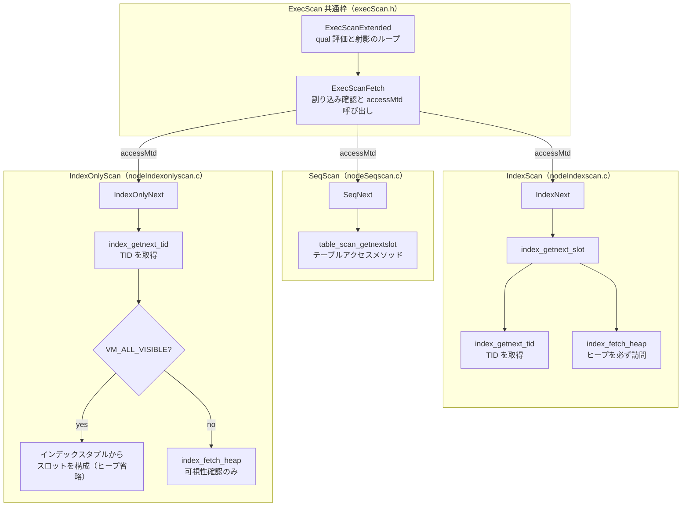

# 第17章 スキャンノード

> **本章で読むソース**
>
> - [`src/backend/executor/execScan.c`](https://github.com/postgres/postgres/blob/REL_18_4/src/backend/executor/execScan.c)
> - [`src/include/executor/execScan.h`](https://github.com/postgres/postgres/blob/REL_18_4/src/include/executor/execScan.h)
> - [`src/backend/executor/nodeSeqscan.c`](https://github.com/postgres/postgres/blob/REL_18_4/src/backend/executor/nodeSeqscan.c)
> - [`src/backend/executor/nodeIndexscan.c`](https://github.com/postgres/postgres/blob/REL_18_4/src/backend/executor/nodeIndexscan.c)
> - [`src/backend/executor/nodeIndexonlyscan.c`](https://github.com/postgres/postgres/blob/REL_18_4/src/backend/executor/nodeIndexonlyscan.c)
> - [`src/backend/access/index/indexam.c`](https://github.com/postgres/postgres/blob/REL_18_4/src/backend/access/index/indexam.c)

## この章の狙い

第16章で、エグゼキュータは `Plan` ツリーを鏡写しの `PlanState` ツリーへ展開し、根のノードに1タプルずつ要求しては葉へ要求を伝播させる方式だと読んだ。
その要求が最後に届く先が、本章の主題であるスキャンノードである。
スキャンノードはツリーの葉に位置し、テーブルやインデックスから実際のタプルを1つ取り出して上へ返す。

スキャンノードには逐次スキャン `SeqScan`、インデックススキャン `IndexScan`、インデックスオンリースキャン `IndexOnlyScan` など複数の種類がある。
取得経路はそれぞれ違うが、取り出したタプルに `WHERE` 条件（qual）を適用し、必要な列だけを射影して返すという後段の流れは共通である。
この共通部分を1か所に集めたのが `ExecScan` の枠組みであり、各スキャンノードは「次の1タプルを取る」関数だけを差し替えて再利用する。

本章は、まず共通枠 `ExecScan` を読み、続いて `SeqScan` と `IndexScan` が取得関数をどう与えるかを追う。
最後に、`IndexOnlyScan` が可視性マップ（visibility map、VM）を使ってヒープアクセスを丸ごと省く機構を、本章の最適化として読む。

## 前提

第16章でエグゼキュータの骨格、すなわち `ExecProcNode` でノードを駆動し `TupleTableSlot` でタプルを受け渡す仕組みを読んだ。
第15章で `set_plan_references` が `Var` をスロット番号へ固めたので、スキャンノードが評価する qual と射影の中の `Var` は、すでに手元のタプルから添字一つで引ける形になっている。
テーブルアクセスメソッド（第25章）とインデックスアクセスメソッド（第30章）の内部は後続の部で扱う。
本章はその境界の手前、エグゼキュータがアクセスメソッドをどう呼ぶかまでを読む。

## `ExecScan`：取得とフィルタの共通枠

スキャンノードに共通する仕事は、`execScan.c` の冒頭コメントが簡潔にまとめている。
取得関数が次のタプルを返し、`ExecScan` がそれを qual と照合し、適切に射影する。

[`src/backend/executor/execScan.c` L46-L65](https://github.com/postgres/postgres/blob/REL_18_4/src/backend/executor/execScan.c#L46-L65)

```c
TupleTableSlot *
ExecScan(ScanState *node,
		 ExecScanAccessMtd accessMtd,	/* function returning a tuple */
		 ExecScanRecheckMtd recheckMtd)
{
	EPQState   *epqstate;
	ExprState  *qual;
	ProjectionInfo *projInfo;

	epqstate = node->ps.state->es_epq_active;
	qual = node->ps.qual;
	projInfo = node->ps.ps_ProjInfo;

	return ExecScanExtended(node,
							accessMtd,
							recheckMtd,
							epqstate,
							qual,
							projInfo);
}
```

`ExecScan` は2つの関数ポインタを引数に取る。
`accessMtd`（access method）は「次の1タプルを取る」関数で、スキャン種別ごとに異なる。
`recheckMtd`（recheck method）は、後述する EvalPlanQual のときにアクセスメソッド固有の条件を再確認する関数である。
`ExecScan` 自身はこの2つに加え、現ノードの qual と射影情報 `projInfo` を取り出して `ExecScanExtended` へ丸ごと渡すだけの薄い入口になっている。

中身の `ExecScanExtended` はヘッダの `static pg_attribute_always_inline` 関数として定義されている。
qual と射影がないときの最短経路を先に処理し、それ以外はループに入る。

[`src/include/executor/execScan.h` L159-L179](https://github.com/postgres/postgres/blob/REL_18_4/src/include/executor/execScan.h#L159-L179)

```c
static pg_attribute_always_inline TupleTableSlot *
ExecScanExtended(ScanState *node,
				 ExecScanAccessMtd accessMtd,	/* function returning a tuple */
				 ExecScanRecheckMtd recheckMtd,
				 EPQState *epqstate,
				 ExprState *qual,
				 ProjectionInfo *projInfo)
{
	ExprContext *econtext = node->ps.ps_ExprContext;

	/* interrupt checks are in ExecScanFetch */

	/*
	 * If we have neither a qual to check nor a projection to do, just skip
	 * all the overhead and return the raw scan tuple.
	 */
	if (!qual && !projInfo)
	{
		ResetExprContext(econtext);
		return ExecScanFetch(node, epqstate, accessMtd, recheckMtd);
	}
```

qual も射影もなければ、`ExecScanFetch` で1タプル取って即座に返す。
`SELECT * FROM t` のように絞り込みも列の加工もない問い合わせがこの経路に乗り、条件評価の準備すら省かれる。

qual か射影があるときは、qual を通過するタプルが見つかるまで回すループに入る。

[`src/include/executor/execScan.h` L191-L252](https://github.com/postgres/postgres/blob/REL_18_4/src/include/executor/execScan.h#L191-L252)

```c
	for (;;)
	{
		TupleTableSlot *slot;

		slot = ExecScanFetch(node, epqstate, accessMtd, recheckMtd);

		/*
		 * if the slot returned by the accessMtd contains NULL, then it means
		 * there is nothing more to scan so we just return an empty slot,
		 * being careful to use the projection result slot so it has correct
		 * tupleDesc.
		 */
		if (TupIsNull(slot))
		{
			if (projInfo)
				return ExecClearTuple(projInfo->pi_state.resultslot);
			else
				return slot;
		}

		/*
		 * place the current tuple into the expr context
		 */
		econtext->ecxt_scantuple = slot;

		/*
		 * check that the current tuple satisfies the qual-clause
		 *
		 * check for non-null qual here to avoid a function call to ExecQual()
		 * when the qual is null ... saves only a few cycles, but they add up
		 * ...
		 */
		if (qual == NULL || ExecQual(qual, econtext))
		{
			/*
			 * Found a satisfactory scan tuple.
			 */
			if (projInfo)
			{
				/*
				 * Form a projection tuple, store it in the result tuple slot
				 * and return it.
				 */
				return ExecProject(projInfo);
			}
			else
			{
				/*
				 * Here, we aren't projecting, so just return scan tuple.
				 */
				return slot;
			}
		}
		else
			InstrCountFiltered1(node, 1);

		/*
		 * Tuple fails qual, so free per-tuple memory and try again.
		 */
		ResetExprContext(econtext);
	}
}
```

ループの構造は3段である。
`ExecScanFetch` が次の1タプルをスロットに取る。
取れなければ（`TupIsNull`）スキャン終端なので空スロットを返してループを抜ける。
取れたら、そのタプルを式評価コンテキスト `econtext->ecxt_scantuple` に据え、`ExecQual` で qual を評価する。
qual を満たせば `ExecProject` で必要な列だけ射影して返し、満たさなければ `InstrCountFiltered1` で除外件数を1つ数え、メモリを解放してループ先頭へ戻る。

ここで「取得（fetch）はノード固有」「フィルタと射影は共通」という役割分担がはっきり見える。
スキャン種別がどれだけ増えても、qual 評価と射影のコードは `ExecScanExtended` の1か所だけに存在する。
ノード側は `accessMtd` に「次の1タプルを取る」関数を1つ与えるだけでよい。

`ExecScanFetch` は、その取得の1段手前で割り込みを確認し、通常は `accessMtd` をそのまま呼ぶ。

[`src/include/executor/execScan.h` L31-L48](https://github.com/postgres/postgres/blob/REL_18_4/src/include/executor/execScan.h#L31-L48)

```c
static pg_attribute_always_inline TupleTableSlot *
ExecScanFetch(ScanState *node,
			  EPQState *epqstate,
			  ExecScanAccessMtd accessMtd,
			  ExecScanRecheckMtd recheckMtd)
{
	CHECK_FOR_INTERRUPTS();

	if (epqstate != NULL)
	{
		/*
		 * We are inside an EvalPlanQual recheck.  Return the test tuple if
		 * one is available, after rechecking any access-method-specific
		 * conditions.
		 */
		Index		scanrelid = ((Scan *) node->ps.plan)->scanrelid;

		if (scanrelid == 0)
```

`epqstate` が非 NULL のときは EvalPlanQual の再確認中で、スキャンを実行する代わりに呼び出し側が用意した検査用タプルを返す経路に入る。
EvalPlanQual は、`UPDATE` や `SELECT FOR UPDATE` が更新対象の行を読んだあとに別トランザクションがその行を更新していた場合、最新版で条件を評価し直す仕組みである。
通常の問い合わせでは `epqstate` は NULL なので、`ExecScanFetch` は末尾で `accessMtd` を呼ぶだけになる。

[`src/include/executor/execScan.h` L131-L135](https://github.com/postgres/postgres/blob/REL_18_4/src/include/executor/execScan.h#L131-L135)

```c
	/*
	 * Run the node-type-specific access method function to get the next tuple
	 */
	return (*accessMtd) (node);
}
```

## 逐次スキャン `SeqScan`

逐次スキャンの取得関数 `SeqNext` は、テーブルの先頭から末尾まで1タプルずつ読み進める。

[`src/backend/executor/nodeSeqscan.c` L50-L84](https://github.com/postgres/postgres/blob/REL_18_4/src/backend/executor/nodeSeqscan.c#L50-L84)

```c
static TupleTableSlot *
SeqNext(SeqScanState *node)
{
	TableScanDesc scandesc;
	EState	   *estate;
	ScanDirection direction;
	TupleTableSlot *slot;

	/*
	 * get information from the estate and scan state
	 */
	scandesc = node->ss.ss_currentScanDesc;
	estate = node->ss.ps.state;
	direction = estate->es_direction;
	slot = node->ss.ss_ScanTupleSlot;

	if (scandesc == NULL)
	{
		/*
		 * We reach here if the scan is not parallel, or if we're serially
		 * executing a scan that was planned to be parallel.
		 */
		scandesc = table_beginscan(node->ss.ss_currentRelation,
								   estate->es_snapshot,
								   0, NULL);
		node->ss.ss_currentScanDesc = scandesc;
	}

	/*
	 * get the next tuple from the table
	 */
	if (table_scan_getnextslot(scandesc, direction, slot))
		return slot;
	return NULL;
}
```

最初の呼び出しではスキャン記述子 `scandesc` がまだ NULL なので、`table_beginscan` でスキャンを開始する。
このとき現在のトランザクションのスナップショット `es_snapshot` を渡す点が要点である。
スナップショットによって、このスキャンが「見える」タプルの範囲が決まる。

タプルの取得そのものは `table_scan_getnextslot` の1行に集約される。
これはテーブルアクセスメソッド（第25章）への入口で、ヒープなら次に可視なタプルをスロットへ詰めて `true` を返す。
取れなければ `false` を返し、`SeqNext` は NULL を返してスキャン終端を伝える。
`SeqNext` はテーブルの物理レイアウトを一切知らず、可視性判定もアクセスメソッドに委ねている。

`SeqScan` で目を引くのは、初期化のときに qual と射影の有無で実行関数を選び分ける点である。
`ExecInitSeqScan` の末尾を見る。

[`src/backend/executor/nodeSeqscan.c` L257-L279](https://github.com/postgres/postgres/blob/REL_18_4/src/backend/executor/nodeSeqscan.c#L257-L279)

```c
	/*
	 * When EvalPlanQual() is not in use, assign ExecProcNode for this node
	 * based on the presence of qual and projection. Each ExecSeqScan*()
	 * variant is optimized for the specific combination of these conditions.
	 */
	if (scanstate->ss.ps.state->es_epq_active != NULL)
		scanstate->ss.ps.ExecProcNode = ExecSeqScanEPQ;
	else if (scanstate->ss.ps.qual == NULL)
	{
		if (scanstate->ss.ps.ps_ProjInfo == NULL)
			scanstate->ss.ps.ExecProcNode = ExecSeqScan;
		else
			scanstate->ss.ps.ExecProcNode = ExecSeqScanWithProject;
	}
	else
	{
		if (scanstate->ss.ps.ps_ProjInfo == NULL)
			scanstate->ss.ps.ExecProcNode = ExecSeqScanWithQual;
		else
			scanstate->ss.ps.ExecProcNode = ExecSeqScanWithQualProject;
	}

	return scanstate;
```

qual の有無と射影の有無で2かける2の4通り、それに EvalPlanQual 用を加えた専用関数のどれかを `ExecProcNode` に据える。
たとえば qual も射影もない `ExecSeqScan` は、`ExecScanExtended` に qual と射影を定数 NULL で渡す。

[`src/backend/executor/nodeSeqscan.c` L109-L124](https://github.com/postgres/postgres/blob/REL_18_4/src/backend/executor/nodeSeqscan.c#L109-L124)

```c
static TupleTableSlot *
ExecSeqScan(PlanState *pstate)
{
	SeqScanState *node = castNode(SeqScanState, pstate);

	Assert(pstate->state->es_epq_active == NULL);
	Assert(pstate->qual == NULL);
	Assert(pstate->ps_ProjInfo == NULL);

	return ExecScanExtended(&node->ss,
							(ExecScanAccessMtd) SeqNext,
							(ExecScanRecheckMtd) SeqRecheck,
							NULL,
							NULL,
							NULL);
}
```

`ExecScanExtended` は `pg_attribute_always_inline` なので、この呼び出しはインライン展開される。
そのとき `qual` と `projInfo` がコンパイル時定数 NULL であることがコンパイラに見えるため、qual 評価と射影の分岐がまるごと消え、ループに入らない最短経路だけが残る。
冒頭の `ExecSeqScan` のコメント（L100-L107）が述べるとおり、これらの定数 NULL を渡す狙いは、ふだん不要な評価コードをコンパイラに削らせることにある。
1行ごとに実行されるスキャンの内側ループから分岐を1つ消す効果は、行数が積み上がるほど効く。

## インデックススキャン `IndexScan`

インデックススキャンは、インデックスを引いて条件に合う行の位置（TID）を得て、その位置からヒープのタプルを取り出す。
入口の `ExecIndexScan` は、`ORDER BY` 距離の並べ替えがあるかどうかで取得関数を選び、`ExecScan` へ渡す。

[`src/backend/executor/nodeIndexscan.c` L520-L539](https://github.com/postgres/postgres/blob/REL_18_4/src/backend/executor/nodeIndexscan.c#L520-L539)

```c
static TupleTableSlot *
ExecIndexScan(PlanState *pstate)
{
	IndexScanState *node = castNode(IndexScanState, pstate);

	/*
	 * If we have runtime keys and they've not already been set up, do it now.
	 */
	if (node->iss_NumRuntimeKeys != 0 && !node->iss_RuntimeKeysReady)
		ExecReScan((PlanState *) node);

	if (node->iss_NumOrderByKeys > 0)
		return ExecScan(&node->ss,
						(ExecScanAccessMtd) IndexNextWithReorder,
						(ExecScanRecheckMtd) IndexRecheck);
	else
		return ExecScan(&node->ss,
						(ExecScanAccessMtd) IndexNext,
						(ExecScanRecheckMtd) IndexRecheck);
}
```

通常の `IndexScan` は `IndexNext` を取得関数として渡す。
`IndexNextWithReorder` は、`ORDER BY 距離` のような近傍検索で、インデックスが返す近似順を厳密順へ並べ替える変種である。
ここでは基本となる `IndexNext` を読む。

[`src/backend/executor/nodeIndexscan.c` L79-L159](https://github.com/postgres/postgres/blob/REL_18_4/src/backend/executor/nodeIndexscan.c#L79-L159)

```c
static TupleTableSlot *
IndexNext(IndexScanState *node)
{
	EState	   *estate;
	ExprContext *econtext;
	ScanDirection direction;
	IndexScanDesc scandesc;
	TupleTableSlot *slot;

	/*
	 * extract necessary information from index scan node
	 */
	estate = node->ss.ps.state;

	/*
	 * Determine which direction to scan the index in based on the plan's scan
	 * direction and the current direction of execution.
	 */
	direction = ScanDirectionCombine(estate->es_direction,
									 ((IndexScan *) node->ss.ps.plan)->indexorderdir);
	scandesc = node->iss_ScanDesc;
	econtext = node->ss.ps.ps_ExprContext;
	slot = node->ss.ss_ScanTupleSlot;

	if (scandesc == NULL)
	{
		/*
		 * We reach here if the index scan is not parallel, or if we're
		 * serially executing an index scan that was planned to be parallel.
		 */
		scandesc = index_beginscan(node->ss.ss_currentRelation,
								   node->iss_RelationDesc,
								   estate->es_snapshot,
								   &node->iss_Instrument,
								   node->iss_NumScanKeys,
								   node->iss_NumOrderByKeys);

		node->iss_ScanDesc = scandesc;

		/*
		 * If no run-time keys to calculate or they are ready, go ahead and
		 * pass the scankeys to the index AM.
		 */
		if (node->iss_NumRuntimeKeys == 0 || node->iss_RuntimeKeysReady)
			index_rescan(scandesc,
						 node->iss_ScanKeys, node->iss_NumScanKeys,
						 node->iss_OrderByKeys, node->iss_NumOrderByKeys);
	}

	/*
	 * ok, now that we have what we need, fetch the next tuple.
	 */
	while (index_getnext_slot(scandesc, direction, slot))
	{
		CHECK_FOR_INTERRUPTS();

		/*
		 * If the index was lossy, we have to recheck the index quals using
		 * the fetched tuple.
		 */
		if (scandesc->xs_recheck)
		{
			econtext->ecxt_scantuple = slot;
			if (!ExecQualAndReset(node->indexqualorig, econtext))
			{
				/* Fails recheck, so drop it and loop back for another */
				InstrCountFiltered2(node, 1);
				continue;
			}
		}

		return slot;
	}

	/*
	 * if we get here it means the index scan failed so we are at the end of
	 * the scan..
	 */
	node->iss_ReachedEnd = true;
	return ExecClearTuple(slot);
}
```

`SeqNext` と同じく、初回は `index_beginscan` でインデックススキャンを開始し、`index_rescan` でスキャンキー（インデックスに渡す検索条件）を設定する。
スキャン本体は `index_getnext_slot` のループである。
この1行が、インデックスを引いて TID を得てから、その TID のヒープタプルをスロットへ取り出すまでをまとめて行う。

ヒープへの再取得が `index_getnext_slot` の内側で起きていることを、`indexam.c` の本体で確かめる。

[`src/backend/access/index/indexam.c` L719-L749](https://github.com/postgres/postgres/blob/REL_18_4/src/backend/access/index/indexam.c#L719-L749)

```c
bool
index_getnext_slot(IndexScanDesc scan, ScanDirection direction, TupleTableSlot *slot)
{
	for (;;)
	{
		if (!scan->xs_heap_continue)
		{
			ItemPointer tid;

			/* Time to fetch the next TID from the index */
			tid = index_getnext_tid(scan, direction);

			/* If we're out of index entries, we're done */
			if (tid == NULL)
				break;

			Assert(ItemPointerEquals(tid, &scan->xs_heaptid));
		}

		/*
		 * Fetch the next (or only) visible heap tuple for this index entry.
		 * If we don't find anything, loop around and grab the next TID from
		 * the index.
		 */
		Assert(ItemPointerIsValid(&scan->xs_heaptid));
		if (index_fetch_heap(scan, slot))
			return true;
	}

	return false;
}
```

`index_getnext_tid` でインデックスから次の TID を取り出し、続けて `index_fetch_heap` でその TID のヒープタプルを取得する。
`index_fetch_heap` がヒープを訪れて可視性を確かめ、可視なタプルだけをスロットへ詰める。
インデックスエントリが指すヒープタプルが不可視（古い版や削除済み）なら、`index_fetch_heap` は何も返さず、ループは次の TID へ進む。
つまりインデックススキャンは、1タプルにつきインデックスとヒープの2か所を訪れる。

`IndexNext` のループに戻ると、`index_getnext_slot` が取ったタプルに対して、インデックスが lossy だったとき（`xs_recheck`）だけ元の条件式 `indexqualorig` を評価し直す。
GiST や GIN のように、インデックスが「該当する可能性がある」までしか絞れない場合に、ヒープのタプルで条件を厳密に確認するための再評価である。
この再評価を通ったタプルが `ExecScan` の qual 評価へ渡り、そこでインデックスに載っていない列を含む条件が最終的に確かめられる。

なお、本章で読んだ qual 評価と射影は `ExecScan` の枠組みが担う。
`IndexNext` の中の `xs_recheck` 再評価は、それとは別に「インデックスの絞り込みが甘かったぶんをヒープタプルで埋め合わせる」ための、取得側の確認である。
両者は対象も目的も異なる。

## 最適化：インデックスオンリースキャンが可視性マップでヒープを省く

インデックススキャンは、TID を得るたびにヒープを訪れて可視性を確かめる。
このヒープアクセスは、TID が指すブロックがバッファになければディスク読み込みを伴う。
インデックスの順とヒープ上の物理順がそろっていなければ、ブロックは毎回ばらばらの位置になり、ランダムアクセスが積み上がる。

問い合わせが必要とする列がすべてインデックスに載っているなら、データを取り出すだけならヒープを訪れなくてもよい。
ただし可視性、つまりその行が現在のスナップショットから見えるかどうかは、インデックスエントリだけでは判断できない。
この可視性判定のためだけにヒープを訪れる必要をなくすのが、可視性マップ（第29章）である。
可視性マップは、各ヒープブロックについて「そのブロック内のすべてのタプルが、現在実行中のどのトランザクションから見ても可視か」を1ビットで持つ。

`IndexOnlyScan` の取得関数 `IndexOnlyNext` は、このビットを見てヒープアクセスの要否を判断する。

[`src/backend/executor/nodeIndexonlyscan.c` L118-L191](https://github.com/postgres/postgres/blob/REL_18_4/src/backend/executor/nodeIndexonlyscan.c#L118-L191)

```c
	/*
	 * OK, now that we have what we need, fetch the next tuple.
	 */
	while ((tid = index_getnext_tid(scandesc, direction)) != NULL)
	{
		bool		tuple_from_heap = false;

		CHECK_FOR_INTERRUPTS();

		/*
		 * We can skip the heap fetch if the TID references a heap page on
		 * which all tuples are known visible to everybody.  In any case,
		 * we'll use the index tuple not the heap tuple as the data source.
		 *
		 * Note on Memory Ordering Effects: visibilitymap_get_status does not
		 * lock the visibility map buffer, and therefore the result we read
		 * here could be slightly stale.  However, it can't be stale enough to
		 * matter.
		 *
		 * We need to detect clearing a VM bit due to an insert right away,
		 * because the tuple is present in the index page but not visible. The
		 * reading of the TID by this scan (using a shared lock on the index
		 * buffer) is serialized with the insert of the TID into the index
		 * (using an exclusive lock on the index buffer). Because the VM bit
		 * is cleared before updating the index, and locking/unlocking of the
		 * index page acts as a full memory barrier, we are sure to see the
		 * cleared bit if we see a recently-inserted TID.
		 *
		 * Deletes do not update the index page (only VACUUM will clear out
		 * the TID), so the clearing of the VM bit by a delete is not
		 * serialized with this test below, and we may see a value that is
		 * significantly stale. However, we don't care about the delete right
		 * away, because the tuple is still visible until the deleting
		 * transaction commits or the statement ends (if it's our
		 * transaction). In either case, the lock on the VM buffer will have
		 * been released (acting as a write barrier) after clearing the bit.
		 * And for us to have a snapshot that includes the deleting
		 * transaction (making the tuple invisible), we must have acquired
		 * ProcArrayLock after that time, acting as a read barrier.
		 *
		 * It's worth going through this complexity to avoid needing to lock
		 * the VM buffer, which could cause significant contention.
		 */
		if (!VM_ALL_VISIBLE(scandesc->heapRelation,
							ItemPointerGetBlockNumber(tid),
							&node->ioss_VMBuffer))
		{
			/*
			 * Rats, we have to visit the heap to check visibility.
			 */
			InstrCountTuples2(node, 1);
			if (!index_fetch_heap(scandesc, node->ioss_TableSlot))
				continue;		/* no visible tuple, try next index entry */

			ExecClearTuple(node->ioss_TableSlot);

			/*
			 * Only MVCC snapshots are supported here, so there should be no
			 * need to keep following the HOT chain once a visible entry has
			 * been found.  If we did want to allow that, we'd need to keep
			 * more state to remember not to call index_getnext_tid next time.
			 */
			if (scandesc->xs_heap_continue)
				elog(ERROR, "non-MVCC snapshots are not supported in index-only scans");

			/*
			 * Note: at this point we are holding a pin on the heap page, as
			 * recorded in scandesc->xs_cbuf.  We could release that pin now,
			 * but it's not clear whether it's a win to do so.  The next index
			 * entry might require a visit to the same heap page.
			 */

			tuple_from_heap = true;
		}
```

`IndexNext` が `index_getnext_slot` の1行でヒープ取得まで済ませていたのに対し、`IndexOnlyNext` は `index_getnext_tid` で TID だけを取り、そこで止まる。
そして `VM_ALL_VISIBLE` で、その TID が指すブロックの可視性ビットを調べる。
ビットが立っていれば（ブロック内の全タプルが可視）、`if` の中、すなわち `index_fetch_heap` のヒープアクセスを丸ごと飛ばす。
ビットが立っていないときだけ、コメントが「Rats」とこぼすとおりヒープを訪れて可視性を確かめる。

ヒープを省いたぶん、返すデータはインデックスタプルそのものから組み立てる。

[`src/backend/executor/nodeIndexonlyscan.c` L193-L213](https://github.com/postgres/postgres/blob/REL_18_4/src/backend/executor/nodeIndexonlyscan.c#L193-L213)

```c
		/*
		 * Fill the scan tuple slot with data from the index.  This might be
		 * provided in either HeapTuple or IndexTuple format.  Conceivably an
		 * index AM might fill both fields, in which case we prefer the heap
		 * format, since it's probably a bit cheaper to fill a slot from.
		 */
		if (scandesc->xs_hitup)
		{
			/*
			 * We don't take the trouble to verify that the provided tuple has
			 * exactly the slot's format, but it seems worth doing a quick
			 * check on the number of fields.
			 */
			Assert(slot->tts_tupleDescriptor->natts ==
				   scandesc->xs_hitupdesc->natts);
			ExecForceStoreHeapTuple(scandesc->xs_hitup, slot, false);
		}
		else if (scandesc->xs_itup)
			StoreIndexTuple(node, slot, scandesc->xs_itup, scandesc->xs_itupdesc);
		else
			elog(ERROR, "no data returned for index-only scan");
```

ヒープから取ったタプルではなく、インデックスが保持しているタプル（`xs_itup` または `xs_hitup`）からスロットを埋める。
これがインデックスオンリースキャンの名の由来で、データの取得元がインデックスだけで完結する。

この最適化が効く理由は、ヒープアクセスがスキャンで最も重い処理になりやすいからである。
可視性マップは1ブロックを1ビットで表すので非常に小さく、その大半が共有バッファに収まる。
そのため `VM_ALL_VISIBLE` の判定はメモリ上の数バイトを読む程度で済む。
更新の少ないテーブルでは大半のブロックの可視性ビットが立つので、本来ブロックごとに発生していたヒープのランダムアクセスが、可視性マップへの軽い問い合わせに置き換わる。

可視性マップのビットを誰が立てるのかも押さえておきたい。
ビットを立てるのは VACUUM（第28章）であり、更新や削除はビットを倒す。
したがってインデックスオンリースキャンの効きは、テーブルがどれだけ最近 VACUUM されているかに左右される。
更新直後で可視性ビットが倒れていれば、`VM_ALL_VISIBLE` は偽を返し、その TID についてはヒープを訪れる。
最適化が常に効くわけではなく、可視性ビットが立っているブロックに限ってヒープアクセスが省かれる、という条件付きの効果である。

ヒープを訪れなかったときは、可視性をヒープのロックでなく明示的なロックで守る必要がある。

[`src/backend/executor/nodeIndexonlyscan.c` L242-L252](https://github.com/postgres/postgres/blob/REL_18_4/src/backend/executor/nodeIndexonlyscan.c#L242-L252)

```c
		/*
		 * If we didn't access the heap, then we'll need to take a predicate
		 * lock explicitly, as if we had.  For now we do that at page level.
		 */
		if (!tuple_from_heap)
			PredicateLockPage(scandesc->heapRelation,
							  ItemPointerGetBlockNumber(tid),
							  estate->es_snapshot);

		return slot;
	}
```

ヒープを訪れなかった場合（`!tuple_from_heap`）は、ヒープを読んだのと同じ直列化の保証を得るために、`PredicateLockPage` でヒープページに述語ロックを明示的に掛ける。
直列化可能分離レベルでの整合性を、ヒープアクセスを省いても崩さないための補いである。

## 取得経路の対比

3種のスキャンノードは、`ExecScan` の共通枠の下で、取得関数だけを差し替えて並ぶ。
取得経路の違いを図にする。



`SeqScan` はテーブルアクセスメソッドへ一直線に降りる。
`IndexScan` はインデックスで TID を得てから必ずヒープを訪れる。
`IndexOnlyScan` は可視性マップのビットが立つブロックに限りヒープ訪問を省き、それ以外は `IndexScan` と同じくヒープを訪れる。
3種とも、取り出したタプルは `ExecScanExtended` のループへ戻り、そこで qual と射影が共通に適用される。

## まとめ

スキャンノードは `PlanState` ツリーの葉に位置し、テーブルやインデックスから1タプルを取り出して上へ返す。
取得経路はスキャン種別ごとに異なるが、qual 評価と射影は `ExecScan` の枠組みが共通に担う。
各ノードは「次の1タプルを取る」`accessMtd` を1つ与えるだけで、`ExecScanExtended` のフィルタと射影のループを再利用する。

逐次スキャンの `SeqNext` は `table_scan_getnextslot` でテーブルアクセスメソッドを呼び、テーブルを先頭から読み進める。
`SeqScan` は初期化のときに qual と射影の有無で専用の実行関数を選び、`pg_attribute_always_inline` の `ExecScanExtended` から不要な分岐をコンパイル時に削らせる。

インデックススキャンの `IndexNext` は `index_getnext_slot` でインデックスを引き、TID ごとにヒープを訪れて可視なタプルを取る。
インデックスオンリースキャンの `IndexOnlyNext` は、可視性マップのビットが立つブロックではこのヒープ訪問を省き、データをインデックスタプルから組み立てる。
ヒープアクセスがスキャンで最も重くなりやすいぶん、この省略は更新の少ないテーブルで大きく効く。
ただしビットを立てるのは VACUUM なので、効果は VACUUM の済み具合に左右される条件付きのものである。

ここで取り出されたタプルが、上位の結合や集約のノードへ流れていく。
次章は、その結合ノードが左右の子スキャンからのタプルをどう突き合わせるかを読む。

## 関連する章

- [第15章 プランの実体化](../part03-query-frontend/15-plan-creation.md)：本章のスキャンノードが評価する `Var` を `set_plan_references` がスロット番号へ固める段。
- [第16章 エグゼキュータの骨格](16-executor-overview.md)：`ExecProcNode` でノードを駆動し `TupleTableSlot` でタプルを受け渡す仕組み。
- [第18章 結合ノード](18-join-nodes.md)：本章のスキャンノードが返すタプルを左右の子から受け取って突き合わせる段。
- [第25章 テーブルアクセスメソッド](../part06-table-mvcc/25-table-access-method.md)：`SeqNext` が呼ぶ `table_scan_getnextslot` の内部。
- [第29章 空き領域マップと可視性マップ](../part06-table-mvcc/29-free-space-and-visibility-map.md)：`IndexOnlyNext` が読む可視性マップの構造とビットの意味。
- [第30章 インデックスアクセスメソッド](../part07-indexes/30-index-access-method.md)：`IndexNext` が呼ぶ `index_getnext_slot` の内部。
