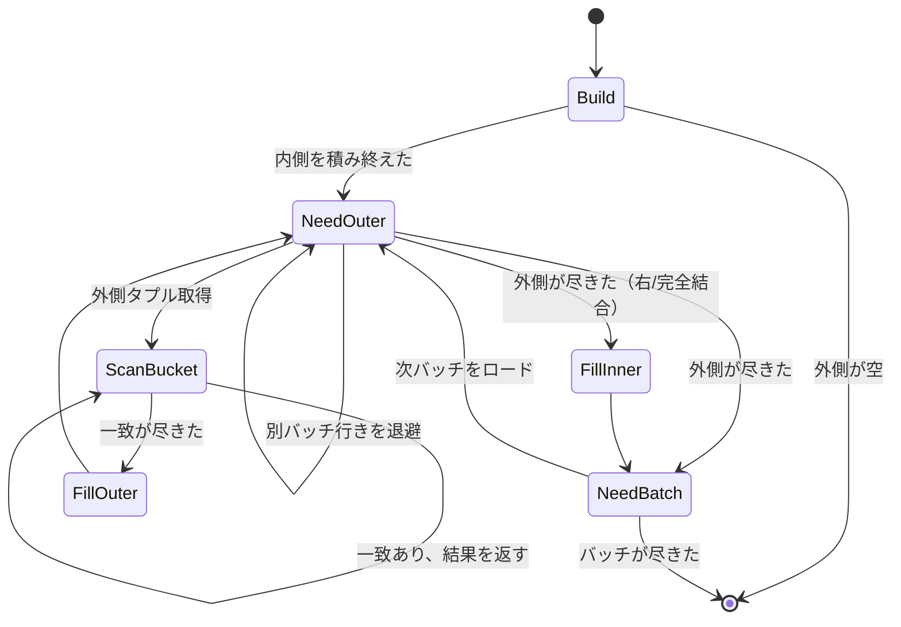
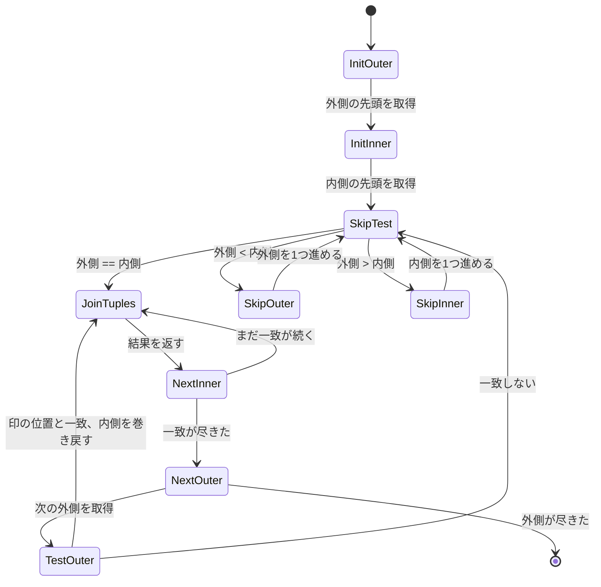

# 第18章 結合ノード

> **本章で読むソース**
>
> - [`src/backend/executor/nodeNestloop.c`](https://github.com/postgres/postgres/blob/REL_18_4/src/backend/executor/nodeNestloop.c)
> - [`src/backend/executor/nodeHashjoin.c`](https://github.com/postgres/postgres/blob/REL_18_4/src/backend/executor/nodeHashjoin.c)
> - [`src/backend/executor/nodeHash.c`](https://github.com/postgres/postgres/blob/REL_18_4/src/backend/executor/nodeHash.c)
> - [`src/backend/executor/nodeMergejoin.c`](https://github.com/postgres/postgres/blob/REL_18_4/src/backend/executor/nodeMergejoin.c)

## この章の狙い

第17章で、1つのリレーションからタプルを取り出すスキャンノードを読んだ。
本章は、2つのリレーションを1本のタプル列に束ねる結合ノードを読む。

PostgreSQL は結合を3つのアルゴリズムで実行する。
入れ子ループ結合（`NestLoop`）、ハッシュ結合（`HashJoin`）、マージ結合（`MergeJoin`）である。
どれもエグゼキュータの「外側」（outer）と「内側」（inner）という2つの子ノードを持ち、`ExecProcNode` の呼び出しごとに結合結果のタプルを1つずつ返す。
3つは入力に対する前提と、突き合わせの戦略が異なる。
入れ子ループは前提を持たず、外側の1タプルごとに内側を端から端まで走査する。
ハッシュ結合は内側を丸ごとハッシュ表に積んでから外側を流す。
マージ結合は両側がソート済みであることを前提に、2つの整列列を並走させる。

本章は、この3つの実行コードを状態機械として読み解く。
最後に、ハッシュ結合がメモリに収まらない内側をどう扱うか（バッチ分割）を機構レベルで追い、3者の向き不向きを第14章のコスト見積もりと接続する。

## 前提

各結合ノードは `ExecProcNode` の呼び出し1回につき結合タプルを1つ返し、入力が尽きたら `NULL` を返す。
これは第16章で読んだエグゼキュータの反復モデルそのままである。
どのアルゴリズムを使うかは、第14章でプランナがコストを比較して決め、第15章でプランノードに実体化する。
本章が読むのは、その決定どおりに選ばれたノードがタプルを取り出す実行コードである。

結合の種類（内部結合、左外部結合、セミ結合、アンチ結合など）は `jointype` として各ノードの状態に保持される。
外部結合では、相手が見つからなかったタプルに対して相手側を `NULL` で埋めた偽の結合タプルを生成する。
本章ではまず内部結合の骨格を追い、外部結合の埋め合わせ処理は各節の最後で触れる。

## 入れ子ループ結合 ExecNestLoop

入れ子ループ結合は、外側の1タプルごとに内側を頭から走査して突き合わせる。
内側に前提を一切置かないので、等値でない結合条件（不等号や範囲）でも使える唯一のアルゴリズムである。
実行の全体は `ExecNestLoop` 1関数に収まる小さな状態機械であり、状態は `nl_NeedNewOuter`（次の外側タプルが必要か）と `nl_MatchedOuter`（現在の外側タプルが1件でも内側と一致したか）という2つのフラグで表される。

外側タプルの取得と内側の再走査は、ループ先頭の `nl_NeedNewOuter` 判定にまとまっている。

[`src/backend/executor/nodeNestloop.c` L105-L152](https://github.com/postgres/postgres/blob/REL_18_4/src/backend/executor/nodeNestloop.c#L105-L152)

```c
		if (node->nl_NeedNewOuter)
		{
			ENL1_printf("getting new outer tuple");
			outerTupleSlot = ExecProcNode(outerPlan);

			/*
			 * if there are no more outer tuples, then the join is complete..
			 */
			if (TupIsNull(outerTupleSlot))
			{
				ENL1_printf("no outer tuple, ending join");
				return NULL;
			}

			ENL1_printf("saving new outer tuple information");
			econtext->ecxt_outertuple = outerTupleSlot;
			node->nl_NeedNewOuter = false;
			node->nl_MatchedOuter = false;

			/*
			 * fetch the values of any outer Vars that must be passed to the
			 * inner scan, and store them in the appropriate PARAM_EXEC slots.
			 */
			foreach(lc, nl->nestParams)
			{
				NestLoopParam *nlp = (NestLoopParam *) lfirst(lc);
				int			paramno = nlp->paramno;
				ParamExecData *prm;

				prm = &(econtext->ecxt_param_exec_vals[paramno]);
				/* Param value should be an OUTER_VAR var */
				Assert(IsA(nlp->paramval, Var));
				Assert(nlp->paramval->varno == OUTER_VAR);
				Assert(nlp->paramval->varattno > 0);
				prm->value = slot_getattr(outerTupleSlot,
										  nlp->paramval->varattno,
										  &(prm->isnull));
				/* Flag parameter value as changed */
				innerPlan->chgParam = bms_add_member(innerPlan->chgParam,
													 paramno);
			}

			/*
			 * now rescan the inner plan
			 */
			ENL1_printf("rescanning inner plan");
			ExecReScan(innerPlan);
		}
```

外側タプルを取り直すたびに、`nestParams` に挙げられた外側の値を `PARAM_EXEC` スロットへ書き込み、内側ノードの `chgParam` に印を付けてから `ExecReScan(innerPlan)` で内側を巻き戻す。
このパラメータ受け渡しが、入れ子ループ結合を強力にする鍵である。
内側がインデックススキャンなら、外側の値を実行時キーとして毎回インデックスをたどれる。
内側全体を読み直すのではなく、一致する内側タプルだけを引ける場合があり、これを**パラメータ化インデックススキャン**と呼ぶ。
内側が値ごとに少数しか返さないとき、入れ子ループは見かけの計算量に反して安く済む。

内側タプルの取得と突き合わせは、ループの後半にある。

[`src/backend/executor/nodeNestloop.c` L159-L201](https://github.com/postgres/postgres/blob/REL_18_4/src/backend/executor/nodeNestloop.c#L159-L201)

```c
		innerTupleSlot = ExecProcNode(innerPlan);
		econtext->ecxt_innertuple = innerTupleSlot;

		if (TupIsNull(innerTupleSlot))
		{
			ENL1_printf("no inner tuple, need new outer tuple");

			node->nl_NeedNewOuter = true;

			if (!node->nl_MatchedOuter &&
				(node->js.jointype == JOIN_LEFT ||
				 node->js.jointype == JOIN_ANTI))
			{
				/*
				 * We are doing an outer join and there were no join matches
				 * for this outer tuple.  Generate a fake join tuple with
				 * nulls for the inner tuple, and return it if it passes the
				 * non-join quals.
				 */
				econtext->ecxt_innertuple = node->nl_NullInnerTupleSlot;

				ENL1_printf("testing qualification for outer-join tuple");

				if (otherqual == NULL || ExecQual(otherqual, econtext))
				{
					/*
					 * qualification was satisfied so we project and return
					 * the slot containing the result tuple using
					 * ExecProject().
					 */
					ENL1_printf("qualification succeeded, projecting tuple");

					return ExecProject(node->js.ps.ps_ProjInfo);
				}
				else
					InstrCountFiltered2(node, 1);
			}

			/*
			 * Otherwise just return to top of loop for a new outer tuple.
			 */
			continue;
		}
```

内側が尽きると `nl_NeedNewOuter` を立てて次の外側タプルへ進む。
このとき、左外部結合かアンチ結合で、かつ現在の外側タプルが一度も一致しなかった（`nl_MatchedOuter` が偽）なら、内側を `nl_NullInnerTupleSlot`（全列 `NULL` の偽タプル）に差し替えて結果を生成する。
これが外部結合の埋め合わせである。
内側がまだ残っていれば、後続のコードで `joinqual` を評価し、合格した外側タプルに `nl_MatchedOuter` を立ててから結果を射影して返す。

## ハッシュ結合 ExecHashJoin

ハッシュ結合は、内側を丸ごとハッシュ表に積む**ビルドフェーズ**と、外側を流してハッシュ表に突き合わせる**プローブフェーズ**の2段で動く。
等値結合に限られるが、ハッシュ表が引ければ内側を端から走査せずに済むため、両側が大きい等値結合で速い。

実行の本体は `ExecHashJoinImpl` で、これを並列無効版 `ExecHashJoin` と並列対応版 `ExecParallelHashJoin` が `parallel` 引数を変えて呼ぶ。
`pg_attribute_always_inline` が付いており、コンパイラが2つの特殊化版を生成して不要な分岐を消すことを狙っている。
状態は6つの定数で表される。

[`src/backend/executor/nodeHashjoin.c` L180-L185](https://github.com/postgres/postgres/blob/REL_18_4/src/backend/executor/nodeHashjoin.c#L180-L185)

```c
#define HJ_BUILD_HASHTABLE		1
#define HJ_NEED_NEW_OUTER		2
#define HJ_SCAN_BUCKET			3
#define HJ_FILL_OUTER_TUPLE		4
#define HJ_FILL_INNER_TUPLES	5
#define HJ_NEED_NEW_BATCH		6
```

`HJ_BUILD_HASHTABLE` がビルドフェーズ、`HJ_NEED_NEW_OUTER` から `HJ_SCAN_BUCKET` がプローブフェーズ、`HJ_FILL_OUTER_TUPLE` と `HJ_FILL_INNER_TUPLES` が外部結合の埋め合わせ、`HJ_NEED_NEW_BATCH` がバッチの切り替えである。

### ビルドフェーズ

最初の呼び出しで `HJ_BUILD_HASHTABLE` に入り、ハッシュ表を作って内側を流し込む。

[`src/backend/executor/nodeHashjoin.c` L267-L344](https://github.com/postgres/postgres/blob/REL_18_4/src/backend/executor/nodeHashjoin.c#L267-L344)

```c
			case HJ_BUILD_HASHTABLE:

				/*
				 * First time through: build hash table for inner relation.
				 */
				Assert(hashtable == NULL);

				/*
				 * If the outer relation is completely empty, and it's not
				 * right/right-anti/full join, we can quit without building
				 * the hash table.  However, for an inner join it is only a
				 * win to check this when the outer relation's startup cost is
				 * less than the projected cost of building the hash table.
				 * Otherwise it's best to build the hash table first and see
				 * if the inner relation is empty.  (When it's a left join, we
				 * should always make this check, since we aren't going to be
				 * able to skip the join on the strength of an empty inner
				 * relation anyway.)
				 *
				 * If we are rescanning the join, we make use of information
				 * gained on the previous scan: don't bother to try the
				 * prefetch if the previous scan found the outer relation
				 * nonempty. This is not 100% reliable since with new
				 * parameters the outer relation might yield different
				 * results, but it's a good heuristic.
				 *
				 * The only way to make the check is to try to fetch a tuple
				 * from the outer plan node.  If we succeed, we have to stash
				 * it away for later consumption by ExecHashJoinOuterGetTuple.
				 */
				if (HJ_FILL_INNER(node))
				{
					/* no chance to not build the hash table */
					node->hj_FirstOuterTupleSlot = NULL;
				}
				else if (parallel)
				{
					/*
					 * The empty-outer optimization is not implemented for
					 * shared hash tables, because no one participant can
					 * determine that there are no outer tuples, and it's not
					 * yet clear that it's worth the synchronization overhead
					 * of reaching consensus to figure that out.  So we have
					 * to build the hash table.
					 */
					node->hj_FirstOuterTupleSlot = NULL;
				}
				else if (HJ_FILL_OUTER(node) ||
						 (outerNode->plan->startup_cost < hashNode->ps.plan->total_cost &&
						  !node->hj_OuterNotEmpty))
				{
					node->hj_FirstOuterTupleSlot = ExecProcNode(outerNode);
					if (TupIsNull(node->hj_FirstOuterTupleSlot))
					{
						node->hj_OuterNotEmpty = false;
						return NULL;
					}
					else
						node->hj_OuterNotEmpty = true;
				}
				else
					node->hj_FirstOuterTupleSlot = NULL;

				/*
				 * Create the hash table.  If using Parallel Hash, then
				 * whoever gets here first will create the hash table and any
				 * later arrivals will merely attach to it.
				 */
				hashtable = ExecHashTableCreate(hashNode);
				node->hj_HashTable = hashtable;

				/*
				 * Execute the Hash node, to build the hash table.  If using
				 * Parallel Hash, then we'll try to help hashing unless we
				 * arrived too late.
				 */
				hashNode->hashtable = hashtable;
				(void) MultiExecProcNode((PlanState *) hashNode);
```

ビルドの前に、外側が空なら結合全体を省ける場合を判定する。
外側の開始コストがハッシュ表構築の総コストより小さいときだけ外側の先頭タプルを先読みし、空なら何も構築せずに `NULL` を返す。
この先読みは、外側が空だったときに無駄なハッシュ表構築を丸ごと避けるための工夫である。

判定を抜けると `ExecHashTableCreate` でハッシュ表を作り、`MultiExecProcNode` で `Hash` ノードを実行して内側を流し込む。
`Hash` ノードの実体は `nodeHash.c` の `MultiExecPrivateHash` であり、内側ノードからタプルを取り出してはハッシュ値を計算し、`ExecHashTableInsert` で表に積む。
内側を積み終えると、状態は `HJ_NEED_NEW_OUTER` へ進む。

### プローブフェーズ

`HJ_NEED_NEW_OUTER` で外側のタプルを1つ取り、そのハッシュ値からバケットとバッチを決める。

[`src/backend/executor/nodeHashjoin.c` L421-L461](https://github.com/postgres/postgres/blob/REL_18_4/src/backend/executor/nodeHashjoin.c#L421-L461)

```c
			case HJ_NEED_NEW_OUTER:

				/*
				 * We don't have an outer tuple, try to get the next one
				 */
				if (parallel)
					outerTupleSlot =
						ExecParallelHashJoinOuterGetTuple(outerNode, node,
														  &hashvalue);
				else
					outerTupleSlot =
						ExecHashJoinOuterGetTuple(outerNode, node, &hashvalue);

				if (TupIsNull(outerTupleSlot))
				{
					/* end of batch, or maybe whole join */
					if (HJ_FILL_INNER(node))
					{
						/* set up to scan for unmatched inner tuples */
						if (parallel)
						{
							/*
							 * Only one process is currently allow to handle
							 * each batch's unmatched tuples, in a parallel
							 * join.
							 */
							if (ExecParallelPrepHashTableForUnmatched(node))
								node->hj_JoinState = HJ_FILL_INNER_TUPLES;
							else
								node->hj_JoinState = HJ_NEED_NEW_BATCH;
						}
						else
						{
							ExecPrepHashTableForUnmatched(node);
							node->hj_JoinState = HJ_FILL_INNER_TUPLES;
						}
					}
					else
						node->hj_JoinState = HJ_NEED_NEW_BATCH;
					continue;
				}
```

外側が尽きたら、右結合や完全外部結合のように内側の不一致タプルを埋める必要があれば `HJ_FILL_INNER_TUPLES` へ、そうでなければ次のバッチを取りに `HJ_NEED_NEW_BATCH` へ進む。
外側タプルが取れたときは、後続のコードでハッシュ値からバケット番号とバッチ番号を求める。
バッチ番号が現在のバッチと違えば、その外側タプルは後続バッチ用の一時ファイルへ退避し、`HJ_NEED_NEW_OUTER` のまま次へ進む。
同じバッチに属するなら `HJ_SCAN_BUCKET` へ進む。

`HJ_SCAN_BUCKET` は、選んだバケットを走査して一致を探す。

[`src/backend/executor/nodeHashjoin.c` L510-L532](https://github.com/postgres/postgres/blob/REL_18_4/src/backend/executor/nodeHashjoin.c#L510-L532)

```c
			case HJ_SCAN_BUCKET:

				/*
				 * Scan the selected hash bucket for matches to current outer
				 */
				if (parallel)
				{
					if (!ExecParallelScanHashBucket(node, econtext))
					{
						/* out of matches; check for possible outer-join fill */
						node->hj_JoinState = HJ_FILL_OUTER_TUPLE;
						continue;
					}
				}
				else
				{
					if (!ExecScanHashBucket(node, econtext))
					{
						/* out of matches; check for possible outer-join fill */
						node->hj_JoinState = HJ_FILL_OUTER_TUPLE;
						continue;
					}
				}
```

`ExecScanHashBucket` がバケット内の次の一致を返せば、後続のコードで `joinqual` と `otherqual` を評価し、合格すれば結果を射影して返す。
一致が尽きると `HJ_FILL_OUTER_TUPLE` へ進み、外部結合なら不一致だった外側タプルを内側 `NULL` で埋める。

ハッシュ結合の状態遷移を図にする。



### バッチ分割でメモリ超過を乗り越える

ハッシュ結合の最適化の核心は、内側がメモリに収まらなくても結合を成立させる**バッチ分割**にある。
ハッシュ表は `work_mem`（正確には `hash_mem`）の枠内に収める必要がある。
内側がこの枠を超えるとき、プランナはあらかじめ複数バッチに分けることを見込む。
それでも実測で表が膨らみすぎたら、エグゼキュータが実行中にバッチ数を倍々に増やす。

どのタプルがどのバケットとバッチに属するかは、ハッシュ値の下位ビットと上位ビットで分けて決める。

[`src/backend/executor/nodeHash.c` L1959-L1979](https://github.com/postgres/postgres/blob/REL_18_4/src/backend/executor/nodeHash.c#L1959-L1979)

```c
void
ExecHashGetBucketAndBatch(HashJoinTable hashtable,
						  uint32 hashvalue,
						  int *bucketno,
						  int *batchno)
{
	uint32		nbuckets = (uint32) hashtable->nbuckets;
	uint32		nbatch = (uint32) hashtable->nbatch;

	if (nbatch > 1)
	{
		*bucketno = hashvalue & (nbuckets - 1);
		*batchno = pg_rotate_right32(hashvalue,
									 hashtable->log2_nbuckets) & (nbatch - 1);
	}
	else
	{
		*bucketno = hashvalue & (nbuckets - 1);
		*batchno = 0;
	}
}
```

バケット番号はハッシュ値の下位ビット、バッチ番号はハッシュ値を右回転して取り出した別のビットで決まる。
バッチ数は常に2の冪なので、バッチを倍にすることはバッチ番号の上位に1ビット足すことに等しい。
この設計のおかげで、バッチ数が倍になっても各タプルの所属バッチは新しいビットの値だけで決まり、再分配が単純になる。

タプルを表に挿入する `ExecHashTableInsert` は、所属バッチが現在のバッチでなければ表に積まず、一時ファイルへ退避する。

[`src/backend/executor/nodeHash.c` L1764-L1828](https://github.com/postgres/postgres/blob/REL_18_4/src/backend/executor/nodeHash.c#L1764-L1828)

```c
	if (batchno == hashtable->curbatch)
	{
		/*
		 * put the tuple in hash table
		 */
		HashJoinTuple hashTuple;
		int			hashTupleSize;
		double		ntuples = (hashtable->totalTuples - hashtable->skewTuples);

		/* Create the HashJoinTuple */
		hashTupleSize = HJTUPLE_OVERHEAD + tuple->t_len;
		hashTuple = (HashJoinTuple) dense_alloc(hashtable, hashTupleSize);

		hashTuple->hashvalue = hashvalue;
		memcpy(HJTUPLE_MINTUPLE(hashTuple), tuple, tuple->t_len);

		/*
		 * We always reset the tuple-matched flag on insertion.  This is okay
		 * even when reloading a tuple from a batch file, since the tuple
		 * could not possibly have been matched to an outer tuple before it
		 * went into the batch file.
		 */
		HeapTupleHeaderClearMatch(HJTUPLE_MINTUPLE(hashTuple));

		/* Push it onto the front of the bucket's list */
		hashTuple->next.unshared = hashtable->buckets.unshared[bucketno];
		hashtable->buckets.unshared[bucketno] = hashTuple;

		/*
		 * Increase the (optimal) number of buckets if we just exceeded the
		 * NTUP_PER_BUCKET threshold, but only when there's still a single
		 * batch.
		 */
		if (hashtable->nbatch == 1 &&
			ntuples > (hashtable->nbuckets_optimal * NTUP_PER_BUCKET))
		{
			/* Guard against integer overflow and alloc size overflow */
			if (hashtable->nbuckets_optimal <= INT_MAX / 2 &&
				hashtable->nbuckets_optimal * 2 <= MaxAllocSize / sizeof(HashJoinTuple))
			{
				hashtable->nbuckets_optimal *= 2;
				hashtable->log2_nbuckets_optimal += 1;
			}
		}

		/* Account for space used, and back off if we've used too much */
		hashtable->spaceUsed += hashTupleSize;
		if (hashtable->spaceUsed > hashtable->spacePeak)
			hashtable->spacePeak = hashtable->spaceUsed;
		if (hashtable->spaceUsed +
			hashtable->nbuckets_optimal * sizeof(HashJoinTuple)
			> hashtable->spaceAllowed)
			ExecHashIncreaseNumBatches(hashtable);
	}
	else
	{
		/*
		 * put the tuple into a temp file for later batches
		 */
		Assert(batchno > hashtable->curbatch);
		ExecHashJoinSaveTuple(tuple,
							  hashvalue,
							  &hashtable->innerBatchFile[batchno],
							  hashtable);
	}
```

現在のバッチに属するタプルだけを表に積み、それ以外は `ExecHashJoinSaveTuple` で `innerBatchFile[batchno]` という一時ファイルに書き出す。
表に積んだ結果、使用量が `spaceAllowed` を超えたら、その場で `ExecHashIncreaseNumBatches` を呼んでバッチ数を倍にする。

`ExecHashIncreaseNumBatches` はバッチ数を倍にし、表に積み済みのタプルのうち新しいバッチに移るものを一時ファイルへ書き戻す。

[`src/backend/executor/nodeHash.c` L1029-L1052](https://github.com/postgres/postgres/blob/REL_18_4/src/backend/executor/nodeHash.c#L1029-L1052)

```c
static void
ExecHashIncreaseNumBatches(HashJoinTable hashtable)
{
	int			oldnbatch = hashtable->nbatch;
	int			curbatch = hashtable->curbatch;
	int			nbatch;
	long		ninmemory;
	long		nfreed;
	HashMemoryChunk oldchunks;

	/* do nothing if we've decided to shut off growth */
	if (!hashtable->growEnabled)
		return;

	/* safety check to avoid overflow */
	if (oldnbatch > Min(INT_MAX / 2, MaxAllocSize / (sizeof(void *) * 2)))
		return;

	/* consider increasing size of the in-memory hash table instead */
	if (ExecHashIncreaseBatchSize(hashtable))
		return;

	nbatch = oldnbatch * 2;
	Assert(nbatch > 1);
```

プローブのときは、外側タプルも同じハッシュ関数でバッチ番号を求め、現在のバッチに属さなければ外側用の一時ファイルへ退避する。
こうして現在のバッチでは、内側の一部と外側の一部だけがメモリ上で突き合わされる。
1つのバッチを処理し終えると、状態機械は `HJ_NEED_NEW_BATCH` へ進み、`ExecHashJoinNewBatch` が次のバッチの内側ファイルを読み戻して表を作り直す。
内側全体は決して同時にメモリへ載らず、ハッシュ値で振り分けられた断片ごとに突き合わされる。
これが、メモリに収まらない内側でもハッシュ結合を成立させる仕組みである。

なお、特定のハッシュ値に極端にタプルが偏ると、バッチを倍にしても1つのバッチが小さくならないことがある。
その場合 `growEnabled` を偽にしてバッチ増加を打ち切り、当該バッチは枠を超えたまま処理する。
無限にバッチを倍にし続ける事態を避けるための歯止めである。

## マージ結合 ExecMergeJoin

マージ結合は、両側がソート済みであることを前提に、2つの整列列を並走させて一致を拾う。
入力がすでにソート済みなら（インデックス順の読み出しなど）、突き合わせは両側を1回ずつなめるだけで終わり、大きな等値結合で安い。
等値以外の比較も扱えるが、両側がソート済みでなければソートの費用が上乗せされる。

`ExecMergeJoin` は11個の状態を持つ状態機械である。

[`src/backend/executor/nodeMergejoin.c` L105-L115](https://github.com/postgres/postgres/blob/REL_18_4/src/backend/executor/nodeMergejoin.c#L105-L115)

```c
#define EXEC_MJ_INITIALIZE_OUTER		1
#define EXEC_MJ_INITIALIZE_INNER		2
#define EXEC_MJ_JOINTUPLES				3
#define EXEC_MJ_NEXTOUTER				4
#define EXEC_MJ_TESTOUTER				5
#define EXEC_MJ_NEXTINNER				6
#define EXEC_MJ_SKIP_TEST				7
#define EXEC_MJ_SKIPOUTER_ADVANCE		8
#define EXEC_MJ_SKIPINNER_ADVANCE		9
#define EXEC_MJ_ENDOUTER				10
#define EXEC_MJ_ENDINNER				11
```

`INITIALIZE_OUTER` と `INITIALIZE_INNER` で両側の先頭タプルを取り、`SKIP_TEST` で2つの整列列の位置を揃え、一致した区間を `JOINTUPLES` で結合する。
比較は `MJCompare` が結合キーを順に比べて、外側が内側より小さいか、等しいか、大きいかを返す。

位置揃えの中心が `SKIP_TEST` である。

[`src/backend/executor/nodeMergejoin.c` L1177-L1202](https://github.com/postgres/postgres/blob/REL_18_4/src/backend/executor/nodeMergejoin.c#L1177-L1202)

```c
			case EXEC_MJ_SKIP_TEST:
				MJ_printf("ExecMergeJoin: EXEC_MJ_SKIP_TEST\n");

				/*
				 * before we advance, make sure the current tuples do not
				 * satisfy the mergeclauses.  If they do, then we update the
				 * marked tuple position and go join them.
				 */
				compareResult = MJCompare(node);
				MJ_DEBUG_COMPARE(compareResult);

				if (compareResult == 0)
				{
					if (!node->mj_SkipMarkRestore)
						ExecMarkPos(innerPlan);

					MarkInnerTuple(node->mj_InnerTupleSlot, node);

					node->mj_JoinState = EXEC_MJ_JOINTUPLES;
				}
				else if (compareResult < 0)
					node->mj_JoinState = EXEC_MJ_SKIPOUTER_ADVANCE;
				else
					/* compareResult > 0 */
					node->mj_JoinState = EXEC_MJ_SKIPINNER_ADVANCE;
				break;
```

外側と内側が一致すれば（`compareResult == 0`）、現在の内側位置を「印付け」してから `JOINTUPLES` へ進む。
外側のほうが小さければ外側を1つ進め（`SKIPOUTER_ADVANCE`）、内側のほうが小さければ内側を1つ進める（`SKIPINNER_ADVANCE`）。
小さいほうだけを進めることで、両側を端から端まで1回ずつなめれば一致がすべて拾える。

一致区間に重複があるときに効くのが、`SKIP_TEST` での印付けである。
外側に同じ値が複数並ぶと、2番目以降の外側を同じ内側の区間と突き合わせ直す必要がある。
そこで `JOINTUPLES` から `NEXTINNER` で内側を進めて一致区間を消費し、`NEXTOUTER` で外側を1つ進めたあと `TESTOUTER` で外側が印付けした位置と一致するかを調べる。
一致すれば `ExecRestrPos` で内側を印の位置へ巻き戻し、同じ内側区間をもう一度突き合わせる。
この印付けと巻き戻しが、ソート済みの重複値を取りこぼさずに直積として展開する仕組みである。

マージ結合の状態遷移の骨格を図にする。



## 3つのアルゴリズムの向き不向き

3つは入力への前提と突き合わせ戦略が異なり、それぞれが安くなる条件も違う。
第14章で読んだとおり、プランナはこの3つを別々のパスとして用意し、コストの最も低いものを選ぶ。

入れ子ループは前提を持たず、不等号や範囲条件でも使える。
内側がパラメータ化インデックススキャンで少数の行だけを返すとき、または外側が極端に小さいときに安い。
反面、内側を毎回走査するため、両側が大きいと外側件数と内側件数の積に比例して高くつく。

ハッシュ結合は等値結合に限られ、内側を一度ハッシュ表に積めばプローブはバケット走査だけで済む。
両側が大きく、入力がソートされていない等値結合で最も安いことが多い。
内側が `work_mem` に収まらなくてもバッチ分割で成立するが、一時ファイルへの書き出しと読み戻しの費用が乗る。

マージ結合は両側がソート済みであることを前提に、両側を1回ずつなめて一致を拾う。
入力がすでに整列していれば（インデックス順の読み出しなど）大きな等値結合で安い。
ソートが必要なら、その費用が上乗せされて不利になる。

## まとめ

本章は、PostgreSQL の3つの結合アルゴリズムの実行コードを状態機械として読んだ。
入れ子ループ `ExecNestLoop` は、外側1タプルごとに `ExecReScan` で内側を巻き戻して走査し、`nestParams` で外側の値を内側へ渡してパラメータ化インデックススキャンを可能にする。
ハッシュ結合 `ExecHashJoin` は、`HJ_BUILD_HASHTABLE` で内側を表に積み、`HJ_SCAN_BUCKET` でプローブする6状態の機械であり、内側がメモリに収まらないときはハッシュ値でバッチに振り分けて断片ごとに突き合わせる。
マージ結合 `ExecMergeJoin` は、ソート済みの両側を `SKIP_TEST` で並走させ、印付けと巻き戻しで重複値を直積に展開する11状態の機械である。
最適化の核心として、ハッシュ結合のバッチ分割を機構レベルで追った。
ハッシュ値の上位ビットでバッチを決め、バッチ数を2の冪で倍にすることで、内側全体をメモリに載せずに結合を成立させる。

## 関連する章

- [第14章 パス生成とコスト見積もり](../part03-query-frontend/14-paths-and-costing.md)：3つの結合パスにコストを与え、どれを選ぶかを決める層。
- [第16章 エグゼキュータの骨格](16-executor-overview.md)：`ExecProcNode` の反復モデルと、ノードの初期化と実行の流れ。
- [第17章 スキャンノード](17-scan-nodes.md)：結合ノードの子になる、1リレーションからタプルを取り出すノード。
- [第19章 集約、ソート、マテリアライズ](19-aggregation-sort.md)：マージ結合の入力を整えるソートノードの実行。
