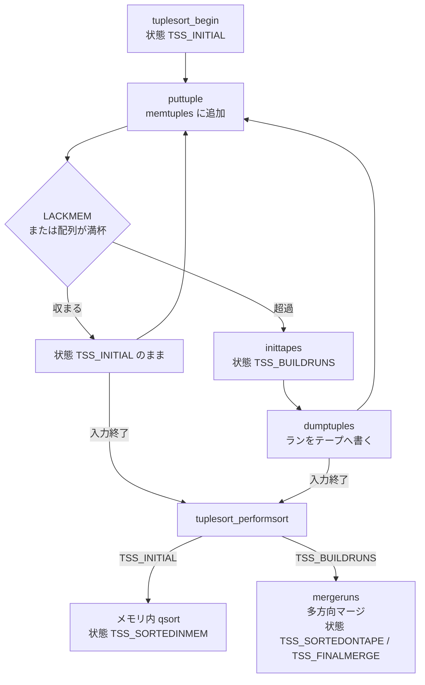
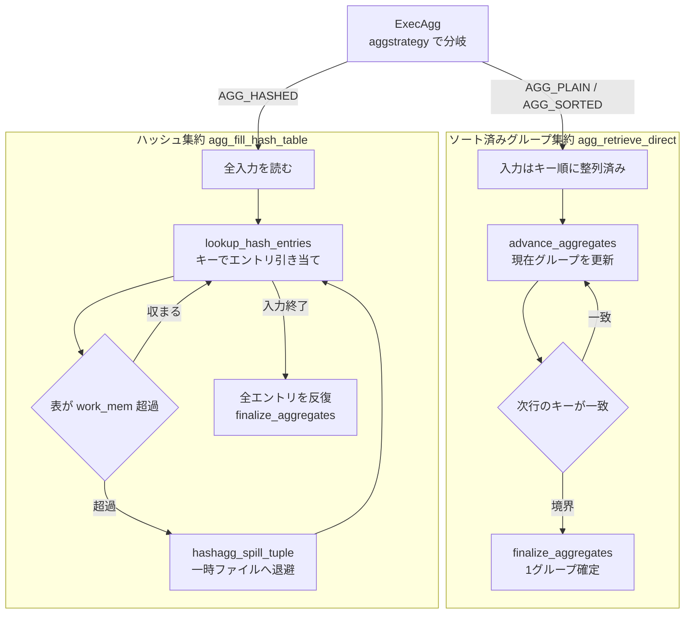

# 第19章 集約、ソート、マテリアライズ

> **本章で読むソース**
>
> - [`src/backend/executor/nodeAgg.c`](https://github.com/postgres/postgres/blob/REL_18_4/src/backend/executor/nodeAgg.c)
> - [`src/backend/executor/nodeSort.c`](https://github.com/postgres/postgres/blob/REL_18_4/src/backend/executor/nodeSort.c)
> - [`src/backend/executor/nodeMaterial.c`](https://github.com/postgres/postgres/blob/REL_18_4/src/backend/executor/nodeMaterial.c)
> - [`src/backend/utils/sort/tuplesort.c`](https://github.com/postgres/postgres/blob/REL_18_4/src/backend/utils/sort/tuplesort.c)

## この章の狙い

第16章で読んだエグゼキュータの骨格は、根のノードに1行を要求し、各ノードが子へ要求を伝播させる引っ張り型の実行方式である。
スキャンノード（第17章）と結合ノード（第18章）は、この方式に素直に乗る。
これらは子から1行を取り、自分の1行をすぐ返せる。

本章が読む3つのノードは、この素直さを共有しない。
集約 `Agg`、ソート `Sort`、マテリアライズ `Material` は、いずれも最初の1行を返す前に子からの入力を読み尽くす。
最大値を求める集約は、最後の1行まで見るまで答えを返せない。
ソートは、すべての行を手元に集めなければ最小の行がどれかを決められない。
本章ではこの一群を**ブロッキング系のノード**と呼ぶ。
子からの入力を最後まで読んでから初めて結果を返し始める性質を指す。

ブロッキング系は、全入力を抱える瞬間がある点で共通の難しさを持つ。
入力が `work_mem` に収まる保証はない。
そこで PostgreSQL は、メモリ内で完結する速い経路と、メモリを超えたら一時ファイルへこぼす経路の2本を、同じノードの内部に同居させている。
本章の最適化の主題はこの切り替えである。
ソートでは `tuplesort.c` が、メモリ内クイックソートと外部マージソートを実行時に切り替える機構を読む。
集約では、ソート済み入力を前提とするグループ集約と、ハッシュ表を使うハッシュ集約の2方式を読む。

## 前提

第16章でエグゼキュータの骨格、すなわち `PlanState` ツリーと `ExecProcNode` による行の引っ張り上げを読んだ。
本章の各ノードは、その `ExecProcNode` の実体である `ExecAgg`、`ExecSort`、`ExecMaterial` を持つ。
プランナがどの方式（`AGG_HASHED` か `AGG_SORTED` か）を選ぶか、ソートが必要かどうかは、第14章のコスト見積もりで決まっている。
本章は、決まった方式を実行時にどう走らせるかだけを読む。

メモリ量を制御する変数は `work_mem` である。
ソート1回、ハッシュ表1つが使える上限を与える。
この値を入力が超えたときの挙動が、本章の機構の中心になる。

## ソート `Sort`：tuplesort への受け渡し

最初にソートを読む。
集約のグループ方式はソート済み入力を前提とするので、ソートの仕組みを先に押さえると後の理解が楽になる。

`ExecSort` は、初回呼び出しのときだけ子プランの全行を読み、`tuplesort` モジュールへ渡す。

[`src/backend/executor/nodeSort.c` L75-L160](https://github.com/postgres/postgres/blob/REL_18_4/src/backend/executor/nodeSort.c#L75-L160)

```c
	if (!node->sort_Done)
	{
		Sort	   *plannode = (Sort *) node->ss.ps.plan;
		PlanState  *outerNode;
		TupleDesc	tupDesc;
		int			tuplesortopts = TUPLESORT_NONE;

		SO1_printf("ExecSort: %s\n",
				   "sorting subplan");

		/*
		 * Want to scan subplan in the forward direction while creating the
		 * sorted data.
		 */
		estate->es_direction = ForwardScanDirection;

		/*
		 * Initialize tuplesort module.
		 */
		SO1_printf("ExecSort: %s\n",
				   "calling tuplesort_begin");

		outerNode = outerPlanState(node);
		tupDesc = ExecGetResultType(outerNode);

		if (node->randomAccess)
			tuplesortopts |= TUPLESORT_RANDOMACCESS;
		if (node->bounded)
			tuplesortopts |= TUPLESORT_ALLOWBOUNDED;

		if (node->datumSort)
			tuplesortstate = tuplesort_begin_datum(TupleDescAttr(tupDesc, 0)->atttypid,
												   plannode->sortOperators[0],
												   plannode->collations[0],
												   plannode->nullsFirst[0],
												   work_mem,
												   NULL,
												   tuplesortopts);
		else
			tuplesortstate = tuplesort_begin_heap(tupDesc,
												  plannode->numCols,
												  plannode->sortColIdx,
												  plannode->sortOperators,
												  plannode->collations,
												  plannode->nullsFirst,
												  work_mem,
												  NULL,
												  tuplesortopts);
		if (node->bounded)
			tuplesort_set_bound(tuplesortstate, node->bound);
		node->tuplesortstate = tuplesortstate;

		/*
		 * Scan the subplan and feed all the tuples to tuplesort using the
		 * appropriate method based on the type of sort we're doing.
		 */
		if (node->datumSort)
		{
			for (;;)
			{
				slot = ExecProcNode(outerNode);

				if (TupIsNull(slot))
					break;
				slot_getsomeattrs(slot, 1);
				tuplesort_putdatum(tuplesortstate,
								   slot->tts_values[0],
								   slot->tts_isnull[0]);
			}
		}
		else
		{
			for (;;)
			{
				slot = ExecProcNode(outerNode);

				if (TupIsNull(slot))
					break;
				tuplesort_puttupleslot(tuplesortstate, slot);
			}
		}

		/*
		 * Complete the sort.
		 */
		tuplesort_performsort(tuplesortstate);
```

`for (;;)` のループが子プランを最後まで引っ張り、`tuplesort_puttupleslot` で1行ずつ `tuplesort` へ積む。
全行を積み終えてから `tuplesort_performsort` を呼び、ソートを完了させる。
ここで `sort_Done` が立ち、2回目以降の `ExecSort` 呼び出しは、ソート済みの結果を `tuplesort` から1行ずつ取り出すだけになる。

`ExecSort` 自身は、メモリに収まるかどうかを気にしていない。
全行を `tuplesort` に渡し、完了を頼むだけである。
収まるか否かの判断と、収まらないときの一時ファイルへの退避は、すべて `tuplesort.c` の内部に隠されている。
`datumSort` の分岐は、ソート対象が単一列のときに行全体ではなく値（`Datum`）だけを並べる速い経路で、値渡し型ではとくに効く。

## tuplesort の状態：メモリ内から外部マージへ

`tuplesort` の核心は、入力量に応じて自分の状態を遷移させることにある。
状態は次の列挙型で表される。

[`src/backend/utils/sort/tuplesort.c` L154-L162](https://github.com/postgres/postgres/blob/REL_18_4/src/backend/utils/sort/tuplesort.c#L154-L162)

```c
typedef enum
{
	TSS_INITIAL,				/* Loading tuples; still within memory limit */
	TSS_BOUNDED,				/* Loading tuples into bounded-size heap */
	TSS_BUILDRUNS,				/* Loading tuples; writing to tape */
	TSS_SORTEDINMEM,			/* Sort completed entirely in memory */
	TSS_SORTEDONTAPE,			/* Sort completed, final run is on tape */
	TSS_FINALMERGE,				/* Performing final merge on-the-fly */
} TupSortStatus;
```

行を積み始めた直後は `TSS_INITIAL` である。
このときは全行をメモリ上の配列 `memtuples` に貯める。
`work_mem` の範囲に収まれば、配列をクイックソート1回で並べて `TSS_SORTEDINMEM` へ進む。
収まらなければ、貯めた分を一時ファイル（テープ）へこぼし、状態を `TSS_BUILDRUNS` へ移す。
こぼす単位を**ラン**（run）と呼ぶ。
1つのランはメモリ内でソート済みの行の並びであり、テープ上に書き出される。
最後に複数のランを多方向マージで束ね、`TSS_SORTEDONTAPE` または `TSS_FINALMERGE` に至る。

切り替えの判断は、1行を積むたびに走る共通処理の中で下される。
`TSS_INITIAL` の分岐を読む。

[`src/backend/utils/sort/tuplesort.c` L1213-L1272](https://github.com/postgres/postgres/blob/REL_18_4/src/backend/utils/sort/tuplesort.c#L1213-L1272)

```c
		case TSS_INITIAL:

			/*
			 * Save the tuple into the unsorted array.  First, grow the array
			 * as needed.  Note that we try to grow the array when there is
			 * still one free slot remaining --- if we fail, there'll still be
			 * room to store the incoming tuple, and then we'll switch to
			 * tape-based operation.
			 */
			if (state->memtupcount >= state->memtupsize - 1)
			{
				(void) grow_memtuples(state);
				Assert(state->memtupcount < state->memtupsize);
			}
			state->memtuples[state->memtupcount++] = *tuple;

			/*
			 * Check if it's time to switch over to a bounded heapsort. We do
			 * so if the input tuple count exceeds twice the desired tuple
			 * count (this is a heuristic for where heapsort becomes cheaper
			 * than a quicksort), or if we've just filled workMem and have
			 * enough tuples to meet the bound.
			 *
			 * Note that once we enter TSS_BOUNDED state we will always try to
			 * complete the sort that way.  In the worst case, if later input
			 * tuples are larger than earlier ones, this might cause us to
			 * exceed workMem significantly.
			 */
			if (state->bounded &&
				(state->memtupcount > state->bound * 2 ||
				 (state->memtupcount > state->bound && LACKMEM(state))))
			{
				if (trace_sort)
					elog(LOG, "switching to bounded heapsort at %d tuples: %s",
						 state->memtupcount,
						 pg_rusage_show(&state->ru_start));
				make_bounded_heap(state);
				MemoryContextSwitchTo(oldcontext);
				return;
			}

			/*
			 * Done if we still fit in available memory and have array slots.
			 */
			if (state->memtupcount < state->memtupsize && !LACKMEM(state))
			{
				MemoryContextSwitchTo(oldcontext);
				return;
			}

			/*
			 * Nope; time to switch to tape-based operation.
			 */
			inittapes(state, true);

			/*
			 * Dump all tuples.
			 */
			dumptuples(state, false);
			break;
```

新しい行はまず `memtuples` 配列へ書き込まれる。
そのうえで `LACKMEM(state)` を見る。
これは利用可能メモリ `availMem` が負に振れたかどうかの判定で、`availMem` は `work_mem` を起点に行を積むたび減っていく。
配列にまだ空きがあり `LACKMEM` でもなければ、何もせず戻る。
配列が一杯か `work_mem` を使い切ったら、`inittapes` でテープを用意し、`dumptuples` で貯めた行をテープへ吐き出す。

`inittapes` の末尾で状態が `TSS_BUILDRUNS` に変わる。

[`src/backend/utils/sort/tuplesort.c` L1864-L1908](https://github.com/postgres/postgres/blob/REL_18_4/src/backend/utils/sort/tuplesort.c#L1864-L1908)

```c
static void
inittapes(Tuplesortstate *state, bool mergeruns)
{
	Assert(!LEADER(state));

	if (mergeruns)
	{
		/* Compute number of input tapes to use when merging */
		state->maxTapes = tuplesort_merge_order(state->allowedMem);
	}
	else
	{
		/* Workers can sometimes produce single run, output without merge */
		Assert(WORKER(state));
		state->maxTapes = MINORDER;
	}

	if (trace_sort)
		elog(LOG, "worker %d switching to external sort with %d tapes: %s",
			 state->worker, state->maxTapes, pg_rusage_show(&state->ru_start));

	/* Create the tape set */
	inittapestate(state, state->maxTapes);
	state->tapeset =
		LogicalTapeSetCreate(false,
							 state->shared ? &state->shared->fileset : NULL,
							 state->worker);

	state->currentRun = 0;

	/*
	 * Initialize logical tape arrays.
	 */
	state->inputTapes = NULL;
	state->nInputTapes = 0;
	state->nInputRuns = 0;

	state->outputTapes = palloc0(state->maxTapes * sizeof(LogicalTape *));
	state->nOutputTapes = 0;
	state->nOutputRuns = 0;

	state->status = TSS_BUILDRUNS;

	selectnewtape(state);
}
```

一度 `TSS_BUILDRUNS` に入ると、以後の行も配列に貯めては `dumptuples` でテープへこぼす動作を繰り返す。
こうしてテープ上にソート済みのランがいくつも積み上がる。

入力の終わりは `tuplesort_performsort` が受け取る。
ここで状態ごとに仕上げが分かれる。

[`src/backend/utils/sort/tuplesort.c` L1362-L1446](https://github.com/postgres/postgres/blob/REL_18_4/src/backend/utils/sort/tuplesort.c#L1362-L1446)

```c
void
tuplesort_performsort(Tuplesortstate *state)
{
	MemoryContext oldcontext = MemoryContextSwitchTo(state->base.sortcontext);

	if (trace_sort)
		elog(LOG, "performsort of worker %d starting: %s",
			 state->worker, pg_rusage_show(&state->ru_start));

	switch (state->status)
	{
		case TSS_INITIAL:

			/*
			 * We were able to accumulate all the tuples within the allowed
			 * amount of memory, or leader to take over worker tapes
			 */
			if (SERIAL(state))
			{
				/* Just qsort 'em and we're done */
				tuplesort_sort_memtuples(state);
				state->status = TSS_SORTEDINMEM;
			}
			else if (WORKER(state))
			{
				/*
				 * Parallel workers must still dump out tuples to tape.  No
				 * merge is required to produce single output run, though.
				 */
				inittapes(state, false);
				dumptuples(state, true);
				worker_nomergeruns(state);
				state->status = TSS_SORTEDONTAPE;
			}
			else
			{
				/*
				 * Leader will take over worker tapes and merge worker runs.
				 * Note that mergeruns sets the correct state->status.
				 */
				leader_takeover_tapes(state);
				mergeruns(state);
			}
			state->current = 0;
			state->eof_reached = false;
			state->markpos_block = 0L;
			state->markpos_offset = 0;
			state->markpos_eof = false;
			break;

		case TSS_BOUNDED:

			/*
			 * We were able to accumulate all the tuples required for output
			 * in memory, using a heap to eliminate excess tuples.  Now we
			 * have to transform the heap to a properly-sorted array. Note
			 * that sort_bounded_heap sets the correct state->status.
			 */
			sort_bounded_heap(state);
			state->current = 0;
			state->eof_reached = false;
			state->markpos_offset = 0;
			state->markpos_eof = false;
			break;

		case TSS_BUILDRUNS:

			/*
			 * Finish tape-based sort.  First, flush all tuples remaining in
			 * memory out to tape; then merge until we have a single remaining
			 * run (or, if !randomAccess and !WORKER(), one run per tape).
			 * Note that mergeruns sets the correct state->status.
			 */
			dumptuples(state, true);
			mergeruns(state);
			state->eof_reached = false;
			state->markpos_block = 0L;
			state->markpos_offset = 0;
			state->markpos_eof = false;
			break;

		default:
			elog(ERROR, "invalid tuplesort state");
			break;
	}
```

入力が `work_mem` に収まったまま終われば状態は `TSS_INITIAL` のままで、ここで初めて `tuplesort_sort_memtuples` がメモリ内配列をクイックソートし、`TSS_SORTEDINMEM` に落ち着く。
途中で `TSS_BUILDRUNS` に移っていれば、残った行を `dumptuples` で吐き切ったうえで `mergeruns` がテープ上のランを多方向マージで束ねる。

この設計の効きどころは、切り替えが実行時に起きる点である。
プランナはコスト見積もりに基づいてソートを選ぶが、実際の入力量を正確には知らない。
そこで `tuplesort` は、小さい入力では一時ファイルを一切作らずメモリ内クイックソート1回で済ませ、入力が `work_mem` を超えた瞬間に初めてテープへこぼし始める。
メモリで足りる多数の問い合わせは外部ソートの I/O を完全に避けられ、足りないときだけマージのコストを払う。
判断の基準は推測ではなく、行を積むたびに更新される実測のメモリ消費 `availMem` である。



## 集約 `Agg`：2つの戦略

集約に移る。
`Agg` ノードの入口 `ExecAgg` は、プランナが選んだ戦略に応じて処理を振り分ける。

[`src/backend/executor/nodeAgg.c` L2243-L2274](https://github.com/postgres/postgres/blob/REL_18_4/src/backend/executor/nodeAgg.c#L2243-L2274)

```c
static TupleTableSlot *
ExecAgg(PlanState *pstate)
{
	AggState   *node = castNode(AggState, pstate);
	TupleTableSlot *result = NULL;

	CHECK_FOR_INTERRUPTS();

	if (!node->agg_done)
	{
		/* Dispatch based on strategy */
		switch (node->phase->aggstrategy)
		{
			case AGG_HASHED:
				if (!node->table_filled)
					agg_fill_hash_table(node);
				/* FALLTHROUGH */
			case AGG_MIXED:
				result = agg_retrieve_hash_table(node);
				break;
			case AGG_PLAIN:
			case AGG_SORTED:
				result = agg_retrieve_direct(node);
				break;
		}

		if (!TupIsNull(result))
			return result;
	}

	return NULL;
}
```

`AGG_PLAIN` と `AGG_SORTED` は `agg_retrieve_direct` へ進む。
前者は `GROUP BY` のない全体集約、後者はソート済み入力に対するグループ集約である。
`AGG_HASHED` はハッシュ集約で、まず `agg_fill_hash_table` でハッシュ表を埋め、`agg_retrieve_hash_table` で1グループずつ取り出す。
`AGG_MIXED` は両者の併用で、グルーピングセットを使う問い合わせで現れる。
本章はソート済みグループ集約とハッシュ集約の2方式に的を絞る。

### ソート済みグループ集約

`agg_retrieve_direct` は、入力がグループキーで並んでいることを利用する。
同じグループの行は入力上で連続するので、隣り合う行のキーが一致する間は同一グループとして集約し、キーが変われば1グループの完成と見なせる。

[`src/backend/executor/nodeAgg.c` L2527-L2583](https://github.com/postgres/postgres/blob/REL_18_4/src/backend/executor/nodeAgg.c#L2527-L2583)

```c
				for (;;)
				{
					/*
					 * During phase 1 only of a mixed agg, we need to update
					 * hashtables as well in advance_aggregates.
					 */
					if (aggstate->aggstrategy == AGG_MIXED &&
						aggstate->current_phase == 1)
					{
						lookup_hash_entries(aggstate);
					}

					/* Advance the aggregates (or combine functions) */
					advance_aggregates(aggstate);

					/* Reset per-input-tuple context after each tuple */
					ResetExprContext(tmpcontext);

					outerslot = fetch_input_tuple(aggstate);
					if (TupIsNull(outerslot))
					{
						/* no more outer-plan tuples available */

						/* if we built hash tables, finalize any spills */
						if (aggstate->aggstrategy == AGG_MIXED &&
							aggstate->current_phase == 1)
							hashagg_finish_initial_spills(aggstate);

						if (hasGroupingSets)
						{
							aggstate->input_done = true;
							break;
						}
						else
						{
							aggstate->agg_done = true;
							break;
						}
					}
					/* set up for next advance_aggregates call */
					tmpcontext->ecxt_outertuple = outerslot;

					/*
					 * If we are grouping, check whether we've crossed a group
					 * boundary.
					 */
					if (node->aggstrategy != AGG_PLAIN && node->numCols > 0)
					{
						tmpcontext->ecxt_innertuple = firstSlot;
						if (!ExecQual(aggstate->phase->eqfunctions[node->numCols - 1],
									  tmpcontext))
						{
							aggstate->grp_firstTuple = ExecCopySlotHeapTuple(outerslot);
							break;
						}
					}
				}
```

ループの各回が1行を処理する。
まず `advance_aggregates` で現在の行を集約状態へ取り込む。
次に `fetch_input_tuple` で次の行を引く。
引けなければ入力終了で、グループの完成として `break` する。
引けたら、その行のグループキーを現在グループの代表行 `firstSlot` と `ExecQual` で照合する。
キーが一致しなければグループ境界に達したので、新しい行を次グループの先頭として控え、`break` する。

このループが `break` した後、呼び出し元は `finalize_aggregates` で集約値を確定し、`project_aggregates` で1グループ分の結果行を作って返す。
入力がソート済みなので、1グループの集約状態だけをメモリに持てばよい。
すべてのグループを同時に抱える必要がない点が、この方式の軽さである。

集約状態を1行ずつ進める `advance_aggregates` は、見た目より薄い。

[`src/backend/executor/nodeAgg.c` L817-L822](https://github.com/postgres/postgres/blob/REL_18_4/src/backend/executor/nodeAgg.c#L817-L822)

```c
static void
advance_aggregates(AggState *aggstate)
{
	ExecEvalExprNoReturnSwitchContext(aggstate->phase->evaltrans,
									  aggstate->tmpcontext);
}
```

実体は `evaltrans` という式に丸投げされている。
これは各集約の遷移関数（`count` なら加算、`max` なら大小比較）を1本の式ツリーへまとめてコンパイルしたもので、1行ぶんのすべての集約をまとめて評価する。
式のコンパイルと JIT は第20章で読む。
ここでは、行ごとの集約更新が式評価エンジンの呼び出し1回に集約されている点を押さえる。

### ハッシュ集約

入力がソートされていない、あるいはソートのコストが高いとき、プランナはハッシュ集約を選ぶ。
`agg_fill_hash_table` は入力を最後まで読み、グループキーをハッシュ表の鍵として、各グループの集約状態を表に貯める。

[`src/backend/executor/nodeAgg.c` L2625-L2665](https://github.com/postgres/postgres/blob/REL_18_4/src/backend/executor/nodeAgg.c#L2625-L2665)

```c
static void
agg_fill_hash_table(AggState *aggstate)
{
	TupleTableSlot *outerslot;
	ExprContext *tmpcontext = aggstate->tmpcontext;

	/*
	 * Process each outer-plan tuple, and then fetch the next one, until we
	 * exhaust the outer plan.
	 */
	for (;;)
	{
		outerslot = fetch_input_tuple(aggstate);
		if (TupIsNull(outerslot))
			break;

		/* set up for lookup_hash_entries and advance_aggregates */
		tmpcontext->ecxt_outertuple = outerslot;

		/* Find or build hashtable entries */
		lookup_hash_entries(aggstate);

		/* Advance the aggregates (or combine functions) */
		advance_aggregates(aggstate);

		/*
		 * Reset per-input-tuple context after each tuple, but note that the
		 * hash lookups do this too
		 */
		ResetExprContext(aggstate->tmpcontext);
	}

	/* finalize spills, if any */
	hashagg_finish_initial_spills(aggstate);

	aggstate->table_filled = true;
	/* Initialize to walk the first hash table */
	select_current_set(aggstate, 0, true);
	ResetTupleHashIterator(aggstate->perhash[0].hashtable,
						   &aggstate->perhash[0].hashiter);
}
```

ループは1行ごとに、`lookup_hash_entries` でその行が属するグループのハッシュ表エントリを引き当て、`advance_aggregates` でそのエントリの集約状態を更新する。
グループ境界を見る必要はない。
キーが同じ行は同じエントリへ集まるので、入力の並び順に依存せず集約できる。
代わりに、すべてのグループの集約状態を同時にメモリへ抱えることになる。

エントリの引き当てと、メモリ超過時の退避は `lookup_hash_entries` が担う。

[`src/backend/executor/nodeAgg.c` L2181-L2228](https://github.com/postgres/postgres/blob/REL_18_4/src/backend/executor/nodeAgg.c#L2181-L2228)

```c
lookup_hash_entries(AggState *aggstate)
{
	AggStatePerGroup *pergroup = aggstate->hash_pergroup;
	TupleTableSlot *outerslot = aggstate->tmpcontext->ecxt_outertuple;
	int			setno;

	for (setno = 0; setno < aggstate->num_hashes; setno++)
	{
		AggStatePerHash perhash = &aggstate->perhash[setno];
		TupleHashTable hashtable = perhash->hashtable;
		TupleTableSlot *hashslot = perhash->hashslot;
		TupleHashEntry entry;
		uint32		hash;
		bool		isnew = false;
		bool	   *p_isnew;

		/* if hash table already spilled, don't create new entries */
		p_isnew = aggstate->hash_spill_mode ? NULL : &isnew;

		select_current_set(aggstate, setno, true);
		prepare_hash_slot(perhash,
						  outerslot,
						  hashslot);

		entry = LookupTupleHashEntry(hashtable, hashslot,
									 p_isnew, &hash);

		if (entry != NULL)
		{
			if (isnew)
				initialize_hash_entry(aggstate, hashtable, entry);
			pergroup[setno] = TupleHashEntryGetAdditional(hashtable, entry);
		}
		else
		{
			HashAggSpill *spill = &aggstate->hash_spills[setno];
			TupleTableSlot *slot = aggstate->tmpcontext->ecxt_outertuple;

			if (spill->partitions == NULL)
				hashagg_spill_init(spill, aggstate->hash_tapeset, 0,
								   perhash->aggnode->numGroups,
								   aggstate->hashentrysize);

			hashagg_spill_tuple(aggstate, spill, slot, hash);
			pergroup[setno] = NULL;
		}
	}
}
```

通常は `LookupTupleHashEntry` がグループのエントリを返し、初出なら `initialize_hash_entry` で集約状態を初期化する。
注目すべきは `entry == NULL` の枝である。
ハッシュ表がすでに `work_mem` を使い切って退避モード（`hash_spill_mode`）に入っているとき、`p_isnew` が `NULL` になり、新しいエントリは作られない。
表に未登録の行は、その場で集約せず `hashagg_spill_tuple` で一時ファイル（パーティション）へ書き出す。

これがハッシュ集約のメモリ超過対策である。
ソートと同じく、考え方は実行時の切り替えである。
グループ数が `work_mem` に収まる多くの問い合わせでは、ハッシュ表だけで全グループを一度に集約し、一時ファイルを作らない。
グループが多すぎて表があふれたときだけ、表に入り切らない行を退避し、後で `agg_refill_hash_table` がそれをバッチごとに読み直して再処理する。
退避するのは表に登録済みのグループに属さない行だけなので、I/O は超過分に限られる。

集約値の確定は `finalize_aggregates` が担う。
ソート済み方式でもハッシュ方式でも、1グループ分の集約状態がそろった時点で呼ばれる。

[`src/backend/executor/nodeAgg.c` L1293-L1362](https://github.com/postgres/postgres/blob/REL_18_4/src/backend/executor/nodeAgg.c#L1293-L1362)

```c
finalize_aggregates(AggState *aggstate,
					AggStatePerAgg peraggs,
					AggStatePerGroup pergroup)
{
	ExprContext *econtext = aggstate->ss.ps.ps_ExprContext;
	Datum	   *aggvalues = econtext->ecxt_aggvalues;
	bool	   *aggnulls = econtext->ecxt_aggnulls;
	int			aggno;

	/*
	 * If there were any DISTINCT and/or ORDER BY aggregates, sort their
	 * inputs and run the transition functions.
	 */
	for (int transno = 0; transno < aggstate->numtrans; transno++)
	{
		AggStatePerTrans pertrans = &aggstate->pertrans[transno];
		AggStatePerGroup pergroupstate;

		pergroupstate = &pergroup[transno];

		if (pertrans->aggsortrequired)
		{
			Assert(aggstate->aggstrategy != AGG_HASHED &&
				   aggstate->aggstrategy != AGG_MIXED);

			if (pertrans->numInputs == 1)
				process_ordered_aggregate_single(aggstate,
												 pertrans,
												 pergroupstate);
			else
				process_ordered_aggregate_multi(aggstate,
												pertrans,
												pergroupstate);
		}
		else if (pertrans->numDistinctCols > 0 && pertrans->haslast)
		{
			pertrans->haslast = false;

			if (pertrans->numDistinctCols == 1)
			{
				if (!pertrans->inputtypeByVal && !pertrans->lastisnull)
					pfree(DatumGetPointer(pertrans->lastdatum));

				pertrans->lastisnull = false;
				pertrans->lastdatum = (Datum) 0;
			}
			else
				ExecClearTuple(pertrans->uniqslot);
		}
	}

	/*
	 * Run the final functions.
	 */
	for (aggno = 0; aggno < aggstate->numaggs; aggno++)
	{
		AggStatePerAgg peragg = &peraggs[aggno];
		int			transno = peragg->transno;
		AggStatePerGroup pergroupstate;

		pergroupstate = &pergroup[transno];

		if (DO_AGGSPLIT_SKIPFINAL(aggstate->aggsplit))
			finalize_partialaggregate(aggstate, peragg, pergroupstate,
									  &aggvalues[aggno], &aggnulls[aggno]);
		else
			finalize_aggregate(aggstate, peragg, pergroupstate,
							   &aggvalues[aggno], &aggnulls[aggno]);
	}
}
```

前半のループは、`DISTINCT` や `ORDER BY` を伴う集約のために貯めた入力を、ここでソートして遷移関数へ流す。
`aggsortrequired` の集約が `AGG_HASHED` で禁止されている点に注意する。
ハッシュ集約は入力の順序を保たないので、入力順に依存する集約は扱えない。
後半のループは、各集約の終了関数（`avg` なら合計を件数で割るなど）を呼び、グループの最終値を `aggvalues` に書き込む。
この値を `project_aggregates` が結果行へ載せる。



## マテリアライズ `Material`：中間結果のバッファリング

最後にマテリアライズを読む。
`Material` は集約やソートのように入力全体を変形するわけではない。
子の出力をそのまま通しつつ、通した行を `tuplestore` に控えておくノードである。
控えがあると、上位ノードが同じ結果を巻き戻して読み直すとき、子プランを再実行せずに済む。

[`src/backend/executor/nodeMaterial.c` L38-L157](https://github.com/postgres/postgres/blob/REL_18_4/src/backend/executor/nodeMaterial.c#L38-L157)

```c
static TupleTableSlot *			/* result tuple from subplan */
ExecMaterial(PlanState *pstate)
{
	MaterialState *node = castNode(MaterialState, pstate);
	EState	   *estate;
	ScanDirection dir;
	bool		forward;
	Tuplestorestate *tuplestorestate;
	bool		eof_tuplestore;
	TupleTableSlot *slot;

	CHECK_FOR_INTERRUPTS();

	/*
	 * get state info from node
	 */
	estate = node->ss.ps.state;
	dir = estate->es_direction;
	forward = ScanDirectionIsForward(dir);
	tuplestorestate = node->tuplestorestate;

	/*
	 * If first time through, and we need a tuplestore, initialize it.
	 */
	if (tuplestorestate == NULL && node->eflags != 0)
	{
		tuplestorestate = tuplestore_begin_heap(true, false, work_mem);
		tuplestore_set_eflags(tuplestorestate, node->eflags);
		if (node->eflags & EXEC_FLAG_MARK)
		{
			/*
			 * Allocate a second read pointer to serve as the mark. We know it
			 * must have index 1, so needn't store that.
			 */
			int			ptrno PG_USED_FOR_ASSERTS_ONLY;

			ptrno = tuplestore_alloc_read_pointer(tuplestorestate,
												  node->eflags);
			Assert(ptrno == 1);
		}
		node->tuplestorestate = tuplestorestate;
	}

	/*
	 * If we are not at the end of the tuplestore, or are going backwards, try
	 * to fetch a tuple from tuplestore.
	 */
	eof_tuplestore = (tuplestorestate == NULL) ||
		tuplestore_ateof(tuplestorestate);

	if (!forward && eof_tuplestore)
	{
		if (!node->eof_underlying)
		{
			/*
			 * When reversing direction at tuplestore EOF, the first
			 * gettupleslot call will fetch the last-added tuple; but we want
			 * to return the one before that, if possible. So do an extra
			 * fetch.
			 */
			if (!tuplestore_advance(tuplestorestate, forward))
				return NULL;	/* the tuplestore must be empty */
		}
		eof_tuplestore = false;
	}

	/*
	 * If we can fetch another tuple from the tuplestore, return it.
	 */
	slot = node->ss.ps.ps_ResultTupleSlot;
	if (!eof_tuplestore)
	{
		if (tuplestore_gettupleslot(tuplestorestate, forward, false, slot))
			return slot;
		if (forward)
			eof_tuplestore = true;
	}

	/*
	 * If necessary, try to fetch another row from the subplan.
	 *
	 * Note: the eof_underlying state variable exists to short-circuit further
	 * subplan calls.  It's not optional, unfortunately, because some plan
	 * node types are not robust about being called again when they've already
	 * returned NULL.
	 */
	if (eof_tuplestore && !node->eof_underlying)
	{
		PlanState  *outerNode;
		TupleTableSlot *outerslot;

		/*
		 * We can only get here with forward==true, so no need to worry about
		 * which direction the subplan will go.
		 */
		outerNode = outerPlanState(node);
		outerslot = ExecProcNode(outerNode);
		if (TupIsNull(outerslot))
		{
			node->eof_underlying = true;
			return NULL;
		}

		/*
		 * Append a copy of the returned tuple to tuplestore.  NOTE: because
		 * the tuplestore is certainly in EOF state, its read position will
		 * move forward over the added tuple.  This is what we want.
		 */
		if (tuplestorestate)
			tuplestore_puttupleslot(tuplestorestate, outerslot);

		ExecCopySlot(slot, outerslot);
		return slot;
	}

	/*
	 * Nothing left ...
	 */
	return ExecClearTuple(slot);
}
```

`Material` はソートや集約と違って、全入力を読み尽くしてから返し始めるわけではない。
`tuplestore` の末尾、つまりまだ控えに無い位置を読んでいる間は、子から1行を取って `tuplestore_puttupleslot` で控えに足し、その行をそのまま返す。
このとき子プランの実行は1行ずつ前進し、上位への供給は止まらない。
すでに控えてある範囲を読み直すときは、子に触れず `tuplestore_gettupleslot` で控えから返す。

控えの意義は、上位ノードが結果を複数回走査する場合に現れる。
代表例はマージ結合の内側で、外側の1行に対し内側を何度も巻き戻す。
`Material` を挟まなければ内側のサブツリー全体を毎回再実行することになるが、`Material` があれば2巡目以降は `tuplestore` から読むだけで済む。
`tuplestore` も `work_mem` を上限に持ち、超えた分は一時ファイルへこぼすので、控えが大きくてもメモリは溢れない。
子プランの再実行という重い処理を、控えの読み直しという軽い処理に置き換える点が `Material` の最適化である。

## まとめ

本章は、最初の1行を返す前に入力を読み尽くすブロッキング系のノードを3つ読んだ。

ソート `Sort` は、`ExecSort` が子の全行を `tuplesort` へ積み、`tuplesort_performsort` で仕上げる。
`tuplesort` は入力量に応じて状態を遷移させ、`work_mem` に収まれば `TSS_SORTEDINMEM` でメモリ内クイックソート1回、超えれば `TSS_BUILDRUNS` でテープへランをこぼし、最後に多方向マージで束ねる。
切り替えの判断は推測ではなく、行を積むたびに更新される実測のメモリ消費による。

集約 `Agg` は2方式を持つ。
ソート済みグループ集約 `agg_retrieve_direct` は、入力がキー順なのを利用してグループ境界で集約を確定し、1グループ分の状態しか抱えない。
ハッシュ集約 `agg_fill_hash_table` は全グループの状態を表に持ち、入力順に依存せず集約するが、表が `work_mem` を超えたら超過分の行を一時ファイルへ退避する。
どちらの確定も `finalize_aggregates` が担う。

マテリアライズ `Material` は、子の出力を `tuplestore` に控えつつ通し、上位の巻き戻しに対し子の再実行を控えの読み直しに置き換える。

3つに共通するのは、メモリ内の速い経路と一時ファイルへこぼす経路を1つのノードに同居させ、実測のメモリ消費で実行時に切り替える設計である。
ブロッキング系が全入力を抱える瞬間の難しさは、この切り替えで吸収されている。

## 関連する章

- [第16章 エグゼキュータの骨格](16-executor-overview.md)：本章の各ノードが属する `PlanState` ツリーと `ExecProcNode` による行の引っ張り上げ。
- [第17章 スキャンノード](17-scan-nodes.md)：ブロッキング系の子になる、1行ずつ素直に返すノード。
- [第18章 結合ノード](18-join-nodes.md)：マージ結合の内側で `Material` が控えを生かす場面。
- [第20章 式評価と JIT](20-expression-evaluation.md)：`advance_aggregates` が呼ぶ `evaltrans` 式のコンパイルと JIT。
- [第14章 パス生成とコスト見積もり](../part03-query-frontend/14-paths-and-costing.md)：ソートの要否やハッシュ集約とグループ集約の選択を決めるコスト見積もり。
