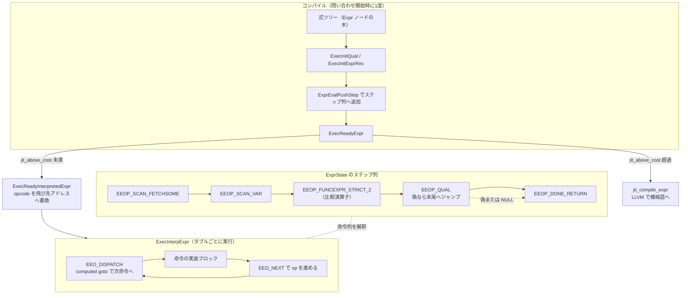

# 第20章 式評価と JIT

> **本章で読むソース**
>
> - [`src/backend/executor/execExpr.c`](https://github.com/postgres/postgres/blob/REL_18_4/src/backend/executor/execExpr.c)
> - [`src/backend/executor/execExprInterp.c`](https://github.com/postgres/postgres/blob/REL_18_4/src/backend/executor/execExprInterp.c)
> - [`src/include/executor/execExpr.h`](https://github.com/postgres/postgres/blob/REL_18_4/src/include/executor/execExpr.h)
> - [`src/include/nodes/execnodes.h`](https://github.com/postgres/postgres/blob/REL_18_4/src/include/nodes/execnodes.h)
> - [`src/backend/jit/jit.c`](https://github.com/postgres/postgres/blob/REL_18_4/src/backend/jit/jit.c)
> - [`src/backend/optimizer/plan/planner.c`](https://github.com/postgres/postgres/blob/REL_18_4/src/backend/optimizer/plan/planner.c)

## この章の狙い

エグゼキュータは、スキャンしたタプルごとに `WHERE` 句の条件を評価し、`SELECT` のリストにある式を計算し、結合条件やソートキーを求める。
これらはすべて、プランナが残した式ツリー（`Expr` ノードの木）として渡ってくる。
1タプルごとにこの木を根から再帰的にたどって評価すると、行数が増えるほどツリー走査の固定費がそのまま積み上がる。

PostgreSQL はこの固定費を、評価の前段にまとめて払う。
問い合わせの開始時に各式ツリーを1度だけ走査し、**ExprState** という線形のステップ列へ変換しておく。
ステップ列は `ExprEvalStep` という小さな命令の配列であり、いわば式専用の極小バイトコードである。
実行時はこの配列を先頭からたどるだけでよく、行ごとのツリー走査は消える。

本章は、式ツリーをステップ列へコンパイルする `ExecInitExpr`／`ExecInitExprRec`（`execExpr.c`）と、ステップ列を解釈実行する `ExecInterpExpr`（`execExprInterp.c`）を読む。
最後に、しきい値 `jit_above_cost` を超えるプランで式評価とタプル展開を機械語へ落とす JIT（`src/backend/jit/`、LLVM）の入口を概観する。
高速化の工夫としては、ツリー走査の前コンパイルそのものに加え、解釈ループの分岐方式である**computed goto**（計算型 goto によるディスパッチ）を機構レベルで取り上げる。

## 前提

第13章から第15章で、プランナが結合順序とアクセス方法を探索し、最良パスを `Plan` ツリーへ変換し、変数参照をスロット番号へ解決するところまでを読んだ。
本章の入口にある式ツリーは、この `Plan` ノードが持つ条件式や対象リスト（`qual`、`targetlist`）である。
変数参照（`Var`）はすでにスロット番号へ解決済みで、式評価は実行時にスロットの配列を添字一つで引ける状態から始まる。

式評価はエグゼキュータの最も内側のループに置かれる。
スキャンや結合のノードが1タプルを取り出すたびに、その条件式と射影式が評価される。
ここでの固定費の削減が、問い合わせ全体のスループットに直接効く。

## 2段構成：コンパイルと解釈

`execExpr.c` の冒頭コメントが、この設計の全体像を簡潔に述べている。

[`src/backend/executor/execExpr.c` L1-L20](https://github.com/postgres/postgres/blob/REL_18_4/src/backend/executor/execExpr.c#L1-L20)

```c
/*-------------------------------------------------------------------------
 *
 * execExpr.c
 *	  Expression evaluation infrastructure.
 *
 *	During executor startup, we compile each expression tree (which has
 *	previously been processed by the parser and planner) into an ExprState,
 *	using ExecInitExpr() et al.  This converts the tree into a flat array
 *	of ExprEvalSteps, which may be thought of as instructions in a program.
 *	At runtime, we'll execute steps, starting with the first, until we reach
 *	an EEOP_DONE_{RETURN|NO_RETURN} opcode.
 *
 *	This file contains the "compilation" logic.  It is independent of the
 *	specific execution technology we use (switch statement, computed goto,
 *	JIT compilation, etc).
 *
 *	See src/backend/executor/README for some background, specifically the
 *	"Expression Trees and ExprState nodes", "Expression Initialization",
 *	and "Expression Evaluation" sections.
 *
```

ポイントは2つある。
第1に、式ツリーは `ExprEvalStep` の平らな配列、つまりプログラムの命令列へ変換される。
第2に、このコンパイルの論理は、実行技術（switch 文、computed goto、JIT）から独立している。
同じステップ列を、解釈実行器で走らせることも、JIT で機械語へ落とすこともできる。

コンパイルの成果物が `ExprState` である。

[`src/include/nodes/execnodes.h` L86-L123](https://github.com/postgres/postgres/blob/REL_18_4/src/include/nodes/execnodes.h#L86-L123)

```c
typedef struct ExprState
{
	NodeTag		type;

#define FIELDNO_EXPRSTATE_FLAGS 1
	uint8		flags;			/* bitmask of EEO_FLAG_* bits, see above */

	/*
	 * Storage for result value of a scalar expression, or for individual
	 * column results within expressions built by ExecBuildProjectionInfo().
	 */
#define FIELDNO_EXPRSTATE_RESNULL 2
	bool		resnull;
#define FIELDNO_EXPRSTATE_RESVALUE 3
	Datum		resvalue;

	/*
	 * If projecting a tuple result, this slot holds the result; else NULL.
	 */
#define FIELDNO_EXPRSTATE_RESULTSLOT 4
	TupleTableSlot *resultslot;

	/*
	 * Instructions to compute expression's return value.
	 */
	struct ExprEvalStep *steps;

	/*
	 * Function that actually evaluates the expression.  This can be set to
	 * different values depending on the complexity of the expression.
	 */
	ExprStateEvalFunc evalfunc;

	/* original expression tree, for debugging only */
	Expr	   *expr;

	/* private state for an evalfunc */
	void	   *evalfunc_private;
```

`steps` がステップ列の本体で、`evalfunc` が実際に評価を行う関数ポインタである。
`resvalue` と `resnull` は、式全体の結果（値と NULL フラグ）を受け取る場所である。
呼び出し側は `ExecEvalExpr` を通じてこの `evalfunc` を呼ぶだけでよい。

[`src/include/executor/executor.h` L387-L395](https://github.com/postgres/postgres/blob/REL_18_4/src/include/executor/executor.h#L387-L395)

```c
#ifndef FRONTEND
static inline Datum
ExecEvalExpr(ExprState *state,
			 ExprContext *econtext,
			 bool *isNull)
{
	return state->evalfunc(state, econtext, isNull);
}
#endif
```

評価方式の違い（解釈実行か、特定パターンの高速経路か、JIT 済みの機械語か）は、すべて `evalfunc` の差し替えに隠れる。
呼び出し側はこの一段の間接呼び出しを意識しなくてよい。

## 命令の形：`ExprEvalStep` と `ExprEvalOp`

ステップ列の1要素が `ExprEvalStep` である。
この構造体は、命令種別を表す `opcode` と、結果の格納先、そして命令ごとのインラインデータを持つ。

[`src/include/executor/execExpr.h` L300-L319](https://github.com/postgres/postgres/blob/REL_18_4/src/include/executor/execExpr.h#L300-L319)

```c
typedef struct ExprEvalStep
{
	/*
	 * Instruction to be executed.  During instruction preparation this is an
	 * enum ExprEvalOp, but later it can be changed to some other type, e.g. a
	 * pointer for computed goto (that's why it's an intptr_t).
	 */
	intptr_t	opcode;

	/* where to store the result of this step */
	Datum	   *resvalue;
	bool	   *resnull;

	/*
	 * Inline data for the operation.  Inline data is faster to access, but
	 * also bloats the size of all instructions.  The union should be kept to
	 * no more than 40 bytes on 64-bit systems (so that the entire struct is
	 * no more than 64 bytes, a single cacheline on common systems).
	 */
	union
```

`opcode` の型が `intptr_t` である点に、後で読む computed goto の伏線がある。
コンパイル中は命令種別を表す列挙値が入るが、解釈実行の準備が済むと、同じ場所へ飛び先アドレス（ポインタ）が上書きされる。
インラインデータの `union` を1キャッシュライン（64バイト）に収める設計意図も、コメントが明記している。
各命令が1キャッシュラインに収まれば、ステップ列を先頭からたどる解釈ループのキャッシュ効率がよい。

命令種別 `ExprEvalOp` は列挙型で、`Var` の取り出し、定数の読み出し、関数呼び出し、ブール演算、各種ジャンプなど、式評価に要る操作を網羅する。
冒頭の `EEOP_DONE_RETURN` が式の終端を表す。

[`src/include/executor/execExpr.h` L66-L72](https://github.com/postgres/postgres/blob/REL_18_4/src/include/executor/execExpr.h#L66-L72)

```c
typedef enum ExprEvalOp
{
	/* entire expression has been evaluated, return value */
	EEOP_DONE_RETURN,

	/* entire expression has been evaluated, no return value */
	EEOP_DONE_NO_RETURN,
```

注目すべきは、関数呼び出しが1種類ではなく、引数の数と性質ごとに別命令へ細分されている点である。

[`src/include/executor/execExpr.h` L117-L127](https://github.com/postgres/postgres/blob/REL_18_4/src/include/executor/execExpr.h#L117-L127)

```c
	/*
	 * Evaluate function call (including OpExprs etc).  For speed, we
	 * distinguish in the opcode whether the function is strict with 1, 2, or
	 * more arguments and/or requires usage stats tracking.
	 */
	EEOP_FUNCEXPR,
	EEOP_FUNCEXPR_STRICT,
	EEOP_FUNCEXPR_STRICT_1,
	EEOP_FUNCEXPR_STRICT_2,
	EEOP_FUNCEXPR_FUSAGE,
	EEOP_FUNCEXPR_STRICT_FUSAGE,
```

strict 関数（引数のどれかが NULL なら結果も NULL になる関数）の NULL 検査や、関数呼び出し統計の採取は、いずれも実行時に毎回判定すると無駄になる。
コンパイル時にどの条件が当てはまるかは確定しているので、その判定を命令種別へ畳み込んでおく。
引数1個や2個の strict 関数には専用命令を用意し、解釈ループ側でループを展開している。
演算子（`OpExpr`）も内部は関数呼び出しなので、この最適化の恩恵を受ける。

## コンパイル：`ExecInitExpr` と `ExecInitExprRec`

式ツリーからステップ列を組み立てる入口が `ExecInitExpr` である。

[`src/backend/executor/execExpr.c` L142-L168](https://github.com/postgres/postgres/blob/REL_18_4/src/backend/executor/execExpr.c#L142-L168)

```c
ExprState *
ExecInitExpr(Expr *node, PlanState *parent)
{
	ExprState  *state;
	ExprEvalStep scratch = {0};

	/* Special case: NULL expression produces a NULL ExprState pointer */
	if (node == NULL)
		return NULL;

	/* Initialize ExprState with empty step list */
	state = makeNode(ExprState);
	state->expr = node;
	state->parent = parent;
	state->ext_params = NULL;

	/* Insert setup steps as needed */
	ExecCreateExprSetupSteps(state, (Node *) node);

	/* Compile the expression proper */
	ExecInitExprRec(node, state, &state->resvalue, &state->resnull);

	/* Finally, append a DONE step */
	scratch.opcode = EEOP_DONE_RETURN;
	ExprEvalPushStep(state, &scratch);

	ExecReadyExpr(state);
```

流れは3段である。
最初に `ExecCreateExprSetupSteps` が、式が参照するスロットの列をまとめて取り出す `FETCHSOME` 命令を前置きする。
次に `ExecInitExprRec` が式ツリーを再帰的にたどり、各ノードに対応するステップを末尾へ追加する。
最後に終端の `EEOP_DONE_RETURN` を置き、`ExecReadyExpr` で解釈実行（または JIT）の準備を整える。
`scratch` という1個の `ExprEvalStep` を組み立て用の下書き領域として使い回し、確定したものを配列へコピーしていく点に注目したい。

`ExecInitExprRec` はノード種別ごとの巨大な `switch` である。
冒頭で下書きの結果格納先を、呼び出し側が指定した場所に設定する。

[`src/backend/executor/execExpr.c` L918-L934](https://github.com/postgres/postgres/blob/REL_18_4/src/backend/executor/execExpr.c#L918-L934)

```c
static void
ExecInitExprRec(Expr *node, ExprState *state,
				Datum *resv, bool *resnull)
{
	ExprEvalStep scratch = {0};

	/* Guard against stack overflow due to overly complex expressions */
	check_stack_depth();

	/* Step's output location is always what the caller gave us */
	Assert(resv != NULL && resnull != NULL);
	scratch.resvalue = resv;
	scratch.resnull = resnull;

	/* cases should be ordered as they are in enum NodeTag */
	switch (nodeTag(node))
	{
```

最も単純な例として、列参照 `Var` は対応する `EEOP_*_VAR` 命令1個へ落ちる。
通常のユーザー列なら、スロット内の何番目の値かを `attnum` に詰め、参照元のスロット（内側、外側、スキャン）に応じて命令種別を選ぶ。

[`src/backend/executor/execExpr.c` L979-L1017](https://github.com/postgres/postgres/blob/REL_18_4/src/backend/executor/execExpr.c#L979-L1017)

```c
				else
				{
					/* regular user column */
					scratch.d.var.attnum = variable->varattno - 1;
					scratch.d.var.vartype = variable->vartype;
					scratch.d.var.varreturningtype = variable->varreturningtype;
					switch (variable->varno)
					{
						case INNER_VAR:
							scratch.opcode = EEOP_INNER_VAR;
							break;
						case OUTER_VAR:
							scratch.opcode = EEOP_OUTER_VAR;
							break;

							/* INDEX_VAR is handled by default case */

						default:
							switch (variable->varreturningtype)
							{
								case VAR_RETURNING_DEFAULT:
									scratch.opcode = EEOP_SCAN_VAR;
									break;
								case VAR_RETURNING_OLD:
									scratch.opcode = EEOP_OLD_VAR;
									state->flags |= EEO_FLAG_HAS_OLD;
									break;
								case VAR_RETURNING_NEW:
									scratch.opcode = EEOP_NEW_VAR;
									state->flags |= EEO_FLAG_HAS_NEW;
									break;
							}
							break;
					}
				}

				ExprEvalPushStep(state, &scratch);
				break;
			}
```

関数呼び出しと演算子は、いずれも `ExecInitFunc` を通る。
ここで引数を先に再帰コンパイルし、最後に strict 性と統計採取の有無から命令種別を選ぶ。

[`src/backend/executor/execExpr.c` L1203-L1212](https://github.com/postgres/postgres/blob/REL_18_4/src/backend/executor/execExpr.c#L1203-L1212)

```c
		case T_OpExpr:
			{
				OpExpr	   *op = (OpExpr *) node;

				ExecInitFunc(&scratch, node,
							 op->args, op->opfuncid, op->inputcollid,
							 state);
				ExprEvalPushStep(state, &scratch);
				break;
			}
```

`ExecInitFunc` の中身を見ると、引数の評価先がそのまま関数呼び出し用の `fcinfo` 構造体の中へ向けられている。

[`src/backend/executor/execExpr.c` L2761-L2785](https://github.com/postgres/postgres/blob/REL_18_4/src/backend/executor/execExpr.c#L2761-L2785)

```c
	/* Build code to evaluate arguments directly into the fcinfo struct */
	argno = 0;
	foreach(lc, args)
	{
		Expr	   *arg = (Expr *) lfirst(lc);

		if (IsA(arg, Const))
		{
			/*
			 * Don't evaluate const arguments every round; especially
			 * interesting for constants in comparisons.
			 */
			Const	   *con = (Const *) arg;

			fcinfo->args[argno].value = con->constvalue;
			fcinfo->args[argno].isnull = con->constisnull;
		}
		else
		{
			ExecInitExprRec(arg, state,
							&fcinfo->args[argno].value,
							&fcinfo->args[argno].isnull);
		}
		argno++;
	}
```

ここに2つの工夫がある。
第1に、引数が定数なら、その値をコンパイル時に `fcinfo` へ書き込んでおき、実行時の評価命令そのものを発行しない。
比較演算の右辺が定数というよくある形では、毎行の定数評価が丸ごと消える。
第2に、定数でない引数は、再帰コンパイルの結果格納先を `fcinfo->args[argno]` に向ける。
引数ステップが評価を終えた時点で、値はすでに関数呼び出しの所定の引数位置に置かれている。
中間バッファからの詰め替えが要らない。

命令種別の最終決定は、strict 性と統計採取レベルの組み合わせで行う。

[`src/backend/executor/execExpr.c` L2787-L2804](https://github.com/postgres/postgres/blob/REL_18_4/src/backend/executor/execExpr.c#L2787-L2804)

```c
	/* Insert appropriate opcode depending on strictness and stats level */
	if (pgstat_track_functions <= flinfo->fn_stats)
	{
		if (flinfo->fn_strict && nargs > 0)
		{
			/* Choose nargs optimized implementation if available. */
			if (nargs == 1)
				scratch->opcode = EEOP_FUNCEXPR_STRICT_1;
			else if (nargs == 2)
				scratch->opcode = EEOP_FUNCEXPR_STRICT_2;
			else
				scratch->opcode = EEOP_FUNCEXPR_STRICT;
		}
		else
			scratch->opcode = EEOP_FUNCEXPR;
	}
	else
	{
```

下書き `scratch` を配列へ追加するのが `ExprEvalPushStep` である。
配列は16要素から始め、満杯になるたびに倍化する。

[`src/backend/executor/execExpr.c` L2677-L2693](https://github.com/postgres/postgres/blob/REL_18_4/src/backend/executor/execExpr.c#L2677-L2693)

```c
void
ExprEvalPushStep(ExprState *es, const ExprEvalStep *s)
{
	if (es->steps_alloc == 0)
	{
		es->steps_alloc = 16;
		es->steps = palloc(sizeof(ExprEvalStep) * es->steps_alloc);
	}
	else if (es->steps_alloc == es->steps_len)
	{
		es->steps_alloc *= 2;
		es->steps = repalloc(es->steps,
							 sizeof(ExprEvalStep) * es->steps_alloc);
	}

	memcpy(&es->steps[es->steps_len++], s, sizeof(ExprEvalStep));
}
```

配列が `repalloc` で動く可能性があるため、コンパイル中はステップ配列の途中要素を指すポインタを保持できない。
ジャンプ先は、ポインタではなくステップ番号（添字）で記録し、後でまとめて解決する。
この点は次の `WHERE` 句のコンパイルで具体的に見える。

## `WHERE` 句のコンパイル：`ExecInitQual`

`WHERE` 句は、暗黙の AND で結ばれた条件式のリストとして渡る。
これを評価する `ExecInitQual` は、各条件式をコンパイルしたあとに `EEOP_QUAL` 命令を1個ずつ挟む。

[`src/backend/executor/execExpr.c` L259-L297](https://github.com/postgres/postgres/blob/REL_18_4/src/backend/executor/execExpr.c#L259-L297)

```c
	scratch.opcode = EEOP_QUAL;

	/*
	 * We can use ExprState's resvalue/resnull as target for each qual expr.
	 */
	scratch.resvalue = &state->resvalue;
	scratch.resnull = &state->resnull;

	foreach_ptr(Expr, node, qual)
	{
		/* first evaluate expression */
		ExecInitExprRec(node, state, &state->resvalue, &state->resnull);

		/* then emit EEOP_QUAL to detect if it's false (or null) */
		scratch.d.qualexpr.jumpdone = -1;
		ExprEvalPushStep(state, &scratch);
		adjust_jumps = lappend_int(adjust_jumps,
								   state->steps_len - 1);
	}

	/* adjust jump targets */
	foreach_int(jump, adjust_jumps)
	{
		ExprEvalStep *as = &state->steps[jump];

		Assert(as->opcode == EEOP_QUAL);
		Assert(as->d.qualexpr.jumpdone == -1);
		as->d.qualexpr.jumpdone = state->steps_len;
	}

	/*
	 * At the end, we don't need to do anything more.  The last qual expr must
	 * have yielded TRUE, and since its result is stored in the desired output
	 * location, we're done.
	 */
	scratch.opcode = EEOP_DONE_RETURN;
	ExprEvalPushStep(state, &scratch);

	ExecReadyExpr(state);
```

`EEOP_QUAL` は、直前の条件式の結果が偽または NULL なら、ステップ列の末尾へ一気に飛ぶ短絡命令である。
AND の条件を1つでも満たさなければ、残りの条件を評価せずに偽を返せる。
飛び先は、各 `EEOP_QUAL` を発行した時点ではまだ確定していないので `jumpdone = -1` と仮置きし、その添字を `adjust_jumps` に覚えておく。
全条件を出し終えてステップ列の長さが決まってから、覚えておいた添字を末尾位置で埋め戻す。
これが、ジャンプ先をステップ番号で扱う具体例である。
`repalloc` で配列が動いても、添字は不変なので壊れない。

ここまでで、1本の式ツリーは終端付きのステップ列になった。
次は、このステップ列を1タプルごとに走らせる解釈実行を読む。

## 解釈実行：`ExecInterpExpr` と computed goto

`execExprInterp.c` の冒頭コメントが、解釈方式の2択とその得失を述べている。

[`src/backend/executor/execExprInterp.c` L1-L29](https://github.com/postgres/postgres/blob/REL_18_4/src/backend/executor/execExprInterp.c#L1-L29)

```c
/*-------------------------------------------------------------------------
 *
 * execExprInterp.c
 *	  Interpreted evaluation of an expression step list.
 *
 * This file provides either a "direct threaded" (for gcc, clang and
 * compatible) or a "switch threaded" (for all compilers) implementation of
 * expression evaluation.  The former is amongst the fastest known methods
 * of interpreting programs without resorting to assembly level work, or
 * just-in-time compilation, but it requires support for computed gotos.
 * The latter is amongst the fastest approaches doable in standard C.
 *
 * In either case we use ExprEvalStep->opcode to dispatch to the code block
 * within ExecInterpExpr() that implements the specific opcode type.
 *
 * Switch-threading uses a plain switch() statement to perform the
 * dispatch.  This has the advantages of being plain C and allowing the
 * compiler to warn if implementation of a specific opcode has been forgotten.
 * The disadvantage is that dispatches will, as commonly implemented by
 * compilers, happen from a single location, requiring more jumps and causing
 * bad branch prediction.
 *
 * In direct threading, we use gcc's label-as-values extension - also adopted
 * by some other compilers - to replace ExprEvalStep->opcode with the address
 * of the block implementing the instruction. Dispatch to the next instruction
 * is done by a "computed goto".  This allows for better branch prediction
 * (as the jumps are happening from different locations) and fewer jumps
 * (as no preparatory jump to a common dispatch location is needed).
 *
```

解釈実行の核心は**ディスパッチ**、つまり「今の命令を実行したら、次はどの命令の実装へ飛ぶか」の決め方にある。
素朴な `switch` 文では、すべての命令が1か所の判定へ戻ってから次へ分岐する。
分岐元が1点に集まるため、CPU の分岐予測が効きにくく、ジャンプも余計に増える。

これに対し**direct threading**（直接スレッディング）では、各命令の `opcode` に、その命令を実装するコードブロックのアドレスを直接埋め込む。
次の命令への移動は、そのアドレスへの計算型 goto 1回で済む。
分岐が各命令の末尾という別々の場所から起きるので、分岐予測が命令ごとの遷移パターンを学習できる。
コンパイラが計算型 goto をサポートするかどうかで、両方式は前処理マクロで切り替わる。

[`src/backend/executor/execExprInterp.c` L102-L141](https://github.com/postgres/postgres/blob/REL_18_4/src/backend/executor/execExprInterp.c#L102-L141)

```c
#if defined(EEO_USE_COMPUTED_GOTO)

/* struct for jump target -> opcode lookup table */
typedef struct ExprEvalOpLookup
{
	const void *opcode;
	ExprEvalOp	op;
} ExprEvalOpLookup;

/* to make dispatch_table accessible outside ExecInterpExpr() */
static const void **dispatch_table = NULL;

/* jump target -> opcode lookup table */
static ExprEvalOpLookup reverse_dispatch_table[EEOP_LAST];

#define EEO_SWITCH()
#define EEO_CASE(name)		CASE_##name:
#define EEO_DISPATCH()		goto *((void *) op->opcode)
#define EEO_OPCODE(opcode)	((intptr_t) dispatch_table[opcode])

#else							/* !EEO_USE_COMPUTED_GOTO */

#define EEO_SWITCH()		starteval: switch ((ExprEvalOp) op->opcode)
#define EEO_CASE(name)		case name:
#define EEO_DISPATCH()		goto starteval
#define EEO_OPCODE(opcode)	(opcode)

#endif							/* EEO_USE_COMPUTED_GOTO */

#define EEO_NEXT() \
	do { \
		op++; \
		EEO_DISPATCH(); \
	} while (0)

#define EEO_JUMP(stepno) \
	do { \
		op = &state->steps[stepno]; \
		EEO_DISPATCH(); \
	} while (0)
```

computed goto 版では、`EEO_DISPATCH()` が `goto *((void *) op->opcode)` に展開される。
`op->opcode` が飛び先アドレスそのものだからこれが成り立つ。
`EEO_NEXT()` は命令ポインタ `op` を1つ進めてからディスパッチし、`EEO_JUMP(stepno)` は指定したステップ番号へ `op` を据えてからディスパッチする。
switch 版では、どちらも共通ラベル `starteval` の `switch` へ戻る。

この `op->opcode` を飛び先アドレスへ書き換える作業を、解釈実行の準備関数 `ExecReadyInterpretedExpr` が1度だけ行う。

[`src/backend/executor/execExprInterp.c` L438-L455](https://github.com/postgres/postgres/blob/REL_18_4/src/backend/executor/execExprInterp.c#L438-L455)

```c
#if defined(EEO_USE_COMPUTED_GOTO)

	/*
	 * In the direct-threaded implementation, replace each opcode with the
	 * address to jump to.  (Use ExecEvalStepOp() to get back the opcode.)
	 */
	for (int off = 0; off < state->steps_len; off++)
	{
		ExprEvalStep *op = &state->steps[off];

		op->opcode = EEO_OPCODE(op->opcode);
	}

	state->flags |= EEO_FLAG_DIRECT_THREADED;
#endif							/* EEO_USE_COMPUTED_GOTO */

	state->evalfunc_private = ExecInterpExpr;
}
```

各ステップの `opcode` は、列挙値から `dispatch_table[opcode]`（飛び先アドレス）へ置き換わる。
ここで先の `intptr_t opcode` が効く。
列挙値もアドレスも同じ整数幅の領域に収まるので、命令を太らせずに種別とアドレスを同居させられる。

飛び先アドレスの一覧 `dispatch_table` は、`ExecInterpExpr` の中でラベルの配列として定義される。
配列の並びは `ExprEvalOp` の列挙順と厳密に一致する必要があり、`StaticAssertDecl` でその一致をコンパイル時に検証する。

[`src/backend/executor/execExprInterp.c` L481-L512](https://github.com/postgres/postgres/blob/REL_18_4/src/backend/executor/execExprInterp.c#L481-L512)

```c
#if defined(EEO_USE_COMPUTED_GOTO)
	static const void *const dispatch_table[] = {
		&&CASE_EEOP_DONE_RETURN,
		&&CASE_EEOP_DONE_NO_RETURN,
		&&CASE_EEOP_INNER_FETCHSOME,
		&&CASE_EEOP_OUTER_FETCHSOME,
		&&CASE_EEOP_SCAN_FETCHSOME,
		&&CASE_EEOP_OLD_FETCHSOME,
		&&CASE_EEOP_NEW_FETCHSOME,
		&&CASE_EEOP_INNER_VAR,
		&&CASE_EEOP_OUTER_VAR,
		&&CASE_EEOP_SCAN_VAR,
		&&CASE_EEOP_OLD_VAR,
		&&CASE_EEOP_NEW_VAR,
		&&CASE_EEOP_INNER_SYSVAR,
		&&CASE_EEOP_OUTER_SYSVAR,
		&&CASE_EEOP_SCAN_SYSVAR,
		&&CASE_EEOP_OLD_SYSVAR,
		&&CASE_EEOP_NEW_SYSVAR,
		&&CASE_EEOP_WHOLEROW,
		&&CASE_EEOP_ASSIGN_INNER_VAR,
		&&CASE_EEOP_ASSIGN_OUTER_VAR,
		&&CASE_EEOP_ASSIGN_SCAN_VAR,
		&&CASE_EEOP_ASSIGN_OLD_VAR,
		&&CASE_EEOP_ASSIGN_NEW_VAR,
		&&CASE_EEOP_ASSIGN_TMP,
		&&CASE_EEOP_ASSIGN_TMP_MAKE_RO,
		&&CASE_EEOP_CONST,
		&&CASE_EEOP_FUNCEXPR,
		&&CASE_EEOP_FUNCEXPR_STRICT,
		&&CASE_EEOP_FUNCEXPR_STRICT_1,
		&&CASE_EEOP_FUNCEXPR_STRICT_2,
```

`&&CASE_EEOP_*` は計算型 goto のラベルアドレスである。
`ExecInterpExpr` の本体は、命令ポインタ `op` を初期化してから最初のディスパッチへ入る。

[`src/backend/executor/execExprInterp.c` L615-L640](https://github.com/postgres/postgres/blob/REL_18_4/src/backend/executor/execExprInterp.c#L615-L640)

```c
	/* setup state */
	op = state->steps;
	resultslot = state->resultslot;
	innerslot = econtext->ecxt_innertuple;
	outerslot = econtext->ecxt_outertuple;
	scanslot = econtext->ecxt_scantuple;
	oldslot = econtext->ecxt_oldtuple;
	newslot = econtext->ecxt_newtuple;

#if defined(EEO_USE_COMPUTED_GOTO)
	EEO_DISPATCH();
#endif

	EEO_SWITCH()
	{
		EEO_CASE(EEOP_DONE_RETURN)
		{
			*isnull = state->resnull;
			return state->resvalue;
		}

		EEO_CASE(EEOP_DONE_NO_RETURN)
		{
			Assert(isnull == NULL);
			return (Datum) 0;
		}
```

`EEOP_DONE_RETURN` に至ると、`ExprState` に溜めた結果を返して評価が終わる。
個々の命令の実装は、末尾で `EEO_NEXT()` を呼んで次の命令へ遷移する。
`Var` の取り出しは、すでに展開済みのスロット配列から値をコピーするだけである。

[`src/backend/executor/execExprInterp.c` L687-L702](https://github.com/postgres/postgres/blob/REL_18_4/src/backend/executor/execExprInterp.c#L687-L702)

```c
		EEO_CASE(EEOP_INNER_VAR)
		{
			int			attnum = op->d.var.attnum;

			/*
			 * Since we already extracted all referenced columns from the
			 * tuple with a FETCHSOME step, we can just grab the value
			 * directly out of the slot's decomposed-data arrays.  But let's
			 * have an Assert to check that that did happen.
			 */
			Assert(attnum >= 0 && attnum < innerslot->tts_nvalid);
			*op->resvalue = innerslot->tts_values[attnum];
			*op->resnull = innerslot->tts_isnull[attnum];

			EEO_NEXT();
		}
```

コメントが述べるとおり、参照する列は先頭の `FETCHSOME` 命令でまとめて取り出し済みである。
だから `Var` の命令は、スロットの分解済み配列を添字一つで引くだけでよい。
列ごとにタプルを解く（deform する）作業を、参照のたびに繰り返さない。

strict 関数の命令は、引数の NULL 検査と関数呼び出しをこの場で行う。

[`src/backend/executor/execExprInterp.c` L942-L967](https://github.com/postgres/postgres/blob/REL_18_4/src/backend/executor/execExprInterp.c#L942-L967)

```c
		EEO_CASE(EEOP_FUNCEXPR_STRICT)
		{
			FunctionCallInfo fcinfo = op->d.func.fcinfo_data;
			NullableDatum *args = fcinfo->args;
			int			nargs = op->d.func.nargs;
			Datum		d;

			Assert(nargs > 2);

			/* strict function, so check for NULL args */
			for (int argno = 0; argno < nargs; argno++)
			{
				if (args[argno].isnull)
				{
					*op->resnull = true;
					goto strictfail;
				}
			}
			fcinfo->isnull = false;
			d = op->d.func.fn_addr(fcinfo);
			*op->resvalue = d;
			*op->resnull = fcinfo->isnull;

	strictfail:
			EEO_NEXT();
		}
```

引数はコンパイル時に `fcinfo` の中へ評価先を向けてあるので、ここでは詰め替えなしに NULL を検査し、`fn_addr`（関数本体）を呼ぶ。
`WHERE` 句の短絡を担う `EEOP_QUAL` は、結果が偽または NULL なら末尾へ飛ぶ。

[`src/backend/executor/execExprInterp.c` L1180-L1200](https://github.com/postgres/postgres/blob/REL_18_4/src/backend/executor/execExprInterp.c#L1180-L1200)

```c
		EEO_CASE(EEOP_QUAL)
		{
			/* simplified version of BOOL_AND_STEP for use by ExecQual() */

			/* If argument (also result) is false or null ... */
			if (*op->resnull ||
				!DatumGetBool(*op->resvalue))
			{
				/* ... bail out early, returning FALSE */
				*op->resnull = false;
				*op->resvalue = BoolGetDatum(false);
				EEO_JUMP(op->d.qualexpr.jumpdone);
			}

			/*
			 * Otherwise, leave the TRUE value in place, in case this is the
			 * last qual.  Then, TRUE is the correct answer.
			 */

			EEO_NEXT();
		}
```

`jumpdone` は、`ExecInitQual` がコンパイル末尾で埋め戻した末尾ステップ番号である。
`EEO_JUMP` がその番号へ `op` を据えて、残りの条件評価を飛ばす。

## 高速化の工夫：ツリー走査の前コンパイルと computed goto

本章で読んだ仕組みは、2段の前計算で行ごとの固定費を削る。
第1段は、式ツリーの走査そのものを評価ループから追い出すことである。
木をたどる再帰、ノード種別の判定、子ノードへの分岐は、すべて `ExecInitExpr` の側に1度だけ払い、実行時は平らな配列を先頭からたどるだけにする。
strict 性や統計採取の判定、定数引数の評価も命令種別やインラインデータへ畳み込み、毎行の判定を消す。

第2段は、その平らな配列を解釈するループでの分岐方式である。
computed goto を使うと、各命令の末尾から次の命令の実装へ直接飛べる。
分岐元が命令ごとに分散するため、CPU の分岐予測が「この命令の次はこの命令」という遷移の規則性を学習でき、共通の `switch` 判定へ毎回戻る無駄も省ける。
これは解釈実行器一般で知られた高速化で、PostgreSQL はコンパイラが対応していれば自動で採用する。

両者は補い合う。
前コンパイルがあるからステップ列という固定形が生まれ、固定形があるから computed goto のディスパッチが素直に書ける。
1タプルごとの式評価がエグゼキュータの最内ループに置かれることを思えば、この2段の効果は問い合わせ全体に波及する。

## さらに上の段：JIT

ステップ列の解釈実行でも、命令1個ごとに間接的なディスパッチが残る。
扱う行数が膨大なら、このディスパッチ自体や、汎用的に書かれた命令実装の分岐が無視できなくなる。
そこで PostgreSQL は、式評価とタプル展開を実行時に LLVM で機械語へコンパイルする JIT を持つ。
解釈ループのディスパッチを消し、特定の式に特化したコードを生成して、命令間の境界そのものをなくす狙いである。

JIT を行うかどうかは、`ExecReadyExpr` が解釈実行の準備の前に判断する。

[`src/backend/executor/execExpr.c` L901-L908](https://github.com/postgres/postgres/blob/REL_18_4/src/backend/executor/execExpr.c#L901-L908)

```c
static void
ExecReadyExpr(ExprState *state)
{
	if (jit_compile_expr(state))
		return;

	ExecReadyInterpretedExpr(state);
}
```

`jit_compile_expr` が成功すれば、解釈実行の準備（`ExecReadyInterpretedExpr`）は行わない。
この `jit_compile_expr` は、プロバイダ非依存の JIT 基盤に置かれ、JIT を行う条件を順に確かめる。

[`src/backend/jit/jit.c` L150-L178](https://github.com/postgres/postgres/blob/REL_18_4/src/backend/jit/jit.c#L150-L178)

```c
bool
jit_compile_expr(struct ExprState *state)
{
	/*
	 * We can easily create a one-off context for functions without an
	 * associated PlanState (and thus EState). But because there's no executor
	 * shutdown callback that could deallocate the created function, they'd
	 * live to the end of the transactions, where they'd be cleaned up by the
	 * resowner machinery. That can lead to a noticeable amount of memory
	 * usage, and worse, trigger some quadratic behaviour in gdb. Therefore,
	 * at least for now, don't create a JITed function in those circumstances.
	 */
	if (!state->parent)
		return false;

	/* if no jitting should be performed at all */
	if (!(state->parent->state->es_jit_flags & PGJIT_PERFORM))
		return false;

	/* or if expressions aren't JITed */
	if (!(state->parent->state->es_jit_flags & PGJIT_EXPR))
		return false;

	/* this also takes !jit_enabled into account */
	if (provider_init())
		return provider.compile_expr(state);

	return false;
}
```

判断材料は `es_jit_flags` で、`PGJIT_PERFORM`（JIT を行う）と `PGJIT_EXPR`（式を JIT 対象にする）のビットが立っているかを見る。
このフラグを立てるのはプランナで、プランの総コストをしきい値 `jit_above_cost` と比べる。

[`src/backend/optimizer/plan/planner.c` L604-L627](https://github.com/postgres/postgres/blob/REL_18_4/src/backend/optimizer/plan/planner.c#L604-L627)

```c
	result->jitFlags = PGJIT_NONE;
	if (jit_enabled && jit_above_cost >= 0 &&
		top_plan->total_cost > jit_above_cost)
	{
		result->jitFlags |= PGJIT_PERFORM;

		/*
		 * Decide how much effort should be put into generating better code.
		 */
		if (jit_optimize_above_cost >= 0 &&
			top_plan->total_cost > jit_optimize_above_cost)
			result->jitFlags |= PGJIT_OPT3;
		if (jit_inline_above_cost >= 0 &&
			top_plan->total_cost > jit_inline_above_cost)
			result->jitFlags |= PGJIT_INLINE;

		/*
		 * Decide which operations should be JITed.
		 */
		if (jit_expressions)
			result->jitFlags |= PGJIT_EXPR;
		if (jit_tuple_deforming)
			result->jitFlags |= PGJIT_DEFORM;
	}
```

JIT には、コンパイル自体の固定費がかかる。
だからプランの総コストがしきい値を超えたとき、つまり JIT の固定費を回収できるほど多くの行を処理すると見込まれるときに限って有効化する。
`jit_above_cost`（既定値 `100000`）が JIT を行うかどうかの境目で、さらに `jit_inline_above_cost` と `jit_optimize_above_cost`（いずれも既定値 `500000`）が、より高コストなプランに対して関数インライン化や最適化を追加で要求する。
式の JIT を司る `jit_expressions`、タプル展開の JIT を司る `jit_tuple_deforming` の両 GUC が、対象とする操作を選ぶ。
LLVM による具体的なコード生成（`llvmjit_expr.c` 等）は本章では深入りしない。

ここで押さえたいのは段の重なりである。
式ツリーから生まれたステップ列という同じ中間表現を、行数が少なければ解釈実行で走らせ、行数が多ければ JIT で機械語へ落とす。
コンパイル論理を実行技術から独立させた `execExpr.c` の設計が、この使い分けを可能にしている。

## ステップ列が生まれて評価されるまで

ここまでの流れを、1本の `WHERE` 句が評価されるまでの形で図にする。



コンパイルは問い合わせ開始時に1度だけ走り、ステップ列を作る。
評価はタプルごとに走り、computed goto で命令から命令へ遷移する。
JIT を選んだ場合は、解釈ループの代わりに生成済みの機械語が同じステップ列の意味を実行する。

## まとめ

式評価は、エグゼキュータの最内ループで `WHERE` 句や射影式を計算する仕組みである。
PostgreSQL は、式ツリーを `ExecInitExpr`／`ExecInitExprRec` で `ExprEvalStep` の線形なステップ列へ前コンパイルし、行ごとのツリー走査を消す。
strict 性や定数引数といった実行時に不変な判定は、命令種別やインラインデータへ畳み込む。
`WHERE` 句は `EEOP_QUAL` の短絡命令へ落ち、ジャンプ先はステップ番号で記録して末尾で埋め戻す。

解釈実行 `ExecInterpExpr` は、computed goto による direct threading で命令から命令へ遷移し、共通の `switch` 判定へ戻る無駄と分岐予測の外しを避ける。
扱う行数がしきい値 `jit_above_cost` を超えるプランでは、同じステップ列を LLVM で機械語へ落とす JIT が選ばれ、ディスパッチそのものを消す。
コンパイル論理を実行技術から独立させた設計が、解釈実行と JIT の使い分けを支えている。

## 関連する章

- [第15章 プランの実体化](../part03-query-frontend/15-plan-creation.md)：本章が評価する式は、ここで `Plan` ノードへ組み込まれ、変数参照がスロット番号へ解決される。
- [第13章 プランナの全体像](../part03-query-frontend/13-planner-overview.md)：JIT を行うかどうかを決める総コストとしきい値の比較は、ここで読んだプラン生成の最終段にある。
