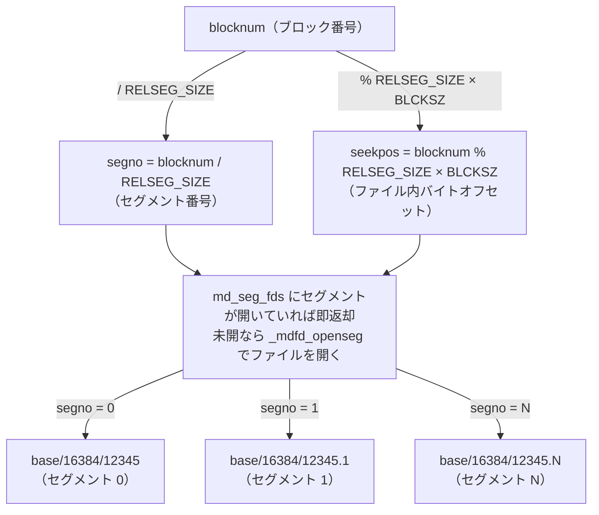

# 第21章 ストレージマネージャ

> **本章で読むソース**
>
> - [`src/backend/storage/smgr/smgr.c`](https://github.com/postgres/postgres/blob/REL_18_4/src/backend/storage/smgr/smgr.c)
> - [`src/backend/storage/smgr/md.c`](https://github.com/postgres/postgres/blob/REL_18_4/src/backend/storage/smgr/md.c)
> - [`src/include/storage/smgr.h`](https://github.com/postgres/postgres/blob/REL_18_4/src/include/storage/smgr.h)
> - [`src/include/storage/relfilelocator.h`](https://github.com/postgres/postgres/blob/REL_18_4/src/include/storage/relfilelocator.h)
> - [`src/include/common/relpath.h`](https://github.com/postgres/postgres/blob/REL_18_4/src/include/common/relpath.h)

## この章の狙い

第5部はストレージとバッファ管理を扱う。
その最下層が本章の**ストレージマネージャ**である。
ここはリレーションを 8KB 固定長のブロックの集まりとしてとらえ、指定したブロックをディスクのファイルとオフセットへ写してから読み書きする層である。

上位のバッファ管理（第22章）から見ると、ストレージマネージャは「リレーションのこのフォークの第 N ブロックを、このメモリへ読め」「このメモリの内容を第 N ブロックへ書け」という、ブロック単位の入出力だけを引き受ける窓口である。
バッファ管理はキャッシュ管理に専念し、実際のディスクとのやり取りはすべてこの層に委ねる。

ストレージマネージャは2階建ての構造を持つ。
上の階は `smgr.c` の**ストレージマネージャ抽象**であり、メソッドテーブルを介して具体的な実装へ処理を振り分ける。
下の階は `md.c` の**磁気ディスク実装**であり、リレーションを 1GB ごとのセグメントファイル群へ写し、ブロック番号からファイルとファイル内オフセットを引く。
本章はこの2階を順にたどる。

最適化の工夫としては、`md.c` がリレーションを 1GB のセグメントに分割する仕組みを機構レベルで取り上げる。
巨大なリレーションでも、ファイルシステムのファイルサイズ上限を避け、リレーション末尾の切り詰めをファイル単位の操作で済ませられる理由を説明する。

## 前提

リレーションがディスク上でどのファイルに対応するかは、第10部のシステムカタログとも関わる。
本章を読むうえで必要な前提は、リレーションの物理的な実体が `base/` などの下に並ぶファイル群だという点に尽きる。

`postgres` が `palloc` で確保するメモリやメモリコンテキストの考え方は第6章で読んだ。
ストレージマネージャが握るオブジェクトもメモリコンテキストの上に置かれる。
ディスク入出力そのものをカーネルへ渡す仮想ファイルディスクリプタ層（`fd.c` の `File` 型）は、本章では `FileRead` や `FileWrite` などの呼び出しとして現れる。
これらはカーネルのファイルディスクリプタ数の上限を超えてファイルを開けるようにするための層であり、本章では「実ファイルへの読み書きを行う関数」として扱う。

## リレーションの識別：RelFileLocator

ストレージマネージャが扱う対象は「リレーション」だが、より正確には、リレーションの物理的な実体を指す識別子である。
その識別子が `RelFileLocator` である。

[`src/include/storage/relfilelocator.h` L58-L63](https://github.com/postgres/postgres/blob/REL_18_4/src/include/storage/relfilelocator.h#L58-L63)

```c
typedef struct RelFileLocator
{
	Oid			spcOid;			/* tablespace */
	Oid			dbOid;			/* database */
	RelFileNumber relNumber;	/* relation */
} RelFileLocator;
```

この3つの値が、リレーションのファイルがどこに置かれるかを決める。
`spcOid` はテーブル空間、`dbOid` はデータベース、`relNumber` はそのデータベースとテーブル空間の中で個々のリレーションを表す。
`relNumber` は `pg_class.oid` ではなく `pg_class.relfilenode` に対応する点が重要であり、これによって `TRUNCATE` や `VACUUM FULL` のように同じテーブルへ新しい物理ファイルを割り当て直す操作を表現できる。

一時テーブルのように特定のバックエンドだけが触るリレーションは、`RelFileLocator` だけでは区別できない。
そこで、所有するバックエンドのプロセス番号を添えた `RelFileLocatorBackend` がある。

[`src/include/storage/relfilelocator.h` L73-L77](https://github.com/postgres/postgres/blob/REL_18_4/src/include/storage/relfilelocator.h#L73-L77)

```c
typedef struct RelFileLocatorBackend
{
	RelFileLocator locator;
	ProcNumber	backend;
} RelFileLocatorBackend;
```

通常のリレーションでは `backend` は `INVALID_PROC_NUMBER` であり、すべてのバックエンドから共通に見える。
一時リレーションでは所有バックエンドのプロセス番号が入り、その値が有効かどうかで一時かどうかを判定する。

### フォーク：1リレーションを構成する複数のファイル群

`RelFileLocator` が指すリレーションは、ディスク上では1つのファイルとは限らない。
リレーションは複数の**フォーク**から成り、フォークごとに別のファイルとして格納される。
フォークの種別は `ForkNumber` で表される。

[`src/include/common/relpath.h` L56-L69](https://github.com/postgres/postgres/blob/REL_18_4/src/include/common/relpath.h#L56-L69)

```c
typedef enum ForkNumber
{
	InvalidForkNumber = -1,
	MAIN_FORKNUM = 0,
	FSM_FORKNUM,
	VISIBILITYMAP_FORKNUM,
	INIT_FORKNUM,

	/*
	 * NOTE: if you add a new fork, change MAX_FORKNUM and possibly
	 * FORKNAMECHARS below, and update the forkNames array in
	 * src/common/relpath.c
	 */
} ForkNumber;
```

4種のフォークの役割は次のとおりである。

- **main**：タプルそのものを格納する本体のフォークであり、リレーションには必ず存在する。
- **fsm**：空き領域マップ（FSM）であり、各ブロックの空き容量を記録して挿入先を素早く探すために使う（詳細は第29章で読む）。
- **vm**：可視性マップ（VM、visibility map）であり、全タプルが可視なブロックを記録してバキュームやインデックスオンリースキャンを省力化する。
- **init**：アンログドテーブルの初期状態を保つフォークであり、クラッシュ後の再初期化に使う。

ディスク上のファイル名は、フォークごとに付けられた名前で区別される。
名前の対応は `forkNames` 配列が持つ。

[`src/common/relpath.c` L33-L38](https://github.com/postgres/postgres/blob/REL_18_4/src/common/relpath.c#L33-L38)

```c
const char *const forkNames[] = {
	[MAIN_FORKNUM] = "main",
	[FSM_FORKNUM] = "fsm",
	[VISIBILITYMAP_FORKNUM] = "vm",
	[INIT_FORKNUM] = "init",
};
```

main フォークのファイル名は `relNumber` の数値そのものであり、その他のフォークは `relNumber_fsm` のように接尾辞が付く。
ストレージマネージャの読み書き関数はすべて、対象リレーションを `SMgrRelation` で、対象フォークを `ForkNumber` で受け取る。

## ストレージマネージャ抽象：smgr.c

`smgr.c` は、すべてのリレーションへのファイルシステム操作が通る窓口である。
窓口を通る対象は `SMgrRelation` であり、これは読み書きのために開かれた物理的なディスク上のリレーションファイルを表すオブジェクトである。

### SMgrRelation：開いたリレーションのハンドル

`SMgrRelation` の実体 `SMgrRelationData` は、リレーションの物理識別子と、開いているファイルディスクリプタや既知のサイズなどをまとめて持つ。

[`src/include/storage/smgr.h` L35-L70](https://github.com/postgres/postgres/blob/REL_18_4/src/include/storage/smgr.h#L35-L70)

```c
typedef struct SMgrRelationData
{
	/* rlocator is the hashtable lookup key, so it must be first! */
	RelFileLocatorBackend smgr_rlocator;	/* relation physical identifier */

	/*
	 * The following fields are reset to InvalidBlockNumber upon a cache flush
	 * event, and hold the last known size for each fork.  This information is
	 * currently only reliable during recovery, since there is no cache
	 * invalidation for fork extension.
	 */
	BlockNumber smgr_targblock; /* current insertion target block */
	BlockNumber smgr_cached_nblocks[MAX_FORKNUM + 1];	/* last known size */

	/* additional public fields may someday exist here */

	/*
	 * Fields below here are intended to be private to smgr.c and its
	 * submodules.  Do not touch them from elsewhere.
	 */
	int			smgr_which;		/* storage manager selector */

	/*
	 * for md.c; per-fork arrays of the number of open segments
	 * (md_num_open_segs) and the segments themselves (md_seg_fds).
	 */
	int			md_num_open_segs[MAX_FORKNUM + 1];
	struct _MdfdVec *md_seg_fds[MAX_FORKNUM + 1];

	/*
	 * Pinning support.  If unpinned (ie. pincount == 0), 'node' is a list
	 * link in list of all unpinned SMgrRelations.
	 */
	int			pincount;
	dlist_node	node;
} SMgrRelationData;
```

先頭の `smgr_rlocator` は、後述のハッシュテーブルの検索キーを兼ねる。
`smgr_cached_nblocks` は、フォークごとに最後に判明したブロック数を覚えておく欄であり、サイズ問い合わせの繰り返しを省くために使う。
`smgr_which` はどのストレージマネージャ実装を使うかを選ぶ添字だが、現状の実装は磁気ディスク実装の1つだけである。
`md_num_open_segs` と `md_seg_fds` は `md.c` 専用の欄であり、フォークごとに開いているセグメントの本数と、その各セグメントのファイルディスクリプタを保持する。

### メソッドテーブル smgrsw による振り分け

`smgr.c` と個々のストレージマネージャ実装との間の API は、関数ポインタの構造体 `f_smgr` で定義される。
そのインスタンスを並べた配列 `smgrsw` がメソッドテーブルであり、現状は磁気ディスク実装の1要素だけを持つ。

[`src/backend/storage/smgr/smgr.c` L128-L152](https://github.com/postgres/postgres/blob/REL_18_4/src/backend/storage/smgr/smgr.c#L128-L152)

```c
static const f_smgr smgrsw[] = {
	/* magnetic disk */
	{
		.smgr_init = mdinit,
		.smgr_shutdown = NULL,
		.smgr_open = mdopen,
		.smgr_close = mdclose,
		.smgr_create = mdcreate,
		.smgr_exists = mdexists,
		.smgr_unlink = mdunlink,
		.smgr_extend = mdextend,
		.smgr_zeroextend = mdzeroextend,
		.smgr_prefetch = mdprefetch,
		.smgr_maxcombine = mdmaxcombine,
		.smgr_readv = mdreadv,
		.smgr_startreadv = mdstartreadv,
		.smgr_writev = mdwritev,
		.smgr_writeback = mdwriteback,
		.smgr_nblocks = mdnblocks,
		.smgr_truncate = mdtruncate,
		.smgr_immedsync = mdimmedsync,
		.smgr_registersync = mdregistersync,
		.smgr_fd = mdfd,
	}
};
```

各メソッドの実体はすべて `md.c` の `md` 接頭辞の関数である。
公開関数はこのテーブルを経由して実装を呼ぶだけなので、ストレージマネージャ抽象の各関数は同じ形をしている。
`SMgrRelation` の `smgr_which` を添字にしてメソッドを引き、実装関数へ処理を渡す。
この間接呼び出しが、将来ネットワーク越しのストレージのような別実装を差し込める余地を残している。

### smgropen：ハッシュテーブルから SMgrRelation を引く

リレーションへの物理アクセスは、まず `smgropen` で `SMgrRelation` を得るところから始まる。
`smgropen` は、バックエンドごとのハッシュテーブルを引き、同じ `RelFileLocator` に対しては同じオブジェクトを返す。

[`src/backend/storage/smgr/smgr.c` L239-L289](https://github.com/postgres/postgres/blob/REL_18_4/src/backend/storage/smgr/smgr.c#L239-L289)

```c
SMgrRelation
smgropen(RelFileLocator rlocator, ProcNumber backend)
{
	RelFileLocatorBackend brlocator;
	SMgrRelation reln;
	bool		found;

	Assert(RelFileNumberIsValid(rlocator.relNumber));

	HOLD_INTERRUPTS();

	if (SMgrRelationHash == NULL)
	{
		/* First time through: initialize the hash table */
		HASHCTL		ctl;

		ctl.keysize = sizeof(RelFileLocatorBackend);
		ctl.entrysize = sizeof(SMgrRelationData);
		SMgrRelationHash = hash_create("smgr relation table", 400,
									   &ctl, HASH_ELEM | HASH_BLOBS);
		dlist_init(&unpinned_relns);
	}

	/* Look up or create an entry */
	brlocator.locator = rlocator;
	brlocator.backend = backend;
	reln = (SMgrRelation) hash_search(SMgrRelationHash,
									  &brlocator,
									  HASH_ENTER, &found);

	/* Initialize it if not present before */
	if (!found)
	{
		/* hash_search already filled in the lookup key */
		reln->smgr_targblock = InvalidBlockNumber;
		for (int i = 0; i <= MAX_FORKNUM; ++i)
			reln->smgr_cached_nblocks[i] = InvalidBlockNumber;
		reln->smgr_which = 0;	/* we only have md.c at present */

		/* it is not pinned yet */
		reln->pincount = 0;
		dlist_push_tail(&unpinned_relns, &reln->node);

		/* implementation-specific initialization */
		smgrsw[reln->smgr_which].smgr_open(reln);
	}

	RESUME_INTERRUPTS();

	return reln;
}
```

同じ `RelFileLocator` を2回 `smgropen` しても、ハッシュテーブルの同じエントリが返る。
これによって、同じリレーションへの繰り返しアクセスでファイルを開き直さずに済み、サイズなどの情報を `SMgrRelation` に覚えておける。
コメントが述べるとおり、ここでは下層のファイルを実際には開かない。
新規エントリのときに呼ぶ `smgr_open`（実体は `mdopen`）も、各フォークの開いているセグメント数をゼロに初期化するだけである。

エントリの寿命はトランザクションの終端までである。
トランザクションの終わりに `AtEOXact_SMgr` が呼ばれ、ピン留めされていないエントリは破棄される。
リレーションキャッシュから参照されるエントリは `smgrpin` でピン留めされ、破棄を免れる。
ファイルが削除されたときにカーネルのファイルディスクリプタを早めに閉じたい、という要求と、繰り返しアクセスを速くしたい、という要求の折り合いがこの寿命に表れている。

### 読み書きの公開関数

ブロックの読み書きは、メソッドテーブルを経由する短い関数である。
`smgrwritev` は既存ブロックの更新に使う書き込みであり、割り込みを抑止したうえでメソッドへ振り分ける。

[`src/backend/storage/smgr/smgr.c` L790-L798](https://github.com/postgres/postgres/blob/REL_18_4/src/backend/storage/smgr/smgr.c#L790-L798)

```c
void
smgrwritev(SMgrRelation reln, ForkNumber forknum, BlockNumber blocknum,
		   const void **buffers, BlockNumber nblocks, bool skipFsync)
{
	HOLD_INTERRUPTS();
	smgrsw[reln->smgr_which].smgr_writev(reln, forknum, blocknum,
										 buffers, nblocks, skipFsync);
	RESUME_INTERRUPTS();
}
```

読み込みの `smgrreadv` も同じ形である。
1ブロックだけを読み書きする呼び出しは、ヘッダの `smgrread` と `smgrwrite` が複数ブロック版を1要素で呼ぶ薄い包みとして用意されている。

[`src/include/storage/smgr.h` L123-L135](https://github.com/postgres/postgres/blob/REL_18_4/src/include/storage/smgr.h#L123-L135)

```c
static inline void
smgrread(SMgrRelation reln, ForkNumber forknum, BlockNumber blocknum,
		 void *buffer)
{
	smgrreadv(reln, forknum, blocknum, &buffer, 1);
}

static inline void
smgrwrite(SMgrRelation reln, ForkNumber forknum, BlockNumber blocknum,
		  const void *buffer, bool skipFsync)
{
	smgrwritev(reln, forknum, blocknum, &buffer, 1, skipFsync);
}
```

`smgrwritev` のコメントが述べるとおり、書き込みは既存ブロックの更新だけに使う。
リレーションを末尾より先へ伸ばすには、次に見る `smgrextend` を使う。
また書き込みは同期的ではなく、ブロックがカーネルへ渡るだけで、ディスクへの確定は次のチェックポイントまでに `fsync` される仕組みに委ねられる。

### smgrextend：末尾へブロックを足す

リレーションを伸ばすのが `smgrextend` である。
指定したブロック番号が現在の末尾以遠にある前提で、新しいブロックを書き込む。

[`src/backend/storage/smgr/smgr.c` L619-L639](https://github.com/postgres/postgres/blob/REL_18_4/src/backend/storage/smgr/smgr.c#L619-L639)

```c
void
smgrextend(SMgrRelation reln, ForkNumber forknum, BlockNumber blocknum,
		   const void *buffer, bool skipFsync)
{
	HOLD_INTERRUPTS();

	smgrsw[reln->smgr_which].smgr_extend(reln, forknum, blocknum,
										 buffer, skipFsync);

	/*
	 * Normally we expect this to increase nblocks by one, but if the cached
	 * value isn't as expected, just invalidate it so the next call asks the
	 * kernel.
	 */
	if (reln->smgr_cached_nblocks[forknum] == blocknum)
		reln->smgr_cached_nblocks[forknum] = blocknum + 1;
	else
		reln->smgr_cached_nblocks[forknum] = InvalidBlockNumber;

	RESUME_INTERRUPTS();
}
```

実装へ振り分けたあと、`smgr_cached_nblocks` に覚えたブロック数を更新する。
末尾の1つ先へ追加した通常の場合はキャッシュ値を1増やし、予想と違えばキャッシュを無効化して次回はカーネルへ問い合わせ直すようにする。

### smgrnblocks：リレーションのブロック数

リレーションのブロック数は `smgrnblocks` で得る。
ここに、サイズ問い合わせを省くキャッシュの使いどころが現れる。

[`src/backend/storage/smgr/smgr.c` L818-L837](https://github.com/postgres/postgres/blob/REL_18_4/src/backend/storage/smgr/smgr.c#L818-L837)

```c
BlockNumber
smgrnblocks(SMgrRelation reln, ForkNumber forknum)
{
	BlockNumber result;

	/* Check and return if we get the cached value for the number of blocks. */
	result = smgrnblocks_cached(reln, forknum);
	if (result != InvalidBlockNumber)
		return result;

	HOLD_INTERRUPTS();

	result = smgrsw[reln->smgr_which].smgr_nblocks(reln, forknum);

	reln->smgr_cached_nblocks[forknum] = result;

	RESUME_INTERRUPTS();

	return result;
}
```

まず `smgrnblocks_cached` を見て、キャッシュ値が使えるならそれを返す。
そうでなければ実装の `mdnblocks` を呼んで実サイズを求め、結果をキャッシュへ書き戻す。
ただしキャッシュ値を信用してよいのはリカバリ中だけである。
通常運転では、別のバックエンドがフォークを伸ばしてもそれを知らせる仕組みがないため、`smgrnblocks_cached` はリカバリ中に限ってキャッシュを返す。

## 磁気ディスク実装：md.c

ここから下の階、`md.c` を読む。
ファイル名は磁気ディスクに由来するが、実体は smgr API からカーネルのファイルシステム API への橋渡しであり、回転する円盤かどうかは問わない。
この層の核心は、リレーションを 1GB ごとのセグメントファイルに分割し、ブロック番号からファイルとオフセットを引くところにある。

### セグメント分割という最適化

セグメント分割の理由は、`md.c` の冒頭コメントが述べている。

[`src/backend/storage/smgr/md.c` L43-L66](https://github.com/postgres/postgres/blob/REL_18_4/src/backend/storage/smgr/md.c#L43-L66)

```c
/*
 * The magnetic disk storage manager keeps track of open file
 * descriptors in its own descriptor pool.  This is done to make it
 * easier to support relations that are larger than the operating
 * system's file size limit (often 2GBytes).  In order to do that,
 * we break relations up into "segment" files that are each shorter than
 * the OS file size limit.  The segment size is set by the RELSEG_SIZE
 * configuration constant in pg_config.h.
 *
 * On disk, a relation must consist of consecutively numbered segment
 * files in the pattern
 *	-- Zero or more full segments of exactly RELSEG_SIZE blocks each
 *	-- Exactly one partial segment of size 0 <= size < RELSEG_SIZE blocks
 *	-- Optionally, any number of inactive segments of size 0 blocks.
 * The full and partial segments are collectively the "active" segments.
 * Inactive segments are those that once contained data but are currently
 * not needed because of an mdtruncate() operation.  The reason for leaving
 * them present at size zero, rather than unlinking them, is that other
 * backends and/or the checkpointer might be holding open file references to
 * such segments.  If the relation expands again after mdtruncate(), such
 * that a deactivated segment becomes active again, it is important that
 * such file references still be valid --- else data might get written
 * out to an unlinked old copy of a segment file that will eventually
 * disappear.
```

セグメントの大きさは構成定数 `RELSEG_SIZE` が決め、既定では 1 セグメントが 1GB（8KB ブロックで 131072 ブロック）になる。
分割の利点は2つある。
一つは、オペレーティングシステムのファイルサイズ上限（しばしば 2GB）より大きいリレーションを、上限より小さいファイルの連なりとして扱える点である。
もう一つは、後述の切り詰めで、末尾側のセグメントをファイル単位で切り落とせる点である。

ディスク上では、セグメントは番号順に並ぶ。
ちょうど `RELSEG_SIZE` ブロックの満杯のセグメントが0個以上続き、その後に1個だけ部分セグメントがあり、さらに切り詰めで空になった非活性セグメントが続くことがある。
非活性セグメントをすぐ削除せずサイズ0のまま残すのは、別のバックエンドやチェックポインタがそのファイルを開いたまま握っているかもしれないためである。
リレーションが再び伸びて非活性セグメントが活性へ戻るとき、それらの開いたファイル参照が有効であり続けることが重要になる。

開いているセグメントのファイルディスクリプタは、フォークごとの配列 `md_seg_fds` に並ぶ。
配列の要素は `_MdfdVec` であり、仮想ファイルディスクリプタとセグメント番号の対を持つ。

[`src/backend/storage/smgr/md.c` L81-L85](https://github.com/postgres/postgres/blob/REL_18_4/src/backend/storage/smgr/md.c#L81-L85)

```c
typedef struct _MdfdVec
{
	File		mdfd_vfd;		/* fd number in fd.c's pool */
	BlockNumber mdfd_segno;		/* segment number, from 0 */
} MdfdVec;
```

### _mdfd_getseg：ブロック番号からセグメントを引く

`md.c` の読み書きはどれも、まず対象ブロックを含むセグメントを `_mdfd_getseg` で引いてから、そのファイルへの入出力を行う。
ブロック番号をセグメント番号へ写す計算がこの関数の入口にある。

[`src/backend/storage/smgr/md.c` L1743-L1783](https://github.com/postgres/postgres/blob/REL_18_4/src/backend/storage/smgr/md.c#L1743-L1783)

```c
static MdfdVec *
_mdfd_getseg(SMgrRelation reln, ForkNumber forknum, BlockNumber blkno,
			 bool skipFsync, int behavior)
{
	MdfdVec    *v;
	BlockNumber targetseg;
	BlockNumber nextsegno;

	/* some way to handle non-existent segments needs to be specified */
	Assert(behavior &
		   (EXTENSION_FAIL | EXTENSION_CREATE | EXTENSION_RETURN_NULL |
			EXTENSION_DONT_OPEN));

	targetseg = blkno / ((BlockNumber) RELSEG_SIZE);

	/* if an existing and opened segment, we're done */
	if (targetseg < reln->md_num_open_segs[forknum])
	{
		v = &reln->md_seg_fds[forknum][targetseg];
		return v;
	}

	/* The caller only wants the segment if we already had it open. */
	if (behavior & EXTENSION_DONT_OPEN)
		return NULL;

	/*
	 * The target segment is not yet open. Iterate over all the segments
	 * between the last opened and the target segment. This way missing
	 * segments either raise an error, or get created (according to
	 * 'behavior'). Start with either the last opened, or the first segment if
	 * none was opened before.
	 */
	if (reln->md_num_open_segs[forknum] > 0)
		v = &reln->md_seg_fds[forknum][reln->md_num_open_segs[forknum] - 1];
	else
	{
		v = mdopenfork(reln, forknum, behavior);
		if (!v)
			return NULL;		/* if behavior & EXTENSION_RETURN_NULL */
	}
```

求めるセグメント番号は `blkno / RELSEG_SIZE` である。
そのセグメントがすでに開いていれば、`md_seg_fds` 配列からそのまま返せる。
まだ開いていなければ、最後に開いたセグメントから目標まで順にたどってファイルを開いていく。
`behavior` 引数は、途中のセグメントが存在しないときの振る舞いを指定する。
読み込みでは存在しないセグメントをエラーにし、`mdextend` のように伸ばす場面では作成する。

セグメント内のオフセットは、読み書きの各関数が `blocknum % RELSEG_SIZE` から計算する。
`mdextend` の該当部分を見ると、セグメントを引いてから、セグメント内のブロック位置にバイト単位のオフセットを掛けて書き込み位置を決めている。

[`src/backend/storage/smgr/md.c` L506-L512](https://github.com/postgres/postgres/blob/REL_18_4/src/backend/storage/smgr/md.c#L506-L512)

```c
	v = _mdfd_getseg(reln, forknum, blocknum, skipFsync, EXTENSION_CREATE);

	seekpos = (off_t) BLCKSZ * (blocknum % ((BlockNumber) RELSEG_SIZE));

	Assert(seekpos < (off_t) BLCKSZ * RELSEG_SIZE);

	if ((nbytes = FileWrite(v->mdfd_vfd, buffer, BLCKSZ, seekpos, WAIT_EVENT_DATA_FILE_EXTEND)) != BLCKSZ)
```

ここに、ブロック番号からファイルとオフセットを引く写像の全体が現れている。
`blocknum / RELSEG_SIZE` がセグメント番号、すなわちどのファイルか、を決める。
`blocknum % RELSEG_SIZE` にブロックサイズ `BLCKSZ` を掛けた値が、そのファイル内のバイトオフセットを決める。
`Assert` が示すとおり、このオフセットは1セグメントのバイト長を超えない。



### mdreadv：セグメント境界をまたがない読み込み

読み込みの `mdreadv` は、求める範囲をセグメント単位に区切って処理する。
1回の入出力は1つのセグメントに収まり、境界をまたぐ要求は呼び出し側が分割する前提である。

[`src/backend/storage/smgr/md.c` L862-L877](https://github.com/postgres/postgres/blob/REL_18_4/src/backend/storage/smgr/md.c#L862-L877)

```c
		v = _mdfd_getseg(reln, forknum, blocknum, false,
						 EXTENSION_FAIL | EXTENSION_CREATE_RECOVERY);

		seekpos = (off_t) BLCKSZ * (blocknum % ((BlockNumber) RELSEG_SIZE));

		Assert(seekpos < (off_t) BLCKSZ * RELSEG_SIZE);

		nblocks_this_segment =
			Min(nblocks,
				RELSEG_SIZE - (blocknum % ((BlockNumber) RELSEG_SIZE)));
		nblocks_this_segment = Min(nblocks_this_segment, lengthof(iov));

		if (nblocks_this_segment != nblocks)
			elog(ERROR, "read crosses segment boundary");

		iovcnt = buffers_to_iovec(iov, buffers, nblocks_this_segment);
```

`_mdfd_getseg` でセグメントを引き、`seekpos` でそのファイル内のオフセットを決める。
そのセグメントに収まるブロック数 `nblocks_this_segment` を求め、それが要求全体と一致しなければ「セグメント境界をまたぐ」とエラーにする。
複数の連続ブロックは `iovec` の配列にまとめ、`FileReadV` でまとめて読み込む。
これによって、隣り合うブロックの読み込みを1回のベクタ入出力へ束ねられる。

### mdnblocks：末尾セグメントを数えてサイズを得る

リレーションのブロック数は、活性セグメントを順にたどって最後の部分セグメントの大きさを足すことで求まる。
`mdnblocks` がこれを行う。

[`src/backend/storage/smgr/md.c` L1223-L1275](https://github.com/postgres/postgres/blob/REL_18_4/src/backend/storage/smgr/md.c#L1223-L1275)

```c
BlockNumber
mdnblocks(SMgrRelation reln, ForkNumber forknum)
{
	MdfdVec    *v;
	BlockNumber nblocks;
	BlockNumber segno;

	mdopenfork(reln, forknum, EXTENSION_FAIL);

	/* mdopen has opened the first segment */
	Assert(reln->md_num_open_segs[forknum] > 0);

	/*
	 * Start from the last open segments, to avoid redundant seeks.  We have
	 * previously verified that these segments are exactly RELSEG_SIZE long,
	 * and it's useless to recheck that each time.
	 *
	 * NOTE: this assumption could only be wrong if another backend has
	 * truncated the relation.  We rely on higher code levels to handle that
	 * scenario by closing and re-opening the md fd, which is handled via
	 * relcache flush.  (Since the checkpointer doesn't participate in
	 * relcache flush, it could have segment entries for inactive segments;
	 * that's OK because the checkpointer never needs to compute relation
	 * size.)
	 */
	segno = reln->md_num_open_segs[forknum] - 1;
	v = &reln->md_seg_fds[forknum][segno];

	for (;;)
	{
		nblocks = _mdnblocks(reln, forknum, v);
		if (nblocks > ((BlockNumber) RELSEG_SIZE))
			elog(FATAL, "segment too big");
		if (nblocks < ((BlockNumber) RELSEG_SIZE))
			return (segno * ((BlockNumber) RELSEG_SIZE)) + nblocks;

		/*
		 * If segment is exactly RELSEG_SIZE, advance to next one.
		 */
		segno++;

		/*
		 * We used to pass O_CREAT here, but that has the disadvantage that it
		 * might create a segment which has vanished through some operating
		 * system misadventure.  In such a case, creating the segment here
		 * undermines _mdfd_getseg's attempts to notice and report an error
		 * upon access to a missing segment.
		 */
		v = _mdfd_openseg(reln, forknum, segno, 0);
		if (v == NULL)
			return segno * ((BlockNumber) RELSEG_SIZE);
	}
}
```

最後に開いたセグメントから始め、そのファイルのブロック数を `_mdnblocks` で得る。
ちょうど `RELSEG_SIZE` なら満杯なので次のセグメントへ進み、`RELSEG_SIZE` 未満ならそこが末尾の部分セグメントである。
求めるブロック数は「途中までの満杯セグメント数 × `RELSEG_SIZE`」に「末尾セグメントのブロック数」を足した値になる。
満杯のセグメントが先頭側で必ず `RELSEG_SIZE` ちょうどであるという不変条件が、この単純な足し算を成り立たせている。

### mdtruncate：末尾を切り詰める

切り詰めの `mdtruncate` に、セグメント分割の利点がよく表れる。
末尾側のセグメントから順に処理し、不要になったセグメントはファイルを丸ごと長さ0へ切り詰める。

[`src/backend/storage/smgr/md.c` L1310-L1373](https://github.com/postgres/postgres/blob/REL_18_4/src/backend/storage/smgr/md.c#L1310-L1373)

```c
	/*
	 * Truncate segments, starting at the last one. Starting at the end makes
	 * managing the memory for the fd array easier, should there be errors.
	 */
	curopensegs = reln->md_num_open_segs[forknum];
	while (curopensegs > 0)
	{
		MdfdVec    *v;

		priorblocks = (curopensegs - 1) * RELSEG_SIZE;

		v = &reln->md_seg_fds[forknum][curopensegs - 1];

		if (priorblocks > nblocks)
		{
			/*
			 * This segment is no longer active. We truncate the file, but do
			 * not delete it, for reasons explained in the header comments.
			 */
			if (FileTruncate(v->mdfd_vfd, 0, WAIT_EVENT_DATA_FILE_TRUNCATE) < 0)
				ereport(ERROR,
						(errcode_for_file_access(),
						 errmsg("could not truncate file \"%s\": %m",
								FilePathName(v->mdfd_vfd))));

			if (!SmgrIsTemp(reln))
				register_dirty_segment(reln, forknum, v);

			/* we never drop the 1st segment */
			Assert(v != &reln->md_seg_fds[forknum][0]);

			FileClose(v->mdfd_vfd);
			_fdvec_resize(reln, forknum, curopensegs - 1);
		}
		else if (priorblocks + ((BlockNumber) RELSEG_SIZE) > nblocks)
		{
			/*
			 * This is the last segment we want to keep. Truncate the file to
			 * the right length. NOTE: if nblocks is exactly a multiple K of
			 * RELSEG_SIZE, we will truncate the K+1st segment to 0 length but
			 * keep it. This adheres to the invariant given in the header
			 * comments.
			 */
			BlockNumber lastsegblocks = nblocks - priorblocks;

			if (FileTruncate(v->mdfd_vfd, (off_t) lastsegblocks * BLCKSZ, WAIT_EVENT_DATA_FILE_TRUNCATE) < 0)
				ereport(ERROR,
						(errcode_for_file_access(),
						 errmsg("could not truncate file \"%s\" to %u blocks: %m",
								FilePathName(v->mdfd_vfd),
								nblocks)));
			if (!SmgrIsTemp(reln))
				register_dirty_segment(reln, forknum, v);
		}
		else
		{
			/*
			 * We still need this segment, so nothing to do for this and any
			 * earlier segment.
			 */
			break;
		}
		curopensegs--;
	}
```

切り詰め後のブロック数 `nblocks` より完全に後ろにあるセグメントは、もう活性ではないのでファイルを長さ0へ切り詰める。
ただしファイルそのものは消さず、ヘッダコメントが説明した理由から長さ0で残す。
境界をまたぐ最後のセグメントは、残すべき長さへ切り詰める。
それより前のセグメントはそのまま残し、ループを抜ける。
末尾だけを切り落とすこの操作が、セグメントというファイル単位に分かれているおかげで、後ろのファイルへの一括した切り詰めとして表現できる。

これがセグメント分割の機構レベルの利点である。
リレーションを 1GB の独立したファイルに区切るので、ファイルシステムのファイルサイズ上限を超える巨大リレーションを上限以下のファイル群として持て、末尾の切り詰めを後方のファイルを丸ごと縮める操作として済ませられる。

## 上位との関係：バッファ管理との往復

ストレージマネージャは、それ自身ではキャッシュを持たない。
ブロックをメモリのどこに置き、いつディスクへ書き戻すかを決めるのは上位のバッファ管理である。
バッファ管理は、共有バッファに載っていないブロックが要求されたとき `smgrreadv` でディスクから読み込み、変更されたブロックを追い出すときや書き戻すときに `smgrwritev` でディスクへ送る。
ストレージマネージャは、その都度ブロック番号をファイルとオフセットへ写して入出力を行うだけである。

`smgrwritev` のコメントが述べたとおり、書き込みは同期的ではない。
カーネルへ渡したブロックを安定ストレージへ確定させるのは、次のチェックポイントまでに行われる `fsync` であり、その対象登録は `register_dirty_segment` がセグメント単位で行う。
この往復と確定の流れ、すなわち共有バッファの構造とブロックの読み書きが第22章の主題になる。

## まとめ

ストレージマネージャは、リレーションを 8KB ブロックの集まりとしてディスクへ読み書きする最下層である。

リレーションの物理的な実体は `RelFileLocator`（テーブル空間、データベース、`relNumber` の3つ組）で識別され、main、fsm、vm、init の各フォークが別々のファイルとして格納される。
上の階の `smgr.c` は、開いたリレーションを `SMgrRelation` で表し、メソッドテーブル `smgrsw` を介して実装へ振り分ける。
`smgropen` はバックエンドごとのハッシュテーブルから `SMgrRelation` を引き、同じリレーションへの繰り返しアクセスでファイルを開き直さずに済ませる。
`smgrread`、`smgrwrite`、`smgrextend`、`smgrnblocks` はいずれもこのテーブル経由で実装を呼ぶ。

下の階の `md.c` は、リレーションを 1GB のセグメントファイルに分割する。
`_mdfd_getseg` がブロック番号をセグメント番号 `blocknum / RELSEG_SIZE` へ写してファイルを引き、セグメント内オフセット `blocknum % RELSEG_SIZE` にブロックサイズを掛けてファイル内の位置を決める。
読み書きは1回の入出力を1セグメントに収め、`mdnblocks` は満杯セグメントが必ず `RELSEG_SIZE` であるという不変条件を使ってサイズを足し算で求める。

本章の最適化は、この 1GB セグメント分割である。
独立したファイルに区切ることで、ファイルシステムのファイルサイズ上限を超える巨大リレーションを扱え、末尾の切り詰めを後方ファイルを丸ごと縮める操作として済ませられる。

## 関連する章

- [第6章 メモリコンテキストと palloc](../part01-process-memory/06-memory-contexts.md)：`md.c` がセグメント配列を置くメモリコンテキストの仕組み。
- [第22章 共有バッファとバッファ管理](22-buffer-manager.md)：本章のストレージマネージャを介してディスクと往復する上位層。
- [第24章 ページとタプルのレイアウト](24-page-and-tuple-layout.md)：ストレージマネージャが読み書きする 8KB ブロックの内部構造。
- [第29章 空き領域マップと可視性マップ](../part06-table-mvcc/29-free-space-and-visibility-map.md)：fsm フォークと vm フォークの中身と使い方。
