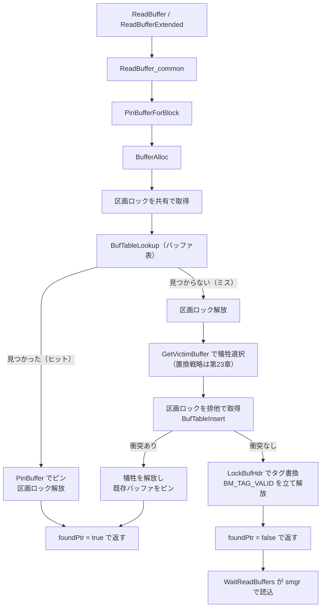

# 第22章 共有バッファとバッファ管理

> **本章で読むソース**
>
> - [`src/backend/storage/buffer/bufmgr.c`](https://github.com/postgres/postgres/blob/REL_18_4/src/backend/storage/buffer/bufmgr.c)
> - [`src/backend/storage/buffer/buf_table.c`](https://github.com/postgres/postgres/blob/REL_18_4/src/backend/storage/buffer/buf_table.c)
> - [`src/include/storage/buf_internals.h`](https://github.com/postgres/postgres/blob/REL_18_4/src/include/storage/buf_internals.h)

## この章の狙い

PostgreSQL は、テーブルやインデックスを固定長のページに区切ってディスクに置く。
バックエンドがそのページを読み書きするたびにディスクへ往復していては、性能が出ない。
そこで、共有メモリ上に確保した一群のページ枠にディスクのページをキャッシュし、何度も触れるページをメモリ上で使い回す。
このキャッシュを**共有バッファ**と呼び、ページ枠ひとつを**バッファ**と呼ぶ。

本章は、バックエンドが「このリレーションのこのブロックがほしい」と要求してから、対応するバッファを手にするまでの中核を読む。
入口は `ReadBuffer` であり、その下で目的ページの検索、不在時の犠牲バッファ選択、ディスクからの読み込みが順に進む。
要求されたページがすでにバッファにある場合を**ヒット**、ない場合を**ミス**と呼ぶ。
ヒット経路をいかに軽くするかが、この層の設計を貫く関心である。

本章を貫く着眼点は、バッファの状態を表す32ビットのアトミックな状態語にある。
参照カウント、利用回数、各種の旗をこの一語に詰め込み、ピンの増減のような頻繁な操作を、ヘッダのスピンロックを取らずにアトミック命令だけで済ませる。
この設計が、ヒット経路から重い同期を取り除いている。

## 前提

第21章でストレージマネージャ（smgr）を扱い、リレーションのフォークとブロック番号からディスク上の位置を解決する仕組みを読んだ。
本章のバッファ管理は、ミス時にこの smgr を呼んでページを読み込む。
共有メモリの確保は第5章、軽量ロック（LWLock）は[第35章](../part08-transactions-concurrency/35-lightweight-locks.md)、スピンロックは[第36章](../part08-transactions-concurrency/36-spinlocks.md)で扱う。
犠牲バッファをどう選ぶか、すなわちクロックスイープによる置換戦略は[第23章](23-buffer-replacement-strategy.md)に送り、本章はその呼び出し口までを読む。

## ReadBuffer という入口

バックエンドがページを要求する最も素直な入口が `ReadBuffer` である。
リレーションのメインフォークから、既定のモードとアクセス戦略でブロックを読む短縮形にすぎない。

[`src/backend/storage/buffer/bufmgr.c` L757-L759](https://github.com/postgres/postgres/blob/REL_18_4/src/backend/storage/buffer/bufmgr.c#L757-L759)

```c
Buffer
ReadBuffer(Relation reln, BlockNumber blockNum)
{
```

フォークやモードを指定したいときは `ReadBufferExtended` を直接呼ぶ。
こちらが実質の入口であり、他セッションの一時テーブルを弾いたあと、共通処理の `ReadBuffer_common` へ橋渡しする。

[`src/backend/storage/buffer/bufmgr.c` L804-L828](https://github.com/postgres/postgres/blob/REL_18_4/src/backend/storage/buffer/bufmgr.c#L804-L828)

```c
inline Buffer
ReadBufferExtended(Relation reln, ForkNumber forkNum, BlockNumber blockNum,
				   ReadBufferMode mode, BufferAccessStrategy strategy)
{
	Buffer		buf;

	/*
	 * Reject attempts to read non-local temporary relations; we would be
	 * likely to get wrong data since we have no visibility into the owning
	 * session's local buffers.
	 */
	if (RELATION_IS_OTHER_TEMP(reln))
		ereport(ERROR,
				(errcode(ERRCODE_FEATURE_NOT_SUPPORTED),
				 errmsg("cannot access temporary tables of other sessions")));

	/*
	 * Read the buffer, and update pgstat counters to reflect a cache hit or
	 * miss.
	 */
	buf = ReadBuffer_common(reln, RelationGetSmgr(reln), 0,
							forkNum, blockNum, mode, strategy);

	return buf;
}
```

返り値の `Buffer` は、共有バッファ配列の添字に1を足した整数である。
ページの中身そのものではなく、どのバッファ枠を確保したかを指す参照にすぎない。
呼び出し側はこの番号を使って、あとからページの内容ロックを取り、ブロックの先頭ポインタを得る。

`ReadBuffer_common` は、要求モードに応じて処理を振り分ける。
ページを新規に末尾へ足す `P_NEW`、ゼロ埋めしてロック付きで返す `RBM_ZERO_AND_LOCK` などの特殊モードを先に捌き、通常の読み込みは `StartReadBuffer` から `WaitReadBuffers` の経路で行う。

[`src/backend/storage/buffer/bufmgr.c` L1239-L1259](https://github.com/postgres/postgres/blob/REL_18_4/src/backend/storage/buffer/bufmgr.c#L1239-L1259)

```c
	/*
	 * Signal that we are going to immediately wait. If we're immediately
	 * waiting, there is no benefit in actually executing the IO
	 * asynchronously, it would just add dispatch overhead.
	 */
	flags = READ_BUFFERS_SYNCHRONOUSLY;
	if (mode == RBM_ZERO_ON_ERROR)
		flags |= READ_BUFFERS_ZERO_ON_ERROR;
	operation.smgr = smgr;
	operation.rel = rel;
	operation.persistence = persistence;
	operation.forknum = forkNum;
	operation.strategy = strategy;
	if (StartReadBuffer(&operation,
						&buffer,
						blockNum,
						flags))
		WaitReadBuffers(&operation);

	return buffer;
}
```

このどちらの経路でも、目的ブロックに対応するバッファを確保してピンを立てる仕事は `PinBufferForBlock` が担う。
そこから共有バッファ用の `BufferAlloc` が呼ばれる。
`StartReadBuffer` が `true` を返したときだけ実際の読み込みが必要で、`WaitReadBuffers` がディスクからページを運び込む。
ヒットのときは `StartReadBuffer` が `false` を返し、読み込みは行われない。

`PinBufferForBlock` は、永続性に応じて確保先を選ぶ。
一時リレーションはバックエンド専用のローカルバッファ（`LocalBufferAlloc`）へ、それ以外は共有バッファの `BufferAlloc` へ振り分ける。

[`src/backend/storage/buffer/bufmgr.c` L1146-L1158](https://github.com/postgres/postgres/blob/REL_18_4/src/backend/storage/buffer/bufmgr.c#L1146-L1158)

```c
	if (persistence == RELPERSISTENCE_TEMP)
	{
		bufHdr = LocalBufferAlloc(smgr, forkNum, blockNum, foundPtr);
		if (*foundPtr)
			pgBufferUsage.local_blks_hit++;
	}
	else
	{
		bufHdr = BufferAlloc(smgr, persistence, forkNum, blockNum,
							 strategy, foundPtr, io_context);
		if (*foundPtr)
			pgBufferUsage.shared_blks_hit++;
	}
```

`foundPtr` が、ヒットしたかどうかを呼び出し側へ返す出力引数である。
ヒットならヒット数を数え、ミスならこのあと読み込みが必要だと伝える。

## バッファ記述子と状態語

共有バッファの一枠ごとに、その素性と状態を記録する構造体が**バッファ記述子**（`BufferDesc`）である。

[`src/include/storage/buf_internals.h` L258-L271](https://github.com/postgres/postgres/blob/REL_18_4/src/include/storage/buf_internals.h#L258-L271)

```c
typedef struct BufferDesc
{
	BufferTag	tag;			/* ID of page contained in buffer */
	int			buf_id;			/* buffer's index number (from 0) */

	/* state of the tag, containing flags, refcount and usagecount */
	pg_atomic_uint32 state;

	int			wait_backend_pgprocno;	/* backend of pin-count waiter */
	int			freeNext;		/* link in freelist chain */

	PgAioWaitRef io_wref;		/* set iff AIO is in progress */
	LWLock		content_lock;	/* to lock access to buffer contents */
} BufferDesc;
```

`tag` は、このバッファが今どのディスクブロックを保持しているかを表す。
表領域、データベース、リレーションファイル、フォーク、ブロック番号の組であり、これだけで書き戻し先が決まる。
`content_lock` はページの内容を読み書きするための軽量ロックであり、記述子の保護とは別の役割を持つ。

中心は `state` である。
これは32ビットのアトミック整数で、三つの情報を一語に詰め込んでいる。

[`src/include/storage/buf_internals.h` L44-L60](https://github.com/postgres/postgres/blob/REL_18_4/src/include/storage/buf_internals.h#L44-L60)

```c
#define BUF_REFCOUNT_BITS 18
#define BUF_USAGECOUNT_BITS 4
#define BUF_FLAG_BITS 10

StaticAssertDecl(BUF_REFCOUNT_BITS + BUF_USAGECOUNT_BITS + BUF_FLAG_BITS == 32,
				 "parts of buffer state space need to equal 32");

#define BUF_REFCOUNT_ONE 1
#define BUF_REFCOUNT_MASK ((1U << BUF_REFCOUNT_BITS) - 1)
#define BUF_USAGECOUNT_MASK (((1U << BUF_USAGECOUNT_BITS) - 1) << (BUF_REFCOUNT_BITS))
#define BUF_USAGECOUNT_ONE (1U << BUF_REFCOUNT_BITS)
#define BUF_USAGECOUNT_SHIFT BUF_REFCOUNT_BITS
#define BUF_FLAG_MASK (((1U << BUF_FLAG_BITS) - 1) << (BUF_REFCOUNT_BITS + BUF_USAGECOUNT_BITS))

/* Get refcount and usagecount from buffer state */
#define BUF_STATE_GET_REFCOUNT(state) ((state) & BUF_REFCOUNT_MASK)
#define BUF_STATE_GET_USAGECOUNT(state) (((state) & BUF_USAGECOUNT_MASK) >> BUF_USAGECOUNT_SHIFT)
```

下位18ビットが**参照カウント**（refcount）で、このバッファをピンしているプロセスの数を表す。
続く4ビットが**利用回数**（usagecount）で、置換戦略がこのバッファをどれだけ最近使ったかを測る。
最上位10ビットが各種の旗である。

旗は上位ビットに割り当てられている。

[`src/include/storage/buf_internals.h` L68-L78](https://github.com/postgres/postgres/blob/REL_18_4/src/include/storage/buf_internals.h#L68-L78)

```c
#define BM_LOCKED				(1U << 22)	/* buffer header is locked */
#define BM_DIRTY				(1U << 23)	/* data needs writing */
#define BM_VALID				(1U << 24)	/* data is valid */
#define BM_TAG_VALID			(1U << 25)	/* tag is assigned */
#define BM_IO_IN_PROGRESS		(1U << 26)	/* read or write in progress */
#define BM_IO_ERROR				(1U << 27)	/* previous I/O failed */
#define BM_JUST_DIRTIED			(1U << 28)	/* dirtied since write started */
#define BM_PIN_COUNT_WAITER		(1U << 29)	/* have waiter for sole pin */
#define BM_CHECKPOINT_NEEDED	(1U << 30)	/* must write for checkpoint */
#define BM_PERMANENT			(1U << 31)	/* permanent buffer (not unlogged,
											 * or init fork) */
```

`BM_VALID` はバッファの内容が有効であることを、`BM_TAG_VALID` はタグが割り当てられ、バッファ表に対応する登録があることを示す。
`BM_DIRTY` は内容が変更され、ディスクへの書き戻しが必要なことを示す。
`BM_IO_IN_PROGRESS` は読み込みか書き出しが進行中であることを示し、複数のプロセスが同じバッファに対して同時に入出力を始めるのを防ぐ。
そして `BM_LOCKED` が、バッファヘッダのスピンロックを表す旗である。

なぜ三つの情報を一語に詰めるのか。
記述子のコメントが、その狙いを述べている。

[`src/include/storage/buf_internals.h` L214-L230](https://github.com/postgres/postgres/blob/REL_18_4/src/include/storage/buf_internals.h#L214-L230)

```c
 * Note: Buffer header lock (BM_LOCKED flag) must be held to examine or change
 * tag, state or wait_backend_pgprocno fields.  In general, buffer header lock
 * is a spinlock which is combined with flags, refcount and usagecount into
 * single atomic variable.  This layout allow us to do some operations in a
 * single atomic operation, without actually acquiring and releasing spinlock;
 * for instance, increase or decrease refcount.  buf_id field never changes
 * after initialization, so does not need locking.  freeNext is protected by
 * the buffer_strategy_lock not buffer header lock.  The LWLock can take care
 * of itself.  The buffer header lock is *not* used to control access to the
 * data in the buffer!
 *
 * It's assumed that nobody changes the state field while buffer header lock
 * is held.  Thus buffer header lock holder can do complex updates of the
 * state variable in single write, simultaneously with lock release (cleaning
 * BM_LOCKED flag).  On the other hand, updating of state without holding
 * buffer header lock is restricted to CAS, which ensures that BM_LOCKED flag
 * is not set.  Atomic increment/decrement, OR/AND etc. are not allowed.
```

参照カウントと旗を同じ語に同居させたので、参照カウントを1増やす操作が、その語へのアトミックな比較交換（CAS）一回で済む。
スピンロックを取って解いてを繰り返さずに、ピンの増減という最も頻繁な操作をこなせる。
ロックを取らずに状態語を更新するときは CAS に限るという制約が、ここで言語化されている。
ヘッダロックを保持していない更新者は、CAS によって `BM_LOCKED` が立っていないことを確かめながら書き換える。
アトミックな加算や論理和を直に使ってはならない。
ロック保持者がいる間に別の経路が語を書き換えると、保持者の「ロック解放と同時に状態を書く」一括更新と衝突するからである。

## バッファ表によるページ検索

要求されたタグを持つバッファが共有バッファ内にあるかを引くのが**バッファ表**である。
共有メモリ上のハッシュ表で、タグから対応するバッファ番号を返す。

検索の前に、まずタグのハッシュ値を計算する。
このハッシュ値は二つの用途を持つので、一度だけ計算して使い回す。

[`src/backend/storage/buffer/buf_table.c` L77-L81](https://github.com/postgres/postgres/blob/REL_18_4/src/backend/storage/buffer/buf_table.c#L77-L81)

```c
uint32
BufTableHashCode(BufferTag *tagPtr)
{
	return get_hash_value(SharedBufHash, tagPtr);
}
```

検索本体の `BufTableLookup` は、ハッシュ値とタグを渡して登録を引き、見つからなければ -1 を返す。

[`src/backend/storage/buffer/buf_table.c` L89-L105](https://github.com/postgres/postgres/blob/REL_18_4/src/backend/storage/buffer/buf_table.c#L89-L105)

```c
int
BufTableLookup(BufferTag *tagPtr, uint32 hashcode)
{
	BufferLookupEnt *result;

	result = (BufferLookupEnt *)
		hash_search_with_hash_value(SharedBufHash,
									tagPtr,
									hashcode,
									HASH_FIND,
									NULL);

	if (!result)
		return -1;

	return result->id;
}
```

新規に登録するのが `BufTableInsert` である。
すでに同じタグの登録があれば、何もせずにその既存バッファ番号を返す。
これは、二つのプロセスが同じミスを同時に処理し、別々の犠牲バッファに同じページを入れようと競ったときの衝突検出に使う。

[`src/backend/storage/buffer/buf_table.c` L117-L139](https://github.com/postgres/postgres/blob/REL_18_4/src/backend/storage/buffer/buf_table.c#L117-L139)

```c
int
BufTableInsert(BufferTag *tagPtr, uint32 hashcode, int buf_id)
{
	BufferLookupEnt *result;
	bool		found;

	Assert(buf_id >= 0);		/* -1 is reserved for not-in-table */
	Assert(tagPtr->blockNum != P_NEW);	/* invalid tag */

	result = (BufferLookupEnt *)
		hash_search_with_hash_value(SharedBufHash,
									tagPtr,
									hashcode,
									HASH_ENTER,
									&found);

	if (found)					/* found something already in the table */
		return result->id;

	result->id = buf_id;

	return -1;
}
```

このハッシュ表全体を一つのロックで守ると、すべてのページ検索が直列化してしまう。
それを避けるため、バッファ表はハッシュ値で128の区画に分割し、区画ごとに別々の軽量ロックを割り当てる。

[`src/include/storage/buf_internals.h` L186-L203](https://github.com/postgres/postgres/blob/REL_18_4/src/include/storage/buf_internals.h#L186-L203)

```c
/*
 * The shared buffer mapping table is partitioned to reduce contention.
 * To determine which partition lock a given tag requires, compute the tag's
 * hash code with BufTableHashCode(), then apply BufMappingPartitionLock().
 * NB: NUM_BUFFER_PARTITIONS must be a power of 2!
 */
static inline uint32
BufTableHashPartition(uint32 hashcode)
{
	return hashcode % NUM_BUFFER_PARTITIONS;
}

static inline LWLock *
BufMappingPartitionLock(uint32 hashcode)
{
	return &MainLWLockArray[BUFFER_MAPPING_LWLOCK_OFFSET +
							BufTableHashPartition(hashcode)].lock;
}
```

別々のページに触れるプロセスは、ハッシュ値が異なれば別の区画ロックを取るため、互いに待たずに並行して検索できる。
`BufTableLookup` は対応する区画ロックを共有モードで保持していればよく、`BufTableInsert` は排他モードを要する。

## BufferAlloc: 検索、犠牲選択、登録

ここまでの部品を組み立てるのが `BufferAlloc` である。
共有バッファ内の検索を担い、なければ犠牲バッファを選んで古いページを追い出し、新しいタグを登録する。
ただしページの読み込みそのものは行わない。

入口で、要求ブロックのタグを作り、ハッシュ値と区画ロックを決める。
そして区画ロックを共有モードで取り、`BufTableLookup` で検索する。

[`src/backend/storage/buffer/bufmgr.c` L2017-L2057](https://github.com/postgres/postgres/blob/REL_18_4/src/backend/storage/buffer/bufmgr.c#L2017-L2057)

```c
	/* create a tag so we can lookup the buffer */
	InitBufferTag(&newTag, &smgr->smgr_rlocator.locator, forkNum, blockNum);

	/* determine its hash code and partition lock ID */
	newHash = BufTableHashCode(&newTag);
	newPartitionLock = BufMappingPartitionLock(newHash);

	/* see if the block is in the buffer pool already */
	LWLockAcquire(newPartitionLock, LW_SHARED);
	existing_buf_id = BufTableLookup(&newTag, newHash);
	if (existing_buf_id >= 0)
	{
		BufferDesc *buf;
		bool		valid;

		/*
		 * Found it.  Now, pin the buffer so no one can steal it from the
		 * buffer pool, and check to see if the correct data has been loaded
		 * into the buffer.
		 */
		buf = GetBufferDescriptor(existing_buf_id);

		valid = PinBuffer(buf, strategy);

		/* Can release the mapping lock as soon as we've pinned it */
		LWLockRelease(newPartitionLock);

		*foundPtr = true;

		if (!valid)
		{
			/*
			 * We can only get here if (a) someone else is still reading in
			 * the page, (b) a previous read attempt failed, or (c) someone
			 * called StartReadBuffers() but not yet WaitReadBuffers().
			 */
			*foundPtr = false;
		}

		return buf;
	}
```

これがヒット経路である。
バッファが見つかれば、ただちに `PinBuffer` でピンを立てる。
ピンを立てるとそのバッファは置換の対象から外れるため、区画ロックはピン直後に手放してよい。
ピンしてからロックを解く順序が肝心で、ロックを先に解いてからピンしようとすると、その隙に別のプロセスがこのバッファを犠牲に選んで中身を入れ替えるおそれがある。
`PinBuffer` の返り値 `valid` は内容が有効かを伝え、まだ読み込み中などで無効なら、呼び出し側に追加の処理が要ることを `foundPtr` で知らせる。

検索が外れた、すなわちミスのときは、区画ロックをいったん手放してから犠牲バッファを取りに行く。

[`src/backend/storage/buffer/bufmgr.c` L2059-L2079](https://github.com/postgres/postgres/blob/REL_18_4/src/backend/storage/buffer/bufmgr.c#L2059-L2079)

```c
	/*
	 * Didn't find it in the buffer pool.  We'll have to initialize a new
	 * buffer.  Remember to unlock the mapping lock while doing the work.
	 */
	LWLockRelease(newPartitionLock);

	/*
	 * Acquire a victim buffer. Somebody else might try to do the same, we
	 * don't hold any conflicting locks. If so we'll have to undo our work
	 * later.
	 */
	victim_buffer = GetVictimBuffer(strategy, io_context);
	victim_buf_hdr = GetBufferDescriptor(victim_buffer - 1);

	/*
	 * Try to make a hashtable entry for the buffer under its new tag. If
	 * somebody else inserted another buffer for the tag, we'll release the
	 * victim buffer we acquired and use the already inserted one.
	 */
	LWLockAcquire(newPartitionLock, LW_EXCLUSIVE);
	existing_buf_id = BufTableInsert(&newTag, newHash, victim_buf_hdr->buf_id);
```

`GetVictimBuffer` が、追い出してよいバッファを一つ選んで返す。
どの基準で選ぶか、ダーティなら書き戻すかといった置換戦略の中身は[第23章](23-buffer-replacement-strategy.md)で読む。
ここでは、犠牲を確保したあとに区画ロックを排他モードで取り直し、新しいタグで `BufTableInsert` を試みる、という流れだけを押さえる。

犠牲を選んでいる間ロックを手放しているので、その隙に別のプロセスが同じページを先に登録してしまう競合がありうる。
`BufTableInsert` がそれを検出する。
他のプロセスが先に登録していれば、こちらの犠牲バッファは不要になるので解放し、相手の入れたバッファをヒット時と同じように扱う。

[`src/backend/storage/buffer/bufmgr.c` L2080-L2125](https://github.com/postgres/postgres/blob/REL_18_4/src/backend/storage/buffer/bufmgr.c#L2080-L2125)

```c
	if (existing_buf_id >= 0)
	{
		BufferDesc *existing_buf_hdr;
		bool		valid;

		/*
		 * Got a collision. Someone has already done what we were about to do.
		 * We'll just handle this as if it were found in the buffer pool in
		 * the first place.  First, give up the buffer we were planning to
		 * use.
		 *
		 * We could do this after releasing the partition lock, but then we'd
		 * have to call ResourceOwnerEnlarge() & ReservePrivateRefCountEntry()
		 * before acquiring the lock, for the rare case of such a collision.
		 */
		UnpinBuffer(victim_buf_hdr);

		/*
		 * The victim buffer we acquired previously is clean and unused, let
		 * it be found again quickly
		 */
		StrategyFreeBuffer(victim_buf_hdr);

		/* remaining code should match code at top of routine */

		existing_buf_hdr = GetBufferDescriptor(existing_buf_id);

		valid = PinBuffer(existing_buf_hdr, strategy);

		/* Can release the mapping lock as soon as we've pinned it */
		LWLockRelease(newPartitionLock);

		*foundPtr = true;

		if (!valid)
		{
			/*
			 * We can only get here if (a) someone else is still reading in
			 * the page, (b) a previous read attempt failed, or (c) someone
			 * called StartReadBuffers() but not yet WaitReadBuffers().
			 */
			*foundPtr = false;
		}

		return existing_buf_hdr;
	}
```

衝突がなければ、犠牲バッファを新しいページの枠として正式に確定する。
タグを書き換えるためにヘッダのスピンロックを取り、状態語を書き換えてから解く。

[`src/backend/storage/buffer/bufmgr.c` L2127-L2158](https://github.com/postgres/postgres/blob/REL_18_4/src/backend/storage/buffer/bufmgr.c#L2127-L2158)

```c
	/*
	 * Need to lock the buffer header too in order to change its tag.
	 */
	victim_buf_state = LockBufHdr(victim_buf_hdr);

	/* some sanity checks while we hold the buffer header lock */
	Assert(BUF_STATE_GET_REFCOUNT(victim_buf_state) == 1);
	Assert(!(victim_buf_state & (BM_TAG_VALID | BM_VALID | BM_DIRTY | BM_IO_IN_PROGRESS)));

	victim_buf_hdr->tag = newTag;

	/*
	 * Make sure BM_PERMANENT is set for buffers that must be written at every
	 * checkpoint.  Unlogged buffers only need to be written at shutdown
	 * checkpoints, except for their "init" forks, which need to be treated
	 * just like permanent relations.
	 */
	victim_buf_state |= BM_TAG_VALID | BUF_USAGECOUNT_ONE;
	if (relpersistence == RELPERSISTENCE_PERMANENT || forkNum == INIT_FORKNUM)
		victim_buf_state |= BM_PERMANENT;

	UnlockBufHdr(victim_buf_hdr, victim_buf_state);

	LWLockRelease(newPartitionLock);

	/*
	 * Buffer contents are currently invalid.
	 */
	*foundPtr = false;

	return victim_buf_hdr;
}
```

タグを書き、`BM_TAG_VALID` を立て、利用回数を1にする。
この時点で内容はまだ読み込まれていないので `BM_VALID` は立てず、`foundPtr` を `false` にして「これから読み込みが要る」と返す。
実際のディスク読み込みは、`BufferAlloc` の外、`WaitReadBuffers` が smgr 経由で行う。

## PinBuffer: ロックなしのピン

`PinBuffer` は、バッファを置換の対象から外す**ピン**を立てる。
頻繁に呼ばれるため、可能な限りスピンロックを避け、状態語への CAS だけで参照カウントを増やす。

[`src/backend/storage/buffer/bufmgr.c` L3043-L3068](https://github.com/postgres/postgres/blob/REL_18_4/src/backend/storage/buffer/bufmgr.c#L3043-L3068)

```c
/*
 * PinBuffer -- make buffer unavailable for replacement.
 *
 * For the default access strategy, the buffer's usage_count is incremented
 * when we first pin it; for other strategies we just make sure the usage_count
 * isn't zero.  (The idea of the latter is that we don't want synchronized
 * heap scans to inflate the count, but we need it to not be zero to discourage
 * other backends from stealing buffers from our ring.  As long as we cycle
 * through the ring faster than the global clock-sweep cycles, buffers in
 * our ring won't be chosen as victims for replacement by other backends.)
 *
 * This should be applied only to shared buffers, never local ones.
 *
 * Since buffers are pinned/unpinned very frequently, pin buffers without
 * taking the buffer header lock; instead update the state variable in loop of
 * CAS operations. Hopefully it's just a single CAS.
 *
 * Note that ResourceOwnerEnlarge() and ReservePrivateRefCountEntry()
 * must have been done already.
 *
 * Returns true if buffer is BM_VALID, else false.  This provision allows
 * some callers to avoid an extra spinlock cycle.
 */
static bool
PinBuffer(BufferDesc *buf, BufferAccessStrategy strategy)
{
```

このバックエンドがまだこのバッファをピンしていない場合、状態語を CAS ループで更新する。

[`src/backend/storage/buffer/bufmgr.c` L3085-L3127](https://github.com/postgres/postgres/blob/REL_18_4/src/backend/storage/buffer/bufmgr.c#L3085-L3127)

```c
		old_buf_state = pg_atomic_read_u32(&buf->state);
		for (;;)
		{
			if (old_buf_state & BM_LOCKED)
				old_buf_state = WaitBufHdrUnlocked(buf);

			buf_state = old_buf_state;

			/* increase refcount */
			buf_state += BUF_REFCOUNT_ONE;

			if (strategy == NULL)
			{
				/* Default case: increase usagecount unless already max. */
				if (BUF_STATE_GET_USAGECOUNT(buf_state) < BM_MAX_USAGE_COUNT)
					buf_state += BUF_USAGECOUNT_ONE;
			}
			else
			{
				/*
				 * Ring buffers shouldn't evict others from pool.  Thus we
				 * don't make usagecount more than 1.
				 */
				if (BUF_STATE_GET_USAGECOUNT(buf_state) == 0)
					buf_state += BUF_USAGECOUNT_ONE;
			}

			if (pg_atomic_compare_exchange_u32(&buf->state, &old_buf_state,
											   buf_state))
			{
				result = (buf_state & BM_VALID) != 0;

				/*
				 * Assume that we acquired a buffer pin for the purposes of
				 * Valgrind buffer client checks (even in !result case) to
				 * keep things simple.  Buffers that are unsafe to access are
				 * not generally guaranteed to be marked undefined or
				 * non-accessible in any case.
				 */
				VALGRIND_MAKE_MEM_DEFINED(BufHdrGetBlock(buf), BLCKSZ);
				break;
			}
		}
```

ループの中で、参照カウントを1増やし、戦略に応じて利用回数を調整した新しい状態語を作る。
それを CAS で書き込み、成功すれば抜ける。
誰かがヘッダロックを保持していて `BM_LOCKED` が立っているときだけ、`WaitBufHdrUnlocked` でロックが解けるのを待ってから読み直す。
ロックが立っていない通常の場合は、CAS が一回成功するだけでピンが立つ。
競合がなければ、ピンというありふれた操作からスピンロックの取得と解放がまるごと消える。
これが本章の中心となる最適化である。

## LockBufHdr: バッファヘッダのスピンロック

タグの書き換えやダーティ旗の操作のように、状態語の複数フィールドを一括で変えたいときは、CAS では足りずヘッダのスピンロックを取る。
それが `LockBufHdr` である。

[`src/backend/storage/buffer/bufmgr.c` L6248-L6272](https://github.com/postgres/postgres/blob/REL_18_4/src/backend/storage/buffer/bufmgr.c#L6248-L6272)

```c
/*
 * Lock buffer header - set BM_LOCKED in buffer state.
 */
uint32
LockBufHdr(BufferDesc *desc)
{
	SpinDelayStatus delayStatus;
	uint32		old_buf_state;

	Assert(!BufferIsLocal(BufferDescriptorGetBuffer(desc)));

	init_local_spin_delay(&delayStatus);

	while (true)
	{
		/* set BM_LOCKED flag */
		old_buf_state = pg_atomic_fetch_or_u32(&desc->state, BM_LOCKED);
		/* if it wasn't set before we're OK */
		if (!(old_buf_state & BM_LOCKED))
			break;
		perform_spin_delay(&delayStatus);
	}
	finish_spin_delay(&delayStatus);
	return old_buf_state | BM_LOCKED;
}
```

`LockBufHdr` は、状態語に `BM_LOCKED` をアトミックな論理和で立てる。
立てる前にすでに立っていれば、別の誰かが保持しているので、`perform_spin_delay` で短く待って取り直す。
成功すると、`BM_LOCKED` を立てた状態語を返す。
保持者はこの返り値を手元で書き換え、解放時に一括で書き戻す。

解放側の `UnlockBufHdr` は、保持者が手元で組み立てた状態語から `BM_LOCKED` を落として書き込むだけである。

[`src/include/storage/buf_internals.h` L376-L381](https://github.com/postgres/postgres/blob/REL_18_4/src/include/storage/buf_internals.h#L376-L381)

```c
static inline void
UnlockBufHdr(BufferDesc *desc, uint32 buf_state)
{
	pg_write_barrier();
	pg_atomic_write_u32(&desc->state, buf_state & (~BM_LOCKED));
}
```

状態の更新とロック解放が、一回の書き込みにまとまる。
ロックを保持している間に他の経路が状態語を書き換えないという前提があるので、保持者は手元で自由に状態を組み立て、最後に `BM_LOCKED` を落とした値を書くだけで、更新と解放を同時に済ませられる。

このスピンロックは、ごく短い臨界区間を守るためだけの道具である。
保持したまま smgr の読み書きやシステムコールへ降りることはなく、数命令で抜ける。
スピンロックがこの「保持はごく短い」という前提に依存していること、その前提がカーネルのスケジューリングに支えられていることは、[付録A](../appendix/A01-preempt-none-and-spinlocks.md)で扱う。
`FlushBuffer` が書き戻しの直前に `LockBufHdr` を取り、LSN を読んでダーティ旗を落としたら即座に解放するのも、この前提を守るためである。

## FlushBuffer: 書き戻しと WAL の順序

ダーティなバッファをディスクへ書き出すのが `FlushBuffer` である。
ここで、WAL との順序という重要な規則が現れる。

まず `StartBufferIO` で入出力の権利を取る。
誰かが先に書き出していれば、ここで `false` が返り、何もせずに戻る。
そのあとヘッダロックを短く取り、書き戻し対象ページの LSN を読み、`BM_JUST_DIRTIED` を落としてからロックを解く。

[`src/backend/storage/buffer/bufmgr.c` L4318-L4348](https://github.com/postgres/postgres/blob/REL_18_4/src/backend/storage/buffer/bufmgr.c#L4318-L4348)

```c
	buf_state = LockBufHdr(buf);

	/*
	 * Run PageGetLSN while holding header lock, since we don't have the
	 * buffer locked exclusively in all cases.
	 */
	recptr = BufferGetLSN(buf);

	/* To check if block content changes while flushing. - vadim 01/17/97 */
	buf_state &= ~BM_JUST_DIRTIED;
	UnlockBufHdr(buf, buf_state);

	/*
	 * Force XLOG flush up to buffer's LSN.  This implements the basic WAL
	 * rule that log updates must hit disk before any of the data-file changes
	 * they describe do.
	 *
	 * However, this rule does not apply to unlogged relations, which will be
	 * lost after a crash anyway.  Most unlogged relation pages do not bear
	 * LSNs since we never emit WAL records for them, and therefore flushing
	 * up through the buffer LSN would be useless, but harmless.  However,
	 * GiST indexes use LSNs internally to track page-splits, and therefore
	 * unlogged GiST pages bear "fake" LSNs generated by
	 * GetFakeLSNForUnloggedRel.  It is unlikely but possible that the fake
	 * LSN counter could advance past the WAL insertion point; and if it did
	 * happen, attempting to flush WAL through that location would fail, with
	 * disastrous system-wide consequences.  To make sure that can't happen,
	 * skip the flush if the buffer isn't permanent.
	 */
	if (buf_state & BM_PERMANENT)
		XLogFlush(recptr);
```

`XLogFlush(recptr)` が、このページを変更した WAL レコードがディスクに届くまで待つ。
これが先行書き込みログ（WAL）の基本規則である。
データファイルの変更をディスクへ書く前に、その変更を記述する WAL を先にディスクへ書く。
この順序を守れば、データファイルの書き込み中にクラッシュしても、ディスク上の WAL からページの変更を再現できる。
永続バッファ（`BM_PERMANENT`）でないときは、クラッシュ後にどのみち失われるので、この WAL フラッシュを飛ばす。

WAL を書き出してから、ようやくページをディスクへ書く。

[`src/backend/storage/buffer/bufmgr.c` L4350-L4374](https://github.com/postgres/postgres/blob/REL_18_4/src/backend/storage/buffer/bufmgr.c#L4350-L4374)

```c
	/*
	 * Now it's safe to write the buffer to disk. Note that no one else should
	 * have been able to write it, while we were busy with log flushing,
	 * because we got the exclusive right to perform I/O by setting the
	 * BM_IO_IN_PROGRESS bit.
	 */
	bufBlock = BufHdrGetBlock(buf);

	/*
	 * Update page checksum if desired.  Since we have only shared lock on the
	 * buffer, other processes might be updating hint bits in it, so we must
	 * copy the page to private storage if we do checksumming.
	 */
	bufToWrite = PageSetChecksumCopy((Page) bufBlock, buf->tag.blockNum);

	io_start = pgstat_prepare_io_time(track_io_timing);

	/*
	 * bufToWrite is either the shared buffer or a copy, as appropriate.
	 */
	smgrwrite(reln,
			  BufTagGetForkNum(&buf->tag),
			  buf->tag.blockNum,
			  bufToWrite,
			  false);
```

`smgrwrite` はカーネルへページを渡すだけで、ディスクへの実際の書き込みはカーネルの都合で後から起きる。
ここで PostgreSQL が `fsync` を待たないのは、チェックポイントの段でまとめて永続化するからである。
WAL とチェックポイントの詳しい仕組みは[第38章](../part09-wal-recovery/38-wal.md)以降で扱う。
書き出しが済むと、`TerminateBufferIO` が `BM_DIRTY` を落とし、`BM_IO_IN_PROGRESS` の状態を終える。

## ヒット経路をたどる

入口から犠牲選択までの流れを、ヒットとミスに分けて図に示す。



ヒット経路（F から H）は、区画ロックを共有で一瞬取り、`PinBuffer` の CAS 一回でピンを立て、ロックを解いて返す。
スピンロックも犠牲選択もディスク入出力もない。
最も頻繁に通るこの道を最も軽くするために、状態語をアトミックに扱う設計が効いている。
ミス経路（F から O）でだけ、犠牲選択とディスク読み込みという重い処理が起きる。

## 高速化の工夫

本章の中心は、バッファの状態を一つのアトミックな32ビット語に畳み込んだ設計である。

参照カウント、利用回数、各種の旗を別々の語に置けば、ピンを立てるだけでも参照カウント語の更新と旗の確認で複数の同期が要る。
PostgreSQL はこれらを一語にまとめ、ピンの増減を CAS 一回で済むようにした。
`PinBuffer` は、誰もヘッダロックを保持していない通常の場合、状態語への比較交換が一度成功するだけでピンを立て、スピンロックの取得と解放をまるごと省く。
共有バッファへのアクセスで最も多いのがピンの増減であり、そこから重い同期を取り除けるので、多数のバックエンドが同じバッファプールを共有しても競合が小さくなる。

スピンロックが本当に要る場面、すなわち状態語の複数フィールドを一括で書き換える場面では `LockBufHdr` を取るが、その臨界区間は数命令で、保持中にシステムコールへ降りない。
保持者は手元で状態語を組み立て、`UnlockBufHdr` で `BM_LOCKED` を落とした値を一度書くだけで、更新とロック解放を同時に終える。
この「短く持って一括で書く」やり方が、スピンロックの保持時間を最小に保つ。

バッファ表の128区画分割も、同じ並行性の関心から来る。
別々のページに触れるプロセスは別の区画ロックを取るため、検索どうしが直列化しない。

## まとめ

バックエンドは `ReadBuffer` でページを要求し、`ReadBuffer_common` から `PinBufferForBlock` を経て、共有バッファでは `BufferAlloc` がバッファを確保する。
`BufferAlloc` はバッファ表（区画ごとの軽量ロックで守られたハッシュ表）を `BufTableLookup` で引き、見つかればヒットとしてピンを立てて返す。
見つからなければ `GetVictimBuffer` で犠牲バッファを選び、`BufTableInsert` でタグを登録し、`LockBufHdr` でタグを書き換えてから、読み込みが必要だと返す。
実際のディスク読み込みは `WaitReadBuffers` が smgr 経由で行う。

各バッファの素性と状態は `BufferDesc` が持ち、その中心が32ビットのアトミックな状態語である。
参照カウント、利用回数、旗を一語に畳み込んだので、ピンの増減のような頻繁な操作を、ヘッダのスピンロックを取らずに CAS だけでこなせる。
この設計が、ヒット経路から重い同期を取り除く本章の最適化である。
状態語の複数フィールドを一括で書き換えるときだけ `LockBufHdr` のスピンロックを取り、その保持はごく短い。

ダーティなバッファの書き戻しは `FlushBuffer` が担い、ページをディスクへ書く前に、それを記述する WAL を `XLogFlush` で先にディスクへ送る。
この先行書き込みログの順序が、クラッシュ後にデータファイルを WAL から復元できる根拠となる。

## 関連する章

- [第21章 ストレージマネージャ](21-storage-manager.md)：ミス時にページを読み書きする smgr の実装を扱う。
- [第23章 バッファ置換戦略とフリーリスト](23-buffer-replacement-strategy.md)：`GetVictimBuffer` が犠牲バッファをどう選ぶか、クロックスイープとフリーリストを扱う。
- [第24章 ページとタプルのレイアウト](24-page-and-tuple-layout.md)：バッファが保持するページの内部構造を扱う。
- [第35章 軽量ロック（LWLock）](../part08-transactions-concurrency/35-lightweight-locks.md)：バッファ表の区画ロックやページの内容ロックに使う LWLock の実装を扱う。
- [第36章 スピンロック](../part08-transactions-concurrency/36-spinlocks.md)：`LockBufHdr` が使うスピンロックの実装を扱う。
- [第38章 WAL の仕組み](../part09-wal-recovery/38-wal.md)：`FlushBuffer` が守る先行書き込みログの規則と `XLogFlush` を扱う。
- [付録A Linux カーネルの `PREEMPT_NONE` 廃止とスピンロックの性能問題](../appendix/A01-preempt-none-and-spinlocks.md)：`LockBufHdr` のようなスピンロックが「保持はごく短い」前提に依存することを扱う。
