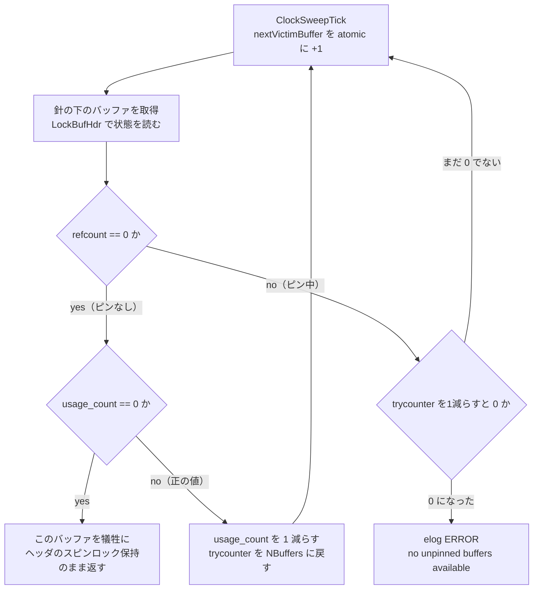

# 第23章 バッファ置換戦略とフリーリスト

> **本章で読むソース**
>
> - [`src/backend/storage/buffer/freelist.c`](https://github.com/postgres/postgres/blob/REL_18_4/src/backend/storage/buffer/freelist.c)

## この章の狙い

第22章で、共有バッファの各スロットを `BufferDesc` が管理し、ディスクのブロックを読み込むときは `BufferAlloc` が空きスロットを1つ確保する流れを読んだ。
その「空きスロットを1つ確保する」要求の終着点が、本章の主題である置換戦略である。
共有バッファはほぼ常に埋まっているので、新しいブロックを載せるには、すでに載っているどれかを追い出さなければならない。
どのバッファを追い出すかを決めるのが `freelist.c` であり、その中心が `StrategyGetBuffer` である。

`StrategyGetBuffer` は犠牲となるバッファを2段階で選ぶ。
まず未使用バッファを並べた**フリーリスト**から1つ取れるなら、それを返す。
フリーリストが空なら、**クロックスイープ**と呼ぶ近似 LRU で、使われていないバッファを1つ選んで犠牲にする。

加えて本章では、逐次スキャンや VACUUM のような大量読み書きが共有バッファ全体を追い出してしまわないよう、小さな環を回す**リング戦略**（`BufferAccessStrategy`）を読む。
最後に、グローバルなロックを避けながら近似 LRU を実現するクロックスイープの工夫を、本章の最適化として機構レベルで説明する。

## 前提

第22章で共有バッファと `BufferDesc`、バッファヘッダのスピンロック（`LockBufHdr`）、`usage_count` と参照カウント `refcount` を含む `buf_state` の仕組みを読んだ。
本章はその上に立ち、追い出すバッファを選ぶ層だけを扱う。
選ばれたバッファを実際にフラッシュして差し替える処理は `BufferAlloc` 側の仕事であり、本章では境界の手前までを読む。

`StrategyGetBuffer` が返すのは「これを使ってよい」という1つの `BufferDesc` であり、呼び出し側がそのバッファをピンする前に他者が割り込めないよう、バッファヘッダのスピンロックを保持したまま返す。
この約束が、犠牲選びの各経路に共通する制約になる。

## 共有状態 `BufferStrategyControl`

置換戦略の共有状態は、共有メモリに置かれた `BufferStrategyControl` 構造体1つにまとまっている。
クロックスイープの針 `nextVictimBuffer`、フリーリストの先頭と末尾、そしてこれらを守るスピンロック `buffer_strategy_lock` が、ここに同居する。

[`src/backend/storage/buffer/freelist.c` L30-L62](https://github.com/postgres/postgres/blob/REL_18_4/src/backend/storage/buffer/freelist.c#L30-L62)

```c
typedef struct
{
	/* Spinlock: protects the values below */
	slock_t		buffer_strategy_lock;

	/*
	 * Clock sweep hand: index of next buffer to consider grabbing. Note that
	 * this isn't a concrete buffer - we only ever increase the value. So, to
	 * get an actual buffer, it needs to be used modulo NBuffers.
	 */
	pg_atomic_uint32 nextVictimBuffer;

	int			firstFreeBuffer;	/* Head of list of unused buffers */
	int			lastFreeBuffer; /* Tail of list of unused buffers */

	/*
	 * NOTE: lastFreeBuffer is undefined when firstFreeBuffer is -1 (that is,
	 * when the list is empty)
	 */

	/*
	 * Statistics.  These counters should be wide enough that they can't
	 * overflow during a single bgwriter cycle.
	 */
	uint32		completePasses; /* Complete cycles of the clock sweep */
	pg_atomic_uint32 numBufferAllocs;	/* Buffers allocated since last reset */

	/*
	 * Bgworker process to be notified upon activity or -1 if none. See
	 * StrategyNotifyBgWriter.
	 */
	int			bgwprocno;
} BufferStrategyControl;
```

針 `nextVictimBuffer` は `pg_atomic_uint32` であり、後述するクロックスイープではスピンロックを取らずにアトミック命令だけで前へ進める。
一方、フリーリストの連結（`firstFreeBuffer` と各バッファの `freeNext`）と統計の `completePasses` は、`buffer_strategy_lock` の保護下で更新する。
針だけをロックの外に出した点が、本章の最適化の核になる。

## フリーリストの正体

フリーリストは、未使用のバッファを連結したリストである。
ただし連結は配列やポインタの別構造ではなく、各 `BufferDesc` が持つ `freeNext` フィールドで作る片方向リストとして表される。
リストに載っていないバッファの `freeNext` は `FREENEXT_NOT_IN_LIST` という番兵値を持つ。

バッファをフリーリストへ戻すのは `StrategyFreeBuffer` である。
リレーションを削除したときなど、内容を捨ててよいバッファがここへ返る。

[`src/backend/storage/buffer/freelist.c` L362-L380](https://github.com/postgres/postgres/blob/REL_18_4/src/backend/storage/buffer/freelist.c#L362-L380)

```c
void
StrategyFreeBuffer(BufferDesc *buf)
{
	SpinLockAcquire(&StrategyControl->buffer_strategy_lock);

	/*
	 * It is possible that we are told to put something in the freelist that
	 * is already in it; don't screw up the list if so.
	 */
	if (buf->freeNext == FREENEXT_NOT_IN_LIST)
	{
		buf->freeNext = StrategyControl->firstFreeBuffer;
		if (buf->freeNext < 0)
			StrategyControl->lastFreeBuffer = buf->buf_id;
		StrategyControl->firstFreeBuffer = buf->buf_id;
	}

	SpinLockRelease(&StrategyControl->buffer_strategy_lock);
}
```

`freeNext` が `FREENEXT_NOT_IN_LIST` のときだけ先頭へ挿入する条件で、同じバッファを二重にリストへ入れる事故を防いでいる。
このフィールドの更新は `buffer_strategy_lock` で守られており、個々のバッファヘッダのスピンロックとは別系統のロックである点に注意する。

通常運転では、いったん埋まった共有バッファがフリーリストへ戻ることはほとんどない。
そのため定常状態ではフリーリストは空になり、犠牲選びは次のクロックスイープが担う。

## `StrategyGetBuffer`：フリーリスト優先、なければクロックスイープ

`StrategyGetBuffer` は犠牲バッファを選ぶ入口である。
冒頭のコメントが、満たすべき唯一の硬い要件と、戻すときの約束を述べている。

[`src/backend/storage/buffer/freelist.c` L183-L203](https://github.com/postgres/postgres/blob/REL_18_4/src/backend/storage/buffer/freelist.c#L183-L203)

```c
/*
 * StrategyGetBuffer
 *
 *	Called by the bufmgr to get the next candidate buffer to use in
 *	BufferAlloc(). The only hard requirement BufferAlloc() has is that
 *	the selected buffer must not currently be pinned by anyone.
 *
 *	strategy is a BufferAccessStrategy object, or NULL for default strategy.
 *
 *	To ensure that no one else can pin the buffer before we do, we must
 *	return the buffer with the buffer header spinlock still held.
 */
BufferDesc *
StrategyGetBuffer(BufferAccessStrategy strategy, uint32 *buf_state, bool *from_ring)
{
	BufferDesc *buf;
	int			bgwprocno;
	int			trycounter;
	uint32		local_buf_state;	/* to avoid repeated (de-)referencing */

	*from_ring = false;
```

最初に、引数 `strategy` が渡されていれば、まずそのリング戦略から1つ取れるかを試す。
リングの説明は後の節に回し、ここでは既定戦略（`strategy == NULL`）の経路を追う。

フリーリストを見にいく前に、まずロックを取らずに先頭が有効かを確かめる。
毎回スピンロックを取るのは無駄が大きいので、空でないと分かったときだけロックを取る方針である。

[`src/backend/storage/buffer/freelist.c` L252-L312](https://github.com/postgres/postgres/blob/REL_18_4/src/backend/storage/buffer/freelist.c#L252-L312)

```c
	/*
	 * First check, without acquiring the lock, whether there's buffers in the
	 * freelist. Since we otherwise don't require the spinlock in every
	 * StrategyGetBuffer() invocation, it'd be sad to acquire it here -
	 * uselessly in most cases. That obviously leaves a race where a buffer is
	 * put on the freelist but we don't see the store yet - but that's pretty
	 * harmless, it'll just get used during the next buffer acquisition.
	 *
	 * If there's buffers on the freelist, acquire the spinlock to pop one
	 * buffer of the freelist. Then check whether that buffer is usable and
	 * repeat if not.
	 *
	 * Note that the freeNext fields are considered to be protected by the
	 * buffer_strategy_lock not the individual buffer spinlocks, so it's OK to
	 * manipulate them without holding the spinlock.
	 */
	if (StrategyControl->firstFreeBuffer >= 0)
	{
		while (true)
		{
			/* Acquire the spinlock to remove element from the freelist */
			SpinLockAcquire(&StrategyControl->buffer_strategy_lock);

			if (StrategyControl->firstFreeBuffer < 0)
			{
				SpinLockRelease(&StrategyControl->buffer_strategy_lock);
				break;
			}

			buf = GetBufferDescriptor(StrategyControl->firstFreeBuffer);
			Assert(buf->freeNext != FREENEXT_NOT_IN_LIST);

			/* Unconditionally remove buffer from freelist */
			StrategyControl->firstFreeBuffer = buf->freeNext;
			buf->freeNext = FREENEXT_NOT_IN_LIST;

			/*
			 * Release the lock so someone else can access the freelist while
			 * we check out this buffer.
			 */
			SpinLockRelease(&StrategyControl->buffer_strategy_lock);

			/*
			 * If the buffer is pinned or has a nonzero usage_count, we cannot
			 * use it; discard it and retry.  (This can only happen if VACUUM
			 * put a valid buffer in the freelist and then someone else used
			 * it before we got to it.  It's probably impossible altogether as
			 * of 8.3, but we'd better check anyway.)
			 */
			local_buf_state = LockBufHdr(buf);
			if (BUF_STATE_GET_REFCOUNT(local_buf_state) == 0
				&& BUF_STATE_GET_USAGECOUNT(local_buf_state) == 0)
			{
				if (strategy != NULL)
					AddBufferToRing(strategy, buf);
				*buf_state = local_buf_state;
				return buf;
			}
			UnlockBufHdr(buf, local_buf_state);
		}
	}
```

ロックを取って先頭バッファを外したあと、いったんロックを放してからバッファヘッダのスピンロックを取り、ピンも `usage_count` も 0 であることを確かめる。
両方とも 0 なら、そのバッファをヘッダのスピンロックを保持したまま返す。
これが冒頭コメントの約束した「ピンされる前に渡す」状態である。
どちらかが 0 でなければ、そのバッファは捨ててリストの次へ進む。

フリーリストが空になったら、クロックスイープへ移る。

[`src/backend/storage/buffer/freelist.c` L314-L357](https://github.com/postgres/postgres/blob/REL_18_4/src/backend/storage/buffer/freelist.c#L314-L357)

```c
	/* Nothing on the freelist, so run the "clock sweep" algorithm */
	trycounter = NBuffers;
	for (;;)
	{
		buf = GetBufferDescriptor(ClockSweepTick());

		/*
		 * If the buffer is pinned or has a nonzero usage_count, we cannot use
		 * it; decrement the usage_count (unless pinned) and keep scanning.
		 */
		local_buf_state = LockBufHdr(buf);

		if (BUF_STATE_GET_REFCOUNT(local_buf_state) == 0)
		{
			if (BUF_STATE_GET_USAGECOUNT(local_buf_state) != 0)
			{
				local_buf_state -= BUF_USAGECOUNT_ONE;

				trycounter = NBuffers;
			}
			else
			{
				/* Found a usable buffer */
				if (strategy != NULL)
					AddBufferToRing(strategy, buf);
				*buf_state = local_buf_state;
				return buf;
			}
		}
		else if (--trycounter == 0)
		{
			/*
			 * We've scanned all the buffers without making any state changes,
			 * so all the buffers are pinned (or were when we looked at them).
			 * We could hope that someone will free one eventually, but it's
			 * probably better to fail than to risk getting stuck in an
			 * infinite loop.
			 */
			UnlockBufHdr(buf, local_buf_state);
			elog(ERROR, "no unpinned buffers available");
		}
		UnlockBufHdr(buf, local_buf_state);
	}
}
```

ループは `ClockSweepTick` で次のバッファを1つ得て、その状態を見て3つに分岐する。
ピンされておらず `usage_count` も 0 なら、それを犠牲として返す。
ピンされておらず `usage_count` が正なら、`usage_count` を1つ減らして次へ進む。
ピンされているなら何もせず次へ進むが、このときだけ `trycounter` を1つ減らす。

`trycounter` は、状態を一度も変えずに全バッファ分を空回りしたかどうかを数える脱出装置である。
`usage_count` を減らせたときは `trycounter` を `NBuffers` に戻す。
減らせる相手が1つもなく、全部がピンされていれば、やがて `trycounter` が 0 になり `elog(ERROR, "no unpinned buffers available")` で諦める。
無限ループに陥る危険より、明示的に失敗するほうがましだという判断である。

## クロックスイープの針 `ClockSweepTick`

クロックスイープの心臓が `ClockSweepTick` である。
針 `nextVictimBuffer` をアトミックに1つ進め、いま針の下に来たバッファ番号を返す。

[`src/backend/storage/buffer/freelist.c` L107-L164](https://github.com/postgres/postgres/blob/REL_18_4/src/backend/storage/buffer/freelist.c#L107-L164)

```c
static inline uint32
ClockSweepTick(void)
{
	uint32		victim;

	/*
	 * Atomically move hand ahead one buffer - if there's several processes
	 * doing this, this can lead to buffers being returned slightly out of
	 * apparent order.
	 */
	victim =
		pg_atomic_fetch_add_u32(&StrategyControl->nextVictimBuffer, 1);

	if (victim >= NBuffers)
	{
		uint32		originalVictim = victim;

		/* always wrap what we look up in BufferDescriptors */
		victim = victim % NBuffers;

		/*
		 * If we're the one that just caused a wraparound, force
		 * completePasses to be incremented while holding the spinlock. We
		 * need the spinlock so StrategySyncStart() can return a consistent
		 * value consisting of nextVictimBuffer and completePasses.
		 */
		if (victim == 0)
		{
			uint32		expected;
			uint32		wrapped;
			bool		success = false;

			expected = originalVictim + 1;

			while (!success)
			{
				/*
				 * Acquire the spinlock while increasing completePasses. That
				 * allows other readers to read nextVictimBuffer and
				 * completePasses in a consistent manner which is required for
				 * StrategySyncStart().  In theory delaying the increment
				 * could lead to an overflow of nextVictimBuffers, but that's
				 * highly unlikely and wouldn't be particularly harmful.
				 */
				SpinLockAcquire(&StrategyControl->buffer_strategy_lock);

				wrapped = expected % NBuffers;

				success = pg_atomic_compare_exchange_u32(&StrategyControl->nextVictimBuffer,
														 &expected, wrapped);
				if (success)
					StrategyControl->completePasses++;
				SpinLockRelease(&StrategyControl->buffer_strategy_lock);
			}
		}
	}
	return victim;
}
```

針を進める本体は `pg_atomic_fetch_add_u32` の1命令だけであり、ここにスピンロックはない。
針はバッファ番号そのものではなく単調増加する整数で、実際のバッファ番号は `NBuffers` で割った剰余として得る。
複数のプロセスが同時に針を進めると、戻り値が見かけ上わずかに前後する場合があるが、近似 LRU としては問題にならない。

スピンロックを取るのは、針が `NBuffers` を超えて1周したときだけである。
針が一巡したプロセスだけが `buffer_strategy_lock` を取り、剰余へ巻き戻すと同時に「一巡した回数」 `completePasses` を増やす。
巻き戻しと `completePasses` の更新を `pg_atomic_compare_exchange_u32` で1つにまとめてあるのは、別プロセスの `StrategySyncStart` が針と一巡回数を矛盾なく読めるようにするためである。
この巻き戻し処理は全体のうちごく一部のティックでしか起きないので、ロックの取得頻度は針を進める総回数に比べてはるかに小さい。

## 最適化：アトミックな針で近似 LRU を実現する

クロックスイープの工夫を機構として一文で言うと、各バッファに正確な参照時刻を持たせる代わりに数ビットの使用頻度カウンタ（`usage_count`）で近似し、犠牲を選ぶ針をアトミック命令だけで進めることで、全バッファを覆うグローバルなロックを避けている。

厳密な LRU は、参照のたびに対象を最近使った側へつなぎ替える双方向リストで実装できる。
だがこのつなぎ替えは、共有バッファ全体を覆う1つのロックの下でしか安全に行えない。
共有バッファへのアクセスはきわめて高頻度なので、そのロックは全バックエンドが奪い合う一点になり、競合がスループットの天井を決めてしまう。

クロックスイープはこの一点を2つの近似で崩す。
1つ目は、参照順の正確な記録を捨て、各バッファの `usage_count` を上限つきで増減させる近似に置き換える点である。
バッファを使うときは `usage_count` を増やすだけでよく、これはバッファヘッダのスピンロックの下で完結し、他のバッファに触れない。
2つ目は、犠牲を選ぶ順序を共有の針1つに集約し、その針をアトミックな加算で進める点である。
針を進めるのにロックがいらないので、犠牲選びの主経路から `buffer_strategy_lock` が消える。

針が回りながら出会ったバッファの `usage_count` を1つずつ減らし、0 まで落ちたものを犠牲にする。
よく使われるバッファは針が来るたびに再び `usage_count` が高い状態に戻りやすく、犠牲になりにくい。
こうして「最近よく使われたものは残す」という LRU の狙いを、グローバルなロックなしの近似で達成する。

クロックスイープの1ティックを図にする。



針を進める部分にロックがないことと、`usage_count` の増減がバッファ単位で閉じることが、この図全体を通してロック競合を主経路から外している。

## リング戦略 `BufferAccessStrategy`

逐次スキャンや VACUUM、`COPY` のように大量のブロックを一度だけ舐める処理には、固有の問題がある。
これらが各ブロックの `usage_count` を素直に上げてしまうと、二度と使わないデータで共有バッファを埋め尽くし、他のバックエンドが温めておいた有用なバッファを軒並み追い出してしまう。
これを防ぐのが**リング戦略**であり、`BufferAccessStrategy` で表される小さなバッファの環の中だけで犠牲を回す。

戦略オブジェクトは `GetAccessStrategy` が用途ごとに作る。
用途を表す `BufferAccessStrategyType` ごとに環の大きさを変える。

[`src/backend/storage/buffer/freelist.c` L540-L616](https://github.com/postgres/postgres/blob/REL_18_4/src/backend/storage/buffer/freelist.c#L540-L616)

```c
BufferAccessStrategy
GetAccessStrategy(BufferAccessStrategyType btype)
{
	int			ring_size_kb;

	/*
	 * Select ring size to use.  See buffer/README for rationales.
	 *
	 * Note: if you change the ring size for BAS_BULKREAD, see also
	 * SYNC_SCAN_REPORT_INTERVAL in access/heap/syncscan.c.
	 */
	switch (btype)
	{
		case BAS_NORMAL:
			/* if someone asks for NORMAL, just give 'em a "default" object */
			return NULL;

		case BAS_BULKREAD:
			{
				int			ring_max_kb;
				// ... (中略) ...
				ring_size_kb = 256;
				// ... (中略) ...
				ring_max_kb = GetPinLimit() * (BLCKSZ / 1024);
				ring_max_kb = Max(ring_size_kb, ring_max_kb);
				// ... (中略) ...
				ring_size_kb += (BLCKSZ / 1024) *
					io_combine_limit * effective_io_concurrency;

				if (ring_size_kb > ring_max_kb)
					ring_size_kb = ring_max_kb;
				break;
			}
		case BAS_BULKWRITE:
			ring_size_kb = 16 * 1024;
			break;
		case BAS_VACUUM:
			ring_size_kb = 2048;
			break;

		default:
			elog(ERROR, "unrecognized buffer access strategy: %d",
				 (int) btype);
			return NULL;		/* keep compiler quiet */
	}

	return GetAccessStrategyWithSize(btype, ring_size_kb);
}
```

`BAS_NORMAL` は環を作らず `NULL` を返す。
これは「既定戦略を使う」という意味で、`StrategyGetBuffer` に `NULL` を渡すと前述のフリーリストとクロックスイープの経路に乗る。
`BAS_BULKWRITE`（`COPY` などの大量書き込み）は 16MB、`BAS_VACUUM` は 2MB、`BAS_BULKREAD`（大きな逐次スキャン）は最小 256KB から始めて入出力並列度に応じて広げる。
いずれも共有バッファ全体に比べてごく小さい環であり、戦略はこのキロバイト数を `GetAccessStrategyWithSize` でバッファ数へ換算してから、その数だけのスロットを持つ環を確保する。

環からバッファを取り出すのが `GetBufferFromRing` である。
環の中の「現在位置」を1つ進め、そのスロットを再利用してよいかを判定する。

[`src/backend/storage/buffer/freelist.c` L736-L781](https://github.com/postgres/postgres/blob/REL_18_4/src/backend/storage/buffer/freelist.c#L736-L781)

```c
static BufferDesc *
GetBufferFromRing(BufferAccessStrategy strategy, uint32 *buf_state)
{
	BufferDesc *buf;
	Buffer		bufnum;
	uint32		local_buf_state;	/* to avoid repeated (de-)referencing */


	/* Advance to next ring slot */
	if (++strategy->current >= strategy->nbuffers)
		strategy->current = 0;

	/*
	 * If the slot hasn't been filled yet, tell the caller to allocate a new
	 * buffer with the normal allocation strategy.  He will then fill this
	 * slot by calling AddBufferToRing with the new buffer.
	 */
	bufnum = strategy->buffers[strategy->current];
	if (bufnum == InvalidBuffer)
		return NULL;

	/*
	 * If the buffer is pinned we cannot use it under any circumstances.
	 *
	 * If usage_count is 0 or 1 then the buffer is fair game (we expect 1,
	 * since our own previous usage of the ring element would have left it
	 * there, but it might've been decremented by clock sweep since then). A
	 * higher usage_count indicates someone else has touched the buffer, so we
	 * shouldn't re-use it.
	 */
	buf = GetBufferDescriptor(bufnum - 1);
	local_buf_state = LockBufHdr(buf);
	if (BUF_STATE_GET_REFCOUNT(local_buf_state) == 0
		&& BUF_STATE_GET_USAGECOUNT(local_buf_state) <= 1)
	{
		*buf_state = local_buf_state;
		return buf;
	}
	UnlockBufHdr(buf, local_buf_state);

	/*
	 * Tell caller to allocate a new buffer with the normal allocation
	 * strategy.  He'll then replace this ring element via AddBufferToRing.
	 */
	return NULL;
}
```

環のスロットがまだ埋まっていない（`InvalidBuffer`）なら `NULL` を返し、呼び出し側に既定戦略で新しいバッファを確保させる。
新しく確保したバッファは `AddBufferToRing` でこのスロットに登録され、次にこのスロットへ戻ってきたときに再利用される。

再利用の可否を分けるのが `usage_count <= 1` という判定である。
環を一周して戻ってきたバッファは、自分が前に使ったときに `usage_count` が 1 になっているはずなので、0 か 1 なら「自分しか触っていない」とみなして再利用する。
2 以上なら、その間に他のバックエンドがこのバッファを参照したことを意味するので、環から外して既定戦略で別のバッファを取り直す。
これにより、たまたま共有したいデータに当たったバッファは環から救い出され、リング戦略が他者の有用なバッファを巻き込まずに済む。

`GetBufferFromRing` が `NULL` を返したときは、`StrategyGetBuffer` の入口でフリーリストとクロックスイープの経路へ進み、確保したバッファを `AddBufferToRing` で環へ戻す。
こうして環は、大量読み書きの間ずっと同じ数本のバッファを使い回し続ける。

## `buffer_strategy_lock` とスピンロックの前提

`buffer_strategy_lock` は、本章で見てきたとおりスピンロックである。
フリーリストの先頭を外すとき、フリーリストへ戻すとき、針の一巡で `completePasses` を増やすときに、ごく短く取って放す。
臨界区間はいずれも数命令で終わるので、待ち手が少しの間ビジーループで待つスピンロックが向いている。

ただしスピンロックは、ロックを保持したプロセスがその区間の途中でカーネルにプリエンプトされる事態に弱い。
保持者が止まっている間、ロックを待つ他のプロセスは取得できないまま CPU を回し続けるからである。
この前提と、それが崩れたときに起きる性能劣化は、[付録A Linux カーネルの `PREEMPT_NONE` 廃止とスピンロックの性能問題](../appendix/A01-preempt-none-and-spinlocks.md)で詳しく扱う。
付録はこの `buffer_strategy_lock` を実例の1つとして参照する。

## まとめ

`StrategyGetBuffer` は犠牲バッファを2段階で選ぶ。
まずフリーリストにバッファがあればそれを返し、空ならクロックスイープで使われていないバッファを選ぶ。
フリーリストは各 `BufferDesc` の `freeNext` で作る片方向リストで、`buffer_strategy_lock` の下で `StrategyFreeBuffer` が戻し `StrategyGetBuffer` が外す。

クロックスイープの針 `nextVictimBuffer` は `ClockSweepTick` がアトミックに進める。
針の下のバッファを見て、ピンも `usage_count` も 0 なら犠牲にし、`usage_count` が正なら1つ減らして次へ進む。
針を進める主経路にロックはなく、スピンロックを取るのは針が一巡して `completePasses` を更新するときだけである。
各バッファの使用頻度を `usage_count` で近似し、犠牲を選ぶ順序をアトミックな針1つに集約することで、共有バッファ全体を覆うグローバルなロックなしに近似 LRU を実現している。

リング戦略 `BufferAccessStrategy` は、逐次スキャンや VACUUM、`COPY` が共有バッファを汚染しないよう、小さな環の中だけで犠牲を回す。
`GetBufferFromRing` は `usage_count <= 1` のバッファだけを再利用し、他者が触れたバッファは環から外して既定戦略に委ねる。

ここで選ばれた犠牲バッファは、`BufferAlloc` 側でフラッシュと差し替えを経て新しいブロックを載せる。
次章は、そのバッファに載るページとタプルのレイアウトそのものを読む。

## 関連する章

- [第21章 ストレージマネージャ](21-storage-manager.md)：犠牲バッファに新しいブロックを読み込むときに使う、ディスクとの入出力の層。
- [第22章 共有バッファとバッファ管理](22-buffer-manager.md)：本章が選ぶ `BufferDesc` の構造、`usage_count` を含む `buf_state`、`LockBufHdr` の仕組み。
- [第24章 ページとタプルのレイアウト](24-page-and-tuple-layout.md)：犠牲バッファに載るページの内部構造。
- [第36章 スピンロック](../part08-transactions-concurrency/36-spinlocks.md)：`buffer_strategy_lock` が使うスピンロックの実装。
- [付録A `PREEMPT_NONE` 廃止とスピンロックの性能問題](../appendix/A01-preempt-none-and-spinlocks.md)：`buffer_strategy_lock` のようなスピンロックがカーネルのプリエンプション前提に依存する点。
