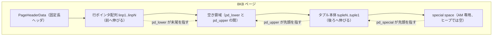
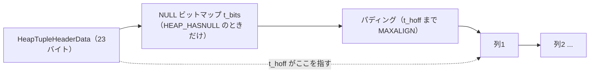
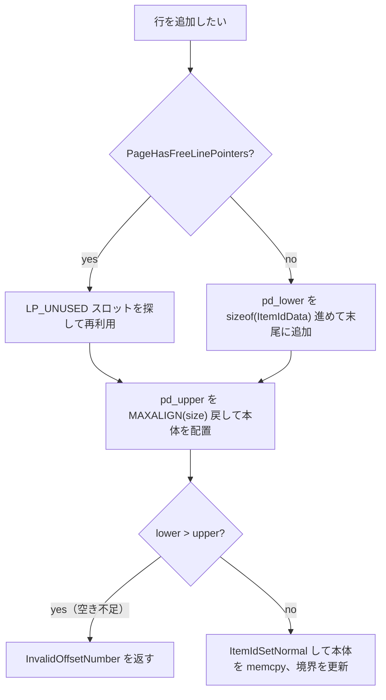

# 第24章 ページとタプルのレイアウト

> **本章で読むソース**
>
> - [`src/include/storage/bufpage.h`](https://github.com/postgres/postgres/blob/REL_18_4/src/include/storage/bufpage.h)
> - [`src/backend/storage/page/bufpage.c`](https://github.com/postgres/postgres/blob/REL_18_4/src/backend/storage/page/bufpage.c)
> - [`src/include/storage/itemid.h`](https://github.com/postgres/postgres/blob/REL_18_4/src/include/storage/itemid.h)
> - [`src/include/storage/itemptr.h`](https://github.com/postgres/postgres/blob/REL_18_4/src/include/storage/itemptr.h)
> - [`src/include/access/htup_details.h`](https://github.com/postgres/postgres/blob/REL_18_4/src/include/access/htup_details.h)

## この章の狙い

第22章で、共有バッファはディスク上の8KB ブロックを丸ごと1枚のバッファフレームへ読み込むと読んだ。
そのフレームの中身は、PostgreSQL から見ると単なるバイト列ではなく、決まった書式を持つ「ページ」である。
本章は、この8KB ページの内部がどう区切られ、その上に行（タプル）がどう載るかを読む。

ページの書式は、固定長のヘッダと、ページ末尾から前へ伸びるタプル本体と、その間を埋める行ポインタ配列という3つの領域からなる。
行を1つ追加するとは、行ポインタ配列を1つ前へ伸ばし、タプル本体を1つ後ろへ伸ばすことである。
両者の境界（空き領域）が尽きたときに、ページは満杯になる。

行を直接バイトオフセットで指さず、行ポインタという間接層を1段はさむのが、この書式の要点である。
この間接層があるおかげで、ページ内のタプルを物理的に動かしても、外から行を指す識別子（TID）は変わらない。
本章の最適化は、この間接参照を土台にした「ページ内整理（compaction）」として最後に読む。

## 前提

第21章でストレージマネージャがリレーションをブロック単位で読み書きすると読み、第22章でそのブロックが共有バッファのフレームに載ると読んだ。
本章はそのフレームの内部、すなわち1ブロック＝1ページの中身に踏み込む。
タプルの可視性（`t_xmin`/`t_xmax` を使った MVCC 判定）そのものは第27章で、ページ内の不要タプルを取り除くプルーニングと VACUUM は第28章で扱う。
本章はその手前、可視性判定が読み取る器の物理レイアウトに集中する。

## スロット式ページの全体像

ページの書式は `bufpage.h` 冒頭のコメントに図で示されている。
ヘッダの直後から行ポインタ（`linp`）が前へ並び、ページ末尾から実タプルが後ろへ並ぶ。
両者の境界が `pd_lower` と `pd_upper` で、この2つに挟まれた区間が空き領域である。

[`src/include/storage/bufpage.h` L25-L70](https://github.com/postgres/postgres/blob/REL_18_4/src/include/storage/bufpage.h#L25-L70)

```c
/*
 * A postgres disk page is an abstraction layered on top of a postgres
 * disk block (which is simply a unit of i/o, see block.h).
 *
 * specifically, while a disk block can be unformatted, a postgres
 * disk page is always a slotted page of the form:
 *
 * +----------------+---------------------------------+
 * | PageHeaderData | linp1 linp2 linp3 ...           |
 * +-----------+----+---------------------------------+
 * | ... linpN |									  |
 * +-----------+--------------------------------------+
 * |		   ^ pd_lower							  |
 * |												  |
 * |			 v pd_upper							  |
 * +-------------+------------------------------------+
 * |			 | tupleN ...                         |
 * +-------------+------------------+-----------------+
 * |	   ... tuple3 tuple2 tuple1 | "special space" |
 * +--------------------------------+-----------------+
 *									^ pd_special
 *
 * a page is full when nothing can be added between pd_lower and
 * pd_upper.
 *
 * all blocks written out by an access method must be disk pages.
 *
 * EXCEPTIONS:
 *
 * obviously, a page is not formatted before it is initialized by
 * a call to PageInit.
 *
 * NOTES:
 *
 * linp1..N form an ItemId (line pointer) array.  ItemPointers point
 * to a physical block number and a logical offset (line pointer
 * number) within that block/page.  Note that OffsetNumbers
 * conventionally start at 1, not 0.
 *
 * tuple1..N are added "backwards" on the page.  Since an ItemPointer
 * offset is used to access an ItemId entry rather than an actual
 * byte-offset position, tuples can be physically shuffled on a page
 * whenever the need arises.  This indirection also keeps crash recovery
 * relatively simple, because the low-level details of page space
 * management can be controlled by standard buffer page code during
 * logging, and during recovery.
```

この書式を**スロット式ページ**と呼ぶ。
行ポインタ配列が「スロット」の列で、各スロットが1つのタプルを指す。
コメントが述べるとおり、行をバイトオフセットで直接指さず行ポインタ番号で指すからこそ、タプルは必要に応じてページ上で物理的に並べ替えられる。

ページの末尾には「special space」と呼ばれる領域がある。
ここはアクセスメソッドごとの専用データを置く場所で、B-tree などのインデックスが兄弟ページへのリンクなどを格納する。
ヒープ（通常のテーブル）のページでは special space は空で、`pd_special` はページ末尾を指す。



## ページヘッダ `PageHeaderData`

ページ先頭の固定長ヘッダが `PageHeaderData` である。
領域の境界を示す3つのオフセット（`pd_lower`、`pd_upper`、`pd_special`）が、このヘッダの中心にある。

[`src/include/storage/bufpage.h` L159-L172](https://github.com/postgres/postgres/blob/REL_18_4/src/include/storage/bufpage.h#L159-L172)

```c
typedef struct PageHeaderData
{
	/* XXX LSN is member of *any* block, not only page-organized ones */
	PageXLogRecPtr pd_lsn;		/* LSN: next byte after last byte of xlog
								 * record for last change to this page */
	uint16		pd_checksum;	/* checksum */
	uint16		pd_flags;		/* flag bits, see below */
	LocationIndex pd_lower;		/* offset to start of free space */
	LocationIndex pd_upper;		/* offset to end of free space */
	LocationIndex pd_special;	/* offset to start of special space */
	uint16		pd_pagesize_version;
	TransactionId pd_prune_xid; /* oldest prunable XID, or zero if none */
	ItemIdData	pd_linp[FLEXIBLE_ARRAY_MEMBER]; /* line pointer array */
} PageHeaderData;
```

各フィールドの役割は次のとおりである。

- **`pd_lsn`**：このページに最後に変更を加えた WAL レコードの位置で、バッファマネージャが「データより先に WAL を書く」規則を守るために使う。
- **`pd_checksum`**：ディスクからの読み込み時に破損を検出するために使うページのチェックサム。
- **`pd_flags`**：後述する `PD_HAS_FREE_LINES` などが入るフラグビット。
- **`pd_lower`**：空き領域の先頭、すなわち行ポインタ配列の末尾の直後を指すオフセット。
- **`pd_upper`**：空き領域の末尾、すなわち最後に置かれたタプル本体の先頭を指すオフセット。
- **`pd_special`**：special space の先頭を指すオフセット。
- **`pd_pagesize_version`**：ページサイズとレイアウトバージョン番号を1つの `uint16` に詰めたもの。
- **`pd_prune_xid`**：プルーニングが有効かどうかを判断するためのヒントで、ページ上で取り除ける可能性のある最古の XID。

末尾の `pd_linp` は `FLEXIBLE_ARRAY_MEMBER` 宣言の可変長配列で、これが行ポインタ配列そのものである。
ヘッダ構造体の直後からこの配列が始まり、行が増えるたびに後ろへ伸びる。
そのため固定長ヘッダの大きさ `SizeOfPageHeaderData` は、`pd_linp` を含まない `offsetof` で定義される。

[`src/include/storage/bufpage.h` L215-L218](https://github.com/postgres/postgres/blob/REL_18_4/src/include/storage/bufpage.h#L215-L218)

```c
/*
 * line pointer(s) do not count as part of header
 */
#define SizeOfPageHeaderData (offsetof(PageHeaderData, pd_linp))
```

`PageInit` がページを初期化するとき、3つの境界はこの書式どおりに設定される。
空の状態では `pd_lower` はヘッダ直後（行ポインタ0個）を指し、`pd_upper` と `pd_special` はどちらも special space の先頭、すなわちページ末尾から special space を引いた位置を指す。

[`src/backend/storage/page/bufpage.c` L41-L60](https://github.com/postgres/postgres/blob/REL_18_4/src/backend/storage/page/bufpage.c#L41-L60)

```c
void
PageInit(Page page, Size pageSize, Size specialSize)
{
	PageHeader	p = (PageHeader) page;

	specialSize = MAXALIGN(specialSize);

	Assert(pageSize == BLCKSZ);
	Assert(pageSize > specialSize + SizeOfPageHeaderData);

	/* Make sure all fields of page are zero, as well as unused space */
	MemSet(p, 0, pageSize);

	p->pd_flags = 0;
	p->pd_lower = SizeOfPageHeaderData;
	p->pd_upper = pageSize - specialSize;
	p->pd_special = pageSize - specialSize;
	PageSetPageSizeAndVersion(page, pageSize, PG_PAGE_LAYOUT_VERSION);
	/* p->pd_prune_xid = InvalidTransactionId;		done by above MemSet */
}
```

ここから、ページ上の行数は `pd_lower` だけで求められることがわかる。
行ポインタ1つの大きさ `sizeof(ItemIdData)` で割れば、その時点の行数になる。
実際 `PageGetMaxOffsetNumber` はこの引き算と割り算で行数を返す。

[`src/include/storage/bufpage.h` L372-L381](https://github.com/postgres/postgres/blob/REL_18_4/src/include/storage/bufpage.h#L372-L381)

```c
static inline OffsetNumber
PageGetMaxOffsetNumber(const PageData *page)
{
	const PageHeaderData *pageheader = (const PageHeaderData *) page;

	if (pageheader->pd_lower <= SizeOfPageHeaderData)
		return 0;
	else
		return (pageheader->pd_lower - SizeOfPageHeaderData) / sizeof(ItemIdData);
}
```

## 行ポインタ `ItemIdData`

行ポインタ（line pointer）は `ItemIdData` という4バイトの構造体で、ビットフィールドを使ってオフセットと長さと状態を詰め込む。

[`src/include/storage/itemid.h` L25-L30](https://github.com/postgres/postgres/blob/REL_18_4/src/include/storage/itemid.h#L25-L30)

```c
typedef struct ItemIdData
{
	unsigned	lp_off:15,		/* offset to tuple (from start of page) */
				lp_flags:2,		/* state of line pointer, see below */
				lp_len:15;		/* byte length of tuple */
} ItemIdData;
```

`lp_off` がページ先頭からタプル本体までのバイトオフセット、`lp_len` がタプルの長さである。
どちらも15ビットなので、ページサイズの上限が `2^15` バイトに制約される。
残りの `lp_flags` 2ビットが、この行ポインタの状態を表す。

[`src/include/storage/itemid.h` L38-L41](https://github.com/postgres/postgres/blob/REL_18_4/src/include/storage/itemid.h#L38-L41)

```c
#define LP_UNUSED		0		/* unused (should always have lp_len=0) */
#define LP_NORMAL		1		/* used (should always have lp_len>0) */
#define LP_REDIRECT		2		/* HOT redirect (should have lp_len=0) */
#define LP_DEAD			3		/* dead, may or may not have storage */
```

4つの状態の意味は次のとおりである。

- **`LP_UNUSED`**：未使用で、本体を持たず、すぐに再利用してよい唯一の状態である。
- **`LP_NORMAL`**：通常使用中で、`lp_off` と `lp_len` でタプル本体を指す。
- **`LP_REDIRECT`**：HOT チェーンのリダイレクトで、本体を持たず `lp_off` に次の行ポインタ番号を入れる。
- **`LP_DEAD`**：不要になった行で、本体を持つ場合と持たない場合がある。

`LP_REDIRECT` と `LP_DEAD` は HOT（第28章）とプルーニングに関わる状態である。
本章で重要なのは、`LP_UNUSED` だけが再利用可能で、それ以外は内容を保ったまま据え置かれる点である。
行を削除しても行ポインタの枠はすぐには消えず、状態だけが変わる。

行ポインタへアクセスするマクロは `bufpage.h` にある。
`PageGetItemId` は行番号（`OffsetNumber`、1始まり）から行ポインタを引く。

[`src/include/storage/bufpage.h` L244-L248](https://github.com/postgres/postgres/blob/REL_18_4/src/include/storage/bufpage.h#L244-L248)

```c
static inline ItemId
PageGetItemId(Page page, OffsetNumber offsetNumber)
{
	return &((PageHeader) page)->pd_linp[offsetNumber - 1];
}
```

`PageGetItem` は、その行ポインタが指すタプル本体の先頭ポインタを返す。
ページ先頭に `lp_off` を足すだけである。

[`src/include/storage/bufpage.h` L354-L361](https://github.com/postgres/postgres/blob/REL_18_4/src/include/storage/bufpage.h#L354-L361)

```c
static inline Item
PageGetItem(const PageData *page, const ItemIdData *itemId)
{
	Assert(page);
	Assert(ItemIdHasStorage(itemId));

	return (Item) (((const char *) page) + ItemIdGetOffset(itemId));
}
```

タプルを読むには、まず行番号から `PageGetItemId` で行ポインタを引き、次に `PageGetItem` で本体を引く、という2段の参照になる。
この2段目が、行ポインタの `lp_off` を通る間接参照である。

## 行の追加 `PageAddItemExtended`

ページへ1つの項目（タプルやインデックスエントリ）を追加するのが `PageAddItemExtended` である。
これがスロット式ページの「行ポインタを前へ、本体を後ろへ伸ばす」操作を実装している。
公開マクロ `PageAddItem` は、上書きフラグとヒープ判定フラグを組み立ててこの関数を呼ぶ薄いラッパーである。

[`src/include/storage/bufpage.h` L473-L476](https://github.com/postgres/postgres/blob/REL_18_4/src/include/storage/bufpage.h#L473-L476)

```c
#define PageAddItem(page, item, size, offsetNumber, overwrite, is_heap) \
	PageAddItemExtended(page, item, size, offsetNumber, \
						((overwrite) ? PAI_OVERWRITE : 0) | \
						((is_heap) ? PAI_IS_HEAP : 0))
```

`PageAddItemExtended` は、まず行を置くスロット番号 `offsetNumber` を決める。
呼び出し側がスロットを指定しなかったとき（`InvalidOffsetNumber`）は、空き行ポインタを探すか、なければ配列の末尾に新しく1つ足す。
ここで効くのが `PD_HAS_FREE_LINES` ヒントである。

[`src/backend/storage/page/bufpage.c` L246-L287](https://github.com/postgres/postgres/blob/REL_18_4/src/backend/storage/page/bufpage.c#L246-L287)

```c
	else
	{
		/* offsetNumber was not passed in, so find a free slot */
		/* if no free slot, we'll put it at limit (1st open slot) */
		if (PageHasFreeLinePointers(page))
		{
			/*
			 * Scan line pointer array to locate a "recyclable" (unused)
			 * ItemId.
			 *
			 * Always use earlier items first.  PageTruncateLinePointerArray
			 * can only truncate unused items when they appear as a contiguous
			 * group at the end of the line pointer array.
			 */
			for (offsetNumber = FirstOffsetNumber;
				 offsetNumber < limit;	/* limit is maxoff+1 */
				 offsetNumber++)
			{
				itemId = PageGetItemId(page, offsetNumber);

				/*
				 * We check for no storage as well, just to be paranoid;
				 * unused items should never have storage.  Assert() that the
				 * invariant is respected too.
				 */
				Assert(ItemIdIsUsed(itemId) || !ItemIdHasStorage(itemId));

				if (!ItemIdIsUsed(itemId) && !ItemIdHasStorage(itemId))
					break;
			}
			if (offsetNumber >= limit)
			{
				/* the hint is wrong, so reset it */
				PageClearHasFreeLinePointers(page);
			}
		}
		else
		{
			/* don't bother searching if hint says there's no free slot */
			offsetNumber = limit;
		}
	}
```

`PageHasFreeLinePointers` がフラグ `PD_HAS_FREE_LINES` を読み、立っているときだけ配列を走査して `LP_UNUSED` のスロットを探す。
立っていなければ走査を省き、いきなり末尾へ追加する。
このフラグはあくまでヒントなので、走査して空きが見つからなければ、ここでフラグを下ろして次回以降の無駄な走査を防ぐ。
空きスロットを再利用するときは、必ず番号の小さいものから使う。
末尾に未使用スロットが連続して残れば、後で配列ごと切り詰められるからである。

スロット番号が決まると、新しい `pd_lower` と `pd_upper` を計算し、収まるかどうかを確かめる。

[`src/backend/storage/page/bufpage.c` L303-L319](https://github.com/postgres/postgres/blob/REL_18_4/src/backend/storage/page/bufpage.c#L303-L319)

```c
	/*
	 * Compute new lower and upper pointers for page, see if it'll fit.
	 *
	 * Note: do arithmetic as signed ints, to avoid mistakes if, say,
	 * alignedSize > pd_upper.
	 */
	if (offsetNumber == limit || needshuffle)
		lower = phdr->pd_lower + sizeof(ItemIdData);
	else
		lower = phdr->pd_lower;

	alignedSize = MAXALIGN(size);

	upper = (int) phdr->pd_upper - (int) alignedSize;

	if (lower > upper)
		return InvalidOffsetNumber;
```

新しいスロットを末尾に足すときは `pd_lower` を行ポインタ1つ分だけ後ろへ進める。
タプル本体は `MAXALIGN(size)` だけ `pd_upper` を前へ戻した位置に置く。
この計算後に `lower > upper` となれば空き領域が尽きているので、追加を諦めて `InvalidOffsetNumber` を返す。

収まるなら、行ポインタを `LP_NORMAL` に設定し、本体をページへコピーし、最後に2つの境界を更新する。

[`src/backend/storage/page/bufpage.c` L330-L354](https://github.com/postgres/postgres/blob/REL_18_4/src/backend/storage/page/bufpage.c#L330-L354)

```c
	/* set the line pointer */
	ItemIdSetNormal(itemId, upper, size);

	/*
	 * Items normally contain no uninitialized bytes.  Core bufpage consumers
	 * conform, but this is not a necessary coding rule; a new index AM could
	 * opt to depart from it.  However, data type input functions and other
	 * C-language functions that synthesize datums should initialize all
	 * bytes; datumIsEqual() relies on this.  Testing here, along with the
	 * similar check in printtup(), helps to catch such mistakes.
	 *
	 * Values of the "name" type retrieved via index-only scans may contain
	 * uninitialized bytes; see comment in btrescan().  Valgrind will report
	 * this as an error, but it is safe to ignore.
	 */
	VALGRIND_CHECK_MEM_IS_DEFINED(item, size);

	/* copy the item's data onto the page */
	memcpy((char *) page + upper, item, size);

	/* adjust page header */
	phdr->pd_lower = (LocationIndex) lower;
	phdr->pd_upper = (LocationIndex) upper;

	return offsetNumber;
```

`ItemIdSetNormal` が `lp_off` に `upper`、`lp_len` に `size` を入れ、状態を `LP_NORMAL` にする。
本体は `MAXALIGN` した位置 `upper` からコピーされる。
タプル本体をアラインするのは、行ポインタの `lp_off`（15ビット）に収まる範囲で、各タプルの先頭をマシンのワード境界にそろえ、内部のフィールドを直接読めるようにするためである。

## ヒープタプルの構造 `HeapTupleHeaderData`

行ポインタが指す本体が、ヒープタプルである。
その先頭には固定長のヘッダ `HeapTupleHeaderData` が載る。

[`src/include/access/htup_details.h` L153-L181](https://github.com/postgres/postgres/blob/REL_18_4/src/include/access/htup_details.h#L153-L181)

```c
struct HeapTupleHeaderData
{
	union
	{
		HeapTupleFields t_heap;
		DatumTupleFields t_datum;
	}			t_choice;

	ItemPointerData t_ctid;		/* current TID of this or newer tuple (or a
								 * speculative insertion token) */

	/* Fields below here must match MinimalTupleData! */

#define FIELDNO_HEAPTUPLEHEADERDATA_INFOMASK2 2
	uint16		t_infomask2;	/* number of attributes + various flags */

#define FIELDNO_HEAPTUPLEHEADERDATA_INFOMASK 3
	uint16		t_infomask;		/* various flag bits, see below */

#define FIELDNO_HEAPTUPLEHEADERDATA_HOFF 4
	uint8		t_hoff;			/* sizeof header incl. bitmap, padding */

	/* ^ - 23 bytes - ^ */

#define FIELDNO_HEAPTUPLEHEADERDATA_BITS 5
	bits8		t_bits[FLEXIBLE_ARRAY_MEMBER];	/* bitmap of NULLs */

	/* MORE DATA FOLLOWS AT END OF STRUCT */
};
```

先頭の `t_choice` は共用体で、ディスク上のタプルでは MVCC 用の `HeapTupleFields`（`t_xmin`、`t_xmax`、コマンド ID）になる。

[`src/include/access/htup_details.h` L122-L132](https://github.com/postgres/postgres/blob/REL_18_4/src/include/access/htup_details.h#L122-L132)

```c
typedef struct HeapTupleFields
{
	TransactionId t_xmin;		/* inserting xact ID */
	TransactionId t_xmax;		/* deleting or locking xact ID */

	union
	{
		CommandId	t_cid;		/* inserting or deleting command ID, or both */
		TransactionId t_xvac;	/* old-style VACUUM FULL xact ID */
	}			t_field3;
} HeapTupleFields;
```

`t_xmin` はこのタプルを挿入したトランザクションの ID、`t_xmax` は削除またはロックしたトランザクションの ID である。
この2つが MVCC の核で、第27章の可視性判定はこの値とスナップショットを突き合わせて、各トランザクションにこのタプルが見えるかどうかを決める。
3番目のフィールドはコマンド ID（`t_cid`）と旧式 VACUUM FULL 用の `t_xvac` を共用する。
ヘッダ全体は23バイトで、`t_bits` を除いた大きさが `SizeofHeapTupleHeader` である。

ヘッダ末尾の各フィールドの役割は次のとおりである。

- **`t_ctid`**：このタプル自身または新しい版の TID で、挿入時は自分自身を指し、更新されると新版を指す。
- **`t_infomask2`**：列数（下位11ビット）と、HOT などのフラグ。
- **`t_infomask`**：可視性に関わるフラグビットで、`t_xmin`/`t_xmax` の確定状態や NULL の有無などを表す。
- **`t_hoff`**：NULL ビットマップとパディングを含むヘッダ全体の長さで、ここから先がユーザーデータである。
- **`t_bits`**：NULL を持つ列があるときだけ置かれる NULL ビットマップ。

### `t_infomask` のフラグと NULL ビットマップ

`t_infomask` の下位ビットには、タプルの物理的な内容に関わるヒントが入る。

[`src/include/access/htup_details.h` L190-L197](https://github.com/postgres/postgres/blob/REL_18_4/src/include/access/htup_details.h#L190-L197)

```c
#define HEAP_HASNULL			0x0001	/* has null attribute(s) */
#define HEAP_HASVARWIDTH		0x0002	/* has variable-width attribute(s) */
#define HEAP_HASEXTERNAL		0x0004	/* has external stored attribute(s) */
#define HEAP_HASOID_OLD			0x0008	/* has an object-id field */
#define HEAP_XMAX_KEYSHR_LOCK	0x0010	/* xmax is a key-shared locker */
#define HEAP_COMBOCID			0x0020	/* t_cid is a combo CID */
#define HEAP_XMAX_EXCL_LOCK		0x0040	/* xmax is exclusive locker */
#define HEAP_XMAX_LOCK_ONLY		0x0080	/* xmax, if valid, is only a locker */
```

`HEAP_HASNULL` が立っているときだけ、ヘッダの後ろに NULL ビットマップ `t_bits` が置かれる。
ビットマップは1列1ビットで、そのビットが0なら NULL、1なら値があることを表す。
全列に値があるタプルではビットマップを省けるので、その分だけタプルが小さくなる。

上位ビットには可視性に関わるヒントが入る。

[`src/include/access/htup_details.h` L204-L211](https://github.com/postgres/postgres/blob/REL_18_4/src/include/access/htup_details.h#L204-L211)

```c
#define HEAP_XMIN_COMMITTED		0x0100	/* t_xmin committed */
#define HEAP_XMIN_INVALID		0x0200	/* t_xmin invalid/aborted */
#define HEAP_XMIN_FROZEN		(HEAP_XMIN_COMMITTED|HEAP_XMIN_INVALID)
#define HEAP_XMAX_COMMITTED		0x0400	/* t_xmax committed */
#define HEAP_XMAX_INVALID		0x0800	/* t_xmax invalid/aborted */
#define HEAP_XMAX_IS_MULTI		0x1000	/* t_xmax is a MultiXactId */
#define HEAP_UPDATED			0x2000	/* this is UPDATEd version of row */
#define HEAP_MOVED_OFF			0x4000	/* moved to another place by pre-9.0
```

`HEAP_XMIN_COMMITTED` や `HEAP_XMAX_COMMITTED` は「ヒントビット」と呼ばれる。
`t_xmin` のトランザクションがコミット済みかどうかを毎回 commit log で調べるのは重いので、一度調べた結果をこのビットに焼き込んでおく。
次回からはこのビットを見るだけで済む。
このヒントビットの活用は第27章の可視性判定で詳しく読む。

### ユーザーデータの物理配置とアライメント

ヘッダの後ろに NULL ビットマップが続き、その後ろにユーザーデータの各列が並ぶ。
ユーザーデータの開始位置は `t_hoff` が指し、これは `MAXALIGN` の倍数にそろえられる。
この並びは構造体冒頭のコメントが要約している。

[`src/include/access/htup_details.h` L65-L71](https://github.com/postgres/postgres/blob/REL_18_4/src/include/access/htup_details.h#L65-L71)

```c
 * The overall structure of a heap tuple looks like:
 *			fixed fields (HeapTupleHeaderData struct)
 *			nulls bitmap (if HEAP_HASNULL is set in t_infomask)
 *			alignment padding (as needed to make user data MAXALIGN'd)
 *			object ID (if HEAP_HASOID_OLD is set in t_infomask, not created
 *          anymore)
 *			user data fields
```

各列は、その型が要求するアライメントに合わせて配置される。
たとえば4バイト整数は4バイト境界、8バイト整数は8バイト境界にそろえる。
そのため列と列の間に詰め物（パディング）が入ることがあり、宣言した列の順番によってタプルの大きさが変わる。
ユーザーデータの先頭 `t_hoff` を `MAXALIGN` でそろえるのは、各列の先頭オフセットをタプルの先頭からの相対位置で計算できるようにするためである。



## TID による行の指し方

行を一意に指す識別子が**TID**（tuple identifier）で、ブロック番号と行ポインタ番号の組である。
ディスク上ではこれを `ItemPointerData` で表す。

[`src/include/storage/itemptr.h` L36-L47](https://github.com/postgres/postgres/blob/REL_18_4/src/include/storage/itemptr.h#L36-L47)

```c
typedef struct ItemPointerData
{
	BlockIdData ip_blkid;
	OffsetNumber ip_posid;
}

/* If compiler understands packed and aligned pragmas, use those */
#if defined(pg_attribute_packed) && defined(pg_attribute_aligned)
			pg_attribute_packed()
			pg_attribute_aligned(2)
#endif
ItemPointerData;
```

`ip_blkid` がリレーション内のブロック番号、`ip_posid` がそのブロック内の行ポインタ番号である。
ここで `ip_posid` がタプル本体のバイトオフセットではなく行ポインタ番号である点が、スロット式ページの肝になる。
TID は「何ブロック目の、何番目の行ポインタ」までしか指さず、本体がページのどこにあるかには触れない。

`ItemPointerData` はディスク上のタプルヘッダ（`t_ctid`）やインデックスエントリの中に大量に置かれる。
そこで構造体は6バイト（`int16` 3つ分）にきっちり収まるよう、コンパイラにパディングを抑制させている。
インデックスはこの TID を使ってヒープのタプルを指す。
インデックスから1行たどるとは、TID のブロック番号でページを読み、行ポインタ番号で行ポインタを引き、その `lp_off` から本体を読む、という流れである。

## 最適化の工夫：間接参照を保つページ内整理

スロット式ページが間接参照を1段はさむ最大の見返りが、ページ内整理（compaction）である。
タプルを削除したり HOT で版を捨てたりすると、ページの真ん中に隙間が空く。
この隙間を寄せて空き領域を1つにまとめるのが `PageRepairFragmentation` で、プルーニングのあとに呼ばれる。

[`src/backend/storage/page/bufpage.c` L697-L713](https://github.com/postgres/postgres/blob/REL_18_4/src/backend/storage/page/bufpage.c#L697-L713)

```c
void
PageRepairFragmentation(Page page)
{
	Offset		pd_lower = ((PageHeader) page)->pd_lower;
	Offset		pd_upper = ((PageHeader) page)->pd_upper;
	Offset		pd_special = ((PageHeader) page)->pd_special;
	Offset		last_offset;
	itemIdCompactData itemidbase[MaxHeapTuplesPerPage];
	itemIdCompact itemidptr;
	ItemId		lp;
	int			nline,
				nstorage,
				nunused;
	OffsetNumber finalusedlp = InvalidOffsetNumber;
	int			i;
	Size		totallen;
	bool		presorted = true;	/* For now */
```

この関数は、まず行ポインタ配列を走査して、本体を持つ生きた行（`LP_NORMAL` など）だけを `itemidbase` 作業配列に集める。
未使用の行ポインタは `LP_UNUSED` に整える。

[`src/backend/storage/page/bufpage.c` L739-L774](https://github.com/postgres/postgres/blob/REL_18_4/src/backend/storage/page/bufpage.c#L739-L774)

```c
	for (i = FirstOffsetNumber; i <= nline; i++)
	{
		lp = PageGetItemId(page, i);
		if (ItemIdIsUsed(lp))
		{
			if (ItemIdHasStorage(lp))
			{
				itemidptr->offsetindex = i - 1;
				itemidptr->itemoff = ItemIdGetOffset(lp);

				if (last_offset > itemidptr->itemoff)
					last_offset = itemidptr->itemoff;
				else
					presorted = false;

				if (unlikely(itemidptr->itemoff < (int) pd_upper ||
							 itemidptr->itemoff >= (int) pd_special))
					ereport(ERROR,
							(errcode(ERRCODE_DATA_CORRUPTED),
							 errmsg("corrupted line pointer: %u",
									itemidptr->itemoff)));
				itemidptr->alignedlen = MAXALIGN(ItemIdGetLength(lp));
				totallen += itemidptr->alignedlen;
				itemidptr++;
			}

			finalusedlp = i;	/* Could be the final non-LP_UNUSED item */
		}
		else
		{
			/* Unused entries should have lp_len = 0, but make sure */
			Assert(!ItemIdHasStorage(lp));
			ItemIdSetUnused(lp);
			nunused++;
		}
	}
```

集めた本体を実際に寄せるのが `compactify_tuples` である。
この関数のコメントが、間接参照を保つこととアライメントを利かせる工夫を説明している。

[`src/backend/storage/page/bufpage.c` L444-L468](https://github.com/postgres/postgres/blob/REL_18_4/src/backend/storage/page/bufpage.c#L444-L468)

```c
/*
 * After removing or marking some line pointers unused, move the tuples to
 * remove the gaps caused by the removed items and reorder them back into
 * reverse line pointer order in the page.
 *
 * This function can often be fairly hot, so it pays to take some measures to
 * make it as optimal as possible.
 *
 * Callers may pass 'presorted' as true if the 'itemidbase' array is sorted in
 * descending order of itemoff.  When this is true we can just memmove()
 * tuples towards the end of the page.  This is quite a common case as it's
 * the order that tuples are initially inserted into pages.  When we call this
 * function to defragment the tuples in the page then any new line pointers
 * added to the page will keep that presorted order, so hitting this case is
 * still very common for tables that are commonly updated.
 *
 * When the 'itemidbase' array is not presorted then we're unable to just
 * memmove() tuples around freely.  Doing so could cause us to overwrite the
 * memory belonging to a tuple we've not moved yet.  In this case, we copy all
 * the tuples that need to be moved into a temporary buffer.  We can then
 * simply memcpy() out of that temp buffer back into the page at the correct
 * location.  Tuples are copied back into the page in the same order as the
 * 'itemidbase' array, so we end up reordering the tuples back into reverse
 * line pointer order.  This will increase the chances of hitting the
 * presorted case the next time around.
```

ここで決定的なのは、本体を物理的に動かす一方で、行ポインタ番号を変えない点である。
タプルを動かすたびに、その行ポインタの `lp_off` を新しい位置へ書き換えるだけで済む。

[`src/backend/storage/page/bufpage.c` L558-L564](https://github.com/postgres/postgres/blob/REL_18_4/src/backend/storage/page/bufpage.c#L558-L564)

```c
			/* shift the target offset down by the length of this tuple */
			upper -= itemidptr->alignedlen;
			/* point the copy_head to the start of this tuple */
			copy_head = itemidptr->itemoff;

			/* update the line pointer to reference the new offset */
			lp->lp_off = upper;
```

タプル本体はページ上を移動したのに、行ポインタ番号は据え置かれる。
だから、その行を指す TID（ブロック番号＋行ポインタ番号）も、インデックスが持つ TID も、すべて変わらない。
更新が必要なのはページ内部の `lp_off` だけで、外向きの参照は1つも書き換えずに済む。
これが、行を直接バイトオフセットで指さず行ポインタの間接層をはさんだことの見返りである。

性能面の工夫も2段ある。
タプルが本体オフセットの降順に並んでいる「presorted」の場合は、隙間を末尾へ向かって `memmove` で寄せるだけで、一時バッファを使わずに済む。
これは挿入直後によく成り立つ並びで、整理のたびに本体を行ポインタ番号の逆順へ並べ直すので、次回も presorted に当たりやすくなる。
並びが崩れている場合だけ、上書き事故を避けるために本体を一時バッファへ退避してから書き戻す。

整理を終えると、生きた本体は隙間なくページ末尾側に詰まり、空き領域が `pd_lower` と `pd_upper` の間の1つにまとまる。
これで `PageAddItemExtended` がふたたび `lower > upper` の判定だけで追加可否を決められる状態に戻る。

## ページの空き容量

`PageGetFreeSpace` は、いま追加できる項目の最大バイト数を返す。
新しい行ポインタ1つ分を差し引いた、`pd_upper` と `pd_lower` の差である。

[`src/backend/storage/page/bufpage.c` L905-L922](https://github.com/postgres/postgres/blob/REL_18_4/src/backend/storage/page/bufpage.c#L905-L922)

```c
Size
PageGetFreeSpace(const PageData *page)
{
	const PageHeaderData *phdr = (const PageHeaderData *) page;
	int			space;

	/*
	 * Use signed arithmetic here so that we behave sensibly if pd_lower >
	 * pd_upper.
	 */
	space = (int) phdr->pd_upper - (int) phdr->pd_lower;

	if (space < (int) sizeof(ItemIdData))
		return 0;
	space -= sizeof(ItemIdData);

	return (Size) space;
}
```

ヒープページでは `PageGetHeapFreeSpace` を使う。
こちらは、行ポインタの数がすでに `MaxHeapTuplesPerPage` に達していて空きスロットが1つもないとき、空き容量を0として返す。
ヒープページに置ける行ポインタの数に上限を設けるための追加チェックである。



空きが不足して追加に失敗したページは、プルーニングと `PageRepairFragmentation` で隙間を回収すれば、ふたたび追加できる場合がある。
こうしてスロット式ページは、行ポインタの間接層を軸に、追加と削除と整理を TID を保ったまま繰り返す。

## まとめ

本章では、8KB ページのスロット式レイアウトと、その上に載るヒープタプルの構造を読んだ。

- ページは固定長ヘッダ `PageHeaderData`、前へ伸びる行ポインタ配列、後ろへ伸びるタプル本体の3領域からなり、境界を `pd_lower`/`pd_upper`/`pd_special` で表す。
- 行ポインタ `ItemIdData` は `lp_off`/`lp_len`/`lp_flags` の4バイトで、行をバイトオフセットではなく行ポインタ番号で間接的に指す。
- `PageAddItemExtended` は行ポインタを前へ、本体を後ろへ伸ばして行を追加し、`PD_HAS_FREE_LINES` ヒントで空きスロットを再利用する。
- ヒープタプルヘッダ `HeapTupleHeaderData` は `t_xmin`/`t_xmax`/`t_ctid`/`t_infomask` を持ち、NULL ビットマップとアライメントされたユーザーデータが続く。
- TID（ブロック番号＋行ポインタ番号）は本体のバイト位置を含まないので、ページ内整理 `PageRepairFragmentation` が本体を物理移動しても TID は変わらない。

行ポインタの間接層は、ページ内整理を TID を保ったまま行える土台であり、インデックスとヒープが安定した TID で結びつくための要でもある。

## 関連する章

- [第21章　ストレージマネージャ](21-storage-manager.md)：ページが載るブロックを、ストレージマネージャがどう読み書きするか。
- [第22章　共有バッファとバッファ管理](22-buffer-manager.md)：ページが載るバッファフレームの管理。
- [第26章　ヒープアクセス](../part06-table-mvcc/26-heap-access.md)：本章の器に、ヒープアクセスメソッドがどう読み書きするか。
- [第27章　MVCC と可視性判定](../part06-table-mvcc/27-mvcc-and-visibility.md)：`t_xmin`/`t_xmax` とヒントビットを使った可視性判定。
- [第28章　VACUUM と HOT](../part06-table-mvcc/28-vacuum-and-hot.md)：`LP_REDIRECT`/`LP_DEAD` とプルーニング、ページ内整理の呼び出し元。
