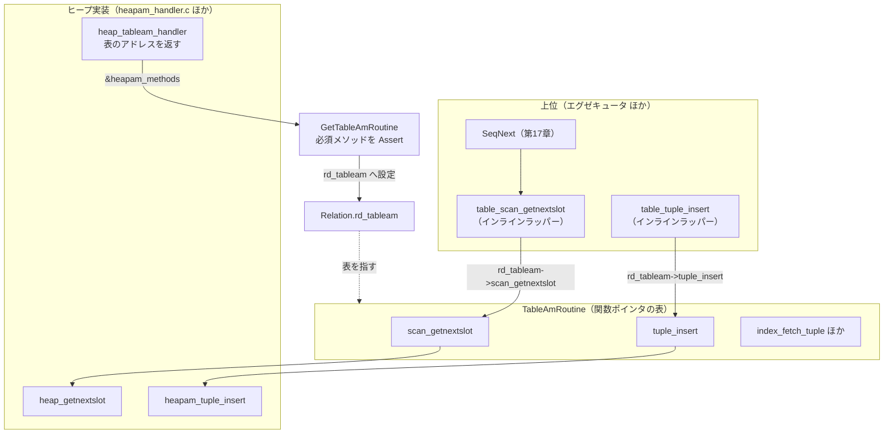

# 第25章 テーブルアクセスメソッド

> **本章で読むソース**
>
> - [`src/include/access/tableam.h`](https://github.com/postgres/postgres/blob/REL_18_4/src/include/access/tableam.h)
> - [`src/backend/access/heap/heapam_handler.c`](https://github.com/postgres/postgres/blob/REL_18_4/src/backend/access/heap/heapam_handler.c)
> - [`src/backend/access/table/tableamapi.c`](https://github.com/postgres/postgres/blob/REL_18_4/src/backend/access/table/tableamapi.c)
> - [`src/backend/utils/cache/relcache.c`](https://github.com/postgres/postgres/blob/REL_18_4/src/backend/utils/cache/relcache.c)

## この章の狙い

第17章で、逐次スキャンの取得関数 `SeqNext` がタプルの取得を `table_scan_getnextslot` の1行へ集約し、テーブルの物理レイアウトを一切知らずに済んでいたのを読んだ。
その1行の先にあるのが本章の主題である**テーブルアクセスメソッド**（table access method、tableam）である。

PostgreSQL はタプルをディスク上にどう並べ、どう取り出し、どう書き換えるかという物理的な仕事を、エグゼキュータから切り離して1つの抽象境界に閉じ込めている。
境界の上ではエグゼキュータが `table_scan_getnextslot` や `table_tuple_insert` といった一定の語彙でテーブルを操作し、境界の下では標準実装である**ヒープ**がその語彙を物理操作へ翻訳する。
この境界が `TableAmRoutine` という関数ポインタの表であり、上位は `table_*` という薄いラッパー経由でその表のエントリを呼ぶ。

本章は、まず `TableAmRoutine` がどんなメソッドを並べているかを読み、続いてヒープ実装がその表をどう埋めて登録するかを追う。
そして上位のラッパーが表のエントリへどう降りるかをたどり、最後に「列指向のような別の格納方式を差し替えられる拡張点」という設計の意義を、関数ポインタ表という機構の側から読む。

## 前提

第17章でスキャンノードが `table_scan_getnextslot` や `index_getnext_slot` を呼ぶところまでを読んだ。
本章はその呼び出しの先、すなわちテーブルアクセスメソッドの内部の入口を読む。
ヒープが返したタプルがどのページのどの位置に置かれ、可視性がどう判定されるかというヒープ固有の中身は第26章と第27章で扱う。
本章はその手前、抽象境界の形と、ヒープ実装が境界へ接続される仕組みまでを読む。

リレーションの定義（`Relation` 構造体、`rd_rel`）とリレーションキャッシュ（relcache）は第42章で詳しく扱うが、本章では `Relation` がテーブルアクセスメソッドの表へのポインタ `rd_tableam` を1つ持つ、という事実だけを使う。

## `TableAmRoutine`：物理アクセスを束ねる関数ポインタの表

テーブルアクセスメソッドの実体は、`tableam.h` で定義される `TableAmRoutine` 構造体である。
これはスキャン開始、次タプル取得、挿入、更新、削除、インデックスからの取得といった操作を、すべて関数ポインタとして1つの構造体に並べたものである。
冒頭のコメントが、この構造体の使われ方を端的に述べている。

[`src/include/access/tableam.h` L277-L302](https://github.com/postgres/postgres/blob/REL_18_4/src/include/access/tableam.h#L277-L302)

```c
/*
 * API struct for a table AM.  Note this must be allocated in a
 * server-lifetime manner, typically as a static const struct, which then gets
 * returned by FormData_pg_am.amhandler.
 *
 * In most cases it's not appropriate to call the callbacks directly, use the
 * table_* wrapper functions instead.
 *
 * GetTableAmRoutine() asserts that required callbacks are filled in, remember
 * to update when adding a callback.
 */
typedef struct TableAmRoutine
{
	/* this must be set to T_TableAmRoutine */
	NodeTag		type;


	/* ------------------------------------------------------------------------
	 * Slot related callbacks.
	 * ------------------------------------------------------------------------
	 */

	/*
	 * Return slot implementation suitable for storing a tuple of this AM.
	 */
	const TupleTableSlotOps *(*slot_callbacks) (Relation rel);
```

コメントが3点を述べている。
第1に、この構造体はサーバの寿命のあいだ生き続ける形、つまり `static const` で確保し、それを `pg_am` カタログの `amhandler` 関数が返す。
第2に、コールバックを直接呼ぶのは原則として不適切で、上位は `table_*` ラッパー関数を使う。
第3に、`GetTableAmRoutine()` が必須コールバックの充足を表明（assert）するので、コールバックを足したらそこも更新する。

先頭の `type` が `NodeTag` である点が要点である。
`TableAmRoutine` は `T_TableAmRoutine` というノードタグを持つノードとして扱われ、後述する検証でこのタグが正しいことを確かめる。

構造体は機能ごとに区切られて並ぶ。
スキャン系では、スキャン開始 `scan_begin`、終了 `scan_end`、再スキャン `scan_rescan`、そして次の1タプルを取る `scan_getnextslot` が定義されている。

[`src/include/access/tableam.h` L326-L351](https://github.com/postgres/postgres/blob/REL_18_4/src/include/access/tableam.h#L326-L351)

```c
	TableScanDesc (*scan_begin) (Relation rel,
								 Snapshot snapshot,
								 int nkeys, struct ScanKeyData *key,
								 ParallelTableScanDesc pscan,
								 uint32 flags);

	/*
	 * Release resources and deallocate scan. If TableScanDesc.temp_snap,
	 * TableScanDesc.rs_snapshot needs to be unregistered.
	 */
	void		(*scan_end) (TableScanDesc scan);

	/*
	 * Restart relation scan.  If set_params is set to true, allow_{strat,
	 * sync, pagemode} (see scan_begin) changes should be taken into account.
	 */
	void		(*scan_rescan) (TableScanDesc scan, struct ScanKeyData *key,
								bool set_params, bool allow_strat,
								bool allow_sync, bool allow_pagemode);

	/*
	 * Return next tuple from `scan`, store in slot.
	 */
	bool		(*scan_getnextslot) (TableScanDesc scan,
									 ScanDirection direction,
									 TupleTableSlot *slot);
```

`scan_begin` は `Relation` とスナップショットを受け取り `TableScanDesc` を返す。
返す `TableScanDesc` は、コメントが述べるとおり、アクセスメソッド固有のより大きな構造体に埋め込まれているのが普通である。
ヒープなら `HeapScanDesc` の先頭に `TableScanDesc` が置かれ、上位は基底部分だけを見て扱う。
`scan_getnextslot` は次の1タプルをスロットに詰めて `true` を返す、第17章で `SeqNext` が呼んでいた当のメソッドである。

インデックスからの取得は別区画にまとめられている。
インデックススキャンは、まずインデックスを引いて行の位置（TID）を得て、その TID のタプルをテーブルから取る。
後半の「TID からテーブルタプルを取る」部分がテーブルアクセスメソッドの仕事で、`index_fetch_tuple` がそれを担う。

[`src/include/access/tableam.h` L435-L459](https://github.com/postgres/postgres/blob/REL_18_4/src/include/access/tableam.h#L435-L459)

```c
	/*
	 * Fetch tuple at `tid` into `slot`, after doing a visibility test
	 * according to `snapshot`. If a tuple was found and passed the visibility
	 * test, return true, false otherwise.
	 *
	 * Note that AMs that do not necessarily update indexes when indexed
	 * columns do not change, need to return the current/correct version of
	 * the tuple that is visible to the snapshot, even if the tid points to an
	 * older version of the tuple.
	 *
	 * *call_again is false on the first call to index_fetch_tuple for a tid.
	 * If there potentially is another tuple matching the tid, *call_again
	 * needs to be set to true by index_fetch_tuple, signaling to the caller
	 * that index_fetch_tuple should be called again for the same tid.
	 *
	 * *all_dead, if all_dead is not NULL, should be set to true by
	 * index_fetch_tuple iff it is guaranteed that no backend needs to see
	 * that tuple. Index AMs can use that to avoid returning that tid in
	 * future searches.
	 */
	bool		(*index_fetch_tuple) (struct IndexFetchTableData *scan,
									  ItemPointer tid,
									  Snapshot snapshot,
									  TupleTableSlot *slot,
									  bool *call_again, bool *all_dead);
```

コメントの2段落目が、テーブルアクセスメソッドの抽象がよく効いている箇所を示している。
インデックス列が変わらない更新でインデックスを張り替えないアクセスメソッド、つまりヒープの HOT のような仕組みでは、TID が古い版を指していても、スナップショットから見える正しい版を返す責任を実装側が負う。
`call_again` は同じ TID にさらに版がありうるとき再呼び出しを促すフラグで、HOT チェーンを版ごとにたどるための連絡である。
ここで上位は「TID に対応する可視なタプルが欲しい」とだけ言い、版の連鎖をどうたどるかは実装に委ねられている。

物理タプルを書き換える操作は、さらに別の区画にまとまっている。
挿入 `tuple_insert`、削除 `tuple_delete`、更新 `tuple_update` が並ぶ。

[`src/include/access/tableam.h` L508-L551](https://github.com/postgres/postgres/blob/REL_18_4/src/include/access/tableam.h#L508-L551)

```c
	/* see table_tuple_insert() for reference about parameters */
	void		(*tuple_insert) (Relation rel, TupleTableSlot *slot,
								 CommandId cid, int options,
								 struct BulkInsertStateData *bistate);

	/* see table_tuple_insert_speculative() for reference about parameters */
	void		(*tuple_insert_speculative) (Relation rel,
											 TupleTableSlot *slot,
											 CommandId cid,
											 int options,
											 struct BulkInsertStateData *bistate,
											 uint32 specToken);

	/* see table_tuple_complete_speculative() for reference about parameters */
	void		(*tuple_complete_speculative) (Relation rel,
											   TupleTableSlot *slot,
											   uint32 specToken,
											   bool succeeded);

	/* see table_multi_insert() for reference about parameters */
	void		(*multi_insert) (Relation rel, TupleTableSlot **slots, int nslots,
								 CommandId cid, int options, struct BulkInsertStateData *bistate);

	/* see table_tuple_delete() for reference about parameters */
	TM_Result	(*tuple_delete) (Relation rel,
								 ItemPointer tid,
								 CommandId cid,
								 Snapshot snapshot,
								 Snapshot crosscheck,
								 bool wait,
								 TM_FailureData *tmfd,
								 bool changingPart);

	/* see table_tuple_update() for reference about parameters */
	TM_Result	(*tuple_update) (Relation rel,
								 ItemPointer otid,
								 TupleTableSlot *slot,
								 CommandId cid,
								 Snapshot snapshot,
								 Snapshot crosscheck,
								 bool wait,
								 TM_FailureData *tmfd,
								 LockTupleMode *lockmode,
								 TU_UpdateIndexes *update_indexes);
```

挿入はタプルを `TupleTableSlot` で受け取り、削除と更新は対象を TID で指す。
各メソッドのコメントが「パラメータの説明は `table_tuple_insert()` を見よ」と上位ラッパーへ案内している点が、この層の設計意図を表している。
詳しい契約はラッパー側に書かれ、構造体のメンバは型だけを宣言する。
削除と更新が返す `TM_Result` は、対象タプルが他トランザクションに更新済み（`TM_Updated`）や削除済み（`TM_Deleted`）だった、といった並行制御の結果を表す列挙である。

ここまでで、`TableAmRoutine` が「テーブルに対してできる物理操作の一覧」を関数ポインタとして網羅していることが見える。
この構造体のメンバを1つ呼ぶことが、テーブルアクセスメソッドを1回呼ぶことに等しい。

## ヒープ実装の登録：`heap_tableam_handler` が表を返す

標準のテーブルアクセスメソッドであるヒープは、`heapam_handler.c` で `TableAmRoutine` の実体を1つ用意し、各メンバにヒープ用の関数を割り当てている。
この実体が `heapam_methods` で、`static const` として確保されている。

[`src/backend/access/heap/heapam_handler.c` L2616-L2644](https://github.com/postgres/postgres/blob/REL_18_4/src/backend/access/heap/heapam_handler.c#L2616-L2644)

```c
static const TableAmRoutine heapam_methods = {
	.type = T_TableAmRoutine,

	.slot_callbacks = heapam_slot_callbacks,

	.scan_begin = heap_beginscan,
	.scan_end = heap_endscan,
	.scan_rescan = heap_rescan,
	.scan_getnextslot = heap_getnextslot,

	.scan_set_tidrange = heap_set_tidrange,
	.scan_getnextslot_tidrange = heap_getnextslot_tidrange,

	.parallelscan_estimate = table_block_parallelscan_estimate,
	.parallelscan_initialize = table_block_parallelscan_initialize,
	.parallelscan_reinitialize = table_block_parallelscan_reinitialize,

	.index_fetch_begin = heapam_index_fetch_begin,
	.index_fetch_reset = heapam_index_fetch_reset,
	.index_fetch_end = heapam_index_fetch_end,
	.index_fetch_tuple = heapam_index_fetch_tuple,

	.tuple_insert = heapam_tuple_insert,
	.tuple_insert_speculative = heapam_tuple_insert_speculative,
	.tuple_complete_speculative = heapam_tuple_complete_speculative,
	.multi_insert = heap_multi_insert,
	.tuple_delete = heapam_tuple_delete,
	.tuple_update = heapam_tuple_update,
	.tuple_lock = heapam_tuple_lock,
```

C の指示付き初期化子（designated initializer）で、構造体のメンバ名と関数名を1対1に対応づけている。
`type` には `T_TableAmRoutine` を入れ、`scan_getnextslot` には `heap_getnextslot` を、`tuple_insert` には `heapam_tuple_insert` を割り当てる、という具合である。
注目したいのは `parallelscan_estimate` などに `table_block_parallelscan_*` という、ヒープ専用ではない共通関数が入っている点である。
ブロック単位で格納するアクセスメソッドが共有できる処理は `tableam.c` 側に置かれ、ヒープはそれを再利用している。

割り当ての先がヒープの実コードであることを、`scan_getnextslot` に入っている `heap_getnextslot` で確かめる。

[`src/backend/access/heap/heapam.c` L1387-L1414](https://github.com/postgres/postgres/blob/REL_18_4/src/backend/access/heap/heapam.c#L1387-L1414)

```c
heap_getnextslot(TableScanDesc sscan, ScanDirection direction, TupleTableSlot *slot)
{
	HeapScanDesc scan = (HeapScanDesc) sscan;

	/* Note: no locking manipulations needed */

	if (sscan->rs_flags & SO_ALLOW_PAGEMODE)
		heapgettup_pagemode(scan, direction, sscan->rs_nkeys, sscan->rs_key);
	else
		heapgettup(scan, direction, sscan->rs_nkeys, sscan->rs_key);

	if (scan->rs_ctup.t_data == NULL)
	{
		ExecClearTuple(slot);
		return false;
	}

	/*
	 * if we get here it means we have a new current scan tuple, so point to
	 * the proper return buffer and return the tuple.
	 */

	pgstat_count_heap_getnext(scan->rs_base.rs_rd);

	ExecStoreBufferHeapTuple(&scan->rs_ctup, slot,
							 scan->rs_cbuf);
	return true;
}
```

`heap_getnextslot` は、上位から渡された基底の `TableScanDesc` をヒープ固有の `HeapScanDesc` へキャストし直すところから始まる。
このキャストが成り立つのは、`heap_beginscan` が `HeapScanDesc` の先頭に `TableScanDesc` を置いて返しているからである。
そして `heapgettup` でページからタプルを物理的に読み、見つかれば `ExecStoreBufferHeapTuple` でスロットに格納して `true` を返す。
ここで初めてヒープのページ構造に触れる。
上位はこの中身を知らず、`scan_getnextslot` という関数ポインタを呼ぶだけである。

この `heapam_methods` を外へ渡す入口が `heap_tableam_handler` である。

[`src/backend/access/heap/heapam_handler.c` L2675-L2685](https://github.com/postgres/postgres/blob/REL_18_4/src/backend/access/heap/heapam_handler.c#L2675-L2685)

```c
const TableAmRoutine *
GetHeapamTableAmRoutine(void)
{
	return &heapam_methods;
}

Datum
heap_tableam_handler(PG_FUNCTION_ARGS)
{
	PG_RETURN_POINTER(&heapam_methods);
}
```

`heap_tableam_handler` は、`heapam_methods` のアドレスを返すだけの関数である。
これが SQL から呼べる関数として `pg_proc` カタログに登録され、`pg_am` カタログの `heap` 行がこのハンドラ関数を指している。
新しいテーブルアクセスメソッドを書く者は、自分用の `TableAmRoutine` を `static const` で用意し、それを返すハンドラ関数を1つ書いて `CREATE ACCESS METHOD` で登録すればよい。
拡張点がハンドラ関数1つに集約されているのが、この設計の要である。

## ハンドラから表へ：`Relation` に表が結びつくまで

ハンドラ関数が返す `TableAmRoutine` は、リレーションを開いたときにそのリレーションの `rd_tableam` へ結びつけられる。
橋渡しをするのが `tableamapi.c` の `GetTableAmRoutine` である。

[`src/backend/access/table/tableamapi.c` L27-L48](https://github.com/postgres/postgres/blob/REL_18_4/src/backend/access/table/tableamapi.c#L27-L48)

```c
const TableAmRoutine *
GetTableAmRoutine(Oid amhandler)
{
	Datum		datum;
	const TableAmRoutine *routine;

	datum = OidFunctionCall0(amhandler);
	routine = (TableAmRoutine *) DatumGetPointer(datum);

	if (routine == NULL || !IsA(routine, TableAmRoutine))
		elog(ERROR, "table access method handler %u did not return a TableAmRoutine struct",
			 amhandler);

	/*
	 * Assert that all required callbacks are present. That makes it a bit
	 * easier to keep AMs up to date, e.g. when forward porting them to a new
	 * major version.
	 */
	Assert(routine->scan_begin != NULL);
	Assert(routine->scan_end != NULL);
	Assert(routine->scan_rescan != NULL);
	Assert(routine->scan_getnextslot != NULL);
```

`GetTableAmRoutine` はハンドラ関数の OID を受け取り、`OidFunctionCall0` でそのハンドラを実際に呼び出す。
ヒープなら `heap_tableam_handler` が呼ばれ、`heapam_methods` へのポインタが返る。
返り値が `NULL` でないことと、`IsA(routine, TableAmRoutine)`、つまり先頭の `NodeTag` が `T_TableAmRoutine` であることを確かめ、そうでなければエラーにする。
ハンドラが正しい型の構造体を返したという最小限の保証を、ノードタグ1つで取っている。

続いて多数の `Assert` で、必須コールバックが埋まっているかを確かめる。
コメントが述べるとおり、これはアクセスメソッドを新しいメジャーバージョンへ移植したとき、埋め忘れたコールバックを早期に発見させる仕掛けである。
構造体の宣言（前節）と、この `Assert` の並びが対になっており、メンバを足したら両方を更新する約束になっている。

`GetTableAmRoutine` を呼んでリレーションへ結びつけるのが、relcache の `InitTableAmRoutine` である。

[`src/backend/utils/cache/relcache.c` L1819-L1823](https://github.com/postgres/postgres/blob/REL_18_4/src/backend/utils/cache/relcache.c#L1819-L1823)

```c
static void
InitTableAmRoutine(Relation relation)
{
	relation->rd_tableam = GetTableAmRoutine(relation->rd_amhandler);
}
```

リレーションの `rd_amhandler`（ハンドラ関数の OID）から表を取り、`rd_tableam` に据える。
この `rd_amhandler` は、`RelationInitTableAccessMethod` がカタログ `pg_am` を引いて埋めている。

[`src/backend/utils/cache/relcache.c` L1852-L1873](https://github.com/postgres/postgres/blob/REL_18_4/src/backend/utils/cache/relcache.c#L1852-L1873)

```c
	else
	{
		/*
		 * Look up the table access method, save the OID of its handler
		 * function.
		 */
		Assert(relation->rd_rel->relam != InvalidOid);
		tuple = SearchSysCache1(AMOID,
								ObjectIdGetDatum(relation->rd_rel->relam));
		if (!HeapTupleIsValid(tuple))
			elog(ERROR, "cache lookup failed for access method %u",
				 relation->rd_rel->relam);
		aform = (Form_pg_am) GETSTRUCT(tuple);
		relation->rd_amhandler = aform->amhandler;
		ReleaseSysCache(tuple);
	}

	/*
	 * Now we can fetch the table AM's API struct
	 */
	InitTableAmRoutine(relation);
}
```

リレーションの `relam`（`pg_class` が指すアクセスメソッドの OID）から `pg_am` 行を引き、その `amhandler` を `rd_amhandler` に保存し、最後に `InitTableAmRoutine` で表を結びつける。
これで、リレーションを開いた時点で `rel->rd_tableam` がそのテーブルの `TableAmRoutine` を指す状態が整う。
`CREATE TABLE ... USING columnar` のように別のアクセスメソッドを指定したテーブルなら、`relam` が違う行を指し、`rd_tableam` には別の表が入る。
テーブルごとに格納方式を選べるのは、この `relam` から表までの引き当てがテーブル単位で行われるからである。

## 上位はラッパー経由で表を呼ぶ

エグゼキュータをはじめとする上位は、`rd_tableam` の関数ポインタを直接たどるのではなく、`table_*` という薄いラッパーを通して呼ぶ。
第17章で `SeqNext` が呼んでいた `table_scan_getnextslot` がその一例である。

[`src/include/access/tableam.h` L1019-L1037](https://github.com/postgres/postgres/blob/REL_18_4/src/include/access/tableam.h#L1019-L1037)

```c
static inline bool
table_scan_getnextslot(TableScanDesc sscan, ScanDirection direction, TupleTableSlot *slot)
{
	slot->tts_tableOid = RelationGetRelid(sscan->rs_rd);

	/* We don't expect actual scans using NoMovementScanDirection */
	Assert(direction == ForwardScanDirection ||
		   direction == BackwardScanDirection);

	/*
	 * We don't expect direct calls to table_scan_getnextslot with valid
	 * CheckXidAlive for catalog or regular tables.  See detailed comments in
	 * xact.c where these variables are declared.
	 */
	if (unlikely(TransactionIdIsValid(CheckXidAlive) && !bsysscan))
		elog(ERROR, "unexpected table_scan_getnextslot call during logical decoding");

	return sscan->rs_rd->rd_tableam->scan_getnextslot(sscan, direction, slot);
}
```

`table_scan_getnextslot` は `static inline` 関数で、最後の1行 `sscan->rs_rd->rd_tableam->scan_getnextslot(...)` がスキャン記述子の持つリレーションから表を引き、`scan_getnextslot` メンバを呼ぶ。
ヒープなら、この間接呼び出しが前節で読んだ `heap_getnextslot` へ着地する。
ラッパーが薄いのは、関数ポインタを引く前の共通の段取り、つまりスロットへのテーブル OID の設定や、論理デコード中でないことの確認などを、各アクセスメソッドに書かせず1か所へ集めるためである。
これらの前処理は格納方式によらず同じなので、ラッパーへ括り出している。

スキャン開始も同じ形である。
`table_beginscan` はスキャンの種別を表すフラグを組み立て、`scan_begin` メンバへ渡す。

[`src/include/access/tableam.h` L874-L882](https://github.com/postgres/postgres/blob/REL_18_4/src/include/access/tableam.h#L874-L882)

```c
static inline TableScanDesc
table_beginscan(Relation rel, Snapshot snapshot,
				int nkeys, struct ScanKeyData *key)
{
	uint32		flags = SO_TYPE_SEQSCAN |
		SO_ALLOW_STRAT | SO_ALLOW_SYNC | SO_ALLOW_PAGEMODE;

	return rel->rd_tableam->scan_begin(rel, snapshot, nkeys, key, NULL, flags);
}
```

`table_beginscan` は逐次スキャンを表す `SO_TYPE_SEQSCAN` などのフラグを立て、`rd_tableam->scan_begin` を呼ぶ。
スキャンの種類ごとに `table_beginscan_strat` や `table_beginscan_bm`（ビットマップ用）といった入口が用意され、それぞれ違うフラグを組み立てて同じ `scan_begin` を呼ぶ。
フラグの組み立てという上位の都合をラッパーが吸収し、`scan_begin` のシグネチャは1つに保たれている。

書き込み側も同様で、`table_tuple_insert` は `tuple_insert` メンバを呼ぶだけの薄いラッパーである。

[`src/include/access/tableam.h` L1366-L1372](https://github.com/postgres/postgres/blob/REL_18_4/src/include/access/tableam.h#L1366-L1372)

```c
static inline void
table_tuple_insert(Relation rel, TupleTableSlot *slot, CommandId cid,
				   int options, struct BulkInsertStateData *bistate)
{
	rel->rd_tableam->tuple_insert(rel, slot, cid, options,
								  bistate);
}
```

ヒープではこの呼び出しが `heapam_tuple_insert` へ着地し、スロットからヒープタプルを取り出して `heap_insert` で物理的に書き込む。

[`src/backend/access/heap/heapam_handler.c` L243-L260](https://github.com/postgres/postgres/blob/REL_18_4/src/backend/access/heap/heapam_handler.c#L243-L260)

```c
static void
heapam_tuple_insert(Relation relation, TupleTableSlot *slot, CommandId cid,
					int options, BulkInsertState bistate)
{
	bool		shouldFree = true;
	HeapTuple	tuple = ExecFetchSlotHeapTuple(slot, true, &shouldFree);

	/* Update the tuple with table oid */
	slot->tts_tableOid = RelationGetRelid(relation);
	tuple->t_tableOid = slot->tts_tableOid;

	/* Perform the insertion, and copy the resulting ItemPointer */
	heap_insert(relation, tuple, cid, options, bistate);
	ItemPointerCopy(&tuple->t_self, &slot->tts_tid);

	if (shouldFree)
		pfree(tuple);
}
```

`heapam_tuple_insert` は、上位がスロットで渡したタプルを `ExecFetchSlotHeapTuple` でヒープタプルの形に取り出し、`heap_insert` でページへ書き込む。
書き込んだ結果の位置（`t_self`）をスロットの `tts_tid` へ写し戻し、上位に「どこへ入ったか」を伝える。
上位は `TupleTableSlot` という抽象だけを扱い、ヒープタプルへの変換も物理的な配置もこの関数の内側で完結している。

上位ラッパーから `TableAmRoutine`、そしてヒープ実装までの流れを図にする。



上位は `table_*` ラッパーを呼び、ラッパーは `rd_tableam` の対応するメンバへ間接ジャンプする。
そのメンバに割り当てられた関数がヒープの実コードで、ここで初めて物理的なページ操作が起きる。
`rd_tableam` の中身は、`heap_tableam_handler` が返した表を `GetTableAmRoutine` が検証して結びつけたものである。

## 設計の意義と最適化：関数ポインタ表で格納方式を差し替える

テーブルアクセスメソッドの最大の意義は、テーブルの格納方式をエグゼキュータから独立に差し替えられる拡張点を、関数ポインタの表1つで実現している点にある。
列指向のような別の格納方式は、自前の `TableAmRoutine` を `static const` で用意し、各メンバに自分用の関数を割り当て、それを返すハンドラ関数を1つ書いて `CREATE ACCESS METHOD` で登録するだけでよい。
エグゼキュータ側のコードは一切変えずに、`CREATE TABLE ... USING <am>` でテーブルごとに格納方式を選べる。
これが可能なのは、上位が `table_*` ラッパーを通して常に同じ語彙でテーブルを操作し、その語彙と物理操作の対応を `rd_tableam` の表が一手に引き受けているからである。

機構レベルで効いているのは、この差し替えが**呼び出しの間接化を1段だけに抑えている**点である。
`table_scan_getnextslot` のようなラッパーは `static inline` なので、ラッパー自身の呼び出しはコンパイル時にインライン展開され、関数呼び出しのオーバーヘッドが残らない。
残るのは `rd_tableam->scan_getnextslot` という関数ポインタを1回たどる間接呼び出しだけである。
仮にラッパーを通常の関数にしていれば、1タプルごとに「ラッパーへの直接呼び出し」と「実装への間接呼び出し」の2段が積み上がる。
インライン化によって前者を消し、抽象の代償を関数ポインタ1回ぶんに切り詰めているのが、この層の速度設計である。

さらに、抽象の代償を払う必要がない処理はラッパー側へ括り出されている。
スロットへのテーブル OID の設定や、論理デコード中でないことの確認は、格納方式によらず同じである。
これらをラッパーに集めることで、各アクセスメソッドは固有の物理操作だけを書けばよくなり、共通処理の重複が消える。
`parallelscan_*` や `relation_size` にブロック単位の共通実装 `table_block_*` を割り当てていたのも同じ方針で、ブロック指向のアクセスメソッドが共有できる仕事は `tableam.c` 側に置かれている。

抽象の正しさを支えているのが、`GetTableAmRoutine` の `NodeTag` 検査と `Assert` の並びである。
ハンドラが返した構造体の先頭タグを確かめることで、まったく別の構造体を誤って表として扱う事故を防ぐ。
必須メソッドの `Assert` は、メジャーバージョン間でメソッドが増減したとき、埋め忘れを早期に表面化させる。
拡張点を1つのハンドラ関数へ集約しつつ、その中身が約束を満たすことを入口で機械的に確かめる、という二段構えで、差し替え可能性と安全性を両立させている。

## まとめ

テーブルアクセスメソッドは、テーブルの物理アクセスを `TableAmRoutine` という関数ポインタの表へ束ね、上位と物理実装のあいだに1つの抽象境界を引く。
表にはスキャン開始 `scan_begin`、次タプル取得 `scan_getnextslot`、挿入 `tuple_insert`、更新 `tuple_update`、削除 `tuple_delete`、インデックスからの取得 `index_fetch_tuple` などが並ぶ。

標準実装のヒープは、`heapam_methods` という `static const` の表に各メソッドのヒープ用関数を割り当て、`heap_tableam_handler` がそのアドレスを返す。
リレーションを開くとき `GetTableAmRoutine` がこのハンドラを呼んで表を取り、`NodeTag` と必須メソッドを検証してから `rd_tableam` へ結びつける。

上位は `table_scan_getnextslot` や `table_tuple_insert` といった `static inline` のラッパーを通して表を呼ぶ。
ラッパーはインライン展開されて消え、残る間接呼び出しは関数ポインタ1回ぶんに抑えられる。
共通の前処理はラッパーへ括り出され、各アクセスメソッドは固有の物理操作だけを書けばよい。
この設計により、列指向のような別の格納方式を、エグゼキュータを変えずにハンドラ関数1つの登録で差し替えられる。

次章は、この表のヒープ実装の内側、すなわちタプルがページのどこへどう置かれ、どう読み出されるかを読む。

## 関連する章

- [第17章 スキャンノード](../part04-executor/17-scan-nodes.md)：`SeqNext` が `table_scan_getnextslot` を呼んでテーブルアクセスメソッドへ降りる段。
- [第24章 ページとタプルのレイアウト](../part05-storage-buffer/24-page-and-tuple-layout.md)：`heap_getnextslot` がタプルを読み出すページの物理構造。
- [第26章 ヒープアクセス](26-heap-access.md)：本章の表のヒープ実装の内側、`heap_insert` や `heapgettup` の中身。
- [第27章 MVCC と可視性判定](27-mvcc-and-visibility.md)：`index_fetch_tuple` が返す「可視な版」を決める可視性判定。
- [第30章 インデックスアクセスメソッド](../part07-indexes/30-index-access-method.md)：テーブルアクセスメソッドと対をなす、インデックス側の関数ポインタ表。
- [第42章 システムカタログとキャッシュ](../part10-catalog-utilities/42-system-catalogs-and-caches.md)：`pg_am` から `rd_tableam` を引く relcache の仕組み。
