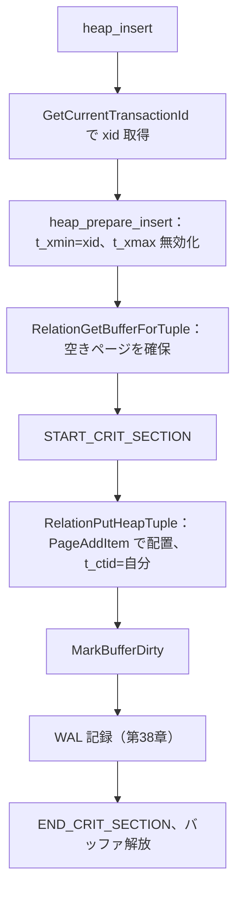
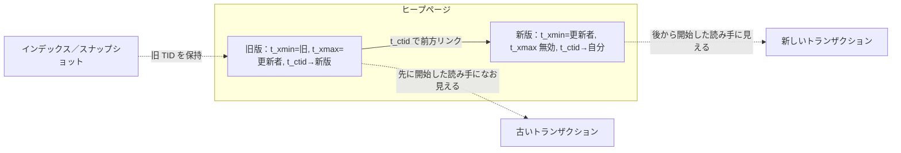

# 第26章 ヒープアクセス

> **本章で読むソース**
>
> - [`src/backend/access/heap/heapam.c`](https://github.com/postgres/postgres/blob/REL_18_4/src/backend/access/heap/heapam.c)
> - [`src/backend/access/heap/hio.c`](https://github.com/postgres/postgres/blob/REL_18_4/src/backend/access/heap/hio.c)

## この章の狙い

第24章で、ヒープのページはスロット式のレイアウトを持ち、その上にヒープタプルが `t_xmin`、`t_xmax`、`t_ctid` を含むヘッダ付きで載ると読んだ。
第25章では、テーブルアクセスメソッドという抽象層が、行の読み書きを `TupleTableSlot` を介してエグゼキュータへ提供すると読んだ。
本章は、その抽象層の裏でヒープが実際に行をどう書き、どう消し、どう読むかを `heapam.c` で読む。

ヒープアクセスの中心にあるのは、行を上書きしないという方針である。
更新は古い版を書き換えず、新しい版を別に書いて両者をつなぐ。
削除も本体を消さず、削除したトランザクションの ID を印として残すだけにとどめる。
この**追記型ストレージ**が、複数のトランザクションが同じ行の異なる版を同時に見られる仕組み、すなわち第27章の MVCC の土台になる。

本章では挿入、更新、削除、走査の4つを順に読み、最後に走査のページ単位最適化を機構レベルで読む。

## 前提

第24章でヒープタプルヘッダ `HeapTupleHeaderData` の各フィールド（`t_xmin`、`t_xmax`、`t_ctid`、`t_infomask`）の意味を読んだ。
本章はそのフィールドへ実際に値を書き込む側を読む。
第22章で共有バッファがページを保持し、書き込み前にバッファをロックして変更後に `MarkBufferDirty` で印を付けると読んだ。
ヒープの書き込みはこのバッファロックの内側で行われる。
WAL レコードの構築（`XLogInsert` 周辺）は第38章で扱うので、本章では「変更を WAL に記録する」とだけ押さえ、レコードの中身には踏み込まない。
タプルの可視性判定 `HeapTupleSatisfiesVisibility` の中身は第27章、HOT 更新とプルーニングは第28章へ送る。

## 行の挿入 `heap_insert`

行を1つ挿入する入口が `heap_insert` である。
処理は、タプルヘッダを整える前処理、行を置くバッファを確保する段階、実際にページへ載せて WAL に記録する段階に分かれる。

[`src/backend/access/heap/heapam.c` L2080-L2110](https://github.com/postgres/postgres/blob/REL_18_4/src/backend/access/heap/heapam.c#L2080-L2110)

```c
heap_insert(Relation relation, HeapTuple tup, CommandId cid,
			int options, BulkInsertState bistate)
{
	TransactionId xid = GetCurrentTransactionId();
	HeapTuple	heaptup;
	Buffer		buffer;
	Buffer		vmbuffer = InvalidBuffer;
	bool		all_visible_cleared = false;

	/* Cheap, simplistic check that the tuple matches the rel's rowtype. */
	Assert(HeapTupleHeaderGetNatts(tup->t_data) <=
		   RelationGetNumberOfAttributes(relation));

	AssertHasSnapshotForToast(relation);

	/*
	 * Fill in tuple header fields and toast the tuple if necessary.
	 *
	 * Note: below this point, heaptup is the data we actually intend to store
	 * into the relation; tup is the caller's original untoasted data.
	 */
	heaptup = heap_prepare_insert(relation, tup, xid, cid, options);

	/*
	 * Find buffer to insert this tuple into.  If the page is all visible,
	 * this will also pin the requisite visibility map page.
	 */
	buffer = RelationGetBufferForTuple(relation, heaptup->t_len,
									   InvalidBuffer, options, bistate,
									   &vmbuffer, NULL,
									   0);
```

先頭で `GetCurrentTransactionId` を呼び、このトランザクションの ID（`xid`）を取得する。
これが挿入したトランザクションの印として、次の前処理でタプルの `t_xmin` に書き込まれる。
`RelationGetBufferForTuple` は、行が収まる空きのあるページを探してバッファを返す。
空きページがなければリレーションを1ブロック拡張する。

### タプルヘッダの設定 `heap_prepare_insert`

ヘッダのフィールドを整えるのが `heap_prepare_insert` である。
この関数が、新しい行の `t_xmin` に自分のトランザクション ID を、`t_xmax` には「まだ誰も削除していない」を表す印を書き込む。

[`src/backend/access/heap/heapam.c` L2285-L2294](https://github.com/postgres/postgres/blob/REL_18_4/src/backend/access/heap/heapam.c#L2285-L2294)

```c
	tup->t_data->t_infomask &= ~(HEAP_XACT_MASK);
	tup->t_data->t_infomask2 &= ~(HEAP2_XACT_MASK);
	tup->t_data->t_infomask |= HEAP_XMAX_INVALID;
	HeapTupleHeaderSetXmin(tup->t_data, xid);
	if (options & HEAP_INSERT_FROZEN)
		HeapTupleHeaderSetXminFrozen(tup->t_data);

	HeapTupleHeaderSetCmin(tup->t_data, cid);
	HeapTupleHeaderSetXmax(tup->t_data, 0); /* for cleanliness */
	tup->t_tableOid = RelationGetRelid(relation);
```

`HeapTupleHeaderSetXmin` が `t_xmin` に挿入トランザクションの `xid` を入れる。
`t_xmax` には0を入れ、同時に `t_infomask` へ `HEAP_XMAX_INVALID` を立てる。
このフラグは「`t_xmax` は有効な削除者を指していない」を意味し、第27章の可視性判定で「この行はまだ生きている」と読み取られる。
挿入直後の行は、`t_xmin` が自分、`t_xmax` が無効、という状態で生まれる。

### ページへの配置 `RelationPutHeapTuple`

整えたタプルをページへ実際に載せるのが、`hio.c` の `RelationPutHeapTuple` である。
この関数はバッファの排他ロックを保持した状態で呼ばれ、第24章で読んだ `PageAddItem` を使ってタプルをページに追加する。

[`src/backend/access/heap/hio.c` L58-L82](https://github.com/postgres/postgres/blob/REL_18_4/src/backend/access/heap/hio.c#L58-L82)

```c
	/* Add the tuple to the page */
	pageHeader = BufferGetPage(buffer);

	offnum = PageAddItem(pageHeader, (Item) tuple->t_data,
						 tuple->t_len, InvalidOffsetNumber, false, true);

	if (offnum == InvalidOffsetNumber)
		elog(PANIC, "failed to add tuple to page");

	/* Update tuple->t_self to the actual position where it was stored */
	ItemPointerSet(&(tuple->t_self), BufferGetBlockNumber(buffer), offnum);

	/*
	 * Insert the correct position into CTID of the stored tuple, too (unless
	 * this is a speculative insertion, in which case the token is held in
	 * CTID field instead)
	 */
	if (!token)
	{
		ItemId		itemId = PageGetItemId(pageHeader, offnum);
		HeapTupleHeader item = (HeapTupleHeader) PageGetItem(pageHeader, itemId);

		item->t_ctid = tuple->t_self;
	}
}
```

`PageAddItem` が返す `offnum` が、ページ内でこの行に割り当てられた行ポインタ番号である。
ブロック番号と `offnum` を組にした TID を `tuple->t_self` に書き戻し、同じ値をページ上のタプルの `t_ctid` にも書く。
挿入直後の行の `t_ctid` は自分自身の TID を指す。
この自己参照が、後で更新が起きたとき「新しい版へのリンクがまだ無い」を表す基準になる。

`RelationPutHeapTuple` から戻ると、`heap_insert` は `PageIsAllVisible` の後始末（可視性マップのクリア）を行い、`MarkBufferDirty` でバッファに変更印を付け、WAL レコードを記録してからバッファロックを解放する。
ロックの取得から WAL 記録までは `START_CRIT_SECTION` と `END_CRIT_SECTION` で挟まれた区間に入り、この間はエラーで中断できない。
ページへの変更を WAL に書き終える前にプロセスが倒れると、ディスク上のページと WAL の整合が取れなくなるからである。



## 行の削除 `heap_delete`

削除の入口が `heap_delete` で、引数は消す行の TID である。
この関数はまず TID からページを読んでバッファを排他ロックし、`HeapTupleSatisfiesUpdate` でこの行が本当に削除可能かを確かめ、他のトランザクションが同じ行を更新中なら待つ。
それらの確認を通った後の中心部が、次の印付けである。

[`src/backend/access/heap/heapam.c` L3058-L3071](https://github.com/postgres/postgres/blob/REL_18_4/src/backend/access/heap/heapam.c#L3058-L3071)

```c
	/* store transaction information of xact deleting the tuple */
	tp.t_data->t_infomask &= ~(HEAP_XMAX_BITS | HEAP_MOVED);
	tp.t_data->t_infomask2 &= ~HEAP_KEYS_UPDATED;
	tp.t_data->t_infomask |= new_infomask;
	tp.t_data->t_infomask2 |= new_infomask2;
	HeapTupleHeaderClearHotUpdated(tp.t_data);
	HeapTupleHeaderSetXmax(tp.t_data, new_xmax);
	HeapTupleHeaderSetCmax(tp.t_data, cid, iscombo);
	/* Make sure there is no forward chain link in t_ctid */
	tp.t_data->t_ctid = tp.t_self;

	/* Signal that this is actually a move into another partition */
	if (changingPart)
		HeapTupleHeaderSetMovedPartitions(tp.t_data);
```

削除がページに対して行うのは、`HeapTupleHeaderSetXmax` で `t_xmax` に削除トランザクションの ID（`new_xmax`）を書き込むことだけである。
タプル本体も行ポインタも、この時点では一切消さない。
`t_ctid` は自分自身を指したまま据え置かれ、削除であって新しい版へのリンクではないことを表す。

本体を物理的に消さないのは、まだこの削除トランザクションがコミットするとは限らず、また他のトランザクションのスナップショットからはこの行がまだ見えるべきだからである。
削除された行が見えるべきかどうかは、第27章の可視性判定が `t_xmax` と各スナップショットを突き合わせて決める。
削除トランザクションより前に開始したトランザクションには、この行はなお生きて見える。
本体が実際に回収されるのは、どのスナップショットからも見えなくなったと判定された後、第28章のプルーニングや VACUUM の段階である。

印付けの直前にある `PageSetPrunable` が、このページを将来の回収候補として記録する。
削除はこのヒントを置くだけで、回収そのものは後続の処理へ委ねる。

## 行の更新 `heap_update`

更新の入口が `heap_update` で、引数は古い行の TID（`otid`）と新しい内容のタプル（`newtup`）である。
ヒープの更新は古い版を書き換えるのではなく、新しい版を別に書いて、古い版に「削除済み」の印を付けて両者をつなぐ。
削除と挿入を1つの操作にまとめた形である。

更新の中心部を読む。
ここに至るまでに、`heap_update` は古い行のバッファをロックし、新しい版を置くバッファ（`newbuf`、同じページに収まれば古いページと同じ）を確保している。

[`src/backend/access/heap/heapam.c` L4066-L4097](https://github.com/postgres/postgres/blob/REL_18_4/src/backend/access/heap/heapam.c#L4066-L4097)

```c
	if (use_hot_update)
	{
		/* Mark the old tuple as HOT-updated */
		HeapTupleSetHotUpdated(&oldtup);
		/* And mark the new tuple as heap-only */
		HeapTupleSetHeapOnly(heaptup);
		/* Mark the caller's copy too, in case different from heaptup */
		HeapTupleSetHeapOnly(newtup);
	}
	else
	{
		/* Make sure tuples are correctly marked as not-HOT */
		HeapTupleClearHotUpdated(&oldtup);
		HeapTupleClearHeapOnly(heaptup);
		HeapTupleClearHeapOnly(newtup);
	}

	RelationPutHeapTuple(relation, newbuf, heaptup, false); /* insert new tuple */


	/* Clear obsolete visibility flags, possibly set by ourselves above... */
	oldtup.t_data->t_infomask &= ~(HEAP_XMAX_BITS | HEAP_MOVED);
	oldtup.t_data->t_infomask2 &= ~HEAP_KEYS_UPDATED;
	/* ... and store info about transaction updating this tuple */
	Assert(TransactionIdIsValid(xmax_old_tuple));
	HeapTupleHeaderSetXmax(oldtup.t_data, xmax_old_tuple);
	oldtup.t_data->t_infomask |= infomask_old_tuple;
	oldtup.t_data->t_infomask2 |= infomask2_old_tuple;
	HeapTupleHeaderSetCmax(oldtup.t_data, cid, iscombo);

	/* record address of new tuple in t_ctid of old one */
	oldtup.t_data->t_ctid = heaptup->t_self;
```

更新がページに対して行う操作は3つである。
第1に、`RelationPutHeapTuple` で新しい版（`heaptup`）をページへ載せる。
これは挿入と同じ経路で、新しい版には自分のトランザクション ID が `t_xmin` として入り、`t_self` に新しい TID が割り当てられる。
第2に、古い版（`oldtup`）の `t_xmax` に、更新したトランザクションの ID（`xmax_old_tuple`）を `HeapTupleHeaderSetXmax` で書き込む。
これは削除と同じ印で、古い版は「このトランザクションによって置き換えられた」状態になる。
第3に、古い版の `t_ctid` を新しい版の TID（`heaptup->t_self`）に書き換える。
これが、古い版から新しい版への前方リンクである。

この3つによって、古い版と新しい版は `t_ctid` のリンクでつながった更新チェーンになる。
古い版を読んだトランザクションは、その `t_xmax` が自分から見てコミット済みなら、`t_ctid` をたどって新しい版へ進める。
古い版がまだ生きて見えるトランザクションは、リンクをたどらず古い版をそのまま読む。
同じ行の2つの版が物理的に共存し、どちらが見えるかはスナップショットごとに変わる。
これが追記型更新であり、第27章の MVCC が成り立つ物理的な根拠である。

冒頭の `use_hot_update` 分岐は HOT（Heap Only Tuple）更新の判定で、新しい版が古い版と同じページに収まり、かつインデックス列が変わっていないときに成り立つ。
HOT が成り立つとインデックスを更新せずに済む。
この最適化の機構は第28章で扱うので、本章では「同じページに収まればインデックス更新を省ける道がある」とだけ押さえる。



## 行の走査 `heap_getnextslot` と `heapgettup`

テーブルを順に読むときの入口が `heap_getnextslot` である。
第25章で読んだとおり、これはテーブルアクセスメソッドの `scan_getnextslot` としてエグゼキュータから呼ばれ、次の1行を `TupleTableSlot` に詰めて返す。

[`src/backend/access/heap/heapam.c` L1387-L1414](https://github.com/postgres/postgres/blob/REL_18_4/src/backend/access/heap/heapam.c#L1387-L1414)

```c
heap_getnextslot(TableScanDesc sscan, ScanDirection direction, TupleTableSlot *slot)
{
	HeapScanDesc scan = (HeapScanDesc) sscan;

	/* Note: no locking manipulations needed */

	if (sscan->rs_flags & SO_ALLOW_PAGEMODE)
		heapgettup_pagemode(scan, direction, sscan->rs_nkeys, sscan->rs_key);
	else
		heapgettup(scan, direction, sscan->rs_nkeys, sscan->rs_key);

	if (scan->rs_ctup.t_data == NULL)
	{
		ExecClearTuple(slot);
		return false;
	}

	/*
	 * if we get here it means we have a new current scan tuple, so point to
	 * the proper return buffer and return the tuple.
	 */

	pgstat_count_heap_getnext(scan->rs_base.rs_rd);

	ExecStoreBufferHeapTuple(&scan->rs_ctup, slot,
							 scan->rs_cbuf);
	return true;
}
```

`heap_getnextslot` は次の1行を見つける仕事を `heapgettup` か `heapgettup_pagemode` に委ね、見つかった行を `ExecStoreBufferHeapTuple` でスロットに載せて返すだけの薄いラッパーである。
両者の選択は `SO_ALLOW_PAGEMODE` フラグで決まる。
通常のスナップショット走査ではページ単位モード（`heapgettup_pagemode`）が選ばれ、これが最後に読む最適化の本体になる。

まず基本形の `heapgettup` を読む。
この関数はブロックを順にたどり、各ブロックのバッファに共有ロックをかけ、行ポインタを1つずつ見て可視な行を探す。

[`src/backend/access/heap/heapam.c` L942-L975](https://github.com/postgres/postgres/blob/REL_18_4/src/backend/access/heap/heapam.c#L942-L975)

```c
		for (; linesleft > 0; linesleft--, lineoff += dir)
		{
			bool		visible;
			ItemId		lpp = PageGetItemId(page, lineoff);

			if (!ItemIdIsNormal(lpp))
				continue;

			tuple->t_data = (HeapTupleHeader) PageGetItem(page, lpp);
			tuple->t_len = ItemIdGetLength(lpp);
			ItemPointerSet(&(tuple->t_self), scan->rs_cblock, lineoff);

			visible = HeapTupleSatisfiesVisibility(tuple,
												   scan->rs_base.rs_snapshot,
												   scan->rs_cbuf);

			HeapCheckForSerializableConflictOut(visible, scan->rs_base.rs_rd,
												tuple, scan->rs_cbuf,
												scan->rs_base.rs_snapshot);

			/* skip tuples not visible to this snapshot */
			if (!visible)
				continue;

			/* skip any tuples that don't match the scan key */
			if (key != NULL &&
				!HeapKeyTest(tuple, RelationGetDescr(scan->rs_base.rs_rd),
							 nkeys, key))
				continue;

			LockBuffer(scan->rs_cbuf, BUFFER_LOCK_UNLOCK);
			scan->rs_coffset = lineoff;
			return;
		}
```

ループは行ポインタを `lineoff` で1つずつたどる。
`ItemIdIsNormal` でない行ポインタ（未使用やリダイレクト）は飛ばす。
本体を指す行ポインタについては、`PageGetItem` でタプル本体を取り出し、`HeapTupleSatisfiesVisibility` でこのスナップショットから見えるかを判定する。
見えない行は飛ばし、見える行がスキャンキーにも合えば、バッファロックを外してその行を返す。
ここで重要なのは、可視性の判定がこのループの内側で1行ごとに呼ばれ、その間ずっとバッファに共有ロックがかかっている点である。

## 最適化の工夫：ページ単位走査による判定とロックの一括化

`heap_getnextslot` が通常選ぶ `heapgettup_pagemode` は、基本形 `heapgettup` の弱点である「1行ごとの可視性判定とロック保持」を、ページ単位に一括化する最適化である。
両者の違いは関数冒頭のコメントに要約されている。

[`src/backend/access/heap/heapam.c` L995-L1007](https://github.com/postgres/postgres/blob/REL_18_4/src/backend/access/heap/heapam.c#L995-L1007)

```c
/* ----------------
 *		heapgettup_pagemode - fetch next heap tuple in page-at-a-time mode
 *
 *		Same API as heapgettup, but used in page-at-a-time mode
 *
 * The internal logic is much the same as heapgettup's too, but there are some
 * differences: we do not take the buffer content lock (that only needs to
 * happen inside heap_prepare_pagescan), and we iterate through just the
 * tuples listed in rs_vistuples[] rather than all tuples on the page.  Notice
 * that lineindex is 0-based, where the corresponding loop variable lineoff in
 * heapgettup is 1-based.
 * ----------------
 */
```

ページ単位モードは、新しいページに移るたびに `heap_prepare_pagescan` を一度だけ呼ぶ。
この呼び出しの中でバッファ内容ロックを取り、ページ上の全行の可視性をまとめて判定し、可視な行の行ポインタ番号だけを配列 `rs_vistuples[]` に書き出してロックを外す。
個々の行を返すループは、この事前に作った配列をたどるだけになる。

[`src/backend/access/heap/heapam.c` L1060-L1082](https://github.com/postgres/postgres/blob/REL_18_4/src/backend/access/heap/heapam.c#L1060-L1082)

```c
		for (; linesleft > 0; linesleft--, lineindex += dir)
		{
			ItemId		lpp;
			OffsetNumber lineoff;

			Assert(lineindex < scan->rs_ntuples);
			lineoff = scan->rs_vistuples[lineindex];
			lpp = PageGetItemId(page, lineoff);
			Assert(ItemIdIsNormal(lpp));

			tuple->t_data = (HeapTupleHeader) PageGetItem(page, lpp);
			tuple->t_len = ItemIdGetLength(lpp);
			ItemPointerSetOffsetNumber(&tuple->t_self, lineoff);

			/* skip any tuples that don't match the scan key */
			if (key != NULL &&
				!HeapKeyTest(tuple, RelationGetDescr(scan->rs_base.rs_rd),
							 nkeys, key))
				continue;

			scan->rs_cindex = lineindex;
			return;
		}
```

このループには、基本形にあった `HeapTupleSatisfiesVisibility` の呼び出しもバッファロックの操作も無い。
可視性はページに入った時点で全行分まとめて済ませてあり、ループは可視と分かっている行（`rs_vistuples[lineindex]`）だけをたどるからである。
スキャンキーの照合だけが各行に残る。

このまとめ方が速いのは2つの理由による。
第1に、可視性判定に必要なバッファ内容ロックを、1ページにつき1回だけ取って即座に放す。
基本形のように行を返すたびにロックを取り直す必要がなく、ロックを保持したまま呼び出し側へ制御を返すこともない。
これにより同じページを更新したいバックエンドを長く待たせずに済む。
第2に、可視性判定の結果をページ単位でまとめて確定するので、判定に伴うヒントビットの書き込み（第24章で読んだ `HEAP_XMIN_COMMITTED` などの焼き込み）も、ページに触れている一度の機会にまとめて行える。

走査がページ全体を順に読むという性質を使い、本来は行ごとに必要な判定とロックを、ページという自然な単位へくくり出したのがこの最適化である。

## まとめ

本章では、ヒープテーブルへの行の挿入、削除、更新、走査を `heapam.c` で読んだ。

- `heap_insert` は `heap_prepare_insert` で `t_xmin` に自分の XID を、`t_xmax` に無効印を書き、`RelationPutHeapTuple`（`PageAddItem`）でページへ載せ、`t_ctid` を自分自身に向ける。
- `heap_delete` は本体を消さず、`t_xmax` に削除トランザクションの XID を書き込む印付けだけを行い、回収は第28章へ委ねる。
- `heap_update` は新しい版を `RelationPutHeapTuple` で別に書き、古い版の `t_xmax` を立て、古い版の `t_ctid` を新しい版へ向けて両者を更新チェーンでつなぐ。
- 行を上書きしない追記型ストレージにより、同じ行の複数の版が物理的に共存し、これが第27章の MVCC の土台になる。
- `heap_getnextslot` が通常選ぶ `heapgettup_pagemode` は、可視性判定とバッファロックをページ単位に一括化して走査を速くする。

挿入、削除、更新のいずれも、行の物理的な書き換えではなく `t_xmin`、`t_xmax`、`t_ctid` への印付けとして表される。
この印を後からどう読むか（可視性判定）と、印の付いた不要な版をどう回収するか（プルーニングと VACUUM）が、続く2つの章の主題である。

## 関連する章

- [第24章　ページとタプルのレイアウト](../part05-storage-buffer/24-page-and-tuple-layout.md)：本章が書き込む `t_xmin`/`t_xmax`/`t_ctid` を持つヒープタプルの物理構造と、`PageAddItem` によるページへの追加。
- [第25章　テーブルアクセスメソッド](25-table-access-method.md)：`heap_getnextslot` を `scan_getnextslot` として呼び出す抽象層。
- [第27章　MVCC と可視性判定](27-mvcc-and-visibility.md)：本章が立てた `t_xmax` と `t_ctid` を、スナップショットと突き合わせて可視性へ翻訳する仕組み。
- [第28章　VACUUM と HOT](28-vacuum-and-hot.md)：`heap_update` の HOT 更新と、削除や更新で残った不要な版の回収。
- [第38章　WAL の仕組み](../part09-wal-recovery/38-wal.md)：本章で省いた `XLogInsert` によるヒープ変更の WAL 記録。
