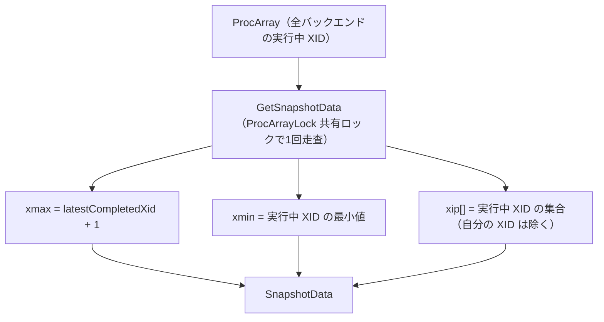
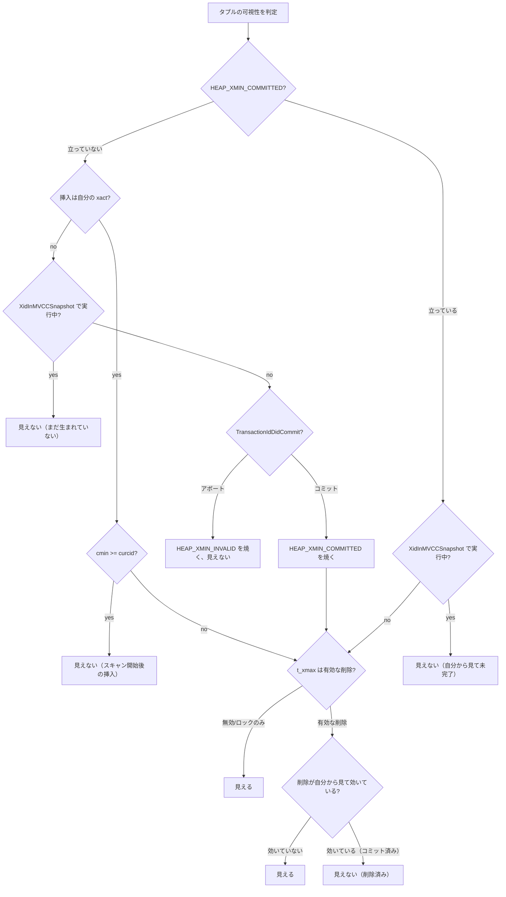
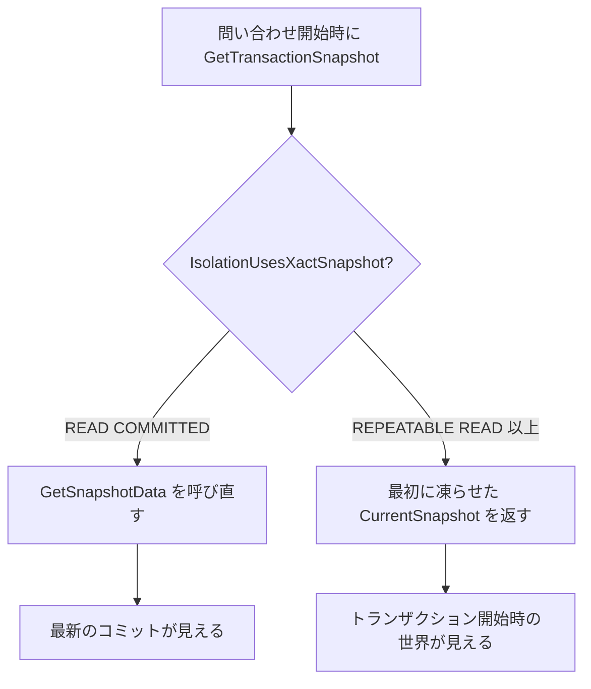

# 第27章 MVCC と可視性判定

> **本章で読むソース**
>
> - [`src/include/utils/snapshot.h`](https://github.com/postgres/postgres/blob/REL_18_4/src/include/utils/snapshot.h)
> - [`src/backend/storage/ipc/procarray.c`](https://github.com/postgres/postgres/blob/REL_18_4/src/backend/storage/ipc/procarray.c)
> - [`src/backend/access/heap/heapam_visibility.c`](https://github.com/postgres/postgres/blob/REL_18_4/src/backend/access/heap/heapam_visibility.c)
> - [`src/backend/utils/time/snapmgr.c`](https://github.com/postgres/postgres/blob/REL_18_4/src/backend/utils/time/snapmgr.c)
> - [`src/include/access/htup_details.h`](https://github.com/postgres/postgres/blob/REL_18_4/src/include/access/htup_details.h)

## この章の狙い

第24章で、ヒープタプルのヘッダには挿入したトランザクションの ID `t_xmin` と、削除またはロックしたトランザクションの ID `t_xmax` が載ると読んだ。
PostgreSQL は行を更新するとき、古い版を上書きせず、新しい版を別タプルとして書く。
そのため同じ論理行に対して複数の物理タプルがページ上に共存し、各タプルが `t_xmin`/`t_xmax` で「いつからいつまで有効か」を記録する。

このとき問題になるのが、いま実行中の問い合わせにどの版が見えるべきか、である。
PostgreSQL はこれを**MVCC**（multiversion concurrency control、多版型同時実行制御）で解く。
各トランザクションは実行開始時点の世界を切り取った**スナップショット**を持ち、タプルの `t_xmin`/`t_xmax` をそのスナップショットと突き合わせて、自分に見えるかどうかを1タプルずつ判定する。

本章は、その突き合わせの実体を読む。
スナップショットがどう構成され（`SnapshotData`、`GetSnapshotData`）、可視性判定がどんな規則で答えを出し（`HeapTupleSatisfiesMVCC`）、その判定をヒントビットがどう償却するか（`SetHintBits`）を、順に追う。

## 前提

第24章でヒープタプルの `HeapTupleHeaderData` と `t_xmin`/`t_xmax`、可視性に関わる `t_infomask` のフラグを読んだ。
本章はその値を読み取る側、すなわち可視性判定の規則に集中する。
スナップショットを共有メモリの `ProcArray` から作る `GetSnapshotData` の全体像と、分離レベルごとのスナップショット管理は第37章で改めて扱う。
本章はそのうち、可視性判定に直接効く `xmin`/`xmax`/`xip` の3点に絞って読む。

## スナップショットの表現 `SnapshotData`

スナップショットは、ある瞬間に「どのトランザクションが完了済みで、どれが実行中か」を切り取った集合である。
通常の MVCC スナップショットでは、この集合を3つの値で表す。

[`src/include/utils/snapshot.h` L138-L165](https://github.com/postgres/postgres/blob/REL_18_4/src/include/utils/snapshot.h#L138-L165)

```c
typedef struct SnapshotData
{
	SnapshotType snapshot_type; /* type of snapshot */

	/*
	 * The remaining fields are used only for MVCC snapshots, and are normally
	 * just zeroes in special snapshots.  (But xmin and xmax are used
	 * specially by HeapTupleSatisfiesDirty, and xmin is used specially by
	 * HeapTupleSatisfiesNonVacuumable.)
	 *
	 * An MVCC snapshot can never see the effects of XIDs >= xmax. It can see
	 * the effects of all older XIDs except those listed in the snapshot. xmin
	 * is stored as an optimization to avoid needing to search the XID arrays
	 * for most tuples.
	 */
	TransactionId xmin;			/* all XID < xmin are visible to me */
	TransactionId xmax;			/* all XID >= xmax are invisible to me */

	/*
	 * For normal MVCC snapshot this contains the all xact IDs that are in
	 * progress, unless the snapshot was taken during recovery in which case
	 * it's empty. For historic MVCC snapshots, the meaning is inverted, i.e.
	 * it contains *committed* transactions between xmin and xmax.
	 *
	 * note: all ids in xip[] satisfy xmin <= xip[i] < xmax
	 */
	TransactionId *xip;
	uint32		xcnt;			/* # of xact ids in xip[] */
```

3つの値の意味は、コメントが述べるとおりである。

- **`xmin`**：これより小さい XID はすべて完了済みで、自分から見える。
- **`xmax`**：これ以上の XID はすべて未完了とみなし、自分から見えない。
- **`xip`**：`xmin` 以上 `xmax` 未満の範囲のうち、スナップショットを取った瞬間に実行中だった XID の配列（要素数 `xcnt`）。

ここから「あるトランザクション `xid` がこのスナップショットから見て実行中か」を判定する規則が決まる。
`xid < xmin` なら完了済み、`xid >= xmax` なら実行中、その間なら `xip` 配列に入っているかどうかで決まる。
`xmin` と `xmax` の2つの境界は、ほとんどの XID を配列検索なしで振り分けるための枠で、`xip` 配列を引くのは境界に挟まれた狭い範囲に限られる。

サブトランザクションの XID は別配列 `subxip`（要素数 `subxcnt`）に入る。
ただし1バックエンドが保持できるサブ XID のキャッシュには上限があり、あふれた場合は `suboverflowed` が立つ。
あふれたときは `subxip` を信用できないので、後述の判定では `pg_subtrans` を引いて親 XID へ変換する必要が出てくる。

## スナップショットの取得 `GetSnapshotData`

スナップショットの3つの値は、共有メモリの `ProcArray` を走査して埋める。
`ProcArray` は全バックエンドの `PGPROC` を束ねた配列で、各バックエンドが自分の実行中 XID をそこへ公開している。
`GetSnapshotData` は、その配列を `ProcArrayLock` の共有ロックの下で1回走査し、実行中 XID を集める。

関数冒頭のコメントが、戻り値の3つの値と判定規則を要約している。

[`src/backend/storage/ipc/procarray.c` L2142-L2153](https://github.com/postgres/postgres/blob/REL_18_4/src/backend/storage/ipc/procarray.c#L2142-L2153)

```c
/*
 * GetSnapshotData -- returns information about running transactions.
 *
 * The returned snapshot includes xmin (lowest still-running xact ID),
 * xmax (highest completed xact ID + 1), and a list of running xact IDs
 * in the range xmin <= xid < xmax.  It is used as follows:
 *		All xact IDs < xmin are considered finished.
 *		All xact IDs >= xmax are considered still running.
 *		For an xact ID xmin <= xid < xmax, consult list to see whether
 *		it is considered running or not.
 * This ensures that the set of transactions seen as "running" by the
 * current xact will not change after it takes the snapshot.
```

`xmax` は「完了済みの最大 XID ＋ 1」で、共有変数 `latestCompletedXid` から決まる。

[`src/backend/storage/ipc/procarray.c` L2247-L2257](https://github.com/postgres/postgres/blob/REL_18_4/src/backend/storage/ipc/procarray.c#L2247-L2257)

```c
	/* xmax is always latestCompletedXid + 1 */
	xmax = XidFromFullTransactionId(latest_completed);
	TransactionIdAdvance(xmax);
	Assert(TransactionIdIsNormal(xmax));

	/* initialize xmin calculation with xmax */
	xmin = xmax;

	/* take own xid into account, saves a check inside the loop */
	if (TransactionIdIsNormal(myxid) && NormalTransactionIdPrecedes(myxid, xmin))
		xmin = myxid;
```

`xmin` はまず `xmax` で初期化し、走査の中で実行中 XID の最小値へ下げていく。
`ProcArray` を1つずつ見て、実行中 XID を `xip` 配列へ集めながら、その最小値を `xmin` に取り込む。

[`src/backend/storage/ipc/procarray.c` L2320-L2324](https://github.com/postgres/postgres/blob/REL_18_4/src/backend/storage/ipc/procarray.c#L2320-L2324)

```c
			if (NormalTransactionIdPrecedes(xid, xmin))
				xmin = xid;

			/* Add XID to snapshot. */
			xip[count++] = xid;
```

走査を終えると、集めた値を `SnapshotData` へ書き込む。
これが、可視性判定が読むことになる `xmin`/`xmax`/`xip` の最終形である。

[`src/backend/storage/ipc/procarray.c` L2501-L2508](https://github.com/postgres/postgres/blob/REL_18_4/src/backend/storage/ipc/procarray.c#L2501-L2508)

```c
	snapshot->xmin = xmin;
	snapshot->xmax = xmax;
	snapshot->xcnt = count;
	snapshot->subxcnt = subcount;
	snapshot->suboverflowed = suboverflowed;
	snapshot->snapXactCompletionCount = curXactCompletionCount;

	snapshot->curcid = GetCurrentCommandId(false);
```

自分自身の XID は `xip` に含めない。
自分が挿入した行は別の規則（後述の `TransactionIdIsCurrentTransactionId` とコマンド ID の比較）で扱うからである。
末尾の `curcid` は現在のコマンド ID で、同一トランザクション内の「この問い合わせより後に行った変更」を隠すために使う。



## スナップショットに対する実行中判定 `XidInMVCCSnapshot`

可視性判定の土台になるのが、「ある XID がこのスナップショットから見て実行中か」を返す `XidInMVCCSnapshot` である。
前節で見た3つの値の規則を、そのまま実装している。

[`src/backend/utils/time/snapmgr.c` L1869-L1885](https://github.com/postgres/postgres/blob/REL_18_4/src/backend/utils/time/snapmgr.c#L1869-L1885)

```c
bool
XidInMVCCSnapshot(TransactionId xid, Snapshot snapshot)
{
	/*
	 * Make a quick range check to eliminate most XIDs without looking at the
	 * xip arrays.  Note that this is OK even if we convert a subxact XID to
	 * its parent below, because a subxact with XID < xmin has surely also got
	 * a parent with XID < xmin, while one with XID >= xmax must belong to a
	 * parent that was not yet committed at the time of this snapshot.
	 */

	/* Any xid < xmin is not in-progress */
	if (TransactionIdPrecedes(xid, snapshot->xmin))
		return false;
	/* Any xid >= xmax is in-progress */
	if (TransactionIdFollowsOrEquals(xid, snapshot->xmax))
		return true;
```

まず `xmin`/`xmax` の境界で大半の XID を振り分ける。
`xid < xmin` なら実行中ではない（完了済み）、`xid >= xmax` なら実行中、と即座に返る。
この2つの境界チェックが、配列検索を避けるための「速い道」である。

境界に挟まれた `xmin <= xid < xmax` のときだけ、配列を引く。
通常のスナップショットで、サブ XID があふれていなければ、まず `subxip` を線形検索し、続いて `xip` を引く。

[`src/backend/utils/time/snapmgr.c` L1900-L1926](https://github.com/postgres/postgres/blob/REL_18_4/src/backend/utils/time/snapmgr.c#L1900-L1926)

```c
		if (!snapshot->suboverflowed)
		{
			/* we have full data, so search subxip */
			if (pg_lfind32(xid, snapshot->subxip, snapshot->subxcnt))
				return true;

			/* not there, fall through to search xip[] */
		}
		else
		{
			/*
			 * Snapshot overflowed, so convert xid to top-level.  This is safe
			 * because we eliminated too-old XIDs above.
			 */
			xid = SubTransGetTopmostTransaction(xid);

			/*
			 * If xid was indeed a subxact, we might now have an xid < xmin,
			 * so recheck to avoid an array scan.  No point in rechecking
			 * xmax.
			 */
			if (TransactionIdPrecedes(xid, snapshot->xmin))
				return false;
		}

		if (pg_lfind32(xid, snapshot->xip, snapshot->xcnt))
			return true;
```

サブ XID があふれている（`suboverflowed`）ときは、`subxip` を信用できない。
そこで `SubTransGetTopmostTransaction` で `xid` を親 XID へ変換してから `xip` を引く。
変換後に `xid < xmin` になれば、その時点で完了済みと確定できるので、配列検索を省いて `false` を返す。

配列のどちらにも見つからなければ、その XID は `xmin <= xid < xmax` の範囲にいながら実行中集合に入っていない、すなわち完了済みである。
`XidInMVCCSnapshot` は `false` を返す。

## 可視性判定 `HeapTupleSatisfiesMVCC`

タプルの `t_xmin`/`t_xmax` とスナップショットを突き合わせて、最終的に「見える／見えない」を決めるのが `HeapTupleSatisfiesMVCC` である。
判定は大きく2段に分かれる。
前半で挿入トランザクション（`t_xmin`）が「自分にとって確定したコミットか」を見極め、後半で削除トランザクション（`t_xmax`）が「自分から見て効いているか」を見極める。

### 挿入トランザクション（xmin）の判定

入口で、ヒントビット `HEAP_XMIN_COMMITTED` が立っているかどうかで分岐する。

[`src/backend/access/heap/heapam_visibility.c` L977-L983](https://github.com/postgres/postgres/blob/REL_18_4/src/backend/access/heap/heapam_visibility.c#L977-L983)

```c
	if (!HeapTupleHeaderXminCommitted(tuple))
	{
		if (HeapTupleHeaderXminInvalid(tuple))
			return false;

		/* Used by pre-9.0 binary upgrades */
		if (tuple->t_infomask & HEAP_MOVED_OFF)
```

ヒントビットが立っていなければ、まだ `t_xmin` の確定状態がタプルに記録されていない。
このとき、対称的に `HEAP_XMIN_INVALID`（挿入トランザクションがアボートした印）が立っていれば、その行は最初から無効なので即 `false` を返す。
どちらのヒントも立っていない場合だけ、本当の状態を順に調べる。

まず、挿入したのが自分自身のトランザクションかどうかを `TransactionIdIsCurrentTransactionId` で確かめる。
自分が挿入した行は、スナップショットではなくコマンド ID で見える範囲を決める。

[`src/backend/access/heap/heapam_visibility.c` L1021-L1027](https://github.com/postgres/postgres/blob/REL_18_4/src/backend/access/heap/heapam_visibility.c#L1021-L1027)

```c
		else if (TransactionIdIsCurrentTransactionId(HeapTupleHeaderGetRawXmin(tuple)))
		{
			if (HeapTupleHeaderGetCmin(tuple) >= snapshot->curcid)
				return false;	/* inserted after scan started */

			if (tuple->t_infomask & HEAP_XMAX_INVALID)	/* xid invalid */
				return true;
```

自分が挿入した行でも、その挿入が「この問い合わせより後のコマンド」によるものなら見えてはいけない。
そこで挿入コマンド ID `cmin` をスナップショットの `curcid` と比べ、`cmin >= curcid` なら「スキャン開始後の挿入」として `false` を返す。

挿入したのが自分でない場合は、スナップショットに問う。

[`src/backend/access/heap/heapam_visibility.c` L1063-L1074](https://github.com/postgres/postgres/blob/REL_18_4/src/backend/access/heap/heapam_visibility.c#L1063-L1074)

```c
		else if (XidInMVCCSnapshot(HeapTupleHeaderGetRawXmin(tuple), snapshot))
			return false;
		else if (TransactionIdDidCommit(HeapTupleHeaderGetRawXmin(tuple)))
			SetHintBits(tuple, buffer, HEAP_XMIN_COMMITTED,
						HeapTupleHeaderGetRawXmin(tuple));
		else
		{
			/* it must have aborted or crashed */
			SetHintBits(tuple, buffer, HEAP_XMIN_INVALID,
						InvalidTransactionId);
			return false;
		}
```

ここが判定の中心である。
`XidInMVCCSnapshot` が真、すなわち挿入トランザクションが「自分のスナップショットから見て実行中」なら、その行はまだ生まれていないので `false`。
実行中でなければ、commit log を `TransactionIdDidCommit` で1回だけ引いて確定状態を調べる。
コミット済みなら `HEAP_XMIN_COMMITTED` を、アボートまたはクラッシュなら `HEAP_XMIN_INVALID` をヒントビットとして焼き込む。

挿入トランザクションがコミット済みと分かった後でも、油断はできない。
`HEAP_XMIN_COMMITTED` が立っていた場合（入口で分岐した側）でも、それは「実時間でコミット済み」を意味するだけで、「自分のスナップショットを取った時点でコミット済み」とは限らない。

[`src/backend/access/heap/heapam_visibility.c` L1076-L1082](https://github.com/postgres/postgres/blob/REL_18_4/src/backend/access/heap/heapam_visibility.c#L1076-L1082)

```c
	else
	{
		/* xmin is committed, but maybe not according to our snapshot */
		if (!HeapTupleHeaderXminFrozen(tuple) &&
			XidInMVCCSnapshot(HeapTupleHeaderGetRawXmin(tuple), snapshot))
			return false;		/* treat as still in progress */
	}
```

ヒントビットが立っていても、`XidInMVCCSnapshot` を引いて「自分のスナップショットから見て実行中」なら `false` を返す。
ヒントビットは commit log への問い合わせを省くだけで、スナップショットとの突き合わせは省けない。
凍結済み（`HEAP_XMIN_FROZEN`）のタプルは全トランザクションから見えるので、この突き合わせを飛ばす。

### 削除トランザクション（xmax）の判定

ここまでで「挿入トランザクションは自分から見てコミット済み」が確定し、行は少なくとも生まれている。
次は、その行が自分から見て削除済みかどうかを `t_xmax` で調べる。

[`src/backend/access/heap/heapam_visibility.c` L1084-L1090](https://github.com/postgres/postgres/blob/REL_18_4/src/backend/access/heap/heapam_visibility.c#L1084-L1090)

```c
	/* by here, the inserting transaction has committed */

	if (tuple->t_infomask & HEAP_XMAX_INVALID)	/* xid invalid or aborted */
		return true;

	if (HEAP_XMAX_IS_LOCKED_ONLY(tuple->t_infomask))
		return true;
```

`HEAP_XMAX_INVALID` が立っていれば、この行は削除されていない（または削除がアボートした）ので即 `true`。
`t_xmax` がロック専用（`HEAP_XMAX_IS_LOCKED_ONLY`）なら、行は生きたままロックされているだけなので、これも `true`。

削除が実体を持つ場合は、`t_xmin` と対称の構造で判定する。

[`src/backend/access/heap/heapam_visibility.c` L1119-L1149](https://github.com/postgres/postgres/blob/REL_18_4/src/backend/access/heap/heapam_visibility.c#L1119-L1149)

```c
	if (!(tuple->t_infomask & HEAP_XMAX_COMMITTED))
	{
		if (TransactionIdIsCurrentTransactionId(HeapTupleHeaderGetRawXmax(tuple)))
		{
			if (HeapTupleHeaderGetCmax(tuple) >= snapshot->curcid)
				return true;	/* deleted after scan started */
			else
				return false;	/* deleted before scan started */
		}

		if (XidInMVCCSnapshot(HeapTupleHeaderGetRawXmax(tuple), snapshot))
			return true;

		if (!TransactionIdDidCommit(HeapTupleHeaderGetRawXmax(tuple)))
		{
			/* it must have aborted or crashed */
			SetHintBits(tuple, buffer, HEAP_XMAX_INVALID,
						InvalidTransactionId);
			return true;
		}

		/* xmax transaction committed */
		SetHintBits(tuple, buffer, HEAP_XMAX_COMMITTED,
					HeapTupleHeaderGetRawXmax(tuple));
	}
	else
	{
		/* xmax is committed, but maybe not according to our snapshot */
		if (XidInMVCCSnapshot(HeapTupleHeaderGetRawXmax(tuple), snapshot))
			return true;		/* treat as still in progress */
	}
```

論理は `t_xmin` を裏返したものになる。
削除トランザクションが自分のスナップショットから見て実行中なら、削除はまだ効いていないので行は見える（`true`）。
削除トランザクションがアボートなら `HEAP_XMAX_INVALID` を焼き込んで `true`、コミット済みなら `HEAP_XMAX_COMMITTED` を焼き込む。
削除がコミット済みかつ自分のスナップショットから見ても完了していれば、最後に `false` を返して行を隠す。

[`src/backend/access/heap/heapam_visibility.c` L1151-L1154](https://github.com/postgres/postgres/blob/REL_18_4/src/backend/access/heap/heapam_visibility.c#L1151-L1154)

```c
	/* xmax transaction committed */

	return false;
}
```

まとめると、MVCC 可視性は次の2条件がそろったときに「見える」と判定する。
挿入トランザクションが自分のスナップショットから見てコミット済みであり、かつ削除トランザクションが存在しないか、自分のスナップショットから見てまだ効いていないこと。



## 最適化の工夫：ヒントビットによる commit log 問い合わせの償却

可視性判定の素朴な実装では、タプルを読むたびに `t_xmin`/`t_xmax` のトランザクションがコミットしたかどうかを commit log（`pg_xact`）に問い合わせることになる。
commit log は SLRU で管理される共有データで、問い合わせのたびにロックとバッファ検索が走るため、頻繁に引けば競合の源になる。

PostgreSQL は、この問い合わせ結果をタプルの `t_infomask` に**ヒントビット**として焼き込み、2回目以降の問い合わせを省く。
`HEAP_XMIN_COMMITTED` と `HEAP_XMAX_COMMITTED` が、その記録場所である。

[`src/include/access/htup_details.h` L204-L211](https://github.com/postgres/postgres/blob/REL_18_4/src/include/access/htup_details.h#L204-L211)

```c
#define HEAP_XMIN_COMMITTED		0x0100	/* t_xmin committed */
#define HEAP_XMIN_INVALID		0x0200	/* t_xmin invalid/aborted */
#define HEAP_XMIN_FROZEN		(HEAP_XMIN_COMMITTED|HEAP_XMIN_INVALID)
#define HEAP_XMAX_COMMITTED		0x0400	/* t_xmax committed */
#define HEAP_XMAX_INVALID		0x0800	/* t_xmax invalid/aborted */
#define HEAP_XMAX_IS_MULTI		0x1000	/* t_xmax is a MultiXactId */
#define HEAP_UPDATED			0x2000	/* this is UPDATEd version of row */
#define HEAP_MOVED_OFF			0x4000	/* moved to another place by pre-9.0
```

ヒントビットを実際に立てるのが `SetHintBits` である。

[`src/backend/access/heap/heapam_visibility.c` L113-L132](https://github.com/postgres/postgres/blob/REL_18_4/src/backend/access/heap/heapam_visibility.c#L113-L132)

```c
static inline void
SetHintBits(HeapTupleHeader tuple, Buffer buffer,
			uint16 infomask, TransactionId xid)
{
	if (TransactionIdIsValid(xid))
	{
		/* NB: xid must be known committed here! */
		XLogRecPtr	commitLSN = TransactionIdGetCommitLSN(xid);

		if (BufferIsPermanent(buffer) && XLogNeedsFlush(commitLSN) &&
			BufferGetLSNAtomic(buffer) < commitLSN)
		{
			/* not flushed and no LSN interlock, so don't set hint */
			return;
		}
	}

	tuple->t_infomask |= infomask;
	MarkBufferDirtyHint(buffer, true);
}
```

この関数の効きどころは2点ある。

第1に、ビットを立てたあと `MarkBufferDirtyHint` でバッファを「ヒントによる更新」として汚す。
これは WAL に記録しない軽い汚し方で、次にこのページが書き出されるときに一緒に保存される。
ヒントビットはあくまで commit log から再計算できる派生情報なので、失われても正しさには影響せず、再び問い合わせて立て直せばよい。
だから WAL を発行する必要がない。

第2に、コミット済みのヒント（`HEAP_XMIN_COMMITTED` など）を立てるときだけ、慎重な順序制御を入れている。
コミットを非同期にした場合、commit log 上は「コミット済み」でも、その commit レコードがまだディスクへフラッシュされていないことがある。
この状態でヒントビットだけが先にディスクへ落ちると、クラッシュ後に「コミット済みと記録された行だが、コミット自体は失われた」という不整合が起こりうる。
そこで永続バッファ（`BufferIsPermanent`）かつ commit レコードが未フラッシュ（`XLogNeedsFlush`）で、ページの LSN が commit LSN より古い場合は、ヒントを立てずに見送る。
アボートのヒント（`HEAP_XMIN_INVALID` など）にはこの制約がない。
アボートは取り消されないので、先に焼き込んでも不整合にならないからである。

機構としての見返りは、`HeapTupleSatisfiesMVCC` の入口の分岐に表れている。
1回目のアクセスで `TransactionIdDidCommit` を1回引き、その結果をビットに焼く。
2回目以降は `HeapTupleHeaderXminCommitted` がビットを読むだけで分岐が決まり、commit log への問い合わせが消える。
こうして、同じタプルを何度読んでも commit log への問い合わせは実質1回に償却される。
読み出しが集中するほど、この償却が効く。

ただしヒントビットは「実時間でのコミット状態」を記録するだけで、「自分のスナップショットから見た可視性」までは省かない。
前節で見たとおり、ヒントが立っていても `XidInMVCCSnapshot` の突き合わせは必ず通る。
省けるのは commit log への問い合わせであって、スナップショットとの照合ではない。

## 分離レベルとスナップショットの取得タイミング

同じ可視性判定の規則でも、スナップショットをいつ取り直すかで見える世界が変わる。
これが分離レベルの違いとして現れる。
取得タイミングを決めているのが `GetTransactionSnapshot` である。

[`src/backend/utils/time/snapmgr.c` L336-L345](https://github.com/postgres/postgres/blob/REL_18_4/src/backend/utils/time/snapmgr.c#L336-L345)

```c
	if (IsolationUsesXactSnapshot())
		return CurrentSnapshot;

	/* Don't allow catalog snapshot to be older than xact snapshot. */
	InvalidateCatalogSnapshot();

	CurrentSnapshot = GetSnapshotData(&CurrentSnapshotData);

	return CurrentSnapshot;
}
```

`IsolationUsesXactSnapshot` は、分離レベルが REPEATABLE READ 以上（REPEATABLE READ と SERIALIZABLE）のときに真を返す。
このとき `GetTransactionSnapshot` は、トランザクションの最初に取ったスナップショット `CurrentSnapshot` をそのまま返す。
トランザクション中に他が何をコミットしても、`xmin`/`xmax`/`xip` は固定され、見える世界は最初の瞬間で凍る。
これが REPEATABLE READ で同じ問い合わせが同じ結果を返す理由である。

最初のスナップショットを凍らせる仕掛けは、トランザクション開始時の分岐にある。

[`src/backend/utils/time/snapmgr.c` L315-L330](https://github.com/postgres/postgres/blob/REL_18_4/src/backend/utils/time/snapmgr.c#L315-L330)

```c
		if (IsolationUsesXactSnapshot())
		{
			/* First, create the snapshot in CurrentSnapshotData */
			if (IsolationIsSerializable())
				CurrentSnapshot = GetSerializableTransactionSnapshot(&CurrentSnapshotData);
			else
				CurrentSnapshot = GetSnapshotData(&CurrentSnapshotData);
			/* Make a saved copy */
			CurrentSnapshot = CopySnapshot(CurrentSnapshot);
			FirstXactSnapshot = CurrentSnapshot;
			/* Mark it as "registered" in FirstXactSnapshot */
			FirstXactSnapshot->regd_count++;
			pairingheap_add(&RegisteredSnapshots, &FirstXactSnapshot->ph_node);
		}
		else
			CurrentSnapshot = GetSnapshotData(&CurrentSnapshotData);
```

REPEATABLE READ 以上では、最初のスナップショットを `CopySnapshot` で別領域へ複製し、トランザクション終了まで生かす。
READ COMMITTED ではこの複製をせず、毎回 `CurrentSnapshotData` に取り直す。
そのため READ COMMITTED では、新しい問い合わせを始めるたびに `GetTransactionSnapshot` が `GetSnapshotData` を呼び、その瞬間までにコミットされた変更が見える。
同じトランザクションでも問い合わせごとに世界が更新される。



## まとめ

本章では、どの版のタプルが自分に見えるかを決める MVCC の可視性判定を読んだ。

- スナップショット `SnapshotData` は、実行中トランザクション集合を `xmin`（これ未満は完了）、`xmax`（これ以上は実行中）、`xip`（その間の実行中 XID の配列）の3点で表す。
- `GetSnapshotData` は `ProcArray` を `ProcArrayLock` 共有ロックの下で1回走査し、この3つの値を埋める。
- `XidInMVCCSnapshot` は `xmin`/`xmax` の境界で大半を即決し、境界に挟まれた XID だけ `xip`/`subxip` を引く。
- `HeapTupleSatisfiesMVCC` は、挿入トランザクション（`t_xmin`）が自分のスナップショットからコミット済みに見え、かつ削除トランザクション（`t_xmax`）がまだ効いていないときに「見える」と判定する。
- ヒントビット `HEAP_XMIN_COMMITTED`/`HEAP_XMAX_COMMITTED` は commit log の問い合わせ結果を `t_infomask` に焼き込み、2回目以降の問い合わせを実質1回に償却する（スナップショットとの突き合わせは省かない）。
- 分離レベルは可視性規則ではなく取得タイミングで分かれ、READ COMMITTED は問い合わせごとにスナップショットを取り直し、REPEATABLE READ 以上は最初の1枚を凍らせて使い続ける。

可視性判定は、第24章で読んだタプルの `t_xmin`/`t_xmax` という器に、スナップショットという時間軸を重ねる操作である。
次章では、こうして見えなくなった古い版を物理的に回収する VACUUM と HOT を読む。

## 関連する章

- [第24章　ページとタプルのレイアウト](../part05-storage-buffer/24-page-and-tuple-layout.md)：可視性判定が読む `t_xmin`/`t_xmax` と `t_infomask` のヒントビットがどこに載るか。
- [第26章　ヒープアクセス](26-heap-access.md)：本章の可視性判定を呼び出すヒープスキャンの流れ。
- [第28章　VACUUM と HOT](28-vacuum-and-hot.md)：本章で見えなくなった古い版を回収するプルーニングとバキューム。
- [第37章　スナップショットと ProcArray](../part08-transactions-concurrency/37-snapshots-and-procarray.md)：`GetSnapshotData` と `ProcArray`、スナップショット管理の全体像。
