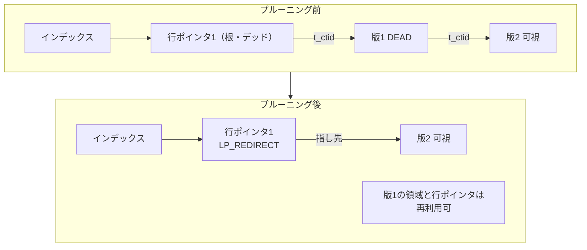
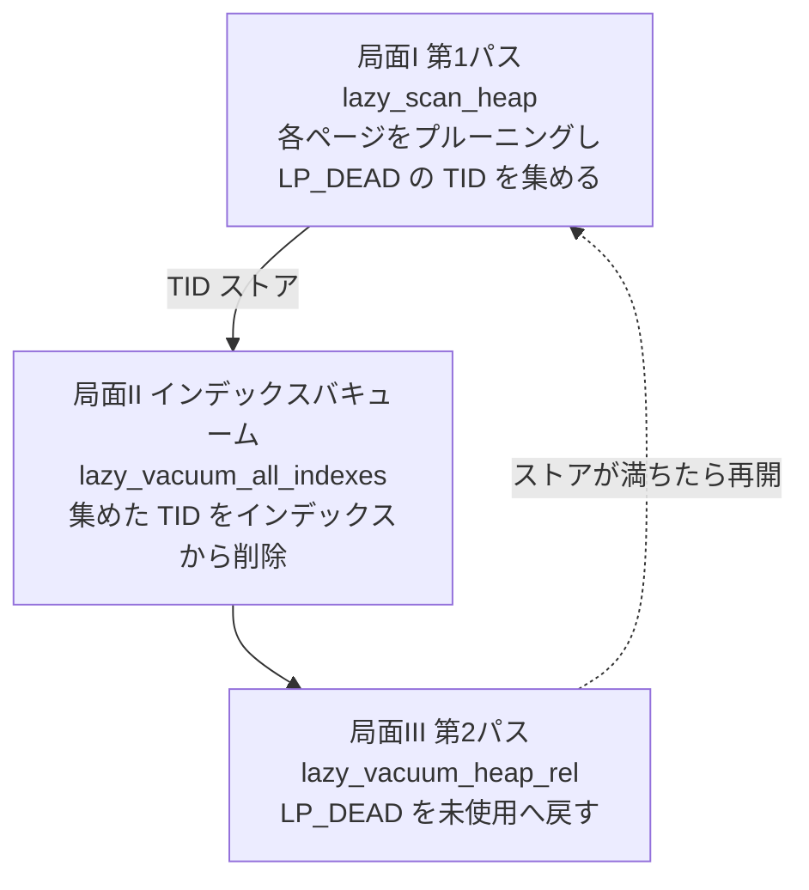

# 第28章 VACUUM と HOT

> **本章で読むソース**
>
> - [`src/backend/access/heap/heapam.c`](https://github.com/postgres/postgres/blob/REL_18_4/src/backend/access/heap/heapam.c)
> - [`src/backend/access/heap/pruneheap.c`](https://github.com/postgres/postgres/blob/REL_18_4/src/backend/access/heap/pruneheap.c)
> - [`src/backend/access/heap/vacuumlazy.c`](https://github.com/postgres/postgres/blob/REL_18_4/src/backend/access/heap/vacuumlazy.c)

## この章の狙い

第27章で、PostgreSQL の MVCC は行を上書きせず、更新のたびにタプルの新しい版をヒープへ書き足すと読んだ。
古い版は、それを見るスナップショットが1つもなくなった時点で不要になる。
この不要なタプルを**デッドタプル**と呼ぶ。
追記型のストレージは、放っておくとデッドタプルでページが埋まり、テーブルが肥大していく。

本章は、このデッドタプルを回収する3つの機構を、下の層から順に読む。
1つ目は**HOT 更新**で、更新そのものを軽くしてデッドタプルとインデックスエントリの増加を抑える。
2つ目はページ単位の**プルーニング**（刈り取り）で、1ページの中だけでデッドタプルを行ポインタの再利用可能状態へ畳む。
3つ目が VACUUM 本体で、テーブル全体を走査してインデックスとヒープから不要なものを取り除く。

この3つは独立した仕組みではなく、HOT がプルーニングの効きを左右し、プルーニングが VACUUM の仕事量を左右するという依存関係でつながっている。
本章の最適化は、HOT がインデックス更新とテーブル肥大を同時に避ける機構として読む。

## 前提

第24章で、ヒープページが固定長ヘッダと行ポインタ配列とタプル本体の3領域からなると読んだ。
行を外から指す識別子（TID）はバイトオフセットではなく行ポインタの番号であり、この間接層があるおかげでページ内のタプルを物理的に動かしても TID は変わらない。
本章のプルーニングとデフラグは、この間接層の上で成り立つ。

第27章で、各タプルが `t_xmin` と `t_xmax` を持ち、更新時には旧版の `t_ctid` が新版の TID を指して**更新チェーン**を作ると読んだ。
タプルが全トランザクションから不可視（デッド）かどうかは `HeapTupleSatisfiesVacuum` が判定する。
本章はこの可視性判定を使う側であり、判定そのものは前章に譲る。

## HOT 更新がインデックスを増やさない仕組み

通常の更新は、行のどの列を変えても、新版を全インデックスに登録する。
たとえば`name`列だけを更新しても、`name`に索引がなければインデックスへの登録は本来不要なはずである。
**HOT 更新**（Heap Only Tuple）は、この無駄を避ける。
更新がどのインデックスの対象列も変えないなら、新版を同じページに置き、インデックスには一切登録しない。

新版をどう扱うかは、`heap_update` が更新後の配置を決めた後に判定する。
新版が旧版と同じページ（`newbuf == buffer`）に収まり、かつ更新された列の集合`modified_attrs`がインデックス対象列の集合`hot_attrs`と重ならないとき、HOT 更新に切り替える。

[`src/backend/access/heap/heapam.c` L4009-L4030](https://github.com/postgres/postgres/blob/REL_18_4/src/backend/access/heap/heapam.c#L4009-L4030)

```c
	if (newbuf == buffer)
	{
		/*
		 * Since the new tuple is going into the same page, we might be able
		 * to do a HOT update.  Check if any of the index columns have been
		 * changed.
		 */
		if (!bms_overlap(modified_attrs, hot_attrs))
		{
			use_hot_update = true;

			/*
			 * If none of the columns that are used in hot-blocking indexes
			 * were updated, we can apply HOT, but we do still need to check
			 * if we need to update the summarizing indexes, and update those
			 * indexes if the columns were updated, or we may fail to detect
			 * e.g. value bound changes in BRIN minmax indexes.
			 */
			if (bms_overlap(modified_attrs, sum_attrs))
				summarized_update = true;
		}
	}
```

ここで使う`hot_attrs`は`INDEX_ATTR_BITMAP_HOT_BLOCKING`、すなわち HOT を妨げるインデックスの対象列だけを集めたビットマップである。

[`src/backend/access/heap/heapam.c` L3325-L3336](https://github.com/postgres/postgres/blob/REL_18_4/src/backend/access/heap/heapam.c#L3325-L3336)

```c
	hot_attrs = RelationGetIndexAttrBitmap(relation,
										   INDEX_ATTR_BITMAP_HOT_BLOCKING);
	sum_attrs = RelationGetIndexAttrBitmap(relation,
										   INDEX_ATTR_BITMAP_SUMMARIZED);
	key_attrs = RelationGetIndexAttrBitmap(relation, INDEX_ATTR_BITMAP_KEY);
	id_attrs = RelationGetIndexAttrBitmap(relation,
										  INDEX_ATTR_BITMAP_IDENTITY_KEY);
	interesting_attrs = NULL;
	interesting_attrs = bms_add_members(interesting_attrs, hot_attrs);
	interesting_attrs = bms_add_members(interesting_attrs, sum_attrs);
	interesting_attrs = bms_add_members(interesting_attrs, key_attrs);
	interesting_attrs = bms_add_members(interesting_attrs, id_attrs);
```

BRIN のようにタプル個別の TID を持たず、ブロック単位の要約だけを保つインデックスは、HOT を妨げない。
要約インデックスは個別タプルを参照しないため VACUUM で TID を消す必要がなく、HOT チェーンの根を新しく作る必要もないからである。
この種のインデックスの対象列だけが変わったときは、HOT を適用したうえで要約インデックスへ値の変化だけを伝える（`summarized_update`）。

HOT が成立したとき、旧版に`HEAP_HOT_UPDATED`、新版に`HEAP_ONLY_TUPLE`の印を付ける。

[`src/backend/access/heap/heapam.c` L4066-L4081](https://github.com/postgres/postgres/blob/REL_18_4/src/backend/access/heap/heapam.c#L4066-L4081)

```c
	if (use_hot_update)
	{
		/* Mark the old tuple as HOT-updated */
		HeapTupleSetHotUpdated(&oldtup);
		/* And mark the new tuple as heap-only */
		HeapTupleSetHeapOnly(heaptup);
		/* Mark the caller's copy too, in case different from heaptup */
		HeapTupleSetHeapOnly(newtup);
	}
	else
	{
		/* Make sure tuples are correctly marked as not-HOT */
		HeapTupleClearHotUpdated(&oldtup);
		HeapTupleClearHeapOnly(heaptup);
		HeapTupleClearHeapOnly(newtup);
	}
```

`HEAP_ONLY_TUPLE`の印が付いた新版は、インデックスから直接は指されない**ヒープ専用タプル**である。
旧版の`t_ctid`は、HOT 更新かどうかにかかわらず新版の TID を指す。

[`src/backend/access/heap/heapam.c` L4096-L4097](https://github.com/postgres/postgres/blob/REL_18_4/src/backend/access/heap/heapam.c#L4096-L4097)

```c
	/* record address of new tuple in t_ctid of old one */
	oldtup.t_data->t_ctid = heaptup->t_self;
```

こうして、インデックスは旧版（根タプル）だけを指し、そこから`t_ctid`をたどって新版に届く1本の鎖ができる。
これが**HOT チェーン**である。
鎖が同じページ内に閉じているため、たどるのに追加のページ読み込みは要らない。

### 変更列の判定はビット列の一致で行う

`modified_attrs`は`HeapDetermineColumnsInfo`が作る。
注目列ごとに旧版と新版の値を取り出し、等しくない列を`modified`へ加える。

[`src/backend/access/heap/heapam.c` L4395-L4455](https://github.com/postgres/postgres/blob/REL_18_4/src/backend/access/heap/heapam.c#L4395-L4455)

```c
static Bitmapset *
HeapDetermineColumnsInfo(Relation relation,
						 Bitmapset *interesting_cols,
						 Bitmapset *external_cols,
						 HeapTuple oldtup, HeapTuple newtup,
						 bool *has_external)
{
	int			attidx;
	Bitmapset  *modified = NULL;
	TupleDesc	tupdesc = RelationGetDescr(relation);

	attidx = -1;
	while ((attidx = bms_next_member(interesting_cols, attidx)) >= 0)
	{
		/* attidx is zero-based, attrnum is the normal attribute number */
		AttrNumber	attrnum = attidx + FirstLowInvalidHeapAttributeNumber;
		Datum		value1,
					value2;
		bool		isnull1,
					isnull2;

		/*
		 * If it's a whole-tuple reference, say "not equal".  It's not really
		 * worth supporting this case, since it could only succeed after a
		 * no-op update, which is hardly a case worth optimizing for.
		 */
		if (attrnum == 0)
		{
			modified = bms_add_member(modified, attidx);
			continue;
		}

		/*
		 * Likewise, automatically say "not equal" for any system attribute
		 * other than tableOID; we cannot expect these to be consistent in a
		 * HOT chain, or even to be set correctly yet in the new tuple.
		 */
		if (attrnum < 0)
		{
			if (attrnum != TableOidAttributeNumber)
			{
				modified = bms_add_member(modified, attidx);
				continue;
			}
		}

		/*
		 * Extract the corresponding values.  XXX this is pretty inefficient
		 * if there are many indexed columns.  Should we do a single
		 * heap_deform_tuple call on each tuple, instead?	But that doesn't
		 * work for system columns ...
		 */
		value1 = heap_getattr(oldtup, attrnum, tupdesc, &isnull1);
		value2 = heap_getattr(newtup, attrnum, tupdesc, &isnull2);

		if (!heap_attr_equals(tupdesc, attrnum, value1,
							  value2, isnull1, isnull2))
		{
			modified = bms_add_member(modified, attidx);
			continue;
		}
```

ここで使う`heap_attr_equals`は、データ型ごとの等価演算子ではなくビット表現の一致で比べる。
1つのデータ型に複数の等価の定義があり得るのに対し、そのインデックスにとってどれが正しいかをここで知る手段がないからである。
ビット表現が一致すれば、どの定義から見ても等しいとみなせるという保守的な前提を取っている。

## HOT チェーンをたどるインデックススキャン

インデックスが指すのは根タプルだけである。
そこから可視な版へ届くため、インデックススキャンは`heap_hot_search_buffer`でチェーンをたどる。

[`src/backend/access/heap/heapam.c` L1716-L1767](https://github.com/postgres/postgres/blob/REL_18_4/src/backend/access/heap/heapam.c#L1716-L1767)

```c
bool
heap_hot_search_buffer(ItemPointer tid, Relation relation, Buffer buffer,
					   Snapshot snapshot, HeapTuple heapTuple,
					   bool *all_dead, bool first_call)
{
	Page		page = BufferGetPage(buffer);
	TransactionId prev_xmax = InvalidTransactionId;
	BlockNumber blkno;
	OffsetNumber offnum;
	bool		at_chain_start;
	bool		valid;
	bool		skip;
	GlobalVisState *vistest = NULL;

	/* If this is not the first call, previous call returned a (live!) tuple */
	if (all_dead)
		*all_dead = first_call;

	blkno = ItemPointerGetBlockNumber(tid);
	offnum = ItemPointerGetOffsetNumber(tid);
	at_chain_start = first_call;
	skip = !first_call;

	/* XXX: we should assert that a snapshot is pushed or registered */
	Assert(TransactionIdIsValid(RecentXmin));
	Assert(BufferGetBlockNumber(buffer) == blkno);

	/* Scan through possible multiple members of HOT-chain */
	for (;;)
	{
		ItemId		lp;

		/* check for bogus TID */
		if (offnum < FirstOffsetNumber || offnum > PageGetMaxOffsetNumber(page))
			break;

		lp = PageGetItemId(page, offnum);

		/* check for unused, dead, or redirected items */
		if (!ItemIdIsNormal(lp))
		{
			/* We should only see a redirect at start of chain */
			if (ItemIdIsRedirected(lp) && at_chain_start)
			{
				/* Follow the redirect */
				offnum = ItemIdGetRedirect(lp);
				at_chain_start = false;
				continue;
			}
			/* else must be end of chain */
			break;
		}
```

チェーンの先頭で行ポインタが正常でなければ、そこが**リダイレクト行ポインタ**（後述）かどうかを見る。
リダイレクトなら指し先の行ポインタへ飛ぶ。
それ以外の状態（未使用、デッド）ならチェーンの終端である。

正常なタプルに着いたら、次の版へ進む前に`t_xmin`が直前の`t_xmax`と一致するかを確かめる。

[`src/backend/access/heap/heapam.c` L1786-L1793](https://github.com/postgres/postgres/blob/REL_18_4/src/backend/access/heap/heapam.c#L1786-L1793)

```c
		/*
		 * The xmin should match the previous xmax value, else chain is
		 * broken.
		 */
		if (TransactionIdIsValid(prev_xmax) &&
			!TransactionIdEquals(prev_xmax,
								 HeapTupleHeaderGetXmin(heapTuple->t_data)))
			break;
```

HOT 更新をしたトランザクションが、`t_ctid`をたどっている最中に中断する可能性がある。
中断後にプルーニングが走れば、指し先の行ポインタが未使用やデッドに変わり、別の用途で再利用されることさえある。
そのため、ピンを持っているだけでは安全を保証できず、`t_xmin`と`t_xmax`の一致をその場で確かめることが必要になる。
一致しなければ、そこでチェーンの終端とみなす。

可視なタプルが見つかれば、その TID を返す。
たどる範囲は1ページに閉じているので、チェーンが何段あってもページ追加読み込みは生じない。


## ページ単位のプルーニング

更新を重ねると、HOT チェーンの前方にデッドタプルがたまる。
これを1ページの中だけで畳むのが**プルーニング**（刈り取り）である。
プルーニングはインデックスを走査せず、ヒープページ1枚に対する操作で完結する。

通常の VACUUM は、デッドタプルを消す前にそれを指すインデックスエントリを全て消さなければならず、そのためにインデックスを走査する。
このコストは多数のデッドタプルへ分散してこそ見合うものであり、数個のタプルを回収するために払うには重すぎる。
HOT チェーンの中間タプルはインデックスから指されていないため、この問題を回避できる。
インデックスを触らずに畳めるのは、HOT 専用タプルにインデックスエントリが存在しないからである。

### プルーニングの起点

通常のスキャンや更新の途中でページに触れたとき、`heap_page_prune_opt`が機を見てプルーニングを試みる。
これは投機的な関数で、ページがプルーニングの候補に見え、かつクリーンアップロックを待たずに取れるときだけ実行する。

[`src/backend/access/heap/pruneheap.c` L226-L246](https://github.com/postgres/postgres/blob/REL_18_4/src/backend/access/heap/pruneheap.c#L226-L246)

```c
	/*
	 * We prune when a previous UPDATE failed to find enough space on the page
	 * for a new tuple version, or when free space falls below the relation's
	 * fill-factor target (but not less than 10%).
	 *
	 * Checking free space here is questionable since we aren't holding any
	 * lock on the buffer; in the worst case we could get a bogus answer. It's
	 * unlikely to be *seriously* wrong, though, since reading either pd_lower
	 * or pd_upper is probably atomic.  Avoiding taking a lock seems more
	 * important than sometimes getting a wrong answer in what is after all
	 * just a heuristic estimate.
	 */
	minfree = RelationGetTargetPageFreeSpace(relation,
											 HEAP_DEFAULT_FILLFACTOR);
	minfree = Max(minfree, BLCKSZ / 10);

	if (PageIsFull(page) || PageGetHeapFreeSpace(page) < minfree)
	{
		/* OK, try to get exclusive buffer lock */
		if (!ConditionalLockBufferForCleanup(buffer))
			return;
```

空き領域がフィルファクタの目標（ただし10%は下回らない）を割ったとき、あるいは直前の更新が新版を置く空きを見つけられずページに満杯の印を付けたときに、プルーニングが起きる。
こうしてプルーニングは UPDATE と DELETE と SELECT のいずれからも誘発され、VACUUM を待たずに空間を回収する。

### HOT チェーンを畳む

ページのプルーニングの本体は`heap_page_prune_and_freeze`で、ページを走査して変更の計画を作り、それをまとめてクリティカルセクションで適用する。
チェーンを1本ずつ処理するのが`heap_prune_chain`である。

[`src/backend/access/heap/pruneheap.c` L1153-L1197](https://github.com/postgres/postgres/blob/REL_18_4/src/backend/access/heap/pruneheap.c#L1153-L1197)

```c
process_chain:

	if (ndeadchain == 0)
	{
		/*
		 * No DEAD tuple was found, so the chain is entirely composed of
		 * normal, unchanged tuples.  Leave it alone.
		 */
		int			i = 0;

		if (ItemIdIsRedirected(rootlp))
		{
			heap_prune_record_unchanged_lp_redirect(prstate, rootoffnum);
			i++;
		}
		for (; i < nchain; i++)
			heap_prune_record_unchanged_lp_normal(page, prstate, chainitems[i]);
	}
	else if (ndeadchain == nchain)
	{
		/*
		 * The entire chain is dead.  Mark the root line pointer LP_DEAD, and
		 * fully remove the other tuples in the chain.
		 */
		heap_prune_record_dead_or_unused(prstate, rootoffnum, ItemIdIsNormal(rootlp));
		for (int i = 1; i < nchain; i++)
			heap_prune_record_unused(prstate, chainitems[i], true);
	}
	else
	{
		/*
		 * We found a DEAD tuple in the chain.  Redirect the root line pointer
		 * to the first non-DEAD tuple, and mark as unused each intermediate
		 * item that we are able to remove from the chain.
		 */
		heap_prune_record_redirect(prstate, rootoffnum, chainitems[ndeadchain],
								   ItemIdIsNormal(rootlp));
		for (int i = 1; i < ndeadchain; i++)
			heap_prune_record_unused(prstate, chainitems[i], true);

		/* the rest of tuples in the chain are normal, unchanged tuples */
		for (int i = ndeadchain; i < nchain; i++)
			heap_prune_record_unchanged_lp_normal(page, prstate, chainitems[i]);
	}
}
```

チェーンの状態は3つに分かれる。
デッドが1つもなければ、その鎖は触らない。
鎖全体がデッドなら、根の行ポインタを`LP_DEAD`にし、残りの行ポインタを未使用へ戻す。
鎖の前方にだけデッドがあるなら、根の行ポインタを最初の非デッドタプルへ向ける**リダイレクト行ポインタ**にし、間に挟まったデッドの行ポインタを未使用へ戻す。

リダイレクト行ポインタが、HOT の鍵である。
インデックスが指す根の行ポインタは消せない。
消すとインデックスから可視タプルへ届く道が切れるからである。
そこで根の行ポインタを、実タプルを持たず別の行ポインタを指すだけのリダイレクトに変える。
インデックスは同じ番号の行ポインタを指したまま、その先の可視タプルへ届く。

未使用へ戻った行ポインタと、それが指していたタプルの領域は、後続の挿入が再利用できる。
ヒープ専用タプルにはインデックスエントリがないため、この畳み込みはインデックスを一切触らずに済む。



## VACUUM 本体の2パス構造

プルーニングはヒープページの中だけを片付ける。
インデックスエントリの削除と、`LP_DEAD`になった行ポインタの最終的な回収は、テーブル全体を見渡す VACUUM の仕事である。
`heap_vacuum_rel`が起点となる。

[`src/backend/access/heap/vacuumlazy.c` L614-L616](https://github.com/postgres/postgres/blob/REL_18_4/src/backend/access/heap/vacuumlazy.c#L614-L616)

```c
void
heap_vacuum_rel(Relation rel, VacuumParams *params,
				BufferAccessStrategy bstrategy)
```

VACUUM がヒープを片付ける手順は、ファイル冒頭のコメントが3つの局面として整理している。

[`src/backend/access/heap/vacuumlazy.c` L6-L22](https://github.com/postgres/postgres/blob/REL_18_4/src/backend/access/heap/vacuumlazy.c#L6-L22)

```c
 * Heap relations are vacuumed in three main phases. In phase I, vacuum scans
 * relation pages, pruning and freezing tuples and saving dead tuples' TIDs in
 * a TID store. If that TID store fills up or vacuum finishes scanning the
 * relation, it progresses to phase II: index vacuuming. Index vacuuming
 * deletes the dead index entries referenced in the TID store. In phase III,
 * vacuum scans the blocks of the relation referred to by the TIDs in the TID
 * store and reaps the corresponding dead items, freeing that space for future
 * tuples.
 *
 * If there are no indexes or index scanning is disabled, phase II may be
 * skipped. If phase I identified very few dead index entries or if vacuum's
 * failsafe mechanism has triggered (to avoid transaction ID wraparound),
 * vacuum may skip phases II and III.
 *
 * If the TID store fills up in phase I, vacuum suspends phase I and proceeds
 * to phases II and III, cleaning up the dead tuples referenced in the current
 * TID store. This empties the TID store, allowing vacuum to resume phase I.
```

局面 I はヒープの第1パスである。
`lazy_scan_heap`がテーブルの先頭から走査し、各ページでプルーニングとフリーズを行い、残った`LP_DEAD`の行ポインタの TID を TID ストアへ集める。
TID を集める部分は`lazy_scan_prune`の中にある。

[`src/backend/access/heap/vacuumlazy.c` L2031-L2040](https://github.com/postgres/postgres/blob/REL_18_4/src/backend/access/heap/vacuumlazy.c#L2031-L2040)

```c
		/*
		 * deadoffsets are collected incrementally in
		 * heap_page_prune_and_freeze() as each dead line pointer is recorded,
		 * with an indeterminate order, but dead_items_add requires them to be
		 * sorted.
		 */
		qsort(presult.deadoffsets, presult.lpdead_items, sizeof(OffsetNumber),
			  cmpOffsetNumbers);

		dead_items_add(vacrel, blkno, presult.deadoffsets, presult.lpdead_items);
```

局面 II はインデックスバキュームである。
`lazy_vacuum`が、集めた TID を使って各インデックスから対応するエントリを削除する。

[`src/backend/access/heap/vacuumlazy.c` L2535-L2542](https://github.com/postgres/postgres/blob/REL_18_4/src/backend/access/heap/vacuumlazy.c#L2535-L2542)

```c
	else if (lazy_vacuum_all_indexes(vacrel))
	{
		/*
		 * We successfully completed a round of index vacuuming.  Do related
		 * heap vacuuming now.
		 */
		lazy_vacuum_heap_rel(vacrel);
	}
```

局面 III はヒープの第2パスである。
`lazy_vacuum_heap_rel`が、TID ストアに記録のあるページだけを再訪し、`LP_DEAD`の行ポインタを未使用へ戻す。
このページ単位の処理が`lazy_vacuum_heap_page`である。

[`src/backend/access/heap/vacuumlazy.c` L2858-L2875](https://github.com/postgres/postgres/blob/REL_18_4/src/backend/access/heap/vacuumlazy.c#L2858-L2875)

```c
	START_CRIT_SECTION();

	for (int i = 0; i < num_offsets; i++)
	{
		ItemId		itemid;
		OffsetNumber toff = deadoffsets[i];

		itemid = PageGetItemId(page, toff);

		Assert(ItemIdIsDead(itemid) && !ItemIdHasStorage(itemid));
		ItemIdSetUnused(itemid);
		unused[nunused++] = toff;
	}

	Assert(nunused > 0);

	/* Attempt to truncate line pointer array now */
	PageTruncateLinePointerArray(page);
```

ヒープを2パスに分ける理由は、`lazy_vacuum_heap_rel`の説明にある。

[`src/backend/access/heap/vacuumlazy.c` L2715-L2717](https://github.com/postgres/postgres/blob/REL_18_4/src/backend/access/heap/vacuumlazy.c#L2715-L2717)

```c
 * Note: the reason for doing this as a second pass is we cannot remove the
 * tuples until we've removed their index entries, and we want to process
 * index entry removal in batches as large as possible.
```

`LP_DEAD`の行ポインタは、それを指すインデックスエントリを全て消すまで未使用へ戻せない。
未使用にした行ポインタは挿入が再利用できるため、もしインデックスエントリが残ったまま再利用されると、そのインデックスエントリが無関係なタプルを指してしまう。
だからヒープの掃除はインデックスバキュームの後に置く。
さらに、インデックスエントリの削除はできるだけ大きなまとまりで処理したい。
そのために、第1パスでテーブル全体（または TID ストアが満ちるまで）の TID を集めてから、第2パスへ進む。



## 最適化の工夫

### HOT がインデックス更新とテーブル肥大を同時に避ける

本章の中心となる最適化は HOT 更新である。
インデックスの対象列を変えない更新は、新版を同じページに置き、インデックスへの登録を完全に省く。
なぜ速いかは2つに分けて言える。

1つ目は、書き込み量の削減である。
インデックスを持つテーブルの更新は、本来テーブルへの1回の書き込みに加え、各インデックスへの登録を伴う。
HOT 更新は、対象列が変わらない限りこのインデックス登録をすべて省く。
更新が触る索引ページが減れば、生成される WAL も減る。

2つ目は、肥大の抑制である。
HOT チェーンの中間デッドタプルは、インデックスを介さずページ単位のプルーニングで畳める。
畳んだ後の領域はそのページの後続挿入が再利用するため、デッドタプルがテーブルとインデックスを膨らませ続けることがない。
HOT を使わない更新では、デッドタプルの回収にインデックス走査を伴う VACUUM が必要になり、回収までの間テーブルとインデックスの双方が肥大する。

### デッドタプルが少なければインデックスバキュームを省く

VACUUM 側にも、HOT と噛み合う最適化がある。
HOT がよく効くテーブルでは、ほとんどの更新がインデックスを触らずに済み、第1パスで集まる`LP_DEAD`の TID はごくわずかになる。
それでも数ページに1つか2つの`LP_DEAD`が残ることは避けにくい。
このとき第1パスのたびに重いインデックス走査を回すと、VACUUM の所要時間とコストが回ごとに大きくぶれてしまう。

`lazy_vacuum`は、TID が十分少ないとき、インデックスバキュームとヒープの第2パスをまるごと省く。

[`src/backend/access/heap/vacuumlazy.c` L2516-L2518](https://github.com/postgres/postgres/blob/REL_18_4/src/backend/access/heap/vacuumlazy.c#L2516-L2518)

```c
		threshold = (double) vacrel->rel_pages * BYPASS_THRESHOLD_PAGES;
		bypass = (vacrel->lpdead_item_pages < threshold &&
				  TidStoreMemoryUsage(vacrel->dead_items) < 32 * 1024 * 1024);
```

`LP_DEAD`を持つページが全体の一定割合（`BYPASS_THRESHOLD_PAGES`）を下回り、かつ TID の保持に使うメモリが32MB を超えないとき、この回はインデックスを走査しない。
わずかに残った`LP_DEAD`は次回以降の VACUUM へ送られる。
これによって、同じ作業負荷のテーブルに対する VACUUM の所要時間とオーバーヘッドの急な段差をならし、ちょうど0個に近いときはあたかも0個であるかのようにふるまわせる。

## まとめ

本章は、追記型のストレージで増えるデッドタプルを回収する3つの機構を、下の層から読んだ。
HOT 更新は、インデックスの対象列を変えない更新を同じページ内でチェーンにつなぎ、インデックスへの登録を省く。
インデックスは根の行ポインタだけを指し、`heap_hot_search_buffer`が`t_xmin`と`t_xmax`の一致を確かめながら鎖をたどる。
ページ単位のプルーニングは、`heap_prune_chain`が HOT チェーンを畳み、根をリダイレクト行ポインタに変え、中間のデッドを行ポインタの再利用可能状態へ戻す。
ここまではすべて1ページ内で完結し、インデックスを触らない。

VACUUM 本体は、ヒープの第1パスで`LP_DEAD`の TID を集め、インデックスバキュームでその TID をインデックスから消し、ヒープの第2パスで行ポインタを未使用へ戻す。
2パスに分けるのは、インデックスエントリを消す前にヒープの行ポインタを再利用してはならず、かつインデックス削除をまとめて処理したいからである。
HOT がよく効くテーブルでは集まる TID が少ないため、`lazy_vacuum`は条件を満たせばインデックス走査ごと省く。

## 関連する章

- [第24章 ページとタプルのレイアウト](../part05-storage-buffer/24-page-and-tuple-layout.md)
- [第27章 MVCC と可視性判定](27-mvcc-and-visibility.md)
- [第29章 空き領域マップと可視性マップ](29-free-space-and-visibility-map.md)
- [第43章 バックグラウンドワーカーと autovacuum](../part10-catalog-utilities/43-background-workers-autovacuum.md)
