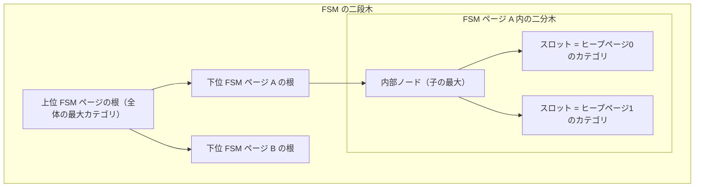
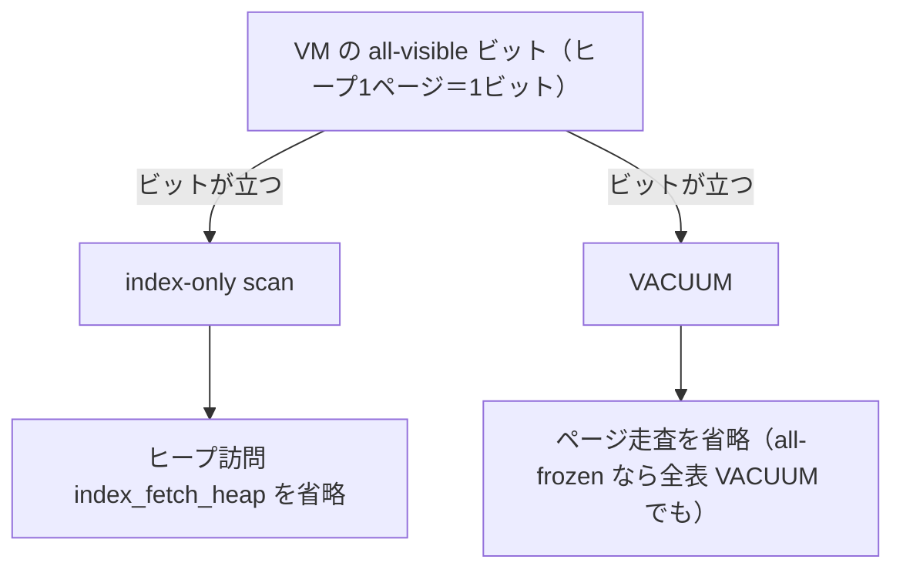

# 第29章 空き領域マップと可視性マップ

> **本章で読むソース**
>
> - [`src/backend/storage/freespace/freespace.c`](https://github.com/postgres/postgres/blob/REL_18_4/src/backend/storage/freespace/freespace.c)
> - [`src/backend/storage/freespace/fsmpage.c`](https://github.com/postgres/postgres/blob/REL_18_4/src/backend/storage/freespace/fsmpage.c)
> - [`src/include/storage/fsm_internals.h`](https://github.com/postgres/postgres/blob/REL_18_4/src/include/storage/fsm_internals.h)
> - [`src/backend/access/heap/visibilitymap.c`](https://github.com/postgres/postgres/blob/REL_18_4/src/backend/access/heap/visibilitymap.c)
> - [`src/include/access/visibilitymapdefs.h`](https://github.com/postgres/postgres/blob/REL_18_4/src/include/access/visibilitymapdefs.h)
> - [`src/backend/executor/nodeIndexonlyscan.c`](https://github.com/postgres/postgres/blob/REL_18_4/src/backend/executor/nodeIndexonlyscan.c)

## この章の狙い

第24章で、ヒープの本体はリレーションの主フォークに並ぶ8KB ページの列であり、各ページがスロット式レイアウトで行を載せると読んだ。
1つのヒープリレーションは主フォークだけで成り立つわけではない。
本体に付随して、ページごとの空き容量を記録する**空き領域マップ**（**FSM**、free space map）と、ページごとの可視性をビットで記録する**可視性マップ**（**VM**、visibility map）という2つの補助フォークが、同じリレーションの中に併存する。

本章は、この2つの補助フォークがそれぞれ何を記録し、どう引かれるかを読む。
FSM は、行を1つ挿入するときに「十分な空きを持つページ」を主フォーク全体から素早く選ぶための索引である。
VM は、あるヒープページが「全タプル可視」「全タプル凍結」かを2ビットで示し、index-only scan のヒープ訪問と VACUUM のページ走査を省くための索引である。

どちらも、本体を毎回なめ直す代わりに、本体より桁違いに小さい補助構造を引いて答えを得る点で共通する。
FSM は木構造で空きページ探索を対数時間に縮め、VM は1ビットの確認でヒープ1ページ分の読み取りを丸ごと省く。
本章の最適化は、この VM の all-visible ビットが index-only scan と VACUUM の両方を加速する機構として最後に読む。

## 前提

第24章で、ヒープページのスロット式レイアウトと、`pd_lower`/`pd_upper` に挟まれた空き領域を読んだ。
本章の FSM は、その空き領域の量をページごとに1バイトへ要約して持つ。
タプルの可視性そのもの（`t_xmin`/`t_xmax` を使った MVCC 判定）は第27章で、不要タプルを取り除くプルーニングと VACUUM は第28章で扱う。
本章はその結果を要約する2つのマップに集中し、可視性判定の機構自体は第27章に譲る。

リレーションが主フォークのほかに FSM フォーク（`_fsm`）と VM フォーク（`_vm`）を持つことは、第21章のストレージマネージャがフォーク番号でフォークを区別する仕組みの上に成り立つ。
FSM と VM はそれぞれ独立したフォークであり、本体と同じく8KB ページの列としてバッファマネージャ経由で読み書きされる。

## 空き領域マップが解く問題

ヒープへ行を1つ挿入するとき、その行を載せるページを決める必要がある。
末尾ページへ追記し続けるだけなら、削除や更新で生じた途中ページの空きを永久に使えず、リレーションが際限なく膨らむ。
かといって、空きを持つページを探すために主フォークを毎回先頭からなめるのは、ページ数に比例する読み取りを挿入のたびに払うことになる。

FSM は、各ヒープページの空き容量を1バイトのカテゴリへ要約し、それらを木構造に積み上げることで、この探索を主フォークのページ数の対数に縮める。
空き容量を1バイトに丸めるのは、FSM 自体を小さく保ち、本体の数百分の一のページ数で全ページの空きを表すためである。

[`src/backend/storage/freespace/freespace.c` L36-L66](https://github.com/postgres/postgres/blob/REL_18_4/src/backend/storage/freespace/freespace.c#L36-L66)

```c
/*
 * We use just one byte to store the amount of free space on a page, so we
 * divide the amount of free space a page can have into 256 different
 * categories. The highest category, 255, represents a page with at least
 * MaxFSMRequestSize bytes of free space, and the second highest category
 * represents the range from 254 * FSM_CAT_STEP, inclusive, to
 * MaxFSMRequestSize, exclusive.
 *
 * MaxFSMRequestSize depends on the architecture and BLCKSZ, but assuming
 * default 8k BLCKSZ, and that MaxFSMRequestSize is 8164 bytes, the
 * categories look like this:
 *
 *
 * Range	 Category
 * 0	- 31   0
 * 32	- 63   1
 * ...    ...  ...
 * 8096 - 8127 253
 * 8128 - 8163 254
 * 8164 - 8192 255
 *
 * The reason that MaxFSMRequestSize is special is that if MaxFSMRequestSize
 * isn't equal to a range boundary, a page with exactly MaxFSMRequestSize
 * bytes of free space wouldn't satisfy a request for MaxFSMRequestSize
 * bytes. If there isn't more than MaxFSMRequestSize bytes of free space on a
 * completely empty page, that would mean that we could never satisfy a
 * request of exactly MaxFSMRequestSize bytes.
 */
#define FSM_CATEGORIES	256
#define FSM_CAT_STEP	(BLCKSZ / FSM_CATEGORIES)
#define MaxFSMRequestSize	MaxHeapTupleSize
```

空き容量はバイト数のまま持たず、`FSM_CAT_STEP`（8KB ページなら32バイト）刻みの256段階のカテゴリへ丸める。
カテゴリ0は実質的に空きなし、カテゴリ255は1タプルが必ず入る最大サイズ `MaxFSMRequestSize` 以上を表す。
挿入の必要量も同じカテゴリへ変換し、「必要カテゴリ以上の空きを持つページ」を探す問題に帰着させる。

## 二段の木構造

FSM が対数時間で答えを出せるのは、二段の木構造を持つからである。
一段目は1つの FSM ページの内部にある二分木で、二段目は FSM ページどうしを束ねる多段木である。

一段目について、`fsm_internals.h` の `FSMPageData` が FSM ページの中身を定める。
ページ内の各バイトは `fp_nodes` という配列に並び、この配列が二分木として解釈される。

[`src/include/storage/fsm_internals.h` L20-L61](https://github.com/postgres/postgres/blob/REL_18_4/src/include/storage/fsm_internals.h#L20-L61)

```c
/*
 * Structure of a FSM page. See src/backend/storage/freespace/README for
 * details.
 */
typedef struct
{
	/*
	 * fsm_search_avail() tries to spread the load of multiple backends by
	 * returning different pages to different backends in a round-robin
	 * fashion. fp_next_slot points to the next slot to be returned (assuming
	 * there's enough space on it for the request). It's defined as an int,
	 * because it's updated without an exclusive lock. uint16 would be more
	 * appropriate, but int is more likely to be atomically
	 * fetchable/storable.
	 */
	int			fp_next_slot;

	/*
	 * fp_nodes contains the binary tree, stored in array. The first
	 * NonLeafNodesPerPage elements are upper nodes, and the following
	 * LeafNodesPerPage elements are leaf nodes. Unused nodes are zero.
	 */
	uint8		fp_nodes[FLEXIBLE_ARRAY_MEMBER];
} FSMPageData;

typedef FSMPageData *FSMPage;

/*
 * Number of non-leaf and leaf nodes, and nodes in total, on an FSM page.
 * These definitions are internal to fsmpage.c.
 */
#define NodesPerPage (BLCKSZ - MAXALIGN(SizeOfPageHeaderData) - \
					  offsetof(FSMPageData, fp_nodes))

#define NonLeafNodesPerPage (BLCKSZ / 2 - 1)
#define LeafNodesPerPage (NodesPerPage - NonLeafNodesPerPage)

/*
 * Number of FSM "slots" on a FSM page. This is what should be used
 * outside fsmpage.c.
 */
#define SlotsPerFSMPage LeafNodesPerPage
```

葉ノード（**スロット**）の1つ1つが、ヒープ1ページ分のカテゴリを持つ。
内部ノードは、2つの子の最大値を持つ。
したがって木の根は、その FSM ページが受け持つ全スロットの空きカテゴリの最大値になる。
根の値が必要カテゴリに満たなければ、そのページ配下に挿入先候補が1つも無いと、根を1バイト読むだけで判定できる。

二段目について、1つの FSM ページに収まる葉スロットは `SlotsPerFSMPage` 個（8KB なら数千個）に限られる。
ヒープのページ数がこれを超えると、FSM ページを複数並べ、それらの根の値をさらに上位の FSM ページの葉へ集約する。
この多段木の深さは `FSM_TREE_DEPTH` で、8KB ページなら3段で2^32 個近いブロックを表せる。

[`src/backend/storage/freespace/freespace.c` L68-L78](https://github.com/postgres/postgres/blob/REL_18_4/src/backend/storage/freespace/freespace.c#L68-L78)

```c
/*
 * Depth of the on-disk tree. We need to be able to address 2^32-1 blocks,
 * and 1626 is the smallest number that satisfies X^3 >= 2^32-1. Likewise,
 * 256 is the smallest number that satisfies X^4 >= 2^32-1. In practice,
 * this means that 4096 bytes is the smallest BLCKSZ that we can get away
 * with a 3-level tree, and 512 is the smallest we support.
 */
#define FSM_TREE_DEPTH	((SlotsPerFSMPage >= 1626) ? 3 : 4)

#define FSM_ROOT_LEVEL	(FSM_TREE_DEPTH - 1)
#define FSM_BOTTOM_LEVEL 0
```

ページ内の二分木と、FSM ページどうしの多段木は、どちらも「各ノードが配下の最大空きを持つ」という同じ規則で積み上がる。
この入れ子の最大値木があるおかげで、空きページ探索は根から葉へ下る1本の経路に限定でき、全体としてヒープのページ数の対数で済む。



## 挿入先候補を引く `GetPageWithFreeSpace`

ヒープへの挿入は、必要バイト数を渡して挿入先候補のブロック番号を得るところから始まる。
その入口が `GetPageWithFreeSpace` である。

[`src/backend/storage/freespace/freespace.c` L136-L142](https://github.com/postgres/postgres/blob/REL_18_4/src/backend/storage/freespace/freespace.c#L136-L142)

```c
BlockNumber
GetPageWithFreeSpace(Relation rel, Size spaceNeeded)
{
	uint8		min_cat = fsm_space_needed_to_cat(spaceNeeded);

	return fsm_search(rel, min_cat);
}
```

必要バイト数 `spaceNeeded` を `fsm_space_needed_to_cat` でカテゴリへ丸め、`fsm_search` へ渡すだけである。
戻り値はブロック番号、または候補が見つからなければ `InvalidBlockNumber` で、後者のときは呼び出し元がリレーションを拡張する。
ここで重要なのは、FSM が返すのはあくまで「候補」だという点である。
返ったページにロックを取ってみたら、別のバックエンドが先に埋めていて空きが足りない場合がある。
そのときは実際の空き量を `RecordAndGetPageWithFreeSpace` で書き戻して、もう一度探す。

挿入後にページの新しい空き量を FSM へ反映するのが `RecordPageWithFreeSpace` である。

[`src/backend/storage/freespace/freespace.c` L193-L204](https://github.com/postgres/postgres/blob/REL_18_4/src/backend/storage/freespace/freespace.c#L193-L204)

```c
void
RecordPageWithFreeSpace(Relation rel, BlockNumber heapBlk, Size spaceAvail)
{
	int			new_cat = fsm_space_avail_to_cat(spaceAvail);
	FSMAddress	addr;
	uint16		slot;

	/* Get the location of the FSM byte representing the heap block */
	addr = fsm_get_location(heapBlk, &slot);

	fsm_set_and_search(rel, addr, slot, new_cat, 0);
}
```

ヒープのブロック番号 `heapBlk` を `fsm_get_location` で「どの FSM ページのどのスロットか」へ変換し、そのスロットへ新しいカテゴリを書く。
`fsm_get_location` は、ブロック番号を `SlotsPerFSMPage` で割って FSM ページ番号を、余りでページ内スロット番号を得る。

[`src/backend/storage/freespace/freespace.c` L500-L510](https://github.com/postgres/postgres/blob/REL_18_4/src/backend/storage/freespace/freespace.c#L500-L510)

```c
static FSMAddress
fsm_get_location(BlockNumber heapblk, uint16 *slot)
{
	FSMAddress	addr;

	addr.level = FSM_BOTTOM_LEVEL;
	addr.logpageno = heapblk / SlotsPerFSMPage;
	*slot = heapblk % SlotsPerFSMPage;

	return addr;
}
```

スロットの値を書き換えると、その葉から根までの内部ノード（各々が子の最大値を持つ）も更新する必要がある。
`fsm_set_and_search` がその更新を担い、ついでに同じ FSM ページ内に条件を満たす別スロットがあればそれを返すことで、書き込みと探索を1回のロックでまとめている。

## 木を下る `fsm_search`

`fsm_search` が、二段木を根から葉へ下って挿入先候補を見つける本体である。
ループの各回で1つの FSM ページを読み、その中の二分木を `fsm_search_avail` で探索し、見つかったスロットに対応する下位 FSM ページへ降りていく。

[`src/backend/storage/freespace/freespace.c` L687-L721](https://github.com/postgres/postgres/blob/REL_18_4/src/backend/storage/freespace/freespace.c#L687-L721)

```c
static BlockNumber
fsm_search(Relation rel, uint8 min_cat)
{
	int			restarts = 0;
	FSMAddress	addr = FSM_ROOT_ADDRESS;

	for (;;)
	{
		int			slot;
		Buffer		buf;
		uint8		max_avail = 0;

		/* Read the FSM page. */
		buf = fsm_readbuf(rel, addr, false);

		/* Search within the page */
		if (BufferIsValid(buf))
		{
			LockBuffer(buf, BUFFER_LOCK_SHARE);
			slot = fsm_search_avail(buf, min_cat,
									(addr.level == FSM_BOTTOM_LEVEL),
									false);
			if (slot == -1)
			{
				max_avail = fsm_get_max_avail(BufferGetPage(buf));
				UnlockReleaseBuffer(buf);
			}
			else
			{
				/* Keep the pin for possible update below */
				LockBuffer(buf, BUFFER_LOCK_UNLOCK);
			}
		}
		else
			slot = -1;
```

探索は根 `FSM_ROOT_ADDRESS` から始まる。
ページ内で条件を満たすスロットが見つかれば、最下層に着くまで `fsm_get_child` でそのスロットの子 FSM ページへ降り、最下層に着いたらそのスロットが指すヒープブロック番号を返す。
最下層で見つからず、しかも根まで戻ってもなお見つからなければ `InvalidBlockNumber` を返す。

途中の階層で見つからなかった場合は、上位ノードが下位ページの実態より大きい古い値を持っていたことを意味する。
このとき `fsm_search` は上位ノードを正しい値へ更新してから探索をやり直し、同じ罠に二度落ちないようにする。
FSM はあくまで近似であり、上位ノードの値が下位の実態から多少ずれていても、こうして自己修復しながら正しいページへ収束する。

## ページ内二分木の探索 `fsm_search_avail`

1つの FSM ページの中で条件を満たすスロットを見つけるのが `fsm_search_avail` である。
ここに、ページ内探索を対数時間に保ちつつ複数バックエンドの集中を散らす工夫がある。

[`src/backend/storage/freespace/fsmpage.c` L157-L184](https://github.com/postgres/postgres/blob/REL_18_4/src/backend/storage/freespace/fsmpage.c#L157-L184)

```c
int
fsm_search_avail(Buffer buf, uint8 minvalue, bool advancenext,
				 bool exclusive_lock_held)
{
	Page		page = BufferGetPage(buf);
	FSMPage		fsmpage = (FSMPage) PageGetContents(page);
	int			nodeno;
	int			target;
	uint16		slot;

restart:

	/*
	 * Check the root first, and exit quickly if there's no leaf with enough
	 * free space
	 */
	if (fsmpage->fp_nodes[0] < minvalue)
		return -1;

	/*
	 * Start search using fp_next_slot.  It's just a hint, so check that it's
	 * sane.  (This also handles wrapping around when the prior call returned
	 * the last slot on the page.)
	 */
	target = fsmpage->fp_next_slot;
	if (target < 0 || target >= LeafNodesPerPage)
		target = 0;
	target += NonLeafNodesPerPage;
```

まず木の根 `fp_nodes[0]` を1バイト読み、必要量 `minvalue` に満たなければ即座に `-1` を返す。
これがページ全体を読まずに「このページには候補なし」と判定する最初の枝刈りである。

根が条件を満たすなら、`fp_next_slot` というヒントが指す葉を起点に探索を始める。
このヒントは、前回この関数が返したスロットの隣を指すように更新される値で、複数のバックエンドが毎回ページ先頭の同じ葉へ殺到するのを避ける役割を持つ。
起点から右へ動いて親へ登る操作を繰り返すと、探索範囲が一歩ごとに倍になり、N 個の葉を log2(N) の手数で走査できる。

[`src/backend/storage/freespace/fsmpage.c` L186-L238](https://github.com/postgres/postgres/blob/REL_18_4/src/backend/storage/freespace/fsmpage.c#L186-L238)

```c
	/*----------
	 * Start the search from the target slot.  At every step, move one
	 * node to the right, then climb up to the parent.  Stop when we reach
	 * a node with enough free space (as we must, since the root has enough
	 * space).
	 *
	 * The idea is to gradually expand our "search triangle", that is, all
	 * nodes covered by the current node, and to be sure we search to the
	 * right from the start point.  At the first step, only the target slot
	 * is examined.  When we move up from a left child to its parent, we are
	 * adding the right-hand subtree of that parent to the search triangle.
	 * When we move right then up from a right child, we are dropping the
	 * current search triangle (which we know doesn't contain any suitable
	 * page) and instead looking at the next-larger-size triangle to its
	 * right.  So we never look left from our original start point, and at
	 * each step the size of the search triangle doubles, ensuring it takes
	 * only log2(N) work to search N pages.
	 *
	 * The "move right" operation will wrap around if it hits the right edge
	 * of the tree, so the behavior is still good if we start near the right.
	 * Note also that the move-and-climb behavior ensures that we can't end
	 * up on one of the missing nodes at the right of the leaf level.
	 *
	 * For example, consider this tree:
	 *
	 *		   7
	 *	   7	   6
	 *	 5	 7	 6	 5
	 *	4 5 5 7 2 6 5 2
	 *				T
	 *
	 * Assume that the target node is the node indicated by the letter T,
	 * and we're searching for a node with value of 6 or higher. The search
	 * begins at T. At the first iteration, we move to the right, then to the
	 * parent, arriving at the rightmost 5. At the second iteration, we move
	 * to the right, wrapping around, then climb up, arriving at the 7 on the
	 * third level.  7 satisfies our search, so we descend down to the bottom,
	 * following the path of sevens.  This is in fact the first suitable page
	 * to the right of (allowing for wraparound) our start point.
	 *----------
	 */
	nodeno = target;
	while (nodeno > 0)
	{
		if (fsmpage->fp_nodes[nodeno] >= minvalue)
			break;

		/*
		 * Move to the right, wrapping around on same level if necessary, then
		 * climb up.
		 */
		nodeno = parentof(rightneighbor(nodeno));
	}
```

条件を満たすノードへ達したら、そこから下へ降り、子のうち条件を満たす方（左を優先）をたどって葉へ着く。
各ノードが子の最大値を持つので、上位で「足りる」と判明したノードの下には必ず条件を満たす葉が存在し、降り口を誤らない。

## 可視性マップの2ビット

ここから可視性マップ（VM）に移る。
VM は、ヒープの各ページについて「全タプルが可視」「全タプルが凍結」かを記録する。
記録の単位はヒープ1ページあたり2ビットで、その意味は `visibilitymapdefs.h` が定める。

[`src/include/access/visibilitymapdefs.h` L16-L23](https://github.com/postgres/postgres/blob/REL_18_4/src/include/access/visibilitymapdefs.h#L16-L23)

```c
/* Number of bits for one heap page */
#define BITS_PER_HEAPBLOCK 2

/* Flags for bit map */
#define VISIBILITYMAP_ALL_VISIBLE	0x01
#define VISIBILITYMAP_ALL_FROZEN	0x02
#define VISIBILITYMAP_VALID_BITS	0x03	/* OR of all valid visibilitymap
											 * flags bits */
```

`VISIBILITYMAP_ALL_VISIBLE` ビットは、そのページの全タプルが、すべてのトランザクションから可視であることを示す。
このビットが立ったページには不要タプルが存在しえないので、VACUUM の掃除を要しない。
`VISIBILITYMAP_ALL_FROZEN` ビットは、そのページの全タプルが完全に凍結されていることを示し、周回防止（anti-wraparound）VACUUM のような全表走査でさえこのページを飛ばしてよいことを意味する。
all-frozen は必ず all-visible が立っている前提でのみ立てる、という制約が両ビットの関係を定める。

VM のもう1つの性質は、保守的（conservative）であることである。
ビットが立っていれば条件が真であると確実に言えるが、立っていなくても真の場合がある。
この一方向の保証によって、VM を引いた側は「ビットが立っているなら本体を見なくてよい」と安全に判断でき、立っていなければ本体を確かめればよい。

[`src/backend/access/heap/visibilitymap.c` L25-L35](https://github.com/postgres/postgres/blob/REL_18_4/src/backend/access/heap/visibilitymap.c#L25-L35)

```c
 * The visibility map is a bitmap with two bits (all-visible and all-frozen)
 * per heap page. A set all-visible bit means that all tuples on the page are
 * known visible to all transactions, and therefore the page doesn't need to
 * be vacuumed. A set all-frozen bit means that all tuples on the page are
 * completely frozen, and therefore the page doesn't need to be vacuumed even
 * if whole table scanning vacuum is required (e.g. anti-wraparound vacuum).
 * The all-frozen bit must be set only when the page is already all-visible.
 *
 * The map is conservative in the sense that we make sure that whenever a bit
 * is set, we know the condition is true, but if a bit is not set, it might or
 * might not be true.
```

ヒープ1ページを2ビットで表すので、8KB の VM ページ1枚で `HEAPBLOCKS_PER_PAGE` 枚（おおむね32000枚）のヒープページを表せる。
ヒープブロック番号から VM 上の位置を求める変換が、ページ番号、バイト位置、バイト内オフセットの3つのマクロである。

[`src/backend/access/heap/visibilitymap.c` L110-L121](https://github.com/postgres/postgres/blob/REL_18_4/src/backend/access/heap/visibilitymap.c#L110-L121)

```c
/* Number of heap blocks we can represent in one byte */
#define HEAPBLOCKS_PER_BYTE (BITS_PER_BYTE / BITS_PER_HEAPBLOCK)

/* Number of heap blocks we can represent in one visibility map page. */
#define HEAPBLOCKS_PER_PAGE (MAPSIZE * HEAPBLOCKS_PER_BYTE)

/* Mapping from heap block number to the right bit in the visibility map */
#define HEAPBLK_TO_MAPBLOCK(x) ((x) / HEAPBLOCKS_PER_PAGE)
#define HEAPBLK_TO_MAPBLOCK_LIMIT(x) \
	(((x) + HEAPBLOCKS_PER_PAGE - 1) / HEAPBLOCKS_PER_PAGE)
#define HEAPBLK_TO_MAPBYTE(x) (((x) % HEAPBLOCKS_PER_PAGE) / HEAPBLOCKS_PER_BYTE)
#define HEAPBLK_TO_OFFSET(x) (((x) % HEAPBLOCKS_PER_BYTE) * BITS_PER_HEAPBLOCK)
```

## ビットを読む `visibilitymap_get_status`

VM の状態を読むのが `visibilitymap_get_status` である。
ヒープブロック番号から VM ページ、バイト位置、バイト内オフセットを求め、該当バイトをシフトして2ビットを取り出す。

[`src/backend/access/heap/visibilitymap.c` L342-L381](https://github.com/postgres/postgres/blob/REL_18_4/src/backend/access/heap/visibilitymap.c#L342-L381)

```c
uint8
visibilitymap_get_status(Relation rel, BlockNumber heapBlk, Buffer *vmbuf)
{
	BlockNumber mapBlock = HEAPBLK_TO_MAPBLOCK(heapBlk);
	uint32		mapByte = HEAPBLK_TO_MAPBYTE(heapBlk);
	uint8		mapOffset = HEAPBLK_TO_OFFSET(heapBlk);
	char	   *map;
	uint8		result;

#ifdef TRACE_VISIBILITYMAP
	elog(DEBUG1, "vm_get_status %s %d", RelationGetRelationName(rel), heapBlk);
#endif

	/* Reuse the old pinned buffer if possible */
	if (BufferIsValid(*vmbuf))
	{
		if (BufferGetBlockNumber(*vmbuf) != mapBlock)
		{
			ReleaseBuffer(*vmbuf);
			*vmbuf = InvalidBuffer;
		}
	}

	if (!BufferIsValid(*vmbuf))
	{
		*vmbuf = vm_readbuf(rel, mapBlock, false);
		if (!BufferIsValid(*vmbuf))
			return false;
	}

	map = PageGetContents(BufferGetPage(*vmbuf));

	/*
	 * A single byte read is atomic.  There could be memory-ordering effects
	 * here, but for performance reasons we make it the caller's job to worry
	 * about that.
	 */
	result = ((map[mapByte] >> mapOffset) & VISIBILITYMAP_VALID_BITS);
	return result;
}
```

この関数はロックを取らない。
バイト単位の読み取りはアトミックなので、立っているビットを取り違える危険はない。
ただしメモリ順序の影響で、わずかに古い値を読む可能性がある。
その整合性をどう扱うかは呼び出し元の責務とし、`visibilitymap_get_status` 自身は最小の手数で2ビットを返すことに徹する。
引数の `vmbuf` は前回ピンしたバッファを再利用するための入出力で、連続するヒープページが同じ VM ページに属する間はバッファの再取得を省ける。

ビットを取り出す細かなマスク演算を隠し、意図を明示するためのマクロが `VM_ALL_VISIBLE` と `VM_ALL_FROZEN` である。

[`src/include/access/visibilitymap.h` L23-L27](https://github.com/postgres/postgres/blob/REL_18_4/src/include/access/visibilitymap.h#L23-L27)

```c
/* Macros for visibilitymap test */
#define VM_ALL_VISIBLE(r, b, v) \
	((visibilitymap_get_status((r), (b), (v)) & VISIBILITYMAP_ALL_VISIBLE) != 0)
#define VM_ALL_FROZEN(r, b, v) \
	((visibilitymap_get_status((r), (b), (v)) & VISIBILITYMAP_ALL_FROZEN) != 0)
```

## ビットを立てる `visibilitymap_set` と落とす `visibilitymap_clear`

VM のビットを立てるのは VACUUM だけである。
VACUUM がページを掃除し終え、全タプルが可視（または凍結）だと確認したとき、`visibilitymap_set` でビットを立てる。

[`src/backend/access/heap/visibilitymap.c` L247-L321](https://github.com/postgres/postgres/blob/REL_18_4/src/backend/access/heap/visibilitymap.c#L247-L321)

```c
uint8
visibilitymap_set(Relation rel, BlockNumber heapBlk, Buffer heapBuf,
				  XLogRecPtr recptr, Buffer vmBuf, TransactionId cutoff_xid,
				  uint8 flags)
{
	BlockNumber mapBlock = HEAPBLK_TO_MAPBLOCK(heapBlk);
	uint32		mapByte = HEAPBLK_TO_MAPBYTE(heapBlk);
	uint8		mapOffset = HEAPBLK_TO_OFFSET(heapBlk);
	Page		page;
	uint8	   *map;
	uint8		status;

#ifdef TRACE_VISIBILITYMAP
	elog(DEBUG1, "vm_set %s %d", RelationGetRelationName(rel), heapBlk);
#endif

	Assert(InRecovery || XLogRecPtrIsInvalid(recptr));
	Assert(InRecovery || PageIsAllVisible((Page) BufferGetPage(heapBuf)));
	Assert((flags & VISIBILITYMAP_VALID_BITS) == flags);

	/* Must never set all_frozen bit without also setting all_visible bit */
	Assert(flags != VISIBILITYMAP_ALL_FROZEN);

	/* Check that we have the right heap page pinned, if present */
	if (BufferIsValid(heapBuf) && BufferGetBlockNumber(heapBuf) != heapBlk)
		elog(ERROR, "wrong heap buffer passed to visibilitymap_set");

	/* Check that we have the right VM page pinned */
	if (!BufferIsValid(vmBuf) || BufferGetBlockNumber(vmBuf) != mapBlock)
		elog(ERROR, "wrong VM buffer passed to visibilitymap_set");

	page = BufferGetPage(vmBuf);
	map = (uint8 *) PageGetContents(page);
	LockBuffer(vmBuf, BUFFER_LOCK_EXCLUSIVE);

	status = (map[mapByte] >> mapOffset) & VISIBILITYMAP_VALID_BITS;
	if (flags != status)
	{
		START_CRIT_SECTION();

		map[mapByte] |= (flags << mapOffset);
		MarkBufferDirty(vmBuf);

		if (RelationNeedsWAL(rel))
		{
			if (XLogRecPtrIsInvalid(recptr))
			{
				Assert(!InRecovery);
				recptr = log_heap_visible(rel, heapBuf, vmBuf, cutoff_xid, flags);

				/*
				 * If data checksums are enabled (or wal_log_hints=on), we
				 * need to protect the heap page from being torn.
				 *
				 * If not, then we must *not* update the heap page's LSN. In
				 * this case, the FPI for the heap page was omitted from the
				 * WAL record inserted above, so it would be incorrect to
				 * update the heap page's LSN.
				 */
				if (XLogHintBitIsNeeded())
				{
					Page		heapPage = BufferGetPage(heapBuf);

					PageSetLSN(heapPage, recptr);
				}
			}
			PageSetLSN(page, recptr);
		}

		END_CRIT_SECTION();
	}

	LockBuffer(vmBuf, BUFFER_LOCK_UNLOCK);
	return status;
}
```

ビットを立てる前提として、呼び出し元はヒープページの `PD_ALL_VISIBLE` ビットを立てておく必要がある（`Assert` で確認される）。
ヒープページ自身のフラグと VM のビットという2か所を一緒に立てるのは、両者が食い違ってもどちらかから正しい状態を復元できるようにするためである。
ビットを立てる側は、それが単なるヒントに見えても WAL を書く。
VM ページだけが先にディスクへ落ち、ヒープページが落ちる前にクラッシュした場合、REDO がヒープページ側のビットを立て直さなければ、次の挿入や更新が VM ビットを落とし忘れ、index-only scan が誤った答えを返しうるからである。

逆に、ページが変更されて全可視でなくなったときは `visibilitymap_clear` でビットを落とす。

[`src/backend/access/heap/visibilitymap.c` L139-L174](https://github.com/postgres/postgres/blob/REL_18_4/src/backend/access/heap/visibilitymap.c#L139-L174)

```c
bool
visibilitymap_clear(Relation rel, BlockNumber heapBlk, Buffer vmbuf, uint8 flags)
{
	BlockNumber mapBlock = HEAPBLK_TO_MAPBLOCK(heapBlk);
	int			mapByte = HEAPBLK_TO_MAPBYTE(heapBlk);
	int			mapOffset = HEAPBLK_TO_OFFSET(heapBlk);
	uint8		mask = flags << mapOffset;
	char	   *map;
	bool		cleared = false;

	/* Must never clear all_visible bit while leaving all_frozen bit set */
	Assert(flags & VISIBILITYMAP_VALID_BITS);
	Assert(flags != VISIBILITYMAP_ALL_VISIBLE);

#ifdef TRACE_VISIBILITYMAP
	elog(DEBUG1, "vm_clear %s %d", RelationGetRelationName(rel), heapBlk);
#endif

	if (!BufferIsValid(vmbuf) || BufferGetBlockNumber(vmbuf) != mapBlock)
		elog(ERROR, "wrong buffer passed to visibilitymap_clear");

	LockBuffer(vmbuf, BUFFER_LOCK_EXCLUSIVE);
	map = PageGetContents(BufferGetPage(vmbuf));

	if (map[mapByte] & mask)
	{
		map[mapByte] &= ~mask;

		MarkBufferDirty(vmbuf);
		cleared = true;
	}

	LockBuffer(vmbuf, BUFFER_LOCK_UNLOCK);

	return cleared;
}
```

ビットを落とす側は、立てる側と違って WAL を別途書かない。
ビットを落とす操作は正しさの観点から常に安全（多めに本体を確認するだけ）なので、ビットを落とす契機となった更新操作の WAL に、REDO 時のビット消去を相乗りさせれば足りる。
立てるときだけ WAL を書き、落とすときは書かないという非対称が、保守的なマップという性質をクラッシュ越しに保つ。

## 最適化　all-visible ビットによる二重の省略

VM の all-visible ビットは、index-only scan と VACUUM という2つの異なる処理を、同じ1ビットで同時に加速する。

第17章で読んだ index-only scan は、インデックスだけで問い合わせを満たせるとき、ヒープを訪れずにインデックスの値を返すスキャンである。
しかしインデックスエントリには可視性情報が無いため、本来は対応するヒープタプルを訪ねて MVCC 判定をする必要がある。
ここで VM の all-visible ビットが立っていれば、そのヒープページの全タプルが可視だと確定しているので、ヒープ訪問そのものを省ける。

[`src/backend/executor/nodeIndexonlyscan.c` L127-L170](https://github.com/postgres/postgres/blob/REL_18_4/src/backend/executor/nodeIndexonlyscan.c#L127-L170)

```c
		/*
		 * We can skip the heap fetch if the TID references a heap page on
		 * which all tuples are known visible to everybody.  In any case,
		 * we'll use the index tuple not the heap tuple as the data source.
		 *
		 * Note on Memory Ordering Effects: visibilitymap_get_status does not
		 * lock the visibility map buffer, and therefore the result we read
		 * here could be slightly stale.  However, it can't be stale enough to
		 * matter.
		 *
		 * We need to detect clearing a VM bit due to an insert right away,
		 * because the tuple is present in the index page but not visible. The
		 * reading of the TID by this scan (using a shared lock on the index
		 * buffer) is serialized with the insert of the TID into the index
		 * (using an exclusive lock on the index buffer). Because the VM bit
		 * is cleared before updating the index, and locking/unlocking of the
		 * index page acts as a full memory barrier, we are sure to see the
		 * cleared bit if we see a recently-inserted TID.
		 *
		 * Deletes do not update the index page (only VACUUM will clear out
		 * the TID), so the clearing of the VM bit by a delete is not
		 * serialized with this test below, and we may see a value that is
		 * significantly stale. However, we don't care about the delete right
		 * away, because the tuple is still visible until the deleting
		 * transaction commits or the statement ends (if it's our
		 * transaction). In either case, the lock on the VM buffer will have
		 * been released (acting as a write barrier) after clearing the bit.
		 * And for us to have a snapshot that includes the deleting
		 * transaction (making the tuple invisible), we must have acquired
		 * ProcArrayLock after that time, acting as a read barrier.
		 *
		 * It's worth going through this complexity to avoid needing to lock
		 * the VM buffer, which could cause significant contention.
		 */
		if (!VM_ALL_VISIBLE(scandesc->heapRelation,
							ItemPointerGetBlockNumber(tid),
							&node->ioss_VMBuffer))
		{
			/*
			 * Rats, we have to visit the heap to check visibility.
			 */
			InstrCountTuples2(node, 1);
			if (!index_fetch_heap(scandesc, node->ioss_TableSlot))
				continue;		/* no visible tuple, try next index entry */
```

`VM_ALL_VISIBLE` が真を返す限り、`index_fetch_heap`（ヒープページの読み取り）はまるごと省かれる。
インデックスが順序よく並んでいても、対応するヒープタプルは別々のページに散らばっているのが普通だから、省けるのはランダムなヒープページ読み取りである。
このコメントが説明するとおり、ビットの読み取りは VM バッファをロックせずに行う。
最近挿入された TID については、挿入が VM ビットを先に落としてからインデックスを更新し、インデックスページのロック解除がメモリバリアとして働くため、立っていないビットを必ず見られる。
ロックを避けてもこの保証が崩れないことが、ロック競合を伴わずにヒープ訪問を省ける根拠である。

もう一方の VACUUM では、all-visible ビットが立ったページは不要タプルを持ちえないので、走査対象から外せる。
all-frozen ビットが立っていれば、周回防止の全表 VACUUM でさえそのページを飛ばせる。
同じ1ビットが、読み取り側（index-only scan）ではヒープ訪問の省略を、書き込み回収側（VACUUM）ではページ走査の省略を生む。
本体を毎回確認する代わりに、本体を要約した1ビットを立てておき、立っている間は本体を見ないで済ませる、という同じ原理の二面である。



## まとめ

本章では、ヒープに付随する2つの補助フォーク、FSM と VM を読んだ。

- FSM は各ヒープページの空き容量を1バイトのカテゴリへ丸め、ページ内二分木と FSM ページ間の多段木という二段の最大値木に積み上げる。
- `GetPageWithFreeSpace` は必要量をカテゴリへ変換して `fsm_search` を呼び、木を根から葉へ下って挿入先候補をヒープページ数の対数で見つける。
- ページ内探索 `fsm_search_avail` は根を1バイト読む枝刈りと、`fp_next_slot` ヒントによる起点分散で、対数手数と競合分散を両立する。
- VM はヒープ1ページを2ビット（all-visible、all-frozen）で表し、`visibilitymap_get_status` でロックなしに読み、`visibilitymap_set`/`visibilitymap_clear` で立て落としする。
- VM は保守的なマップで、ビットを立てるときだけ WAL を書き、落とすときは更新操作の WAL に相乗りさせる非対称によって、クラッシュ越しに正しさを保つ。

FSM と VM は、本体を毎回なめ直す代わりに本体より桁違いに小さい補助構造を引くという同じ発想を、挿入先探索と可視性確認という別々の問題に当てた索引である。
とりわけ VM の all-visible ビットは、index-only scan のヒープ訪問と VACUUM のページ走査という二方向の省略を1ビットで支える。

## 関連する章

- [第17章　スキャンノード](../part04-executor/17-scan-nodes.md)：index-only scan が VM の all-visible ビットでヒープ訪問を省く仕組み。
- [第24章　ページとタプルのレイアウト](../part05-storage-buffer/24-page-and-tuple-layout.md)：FSM が空き量を測る対象である、スロット式ページの `pd_lower`/`pd_upper`。
- [第27章　MVCC と可視性判定](27-mvcc-and-visibility.md)：VM が要約する「全タプル可視」を、`t_xmin`/`t_xmax` から実際に判定する機構。
- [第28章　VACUUM と HOT](28-vacuum-and-hot.md)：VM のビットを立て、all-visible/all-frozen のページを走査から外す呼び出し元。
