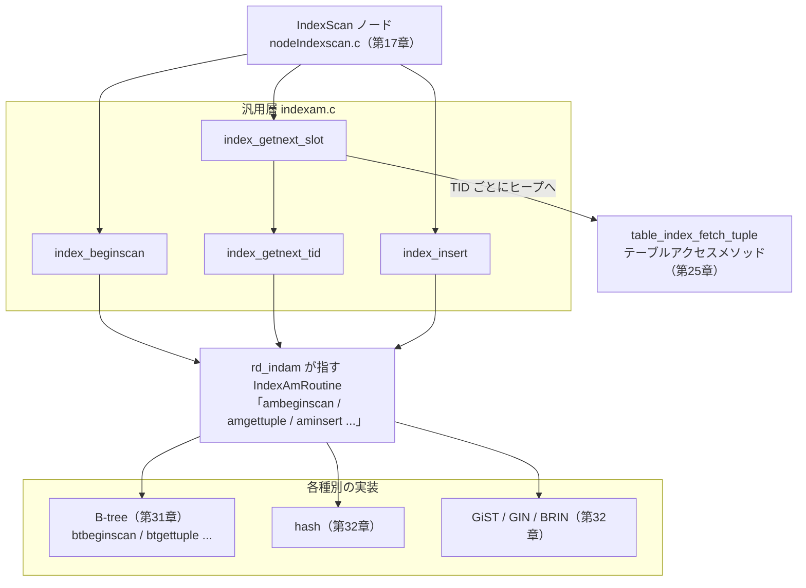

# 第30章 インデックスアクセスメソッド

> **本章で読むソース**
>
> - [`src/include/access/amapi.h`](https://github.com/postgres/postgres/blob/REL_18_4/src/include/access/amapi.h)
> - [`src/backend/access/index/indexam.c`](https://github.com/postgres/postgres/blob/REL_18_4/src/backend/access/index/indexam.c)
> - [`src/backend/access/index/amapi.c`](https://github.com/postgres/postgres/blob/REL_18_4/src/backend/access/index/amapi.c)
> - [`src/include/access/genam.h`](https://github.com/postgres/postgres/blob/REL_18_4/src/include/access/genam.h)
> - [`src/include/access/relscan.h`](https://github.com/postgres/postgres/blob/REL_18_4/src/include/access/relscan.h)
> - [`src/backend/access/nbtree/nbtree.c`](https://github.com/postgres/postgres/blob/REL_18_4/src/backend/access/nbtree/nbtree.c)

## この章の狙い

PostgreSQL は B-tree、hash、GiST、GIN、BRIN という複数のインデックス種別を備える。
種別ごとに格納構造も探索アルゴリズムも違うのに、エグゼキュータの `IndexScan` ノード（第17章）はどの種別に対しても同じ関数を呼ぶだけで動く。
その「同じ関数」が `index_beginscan` や `index_getnext_slot` であり、呼び出しを各種別の実装へ振り分ける仕掛けが本章の主題である**インデックスアクセスメソッド**である。

本章では、まず各種別が公開するメソッド表 `IndexAmRoutine` を読み、どんな操作と能力フラグが抽象化されているかを確認する。
次に、その表を介して実装を呼ぶ汎用層 `indexam.c` を読み、挿入と走査の流れを追う。
最後に、表が一度の呼び出しでバックエンドのメモリに常駐する仕組みを、本章の最適化として読む。

## 前提

第17章で、エグゼキュータの `IndexScan` ノードが `index_beginscan` でスキャンを開始し、`index_getnext_slot` のループでタプルを取り出すところまでを読んだ。
本章はその呼び出しの先、汎用層が各インデックス種別の実装へどう橋を架けるかを読む。
テーブル側にも同型の抽象化があり、テーブルアクセスメソッド（第25章）として読んだ。
インデックスアクセスメソッドはその索引版にあたる。
個々の種別の内部構造は、B-tree を第31章、hash と GiST と GIN と BRIN を第32章で扱う。

## `IndexAmRoutine`：種別ごとのメソッド表

インデックス種別の差異を一点に閉じ込めるのが、構造体 `IndexAmRoutine` である。
これは関数ポインタと能力フラグを並べた表で、種別ごとに1つだけ存在する。
`amapi.h` の冒頭コメントは、この構造体を「単一の palloc 済みメモリ片に格納しなければならない」と定める。

[`src/include/access/amapi.h` L226-L232](https://github.com/postgres/postgres/blob/REL_18_4/src/include/access/amapi.h#L226-L232)

```c
/*
 * API struct for an index AM.  Note this must be stored in a single palloc'd
 * chunk of memory.
 */
typedef struct IndexAmRoutine
{
	NodeTag		type;
```

構造体の前半は、種別がどんな機能を持つかを示す**能力フラグ**である。
プランナはこのフラグを見て、たとえば `ORDER BY` をインデックスの順序で満たせるか、UNIQUE 制約を張れるか、並列スキャンに参加できるかを判断する。

[`src/include/access/amapi.h` L243-L272](https://github.com/postgres/postgres/blob/REL_18_4/src/include/access/amapi.h#L243-L272)

```c
	/* does AM support ORDER BY indexed column's value? */
	bool		amcanorder;
	/* does AM support ORDER BY result of an operator on indexed column? */
	bool		amcanorderbyop;
	/* does AM support hashing using API consistent with the hash AM? */
	bool		amcanhash;
	/* do operators within an opfamily have consistent equality semantics? */
	bool		amconsistentequality;
	/* do operators within an opfamily have consistent ordering semantics? */
	bool		amconsistentordering;
	/* does AM support backward scanning? */
	bool		amcanbackward;
	/* does AM support UNIQUE indexes? */
	bool		amcanunique;
	/* does AM support multi-column indexes? */
	bool		amcanmulticol;
	/* does AM require scans to have a constraint on the first index column? */
	bool		amoptionalkey;
	/* does AM handle ScalarArrayOpExpr quals? */
	bool		amsearcharray;
	/* does AM handle IS NULL/IS NOT NULL quals? */
	bool		amsearchnulls;
	/* can index storage data type differ from column data type? */
	bool		amstorage;
	/* can an index of this type be clustered on? */
	bool		amclusterable;
	/* does AM handle predicate locks? */
	bool		ampredlocks;
	/* does AM support parallel scan? */
	bool		amcanparallel;
```

構造体の後半が、操作の本体を担う**インターフェース関数**の表である。
ビルド、挿入、走査、バキューム、コスト見積もりという、インデックスに対する操作の一通りが関数ポインタで並ぶ。
末尾にコメント `/* can be NULL */` が付くものは、その種別が機能を持たないときに NULL を入れてよい。

[`src/include/access/amapi.h` L292-L313](https://github.com/postgres/postgres/blob/REL_18_4/src/include/access/amapi.h#L292-L313)

```c
	/* interface functions */
	ambuild_function ambuild;
	ambuildempty_function ambuildempty;
	aminsert_function aminsert;
	aminsertcleanup_function aminsertcleanup;	/* can be NULL */
	ambulkdelete_function ambulkdelete;
	amvacuumcleanup_function amvacuumcleanup;
	amcanreturn_function amcanreturn;	/* can be NULL */
	amcostestimate_function amcostestimate;
	amgettreeheight_function amgettreeheight;	/* can be NULL */
	amoptions_function amoptions;
	amproperty_function amproperty; /* can be NULL */
	ambuildphasename_function ambuildphasename; /* can be NULL */
	amvalidate_function amvalidate;
	amadjustmembers_function amadjustmembers;	/* can be NULL */
	ambeginscan_function ambeginscan;
	amrescan_function amrescan;
	amgettuple_function amgettuple; /* can be NULL */
	amgetbitmap_function amgetbitmap;	/* can be NULL */
	amendscan_function amendscan;
	ammarkpos_function ammarkpos;	/* can be NULL */
	amrestrpos_function amrestrpos; /* can be NULL */
```

主要なメソッドの役割を、それぞれの関数ポインタ型の宣言から読む。
スキャンを開始する `ambeginscan` は、走査の状態を持つ `IndexScanDesc` を1つ確保して返す。

[`src/include/access/amapi.h` L183-L186](https://github.com/postgres/postgres/blob/REL_18_4/src/include/access/amapi.h#L183-L186)

```c
/* prepare for index scan */
typedef IndexScanDesc (*ambeginscan_function) (Relation indexRelation,
											   int nkeys,
											   int norderbys);
```

走査の本体が `amgettuple` である。
スキャンキーに合う次のインデックスエントリを探し、対応するヒープタプルの TID をスキャン記述子に書き込んで `true` を返す。
合うエントリが尽きたら `false` を返す。

[`src/include/access/amapi.h` L195-L197](https://github.com/postgres/postgres/blob/REL_18_4/src/include/access/amapi.h#L195-L197)

```c
/* next valid tuple */
typedef bool (*amgettuple_function) (IndexScanDesc scan,
									 ScanDirection direction);
```

1タプルずつ返す `amgettuple` に対して、`amgetbitmap` は条件に合う TID をまとめてビットマップへ吐き出す。
ビットマップスキャン（第17章）が使う経路で、戻り値は見つかったタプル数の概算である。

[`src/include/access/amapi.h` L199-L201](https://github.com/postgres/postgres/blob/REL_18_4/src/include/access/amapi.h#L199-L201)

```c
/* fetch all valid tuples */
typedef int64 (*amgetbitmap_function) (IndexScanDesc scan,
									   TIDBitmap *tbm);
```

更新側の入口が `aminsert` である。
1件のインデックスタプルを、対応するヒープタプルの TID とともに挿入する。
UNIQUE 制約の検査方法を `checkUnique` で受け取る。

[`src/include/access/amapi.h` L118-L126](https://github.com/postgres/postgres/blob/REL_18_4/src/include/access/amapi.h#L118-L126)

```c
/* insert this tuple */
typedef bool (*aminsert_function) (Relation indexRelation,
								   Datum *values,
								   bool *isnull,
								   ItemPointer heap_tid,
								   Relation heapRelation,
								   IndexUniqueCheck checkUnique,
								   bool indexUnchanged,
								   struct IndexInfo *indexInfo);
```

インデックスを丸ごと構築する `ambuild` は、ヒープを走査して全タプルを索引へ流し込み、構築結果の統計を返す。
`CREATE INDEX` の中核がこのメソッドである。

[`src/include/access/amapi.h` L110-L113](https://github.com/postgres/postgres/blob/REL_18_4/src/include/access/amapi.h#L110-L113)

```c
/* build new index */
typedef IndexBuildResult *(*ambuild_function) (Relation heapRelation,
											   Relation indexRelation,
											   struct IndexInfo *indexInfo);
```

各種別はこの表を1つ埋めて返す関数（ハンドラ）を持つ。
B-tree のハンドラ `bthandler` は、能力フラグを立て、各メソッドへ自分の実装関数を代入し、完成した表を返す。

[`src/backend/access/nbtree/nbtree.c` L114-L173](https://github.com/postgres/postgres/blob/REL_18_4/src/backend/access/nbtree/nbtree.c#L114-L173)

```c
Datum
bthandler(PG_FUNCTION_ARGS)
{
	IndexAmRoutine *amroutine = makeNode(IndexAmRoutine);

	amroutine->amstrategies = BTMaxStrategyNumber;
	amroutine->amsupport = BTNProcs;
	amroutine->amoptsprocnum = BTOPTIONS_PROC;
	amroutine->amcanorder = true;
// ... (中略) ...
	amroutine->ambuild = btbuild;
	amroutine->ambuildempty = btbuildempty;
	amroutine->aminsert = btinsert;
	amroutine->aminsertcleanup = NULL;
	amroutine->ambulkdelete = btbulkdelete;
	amroutine->amvacuumcleanup = btvacuumcleanup;
	amroutine->amcanreturn = btcanreturn;
	amroutine->amcostestimate = btcostestimate;
	amroutine->amgettreeheight = btgettreeheight;
	amroutine->amoptions = btoptions;
	amroutine->amproperty = btproperty;
	amroutine->ambuildphasename = btbuildphasename;
	amroutine->amvalidate = btvalidate;
	amroutine->amadjustmembers = btadjustmembers;
	amroutine->ambeginscan = btbeginscan;
	amroutine->amrescan = btrescan;
	amroutine->amgettuple = btgettuple;
	amroutine->amgetbitmap = btgetbitmap;
	amroutine->amendscan = btendscan;
	amroutine->ammarkpos = btmarkpos;
	amroutine->amrestrpos = btrestrpos;
	amroutine->amestimateparallelscan = btestimateparallelscan;
	amroutine->aminitparallelscan = btinitparallelscan;
	amroutine->amparallelrescan = btparallelrescan;
	amroutine->amtranslatestrategy = bttranslatestrategy;
	amroutine->amtranslatecmptype = bttranslatecmptype;

	PG_RETURN_POINTER(amroutine);
}
```

hash の `hashhandler`、GiST の `gisthandler` なども、同じ形で自分の表を埋めて返す。
種別の追加とは、この表を埋めるハンドラ関数を1つ書き、カタログ `pg_am` にそのハンドラの OID を登録することに等しい。

## `IndexAmRoutine` を取り出す経路

カタログには種別ごとにハンドラ関数の OID が記録されている。
そのハンドラを呼んでメソッド表を得るのが `GetIndexAmRoutine` である。
ハンドラを `OidFunctionCall0` で起動し、戻り値が本当に `IndexAmRoutine` かを型タグで確かめてから返す。

[`src/backend/access/index/amapi.c` L32-L46](https://github.com/postgres/postgres/blob/REL_18_4/src/backend/access/index/amapi.c#L32-L46)

```c
IndexAmRoutine *
GetIndexAmRoutine(Oid amhandler)
{
	Datum		datum;
	IndexAmRoutine *routine;

	datum = OidFunctionCall0(amhandler);
	routine = (IndexAmRoutine *) DatumGetPointer(datum);

	if (routine == NULL || !IsA(routine, IndexAmRoutine))
		elog(ERROR, "index access method handler function %u did not return an IndexAmRoutine struct",
			 amhandler);

	return routine;
}
```

この呼び出しはインデックスを開くたびに走るわけではない。
リレーションキャッシュ（relcache）がインデックスを初めて開いたときに一度だけ `GetIndexAmRoutine` を呼び、得た表をそのインデックスの relcache エントリの `rd_indam` に保持する。
以後、同じインデックスへの操作は `rd_indam` のポインタをたどるだけで済む。
この常駐の効果は、本章末尾の最適化の節で改めて読む。

## 走査の状態を持つ `IndexScanDesc`

メソッド表が「どう操作するか」を持つのに対して、1回の走査の進行状態を持つのが `IndexScanDesc` である。
`genam.h` は構造体の実体を `relscan.h` に置くと述べ、ポインタ型だけを公開する。

[`src/include/access/genam.h` L112-L116](https://github.com/postgres/postgres/blob/REL_18_4/src/include/access/genam.h#L112-L116)

```c
/* struct definitions appear in relscan.h */
typedef struct IndexScanDescData *IndexScanDesc;
typedef struct SysScanDescData *SysScanDesc;

typedef struct ParallelIndexScanDescData *ParallelIndexScanDesc;
```

実体 `IndexScanDescData` は、走査対象のリレーション、スナップショット、スキャンキーといった入力に加えて、種別ごとの実装が自由に使える領域を持つ。
そのフィールド `opaque` が、汎用層からは中身を見ない不透明なポインタで、各種別はここに自分の走査状態（B-tree なら現在ページや読んだ位置）を吊るす。

[`src/include/access/relscan.h` L133-L153](https://github.com/postgres/postgres/blob/REL_18_4/src/include/access/relscan.h#L133-L153)

```c
typedef struct IndexScanDescData
{
	/* scan parameters */
	Relation	heapRelation;	/* heap relation descriptor, or NULL */
	Relation	indexRelation;	/* index relation descriptor */
	struct SnapshotData *xs_snapshot;	/* snapshot to see */
	int			numberOfKeys;	/* number of index qualifier conditions */
	int			numberOfOrderBys;	/* number of ordering operators */
	struct ScanKeyData *keyData;	/* array of index qualifier descriptors */
	struct ScanKeyData *orderByData;	/* array of ordering op descriptors */
	bool		xs_want_itup;	/* caller requests index tuples */
	bool		xs_temp_snap;	/* unregister snapshot at scan end? */

	/* signaling to index AM about killing index tuples */
	bool		kill_prior_tuple;	/* last-returned tuple is dead */
	bool		ignore_killed_tuples;	/* do not return killed entries */
	bool		xactStartedInRecovery;	/* prevents killing/seeing killed
										 * tuples */

	/* index access method's private state */
	void	   *opaque;			/* access-method-specific info */
```

走査の出力もこの構造体に置かれる。
`amgettuple` は見つけたヒープタプルの TID を `xs_heaptid` に書き、インデックスが条件を完全には絞り切れなかったとき（lossy なとき）は `xs_recheck` を立てて、呼び出し側に再検査を促す。

[`src/include/access/relscan.h` L172-L177](https://github.com/postgres/postgres/blob/REL_18_4/src/include/access/relscan.h#L172-L177)

```c
	ItemPointerData xs_heaptid; /* result */
	bool		xs_heap_continue;	/* T if must keep walking, potential
									 * further results */
	IndexFetchTableData *xs_heapfetch;

	bool		xs_recheck;		/* T means scan keys must be rechecked */
```

`heapRelation` と `xs_heapfetch` が構造体に同居している点に注意したい。
インデックスは TID しか返さないので、可視なタプルそのものを得るにはヒープへ戻る必要がある。
その戻り先のリレーションと取得用の状態を、インデックス走査の記述子が握っている。

## `indexam.c`：汎用層がメソッド表を呼ぶ

汎用層 `indexam.c` の各 `index_*` 関数は、薄いラッパーである。
共通の検査を済ませてから、`rd_indam` に持つメソッド表の対応する関数ポインタを呼ぶ。
挿入の `index_insert` がその典型で、メソッド `aminsert` の存在を確かめ、直列化可能性の衝突検査を必要に応じて挟んでから、`aminsert` へ委譲する。

[`src/backend/access/index/indexam.c` L212-L234](https://github.com/postgres/postgres/blob/REL_18_4/src/backend/access/index/indexam.c#L212-L234)

```c
bool
index_insert(Relation indexRelation,
			 Datum *values,
			 bool *isnull,
			 ItemPointer heap_t_ctid,
			 Relation heapRelation,
			 IndexUniqueCheck checkUnique,
			 bool indexUnchanged,
			 IndexInfo *indexInfo)
{
	RELATION_CHECKS;
	CHECK_REL_PROCEDURE(aminsert);

	if (!(indexRelation->rd_indam->ampredlocks))
		CheckForSerializableConflictIn(indexRelation,
									   (ItemPointer) NULL,
									   InvalidBlockNumber);

	return indexRelation->rd_indam->aminsert(indexRelation, values, isnull,
											 heap_t_ctid, heapRelation,
											 checkUnique, indexUnchanged,
											 indexInfo);
}
```

ここで使われるマクロ `CHECK_REL_PROCEDURE` は、呼ぼうとするメソッドが NULL でないかを確かめる。
`/* can be NULL */` のメソッドを持たない種別に対して、未定義の操作を呼んだら、明確なエラーで止める役割である。

[`src/backend/access/index/indexam.c` L93-L98](https://github.com/postgres/postgres/blob/REL_18_4/src/backend/access/index/indexam.c#L93-L98)

```c
#define CHECK_REL_PROCEDURE(pname) \
do { \
	if (indexRelation->rd_indam->pname == NULL) \
		elog(ERROR, "function \"%s\" is not defined for index \"%s\"", \
			 CppAsString(pname), RelationGetRelationName(indexRelation)); \
} while(0)
```

走査の開始 `index_beginscan` も同じ形を取る。
種別の `ambeginscan` を呼んで記述子を確保し、ヒープ取得用の状態を `table_index_fetch_begin` で用意して、エグゼキュータへ返す。

[`src/backend/access/index/indexam.c` L255-L280](https://github.com/postgres/postgres/blob/REL_18_4/src/backend/access/index/indexam.c#L255-L280)

```c
IndexScanDesc
index_beginscan(Relation heapRelation,
				Relation indexRelation,
				Snapshot snapshot,
				IndexScanInstrumentation *instrument,
				int nkeys, int norderbys)
{
	IndexScanDesc scan;

	Assert(snapshot != InvalidSnapshot);

	scan = index_beginscan_internal(indexRelation, nkeys, norderbys, snapshot, NULL, false);

	/*
	 * Save additional parameters into the scandesc.  Everything else was set
	 * up by RelationGetIndexScan.
	 */
	scan->heapRelation = heapRelation;
	scan->xs_snapshot = snapshot;
	scan->instrument = instrument;

	/* prepare to fetch index matches from table */
	scan->xs_heapfetch = table_index_fetch_begin(heapRelation);

	return scan;
}
```

実際にメソッド表の `ambeginscan` を呼ぶのは、共通部を切り出した `index_beginscan_internal` である。
relcache の参照カウントを増やし、種別の `ambeginscan` で記述子を作る。

[`src/backend/access/index/indexam.c` L313-L341](https://github.com/postgres/postgres/blob/REL_18_4/src/backend/access/index/indexam.c#L313-L341)

```c
static IndexScanDesc
index_beginscan_internal(Relation indexRelation,
						 int nkeys, int norderbys, Snapshot snapshot,
						 ParallelIndexScanDesc pscan, bool temp_snap)
{
	IndexScanDesc scan;

	RELATION_CHECKS;
	CHECK_REL_PROCEDURE(ambeginscan);

	if (!(indexRelation->rd_indam->ampredlocks))
		PredicateLockRelation(indexRelation, snapshot);

	/*
	 * We hold a reference count to the relcache entry throughout the scan.
	 */
	RelationIncrementReferenceCount(indexRelation);

	/*
	 * Tell the AM to open a scan.
	 */
	scan = indexRelation->rd_indam->ambeginscan(indexRelation, nkeys,
												norderbys);
	/* Initialize information for parallel scan. */
	scan->parallel_scan = pscan;
	scan->xs_temp_snap = temp_snap;

	return scan;
}
```

走査本体の入口が `index_getnext_tid` である。
種別の `amgettuple` を呼んで次のエントリを探させ、見つかれば `xs_heaptid` に置かれた TID へのポインタを返す。
見つからなければ、ヒープ取得の資源を解放して NULL を返す。

[`src/backend/access/index/indexam.c` L620-L658](https://github.com/postgres/postgres/blob/REL_18_4/src/backend/access/index/indexam.c#L620-L658)

```c
ItemPointer
index_getnext_tid(IndexScanDesc scan, ScanDirection direction)
{
	bool		found;

	SCAN_CHECKS;
	CHECK_SCAN_PROCEDURE(amgettuple);

	/* XXX: we should assert that a snapshot is pushed or registered */
	Assert(TransactionIdIsValid(RecentXmin));

	/*
	 * The AM's amgettuple proc finds the next index entry matching the scan
	 * keys, and puts the TID into scan->xs_heaptid.  It should also set
	 * scan->xs_recheck and possibly scan->xs_itup/scan->xs_hitup, though we
	 * pay no attention to those fields here.
	 */
	found = scan->indexRelation->rd_indam->amgettuple(scan, direction);

	/* Reset kill flag immediately for safety */
	scan->kill_prior_tuple = false;
	scan->xs_heap_continue = false;

	/* If we're out of index entries, we're done */
	if (!found)
	{
		/* release resources (like buffer pins) from table accesses */
		if (scan->xs_heapfetch)
			table_index_fetch_reset(scan->xs_heapfetch);

		return NULL;
	}
	Assert(ItemPointerIsValid(&scan->xs_heaptid));

	pgstat_count_index_tuples(scan->indexRelation, 1);

	/* Return the TID of the tuple we found. */
	return &scan->xs_heaptid;
}
```

エグゼキュータが直接呼ぶのは、TID ではなくタプルを返す `index_getnext_slot` である。
`index_getnext_tid` で TID を取り、`index_fetch_heap` でその TID のヒープタプルを取る、という2段を1ループにまとめている。
HOT チェーンや不可視タプルでヒープ取得が空振りしたときは、ループ先頭へ戻って次の TID を引く。

[`src/backend/access/index/indexam.c` L719-L749](https://github.com/postgres/postgres/blob/REL_18_4/src/backend/access/index/indexam.c#L719-L749)

```c
bool
index_getnext_slot(IndexScanDesc scan, ScanDirection direction, TupleTableSlot *slot)
{
	for (;;)
	{
		if (!scan->xs_heap_continue)
		{
			ItemPointer tid;

			/* Time to fetch the next TID from the index */
			tid = index_getnext_tid(scan, direction);

			/* If we're out of index entries, we're done */
			if (tid == NULL)
				break;

			Assert(ItemPointerEquals(tid, &scan->xs_heaptid));
		}

		/*
		 * Fetch the next (or only) visible heap tuple for this index entry.
		 * If we don't find anything, loop around and grab the next TID from
		 * the index.
		 */
		Assert(ItemPointerIsValid(&scan->xs_heaptid));
		if (index_fetch_heap(scan, slot))
			return true;
	}

	return false;
}
```

TID からヒープタプルを取る `index_fetch_heap` は、テーブルアクセスメソッドの `table_index_fetch_tuple`（第25章）へ委譲する。
ここでインデックス層とテーブル層が出会う。
インデックスは TID までを担い、その先の可視性判定とタプル取得はテーブル層が担う、という分業である。

[`src/backend/access/index/indexam.c` L678-L702](https://github.com/postgres/postgres/blob/REL_18_4/src/backend/access/index/indexam.c#L678-L702)

```c
bool
index_fetch_heap(IndexScanDesc scan, TupleTableSlot *slot)
{
	bool		all_dead = false;
	bool		found;

	found = table_index_fetch_tuple(scan->xs_heapfetch, &scan->xs_heaptid,
									scan->xs_snapshot, slot,
									&scan->xs_heap_continue, &all_dead);

	if (found)
		pgstat_count_heap_fetch(scan->indexRelation);

	/*
	 * If we scanned a whole HOT chain and found only dead tuples, tell index
	 * AM to kill its entry for that TID (this will take effect in the next
	 * amgettuple call, in index_getnext_tid).  We do not do this when in
	 * recovery because it may violate MVCC to do so.  See comments in
	 * RelationGetIndexScan().
	 */
	if (!scan->xactStartedInRecovery)
		scan->kill_prior_tuple = all_dead;

	return found;
}
```

## 呼び出しの全体像

ここまでの三層の関係を図にまとめる。
エグゼキュータの `IndexScan` ノードは汎用層 `index_*` だけを呼ぶ。
汎用層は relcache の `rd_indam` が指すメソッド表を介して、開いているインデックスの種別に応じた実装へ分岐する。



図の要点は、エグゼキュータが種別を一切知らないことである。
種別の違いは `rd_indam` の指す表の中だけにあり、汎用層から先は関数ポインタの間接呼び出しで吸収される。

## 最適化：メソッド表を relcache に常駐させる

この設計の速度上の工夫は、メソッド表をインデックスごとに一度だけ作って relcache に常駐させる点にある。

`GetIndexAmRoutine` はカタログのハンドラ関数を `OidFunctionCall0` で起動する。
これは関数の動的な呼び出しであり、毎回のスキャンやタプル取得のたびに行えば無視できない費用になる。
そこで relcache は、インデックスを最初に開いたときに一度だけハンドラを呼び、完成した `IndexAmRoutine` をそのインデックスの `rd_indam` に保持する。
`GetIndexAmRoutine` のコメントも、組み込みハンドラならカタログアクセスを伴わず、relcache がこの性質に依存する、と述べている。

[`src/backend/access/index/amapi.c` L25-L31](https://github.com/postgres/postgres/blob/REL_18_4/src/backend/access/index/amapi.c#L25-L31)

```c
 * GetIndexAmRoutine - call the specified access method handler routine to get
 * its IndexAmRoutine struct, which will be palloc'd in the caller's context.
 *
 * Note that if the amhandler function is built-in, this will not involve
 * any catalog access.  It's therefore safe to use this while bootstrapping
 * indexes for the system catalogs.  relcache.c relies on that.
 */
```

常駐の効果は、走査一回あたりのコストに現れる。
`index_getnext_tid` が種別の実装へ届くまでの経路は、`scan->indexRelation->rd_indam->amgettuple(...)` というポインタの間接参照だけである。
カタログ参照も関数 OID の解決も挟まらないので、タプルを1つ取るたびの分岐がポインタを2回たどる費用に収まる。
これが速い理由は、種別の解決を「インデックスを開く一度」に前倒しし、毎タプルの経路から動的解決を取り除いたからである。

加えて、能力フラグも同じ表に同居している。
プランナが「この種別は `ORDER BY` を満たせるか」を判断するとき、`rd_indam->amcanorder` を読むだけで済み、ここでもカタログを引かない。
種別の機能判定と操作の振り分けが、どちらも常駐した1つの構造体への参照に帰着する。

## まとめ

インデックスアクセスメソッドは、種別ごとに異なる索引の操作を、関数ポインタと能力フラグの表 `IndexAmRoutine` に閉じ込める抽象化である。
各種別はハンドラ関数でこの表を埋め、`GetIndexAmRoutine` が一度だけそれを取り出して relcache の `rd_indam` に常駐させる。
汎用層 `indexam.c` の `index_*` 関数は、共通の検査を済ませてから `rd_indam` の対応メソッドへ委譲する薄いラッパーであり、エグゼキュータはこの汎用層だけを呼ぶ。
走査の状態は `IndexScanDesc` が持ち、種別固有の状態は `opaque` に吊るされ、TID から先のヒープ取得はテーブルアクセスメソッドへ渡る。
種別の解決をインデックスを開く一度に前倒しすることで、毎タプルの経路をポインタの間接参照だけに削っている。

## 関連する章

- [第17章 スキャンノード](../part04-executor/17-scan-nodes.md)：本章の汎用層を呼ぶ側の `IndexScan` ノードと `IndexNext` のループ。
- [第25章 テーブルアクセスメソッド](../part06-table-mvcc/25-table-access-method.md)：同型のテーブル側抽象化と、`index_fetch_heap` が委譲する `table_index_fetch_tuple`。
- [第31章 B-tree](31-btree.md)：本章のメソッド表を `bthandler` で埋める種別の内部。
- [第32章 hash、GiST、GIN、BRIN](32-other-indexes.md)：B-tree 以外の種別がメソッド表をどう埋めるか。
