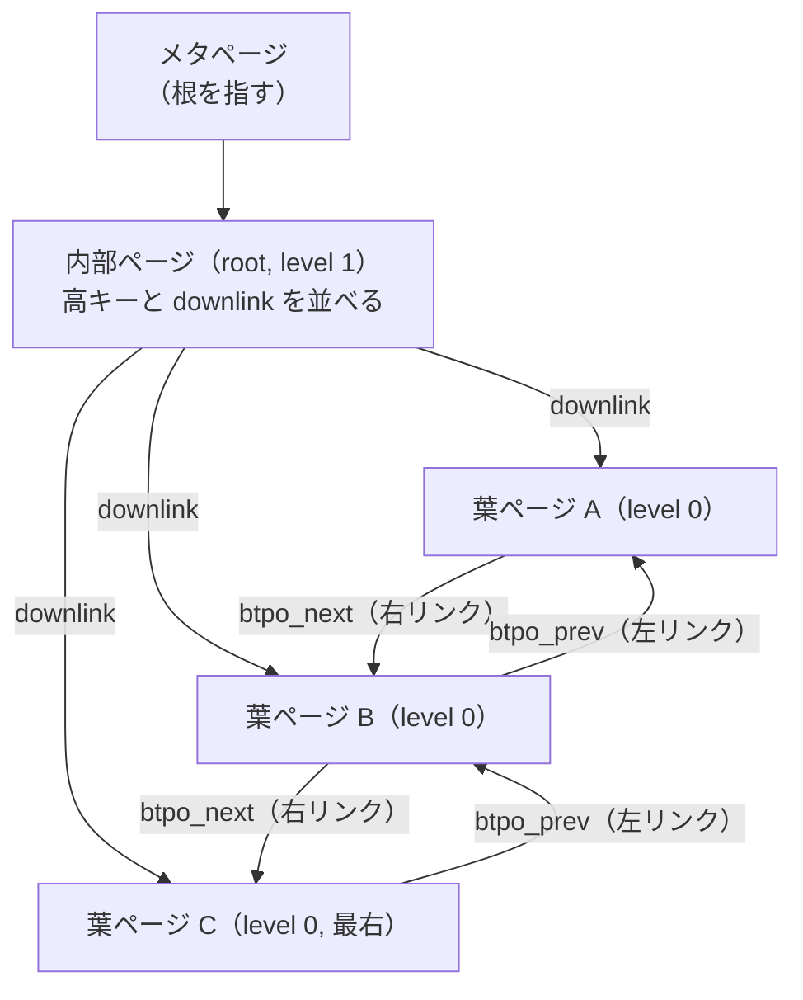
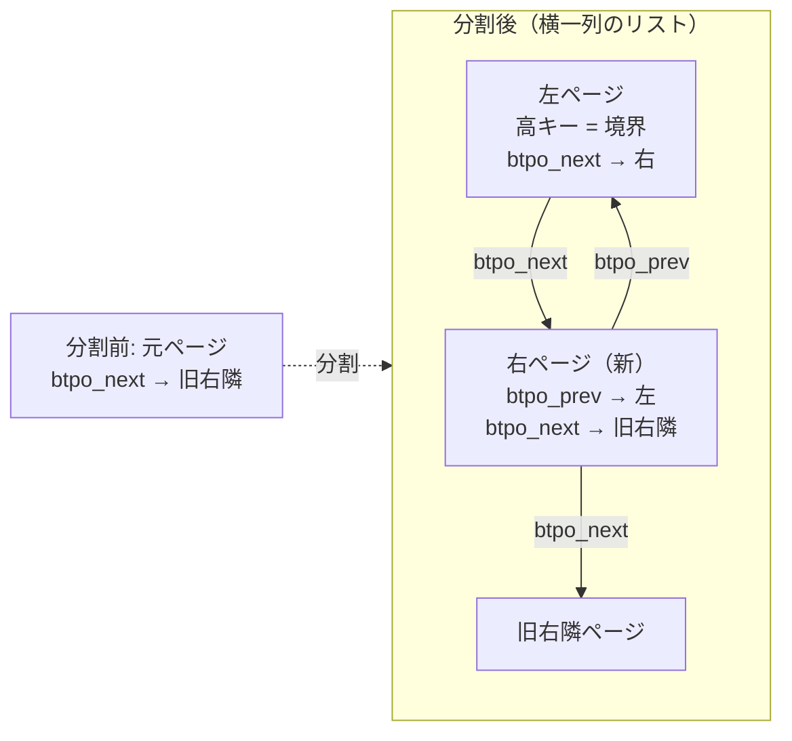

# 第31章 B-tree

> **本章で読むソース**
>
> - [`src/backend/access/nbtree/README`](https://github.com/postgres/postgres/blob/REL_18_4/src/backend/access/nbtree/README)
> - [`src/backend/access/nbtree/nbtsearch.c`](https://github.com/postgres/postgres/blob/REL_18_4/src/backend/access/nbtree/nbtsearch.c)
> - [`src/backend/access/nbtree/nbtinsert.c`](https://github.com/postgres/postgres/blob/REL_18_4/src/backend/access/nbtree/nbtinsert.c)
> - [`src/include/access/nbtree.h`](https://github.com/postgres/postgres/blob/REL_18_4/src/include/access/nbtree.h)

## この章の狙い

第30章で、インデックスアクセスメソッドという抽象層が `amgettuple` や `aminsert` といった関数ポインタを通じて、各インデックス種別へ走査と挿入を委ねると読んだ。
その既定の実装が B-tree（`nbtree`）である。
等価検索と範囲検索の両方を対数時間で処理でき、行を追加する `CREATE INDEX` を書かない限りすべての主キーと一意制約がこれを使う。

本章は B-tree の中核を読む。
木をどう表現し（ページ構造）、検索キーで根から葉へどう降り（`_bt_search`）、葉へ行をどう挿し、ページが溢れたときどう分割するか（`_bt_split`）を順に追う。

`nbtree` の設計の要は、複数のバックエンドが同じ木を同時に読み書きしても矛盾しないことにある。
古典的な B-tree は、降下中に下の階層が分割されると読み手が迷子になりうる。
`nbtree` はこれを、各ページに**右リンク**と**高キー**を持たせることで解決する。
この2つの追加が、木全体をロックせずに検索と分割を並行させる仕組みの土台になる。
本章の最後では、その並行制御を機構レベルで読む。

## 前提

第24章で、すべてのページがスロット式のレイアウトを持ち、ページ末尾に「特殊領域」を置けると読んだ。
B-tree のページは、この特殊領域に左右の兄弟ページへのリンクと木の階層を格納する。
第22章で、共有バッファがページを保持し、変更前にバッファをロックし、変更後に `MarkBufferDirty` で印を付けると読んだ。
B-tree の読み書きはこのバッファロックの内側で行われ、ロックの取得と解放の順序が並行制御の核になる。
WAL レコードの構築は第38章で扱うので、本章では「変更を WAL に記録する」とだけ押さえ、レコードの中身には踏み込まない。

`nbtree` は Lehman と Yao が 1981 年に示した高並行 B-tree のアルゴリズムを実装している[^ly]。
本章で「L&Y 流」と呼ぶのはこの設計を指す。

[^ly]: P. Lehman and S. Yao, "Efficient Locking for Concurrent Operations on B-Trees", ACM Transactions on Database Systems, Vol 6, No. 4, December 1981, pp 650-670. 削除の論理には V. Lanin と D. Shasha の簡略版も使われている。

## ページ構造と右リンク

B-tree のインデックスは複数のページからなる木である。
先頭の1ページはメタページで、根のページ番号を指す。
その下に内部ページと葉ページが階層をなす。
内部ページは子ページへの下向きリンク（downlink）を持つ案内専用のタプルを並べ、葉ページが実データ（ヒープ行を指す TID）を持つ。

各ページの特殊領域には `BTPageOpaqueData` が置かれる。

[`src/include/access/nbtree.h` L63-L72](https://github.com/postgres/postgres/blob/REL_18_4/src/include/access/nbtree.h#L63-L72)

```c
typedef struct BTPageOpaqueData
{
	BlockNumber btpo_prev;		/* left sibling, or P_NONE if leftmost */
	BlockNumber btpo_next;		/* right sibling, or P_NONE if rightmost */
	uint32		btpo_level;		/* tree level --- zero for leaf pages */
	uint16		btpo_flags;		/* flag bits, see below */
	BTCycleId	btpo_cycleid;	/* vacuum cycle ID of latest split */
} BTPageOpaqueData;

typedef BTPageOpaqueData *BTPageOpaque;
```

`btpo_next` が**右リンク**で、同じ階層の右隣のページ番号を持つ。
`btpo_prev` は左隣を指し、逆方向の走査に使う。
この左右リンクが、各階層のページを横一列の双方向リストにつなぐ。
最右ページの `btpo_next` と最左ページの `btpo_prev` は番兵値 `P_NONE` になる。
`btpo_level` は葉を 0 とする階層番号で、根が最大値を持つ。

右リンクが古典的な B-tree との最大の違いになる、という説明は `README` の冒頭にある。

[`src/backend/access/nbtree/README` L17-L29](https://github.com/postgres/postgres/blob/REL_18_4/src/backend/access/nbtree/README#L17-L29)

```text
Compared to a classic B-tree, L&Y adds a right-link pointer to each page,
to the page's right sibling.  It also adds a "high key" to each page, which
is an upper bound on the keys that are allowed on that page.  These two
additions make it possible to detect a concurrent page split, which allows
the tree to be searched without holding any read locks (except to keep a
single page from being modified while reading it).

When a search follows a downlink to a child page, it compares the page's
high key with the search key.  If the search key is greater than the high
key, the page must've been split concurrently, and you must follow the
right-link to find the new page containing the key range you're looking
for.  This might need to be repeated, if the page has been split more than
once.
```

右リンクと対になるのが**高キー**である。
高キーは各ページの先頭スロット（`P_HIKEY`）に置かれ、そのページに載ってよいキーの上限を表す。
ページが分割されても、左半分の高キーは右半分へ移ったキーの下限を保ち続ける。
だから降下中に検索キーがあるページの高キーを超えていれば、そのページは分割されており、続きは右リンクの先にあると判断できる。
この判定こそが、木全体をロックせずに検索と分割を並行させる鍵になる。

葉ページの間でデータが行き来する単位はキーの範囲であり、ページの物理的な境界をまたいでタプルが移動することはない。
分割が起きても、あるキーは分割前のページか、その右側のページのどちらかにあると保証される。



## 検索 `_bt_search`

木を根から葉へ降りる中心が `_bt_search` である。
渡される `key` は挿入型のスキャンキーで、目的のキーを表す。
戻り値は降下経路の親ページを積んだスタックで、`*bufP` には目的の葉ページのバッファがロックとピン付きで返る。

[`src/backend/access/nbtree/nbtsearch.c` L106-L122](https://github.com/postgres/postgres/blob/REL_18_4/src/backend/access/nbtree/nbtsearch.c#L106-L122)

```c
BTStack
_bt_search(Relation rel, Relation heaprel, BTScanInsert key, Buffer *bufP,
		   int access)
{
	BTStack		stack_in = NULL;
	int			page_access = BT_READ;

	/* heaprel must be set whenever _bt_allocbuf is reachable */
	Assert(access == BT_READ || access == BT_WRITE);
	Assert(access == BT_READ || heaprel != NULL);

	/* Get the root page to start with */
	*bufP = _bt_getroot(rel, heaprel, access);

	/* If index is empty and access = BT_READ, no root page is created. */
	if (!BufferIsValid(*bufP))
		return (BTStack) NULL;
```

根を `_bt_getroot` で取得したあと、ループが1回まわるたびに木を1階層降りる。
各階層でまず `_bt_moveright` を呼び、次に葉なら終了、内部ページなら `_bt_binsrch` で降りるべき子を選ぶ。

[`src/backend/access/nbtree/nbtsearch.c` L124-L190](https://github.com/postgres/postgres/blob/REL_18_4/src/backend/access/nbtree/nbtsearch.c#L124-L190)

```c
	/* Loop iterates once per level descended in the tree */
	for (;;)
	{
		Page		page;
		BTPageOpaque opaque;
		OffsetNumber offnum;
		ItemId		itemid;
		IndexTuple	itup;
		BlockNumber child;
		BTStack		new_stack;

		/*
		 * Race -- the page we just grabbed may have split since we read its
		 * downlink in its parent page (or the metapage).  If it has, we may
		 * need to move right to its new sibling.  Do that.
		 *
		 * In write-mode, allow _bt_moveright to finish any incomplete splits
		 * along the way.  Strictly speaking, we'd only need to finish an
		 * incomplete split on the leaf page we're about to insert to, not on
		 * any of the upper levels (internal pages with incomplete splits are
		 * also taken care of in _bt_getstackbuf).  But this is a good
		 * opportunity to finish splits of internal pages too.
		 */
		*bufP = _bt_moveright(rel, heaprel, key, *bufP, (access == BT_WRITE),
							  stack_in, page_access);

		/* if this is a leaf page, we're done */
		page = BufferGetPage(*bufP);
		opaque = BTPageGetOpaque(page);
		if (P_ISLEAF(opaque))
			break;

		/*
		 * Find the appropriate pivot tuple on this page.  Its downlink points
		 * to the child page that we're about to descend to.
		 */
		offnum = _bt_binsrch(rel, key, *bufP);
		itemid = PageGetItemId(page, offnum);
		itup = (IndexTuple) PageGetItem(page, itemid);
		Assert(BTreeTupleIsPivot(itup) || !key->heapkeyspace);
		child = BTreeTupleGetDownLink(itup);

		/*
		 * We need to save the location of the pivot tuple we chose in a new
		 * stack entry for this page/level.  If caller ends up splitting a
		 * page one level down, it usually ends up inserting a new pivot
		 * tuple/downlink immediately after the location recorded here.
		 */
		new_stack = (BTStack) palloc(sizeof(BTStackData));
		new_stack->bts_blkno = BufferGetBlockNumber(*bufP);
		new_stack->bts_offset = offnum;
		new_stack->bts_parent = stack_in;

		/*
		 * Page level 1 is lowest non-leaf page level prior to leaves.  So, if
		 * we're on the level 1 and asked to lock leaf page in write mode,
		 * then lock next page in write mode, because it must be a leaf.
		 */
		if (opaque->btpo_level == 1 && access == BT_WRITE)
			page_access = BT_WRITE;

		/* drop the read lock on the page, then acquire one on its child */
		*bufP = _bt_relandgetbuf(rel, *bufP, child, page_access);

		/* okay, all set to move down a level */
		stack_in = new_stack;
	}
```

降下は親のロックを解いてから子のロックを取る順序で進む（`_bt_relandgetbuf`）。
ロックを下方向へ連結して保持しないので、複数のバックエンドが同時に降りても、互いを待たせ続けることがない。
各階層で `_bt_binsrch` が選んだ親タプルの位置はスタックへ積まれる。
このスタックは、もし1階層下でページが分割されたとき、親へ新しい downlink を挿す位置の手がかりになる。

`level == 1`（葉のすぐ上）で書き込み目的の降下なら、次に取る葉のロックを書き込みロックへ昇格させる。
それ以外の階層は読み取りロックのまま通り抜ける。
挿入であっても、内部ページは案内のために読むだけで書き換えないからである。

## 降下中の分割への対処 `_bt_moveright`

`_bt_search` が階層ごとに最初に呼ぶ `_bt_moveright` が、右リンクと高キーで並行分割を吸収する関数である。
親で downlink を読んでから子のロックを取るまでの間に、その子が分割されているかもしれない。
分割されていれば、探したいキーは右隣へ移っている。
高キーを見て、それが起きたかを判定する。

[`src/backend/access/nbtree/nbtsearch.c` L277-L319](https://github.com/postgres/postgres/blob/REL_18_4/src/backend/access/nbtree/nbtsearch.c#L277-L319)

```c
	cmpval = key->nextkey ? 0 : 1;

	for (;;)
	{
		page = BufferGetPage(buf);
		opaque = BTPageGetOpaque(page);

		if (P_RIGHTMOST(opaque))
			break;

		/*
		 * Finish any incomplete splits we encounter along the way.
		 */
		if (forupdate && P_INCOMPLETE_SPLIT(opaque))
		{
			BlockNumber blkno = BufferGetBlockNumber(buf);

			/* upgrade our lock if necessary */
			if (access == BT_READ)
			{
				_bt_unlockbuf(rel, buf);
				_bt_lockbuf(rel, buf, BT_WRITE);
			}

			if (P_INCOMPLETE_SPLIT(opaque))
				_bt_finish_split(rel, heaprel, buf, stack);
			else
				_bt_relbuf(rel, buf);

			/* re-acquire the lock in the right mode, and re-check */
			buf = _bt_getbuf(rel, blkno, access);
			continue;
		}

		if (P_IGNORE(opaque) || _bt_compare(rel, key, page, P_HIKEY) >= cmpval)
		{
			/* step right one page */
			buf = _bt_relandgetbuf(rel, buf, opaque->btpo_next, access);
			continue;
		}
		else
			break;
	}
```

ループの判定が機構の中心である。
最右ページ（`P_RIGHTMOST`）でなく、検索キーをページの高キー（`P_HIKEY`）と比べて検索キーの方が大きければ、そのページは分割されており、右リンク `opaque->btpo_next` の先へ進む。
分割が複数回起きていれば、高キーを超えなくなるまで右へ進み続ける。
高キーに収まるページに着けば、目的のキーはこのページにあると確定し、ループを抜ける。

右リンクをたどる際も、現在のページのロックを解いてから右のロックを取る（`_bt_relandgetbuf`）。
右方向への移動はデッドロックを生まないので、ロックを連結せずに進める。
これが「読み手はツリー全体のロックなしに分割と並行できる」という L&Y の核心である。
分割を起こした書き手は、左ページの高キーと右リンクを正しく張ってからでないとロックを手放さない。
だから降下中の読み手は、分割の途中の不整合な状態を見ることがなく、たどり着いたページが古ければ右へ追えばよい。

`forupdate`（挿入のための降下）のときは、道中で見つけた**不完全分割**（`BTP_INCOMPLETE_SPLIT`）をその場で完了させる。
これが何かは、分割の節で読む。

## 挿入 `_bt_doinsert` と `_bt_insertonpg`

葉へ1タプルを挿す入口が `_bt_doinsert` である。
まず挿入型スキャンキーを作り、`_bt_search_insert` で目的の葉ページを探して書き込みロックを取る。

[`src/backend/access/nbtree/nbtinsert.c` L160-L167](https://github.com/postgres/postgres/blob/REL_18_4/src/backend/access/nbtree/nbtinsert.c#L160-L167)

```c
search:

	/*
	 * Find and lock the leaf page that the tuple should be added to by
	 * searching from the root page.  insertstate.buf will hold a buffer that
	 * is locked in exclusive mode afterwards.
	 */
	stack = _bt_search_insert(rel, heapRel, &insertstate);
```

一意制約を持つインデックスなら、ここで `_bt_check_unique` が重複を調べる。
重複がなければ `_bt_findinsertloc` で葉ページ内の挿入位置を決め、`_bt_insertonpg` で実際に載せる。

[`src/backend/access/nbtree/nbtinsert.c` L258-L262](https://github.com/postgres/postgres/blob/REL_18_4/src/backend/access/nbtree/nbtinsert.c#L258-L262)

```c
		newitemoff = _bt_findinsertloc(rel, &insertstate, checkingunique,
									   indexUnchanged, stack, heapRel);
		_bt_insertonpg(rel, heapRel, itup_key, insertstate.buf, InvalidBuffer,
					   stack, itup, insertstate.itemsz, newitemoff,
					   insertstate.postingoff, false);
```

`_bt_insertonpg` は、対象ページに空きがあるかで処理が二手に分かれる。
空きがあればそのまま `PageAddItem` で載せて終わる。
入りきらなければページを分割し、分割の結果を親へ伝える。
分岐の入口が空き容量の判定である。

[`src/backend/access/nbtree/nbtinsert.c` L1210-L1242](https://github.com/postgres/postgres/blob/REL_18_4/src/backend/access/nbtree/nbtinsert.c#L1210-L1242)

```c
	if (PageGetFreeSpace(page) < itemsz)
	{
		Buffer		rbuf;

		Assert(!split_only_page);

		/* split the buffer into left and right halves */
		rbuf = _bt_split(rel, heaprel, itup_key, buf, cbuf, newitemoff, itemsz,
						 itup, origitup, nposting, postingoff);
		PredicateLockPageSplit(rel,
							   BufferGetBlockNumber(buf),
							   BufferGetBlockNumber(rbuf));

		/*----------
		 * By here,
		 *
		 *		+  our target page has been split;
		 *		+  the original tuple has been inserted;
		 *		+  we have write locks on both the old (left half)
		 *		   and new (right half) buffers, after the split; and
		 *		+  we know the key we want to insert into the parent
		 *		   (it's the "high key" on the left child page).
		 *
		 * We're ready to do the parent insertion.  We need to hold onto the
		 * locks for the child pages until we locate the parent, but we can
		 * at least release the lock on the right child before doing the
		 * actual insertion.  The lock on the left child will be released
		 * last of all by parent insertion, where it is the 'cbuf' of parent
		 * page.
		 *----------
		 */
		_bt_insert_parent(rel, heaprel, buf, rbuf, stack, isroot, isonly);
	}
```

分割後は、左ページ（元のページ）と右ページ（新しいページ）の両方に書き込みロックを持つ。
親へ挿すべきキーは、分割で左ページに付いた新しい高キーそのものである。
このキーと右ページへの downlink を親へ挿すのが `_bt_insert_parent` で、親も溢れれば再び `_bt_insertonpg` を呼ぶ。
こうして分割は必要なだけ上の階層へ伝わる。
親が根だった場合は新しい根を作って木の高さが1段増える。

## ページ分割 `_bt_split`

`_bt_split` がページを左右の半分に割る関数である。
入口で元ページ `buf` は書き込みロック済みである。
まず `_bt_findsplitloc` で分割点を決め、左半分を組み立てる作業用ページ `leftpage` を用意する。
ここで左ページの兄弟リンクと不完全分割フラグを先に設定する。

[`src/backend/access/nbtree/nbtinsert.c` L1550-L1561](https://github.com/postgres/postgres/blob/REL_18_4/src/backend/access/nbtree/nbtinsert.c#L1550-L1561)

```c
	/*
	 * leftpage won't be the root when we're done.  Also, clear the SPLIT_END
	 * and HAS_GARBAGE flags.
	 */
	lopaque->btpo_flags = oopaque->btpo_flags;
	lopaque->btpo_flags &= ~(BTP_ROOT | BTP_SPLIT_END | BTP_HAS_GARBAGE);
	/* set flag in leftpage indicating that rightpage has no downlink yet */
	lopaque->btpo_flags |= BTP_INCOMPLETE_SPLIT;
	lopaque->btpo_prev = oopaque->btpo_prev;
	/* handle btpo_next after rightpage buffer acquired */
	lopaque->btpo_level = oopaque->btpo_level;
	/* handle btpo_cycleid after rightpage buffer acquired */
```

`BTP_INCOMPLETE_SPLIT` を**左ページ**に立てる点が要である。
分割直後の段階では、右ページへの downlink はまだ親に挿さっていない。
そのフラグが「右隣の downlink が親に未挿入である」という印になる。
`README` は、印を右ではなく左に付ける理由を述べる。

[`src/backend/access/nbtree/README` L679-L682](https://github.com/postgres/postgres/blob/REL_18_4/src/backend/access/nbtree/README#L679-L682)

```text
We flag the left page, even though it's the right page that's missing the
downlink, because it's more convenient to know already when following the
right-link from the left page to the right page that it will need to have
its downlink inserted to the parent.
```

左の高キーを書いたあと、右ページ用のバッファを確保し、左右の兄弟リンクを張り替える。
ここが右リンクの付け替えの核心である。

[`src/backend/access/nbtree/nbtinsert.c` L1734-L1746](https://github.com/postgres/postgres/blob/REL_18_4/src/backend/access/nbtree/nbtinsert.c#L1734-L1746)

```c
	lopaque->btpo_next = rightpagenumber;
	lopaque->btpo_cycleid = _bt_vacuum_cycleid(rel);

	/*
	 * rightpage won't be the root when we're done.  Also, clear the SPLIT_END
	 * and HAS_GARBAGE flags.
	 */
	ropaque->btpo_flags = oopaque->btpo_flags;
	ropaque->btpo_flags &= ~(BTP_ROOT | BTP_SPLIT_END | BTP_HAS_GARBAGE);
	ropaque->btpo_prev = origpagenumber;
	ropaque->btpo_next = oopaque->btpo_next;
	ropaque->btpo_level = oopaque->btpo_level;
	ropaque->btpo_cycleid = lopaque->btpo_cycleid;
```

リンクは次のように張り替わる。
左ページの右リンク `btpo_next` を新しい右ページへ向ける。
右ページの左リンク `btpo_prev` を元ページへ、右リンク `btpo_next` を元ページが指していた旧右隣へ向ける。
これで `左 → 右 → 旧右隣` という連結ができ、横一列のリストへ右ページが割り込む。
キーの範囲でいえば、元ページの上半分のキーが右ページへ移り、左ページの新しい高キーがその境界を表す。



分割の物理的な変更はクリティカルセクションの中で一度に適用され、1本の WAL レコードとして記録される。
旧右隣ページの左リンクの更新も同じレコードに含まれる。
そのため分割は、読み手から見て一瞬で完了したように見える。
親への downlink 挿入は、これとは別の2本目の WAL レコードになる。

## 高速化と最適化の工夫

B-tree の最適化の核心は、右リンクと高キーによって読み手がツリー全体のロックなしに分割と並行できることである。
古典的な B-tree では、降下中に下の階層が分割されると、親の downlink が指す範囲と子の実際の範囲がずれて読み手が迷子になる。
これを防ぐには木の上位までロックを連結する必要があり、並行性が大きく落ちる。

`nbtree` は別の道をとる。
書き手は分割時に、左ページの高キー（移ったキーの境界）と右リンク（移った先）を、ロックを手放す前に必ず張る。
読み手は降下のたびに、検索キーをそのページの高キーと比べる。
高キーを超えていれば、自分が古いページを見ていると気付けるので、右リンクをたどって新しいページへ移る。
木全体を止める必要はなく、関係する1ページずつのロックで済む。
この仕組みが効くのは、タプルがページの境界をまたいで移動しないからである。
あるキーは分割前のページか、その右側のページにしかないので、右へ追えば必ず見つかり、同じ項目を二度返すこともない。

並行性をさらに支えるのが、不完全分割の遅延修復である。
分割は「ページを割る」WAL レコードと「親へ downlink を挿す」WAL レコードの2本に分かれる。
その間にクラッシュすると、右ページへの downlink が親に欠けた状態になる。
それでも検索は正しく動く。
左ページの右リンクをたどれば右ページに着くからである。

[`src/backend/access/nbtree/README` L643-L651](https://github.com/postgres/postgres/blob/REL_18_4/src/backend/access/nbtree/README#L643-L651)

```text
Because splitting involves multiple atomic actions, it's possible that the
system crashes between splitting a page and inserting the downlink for the
new half to the parent.  After recovery, the downlink for the new page will
be missing.  The search algorithm works correctly, as the page will be found
by following the right-link from its left sibling, although if a lot of
downlinks in the tree are missing, performance will suffer.  A more serious
consequence is that if the page without a downlink gets split again, the
insertion algorithm will fail to find the location in the parent level to
insert the downlink.
```

欠けた downlink は、次にその辺りを通る挿入が見つけ次第その場で埋める。
`_bt_moveright` が `BTP_INCOMPLETE_SPLIT` フラグを見つけたら `_bt_finish_split` を呼ぶ箇所がそれである。
修復を読み取り専用の検索やバキュームに負わせず、もともと領域を確保しうる挿入の側に任せることで、リカバリ処理を単純に保ち、検索を純粋な読み取りのままにしている。

## まとめ

B-tree は、メタページが根を指し、内部ページが downlink で子を案内し、葉ページがヒープ行を指す TID を持つ木である。
各ページは特殊領域 `BTPageOpaqueData` に左右の兄弟リンクと階層番号を持つ。

検索 `_bt_search` は根から葉へ1階層ずつ降り、各階層で `_bt_moveright` を呼んでから子を選ぶ。
降下は親のロックを解いてから子のロックを取る順序で進み、ロックを下方向へ連結しない。
挿入 `_bt_doinsert` は葉を探して書き込みロックを取り、空きがあれば載せ、溢れれば `_bt_split` で割って分割を上の階層へ伝える。

並行制御の核は右リンクと高キーである。
書き手は分割時に高キーと右リンクを張ってからロックを手放し、読み手は高キーで古いページを見抜いて右リンクをたどる。
これにより木全体をロックせずに検索と分割を並行でき、クラッシュで downlink が欠けても検索は右リンクで正しく動き続ける。

## 関連する章

- [第30章 インデックスアクセスメソッド](30-index-access-method.md)：本章が実装する `amgettuple` と `aminsert` の抽象層。
- [第32章 hash、GiST、GIN、BRIN](32-other-indexes.md)：B-tree 以外のインデックス種別。
- [第24章 ページとタプルのレイアウト](../part05-storage-buffer/24-page-and-tuple-layout.md)：ページの特殊領域とスロット式レイアウト。
- [第22章 共有バッファとバッファ管理](../part05-storage-buffer/22-buffer-manager.md)：ページのロックとピンの仕組み。
- [第38章 WAL の仕組み](../part09-wal-recovery/38-wal.md)：分割を記録する WAL レコードとリカバリ。
