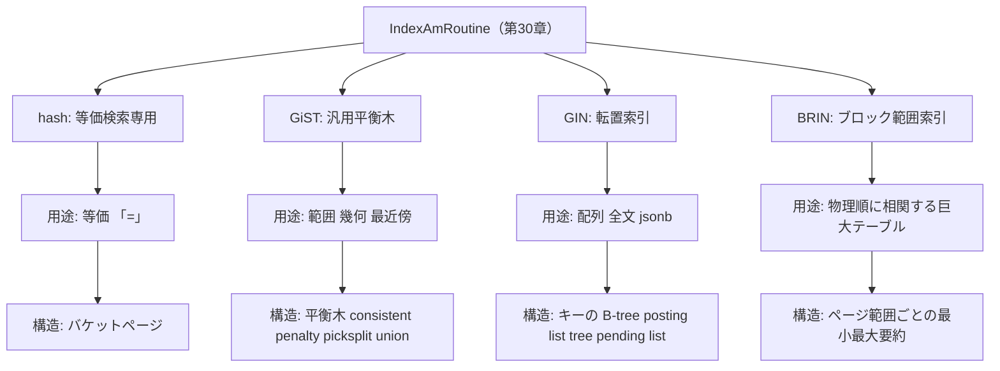

# 第32章 hash、GiST、GIN、BRIN

> **本章で読むソース**
>
> - [`src/backend/access/hash/hash.c`](https://github.com/postgres/postgres/blob/REL_18_4/src/backend/access/hash/hash.c)
> - [`src/backend/access/hash/README`](https://github.com/postgres/postgres/blob/REL_18_4/src/backend/access/hash/README)
> - [`src/backend/access/gist/gist.c`](https://github.com/postgres/postgres/blob/REL_18_4/src/backend/access/gist/gist.c)
> - [`src/backend/access/gist/README`](https://github.com/postgres/postgres/blob/REL_18_4/src/backend/access/gist/README)
> - [`src/backend/access/gin/ginutil.c`](https://github.com/postgres/postgres/blob/REL_18_4/src/backend/access/gin/ginutil.c)
> - [`src/backend/access/gin/README`](https://github.com/postgres/postgres/blob/REL_18_4/src/backend/access/gin/README)
> - [`src/backend/access/brin/brin.c`](https://github.com/postgres/postgres/blob/REL_18_4/src/backend/access/brin/brin.c)
> - [`src/backend/access/brin/README`](https://github.com/postgres/postgres/blob/REL_18_4/src/backend/access/brin/README)

## この章の狙い

第30章で、インデックスアクセスメソッドの本体が `IndexAmRoutine` という関数ポインタの表であり、`pg_am` カタログの `amhandler` 関数がその表を返すことを読んだ。
第31章では、その表を最も標準的に埋める実装である B-tree を追った。
B-tree は順序つきの比較に向き、等価検索と範囲検索の両方をこなす万能の索引である。

しかし索引で速くしたい問い合わせは、比較による順序探索だけではない。
等価判定だけでよいなら順序を持たないほうが速いかもしれず、二次元の図形が重なるかどうかを問うなら大小比較そのものが定義できない。
配列やドキュメントの中に特定の要素が含まれるかを問うなら、行を1つの値として比べる枠組みは合わない。
巨大なテーブルで、索引自体が小さくなければ意味がない、という要求もある。

本章は、B-tree 以外の4つの組み込み索引を、それぞれが向く用途と中心アイデアの側から読む。
深入りはせず、各 `amhandler` が `IndexAmRoutine` をどう埋めるか、そして README が述べる中心の考え方を引用で示すところまでを扱う。
4つはいずれも第30章で読んだ同じ `IndexAmRoutine` を実装する点で共通し、その共通の型の上に、互いに大きく異なるデータ構造を載せている。

## 前提

第30章でインデックスアクセスメソッドの抽象境界（`IndexAmRoutine` と `amhandler`）を読んだことを前提とする。
本章はその境界の下に、B-tree 以外の実装が4種類あることを示す。
各実装の内部構造（ページレイアウト、分割、WAL）には立ち入らず、handler が宣言する性質と、README が述べる中心の仕組みまでを読む。

## hash：等価検索に特化した索引

最初に読むのは hash 索引である。
hash は等価演算子 `=` だけを加速する索引であり、順序を一切持たない。
キーをハッシュ値に写し、その値からバケット番号を決めて該当バケットだけを見る。
順序がない代わりに、等しいキーへたどり着く経路が短い。

handler 関数 `hashhandler` は、この性質を `IndexAmRoutine` のフラグとして宣言する。

[`src/backend/access/hash/hash.c` L57-L116](https://github.com/postgres/postgres/blob/REL_18_4/src/backend/access/hash/hash.c#L57-L116)

```c
Datum
hashhandler(PG_FUNCTION_ARGS)
{
	IndexAmRoutine *amroutine = makeNode(IndexAmRoutine);

	amroutine->amstrategies = HTMaxStrategyNumber;
	amroutine->amsupport = HASHNProcs;
	amroutine->amoptsprocnum = HASHOPTIONS_PROC;
	amroutine->amcanorder = false;
	amroutine->amcanorderbyop = false;
	amroutine->amcanhash = true;
	amroutine->amconsistentequality = true;
	amroutine->amconsistentordering = false;
	amroutine->amcanbackward = true;
	amroutine->amcanunique = false;
	amroutine->amcanmulticol = false;
	amroutine->amoptionalkey = false;
	amroutine->amsearcharray = false;
	amroutine->amsearchnulls = false;
	amroutine->amstorage = false;
	amroutine->amclusterable = false;
	amroutine->ampredlocks = true;
	amroutine->amcanparallel = false;
	amroutine->amcanbuildparallel = false;
	amroutine->amcaninclude = false;
	amroutine->amusemaintenanceworkmem = false;
	amroutine->amsummarizing = false;
	amroutine->amparallelvacuumoptions =
		VACUUM_OPTION_PARALLEL_BULKDEL;
	amroutine->amkeytype = INT4OID;

	amroutine->ambuild = hashbuild;
	amroutine->ambuildempty = hashbuildempty;
	amroutine->aminsert = hashinsert;
	amroutine->aminsertcleanup = NULL;
	amroutine->ambulkdelete = hashbulkdelete;
	amroutine->amvacuumcleanup = hashvacuumcleanup;
	amroutine->amcanreturn = NULL;
	amroutine->amcostestimate = hashcostestimate;
	amroutine->amgettreeheight = NULL;
	amroutine->amoptions = hashoptions;
	amroutine->amproperty = NULL;
	amroutine->ambuildphasename = NULL;
	amroutine->amvalidate = hashvalidate;
	amroutine->amadjustmembers = hashadjustmembers;
	amroutine->ambeginscan = hashbeginscan;
	amroutine->amrescan = hashrescan;
	amroutine->amgettuple = hashgettuple;
	amroutine->amgetbitmap = hashgetbitmap;
	amroutine->amendscan = hashendscan;
	amroutine->ammarkpos = NULL;
	amroutine->amrestrpos = NULL;
	amroutine->amestimateparallelscan = NULL;
	amroutine->aminitparallelscan = NULL;
	amroutine->amparallelrescan = NULL;
	amroutine->amtranslatestrategy = hashtranslatestrategy;
	amroutine->amtranslatecmptype = hashtranslatecmptype;

	PG_RETURN_POINTER(amroutine);
}
```

宣言が hash の性格を端的に表している。
`amcanorder` が偽である一方、`amcanhash` と `amconsistentequality` が真である。
順序つきスキャンはできず、ハッシュによる等価判定に特化していることを、handler の段階で表明している。
`amkeytype` が `INT4OID` である点も特徴で、索引にはデータ本体ではなく32ビットのハッシュ符号だけが入る。

このバケットという中心の考え方は、README の冒頭が説明している。

[`src/backend/access/hash/README` L14-L22](https://github.com/postgres/postgres/blob/REL_18_4/src/backend/access/hash/README#L14-L22)

```text
A hash index consists of two or more "buckets", into which tuples are
placed whenever their hash key maps to the bucket number.  The
key-to-bucket-number mapping is chosen so that the index can be
incrementally expanded.  When a new bucket is to be added to the index,
exactly one existing bucket will need to be "split", with some of its
tuples being transferred to the new bucket according to the updated
key-to-bucket-number mapping.  This is essentially the same hash table
management technique embodied in src/backend/utils/hash/dynahash.c for
in-memory hash tables.
```

索引は2つ以上の**バケット**から成り、タプルはハッシュ値が決めるバケット番号へ置かれる。
キーからバケット番号への写像は、索引を少しずつ拡張できるよう選ばれている。
バケットを1つ増やすときは、既存のバケットを1つだけ分割し、更新後の写像に従って一部のタプルを新しいバケットへ移す。
索引を一度に作り直さず、必要なバケットだけを分割して増やす点が、この写像の設計の要点である。

## GiST：平衡木の汎用フレームワーク

次に読むのは GiST である。
GiST は **Generalized Search Tree** の略で、B-tree のような平衡木の骨格だけを提供し、各ノードがどんなキーを表しどう探索するかをデータ型側に委ねる枠組みである。
範囲型、幾何型、全文検索など、比較順序を前提にできない探索を、共通の木構造の上で扱える。

handler 関数 `gisthandler` は、この汎用性を反映したフラグを並べる。

[`src/backend/access/gist/gist.c` L58-L117](https://github.com/postgres/postgres/blob/REL_18_4/src/backend/access/gist/gist.c#L58-L117)

```c
Datum
gisthandler(PG_FUNCTION_ARGS)
{
	IndexAmRoutine *amroutine = makeNode(IndexAmRoutine);

	amroutine->amstrategies = 0;
	amroutine->amsupport = GISTNProcs;
	amroutine->amoptsprocnum = GIST_OPTIONS_PROC;
	amroutine->amcanorder = false;
	amroutine->amcanorderbyop = true;
	amroutine->amcanhash = false;
	amroutine->amconsistentequality = false;
	amroutine->amconsistentordering = false;
	amroutine->amcanbackward = false;
	amroutine->amcanunique = false;
	amroutine->amcanmulticol = true;
	amroutine->amoptionalkey = true;
	amroutine->amsearcharray = false;
	amroutine->amsearchnulls = true;
	amroutine->amstorage = true;
	amroutine->amclusterable = true;
	amroutine->ampredlocks = true;
	amroutine->amcanparallel = false;
	amroutine->amcanbuildparallel = false;
	amroutine->amcaninclude = true;
	amroutine->amusemaintenanceworkmem = false;
	amroutine->amsummarizing = false;
	amroutine->amparallelvacuumoptions =
		VACUUM_OPTION_PARALLEL_BULKDEL | VACUUM_OPTION_PARALLEL_COND_CLEANUP;
	amroutine->amkeytype = InvalidOid;

	amroutine->ambuild = gistbuild;
	amroutine->ambuildempty = gistbuildempty;
	amroutine->aminsert = gistinsert;
	amroutine->aminsertcleanup = NULL;
	amroutine->ambulkdelete = gistbulkdelete;
	amroutine->amvacuumcleanup = gistvacuumcleanup;
	amroutine->amcanreturn = gistcanreturn;
	amroutine->amcostestimate = gistcostestimate;
	amroutine->amgettreeheight = NULL;
	amroutine->amoptions = gistoptions;
	amroutine->amproperty = gistproperty;
	amroutine->ambuildphasename = NULL;
	amroutine->amvalidate = gistvalidate;
	amroutine->amadjustmembers = gistadjustmembers;
	amroutine->ambeginscan = gistbeginscan;
	amroutine->amrescan = gistrescan;
	amroutine->amgettuple = gistgettuple;
	amroutine->amgetbitmap = gistgetbitmap;
	amroutine->amendscan = gistendscan;
	amroutine->ammarkpos = NULL;
	amroutine->amrestrpos = NULL;
	amroutine->amestimateparallelscan = NULL;
	amroutine->aminitparallelscan = NULL;
	amroutine->amparallelrescan = NULL;
	amroutine->amtranslatestrategy = NULL;
	amroutine->amtranslatecmptype = gisttranslatecmptype;

	PG_RETURN_POINTER(amroutine);
}
```

`amcanorder` は偽だが `amcanorderbyop` が真である点が GiST らしい。
大小比較による順序づけはできない代わりに、演算子による順序、すなわち「ある点に近い順」のような最近傍探索ができる。
`amstrategies` が0であることも要点で、hash のように固定の戦略番号を持たず、戦略の意味はデータ型側の演算子クラスが決める。

GiST が汎用木でいられるのは、木の形を保つ判断をデータ型側の関数へ委ねているからである。
その拡張点を README が名指しで挙げている。

[`src/backend/access/gist/README` L115-L118](https://github.com/postgres/postgres/blob/REL_18_4/src/backend/access/gist/README#L115-L118)

```text
INSERT guarantees that the GiST tree remains balanced. User defined key method
Penalty is used for choosing a subtree to insert; method PickSplit is used for
the node splitting algorithm; method Union is used for propagating changes
upward to maintain the tree properties.
```

挿入は GiST 木の平衡を保つ。
**Penalty** はどの部分木へ挿入するかを選ぶために使い、**PickSplit** はノード分割のアルゴリズムに使い、**Union** は変更を上位へ伝えて木の性質を保つために使う。
探索の側ではこれに**consistent** が加わり、あるノードのキーが検索条件と両立しうるかを判定して枝刈りする。
GiST のコアは木をたどり分割し平衡を保つ仕事だけを担い、何を近いとし何を含むとするかという意味づけは、これらの関数を実装するデータ型側に委ねられている。

## GIN：転置索引

3つ目は GIN である。
GIN は **Generalized Inverted Index** の略で、1つの値が多数のキーを含むデータ、すなわち配列、全文検索の `tsvector`、`jsonb` などに向く転置索引である。
ドキュメントを索引キーへ展開し、各キーに対してそれを含む行の一覧を持つ。

handler 関数 `ginhandler` は、この用途に対応するフラグを宣言する。

[`src/backend/access/gin/ginutil.c` L37-L94](https://github.com/postgres/postgres/blob/REL_18_4/src/backend/access/gin/ginutil.c#L37-L94)

```c
Datum
ginhandler(PG_FUNCTION_ARGS)
{
	IndexAmRoutine *amroutine = makeNode(IndexAmRoutine);

	amroutine->amstrategies = 0;
	amroutine->amsupport = GINNProcs;
	amroutine->amoptsprocnum = GIN_OPTIONS_PROC;
	amroutine->amcanorder = false;
	amroutine->amcanorderbyop = false;
	amroutine->amcanhash = false;
	amroutine->amconsistentequality = false;
	amroutine->amconsistentordering = false;
	amroutine->amcanbackward = false;
	amroutine->amcanunique = false;
	amroutine->amcanmulticol = true;
	amroutine->amoptionalkey = true;
	amroutine->amsearcharray = false;
	amroutine->amsearchnulls = false;
	amroutine->amstorage = true;
	amroutine->amclusterable = false;
	amroutine->ampredlocks = true;
	amroutine->amcanparallel = false;
	amroutine->amcanbuildparallel = true;
	amroutine->amcaninclude = false;
	amroutine->amusemaintenanceworkmem = true;
	amroutine->amsummarizing = false;
	amroutine->amparallelvacuumoptions =
		VACUUM_OPTION_PARALLEL_BULKDEL | VACUUM_OPTION_PARALLEL_CLEANUP;
	amroutine->amkeytype = InvalidOid;

	amroutine->ambuild = ginbuild;
	amroutine->ambuildempty = ginbuildempty;
	amroutine->aminsert = gininsert;
	amroutine->aminsertcleanup = NULL;
	amroutine->ambulkdelete = ginbulkdelete;
	amroutine->amvacuumcleanup = ginvacuumcleanup;
	amroutine->amcanreturn = NULL;
	amroutine->amcostestimate = gincostestimate;
	amroutine->amgettreeheight = NULL;
	amroutine->amoptions = ginoptions;
	amroutine->amproperty = NULL;
	amroutine->ambuildphasename = ginbuildphasename;
	amroutine->amvalidate = ginvalidate;
	amroutine->amadjustmembers = ginadjustmembers;
	amroutine->ambeginscan = ginbeginscan;
	amroutine->amrescan = ginrescan;
	amroutine->amgettuple = NULL;
	amroutine->amgetbitmap = gingetbitmap;
	amroutine->amendscan = ginendscan;
	amroutine->ammarkpos = NULL;
	amroutine->amrestrpos = NULL;
	amroutine->amestimateparallelscan = NULL;
	amroutine->aminitparallelscan = NULL;
	amroutine->amparallelrescan = NULL;

	PG_RETURN_POINTER(amroutine);
}
```

`amgettuple` が `NULL` で `amgetbitmap` だけが埋まっている点が GIN の特徴である。
1つのキーに多数の行が対応するため、1タプルずつ返す経路を持たず、結果はビットマップとしてまとめて返す。
`amusemaintenanceworkmem` が真である点も後で効いてくる。

転置索引という中心の考え方は、README の冒頭が定義している。

[`src/backend/access/gin/README` L17-L26](https://github.com/postgres/postgres/blob/REL_18_4/src/backend/access/gin/README#L17-L26)

```text
An inverted index is an index structure storing a set of (key, posting list)
pairs, where 'posting list' is a set of heap rows in which the key occurs.
(A text document would usually contain many keys.)  The primary goal of
Gin indices is support for highly scalable, full-text search in PostgreSQL.

A Gin index consists of a B-tree index constructed over key values,
where each key is an element of some indexed items (element of array, lexeme
for tsvector) and where each tuple in a leaf page contains either a pointer to
a B-tree over item pointers (posting tree), or a simple list of item pointers
(posting list) if the list is small enough.
```

転置索引は、（キー、posting list）の組を格納する。
**posting list** は、そのキーが現れるヒープ行の集合である。
GIN 索引はキー値の上に構築した B-tree から成り、葉のタプルは、項目ポインタの一覧が小さければ posting list として直接持ち、多くなれば B-tree（posting tree）へのポインタを持つ。
同じキーが多くの行に現れるとき、行の一覧を小ささに応じて一覧と木へ切り替えることで、頻出キーでも肥大しない構造になっている。

GIN にはもう1つ、書き込みを速くする工夫がある。
同じキーが多くの新しい行に現れるとき、本体の B-tree へ1件ずつ差し込むのは遅い。
そこで挿入をいったん別の場所へ溜めておく仕組みがある。

[`src/backend/access/gin/README` L95-L104](https://github.com/postgres/postgres/blob/REL_18_4/src/backend/access/gin/README#L95-L104)

```text
A GIN index contains a metapage, a btree of key entries, and possibly
"posting tree" pages, which hold the overflow when a key entry acquires
too many heap tuple pointers to fit in a btree page.  Additionally, if the
fast-update feature is enabled, there can be "list pages" holding "pending"
key entries that haven't yet been merged into the main btree.  The list
pages have to be scanned linearly when doing a search, so the pending
entries should be merged into the main btree before there get to be too
many of them.  The advantage of the pending list is that bulk insertion of
a few thousand entries can be much faster than retail insertion.  (The win
comes mainly from not having to do multiple searches/insertions when the
```

fast-update が有効なとき、本体の B-tree へまだ併合していないキーを保持する**pending list**（list pages）が置かれる。
pending list は検索のたびに線形に走査されるので、増えすぎる前に本体へ併合する必要がある。
それでも pending list には利点があり、数千件のまとめ挿入が1件ずつの挿入よりはるかに速い。
同じキーが複数の新しい行に現れるとき、本体への探索と挿入を何度も繰り返さずに済むからである。

## BRIN：ブロック範囲索引

最後は BRIN である。
BRIN は **Block Range Index** の略で、物理的な並びと値が相関する巨大なテーブルに向く。
連続するヒープページのまとまり（ページ範囲）ごとに、その範囲に含まれる値の要約（最小最大など）だけを持つ。

handler 関数 `brinhandler` は、要約という性格を反映したフラグを宣言する。

[`src/backend/access/brin/brin.c` L249-L308](https://github.com/postgres/postgres/blob/REL_18_4/src/backend/access/brin/brin.c#L249-L308)

```c
Datum
brinhandler(PG_FUNCTION_ARGS)
{
	IndexAmRoutine *amroutine = makeNode(IndexAmRoutine);

	amroutine->amstrategies = 0;
	amroutine->amsupport = BRIN_LAST_OPTIONAL_PROCNUM;
	amroutine->amoptsprocnum = BRIN_PROCNUM_OPTIONS;
	amroutine->amcanorder = false;
	amroutine->amcanorderbyop = false;
	amroutine->amcanhash = false;
	amroutine->amconsistentequality = false;
	amroutine->amconsistentordering = false;
	amroutine->amcanbackward = false;
	amroutine->amcanunique = false;
	amroutine->amcanmulticol = true;
	amroutine->amoptionalkey = true;
	amroutine->amsearcharray = false;
	amroutine->amsearchnulls = true;
	amroutine->amstorage = true;
	amroutine->amclusterable = false;
	amroutine->ampredlocks = false;
	amroutine->amcanparallel = false;
	amroutine->amcanbuildparallel = true;
	amroutine->amcaninclude = false;
	amroutine->amusemaintenanceworkmem = false;
	amroutine->amsummarizing = true;
	amroutine->amparallelvacuumoptions =
		VACUUM_OPTION_PARALLEL_CLEANUP;
	amroutine->amkeytype = InvalidOid;

	amroutine->ambuild = brinbuild;
	amroutine->ambuildempty = brinbuildempty;
	amroutine->aminsert = brininsert;
	amroutine->aminsertcleanup = brininsertcleanup;
	amroutine->ambulkdelete = brinbulkdelete;
	amroutine->amvacuumcleanup = brinvacuumcleanup;
	amroutine->amcanreturn = NULL;
	amroutine->amcostestimate = brincostestimate;
	amroutine->amgettreeheight = NULL;
	amroutine->amoptions = brinoptions;
	amroutine->amproperty = NULL;
	amroutine->ambuildphasename = NULL;
	amroutine->amvalidate = brinvalidate;
	amroutine->amadjustmembers = NULL;
	amroutine->ambeginscan = brinbeginscan;
	amroutine->amrescan = brinrescan;
	amroutine->amgettuple = NULL;
	amroutine->amgetbitmap = bringetbitmap;
	amroutine->amendscan = brinendscan;
	amroutine->ammarkpos = NULL;
	amroutine->amrestrpos = NULL;
	amroutine->amestimateparallelscan = NULL;
	amroutine->aminitparallelscan = NULL;
	amroutine->amparallelrescan = NULL;
	amroutine->amtranslatestrategy = NULL;
	amroutine->amtranslatecmptype = NULL;

	PG_RETURN_POINTER(amroutine);
}
```

`amsummarizing` が真である点が BRIN だけの特徴で、索引が個々の行ではなく範囲の要約を持つことを示す。
GIN と同じく `amgettuple` は `NULL` で、`amgetbitmap` だけを実装する。
BRIN が個々の項目ポインタを索引に持たないからで、この理由は README が明言している。

[`src/backend/access/brin/README` L19-L24](https://github.com/postgres/postgres/blob/REL_18_4/src/backend/access/brin/README#L19-L24)

```text
Since item pointers are not stored inside indexes of this type, it is not
possible to support the amgettuple interface.  Instead, we only provide
amgetbitmap support.  The amgetbitmap routine returns a lossy TIDBitmap
comprising all pages in those page ranges that match the query
qualifications.  The recheck step in the BitmapHeapScan node prunes tuples
that are not visible according to the query qualifications.
```

BRIN の中心の考え方と、その代償を README の冒頭が述べている。

[`src/backend/access/brin/README` L4-L13](https://github.com/postgres/postgres/blob/REL_18_4/src/backend/access/brin/README#L4-L13)

```text
BRIN indexes intend to enable very fast scanning of extremely large tables.

The essential idea of a BRIN index is to keep track of summarizing values in
consecutive groups of heap pages (page ranges); for example, the minimum and
maximum values for datatypes with a btree opclass, or the bounding box for
geometric types.  These values can be used to avoid scanning such pages
during a table scan, depending on query quals.

The cost of this is having to update the stored summary values of each page
range as tuples are inserted into them.
```

BRIN は極めて大きいテーブルの高速スキャンを目的とする。
中心の考え方は、連続するヒープページのまとまり（ページ範囲）ごとに要約値、たとえば最小値と最大値や図形の外接矩形を持つことである。
問い合わせの条件によっては、この要約からページ範囲を見るまでもないと判断し、そのページのスキャンを丸ごと省ける。
代償は、行が挿入されるたびに、その範囲の要約値を更新する必要があることである。

ここに BRIN の機構レベルの工夫がある。
索引が行ごとのエントリではなく、ページ範囲ごとの要約だけを持つので、索引のサイズはページ範囲の数に比例し、テーブルの行数には比例しない。
たとえば1ページ範囲が既定の128ページなら、巨大なテーブルでも索引は極端に小さくなる。
物理順と値が相関していれば、その小さな要約だけで、条件に合わないページ範囲を読まずに枝刈りできる。
索引を小さく保ったまま巨大テーブルを絞り込めるのは、行を1つずつ指すのをやめ、範囲の最小最大という粗い要約に情報を圧縮しているからである。

## 4種の索引の対比

ここまで読んだ4種を、向く用途とデータ構造の側から対比する。
共通点は、いずれも第30章の同じ `IndexAmRoutine` を `amhandler` から返すことである。
相違点は、その表の下に置くデータ構造と、`amgettuple` を持つか否かにある。



hash は等価判定にだけ向き、バケットという小さな写像でキーへ最短でたどり着く。
GiST は平衡木の骨格だけを持ち、何を近いとし何を含むとするかをデータ型側の `consistent` や `penalty` などに委ねる汎用の枠組みである。
GIN は1つの値が多数のキーを含むデータに向き、キーごとに行一覧を持つ転置索引で、posting list と pending list によって肥大と書き込み遅延を抑える。
BRIN はページ範囲ごとの要約だけを持ち、巨大テーブルでも極小の索引で枝刈りする。

## まとめ

B-tree 以外の4つの組み込み索引を、向く用途と中心アイデアの側から読んだ。
4つはいずれも第30章の `IndexAmRoutine` を実装する点で共通し、`amhandler` がその表を返す。
hash は等価検索に特化し、バケットで最短経路を作る。
GiST は平衡木の汎用フレームワークで、`consistent` や `penalty` や `picksplit` といった拡張点をデータ型へ開く。
GIN は転置索引で、posting list と pending list により頻出キーと一括挿入を扱う。
BRIN はページ範囲ごとの要約だけを持ち、行数に比例しない極小の索引で巨大テーブルを枝刈りする。

機構レベルの工夫として、BRIN が行ごとの項目ポインタを持たずページ範囲の最小最大に情報を圧縮し、索引サイズを行数から切り離す点を読んだ。
これにより、物理順と値が相関するテーブルでは、小さな要約だけで多くのページ範囲を読まずに済む。

## 関連する章

- [第30章 インデックスアクセスメソッド](30-index-access-method.md)：本章の4種が実装する `IndexAmRoutine` と `amhandler` の抽象境界。
- [第31章 B-tree](31-btree.md)：順序つき比較に向く標準の索引で、本章はその対比として B-tree 以外を読んだ。
- [第17章 スキャンノード](../part04-executor/17-scan-nodes.md)：`amgetbitmap` が返すビットマップを使うビットマップスキャンの呼び出し側。
