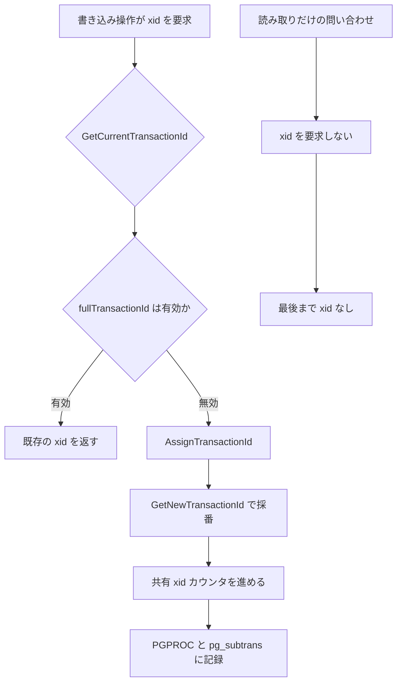
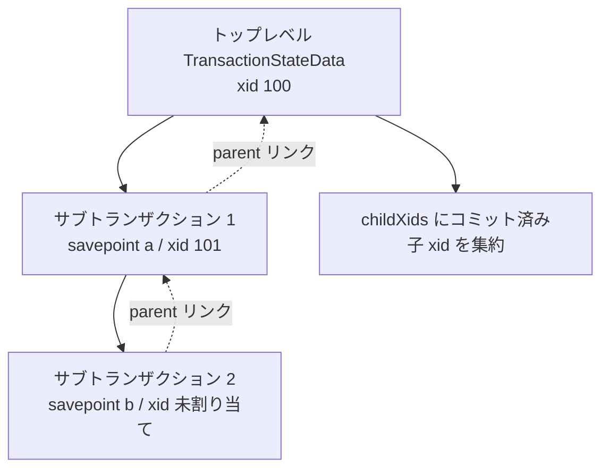

# 第33章 トランザクション管理

> **本章で読むソース**
>
> - [`src/backend/access/transam/xact.c`](https://github.com/postgres/postgres/blob/REL_18_4/src/backend/access/transam/xact.c)
> - [`src/include/access/xact.h`](https://github.com/postgres/postgres/blob/REL_18_4/src/include/access/xact.h)
> - [`src/backend/access/transam/transam.c`](https://github.com/postgres/postgres/blob/REL_18_4/src/backend/access/transam/transam.c)

## この章の狙い

第27章で、各タプルの `t_xmin`/`t_xmax` をスナップショットと突き合わせて可視性を判定する仕組みを読んだ。
そこで前提にしていたのは、トランザクションが ID（xid）を持ち、コミット済みかどうかが commit log（clog）に記録されている、という事実である。
本章はその前提が作られる側、つまりトランザクションそのものの開始、コミット、アボートを制御するコードを読む。

中心は `xact.c` である。
このファイルは2つの状態機械を持つ。
ひとつは内部状態 `TransState`（開始中、実行中、コミット中、アボート中）であり、もうひとつはクライアントから見たブロック状態 `TBlockState`（`BEGIN` を受けた、`COMMIT` を受けた、セーブポイントの中、といった高レベルの状態）である。
本章はこの2層の状態機械をまず俯瞰し、続いて `StartTransaction`、`CommitTransaction`、`AbortTransaction` の三つの遷移関数を順に追う。

コミットの核心は `RecordTransactionCommit` にある。
ここで WAL にコミットレコードを書き、clog に「コミット済み」を刻む。
この2つがそろって初めて、トランザクションは永続的にコミットされたことになる。

最後に、本章で読むコードに織り込まれた最適化を1つ機構レベルで説明する。
読み取りだけのトランザクションは xid を一切割り当てず、コミット時のレコード書き込みも clog 更新も丸ごと省く、というものである。

## 前提

第27章で MVCC と可視性判定、すなわち xid とスナップショット、clog を読んだ。
第24章でヒープタプルの `t_xmin`/`t_xmax` を読んだ。
本章はそれらの値を「誰が、いつ、どう書くか」に集中する。

WAL（先行書き込みログ）そのものの構造とフラッシュの仕組みは第38章で扱う。
clog（`pg_xact`）を SLRU として管理する詳細も本章では深入りせず、`TransactionIdCommitTree` がトランザクションを「コミット済み」に印を付ける、という機能の単位で扱う。

## 2層の状態機械

トランザクションの状態は、低レベルと高レベルの2つに分かれて表現される。
低レベルの `TransState` は、いまトランザクションの一生のどの段階にいるかを表す。

[`src/backend/access/transam/xact.c` L141-L149](https://github.com/postgres/postgres/blob/REL_18_4/src/backend/access/transam/xact.c#L141-L149)

```c
typedef enum TransState
{
	TRANS_DEFAULT,				/* idle */
	TRANS_START,				/* transaction starting */
	TRANS_INPROGRESS,			/* inside a valid transaction */
	TRANS_COMMIT,				/* commit in progress */
	TRANS_ABORT,				/* abort in progress */
	TRANS_PREPARE,				/* prepare in progress */
} TransState;
```

これに対して高レベルの `TBlockState` は、クライアントが投げた `BEGIN`/`COMMIT`/`ROLLBACK`/`SAVEPOINT` といったコマンドに対する応答として、トランザクションブロックがいまどの局面にあるかを表す。

[`src/backend/access/transam/xact.c` L157-L184](https://github.com/postgres/postgres/blob/REL_18_4/src/backend/access/transam/xact.c#L157-L184)

```c
typedef enum TBlockState
{
	/* not-in-transaction-block states */
	TBLOCK_DEFAULT,				/* idle */
	TBLOCK_STARTED,				/* running single-query transaction */

	/* transaction block states */
	TBLOCK_BEGIN,				/* starting transaction block */
	TBLOCK_INPROGRESS,			/* live transaction */
	TBLOCK_IMPLICIT_INPROGRESS, /* live transaction after implicit BEGIN */
	TBLOCK_PARALLEL_INPROGRESS, /* live transaction inside parallel worker */
	TBLOCK_END,					/* COMMIT received */
	TBLOCK_ABORT,				/* failed xact, awaiting ROLLBACK */
	TBLOCK_ABORT_END,			/* failed xact, ROLLBACK received */
	TBLOCK_ABORT_PENDING,		/* live xact, ROLLBACK received */
	TBLOCK_PREPARE,				/* live xact, PREPARE received */

	/* subtransaction states */
	TBLOCK_SUBBEGIN,			/* starting a subtransaction */
	TBLOCK_SUBINPROGRESS,		/* live subtransaction */
	TBLOCK_SUBRELEASE,			/* RELEASE received */
	TBLOCK_SUBCOMMIT,			/* COMMIT received while TBLOCK_SUBINPROGRESS */
	TBLOCK_SUBABORT,			/* failed subxact, awaiting ROLLBACK */
	TBLOCK_SUBABORT_END,		/* failed subxact, ROLLBACK received */
	TBLOCK_SUBABORT_PENDING,	/* live subxact, ROLLBACK received */
	TBLOCK_SUBRESTART,			/* live subxact, ROLLBACK TO received */
	TBLOCK_SUBABORT_RESTART,	/* failed subxact, ROLLBACK TO received */
} TBlockState;
```

2層に分ける理由は、関心が異なるからである。
`TransState` は、`StartTransaction` が走っている最中なのか、もう実行中なのか、コミット処理に入ったのか、という「処理のどこを実行しているか」を表す。
`TBlockState` は、クライアントが明示的な `BEGIN` でブロックを開いたのか、エラーで失敗して `ROLLBACK` 待ちなのか、セーブポイントの内側にいるのか、という「ブロックとしての立場」を表す。
コマンドを受け取って状態を進める `StartTransactionCommand` と `CommitTransactionCommand` は `TBlockState` を見て分岐し、その分岐の中から `StartTransaction` などの低レベル遷移を呼び出す。

各トランザクションの状態は `TransactionStateData` 構造体に集約される。
この構造体は xid、ブロック状態、入れ子の深さ、メモリコンテキスト、子トランザクションの xid 配列、そして親へのリンクを持つ。

[`src/backend/access/transam/xact.c` L193-L219](https://github.com/postgres/postgres/blob/REL_18_4/src/backend/access/transam/xact.c#L193-L219)

```c
typedef struct TransactionStateData
{
	FullTransactionId fullTransactionId;	/* my FullTransactionId */
	SubTransactionId subTransactionId;	/* my subxact ID */
	char	   *name;			/* savepoint name, if any */
	int			savepointLevel; /* savepoint level */
	TransState	state;			/* low-level state */
	TBlockState blockState;		/* high-level state */
	int			nestingLevel;	/* transaction nesting depth */
	int			gucNestLevel;	/* GUC context nesting depth */
	MemoryContext curTransactionContext;	/* my xact-lifetime context */
	ResourceOwner curTransactionOwner;	/* my query resources */
	MemoryContext priorContext; /* CurrentMemoryContext before xact started */
	TransactionId *childXids;	/* subcommitted child XIDs, in XID order */
	int			nChildXids;		/* # of subcommitted child XIDs */
	int			maxChildXids;	/* allocated size of childXids[] */
	Oid			prevUser;		/* previous CurrentUserId setting */
	int			prevSecContext; /* previous SecurityRestrictionContext */
	bool		prevXactReadOnly;	/* entry-time xact r/o state */
	bool		startedInRecovery;	/* did we start in recovery? */
	bool		didLogXid;		/* has xid been included in WAL record? */
	int			parallelModeLevel;	/* Enter/ExitParallelMode counter */
	bool		parallelChildXact;	/* is any parent transaction parallel? */
	bool		chain;			/* start a new block after this one */
	bool		topXidLogged;	/* for a subxact: is top-level XID logged? */
	struct TransactionStateData *parent;	/* back link to parent */
} TransactionStateData;
```

トップレベルの状態は静的変数 `TopTransactionStateData` に置かれ、初期値は `TRANS_DEFAULT`/`TBLOCK_DEFAULT` である。
セーブポイントで入れ子のサブトランザクションを開くと、新しい `TransactionStateData` が確保され、`parent` リンクで親につながれてスタックを成す。
本章の後半でこのスタックを読む。

ここで注目すべきは `fullTransactionId` が状態の一部に過ぎず、開始時点では `Invalid` で始まる点である。
xid は開始と同時には割り当てられない。
次の節で、いつ割り当てられるかを読む。

## トランザクションの開始 `StartTransaction`

`StartTransaction` は、`TRANS_DEFAULT` から始めて各種サブシステムを初期化し、最後に `TRANS_INPROGRESS` まで進める。
入口で状態が `TRANS_DEFAULT` であることを確認し、まず `TRANS_START` に移してから初期化を進める。

[`src/backend/access/transam/xact.c` L2077-L2103](https://github.com/postgres/postgres/blob/REL_18_4/src/backend/access/transam/xact.c#L2077-L2103)

```c
	/* check the current transaction state */
	Assert(s->state == TRANS_DEFAULT);

	/*
	 * Set the current transaction state information appropriately during
	 * start processing.  Note that once the transaction status is switched
	 * this process cannot fail until the user ID and the security context
	 * flags are fetched below.
	 */
	s->state = TRANS_START;
	s->fullTransactionId = InvalidFullTransactionId;	/* until assigned */

	/* Determine if statements are logged in this transaction */
	xact_is_sampled = log_xact_sample_rate != 0 &&
		(log_xact_sample_rate == 1 ||
		 pg_prng_double(&pg_global_prng_state) <= log_xact_sample_rate);

	/*
	 * initialize current transaction state fields
	 *
	 * note: prevXactReadOnly is not used at the outermost level
	 */
	s->nestingLevel = 1;
	s->gucNestLevel = 1;
	s->childXids = NULL;
	s->nChildXids = 0;
	s->maxChildXids = 0;
```

`fullTransactionId` に `InvalidFullTransactionId` を入れているのが要点である。
開始の時点では永続的な xid を割り当てず、「until assigned」とコメントが明記するとおり、必要になるまで採番を遅らせる。

代わりに `StartTransaction` が確保するのは、軽い**仮想トランザクション ID**（vxid）である。
これはプロセス番号とローカルなカウンタの組で、共有資源の採番を伴わない。

[`src/backend/access/transam/xact.c` L2157-L2177](https://github.com/postgres/postgres/blob/REL_18_4/src/backend/access/transam/xact.c#L2157-L2177)

```c
	/*
	 * Assign a new LocalTransactionId, and combine it with the proc number to
	 * form a virtual transaction id.
	 */
	vxid.procNumber = MyProcNumber;
	vxid.localTransactionId = GetNextLocalTransactionId();

	/*
	 * Lock the virtual transaction id before we announce it in the proc array
	 */
	VirtualXactLockTableInsert(vxid);

	/*
	 * Advertise it in the proc array.  We assume assignment of
	 * localTransactionId is atomic, and the proc number should be set
	 * already.
	 */
	Assert(MyProc->vxid.procNumber == vxid.procNumber);
	MyProc->vxid.lxid = vxid.localTransactionId;

	TRACE_POSTGRESQL_TRANSACTION_START(vxid.localTransactionId);
```

仮想トランザクション ID があれば、他のバックエンドはこのトランザクションを名指しでロック待ちの対象にできる。
本物の xid を採番しなくても、トランザクションの存在を表明できるわけである。
初期化を終えると、状態を `TRANS_INPROGRESS` にして開始処理を完了する。

[`src/backend/access/transam/xact.c` L2208-L2219](https://github.com/postgres/postgres/blob/REL_18_4/src/backend/access/transam/xact.c#L2208-L2219)

```c
	/*
	 * done with start processing, set current transaction state to "in
	 * progress"
	 */
	s->state = TRANS_INPROGRESS;

	/* Schedule transaction timeout */
	if (TransactionTimeout > 0)
		enable_timeout_after(TRANSACTION_TIMEOUT, TransactionTimeout);

	ShowTransactionState("StartTransaction");
}
```

## xid の遅延割り当て `AssignTransactionId`

xid を実際に採番するのは `AssignTransactionId` である。
この関数は `GetCurrentTransactionId` や `GetTopTransactionId` から呼ばれ、しかもそれらは xid がまだ無いときに限って呼び出す。

[`src/backend/access/transam/xact.c` L453-L461](https://github.com/postgres/postgres/blob/REL_18_4/src/backend/access/transam/xact.c#L453-L461)

```c
TransactionId
GetCurrentTransactionId(void)
{
	TransactionState s = CurrentTransactionState;

	if (!FullTransactionIdIsValid(s->fullTransactionId))
		AssignTransactionId(s);
	return XidFromFullTransactionId(s->fullTransactionId);
}
```

`GetCurrentTransactionId` は、書き込みを伴うコードパスから呼ばれる。
ヒープにタプルを挿入する `heap_insert` は、新しいタプルの `t_xmin` に入れる xid を得るためにこの関数を呼ぶ。
つまり xid は、トランザクションが「初めて何かを書こうとした」その瞬間に採番される。
読み取りだけのトランザクションは `GetCurrentTransactionId` を呼ばないので、最後まで xid を持たない。

`AssignTransactionId` の冒頭は、この関数を呼べる前提を確認する。
状態は `TRANS_INPROGRESS` でなければならず、まだ xid を持っていてはならない。

[`src/backend/access/transam/xact.c` L634-L643](https://github.com/postgres/postgres/blob/REL_18_4/src/backend/access/transam/xact.c#L634-L643)

```c
static void
AssignTransactionId(TransactionState s)
{
	bool		isSubXact = (s->parent != NULL);
	ResourceOwner currentOwner;
	bool		log_unknown_top = false;

	/* Assert that caller didn't screw up */
	Assert(!FullTransactionIdIsValid(s->fullTransactionId));
	Assert(s->state == TRANS_INPROGRESS);
```

サブトランザクションが先に xid を要求した場合、子の xid は親より後の番号でなければならない。
そこで、まだ xid を持たない親を下から上にたどって配列に積み、上から順に採番していく。
これにより「子の xid は常に親より後」という不変条件が保たれる。

[`src/backend/access/transam/xact.c` L654-L681](https://github.com/postgres/postgres/blob/REL_18_4/src/backend/access/transam/xact.c#L654-L681)

```c
	/*
	 * Ensure parent(s) have XIDs, so that a child always has an XID later
	 * than its parent.  Mustn't recurse here, or we might get a stack
	 * overflow if we're at the bottom of a huge stack of subtransactions none
	 * of which have XIDs yet.
	 */
	if (isSubXact && !FullTransactionIdIsValid(s->parent->fullTransactionId))
	{
		TransactionState p = s->parent;
		TransactionState *parents;
		size_t		parentOffset = 0;

		parents = palloc(sizeof(TransactionState) * s->nestingLevel);
		while (p != NULL && !FullTransactionIdIsValid(p->fullTransactionId))
		{
			parents[parentOffset++] = p;
			p = p->parent;
		}

		/*
		 * This is technically a recursive call, but the recursion will never
		 * be more than one layer deep.
		 */
		while (parentOffset != 0)
			AssignTransactionId(parents[--parentOffset]);

		pfree(parents);
	}
```

実際の採番は `GetNewTransactionId` が行う。
ここで初めて共有メモリの xid カウンタが進み、`PGPROC` と `pg_subtrans` に xid が記録される。

[`src/backend/access/transam/xact.c` L697-L719](https://github.com/postgres/postgres/blob/REL_18_4/src/backend/access/transam/xact.c#L697-L719)

```c
	/*
	 * Generate a new FullTransactionId and record its xid in PGPROC and
	 * pg_subtrans.
	 *
	 * NB: we must make the subtrans entry BEFORE the Xid appears anywhere in
	 * shared storage other than PGPROC; because if there's no room for it in
	 * PGPROC, the subtrans entry is needed to ensure that other backends see
	 * the Xid as "running".  See GetNewTransactionId.
	 */
	s->fullTransactionId = GetNewTransactionId(isSubXact);
	if (!isSubXact)
		XactTopFullTransactionId = s->fullTransactionId;

	if (isSubXact)
		SubTransSetParent(XidFromFullTransactionId(s->fullTransactionId),
						  XidFromFullTransactionId(s->parent->fullTransactionId));

	/*
	 * If it's a top-level transaction, the predicate locking system needs to
	 * be told about it too.
	 */
	if (!isSubXact)
		RegisterPredicateLockingXid(XidFromFullTransactionId(s->fullTransactionId));
```

この遅延割り当てが本章の中心的な最適化である。
判断のフローを図にすると次のようになる。



読み取りだけのトランザクションが xid を持たないことが、なぜ速さに効くのかは、次のコミットの節で具体的に見える。

## コミットの全体像 `CommitTransaction`

`CommitTransaction` は `TRANS_INPROGRESS` から始まり、コミット前処理、永続化、後始末を順に行って `TRANS_DEFAULT` に戻る。
入口では状態が `TRANS_INPROGRESS` であることを確かめる。

[`src/backend/access/transam/xact.c` L2242-L2248](https://github.com/postgres/postgres/blob/REL_18_4/src/backend/access/transam/xact.c#L2242-L2248)

```c
	/*
	 * check the current transaction state
	 */
	if (s->state != TRANS_INPROGRESS)
		elog(WARNING, "CommitTransaction while in %s state",
			 TransStateAsString(s->state));
	Assert(s->parent == NULL);
```

前半は、ユーザー定義コードを呼ぶ可能性のある処理をすべて先に片付ける。
遅延トリガの発火と、開いているカーソル（ポータル）の整理を、新しい処理が出てこなくなるまでループで繰り返す。

[`src/backend/access/transam/xact.c` L2257-L2271](https://github.com/postgres/postgres/blob/REL_18_4/src/backend/access/transam/xact.c#L2257-L2271)

```c
	for (;;)
	{
		/*
		 * Fire all currently pending deferred triggers.
		 */
		AfterTriggerFireDeferred();

		/*
		 * Close open portals (converting holdable ones into static portals).
		 * If there weren't any, we are done ... otherwise loop back to check
		 * if they queued deferred triggers.  Lather, rinse, repeat.
		 */
		if (!PreCommit_Portals(false))
			break;
	}
```

ユーザーコードを呼びうる処理を片付けたら、状態を `TRANS_COMMIT` に進め、いよいよ永続化に入る。
ここで `RecordTransactionCommit` を呼ぶ。
コメントが「This is where we durably commit.」と述べるとおり、ここが永続的なコミットの瞬間である。

[`src/backend/access/transam/xact.c` L2347-L2366](https://github.com/postgres/postgres/blob/REL_18_4/src/backend/access/transam/xact.c#L2347-L2366)

```c
	/*
	 * set the current transaction state information appropriately during
	 * commit processing
	 */
	s->state = TRANS_COMMIT;
	s->parallelModeLevel = 0;
	s->parallelChildXact = false;	/* should be false already */

	/* Disable transaction timeout */
	if (TransactionTimeout > 0)
		disable_timeout(TRANSACTION_TIMEOUT, false);

	if (!is_parallel_worker)
	{
		/*
		 * We need to mark our XIDs as committed in pg_xact.  This is where we
		 * durably commit.
		 */
		latestXid = RecordTransactionCommit();
	}
```

`RecordTransactionCommit` が返すのは、このトランザクションとその子のうち最も新しい xid である。
これを `ProcArrayEndTransaction` に渡して、共有メモリの `ProcArray` から自分の実行中表明を取り下げる。
順序が重要で、clog に印を付けた後、かつ保持ロックを解放する前にこれを行う。

[`src/backend/access/transam/xact.c` L2384-L2389](https://github.com/postgres/postgres/blob/REL_18_4/src/backend/access/transam/xact.c#L2384-L2389)

```c
	/*
	 * Let others know about no transaction in progress by me. Note that this
	 * must be done _before_ releasing locks we hold and _after_
	 * RecordTransactionCommit.
	 */
	ProcArrayEndTransaction(MyProc, latestXid);
```

この後はロックの解放やキャッシュの後始末が続き、最後に状態を `TRANS_DEFAULT` に戻して終わる。
後始末でエラーを投げてもアボートには戻れないため、ここから先は資源の解放だけに徹する設計になっている。

## コミットの核心 `RecordTransactionCommit`

`RecordTransactionCommit` は2つの仕事をする。
WAL にコミットレコードを書くことと、clog にコミット済みを刻むことである。
冒頭でこのトランザクションの xid を取得し、有効かどうかで分岐する。

[`src/backend/access/transam/xact.c` L1314-L1319](https://github.com/postgres/postgres/blob/REL_18_4/src/backend/access/transam/xact.c#L1314-L1319)

```c
static TransactionId
RecordTransactionCommit(void)
{
	TransactionId xid = GetTopTransactionIdIfAny();
	bool		markXidCommitted = TransactionIdIsValid(xid);
	TransactionId latestXid = InvalidTransactionId;
```

`GetTopTransactionIdIfAny` は、xid を持っていればそれを返し、持っていなければ `InvalidTransactionId` を返す（新たな採番はしない）。
`markXidCommitted` はこの後の処理全体を切り替えるフラグで、xid を持たない読み取りだけのトランザクションでは偽になる。

xid を持たない場合、コミットレコードを書くことはできず、また書く意味もない。
ただし HOT プルーニングのように、xid なしでも WAL を書いた場合がありうる。
そのときだけフラッシュのために処理を続け、そうでなければ後始末へ直行する。

[`src/backend/access/transam/xact.c` L1350-L1406](https://github.com/postgres/postgres/blob/REL_18_4/src/backend/access/transam/xact.c#L1350-L1406)

```c
	/*
	 * If we haven't been assigned an XID yet, we neither can, nor do we want
	 * to write a COMMIT record.
	 */
	if (!markXidCommitted)
	{
		/*
		 * We expect that every RelationDropStorage is followed by a catalog
		 * update, and hence XID assignment, so we shouldn't get here with any
		 * pending deletes. Same is true for dropping stats.
		 *
		 * Use a real test not just an Assert to check this, since it's a bit
		 * fragile.
		 */
		if (nrels != 0 || ndroppedstats != 0)
			elog(ERROR, "cannot commit a transaction that deleted files but has no xid");

		/* Can't have child XIDs either; AssignTransactionId enforces this */
		Assert(nchildren == 0);

		/*
		 * Transactions without an assigned xid can contain invalidation
		 * messages.  While inplace updates do this, this is not known to be
		 * necessary; see comment at inplace CacheInvalidateHeapTuple().
		 * Extensions might still rely on this capability, and standbys may
		 * need to process those invals.  We can't emit a commit record
		 * without an xid, and we don't want to force assigning an xid,
		 * because that'd be problematic for e.g. vacuum.  Hence we emit a
		 * bespoke record for the invalidations. We don't want to use that in
		 * case a commit record is emitted, so they happen synchronously with
		 * commits (besides not wanting to emit more WAL records).
		 *
		 * XXX Every known use of this capability is a defect.  Since an XID
		 * isn't controlling visibility of the change that prompted invals,
		 * other sessions need the inval even if this transactions aborts.
		 *
		 * ON COMMIT DELETE ROWS does a nontransactional index_build(), which
		 * queues a relcache inval, including in transactions without an xid
		 * that had read the (empty) table.  Standbys don't need any ON COMMIT
		 * DELETE ROWS invals, but we've not done the work to withhold them.
		 */
		if (nmsgs != 0)
		{
			LogStandbyInvalidations(nmsgs, invalMessages,
									RelcacheInitFileInval);
			wrote_xlog = true;	/* not strictly necessary */
		}

		/*
		 * If we didn't create XLOG entries, we're done here; otherwise we
		 * should trigger flushing those entries the same as a commit record
		 * would.  This will primarily happen for HOT pruning and the like; we
		 * want these to be flushed to disk in due time.
		 */
		if (!wrote_xlog)
			goto cleanup;
	}
```

xid を持つ場合は本筋に入る。
まず「コミットのクリティカルセクション」に入り、自分のプロセスに `DELAY_CHKPT_START` フラグを立てる。
これは、WAL レコードを書いてから clog を更新するまでの間にチェックポイントが割り込むのを防ぐためである。
もしこの保護がなければ、チェックポイントが WAL レコードの後ろにリカバリ開始点を置きながら clog 更新をディスクへ書き損ね、直後のクラッシュでコミットが失われうる。

[`src/backend/access/transam/xact.c` L1418-L1448](https://github.com/postgres/postgres/blob/REL_18_4/src/backend/access/transam/xact.c#L1418-L1448)

```c
		/*
		 * Mark ourselves as within our "commit critical section".  This
		 * forces any concurrent checkpoint to wait until we've updated
		 * pg_xact.  Without this, it is possible for the checkpoint to set
		 * REDO after the XLOG record but fail to flush the pg_xact update to
		 * disk, leading to loss of the transaction commit if the system
		 * crashes a little later.
		 *
		 * Note: we could, but don't bother to, set this flag in
		 * RecordTransactionAbort.  That's because loss of a transaction abort
		 * is noncritical; the presumption would be that it aborted, anyway.
		 *
		 * It's safe to change the delayChkptFlags flag of our own backend
		 * without holding the ProcArrayLock, since we're the only one
		 * modifying it.  This makes checkpoint's determination of which xacts
		 * are delaying the checkpoint a bit fuzzy, but it doesn't matter.
		 */
		Assert((MyProc->delayChkptFlags & DELAY_CHKPT_START) == 0);
		START_CRIT_SECTION();
		MyProc->delayChkptFlags |= DELAY_CHKPT_START;

		/*
		 * Insert the commit XLOG record.
		 */
		XactLogCommitRecord(GetCurrentTransactionStopTimestamp(),
							nchildren, children, nrels, rels,
							ndroppedstats, droppedstats,
							nmsgs, invalMessages,
							RelcacheInitFileInval,
							MyXactFlags,
							InvalidTransactionId, NULL /* plain commit */ );
```

`XactLogCommitRecord` がコミットレコードを WAL バッファへ書く。
このレコードには、子トランザクションの xid、削除されたリレーション、無効化メッセージなど、コミットに伴って永続化すべき情報がまとめて載る。

次が同期コミットと非同期コミットの分岐である。
`synchronous_commit` が有効で、xid を持ち、かつ WAL を書いたなら、`XLogFlush` でコミットレコードをディスクへ確実に書き出してから clog を更新する。

[`src/backend/access/transam/xact.c` L1498-L1532](https://github.com/postgres/postgres/blob/REL_18_4/src/backend/access/transam/xact.c#L1498-L1532)

```c
	if ((wrote_xlog && markXidCommitted &&
		 synchronous_commit > SYNCHRONOUS_COMMIT_OFF) ||
		forceSyncCommit || nrels > 0)
	{
		XLogFlush(XactLastRecEnd);

		/*
		 * Now we may update the CLOG, if we wrote a COMMIT record above
		 */
		if (markXidCommitted)
			TransactionIdCommitTree(xid, nchildren, children);
	}
	else
	{
		/*
		 * Asynchronous commit case:
		 *
		 * This enables possible committed transaction loss in the case of a
		 * postmaster crash because WAL buffers are left unwritten. Ideally we
		 * could issue the WAL write without the fsync, but some
		 * wal_sync_methods do not allow separate write/fsync.
		 *
		 * Report the latest async commit LSN, so that the WAL writer knows to
		 * flush this commit.
		 */
		XLogSetAsyncXactLSN(XactLastRecEnd);

		/*
		 * We must not immediately update the CLOG, since we didn't flush the
		 * XLOG. Instead, we store the LSN up to which the XLOG must be
		 * flushed before the CLOG may be updated.
		 */
		if (markXidCommitted)
			TransactionIdAsyncCommitTree(xid, nchildren, children, XactLastRecEnd);
	}
```

`TransactionIdCommitTree` が clog（`pg_xact`）に印を付ける。
中身はトランザクションとその子を `TRANSACTION_STATUS_COMMITTED` に設定するだけの薄い関数である。

[`src/backend/access/transam/transam.c` L239-L245](https://github.com/postgres/postgres/blob/REL_18_4/src/backend/access/transam/transam.c#L239-L245)

```c
void
TransactionIdCommitTree(TransactionId xid, int nxids, TransactionId *xids)
{
	TransactionIdSetTreeStatus(xid, nxids, xids,
							   TRANSACTION_STATUS_COMMITTED,
							   InvalidXLogRecPtr);
}
```

ここで WAL とディスク、clog の関係を整理しておく。
WAL のコミットレコードがクラッシュリカバリの真実の源であり、clog はそのコミット状態を後で安く問い合わせるためのインデックスにあたる。
順序は「WAL を書く、ディスクへフラッシュする、clog を更新する」である。
WAL がディスクに着く前に clog を先に更新してしまうと、その間のクラッシュで「clog はコミット済みなのに WAL には記録がない」という矛盾が起こりうるため、同期コミットでは必ず `XLogFlush` を clog 更新より前に置く。
非同期コミットはこの順序を緩め、フラッシュを WAL ライタへ委ねる代わりに、クラッシュ時に直近のコミットが失われうることを許容する。

最後にクリティカルセクションを抜け、clog 更新の保護を解く。

[`src/backend/access/transam/xact.c` L1534-L1545](https://github.com/postgres/postgres/blob/REL_18_4/src/backend/access/transam/xact.c#L1534-L1545)

```c
	/*
	 * If we entered a commit critical section, leave it now, and let
	 * checkpoints proceed.
	 */
	if (markXidCommitted)
	{
		MyProc->delayChkptFlags &= ~DELAY_CHKPT_START;
		END_CRIT_SECTION();
	}

	/* Compute latestXid while we have the child XIDs handy */
	latestXid = TransactionIdLatest(xid, nchildren, children);
```

## アボート `AbortTransaction`

アボートはコミットの鏡像にあたるが、ユーザーコードを呼ばずに資源を手早く解放する点が違う。
入口で割り込みを抑止し、軽量ロックを真っ先に解放する。
後始末の途中でまた軽量ロックを取りにいく可能性があるためである。

[`src/backend/access/transam/xact.c` L2815-L2832](https://github.com/postgres/postgres/blob/REL_18_4/src/backend/access/transam/xact.c#L2815-L2832)

```c
	/* Prevent cancel/die interrupt while cleaning up */
	HOLD_INTERRUPTS();

	/* Disable transaction timeout */
	if (TransactionTimeout > 0)
		disable_timeout(TRANSACTION_TIMEOUT, false);

	/* Make sure we have a valid memory context and resource owner */
	AtAbort_Memory();
	AtAbort_ResourceOwner();

	/*
	 * Release any LW locks we might be holding as quickly as possible.
	 * (Regular locks, however, must be held till we finish aborting.)
	 * Releasing LW locks is critical since we might try to grab them again
	 * while cleaning up!
	 */
	LWLockReleaseAll();
```

状態を `TRANS_ABORT` に移し、アボートを clog に記録する。
記録するのは xid を割り当て済みの場合に限られる。
ここでもコメントが、xid を割り当てるところまで進んでいれば、という条件を明示している。

[`src/backend/access/transam/xact.c` L2880-L2933](https://github.com/postgres/postgres/blob/REL_18_4/src/backend/access/transam/xact.c#L2880-L2933)

```c
	/*
	 * set the current transaction state information appropriately during the
	 * abort processing
	 */
	s->state = TRANS_ABORT;

// ... (中略) ...

	/*
	 * Advertise the fact that we aborted in pg_xact (assuming that we got as
	 * far as assigning an XID to advertise).  But if we're inside a parallel
	 * worker, skip this; the user backend must be the one to write the abort
	 * record.
	 */
	if (!is_parallel_worker)
		latestXid = RecordTransactionAbort(false);
```

アボートでは、`RecordTransactionCommit` のクリティカルセクション保護に相当するものは省かれる。
アボートの記録が失われても、リカバリ側は「記録がない xid はアボートしたとみなす」ので、被害がないからである。
コミット側のコメントが「loss of a transaction abort is noncritical」と述べていたのは、この非対称性を指していた。

アボートが終わっても状態は `TRANS_ABORT` のまま留まり、その後の `CleanupTransaction` で `TRANS_DEFAULT` に戻る。
クライアントから見たブロックは `TBLOCK_ABORT` に置かれ、`ROLLBACK` が来るまで失敗状態を保ち続ける。

## サブトランザクションとセーブポイント

`SAVEPOINT` は、トランザクションの内側に部分的にやり直せる入れ子を作る。
各サブトランザクションは独自の `TransactionStateData` を持ち、`parent` リンクで親につながってスタックを成す。
このスタックを積むのが `PushTransaction` である。

[`src/backend/access/transam/xact.c` L5441-L5458](https://github.com/postgres/postgres/blob/REL_18_4/src/backend/access/transam/xact.c#L5441-L5458)

```c
	/*
	 * We can now stack a minimally valid subtransaction without fear of
	 * failure.
	 */
	s->fullTransactionId = InvalidFullTransactionId;	/* until assigned */
	s->subTransactionId = currentSubTransactionId;
	s->parent = p;
	s->nestingLevel = p->nestingLevel + 1;
	s->gucNestLevel = NewGUCNestLevel();
	s->savepointLevel = p->savepointLevel;
	s->state = TRANS_DEFAULT;
	s->blockState = TBLOCK_SUBBEGIN;
	GetUserIdAndSecContext(&s->prevUser, &s->prevSecContext);
	s->prevXactReadOnly = XactReadOnly;
	s->startedInRecovery = p->startedInRecovery;
	s->parallelModeLevel = 0;
	s->parallelChildXact = (p->parallelModeLevel != 0 || p->parallelChildXact);
	s->topXidLogged = false;
```

ここでも `fullTransactionId` は `InvalidFullTransactionId` で始まる。
サブトランザクションも xid を遅延割り当てし、内側で書き込みが起きて初めて採番する。
そして前述のとおり、サブトランザクションが xid を要求すると、`AssignTransactionId` はまず親の xid を先に採番してから子に番号を振る。

サブトランザクションをコミットしても、それだけでは clog にコミットは刻まれない。
子の xid はいったん `childXids` 配列を通じて親へ引き継がれ、トップレベルがコミットするときに `RecordTransactionCommit` が親子をまとめて clog に書く。
逆にサブトランザクションをアボートすれば、その内側の変更だけが取り消され、親は実行を続けられる。
これがセーブポイントへの `ROLLBACK TO` が「途中までやり直す」を実現する仕組みである。

入れ子の構造を図にすると次のようになる。



## まとめ

本章では、トランザクションの開始、コミット、アボートを制御するコードを読んだ。

- トランザクションの状態は、処理の段階を表す低レベルの `TransState`（`TRANS_DEFAULT`/`TRANS_START`/`TRANS_INPROGRESS`/`TRANS_COMMIT`/`TRANS_ABORT`）と、クライアントから見たブロックの立場を表す高レベルの `TBlockState` の2層で表される。
- `StartTransaction` は、xid を割り当てず共有資源を伴わない仮想トランザクション ID だけを確保しながら、`TRANS_START` を経て `TRANS_INPROGRESS` まで進める。
- xid を実際に採番する `AssignTransactionId` は `GetCurrentTransactionId` 経由で書き込み時に初めて呼ばれ、サブトランザクションが先に要求しても親から順に採番して「子の xid は親より後」を保つ。
- `CommitTransaction` は、ユーザーコードを呼びうる前処理を片付けてから `TRANS_COMMIT` に移り、`RecordTransactionCommit` で永続化する。
- `RecordTransactionCommit` は WAL にコミットレコードを書いて `XLogFlush` でディスクへ送ってから `TransactionIdCommitTree` で clog に「コミット済み」を刻み、同期コミットはこの順序を厳守して非同期コミットはフラッシュを WAL ライタへ委ねる。
- アボートはコミットの鏡像だが軽量ロックを真っ先に解放し、アボートの clog 記録には clog 更新の保護を省く（記録のない xid はアボート扱いになるので取りこぼしが安全側に倒れる）。
- サブトランザクションは `parent` リンクのスタックで表され、コミットした子の xid は親の `childXids` に集約されてトップレベルのコミット時にまとめて clog へ書かれる。

最適化として最も効くのは xid の遅延割り当てである。
読み取りだけのトランザクションは `GetCurrentTransactionId` を呼ばないので xid を持たず、`RecordTransactionCommit` ではコミットレコードの書き込みも clog 更新もまるごと省かれる。
共有 xid カウンタを進めないので、多数の読み取りトランザクションが xid 空間を消費せず、xid の周回（wraparound）を早めることもない。

## 関連する章

- [第24章　ページとタプルのレイアウト](../part05-storage-buffer/24-page-and-tuple-layout.md)：本章で採番した xid が書き込まれる先、タプルの `t_xmin`/`t_xmax`。
- [第27章　MVCC と可視性判定](../part06-table-mvcc/27-mvcc-and-visibility.md)：本章でコミットを刻んだ clog を読み取り、可視性を判定する側。
- [第34章　ロックマネージャ](34-lock-manager.md)：本章が仮想トランザクション ID や xid に取得するロックの実体。
- [第37章　スナップショットと ProcArray](37-snapshots-and-procarray.md)：`ProcArrayEndTransaction` が更新する `ProcArray` と、実行中 xid の集合管理。
- [第38章　WAL の仕組み](../part09-wal-recovery/38-wal.md)：`RecordTransactionCommit` が書くコミットレコードと `XLogFlush` の内部。
