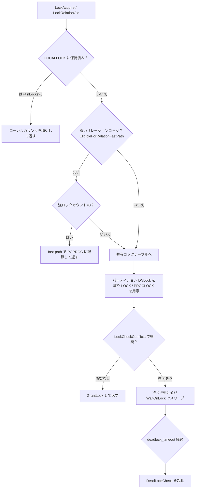
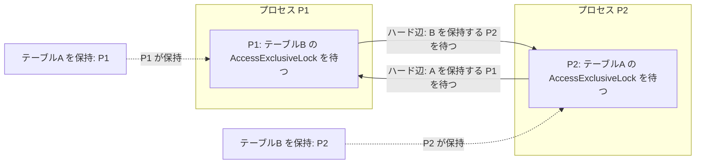

# 第34章 ロックマネージャ

> **本章で読むソース**
>
> - [`src/include/storage/lock.h`](https://github.com/postgres/postgres/blob/REL_18_4/src/include/storage/lock.h)
> - [`src/include/storage/lockdefs.h`](https://github.com/postgres/postgres/blob/REL_18_4/src/include/storage/lockdefs.h)
> - [`src/backend/storage/lmgr/lock.c`](https://github.com/postgres/postgres/blob/REL_18_4/src/backend/storage/lmgr/lock.c)
> - [`src/backend/storage/lmgr/lmgr.c`](https://github.com/postgres/postgres/blob/REL_18_4/src/backend/storage/lmgr/lmgr.c)
> - [`src/backend/storage/lmgr/deadlock.c`](https://github.com/postgres/postgres/blob/REL_18_4/src/backend/storage/lmgr/deadlock.c)
> - [`src/backend/storage/lmgr/proc.c`](https://github.com/postgres/postgres/blob/REL_18_4/src/backend/storage/lmgr/proc.c)

## この章の狙い

第27章で読んだ MVCC は、版を増やすことで読み手と書き手をすれ違わせ、行データの読み書きそのものをロックなしで進める。
それでも PostgreSQL は別種のロックを必要とする。
あるトランザクションがテーブルを `SELECT` で読んでいる最中に、別のトランザクションがそのテーブルを `DROP TABLE` で消そうとする状況は、版を増やしても解けない。
テーブルやインデックスといったオブジェクトの単位で、両立しない操作を相互に待たせる仕組みが要る。

この仕組みが**重量ロック**（heavyweight lock）である。
重量ロックは、ロック対象の種類とロックモードを共有メモリのロックテーブルに登録し、トランザクションの終了まで保持する。
LWLock（第35章）がデータ構造を数命令のあいだ守る短命なロックなのに対し、重量ロックは論理的なオブジェクトを長く守り、両立しない要求を待ち行列に並べ、デッドロックの検出まで引き受ける。

本章は、この重量ロックを取得する道筋を読む。
取得関数 `LockAcquire` がローカルキャッシュ、高速経路（fast-path）、共有ロックテーブル、待機の4段をどう順に試すか。
弱いロックを共有テーブルの競合判定なしに取る fast-path がなぜ速いか。
待ち行列が循環したとき `DeadLockCheck` が待ちグラフをどう探索して循環を見つけるか。
この3点を順に追う。

## 前提

第5章で共有メモリと、その上のハッシュテーブル（`ShmemInitHash`）を読んだ。
ロックテーブルはこの共有ハッシュの上に作られる。
第35章で扱う LWLock は、本章では共有ロックテーブルのパーティションを保護する下位のロックとして登場する。
重量ロックを待つプロセスのスリープと起床は `PGPROC` の待ち行列で行うが、その `PGPROC` 自体の管理は第37章で扱う。
本章は、論理オブジェクトへのロックの取得と競合判定、そしてデッドロック検出に集中する。

## ロック対象を表す `LOCKTAG`

重量ロックが守るのは、テーブルや行といった論理的なオブジェクトである。
これらを共有ハッシュの一つのキーで表すために、PostgreSQL は対象を `LOCKTAG` という16バイトの構造体に詰める。

[`src/include/storage/lock.h` L165-L173](https://github.com/postgres/postgres/blob/REL_18_4/src/include/storage/lock.h#L165-L173)

```c
typedef struct LOCKTAG
{
	uint32		locktag_field1; /* a 32-bit ID field */
	uint32		locktag_field2; /* a 32-bit ID field */
	uint32		locktag_field3; /* a 32-bit ID field */
	uint16		locktag_field4; /* a 16-bit ID field */
	uint8		locktag_type;	/* see enum LockTagType */
	uint8		locktag_lockmethodid;	/* lockmethod indicator */
} LOCKTAG;
```

4つの ID フィールドは汎用の入れ物で、`locktag_type` が示す対象の種類ごとに意味が変わる。
種類は `LockTagType` で定義され、リレーション全体、リレーションのページ、物理タプル、トランザクション ID など、ロックできるオブジェクトを列挙する。

[`src/include/storage/lock.h` L136-L151](https://github.com/postgres/postgres/blob/REL_18_4/src/include/storage/lock.h#L136-L151)

```c
typedef enum LockTagType
{
	LOCKTAG_RELATION,			/* whole relation */
	LOCKTAG_RELATION_EXTEND,	/* the right to extend a relation */
	LOCKTAG_DATABASE_FROZEN_IDS,	/* pg_database.datfrozenxid */
	LOCKTAG_PAGE,				/* one page of a relation */
	LOCKTAG_TUPLE,				/* one physical tuple */
	LOCKTAG_TRANSACTION,		/* transaction (for waiting for xact done) */
	LOCKTAG_VIRTUALTRANSACTION, /* virtual transaction (ditto) */
	LOCKTAG_SPECULATIVE_TOKEN,	/* speculative insertion Xid and token */
	LOCKTAG_OBJECT,				/* non-relation database object */
	LOCKTAG_USERLOCK,			/* reserved for old contrib/userlock code */
	LOCKTAG_ADVISORY,			/* advisory user locks */
	LOCKTAG_APPLY_TRANSACTION,	/* transaction being applied on a logical
								 * replication subscriber */
} LockTagType;
```

種類ごとに ID フィールドの意味を割り当てるのが、`SET_LOCKTAG_*` マクロである。
テーブル全体を表す `LOCKTAG_RELATION` の場合、フィールド1にデータベース OID、フィールド2にリレーション OID を置く。

[`src/include/storage/lock.h` L182-L188](https://github.com/postgres/postgres/blob/REL_18_4/src/include/storage/lock.h#L182-L188)

```c
#define SET_LOCKTAG_RELATION(locktag,dboid,reloid) \
	((locktag).locktag_field1 = (dboid), \
	 (locktag).locktag_field2 = (reloid), \
	 (locktag).locktag_field3 = 0, \
	 (locktag).locktag_field4 = 0, \
	 (locktag).locktag_type = LOCKTAG_RELATION, \
	 (locktag).locktag_lockmethodid = DEFAULT_LOCKMETHOD)
```

物理タプルを表す `LOCKTAG_TUPLE` なら、同じ4フィールドにデータベース OID、リレーション OID、ブロック番号、ページ内オフセットを順に詰める。
対象の種類が違っても、共有メモリのロックテーブルは単一のハッシュで済む。
キーは常にこの16バイトの `LOCKTAG` であり、`locktag_type` がその16バイトの読み方を決める。

## ロックモードと競合表 `LockConflicts`

`LOCKTAG` が「何を」守るかを表すのに対し、**ロックモード**は「どのように」守るかを表す。
標準のロックメソッドは8つのモードを持ち、`AccessShareLock` が最も弱く、`AccessExclusiveLock` が最も強い。

[`src/include/storage/lockdefs.h` L34-L48](https://github.com/postgres/postgres/blob/REL_18_4/src/include/storage/lockdefs.h#L34-L48)

```c
#define NoLock					0

#define AccessShareLock			1	/* SELECT */
#define RowShareLock			2	/* SELECT FOR UPDATE/FOR SHARE */
#define RowExclusiveLock		3	/* INSERT, UPDATE, DELETE */
#define ShareUpdateExclusiveLock 4	/* VACUUM (non-FULL), ANALYZE, CREATE
									 * INDEX CONCURRENTLY */
#define ShareLock				5	/* CREATE INDEX (WITHOUT CONCURRENTLY) */
#define ShareRowExclusiveLock	6	/* like EXCLUSIVE MODE, but allows ROW
									 * SHARE */
#define ExclusiveLock			7	/* blocks ROW SHARE/SELECT...FOR UPDATE */
#define AccessExclusiveLock		8	/* ALTER TABLE, DROP TABLE, VACUUM FULL,
									 * and unqualified LOCK TABLE */

#define MaxLockMode				8	/* highest standard lock mode */
```

各モードの右側のコメントが、そのモードを取る SQL を示す。
読み取りの `SELECT` は最弱の `AccessShareLock`、行の更新を伴う `INSERT`/`UPDATE`/`DELETE` は `RowExclusiveLock`、テーブル定義を変える `ALTER TABLE` や `DROP TABLE` は最強の `AccessExclusiveLock` を取る。

どのモードとどのモードが両立しないかは、`LockConflicts` 表が一行ずつ定めている。
各要素はビットマスクで、添字のモードと衝突する相手モードのビットが立つ。

[`src/backend/storage/lmgr/lock.c` L65-L105](https://github.com/postgres/postgres/blob/REL_18_4/src/backend/storage/lmgr/lock.c#L65-L105)

```c
static const LOCKMASK LockConflicts[] = {
	0,

	/* AccessShareLock */
	LOCKBIT_ON(AccessExclusiveLock),

	/* RowShareLock */
	LOCKBIT_ON(ExclusiveLock) | LOCKBIT_ON(AccessExclusiveLock),

	/* RowExclusiveLock */
	LOCKBIT_ON(ShareLock) | LOCKBIT_ON(ShareRowExclusiveLock) |
	LOCKBIT_ON(ExclusiveLock) | LOCKBIT_ON(AccessExclusiveLock),

	/* ShareUpdateExclusiveLock */
	LOCKBIT_ON(ShareUpdateExclusiveLock) |
	LOCKBIT_ON(ShareLock) | LOCKBIT_ON(ShareRowExclusiveLock) |
	LOCKBIT_ON(ExclusiveLock) | LOCKBIT_ON(AccessExclusiveLock),

	/* ShareLock */
	LOCKBIT_ON(RowExclusiveLock) | LOCKBIT_ON(ShareUpdateExclusiveLock) |
	LOCKBIT_ON(ShareRowExclusiveLock) |
	LOCKBIT_ON(ExclusiveLock) | LOCKBIT_ON(AccessExclusiveLock),

	/* ShareRowExclusiveLock */
	LOCKBIT_ON(RowExclusiveLock) | LOCKBIT_ON(ShareUpdateExclusiveLock) |
	LOCKBIT_ON(ShareLock) | LOCKBIT_ON(ShareRowExclusiveLock) |
	LOCKBIT_ON(ExclusiveLock) | LOCKBIT_ON(AccessExclusiveLock),

	/* ExclusiveLock */
	LOCKBIT_ON(RowShareLock) |
	LOCKBIT_ON(RowExclusiveLock) | LOCKBIT_ON(ShareUpdateExclusiveLock) |
	LOCKBIT_ON(ShareLock) | LOCKBIT_ON(ShareRowExclusiveLock) |
	LOCKBIT_ON(ExclusiveLock) | LOCKBIT_ON(AccessExclusiveLock),

	/* AccessExclusiveLock */
	LOCKBIT_ON(AccessShareLock) | LOCKBIT_ON(RowShareLock) |
	LOCKBIT_ON(RowExclusiveLock) | LOCKBIT_ON(ShareUpdateExclusiveLock) |
	LOCKBIT_ON(ShareLock) | LOCKBIT_ON(ShareRowExclusiveLock) |
	LOCKBIT_ON(ExclusiveLock) | LOCKBIT_ON(AccessExclusiveLock)

};
```

この表から2つの性質が読み取れる。
第1に、最弱の `AccessShareLock` が衝突する相手は最強の `AccessExclusiveLock` だけである。
読み取り中の `SELECT` を待たせるのは `DROP TABLE` のような排他操作だけで、他の `SELECT` や `INSERT` とは並行できる。
第2に、`RowExclusiveLock` どうしは衝突しない。
だからテーブルへの `INSERT`/`UPDATE`/`DELETE` は、互いにテーブルロックで待つことはない。
行どうしの競合は別の機構（行ロック）が見るのであって、テーブルレベルの重量ロックは「テーブルを書き換える権利」どうしを衝突させない。

この衝突しない弱いモード（`AccessShareLock`、`RowShareLock`、`RowExclusiveLock`）が、後で読む fast-path の対象になる。

## 取得関数 `LockAcquire` の4段構え

ロックを取る入口は `LockAcquire` である。
これは引数を補って `LockAcquireExtended` を呼ぶ薄いラッパーで、実体は `LockAcquireExtended` にある。

[`src/backend/storage/lmgr/lock.c` L807-L815](https://github.com/postgres/postgres/blob/REL_18_4/src/backend/storage/lmgr/lock.c#L807-L815)

```c
LockAcquireResult
LockAcquire(const LOCKTAG *locktag,
			LOCKMODE lockmode,
			bool sessionLock,
			bool dontWait)
{
	return LockAcquireExtended(locktag, lockmode, sessionLock, dontWait,
							   true, NULL, false);
}
```

`LockAcquireExtended` は、ロック取得を4段で試みる。
ローカルキャッシュ、fast-path、共有ロックテーブル、待機の順である。
前段で取れれば、より重い後段には進まない。
以下、その順に読む。

### 第1段 ローカルキャッシュ `LOCALLOCK`

各バックエンドは、自分がいま関心を持つロックを `LOCALLOCK` という自プロセス内のハッシュに記録する。
同じロックを同じトランザクションで何度も取る要求を、共有メモリへ触れずに数えるためである。

取得はまず、`LOCKTAG` とロックモードを合わせた `LOCALLOCKTAG` をキーに、このローカルハッシュを引くところから始まる。

[`src/backend/storage/lmgr/lock.c` L886-L928](https://github.com/postgres/postgres/blob/REL_18_4/src/backend/storage/lmgr/lock.c#L886-L928)

```c
	/*
	 * Find or create a LOCALLOCK entry for this lock and lockmode
	 */
	MemSet(&localtag, 0, sizeof(localtag)); /* must clear padding */
	localtag.lock = *locktag;
	localtag.mode = lockmode;

	locallock = (LOCALLOCK *) hash_search(LockMethodLocalHash,
										  &localtag,
										  HASH_ENTER, &found);

	/*
	 * if it's a new locallock object, initialize it
	 */
	if (!found)
	{
		locallock->lock = NULL;
		locallock->proclock = NULL;
		locallock->hashcode = LockTagHashCode(&(localtag.lock));
		locallock->nLocks = 0;
		locallock->holdsStrongLockCount = false;
		locallock->lockCleared = false;
		locallock->numLockOwners = 0;
		locallock->maxLockOwners = 8;
		locallock->lockOwners = NULL;	/* in case next line fails */
		locallock->lockOwners = (LOCALLOCKOWNER *)
			MemoryContextAlloc(TopMemoryContext,
							   locallock->maxLockOwners * sizeof(LOCALLOCKOWNER));
	}
	else
	{
		/* Make sure there will be room to remember the lock */
		if (locallock->numLockOwners >= locallock->maxLockOwners)
		{
			int			newsize = locallock->maxLockOwners * 2;

			locallock->lockOwners = (LOCALLOCKOWNER *)
				repalloc(locallock->lockOwners,
						 newsize * sizeof(LOCALLOCKOWNER));
			locallock->maxLockOwners = newsize;
		}
	}
	hashcode = locallock->hashcode;
```

`LOCALLOCK` が `nLocks > 0` を持つなら、このバックエンドはすでにそのロックを保持している。
このときは共有メモリに一切触れず、ローカルのカウンタを増やして即座に返す。

[`src/backend/storage/lmgr/lock.c` L933-L946](https://github.com/postgres/postgres/blob/REL_18_4/src/backend/storage/lmgr/lock.c#L933-L946)

```c
	/*
	 * If we already hold the lock, we can just increase the count locally.
	 *
	 * If lockCleared is already set, caller need not worry about absorbing
	 * sinval messages related to the lock's object.
	 */
	if (locallock->nLocks > 0)
	{
		GrantLockLocal(locallock, owner);
		if (locallock->lockCleared)
			return LOCKACQUIRE_ALREADY_CLEAR;
		else
			return LOCKACQUIRE_ALREADY_HELD;
	}
```

実行計画の各所が同じテーブルへのロックを繰り返し要求するのは珍しくない。
この第1段が、その繰り返しを共有メモリへの往復なしに吸収する。

### 第2段 高速経路 fast-path

ローカルキャッシュに無いロックでも、それが弱いリレーションロックなら、共有ロックテーブルを触らずに取れる場合がある。
これが fast-path である。

fast-path を使える条件は `EligibleForRelationFastPath` マクロが定める。
デフォルトのロックメソッドで、対象がリレーション全体で、現在のデータベースのリレーションで、モードが `ShareUpdateExclusiveLock` より弱いことである。

[`src/backend/storage/lmgr/lock.c` L259-L272](https://github.com/postgres/postgres/blob/REL_18_4/src/backend/storage/lmgr/lock.c#L259-L272)

```c
/*
 * The fast-path lock mechanism is concerned only with relation locks on
 * unshared relations by backends bound to a database.  The fast-path
 * mechanism exists mostly to accelerate acquisition and release of locks
 * that rarely conflict.  Because ShareUpdateExclusiveLock is
 * self-conflicting, it can't use the fast-path mechanism; but it also does
 * not conflict with any of the locks that do, so we can ignore it completely.
 */
#define EligibleForRelationFastPath(locktag, mode) \
	((locktag)->locktag_lockmethodid == DEFAULT_LOCKMETHOD && \
	(locktag)->locktag_type == LOCKTAG_RELATION && \
	(locktag)->locktag_field1 == MyDatabaseId && \
	MyDatabaseId != InvalidOid && \
	(mode) < ShareUpdateExclusiveLock)
```

`ShareUpdateExclusiveLock` より弱いモードは、`AccessShareLock`、`RowShareLock`、`RowExclusiveLock` の3つだけである。
先に読んだ競合表のとおり、この3モードはどれも互いに衝突しない。
だから複数のバックエンドが同じテーブルにこれらのロックを持っても、共有テーブルで衝突を確かめる必要がない。
各バックエンドは自分の `PGPROC` の中に、ロックしたリレーションとモードを直接記録すればよい。

`PGPROC` は、fast-path で取ったロックを次の3フィールドで保持する。

[`src/include/storage/proc.h` L307-L311](https://github.com/postgres/postgres/blob/REL_18_4/src/include/storage/proc.h#L307-L311)

```c
	/* Lock manager data, recording fast-path locks taken by this backend. */
	LWLock		fpInfoLock;		/* protects per-backend fast-path state */
	uint64	   *fpLockBits;		/* lock modes held for each fast-path slot */
	Oid		   *fpRelId;		/* slots for rel oids */
	bool		fpVXIDLock;		/* are we holding a fast-path VXID lock? */
```

`fpRelId` がロックしたリレーションの OID を入れるスロットの配列、`fpLockBits` が各スロットのどのモードを持つかを表すビット列である。
1スロットあたりのビット数は3で、ちょうど fast-path 対象の3モードに対応する。

[`src/backend/storage/lmgr/lock.c` L240-L244](https://github.com/postgres/postgres/blob/REL_18_4/src/backend/storage/lmgr/lock.c#L240-L244)

```c
/* Macros for manipulating proc->fpLockBits */
#define FAST_PATH_BITS_PER_SLOT			3
#define FAST_PATH_LOCKNUMBER_OFFSET		1
#define FAST_PATH_MASK					((1 << FAST_PATH_BITS_PER_SLOT) - 1)
#define FAST_PATH_BITS(proc, n)			(proc)->fpLockBits[FAST_PATH_GROUP(n)]
```

`LockAcquireExtended` は、条件を満たすロックについて fast-path を試す。
自プロセスの `fpInfoLock` を排他で取り、強ロッカーが居なければ `FastPathGrantRelationLock` で自分のスロットに記録する。

[`src/backend/storage/lmgr/lock.c` L986-L1017](https://github.com/postgres/postgres/blob/REL_18_4/src/backend/storage/lmgr/lock.c#L986-L1017)

```c
	if (EligibleForRelationFastPath(locktag, lockmode) &&
		FastPathLocalUseCounts[FAST_PATH_REL_GROUP(locktag->locktag_field2)] < FP_LOCK_SLOTS_PER_GROUP)
	{
		uint32		fasthashcode = FastPathStrongLockHashPartition(hashcode);
		bool		acquired;

		/*
		 * LWLockAcquire acts as a memory sequencing point, so it's safe to
		 * assume that any strong locker whose increment to
		 * FastPathStrongRelationLocks->counts becomes visible after we test
		 * it has yet to begin to transfer fast-path locks.
		 */
		LWLockAcquire(&MyProc->fpInfoLock, LW_EXCLUSIVE);
		if (FastPathStrongRelationLocks->count[fasthashcode] != 0)
			acquired = false;
		else
			acquired = FastPathGrantRelationLock(locktag->locktag_field2,
												 lockmode);
		LWLockRelease(&MyProc->fpInfoLock);
		if (acquired)
		{
			/*
			 * The locallock might contain stale pointers to some old shared
			 * objects; we MUST reset these to null before considering the
			 * lock to be acquired via fast-path.
			 */
			locallock->lock = NULL;
			locallock->proclock = NULL;
			GrantLockLocal(locallock, owner);
			return LOCKACQUIRE_OK;
		}
	}
```

ここで触れるのは自プロセスの `fpInfoLock` だけで、全バックエンドが奪い合う共有ロックテーブルのパーティションロックには触れない。
`FastPathGrantRelationLock` は、リレーション OID から決まるグループ内のスロットを走査し、既存のエントリがあればそのモードのビットを立て、無ければ空きスロットにOIDとモードを書く。

[`src/backend/storage/lmgr/lock.c` L2749-L2785](https://github.com/postgres/postgres/blob/REL_18_4/src/backend/storage/lmgr/lock.c#L2749-L2785)

```c
static bool
FastPathGrantRelationLock(Oid relid, LOCKMODE lockmode)
{
	uint32		i;
	uint32		unused_slot = FastPathLockSlotsPerBackend();

	/* fast-path group the lock belongs to */
	uint32		group = FAST_PATH_REL_GROUP(relid);

	/* Scan for existing entry for this relid, remembering empty slot. */
	for (i = 0; i < FP_LOCK_SLOTS_PER_GROUP; i++)
	{
		/* index into the whole per-backend array */
		uint32		f = FAST_PATH_SLOT(group, i);

		if (FAST_PATH_GET_BITS(MyProc, f) == 0)
			unused_slot = f;
		else if (MyProc->fpRelId[f] == relid)
		{
			Assert(!FAST_PATH_CHECK_LOCKMODE(MyProc, f, lockmode));
			FAST_PATH_SET_LOCKMODE(MyProc, f, lockmode);
			return true;
		}
	}

	/* If no existing entry, use any empty slot. */
	if (unused_slot < FastPathLockSlotsPerBackend())
	{
		MyProc->fpRelId[unused_slot] = relid;
		FAST_PATH_SET_LOCKMODE(MyProc, unused_slot, lockmode);
		++FastPathLocalUseCounts[group];
		return true;
	}

	/* No existing entry, and no empty slot. */
	return false;
}
```

### 第2段が成立しないとき 強ロックの存在

fast-path が常に使えるなら、強いロックを取りに来たバックエンドが困る。
たとえば `ALTER TABLE` が `AccessExclusiveLock` を取ろうとするとき、そのテーブルに誰かが弱いロックを持っていても、弱いロックは各バックエンドの `PGPROC` に散らばっていて共有テーブルからは見えない。

これを解くのが**強ロックカウント**である。
強いロック（`ShareUpdateExclusiveLock` 以上）を取りに来たバックエンドは、まず `LOCKTAG` のハッシュが落ちるパーティションのカウントを増やしてから、散らばった弱いロックを共有テーブルへ吸い上げる。

[`src/backend/storage/lmgr/lock.c` L1019-L1046](https://github.com/postgres/postgres/blob/REL_18_4/src/backend/storage/lmgr/lock.c#L1019-L1046)

```c
	/*
	 * If this lock could potentially have been taken via the fast-path by
	 * some other backend, we must (temporarily) disable further use of the
	 * fast-path for this lock tag, and migrate any locks already taken via
	 * this method to the main lock table.
	 */
	if (ConflictsWithRelationFastPath(locktag, lockmode))
	{
		uint32		fasthashcode = FastPathStrongLockHashPartition(hashcode);

		BeginStrongLockAcquire(locallock, fasthashcode);
		if (!FastPathTransferRelationLocks(lockMethodTable, locktag,
										   hashcode))
		{
			AbortStrongLockAcquire();
			if (locallock->nLocks == 0)
				RemoveLocalLock(locallock);
			if (locallockp)
				*locallockp = NULL;
			if (reportMemoryError)
				ereport(ERROR,
						(errcode(ERRCODE_OUT_OF_MEMORY),
						 errmsg("out of shared memory"),
						 errhint("You might need to increase \"%s\".", "max_locks_per_transaction")));
			else
				return LOCKACQUIRE_NOT_AVAIL;
		}
	}
```

カウントが立った後で fast-path を試すバックエンドは、先のコードの `FastPathStrongRelationLocks->count[fasthashcode] != 0` で弾かれ、共有テーブルへ回る。
弱いロックと強いロックは、この強ロックカウントを通じて初めて出会う。
弱いロックが頻出で強いロックが稀という前提のもとで、頻出側を共有テーブルから外し、稀な側が来たときだけ吸い上げる。
これが fast-path の最適化の要である。

### 第3段 共有ロックテーブル

fast-path で取れない場合は、共有メモリのロックテーブルへ進む。
ここでは `LOCKTAG` のハッシュが属するパーティションの LWLock を排他で取り、`SetupLockInTable` で対象ごとの `LOCK` と、保持者ごとの `PROCLOCK` を共有ハッシュに用意する。

[`src/backend/storage/lmgr/lock.c` L1048-L1086](https://github.com/postgres/postgres/blob/REL_18_4/src/backend/storage/lmgr/lock.c#L1048-L1086)

```c
	/*
	 * We didn't find the lock in our LOCALLOCK table, and we didn't manage to
	 * take it via the fast-path, either, so we've got to mess with the shared
	 * lock table.
	 */
	partitionLock = LockHashPartitionLock(hashcode);

	LWLockAcquire(partitionLock, LW_EXCLUSIVE);

	/*
	 * Find or create lock and proclock entries with this tag
	 *
	 * Note: if the locallock object already existed, it might have a pointer
	 * to the lock already ... but we should not assume that that pointer is
	 * valid, since a lock object with zero hold and request counts can go
	 * away anytime.  So we have to use SetupLockInTable() to recompute the
	 * lock and proclock pointers, even if they're already set.
	 */
	proclock = SetupLockInTable(lockMethodTable, MyProc, locktag,
								hashcode, lockmode);
	if (!proclock)
	{
		AbortStrongLockAcquire();
		LWLockRelease(partitionLock);
		if (locallock->nLocks == 0)
			RemoveLocalLock(locallock);
		if (locallockp)
			*locallockp = NULL;
		if (reportMemoryError)
			ereport(ERROR,
					(errcode(ERRCODE_OUT_OF_MEMORY),
					 errmsg("out of shared memory"),
					 errhint("You might need to increase \"%s\".", "max_locks_per_transaction")));
		else
			return LOCKACQUIRE_NOT_AVAIL;
	}
	locallock->proclock = proclock;
	lock = proclock->tag.myLock;
	locallock->lock = lock;
```

共有メモリ上の `LOCK` は、対象1つにつき1つあり、要求中と付与済みのモードをビットマスクと配列で持つ。
待機中の `PGPROC` の待ち行列 `waitProcs` もここにある。

[`src/include/storage/lock.h` L309-L323](https://github.com/postgres/postgres/blob/REL_18_4/src/include/storage/lock.h#L309-L323)

```c
typedef struct LOCK
{
	/* hash key */
	LOCKTAG		tag;			/* unique identifier of lockable object */

	/* data */
	LOCKMASK	grantMask;		/* bitmask for lock types already granted */
	LOCKMASK	waitMask;		/* bitmask for lock types awaited */
	dlist_head	procLocks;		/* list of PROCLOCK objects assoc. with lock */
	dclist_head waitProcs;		/* list of PGPROC objects waiting on lock */
	int			requested[MAX_LOCKMODES];	/* counts of requested locks */
	int			nRequested;		/* total of requested[] array */
	int			granted[MAX_LOCKMODES]; /* counts of granted locks */
	int			nGranted;		/* total of granted[] array */
} LOCK;
```

`PROCLOCK` は、対象（`LOCK`）と保持者（`PGPROC`）の組ごとに1つあり、そのバックエンドがその対象に対して持つモードを `holdMask` で表す。
同じ対象を複数バックエンドが持つなら、`LOCK` の `procLocks` リストに複数の `PROCLOCK` がぶら下がる。

[`src/include/storage/lock.h` L370-L381](https://github.com/postgres/postgres/blob/REL_18_4/src/include/storage/lock.h#L370-L381)

```c
typedef struct PROCLOCK
{
	/* tag */
	PROCLOCKTAG tag;			/* unique identifier of proclock object */

	/* data */
	PGPROC	   *groupLeader;	/* proc's lock group leader, or proc itself */
	LOCKMASK	holdMask;		/* bitmask for lock types currently held */
	LOCKMASK	releaseMask;	/* bitmask for lock types to be released */
	dlist_node	lockLink;		/* list link in LOCK's list of proclocks */
	dlist_node	procLink;		/* list link in PGPROC's list of proclocks */
} PROCLOCK;
```

これらを用意したうえで、要求モードが衝突するかを2段で確かめる。
まず、待機中の他者の要求（`waitMask`）と衝突するなら、後から来た自分が先客を追い越さないように、衝突とみなして待ち行列に並ぶ。
そうでなければ `LockCheckConflicts` で、すでに付与済みのロックとの衝突を調べる。

[`src/backend/storage/lmgr/lock.c` L1088-L1113](https://github.com/postgres/postgres/blob/REL_18_4/src/backend/storage/lmgr/lock.c#L1088-L1113)

```c
	/*
	 * If lock requested conflicts with locks requested by waiters, must join
	 * wait queue.  Otherwise, check for conflict with already-held locks.
	 * (That's last because most complex check.)
	 */
	if (lockMethodTable->conflictTab[lockmode] & lock->waitMask)
		found_conflict = true;
	else
		found_conflict = LockCheckConflicts(lockMethodTable, lockmode,
											lock, proclock);

	if (!found_conflict)
	{
		/* No conflict with held or previously requested locks */
		GrantLock(lock, proclock, lockmode);
		waitResult = PROC_WAIT_STATUS_OK;
	}
	else
	{
		/*
		 * Join the lock's wait queue.  We call this even in the dontWait
		 * case, because JoinWaitQueue() may discover that we can acquire the
		 * lock immediately after all.
		 */
		waitResult = JoinWaitQueue(locallock, lockMethodTable, dontWait);
	}
```

`LockCheckConflicts` は、まず要求モードの競合マスクと付与済みモードのビットマスクを重ねるだけの一発判定で大半を片付ける。
衝突ビットが立たなければ即座に「衝突なし」を返す。

[`src/backend/storage/lmgr/lock.c` L1541-L1554](https://github.com/postgres/postgres/blob/REL_18_4/src/backend/storage/lmgr/lock.c#L1541-L1554)

```c
	/*
	 * first check for global conflicts: If no locks conflict with my request,
	 * then I get the lock.
	 *
	 * Checking for conflict: lock->grantMask represents the types of
	 * currently held locks.  conflictTable[lockmode] has a bit set for each
	 * type of lock that conflicts with request.   Bitwise compare tells if
	 * there is a conflict.
	 */
	if (!(conflictMask & lock->grantMask))
	{
		PROCLOCK_PRINT("LockCheckConflicts: no conflict", proclock);
		return false;
	}
```

ビットが立ったときだけ、自分自身が持つ分や同じロックグループの仲間が持つ分を差し引いて、本当の衝突かを精査する。

### 第4段 待機

衝突して待ち行列に入った場合は、`WaitOnLock` でロックが付与されるまでスリープする。

[`src/backend/storage/lmgr/lock.c` L1209-L1220](https://github.com/postgres/postgres/blob/REL_18_4/src/backend/storage/lmgr/lock.c#L1209-L1220)

```c
	/*
	 * We are now in the lock queue, or the lock was already granted.  If
	 * queued, go to sleep.
	 */
	if (waitResult == PROC_WAIT_STATUS_WAITING)
	{
		Assert(!dontWait);
		PROCLOCK_PRINT("LockAcquire: sleeping on lock", proclock);
		LOCK_PRINT("LockAcquire: sleeping on lock", lock, lockmode);
		LWLockRelease(partitionLock);

		waitResult = WaitOnLock(locallock, owner);
```

スリープは無条件に続くのではない。
待ち始めて `deadlock_timeout`（既定で1秒）が経過すると、デッドロック検出が起動する。

### リレーションロックの呼び出し口 `LockRelationOid`

ここまでが汎用の取得経路である。
実行系がテーブルをロックするときは、`lmgr.c` の薄い関数を通る。
プランナやエグゼキュータがリレーションを開く前に呼ぶ `LockRelationOid` は、OID から `LOCKTAG` を組み立てて `LockAcquireExtended` を呼ぶ。

[`src/backend/storage/lmgr/lmgr.c` L106-L139](https://github.com/postgres/postgres/blob/REL_18_4/src/backend/storage/lmgr/lmgr.c#L106-L139)

```c
void
LockRelationOid(Oid relid, LOCKMODE lockmode)
{
	LOCKTAG		tag;
	LOCALLOCK  *locallock;
	LockAcquireResult res;

	SetLocktagRelationOid(&tag, relid);

	res = LockAcquireExtended(&tag, lockmode, false, false, true, &locallock,
							  false);

	/*
	 * Now that we have the lock, check for invalidation messages, so that we
	 * will update or flush any stale relcache entry before we try to use it.
	 * RangeVarGetRelid() specifically relies on us for this.  We can skip
	 * this in the not-uncommon case that we already had the same type of lock
	 * being requested, since then no one else could have modified the
	 * relcache entry in an undesirable way.  (In the case where our own xact
	 * modifies the rel, the relcache update happens via
	 * CommandCounterIncrement, not here.)
	 *
	 * However, in corner cases where code acts on tables (usually catalogs)
	 * recursively, we might get here while still processing invalidation
	 * messages in some outer execution of this function or a sibling.  The
	 * "cleared" status of the lock tells us whether we really are done
	 * absorbing relevant inval messages.
	 */
	if (res != LOCKACQUIRE_ALREADY_CLEAR)
	{
		AcceptInvalidationMessages();
		MarkLockClear(locallock);
	}
}
```

ロックを取った後に `AcceptInvalidationMessages` を呼ぶ点に、テーブルロックの役割が表れている。
誰かがテーブル定義を変えたなら、その変更は強いロックのもとで行われ、ロックの解放時に無効化メッセージとして他者へ届く。
弱いロックを取った側は、ロック取得の直後にこのメッセージを取り込むことで、古いキャッシュを使わずに済む。

ここまでの4段を1つの図にまとめる。



## デッドロック検出 `DeadLockCheck`

待っている相手が、巡り巡って自分を待っていると、誰も進めない。
これがデッドロックである。
PostgreSQL はこれを取得時に予防するのではなく、待ちが `deadlock_timeout` を超えたときに検出して片方を中断する方針を取る。

検出の起動は `CheckDeadLock` で、待機中のプロセスがタイマで起こされたときに呼ばれる。
まず全パーティションの LWLock を番号順に排他で取り、ロックテーブル全体を凍結してから `DeadLockCheck` を呼ぶ。

[`src/backend/storage/lmgr/proc.c` L1786-L1824](https://github.com/postgres/postgres/blob/REL_18_4/src/backend/storage/lmgr/proc.c#L1786-L1824)

```c
static void
CheckDeadLock(void)
{
	int			i;

	/*
	 * Acquire exclusive lock on the entire shared lock data structures. Must
	 * grab LWLocks in partition-number order to avoid LWLock deadlock.
	 *
	 * Note that the deadlock check interrupt had better not be enabled
	 * anywhere that this process itself holds lock partition locks, else this
	 * will wait forever.  Also note that LWLockAcquire creates a critical
	 * section, so that this routine cannot be interrupted by cancel/die
	 * interrupts.
	 */
	for (i = 0; i < NUM_LOCK_PARTITIONS; i++)
		LWLockAcquire(LockHashPartitionLockByIndex(i), LW_EXCLUSIVE);

	/*
	 * Check to see if we've been awoken by anyone in the interim.
	 *
	 * If we have, we can return and resume our transaction -- happy day.
	 * Before we are awoken the process releasing the lock grants it to us so
	 * we know that we don't have to wait anymore.
	 *
	 * We check by looking to see if we've been unlinked from the wait queue.
	 * This is safe because we hold the lock partition lock.
	 */
	if (MyProc->links.prev == NULL ||
		MyProc->links.next == NULL)
		goto check_done;

#ifdef LOCK_DEBUG
	if (Debug_deadlocks)
		DumpAllLocks();
#endif

	/* Run the deadlock check, and set deadlock_state for use by ProcSleep */
	deadlock_state = DeadLockCheck(MyProc);
```

`DeadLockCheck` は、与えられたプロセスを起点に待ちグラフの循環を探す。
循環が見つかり、待ち行列の並べ替えでも解消できないなら `DS_HARD_DEADLOCK` を返す。
呼び出し側はそのトランザクションを中断する。

[`src/backend/storage/lmgr/deadlock.c` L219-L246](https://github.com/postgres/postgres/blob/REL_18_4/src/backend/storage/lmgr/deadlock.c#L219-L246)

```c
DeadLockState
DeadLockCheck(PGPROC *proc)
{
	/* Initialize to "no constraints" */
	nCurConstraints = 0;
	nPossibleConstraints = 0;
	nWaitOrders = 0;

	/* Initialize to not blocked by an autovacuum worker */
	blocking_autovacuum_proc = NULL;

	/* Search for deadlocks and possible fixes */
	if (DeadLockCheckRecurse(proc))
	{
		/*
		 * Call FindLockCycle one more time, to record the correct
		 * deadlockDetails[] for the basic state with no rearrangements.
		 */
		int			nSoftEdges;

		TRACE_POSTGRESQL_DEADLOCK_FOUND();

		nWaitOrders = 0;
		if (!FindLockCycle(proc, possibleConstraints, &nSoftEdges))
			elog(FATAL, "deadlock seems to have disappeared");

		return DS_HARD_DEADLOCK;	/* cannot find a non-deadlocked state */
	}
```

### 待ちグラフの探索 `FindLockCycle`

循環の探索は `FindLockCycle` から `FindLockCycleRecurse` への再帰で行う。
グラフのノードはプロセス（`PGPROC`）、辺は「待ち」を表す。
あるプロセスから出る辺は、そのプロセスをブロックしている相手へ向かう。

`FindLockCycleRecurse` は、訪問済みのプロセスを `visitedProcs` に積みながら深さ優先で辿る。
すでに訪れたプロセスに戻り、それが起点（`i == 0`）なら、起点を含む循環、すなわちデッドロックである。

[`src/backend/storage/lmgr/deadlock.c` L456-L501](https://github.com/postgres/postgres/blob/REL_18_4/src/backend/storage/lmgr/deadlock.c#L456-L501)

```c
static bool
FindLockCycleRecurse(PGPROC *checkProc,
					 int depth,
					 EDGE *softEdges,	/* output argument */
					 int *nSoftEdges)	/* output argument */
{
	int			i;
	dlist_iter	iter;

	/*
	 * If this process is a lock group member, check the leader instead. (Note
	 * that we might be the leader, in which case this is a no-op.)
	 */
	if (checkProc->lockGroupLeader != NULL)
		checkProc = checkProc->lockGroupLeader;

	/*
	 * Have we already seen this proc?
	 */
	for (i = 0; i < nVisitedProcs; i++)
	{
		if (visitedProcs[i] == checkProc)
		{
			/* If we return to starting point, we have a deadlock cycle */
			if (i == 0)
			{
				/*
				 * record total length of cycle --- outer levels will now fill
				 * deadlockDetails[]
				 */
				Assert(depth <= MaxBackends);
				nDeadlockDetails = depth;

				return true;
			}

			/*
			 * Otherwise, we have a cycle but it does not include the start
			 * point, so say "no deadlock".
			 */
			return false;
		}
	}
	/* Mark proc as seen */
	Assert(nVisitedProcs < MaxBackends);
	visitedProcs[nVisitedProcs++] = checkProc;
```

辺を引くのは `FindLockCycleRecurseMember` で、待っているプロセスから2種類の辺を出す。
第1は**ハード辺**で、自分が待つロックを、衝突するモードで現に保持しているプロセスへ向かう。
相手がロックを手放さない限り自分は進めない、確定したブロックである。

[`src/backend/storage/lmgr/deadlock.c` L563-L595](https://github.com/postgres/postgres/blob/REL_18_4/src/backend/storage/lmgr/deadlock.c#L563-L595)

```c
	/*
	 * Scan for procs that already hold conflicting locks.  These are "hard"
	 * edges in the waits-for graph.
	 */
	dlist_foreach(proclock_iter, &lock->procLocks)
	{
		PROCLOCK   *proclock = dlist_container(PROCLOCK, lockLink, proclock_iter.cur);
		PGPROC	   *leader;

		proc = proclock->tag.myProc;
		leader = proc->lockGroupLeader == NULL ? proc : proc->lockGroupLeader;

		/* A proc never blocks itself or any other lock group member */
		if (leader != checkProcLeader)
		{
			for (lm = 1; lm <= numLockModes; lm++)
			{
				if ((proclock->holdMask & LOCKBIT_ON(lm)) &&
					(conflictMask & LOCKBIT_ON(lm)))
				{
					/* This proc hard-blocks checkProc */
					if (FindLockCycleRecurse(proc, depth + 1,
											 softEdges, nSoftEdges))
					{
						/* fill deadlockDetails[] */
						DEADLOCK_INFO *info = &deadlockDetails[depth];

						info->locktag = lock->tag;
						info->lockmode = checkProc->waitLockMode;
						info->pid = checkProc->pid;

						return true;
					}
```

第2は**ソフト辺**で、同じ待ち行列で自分より前に並ぶ、衝突要求を持つプロセスへ向かう。
こちらは待ち行列の順序が生むブロックなので、順序を入れ替えれば解消できる余地がある。
だから `DeadLockCheck` は、ハード辺だけで閉じた循環をデッドロックとし、ソフト辺を含む循環は待ち行列の並べ替え（`DS_SOFT_DEADLOCK`）で回避できないかを先に試す。

起点プロセス P1 が P2 を、P2 が P1 をハード辺で待つ最小の循環を図にする。



P1 から辿ると P2 に着き、P2 から辿ると起点 P1 に戻る。
`FindLockCycleRecurse` はこの戻りを `i == 0` で捉え、循環の長さを `nDeadlockDetails` に記録して `DS_HARD_DEADLOCK` を上げる。
中断されたトランザクションは `deadlock detected` のエラーで終わり、もう片方が前進する。

## 高速化の工夫

本章で機構レベルに読んだ最適化は、fast-path locking である。
弱いリレーションロック（`AccessShareLock`、`RowShareLock`、`RowExclusiveLock`）は互いに衝突しないという競合表の性質を使い、これらを共有ロックテーブルではなく各バックエンドの `PGPROC` に直接記録する。

なぜ速いか。
共有ロックテーブルへの登録は、`LOCKTAG` のハッシュが属するパーティションの LWLock を全バックエンドで奪い合う。
`SELECT` のように衝突しない弱いロックが大量に飛び交う場面では、このパーティションロックが競合の温床になる。
fast-path は、衝突しないと分かっているこれらのロックを、自プロセスだけが触る `fpInfoLock` の下で `fpRelId` と `fpLockBits` に書く。
共有テーブルのパーティションロックに触れないので、複数バックエンドの弱いロックが互いに直列化されない。

弱いロックを共有テーブルから外したことの代償は、強いロックが弱いロックを見つけにくくなることである。
これを強ロックカウントが補う。
`ShareUpdateExclusiveLock` 以上を取りに来たバックエンドだけが、パーティションのカウントを上げ、散らばった弱いロックを共有テーブルへ吸い上げる。
頻出する弱いロックを高速側に、稀な強いロックに吸い上げの負担を寄せる設計である。

## まとめ

重量ロックは、テーブルやインデックスといった論理オブジェクトを単位に、両立しない操作を相互に待たせる。
対象は16バイトの `LOCKTAG` で表し、8段階のロックモードのどれとどれが衝突するかは `LockConflicts` 表が定める。

取得関数 `LockAcquireExtended` は4段で進む。
自プロセスの `LOCALLOCK` で保持済みなら即返し、弱いリレーションロックなら fast-path で `PGPROC` に直接記録し、それで取れなければ共有ロックテーブルの `LOCK` と `PROCLOCK` を用意して衝突を判定し、衝突すれば待ち行列でスリープする。
fast-path は、衝突しない弱いロックを共有テーブルの競合なしに取り、強ロックカウントを通じてだけ強いロックと出会わせることで、頻出経路を直列化から外す。

待ちが循環したときは、`deadlock_timeout` をきっかけに `DeadLockCheck` が待ちグラフを深さ優先で探索する。
保持による確定的なハード辺と、待ち行列順序によるソフト辺を区別し、並べ替えで解けない循環だけをデッドロックとして片方を中断する。

## 関連する章

- [第27章 MVCC と可視性判定](../part06-table-mvcc/27-mvcc-and-visibility.md)：行データの読み書きをロックなしで進める版管理であり、本章のオブジェクトロックと役割が分かれる。
- [第5章 共有メモリとプロセス間通信](../part01-process-memory/05-shared-memory-and-ipc.md)：ロックテーブルが載る共有ハッシュの基盤。
- [第33章 トランザクション管理](33-transaction-management.md)：ロックを保持する単位であるトランザクションの開始と終了。
- [第35章 軽量ロック（LWLock）](35-lightweight-locks.md)：本章でロックテーブルのパーティションを守る下位のロック。
- [第37章 スナップショットと ProcArray](37-snapshots-and-procarray.md)：待機と起床に使う `PGPROC` の管理。
