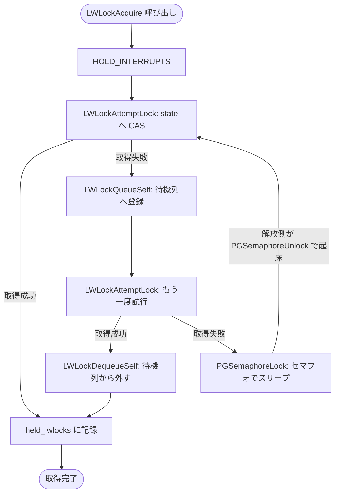

# 第35章 軽量ロック（LWLock）

> **本章で読むソース**
>
> - [`src/backend/storage/lmgr/lwlock.c`](https://github.com/postgres/postgres/blob/REL_18_4/src/backend/storage/lmgr/lwlock.c)
> - [`src/include/storage/lwlock.h`](https://github.com/postgres/postgres/blob/REL_18_4/src/include/storage/lwlock.h)

## この章の狙い

PostgreSQL は共有メモリ上のデータ構造を多数のバックエンドで共有する。
バッファプールのハッシュテーブル、WAL の挿入位置、ProcArray など、複数のプロセスが同時に触れる構造には、読み書きを直列化する仕組みが要る。
この役割を担うのが**軽量ロック（LWLock）**である。

LWLock は重量ロックとスピンロックの中間に位置する。
重量ロックはデッドロック検出や待機グラフを備えるが、その分だけ取得が重い。
スピンロックは数命令で取れるが、待つ側が CPU を回し続けるため、長い区間や競合の激しい区間には向かない。
LWLock はこの二つの間を埋める。
競合がなければアトミック命令一回で取得でき、競合したときはラッチ用のセマフォでスリープして CPU を明け渡す。

本章では取得経路 `LWLockAcquire` を起点に、状態語への CAS による取得試行、待機列への登録、起床までの流れを読む。
スピンロックそのものは「第36章 スピンロック」で、待機の土台となるラッチとセマフォは[第7章 ラッチとシグナル処理](../part01-process-memory/07-latches-and-signals.md)で扱う。

## 前提

LWLock は[第5章 共有メモリとプロセス間通信](../part01-process-memory/05-shared-memory-and-ipc.md)で説明した共有メモリ上に置かれ、`fork` した全バックエンドから同じアドレスで見える。
待機時のスリープと起床には、各プロセスが持つセマフォ（`PGPROC->sem`）を使う。
この章では共有モードと排他モードという二つの取得モードを扱う。
共有モードは複数の読み手が同時に保持でき、排他モードは単独の書き手だけが保持できる。

## ロックの状態を1語のアトミック変数に畳む

LWLock の本体は小さい。
構造体は tranche ID、状態語、待機列の3つだけを持つ。

[`src/include/storage/lwlock.h` L41-L50](https://github.com/postgres/postgres/blob/REL_18_4/src/include/storage/lwlock.h#L41-L50)

```c
typedef struct LWLock
{
	uint16		tranche;		/* tranche ID */
	pg_atomic_uint32 state;		/* state of exclusive/nonexclusive lockers */
	proclist_head waiters;		/* list of waiting PGPROCs */
#ifdef LOCK_DEBUG
	pg_atomic_uint32 nwaiters;	/* number of waiters */
	struct PGPROC *owner;		/* last exclusive owner of the lock */
#endif
} LWLock;
```

要は `state` という32ビットのアトミック変数1語に、ロックの状態がすべて畳み込まれている。
取得モードは列挙型 `LWLockMode` で表す。

[`src/include/storage/lwlock.h` L112-L119](https://github.com/postgres/postgres/blob/REL_18_4/src/include/storage/lwlock.h#L112-L119)

```c
typedef enum LWLockMode
{
	LW_EXCLUSIVE,
	LW_SHARED,
	LW_WAIT_UNTIL_FREE,			/* A special mode used in PGPROC->lwWaitMode,
								 * when waiting for lock to become free. Not
								 * to be used as LWLockAcquire argument */
} LWLockMode;
```

`LW_EXCLUSIVE` と `LW_SHARED` が `LWLockAcquire` に渡せるモードである。
3つ目の `LW_WAIT_UNTIL_FREE` は引数には使わず、ロックが空くまで待つだけの待機者を待機列で区別するために使う。

`state` の各ビットの意味は `lwlock.c` の冒頭で定義される。
上位3ビットがフラグ、下位側がロックの保持状況を表す。

[`src/backend/storage/lmgr/lwlock.c` L94-L106](https://github.com/postgres/postgres/blob/REL_18_4/src/backend/storage/lmgr/lwlock.c#L94-L106)

```c
#define LW_FLAG_HAS_WAITERS			((uint32) 1 << 31)
#define LW_FLAG_RELEASE_OK			((uint32) 1 << 30)
#define LW_FLAG_LOCKED				((uint32) 1 << 29)
#define LW_FLAG_BITS				3
#define LW_FLAG_MASK				(((1<<LW_FLAG_BITS)-1)<<(32-LW_FLAG_BITS))

/* assumes MAX_BACKENDS is a (power of 2) - 1, checked below */
#define LW_VAL_EXCLUSIVE			(MAX_BACKENDS + 1)
#define LW_VAL_SHARED				1

/* already (power of 2)-1, i.e. suitable for a mask */
#define LW_SHARED_MASK				MAX_BACKENDS
#define LW_LOCK_MASK				(MAX_BACKENDS | LW_VAL_EXCLUSIVE)
```

下位側は共有ロックの保持数を数える領域と、排他ロックを示すビットからなる。
共有モードで取るたびに `state` へ `LW_VAL_SHARED`（＝1）を足すので、下位ビット群は現在の読み手の数になる。
排他モードで取ると `LW_VAL_EXCLUSIVE`（＝`MAX_BACKENDS + 1`）を足す。
`LW_LOCK_MASK` でこの領域を取り出したとき、値が0なら誰も保持していない、排他ビットが立っていれば書き手が1人いる、それ以外なら読み手が何人かいる、と1語を見るだけで判別できる。
上位の `LW_FLAG_HAS_WAITERS` は待機列に誰かいることを、`LW_FLAG_LOCKED` は待機列を操作するためのスピンロックを、`LW_FLAG_RELEASE_OK` は解放時に待機者を起こしてよいかを表す。

この設計の眼目は、ロックの保持状況をビットの加減算とマスクだけで判定できる形に畳んだことにある。
読み手の人数と書き手の有無を別々の変数で管理せず1語に押し込んだので、取得と解放をアトミックな加減算と比較交換だけで完結させられる。

## 取得の中核は1回の比較交換

取得を試みる中核が `LWLockAttemptLock` である。
この関数はブロックしない。
取れたら `false`、取れず待つ必要があれば `true` を返す。

[`src/backend/storage/lmgr/lwlock.c` L795-L856](https://github.com/postgres/postgres/blob/REL_18_4/src/backend/storage/lmgr/lwlock.c#L795-L856)

```c
static bool
LWLockAttemptLock(LWLock *lock, LWLockMode mode)
{
	uint32		old_state;

	Assert(mode == LW_EXCLUSIVE || mode == LW_SHARED);

	/*
	 * Read once outside the loop, later iterations will get the newer value
	 * via compare & exchange.
	 */
	old_state = pg_atomic_read_u32(&lock->state);

	/* loop until we've determined whether we could acquire the lock or not */
	while (true)
	{
		uint32		desired_state;
		bool		lock_free;

		desired_state = old_state;

		if (mode == LW_EXCLUSIVE)
		{
			lock_free = (old_state & LW_LOCK_MASK) == 0;
			if (lock_free)
				desired_state += LW_VAL_EXCLUSIVE;
		}
		else
		{
			lock_free = (old_state & LW_VAL_EXCLUSIVE) == 0;
			if (lock_free)
				desired_state += LW_VAL_SHARED;
		}

		/*
		 * Attempt to swap in the state we are expecting. If we didn't see
		 * lock to be free, that's just the old value. If we saw it as free,
		 * we'll attempt to mark it acquired. The reason that we always swap
		 * in the value is that this doubles as a memory barrier. We could try
		 * to be smarter and only swap in values if we saw the lock as free,
		 * but benchmark haven't shown it as beneficial so far.
		 *
		 * Retry if the value changed since we last looked at it.
		 */
		if (pg_atomic_compare_exchange_u32(&lock->state,
										   &old_state, desired_state))
		{
			if (lock_free)
			{
				/* Great! Got the lock. */
#ifdef LOCK_DEBUG
				if (mode == LW_EXCLUSIVE)
					lock->owner = MyProc;
#endif
				return false;
			}
			else
				return true;	/* somebody else has the lock */
		}
	}
	pg_unreachable();
}
```

判定はモードで分かれる。
排他モードでは `LW_LOCK_MASK` を見て、読み手も書き手もいない（値が0）ときだけ空いているとみなし、`LW_VAL_EXCLUSIVE` を足した状態を作る。
共有モードでは排他ビットだけを見る。
すでに読み手が何人いても構わないので、書き手がいなければ空いているとみなし、`LW_VAL_SHARED` を足す。

足し込んだ希望の状態は `pg_atomic_compare_exchange_u32` で書き込む。
比較交換は「現在値が `old_state` のままなら `desired_state` に置き換える」操作である。
誰かが先に `state` を書き換えていれば失敗し、最新値を `old_state` に受け取ってループの先頭からやり直す。
ここで注目したいのは、空いていなかったときも希望状態（＝変化なしの値）を書き戻している点である。
コメントが述べるとおり、比較交換をメモリバリアとして二重に使うためで、この置き換えで `state` の読みが確定する。

## LWLockAcquire の全体の流れ

`LWLockAcquire` は `LWLockAttemptLock` を軸に、取れなければ待機列へ並び、起こされたら再挑戦するループを回す。

[`src/backend/storage/lmgr/lwlock.c` L1179-L1341](https://github.com/postgres/postgres/blob/REL_18_4/src/backend/storage/lmgr/lwlock.c#L1179-L1341)

```c
bool
LWLockAcquire(LWLock *lock, LWLockMode mode)
{
	PGPROC	   *proc = MyProc;
	bool		result = true;
	int			extraWaits = 0;
// ... (中略) ...
	HOLD_INTERRUPTS();

	/*
	 * Loop here to try to acquire lock after each time we are signaled by
	 * LWLockRelease.
// ... (中略) ...
	 */
	for (;;)
	{
		bool		mustwait;

		/*
		 * Try to grab the lock the first time, we're not in the waitqueue
		 * yet/anymore.
		 */
		mustwait = LWLockAttemptLock(lock, mode);

		if (!mustwait)
		{
			LOG_LWDEBUG("LWLockAcquire", lock, "immediately acquired lock");
			break;				/* got the lock */
		}

		/*
		 * Ok, at this point we couldn't grab the lock on the first try. We
		 * cannot simply queue ourselves to the end of the list and wait to be
		 * woken up because by now the lock could long have been released.
		 * Instead add us to the queue and try to grab the lock again. If we
		 * succeed we need to revert the queuing and be happy, otherwise we
		 * recheck the lock. If we still couldn't grab it, we know that the
		 * other locker will see our queue entries when releasing since they
		 * existed before we checked for the lock.
		 */

		/* add to the queue */
		LWLockQueueSelf(lock, mode);

		/* we're now guaranteed to be woken up if necessary */
		mustwait = LWLockAttemptLock(lock, mode);

		/* ok, grabbed the lock the second time round, need to undo queueing */
		if (!mustwait)
		{
			LOG_LWDEBUG("LWLockAcquire", lock, "acquired, undoing queue");

			LWLockDequeueSelf(lock);
			break;
		}

		/*
		 * Wait until awakened.
		 *
		 * It is possible that we get awakened for a reason other than being
		 * signaled by LWLockRelease.  If so, loop back and wait again.  Once
		 * we've gotten the LWLock, re-increment the sema by the number of
		 * additional signals received.
		 */
		LOG_LWDEBUG("LWLockAcquire", lock, "waiting");
// ... (中略) ...
		LWLockReportWaitStart(lock);
		if (TRACE_POSTGRESQL_LWLOCK_WAIT_START_ENABLED())
			TRACE_POSTGRESQL_LWLOCK_WAIT_START(T_NAME(lock), mode);

		for (;;)
		{
			PGSemaphoreLock(proc->sem);
			if (proc->lwWaiting == LW_WS_NOT_WAITING)
				break;
			extraWaits++;
		}

		/* Retrying, allow LWLockRelease to release waiters again. */
		pg_atomic_fetch_or_u32(&lock->state, LW_FLAG_RELEASE_OK);
// ... (中略) ...
		if (TRACE_POSTGRESQL_LWLOCK_WAIT_DONE_ENABLED())
			TRACE_POSTGRESQL_LWLOCK_WAIT_DONE(T_NAME(lock), mode);
		LWLockReportWaitEnd();

		LOG_LWDEBUG("LWLockAcquire", lock, "awakened");

		/* Now loop back and try to acquire lock again. */
		result = false;
	}

	if (TRACE_POSTGRESQL_LWLOCK_ACQUIRE_ENABLED())
		TRACE_POSTGRESQL_LWLOCK_ACQUIRE(T_NAME(lock), mode);

	/* Add lock to list of locks held by this backend */
	held_lwlocks[num_held_lwlocks].lock = lock;
	held_lwlocks[num_held_lwlocks++].mode = mode;

	/*
	 * Fix the process wait semaphore's count for any absorbed wakeups.
	 */
	while (extraWaits-- > 0)
		PGSemaphoreUnlock(proc->sem);

	return result;
}
```

入口でまず `HOLD_INTERRUPTS` を呼び、ロック保持中はキャンセルや終了の割り込みを止める。
共有メモリの操作中に割り込みでこの区間を抜けてしまうと、ロックを握ったまま離脱しかねないからである。

本体は無限の `for` ループで、1周ごとに次の手順を踏む。
まず `LWLockAttemptLock` で取得を試みる。
取れれば `mustwait` が `false` になり、その場でループを抜ける。
これが競合のない通常経路で、比較交換が1回成功するだけで取得が終わる。

取れなかったときは、いきなりスリープには入らない。
`LWLockQueueSelf` で自分を待機列へ登録し、その直後にもう一度 `LWLockAttemptLock` を試す。
この二度目の試行が、取りこぼしを防ぐ要になっている。
最初の試行と待機列への登録の間にロックが解放されると、解放側はまだ待機列に自分がいないので起こしてくれない。
そこで「待機列に並んでから、もう一度確かめる」という順序にして、もし二度目で取れたら `LWLockDequeueSelf` で待機列から自分を外し、何事もなかったように抜ける。

二度目でも取れなければ、ようやくスリープに入る。
`LWLockReportWaitStart` で待機イベント（`pg_stat_activity` から見える待機状態）を記録し、内側の `for` ループで `PGSemaphoreLock(proc->sem)` を呼んでセマフォを待つ。
セマフォから戻っても、目当ての起床（`lwWaiting` が `LW_WS_NOT_WAITING`）でなければ余計な起床として `extraWaits` に数え、待ち直す。
起床したら外側のループの先頭へ戻り、また `LWLockAttemptLock` から試す。
解放側はロックを譲るのではなく「空いたから試してよい」と知らせるだけなので、起こされた側が自分で取り直す。

ループを抜けたら、保持中のロックを `held_lwlocks` 配列に記録する。
エラー時にまとめて解放するための台帳で、上限 `MAX_SIMUL_LWLOCKS`（200）まで積める。
最後に、待つ間に吸い込んだ余計な起床の数だけセマフォを `PGSemaphoreUnlock` で戻し、カウントの帳尻を合わせる。

### スピンとブロックの併用

このループには2種類の「待ち」が現れる。
一つは待機列を操作するための短いスピンである。
`LWLockQueueSelf` と `LWLockDequeueSelf` は待機列を触る前に `LWLockWaitListLock` を呼ぶ。

[`src/backend/storage/lmgr/lwlock.c` L866-L910](https://github.com/postgres/postgres/blob/REL_18_4/src/backend/storage/lmgr/lwlock.c#L866-L910)

```c
static void
LWLockWaitListLock(LWLock *lock)
{
	uint32		old_state;
#ifdef LWLOCK_STATS
	lwlock_stats *lwstats;
	uint32		delays = 0;

	lwstats = get_lwlock_stats_entry(lock);
#endif

	while (true)
	{
		/* always try once to acquire lock directly */
		old_state = pg_atomic_fetch_or_u32(&lock->state, LW_FLAG_LOCKED);
		if (!(old_state & LW_FLAG_LOCKED))
			break;				/* got lock */

		/* and then spin without atomic operations until lock is released */
		{
			SpinDelayStatus delayStatus;

			init_local_spin_delay(&delayStatus);

			while (old_state & LW_FLAG_LOCKED)
			{
				perform_spin_delay(&delayStatus);
				old_state = pg_atomic_read_u32(&lock->state);
			}
#ifdef LWLOCK_STATS
			delays += delayStatus.delays;
#endif
			finish_spin_delay(&delayStatus);
		}

		/*
		 * Retry. The lock might obviously already be re-acquired by the time
		 * we're attempting to get it again.
		 */
	}

#ifdef LWLOCK_STATS
	lwstats->spin_delay_count += delays;
#endif
}
```

これは `state` の `LW_FLAG_LOCKED` ビットを立てて待機列を排他する、その場限りのスピンロックである。
`perform_spin_delay` でごく短時間だけ CPU 上で粘り、ビットが落ちるのを待つ。
待機列の付け外しはどれも数命令で終わるので、スリープに入るより回した方が速いという読みである。
このスピンロックの実装そのものは第36章「スピンロック」で詳しく読む。

もう一つの「待ち」が、ロック本体を待つブロックである。
こちらは前掲の `PGSemaphoreLock(proc->sem)` で、自分のセマフォが上がるまでプロセスをスリープさせ、CPU を明け渡す。
ロックを握る区間は短くないこともあるため、ここで CPU を回し続けるのは無駄になる。
LWLock は、待機列という短時間の保護にはスピンを、ロック本体という長くなりうる待ちにはブロックを、と使い分けている。

## 待機列への登録 LWLockQueueSelf

待機列への登録は `LWLockQueueSelf` が担う。

[`src/backend/storage/lmgr/lwlock.c` L1047-L1081](https://github.com/postgres/postgres/blob/REL_18_4/src/backend/storage/lmgr/lwlock.c#L1047-L1081)

```c
static void
LWLockQueueSelf(LWLock *lock, LWLockMode mode)
{
	/*
	 * If we don't have a PGPROC structure, there's no way to wait. This
	 * should never occur, since MyProc should only be null during shared
	 * memory initialization.
	 */
	if (MyProc == NULL)
		elog(PANIC, "cannot wait without a PGPROC structure");

	if (MyProc->lwWaiting != LW_WS_NOT_WAITING)
		elog(PANIC, "queueing for lock while waiting on another one");

	LWLockWaitListLock(lock);

	/* setting the flag is protected by the spinlock */
	pg_atomic_fetch_or_u32(&lock->state, LW_FLAG_HAS_WAITERS);

	MyProc->lwWaiting = LW_WS_WAITING;
	MyProc->lwWaitMode = mode;

	/* LW_WAIT_UNTIL_FREE waiters are always at the front of the queue */
	if (mode == LW_WAIT_UNTIL_FREE)
		proclist_push_head(&lock->waiters, MyProcNumber, lwWaitLink);
	else
		proclist_push_tail(&lock->waiters, MyProcNumber, lwWaitLink);

	/* Can release the mutex now */
	LWLockWaitListUnlock(lock);

#ifdef LOCK_DEBUG
	pg_atomic_fetch_add_u32(&lock->nwaiters, 1);
#endif
}
```

待機列を `LWLockWaitListLock` で排他してから、`state` に `LW_FLAG_HAS_WAITERS` を立てる。
このフラグが立っていると、解放側は待機列を見にくる。
続いて自分の `PGPROC` に待機状態（`LW_WS_WAITING`）と待機モードを書き、待機列の末尾に自分を連結する。
通常の取得待ちは末尾に並ぶが、`LW_WAIT_UNTIL_FREE` の待機者だけは先頭に置く。

二度目の `LWLockAttemptLock` で取れた場合は `LWLockDequeueSelf` で待機列から外す。
このとき、外そうとした時点ですでに解放側に取り出されている場合がある。
`LWLockDequeueSelf` は待機列を排他したうえで自分がまだ並んでいるかを確かめ、すでに外されていれば、後から来る起床を `PGSemaphoreLock` で1回吸収してから帰る。
こうして「外したつもりが起床信号だけ残る」ずれを防ぐ。

## 解放と起床 LWLockRelease

解放は `LWLockRelease` から `LWLockReleaseInternal` へ進む。

[`src/backend/storage/lmgr/lwlock.c` L1835-L1877](https://github.com/postgres/postgres/blob/REL_18_4/src/backend/storage/lmgr/lwlock.c#L1835-L1877)

```c
static void
LWLockReleaseInternal(LWLock *lock, LWLockMode mode)
{
	uint32		oldstate;
	bool		check_waiters;

	/*
	 * Release my hold on lock, after that it can immediately be acquired by
	 * others, even if we still have to wakeup other waiters.
	 */
	if (mode == LW_EXCLUSIVE)
		oldstate = pg_atomic_sub_fetch_u32(&lock->state, LW_VAL_EXCLUSIVE);
	else
		oldstate = pg_atomic_sub_fetch_u32(&lock->state, LW_VAL_SHARED);

	/* nobody else can have that kind of lock */
	Assert(!(oldstate & LW_VAL_EXCLUSIVE));

	if (TRACE_POSTGRESQL_LWLOCK_RELEASE_ENABLED())
		TRACE_POSTGRESQL_LWLOCK_RELEASE(T_NAME(lock));

	/*
	 * We're still waiting for backends to get scheduled, don't wake them up
	 * again.
	 */
	if ((oldstate & (LW_FLAG_HAS_WAITERS | LW_FLAG_RELEASE_OK)) ==
		(LW_FLAG_HAS_WAITERS | LW_FLAG_RELEASE_OK) &&
		(oldstate & LW_LOCK_MASK) == 0)
		check_waiters = true;
	else
		check_waiters = false;

	/*
	 * As waking up waiters requires the spinlock to be acquired, only do so
	 * if necessary.
	 */
	if (check_waiters)
	{
		/* XXX: remove before commit? */
		LOG_LWDEBUG("LWLockRelease", lock, "releasing waiters");
		LWLockWakeup(lock);
	}
}
```

解放はモードに応じて `state` から `LW_VAL_EXCLUSIVE` か `LW_VAL_SHARED` を引く、ただの減算である。
減算後の値で起床の要否を判断する。
待機者がいて（`LW_FLAG_HAS_WAITERS`）、起床が許され（`LW_FLAG_RELEASE_OK`）、しかもロックが完全に空いた（`LW_LOCK_MASK` が0）ときに限り、`LWLockWakeup` で待機者を起こす。

この条件分岐が効いている。
共有ロックを複数の読み手が保持しているとき、そのうちの1人が手を離しても下位ビット群はまだ0でないので、`check_waiters` は `false` になり待機列に触れない。
起床が要るのは最後の保持者が抜けてロックが空いたときだけで、無駄なときは待機列を排他するスピンロックすら取らない。

起床本体の `LWLockWakeup` は、待機列を `LWLockWaitListLock` で排他しつつ、起こすべき待機者を別リストへ取り出す。

[`src/backend/storage/lmgr/lwlock.c` L946-L986](https://github.com/postgres/postgres/blob/REL_18_4/src/backend/storage/lmgr/lwlock.c#L946-L986)

```c
	proclist_foreach_modify(iter, &lock->waiters, lwWaitLink)
	{
		PGPROC	   *waiter = GetPGProcByNumber(iter.cur);

		if (wokeup_somebody && waiter->lwWaitMode == LW_EXCLUSIVE)
			continue;

		proclist_delete(&lock->waiters, iter.cur, lwWaitLink);
		proclist_push_tail(&wakeup, iter.cur, lwWaitLink);

		if (waiter->lwWaitMode != LW_WAIT_UNTIL_FREE)
		{
			/*
			 * Prevent additional wakeups until retryer gets to run. Backends
			 * that are just waiting for the lock to become free don't retry
			 * automatically.
			 */
			new_release_ok = false;

			/*
			 * Don't wakeup (further) exclusive locks.
			 */
			wokeup_somebody = true;
		}

		/*
		 * Signal that the process isn't on the wait list anymore. This allows
		 * LWLockDequeueSelf() to remove itself of the waitlist with a
		 * proclist_delete(), rather than having to check if it has been
		 * removed from the list.
		 */
		Assert(waiter->lwWaiting == LW_WS_WAITING);
		waiter->lwWaiting = LW_WS_PENDING_WAKEUP;

		/*
		 * Once we've woken up an exclusive lock, there's no point in waking
		 * up anybody else.
		 */
		if (waiter->lwWaitMode == LW_EXCLUSIVE)
			break;
	}
```

起こす相手の選び方には、読み手と書き手の性質が反映されている。
待機列を先頭からたどり、排他待ちを1人起こしたらそこで打ち切る。
排他は単独でしか保持できないので、その先を起こしても取れず、無駄足になるからである。
共有待ちは連続して何人でも起こせる。
取り出した相手は `lwWaiting` を `LW_WS_PENDING_WAKEUP` に変え、待機列から実際に外す。
このあと別ループでセマフォを `PGSemaphoreUnlock` し、待機列の排他を解いてからまとめて起こす。
起こされた側は前述のとおりループの先頭に戻り、自分で `LWLockAttemptLock` をやり直す。

## 図 LWLockAcquire の取得試行と待機と起床

`LWLockAcquire` の取得試行、待機列への登録、スリープ、起床後の再挑戦の流れを図示する。



通常の競合なしの経路は「呼び出し」から `LWLockAttemptLock` の成功を経て「取得完了」へ直進する。
競合したときだけ待機列への登録とスリープへ枝分かれし、起床後はまた取得試行へ戻る。

## 高速化の工夫 競合のない取得を比較交換1回で終える

LWLock の最大の工夫は、競合のない取得経路を極限まで短くしたことにある。
`LWLockAcquire` に入った最初の `LWLockAttemptLock` で、`pg_atomic_compare_exchange_u32` が1回成功すれば取得は終わる。
このとき待機列の操作も `LWLockWaitListLock` のスピンも `PGSemaphoreLock` のシステムコールも一切通らない。
ロックの保持状況を `state` という1語に畳み込み、共有ロックの加算と排他ビットの判定をまとめてこの1語の比較交換で済ませられる構造が、これを可能にしている。

この設計が効くのは、LWLock が守る区間がたいてい短く、ほとんどの取得が競合せずに終わるからである。
バッファのハッシュテーブル参照のように高頻度で取り外しされるロックでも、競合がなければ追加のメモリ書き込みもシステムコールもなく、CPU 1コア上の数命令で取得と解放が回る。
競合という例外時にだけ、待機列とセマフォという重い仕掛けが起動する。

解放側にも同じ思想が貫かれている。
共有ロックを複数で保持しているうちは、1人抜けても `LW_LOCK_MASK` が0にならないので待機列を見にいかない。
起床のための待機列スピンを、本当にロックが空いた瞬間にだけ払う形にして、読み手が多い場面での解放を軽く保っている。

## まとめ

LWLock は重量ロックとスピンロックの中間で、共有メモリ上のデータ構造を守る。
ロックの状態は `state` という1語のアトミック変数に畳み込まれ、共有ロックの数と排他の有無をビットの加減算とマスクで判定する。
取得の中核 `LWLockAttemptLock` は比較交換1回で空きを見て取得を試み、競合がなければそれだけで終わる。
取れなかったときは `LWLockQueueSelf` で待機列に並び、もう一度試してから `PGSemaphoreLock` でスリープし、解放側の `LWLockWakeup` に起こされて再挑戦する。
待機列の保護には短いスピンを、ロック本体の待ちにはセマフォのブロックを使い分け、解放側はロックが本当に空いたときだけ待機者を起こす。
競合のない経路を比較交換1回に切り詰めた設計が、高頻度に取り外しされる共有構造のアクセスを支えている。

## 関連する章

- [第5章 共有メモリとプロセス間通信](../part01-process-memory/05-shared-memory-and-ipc.md)：LWLock が置かれる共有メモリと、待機に使うセマフォの土台を扱う。
- [第7章 ラッチとシグナル処理](../part01-process-memory/07-latches-and-signals.md)：待機と起床の下回りであるラッチとセマフォの仕組みを扱う。
- 第34章 ロックマネージャ：デッドロック検出を備えた重量ロックを扱い、LWLock との役割の違いを対比できる。
- 第36章 スピンロック：`LWLockWaitListLock` が使う、最下層の短時間ロックの実装を扱う。
