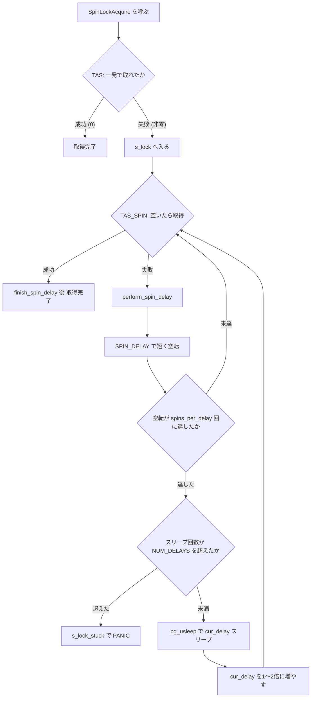

# 第36章 スピンロック

> **本章で読むソース**
>
> - [`src/include/storage/spin.h`](https://github.com/postgres/postgres/blob/REL_18_4/src/include/storage/spin.h)
> - [`src/include/storage/s_lock.h`](https://github.com/postgres/postgres/blob/REL_18_4/src/include/storage/s_lock.h)
> - [`src/backend/storage/lmgr/s_lock.c`](https://github.com/postgres/postgres/blob/REL_18_4/src/backend/storage/lmgr/s_lock.c)

## この章の狙い

PostgreSQL のロックには階層がある。
重量ロック（第34章）はデッドロック検出やエラー時の自動解放を備えた重い道具で、軽量ロック（LWLock、第35章）はそれより軽い相互排他の仕組みである。
本章が読む**スピンロック**は、その最下層に位置する最も原始的なロックである。
デッドロック検出も、エラー時の自動解放も、待機キューも持たない。
ロックが空くまでビジーループで回り続けるだけの仕組みである。

この素朴さは弱点ではなく、設計上の割り切りである。
スピンロックは、ごく短い臨界区間を最小のコストで守ることだけに用途を絞る。
本章では、その用途を支える設計契約、ハードウェアのアトミック命令を起点とする取得、競合時の待機とバックオフ、そしてこの機構が依存する暗黙の前提を読む。
末尾では、この前提が崩れたときに何が起きるかを論じた[付録A](../appendix/A01-preempt-none-and-spinlocks.md)へ橋渡しする。

## 前提

第34章で重量ロック、第35章で軽量ロック（LWLock）を扱った。
本章はそのさらに下、ハードウェアのアトミック命令に直接乗る層を読む。
読解には、テストアンドセットのようなアトミック命令、CPU のメモリ順序（弱い順序付けのアーキテクチャでは命令の並べ替えが起こること）、コンパイラによる命令並べ替えとそれを防ぐコンパイラバリアの考え方を前提とする。

## 数命令しか保持しないという契約

スピンロックの API は `spin.h` が定義する。
ロックの型 `slock_t` と、初期化、取得、解放、空き判定の四つのマクロだけからなる。

[`src/include/storage/spin.h` L57-L63](https://github.com/postgres/postgres/blob/REL_18_4/src/include/storage/spin.h#L57-L63)

```c
#define SpinLockInit(lock)	S_INIT_LOCK(lock)

#define SpinLockAcquire(lock) S_LOCK(lock)

#define SpinLockRelease(lock) S_UNLOCK(lock)

#define SpinLockFree(lock)	S_LOCK_FREE(lock)
```

この API は、利用側に一つの規約を課す。
ロックを数命令を超えて保持してはならない、という契約である。
規約はヘッダのコメントに明文化されている。

[`src/include/storage/spin.h` L33-L36](https://github.com/postgres/postgres/blob/REL_18_4/src/include/storage/spin.h#L33-L36)

```c
 *	Keep in mind the coding rule that spinlocks must not be held for more
 *	than a few instructions.  In particular, we assume it is not possible
 *	for a CHECK_FOR_INTERRUPTS() to occur while holding a spinlock, and so
 *	it is not necessary to do HOLD/RESUME_INTERRUPTS() in these macros.
```

この契約には実利がある。
保持区間がつねに数命令で終わると仮定できるからこそ、スピンロックのマクロは割り込み保留（`HOLD/RESUME_INTERRUPTS`）を省ける。
保持中に `CHECK_FOR_INTERRUPTS` が走らないと仮定してよいため、割り込みの一時抑止という付加処理を取得と解放の経路から外せる。
最下層のロックを徹底的に軽くするための割り切りである。

メモリ順序についても、利用側の負担を減らす設計が選ばれている。
取得と解放のマクロはコンパイラバリアを含み、臨界区間の内外でロード／ストアが並べ替えられないことを保証する。
このため利用側は、ロックで守るデータに `volatile` 修飾を付ける必要がない。
PostgreSQL 9.5 より前は、この保証が利用側の責任だった。

[`src/include/storage/spin.h` L28-L31](https://github.com/postgres/postgres/blob/REL_18_4/src/include/storage/spin.h#L28-L31)

```c
 *	Load and store operations in calling code are guaranteed not to be
 *	reordered with respect to these operations, because they include a
 *	compiler barrier.  (Before PostgreSQL 9.5, callers needed to use a
 *	volatile qualifier to access data protected by spinlocks.)
```

## ハードウェアのテストアンドセット

`spin.h` のマクロは、それ自体には機能を持たず、`s_lock.h` が供給するハードウェア依存マクロへ展開される。
取得の中核を担うのが `TAS` と `TAS_SPIN` である。

[`src/include/storage/s_lock.h` L38-L48](https://github.com/postgres/postgres/blob/REL_18_4/src/include/storage/s_lock.h#L38-L48)

```c
 *	int TAS(slock_t *lock)
 *		Atomic test-and-set instruction.  Attempt to acquire the lock,
 *		but do *not* wait.	Returns 0 if successful, nonzero if unable
 *		to acquire the lock.
 *
 *	int TAS_SPIN(slock_t *lock)
 *		Like TAS(), but this version is used when waiting for a lock
 *		previously found to be contended.  By default, this is the
 *		same as TAS(), but on some architectures it's better to poll a
 *		contended lock using an unlocked instruction and retry the
 *		atomic test-and-set only when it appears free.
```

`TAS` はアトミックなテストアンドセット命令で、待たずに一度だけ取得を試みる。
成功すれば 0 を、取れなければ非零を返す。
`TAS_SPIN` は、競合が判明したロックを待つときに使う版である。
既定では `TAS` と同じだが、アーキテクチャによっては実装を変える余地が残されている。

その違いが x86_64 の定義に表れている。

[`src/include/storage/s_lock.h` L196-L226](https://github.com/postgres/postgres/blob/REL_18_4/src/include/storage/s_lock.h#L196-L226)

```c
#ifdef __x86_64__		/* AMD Opteron, Intel EM64T */
#define HAS_TEST_AND_SET

typedef unsigned char slock_t;

#define TAS(lock) tas(lock)

/*
 * On Intel EM64T, it's a win to use a non-locking test before the xchg proper,
 * but only when spinning.
 *
 * See also Implementing Scalable Atomic Locks for Multi-Core Intel(tm) EM64T
 * and IA32, by Michael Chynoweth and Mary R. Lee. As of this writing, it is
 * available at:
 * http://software.intel.com/en-us/articles/implementing-scalable-atomic-locks-for-multi-core-intel-em64t-and-ia32-architectures
 */
#define TAS_SPIN(lock)    (*(lock) ? 1 : TAS(lock))

static __inline__ int
tas(volatile slock_t *lock)
{
	slock_t		_res = 1;

	__asm__ __volatile__(
		"	lock			\n"
		"	xchgb	%0,%1	\n"
:		"+q"(_res), "+m"(*lock)
:		/* no inputs */
:		"memory", "cc");
	return (int) _res;
}
```

`TAS` の実体は、`lock` プレフィックス付きの `xchgb` 一命令である。
ロック変数とレジスタの値をアトミックに交換し、交換前のロック値を取得可否として返す。
`lock` プレフィックスはこの交換をアトミックにし、対象のキャッシュラインの所有権を交換が終わるまで手放さず、メモリ順序も保証する。

ここで `TAS_SPIN` は `(*(lock) ? 1 : TAS(lock))` と定義されている点が要点である。
まずロック変数を**ふつうのロードで読み**、ロックされていれば（非零なら）アトミック命令を出さずに 1 を返す。
空いて見えるときだけ `TAS` を実行する。
`lock`付きの `xchgb` はバスを占有するため、競合中に何度も発行するとコア間で書き込みが衝突し、キャッシュラインの所有権が往復して遅くなる。
読み取りだけで空き具合を監視し、空いた瞬間だけアトミック命令を撃つことで、この衝突を避ける。
これがマルチコアでスケールさせるための機構レベルの工夫である。

## 競合時の待機 `s_lock`

最初の取得は、利用側に展開される `S_LOCK` マクロが担う。
既定の定義は次のとおりである。

[`src/include/storage/s_lock.h` L663-L666](https://github.com/postgres/postgres/blob/REL_18_4/src/include/storage/s_lock.h#L663-L666)

```c
#if !defined(S_LOCK)
#define S_LOCK(lock) \
	(TAS(lock) ? s_lock((lock), __FILE__, __LINE__, __func__) : 0)
#endif	 /* S_LOCK */
```

`TAS` が一発で成功すれば、それで取得は完了する。
競合がない通常の経路では関数呼び出しすら発生しない。
失敗したときだけ、待機の本体である `s_lock` へ降りる。
高頻度で通る成功経路を最小命令数に保ち、待機の重い処理は競合時にだけ呼び出す構成である。

`s_lock` はプラットフォーム非依存の待機ループである。

[`src/backend/storage/lmgr/s_lock.c` L97-L112](https://github.com/postgres/postgres/blob/REL_18_4/src/backend/storage/lmgr/s_lock.c#L97-L112)

```c
int
s_lock(volatile slock_t *lock, const char *file, int line, const char *func)
{
	SpinDelayStatus delayStatus;

	init_spin_delay(&delayStatus, file, line, func);

	while (TAS_SPIN(lock))
	{
		perform_spin_delay(&delayStatus);
	}

	finish_spin_delay(&delayStatus);

	return delayStatus.delays;
}
```

`TAS_SPIN` が成功するまでループし、失敗のたびに `perform_spin_delay` を呼ぶ。
ループが終われば取得成功なので、`finish_spin_delay` で後始末をして抜ける。
待機の状態は `SpinDelayStatus` に集約されている。

[`src/include/storage/s_lock.h` L729-L737](https://github.com/postgres/postgres/blob/REL_18_4/src/include/storage/s_lock.h#L729-L737)

```c
typedef struct
{
	int			spins;
	int			delays;
	int			cur_delay;
	const char *file;
	int			line;
	const char *func;
} SpinDelayStatus;
```

`spins` は今回のスリープまでに空転した回数、`delays` はこれまでにスリープした総回数、`cur_delay` は次にスリープする時間（マイクロ秒）である。
`file` と `line` と `func` は、行き詰まったときに発生元を報告するために取得地点を覚えておく。

## 空転、スリープ、行き詰まりの三段階

待機の核心は `perform_spin_delay` にある。

[`src/backend/storage/lmgr/s_lock.c` L125-L166](https://github.com/postgres/postgres/blob/REL_18_4/src/backend/storage/lmgr/s_lock.c#L125-L166)

```c
void
perform_spin_delay(SpinDelayStatus *status)
{
	/* CPU-specific delay each time through the loop */
	SPIN_DELAY();

	/* Block the process every spins_per_delay tries */
	if (++(status->spins) >= spins_per_delay)
	{
		if (++(status->delays) > NUM_DELAYS)
			s_lock_stuck(status->file, status->line, status->func);

		if (status->cur_delay == 0) /* first time to delay? */
			status->cur_delay = MIN_DELAY_USEC;

		/*
		 * Once we start sleeping, the overhead of reporting a wait event is
		 * justified. Actively spinning easily stands out in profilers, but
		 * sleeping with an exponential backoff is harder to spot...
		 *
		 * We might want to report something more granular at some point, but
		 * this is better than nothing.
		 */
		pgstat_report_wait_start(WAIT_EVENT_SPIN_DELAY);
		pg_usleep(status->cur_delay);
		pgstat_report_wait_end();

#if defined(S_LOCK_TEST)
		fprintf(stdout, "*");
		fflush(stdout);
#endif

		/* increase delay by a random fraction between 1X and 2X */
		status->cur_delay += (int) (status->cur_delay *
									pg_prng_double(&pg_global_prng_state) + 0.5);
		/* wrap back to minimum delay when max is exceeded */
		if (status->cur_delay > MAX_DELAY_USEC)
			status->cur_delay = MIN_DELAY_USEC;

		status->spins = 0;
	}
}
```

この関数は呼ばれるたびに三段階のいずれかを進める。

第一段階は空転である。
まず `SPIN_DELAY()` で CPU 固有のごく短い待機を入れる。
x86 ではこれが `PAUSE` 命令に展開され、スピンウェイトループであることを CPU へ伝えてパイプラインの無駄なフラッシュを抑える。
そのうえで `spins` を増やし、`spins_per_delay` 回に達するまでは空転を続ける。
ロックが一瞬で空くなら、この段階のうちに取り直せて、カーネルへ降りるコストを払わずに済む。

第二段階はスリープである。
空転回数が `spins_per_delay` に達すると、`delays` を一つ増やし、`pg_usleep` で `cur_delay` マイクロ秒だけ実際にスリープする。
スリープ中はプロセスが CPU を手放すため、待機イベント `WAIT_EVENT_SPIN_DELAY` を立てて観測できるようにする。
能動的な空転はプロファイラに容易に現れるが、スリープを挟むバックオフは見つけにくい、というコメントの判断による計測上の配慮である。
スリープから戻ると `cur_delay` を 1 倍から 2 倍のあいだの乱数で増やし、上限を超えたら最小値へ戻して、`spins` をゼロに戻す。
遅延を指数的に伸ばすのは、激しい競合下で待機者が早く CPU を譲り、保持者が走ってロックを解放できるようにするためである。

第三段階は行き詰まりである。
スリープ回数 `delays` が `NUM_DELAYS` を超えると、`s_lock_stuck` を呼ぶ。
段階を分ける定数は `s_lock.c` の冒頭にまとまっている。

[`src/backend/storage/lmgr/s_lock.c` L57-L61](https://github.com/postgres/postgres/blob/REL_18_4/src/backend/storage/lmgr/s_lock.c#L57-L61)

```c
#define MIN_SPINS_PER_DELAY 10
#define MAX_SPINS_PER_DELAY 1000
#define NUM_DELAYS			1000
#define MIN_DELAY_USEC		1000L
#define MAX_DELAY_USEC		1000000L
```

スリープは最小 1 ミリ秒から最大 1 秒のあいだで増減し、これを `NUM_DELAYS`（1000 回）繰り返してなお取れなければ行き詰まりと判断する。
この設定では、行き詰まりの宣言までおよそ数分かかる。
時間の総量ではなく試行回数を固定するのは、意図しない失敗の確率を一定に保つためだと、ファイル冒頭のコメントが述べている。

`s_lock_stuck` は、その地点を致命的エラーとして扱う。

[`src/backend/storage/lmgr/s_lock.c` L78-L92](https://github.com/postgres/postgres/blob/REL_18_4/src/backend/storage/lmgr/s_lock.c#L78-L92)

```c
static void
s_lock_stuck(const char *file, int line, const char *func)
{
	if (!func)
		func = "(unknown)";
#if defined(S_LOCK_TEST)
	fprintf(stderr,
			"\nStuck spinlock detected at %s, %s:%d.\n",
			func, file, line);
	exit(1);
#else
	elog(PANIC, "stuck spinlock detected at %s, %s:%d",
		 func, file, line);
#endif
}
```

数分待っても取れないスピンロックは、想定保持時間（数命令）に比べれば永遠に等しい。
これは通常運転ではありえず、保持者がロックを抱えたまま死んだか、内部状態が壊れたことを意味する。
したがって `s_lock_stuck` は黙ってあきらめず、`PANIC` でサーバ全体を落とす。
デッドロック検出を持たない最下層のロックにおいて、この行き詰まり検出が唯一の安全網である。

待機全体の流れを図に示す。



## 自己調整する `spins_per_delay`

空転からスリープへ切り替える閾値 `spins_per_delay` は、固定値ではなく実行時に自己調整される。
取得に成功した直後の `finish_spin_delay` が、この値を更新する。

[`src/backend/storage/lmgr/s_lock.c` L185-L199](https://github.com/postgres/postgres/blob/REL_18_4/src/backend/storage/lmgr/s_lock.c#L185-L199)

```c
void
finish_spin_delay(SpinDelayStatus *status)
{
	if (status->cur_delay == 0)
	{
		/* we never had to delay */
		if (spins_per_delay < MAX_SPINS_PER_DELAY)
			spins_per_delay = Min(spins_per_delay + 100, MAX_SPINS_PER_DELAY);
	}
	else
	{
		if (spins_per_delay > MIN_SPINS_PER_DELAY)
			spins_per_delay = Max(spins_per_delay - 1, MIN_SPINS_PER_DELAY);
	}
}
```

調整は非対称である。
一度もスリープせずに取れたら（`cur_delay == 0`）、空転で勝てたことの証拠とみなし、`spins_per_delay` を 100 ずつ一気に増やす。
スリープを要したなら、空転が無駄だった兆候とみなし、1 ずつゆっくり減らす。
この非対称性には根拠がある。
ユニプロセッサでは、保持者が走っていない以上いくら空転しても無駄なので、閾値は最小値（10）へ収束し、待機者は早くスリープして CPU を保持者へ譲る。
マルチプロセッサでは、保持者が別コアで走り続けてすぐ解放するので、空転で取れることが多く、閾値は最大値（1000）へ収束して、カーネルへ降りるコストを避ける。
プロセッサ構成という静的な情報を、実測の成否から動的に推定して空転量を最適化する機構である。

この推定値は、さらにプロセス間で共有される。
`spins_per_delay` はプロセスローカルな変数だが、この関数が呼ばれること自体まれなので、一つのバックエンドの寿命だけでは良い値へ収束しきれない。
そこでバックエンド終了時に、観測を共有メモリ上の推定値へ畳み込む。

[`src/backend/storage/lmgr/s_lock.c` L217-L231](https://github.com/postgres/postgres/blob/REL_18_4/src/backend/storage/lmgr/s_lock.c#L217-L231)

```c
int
update_spins_per_delay(int shared_spins_per_delay)
{
	/*
	 * We use an exponential moving average with a relatively slow adaption
	 * rate, so that noise in any one backend's result won't affect the shared
	 * value too much.  As long as both inputs are within the allowed range,
	 * the result must be too, so we need not worry about clamping the result.
	 *
	 * We deliberately truncate rather than rounding; this is so that single
	 * adjustments inside a backend can affect the shared estimate (see the
	 * asymmetric adjustment rules above).
	 */
	return (shared_spins_per_delay * 15 + spins_per_delay) / 16;
}
```

共有値と自分の観測を 15 対 1 で混ぜる指数移動平均である。
適応を遅くすることで、特定のバックエンドのノイズが共有値を振り回さないようにしている。
新たに起動したバックエンドは `set_spins_per_delay` でこの共有値を受け取って空転を始めるため、プロセスをまたいで学習が積み上がる。

## まとめ

スピンロックは、PostgreSQL のロック階層の最下層を担う最も原始的な相互排他である。
デッドロック検出も自動解放も待機キューも持たず、ハードウェアのアトミックなテストアンドセットでロックを取り、取れなければビジーループで回る。
その単純さは、ごく短い臨界区間を最小コストで守るという用途に用途を絞った割り切りであり、`spin.h` の「数命令しか保持しない」という規約がこれを支えている。

競合時の待機は、空転、指数バックオフのスリープ、`NUM_DELAYS` 超過での `PANIC` という三段階を踏む。
最初の空転は「ロックは一瞬で空く」という賭けにコストを先送りする工夫であり、`TAS_SPIN` の非ロック読み取りと `spins_per_delay` の自己調整は、マルチコアでこの賭けを成立させるための機構である。
これらの上に、第35章の LWLock をはじめとする上位のロックや、共有メモリ上の制御構造体の保護が築かれている。

最後に、この章の議論が立っている前提を確認しておく。
スピンロックの効率は、保持者が臨界区間を数命令で走り抜けてすぐ手放すこと、つまりスケジューラが保持者を走らせ続けることに暗黙に頼っている。
保持者が臨界区間の途中でプリエンプトされると、待機者は空転して CPU を焼き、連鎖的な競合が起こる。
この前提が崩れたときに何が起きるかは、[付録A　Linux カーネルの `PREEMPT_NONE` 廃止とスピンロックの性能問題](../appendix/A01-preempt-none-and-spinlocks.md)で扱う。

## 関連する章

- [第34章　ロックマネージャ](34-lock-manager.md)
- [第35章　軽量ロック（LWLock）](35-lightweight-locks.md)
- [付録A　Linux カーネルの `PREEMPT_NONE` 廃止とスピンロックの性能問題](../appendix/A01-preempt-none-and-spinlocks.md)
