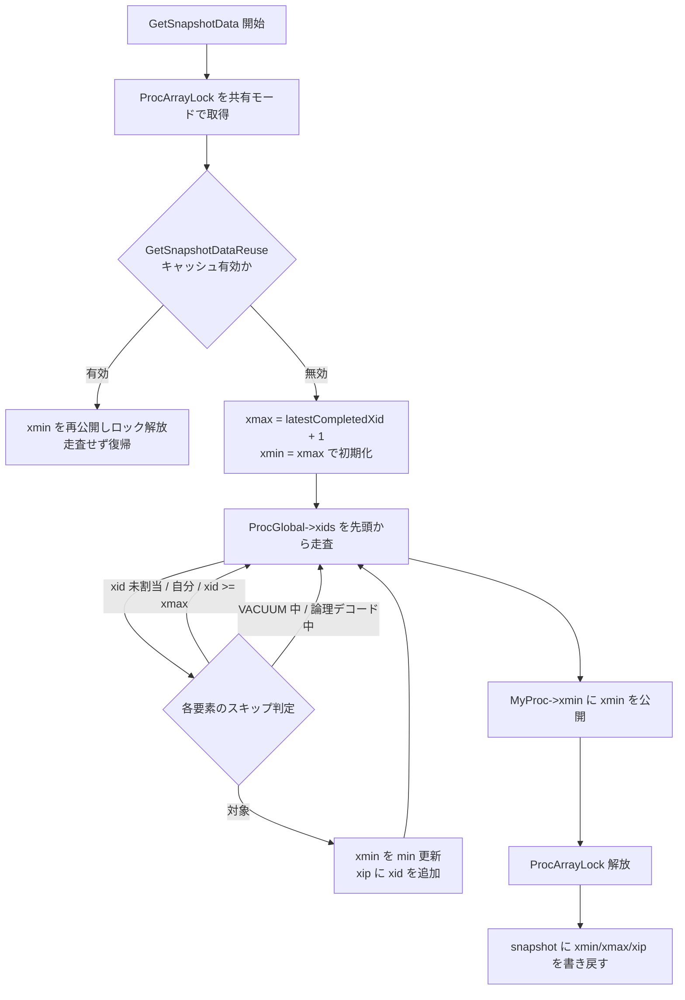

# 第37章 スナップショットと ProcArray

> **本章で読むソース**
>
> - [`src/backend/storage/ipc/procarray.c`](https://github.com/postgres/postgres/blob/REL_18_4/src/backend/storage/ipc/procarray.c)
> - [`src/include/storage/proc.h`](https://github.com/postgres/postgres/blob/REL_18_4/src/include/storage/proc.h)
> - [`src/include/storage/procarray.h`](https://github.com/postgres/postgres/blob/REL_18_4/src/include/storage/procarray.h)

## この章の狙い

第27章で、各トランザクションはスナップショット（`xmin`、`xmax`、`xip` の3つ組）を持ち、タプルの `t_xmin`/`t_xmax` と突き合わせて可視性を判定すると読んだ。
そのスナップショットは、どこかに集約された「いま誰が何を実行中か」という情報から作られる。
その集約場所が、本章で読む共有メモリ上の **ProcArray** である。

第27章が可視性判定を消費側から読んだのに対し、本章は供給側を読む。
全バックエンドが自分の実行中 XID を公開する共有状態をどう並べ、そこから `GetSnapshotData` がどうスナップショットの境界（`xmin`/`xmax`）と実行中 XID 集合（`xip`）を切り出すか。
さらに、その同じ共有状態から VACUUM が「どこまで掃除してよいか」の下限（**xmin horizon**）をどう導くか。
これらを `ProcArrayLock` の保護のもとで、走査コストを抑えながら行う仕組みに集中する。

## 前提

第27章でスナップショットの表現（`SnapshotData`）と可視性判定の規則を、第5章で共有メモリの確保とサブシステムへの切り出しを読んだ。
本章は、その共有メモリに置かれた `PGPROC` と `ProcArray` の構造から始め、第27章で概観した `GetSnapshotData` の走査本体を、スキップ条件と最適化まで含めて読む。
スナップショットの3つ組がどう可視性判定に効くかは第27章に譲り、本章は集合をどう作るかに絞る。

## 各バックエンドの公開窓口 `PGPROC`

各バックエンドは、自分の実行状態を共有メモリ上の `PGPROC` 構造体を通じて他のプロセスへ公開する。
スナップショット生成に効くのは、その先頭付近に並ぶ2つの XID である。

[`src/include/storage/proc.h` L187-L195](https://github.com/postgres/postgres/blob/REL_18_4/src/include/storage/proc.h#L187-L195)

```c
	TransactionId xid;			/* id of top-level transaction currently being
								 * executed by this proc, if running and XID
								 * is assigned; else InvalidTransactionId.
								 * mirrored in ProcGlobal->xids[pgxactoff] */

	TransactionId xmin;			/* minimal running XID as it was when we were
								 * starting our xact, excluding LAZY VACUUM:
								 * vacuum must not remove tuples deleted by
								 * xid >= xmin ! */
```

`xid` は、このバックエンドがいま実行中のトップレベルトランザクションの XID である。
XID をまだ割り当てられていない読み取り専用トランザクションでは `InvalidTransactionId` のままになる。
`xmin` は、このバックエンドが取得したスナップショットの下限であり、コメントが述べるとおり「`xid >= xmin` のタプルを VACUUM が消してはならない」境界を意味する。
この `xmin` こそが、全バックエンド分を集めると VACUUM の掃除可能範囲を決める材料になる。

`PGPROC` には他にも `databaseId`、サブトランザクション XID のキャッシュ `subxids`、そして VACUUM 中などを示す `statusFlags` が並ぶ。
走査側はこれらを読んで、どの XID をスナップショットに含めるか、どのバックエンドを horizon 計算で特別扱いするかを決める。

## 全バックエンドを束ねる `ProcArray`

個々の `PGPROC` を1つの配列として束ねるのが `ProcArrayStruct` である。
ただし、ここに `PGPROC` の実体を並べるのではなく、`PGPROC` への添字（`pgprocnos`）を並べる。

[`src/backend/storage/ipc/procarray.c` L73-L100](https://github.com/postgres/postgres/blob/REL_18_4/src/backend/storage/ipc/procarray.c#L73-L100)

```c
	int			numProcs;		/* number of valid procs entries */
	int			maxProcs;		/* allocated size of procs array */

	/*
	 * Known assigned XIDs handling
	 */
	int			maxKnownAssignedXids;	/* allocated size of array */
	int			numKnownAssignedXids;	/* current # of valid entries */
	int			tailKnownAssignedXids;	/* index of oldest valid element */
	int			headKnownAssignedXids;	/* index of newest element, + 1 */

	/*
	 * Highest subxid that has been removed from KnownAssignedXids array to
	 * prevent overflow; or InvalidTransactionId if none.  We track this for
	 * similar reasons to tracking overflowing cached subxids in PGPROC
	 * entries.  Must hold exclusive ProcArrayLock to change this, and shared
	 * lock to read it.
	 */
	TransactionId lastOverflowedXid;

	/* oldest xmin of any replication slot */
	TransactionId replication_slot_xmin;
	/* oldest catalog xmin of any replication slot */
	TransactionId replication_slot_catalog_xmin;

	/* indexes into allProcs[], has PROCARRAY_MAXPROCS entries */
	int			pgprocnos[FLEXIBLE_ARRAY_MEMBER];
} ProcArrayStruct;
```

`numProcs` が現在有効な要素数、`pgprocnos` が `PGPROC` 配列への添字を末尾に可変長で持つ。
レプリケーションスロットが要求する最古の `xmin`（`replication_slot_xmin`）もここに集約され、後で horizon 計算に効く。

スナップショット生成で実際に走査される頻出データ（`xid` や `statusFlags`）は、`PGPROC` 本体とは別に、`PGPROC->pgxactoff` で添字付けされた密な配列にも複製されている。

[`src/include/storage/proc.h` L388-L401](https://github.com/postgres/postgres/blob/REL_18_4/src/include/storage/proc.h#L388-L401)

```c
	/* Array mirroring PGPROC.xid for each PGPROC currently in the procarray */
	TransactionId *xids;

	/*
	 * Array mirroring PGPROC.subxidStatus for each PGPROC currently in the
	 * procarray.
	 */
	XidCacheStatus *subxidStates;

	/*
	 * Array mirroring PGPROC.statusFlags for each PGPROC currently in the
	 * procarray.
	 */
	uint8	   *statusFlags;
```

走査で読む値だけを `ProcGlobal->xids` などの密な配列に固めておくことが、本章の最初の最適化である。
理由はソースのコメントが3点挙げている。

[`src/include/storage/proc.h` L352-L357](https://github.com/postgres/postgres/blob/REL_18_4/src/include/storage/proc.h#L352-L357)

```c
 * The denser separate arrays are beneficial for three main reasons: First, to
 * allow for as tight loops accessing the data as possible. Second, to prevent
 * updates of frequently changing data (e.g. xmin) from invalidating
 * cachelines also containing less frequently changing data (e.g. xid,
 * statusFlags). Third to condense frequently accessed data into as few
 * cachelines as possible.
```

`PGPROC` 本体は数百バイトある大きな構造体で、その中の `xid` だけを全バックエンド分なめると、要素ごとに別々のキャッシュラインを引くことになる。
走査対象の XID だけを連続した配列に集めておけば、1キャッシュラインに複数バックエンドの XID が載り、ループが密になる。
頻繁に書き換わる値を1か所に固めることで、その書き換えが無関係なフィールドのキャッシュラインを無効化することも避けられる。

## 配列をポインタ順に並べる `ProcArrayAdd`

バックエンドが起動すると `ProcArrayAdd` で配列へ登録される。
このとき配列は単に末尾へ追加するのではなく、`PGPROC` のポインタ値の順にソートして挿入される。

[`src/backend/storage/ipc/procarray.c` L491-L526](https://github.com/postgres/postgres/blob/REL_18_4/src/backend/storage/ipc/procarray.c#L491-L526)

```c
	/*
	 * Keep the procs array sorted by (PGPROC *) so that we can utilize
	 * locality of references much better. This is useful while traversing the
	 * ProcArray because there is an increased likelihood of finding the next
	 * PGPROC structure in the cache.
	 *
	 * Since the occurrence of adding/removing a proc is much lower than the
	 * access to the ProcArray itself, the overhead should be marginal
	 */
	for (index = 0; index < arrayP->numProcs; index++)
	{
		int			this_procno = arrayP->pgprocnos[index];

		Assert(this_procno >= 0 && this_procno < (arrayP->maxProcs + NUM_AUXILIARY_PROCS));
		Assert(allProcs[this_procno].pgxactoff == index);

		/* If we have found our right position in the array, break */
		if (this_procno > pgprocno)
			break;
	}

	movecount = arrayP->numProcs - index;
	memmove(&arrayP->pgprocnos[index + 1],
			&arrayP->pgprocnos[index],
			movecount * sizeof(*arrayP->pgprocnos));
	memmove(&ProcGlobal->xids[index + 1],
			&ProcGlobal->xids[index],
			movecount * sizeof(*ProcGlobal->xids));
	memmove(&ProcGlobal->subxidStates[index + 1],
			&ProcGlobal->subxidStates[index],
			movecount * sizeof(*ProcGlobal->subxidStates));
	memmove(&ProcGlobal->statusFlags[index + 1],
			&ProcGlobal->statusFlags[index],
			movecount * sizeof(*ProcGlobal->statusFlags));

	arrayP->pgprocnos[index] = GetNumberFromPGProc(proc);
```

挿入位置を探し、そこより後ろの要素を `memmove` でずらして空けてから埋める。
ソート順を保つために、密な配列（`xids`、`subxidStates`、`statusFlags`）も同じ位置でいっせいにずらす。
このコストは登録時にしか発生せず、コメントが述べるとおり、登録の頻度は走査の頻度に比べてはるかに低いので割に合う。
得られる見返りは走査時の参照局所性で、添字順に進むと次に触る `PGPROC` がキャッシュに載っている確率が上がる。

登録した位置は `proc->pgxactoff` に記録され、密な配列への添字として以後使われる。
バックエンドの終了時には `ProcArrayRemove` が逆の操作（後ろを前へ詰める `memmove`）でソート順を保つ。

## スナップショットの走査本体 `GetSnapshotData`

ここからが本章の中心である。
`GetSnapshotData` は `ProcArrayLock` を共有モードで取り、`ProcGlobal->xids` を先頭から走査して、実行中 XID を集めながら `xmin` を下げていく。

走査の各要素では、まず XID を一度だけ読み、含める必要のないものを早期に弾く。

[`src/backend/storage/ipc/procarray.c` L2273-L2310](https://github.com/postgres/postgres/blob/REL_18_4/src/backend/storage/ipc/procarray.c#L2273-L2310)

```c
		for (int pgxactoff = 0; pgxactoff < numProcs; pgxactoff++)
		{
			/* Fetch xid just once - see GetNewTransactionId */
			TransactionId xid = UINT32_ACCESS_ONCE(other_xids[pgxactoff]);
			uint8		statusFlags;

			Assert(allProcs[arrayP->pgprocnos[pgxactoff]].pgxactoff == pgxactoff);

			/*
			 * If the transaction has no XID assigned, we can skip it; it
			 * won't have sub-XIDs either.
			 */
			if (likely(xid == InvalidTransactionId))
				continue;

			/*
			 * We don't include our own XIDs (if any) in the snapshot. It
			 * needs to be included in the xmin computation, but we did so
			 * outside the loop.
			 */
			if (pgxactoff == mypgxactoff)
				continue;

			/*
			 * The only way we are able to get here with a non-normal xid is
			 * during bootstrap - with this backend using
			 * BootstrapTransactionId. But the above test should filter that
			 * out.
			 */
			Assert(TransactionIdIsNormal(xid));

			/*
			 * If the XID is >= xmax, we can skip it; such transactions will
			 * be treated as running anyway (and any sub-XIDs will also be >=
			 * xmax).
			 */
			if (!NormalTransactionIdPrecedes(xid, xmax))
				continue;
```

XID を持たないバックエンド（読み取り専用など）は `InvalidTransactionId` なので、最初の判定で弾かれる。
ここに `likely()` が付いているのは、実運用では XID を割り当てない読み取り専用トランザクションが多数を占め、この分岐が頻繁に成立するという予測に基づく早期復帰である。
自分自身の XID は `xip` に含めない（`xmin` への取り込みはループの外で済ませてある）。
`xid >= xmax` のものも弾く。
完了済み最大 XID より後の XID はどのみち実行中として扱われるので、配列に入れる必要がないからである。

ここを通過したものだけが `xmin` の更新候補となり、`xip` に積まれる。
ただし VACUUM 中と論理デコード中のバックエンドは、その手前でさらに除外される。

[`src/backend/storage/ipc/procarray.c` L2312-L2324](https://github.com/postgres/postgres/blob/REL_18_4/src/backend/storage/ipc/procarray.c#L2312-L2324)

```c
			/*
			 * Skip over backends doing logical decoding which manages xmin
			 * separately (check below) and ones running LAZY VACUUM.
			 */
			statusFlags = allStatusFlags[pgxactoff];
			if (statusFlags & (PROC_IN_LOGICAL_DECODING | PROC_IN_VACUUM))
				continue;

			if (NormalTransactionIdPrecedes(xid, xmin))
				xmin = xid;

			/* Add XID to snapshot. */
			xip[count++] = xid;
```

`PROC_IN_VACUUM` を立てたバックエンドが実行中の LAZY VACUUM を `xip` から外すのは、VACUUM が古い行を消す側であって、他のトランザクションの可視性を縛る必要がないからである。
これにより VACUUM 自身の XID が他のトランザクションの `xmin` を不必要に押し下げることを防ぐ。
ここで集まった `count` 個の XID が `xip` 配列、走査中に更新した最小値が `xmin` になる。

走査を終えると、`MyProc->xmin` をまだ設定していなければ、いま求めた `xmin` を自分の `PGPROC` へ公開する。
これが「自分のスナップショットの下限」として他のバックエンドの horizon 計算に効く。

[`src/backend/storage/ipc/procarray.c` L2413-L2416](https://github.com/postgres/postgres/blob/REL_18_4/src/backend/storage/ipc/procarray.c#L2413-L2416)

```c
	if (!TransactionIdIsValid(MyProc->xmin))
		MyProc->xmin = TransactionXmin = xmin;

	LWLockRelease(ProcArrayLock);
```

`ProcArrayLock` を解放したあとは、共有状態に触れずに済む後処理だけが残る。
集めた値は `SnapshotData` へ書き戻され（第27章で読んだ `snapshot->xmin` などへの代入）、`RecentXmin` を更新して関数を抜ける。



## スナップショット再利用キャッシュ `GetSnapshotDataReuse`

`ProcArray` の走査は、接続数が増えるほど重くなる。
そこで PostgreSQL は、前回のスナップショットがまだ有効ならば走査そのものを省く仕組みを持つ。
鍵は、XID を持つトランザクションが完了するたびに `ProcArrayLock` を排他で取った状態で増える共有カウンタ `xactCompletionCount` である。

`GetSnapshotData` はロックを取った直後に、走査へ進む前にこの再利用を試みる。

[`src/backend/storage/ipc/procarray.c` L2231-L2237](https://github.com/postgres/postgres/blob/REL_18_4/src/backend/storage/ipc/procarray.c#L2231-L2237)

```c
	LWLockAcquire(ProcArrayLock, LW_SHARED);

	if (GetSnapshotDataReuse(snapshot))
	{
		LWLockRelease(ProcArrayLock);
		return snapshot;
	}
```

判定の中身は、前回スナップショットを取った時刻の `xactCompletionCount` と現在値の比較に尽きる。

[`src/backend/storage/ipc/procarray.c` L2101-L2119](https://github.com/postgres/postgres/blob/REL_18_4/src/backend/storage/ipc/procarray.c#L2101-L2119)

```c
	if (unlikely(snapshot->snapXactCompletionCount == 0))
		return false;

	curXactCompletionCount = TransamVariables->xactCompletionCount;
	if (curXactCompletionCount != snapshot->snapXactCompletionCount)
		return false;

	/*
	 * If the current xactCompletionCount is still the same as it was at the
	 * time the snapshot was built, we can be sure that rebuilding the
	 * contents of the snapshot the hard way would result in the same snapshot
	 * contents:
	 *
	 * As explained in transam/README, the set of xids considered running by
	 * GetSnapshotData() cannot change while ProcArrayLock is held. Snapshot
	 * contents only depend on transactions with xids and xactCompletionCount
	 * is incremented whenever a transaction with an xid finishes (while
	 * holding ProcArrayLock exclusively). Thus the xactCompletionCount check
	 * ensures we would detect if the snapshot would have changed.
```

カウンタが前回と一致していれば、スナップショットの内容を左右する「XID を持つトランザクションの完了」が1件も起きていないと確定する。
したがって、走査をやり直しても同じ `xmin`/`xmax`/`xip` になることが保証され、走査を丸ごと省いて前回のスナップショットをそのまま使える。
これがこの章の最も効くスケーラビリティ最適化である。
全バックエンドを毎回なめる代わりに、共有カウンタ1個の比較で済むので、コストが接続数に依存しなくなる。
内容が同じであることが確定しているので、`MyProc->xmin` を再公開しても、まだ見えるはずの行が先に消されている恐れはない。

## VACUUM の掃除可能下限 `ComputeXidHorizons`

スナップショット生成と表裏一体なのが、VACUUM が「どこまで古い行を消してよいか」の下限の計算である。
同じ `ProcArray` を走査するが、こちらは各バックエンドの `xmin` と `xid` の両方を見て、最も古い値（horizon）を求める。

[`src/backend/storage/ipc/procarray.c` L1792-L1815](https://github.com/postgres/postgres/blob/REL_18_4/src/backend/storage/ipc/procarray.c#L1792-L1815)

```c
	for (int index = 0; index < arrayP->numProcs; index++)
	{
		int			pgprocno = arrayP->pgprocnos[index];
		PGPROC	   *proc = &allProcs[pgprocno];
		int8		statusFlags = ProcGlobal->statusFlags[index];
		TransactionId xid;
		TransactionId xmin;

		/* Fetch xid just once - see GetNewTransactionId */
		xid = UINT32_ACCESS_ONCE(other_xids[index]);
		xmin = UINT32_ACCESS_ONCE(proc->xmin);

		/*
		 * Consider both the transaction's Xmin, and its Xid.
		 *
		 * We must check both because a transaction might have an Xmin but not
		 * (yet) an Xid; conversely, if it has an Xid, that could determine
		 * some not-yet-set Xmin.
		 */
		xmin = TransactionIdOlder(xmin, xid);

		/* if neither is set, this proc doesn't influence the horizon */
		if (!TransactionIdIsValid(xmin))
			continue;
```

`xmin` と `xid` の両方を見るのは、トランザクションが `xmin` を持つが `xid` をまだ持たない場合と、その逆の場合の両方があるからである。
古いほうを採って、そのバックエンドが「実行中とみなしうる最古の XID」とする。

ここから先は、対象テーブルの種類に応じて複数の horizon を別々に求める。
共有テーブル向けには全データベースのバックエンドを考慮するが、通常のテーブル向けには自分と同じデータベースのバックエンドだけを見るので、より新しい（積極的な）下限が得られる。

[`src/backend/storage/ipc/procarray.c` L1826-L1865](https://github.com/postgres/postgres/blob/REL_18_4/src/backend/storage/ipc/procarray.c#L1826-L1865)

```c
		/*
		 * Skip over backends either vacuuming (which is ok with rows being
		 * removed, as long as pg_subtrans is not truncated) or doing logical
		 * decoding (which manages xmin separately, check below).
		 */
		if (statusFlags & (PROC_IN_VACUUM | PROC_IN_LOGICAL_DECODING))
			continue;

		/* shared tables need to take backends in all databases into account */
		h->shared_oldest_nonremovable =
			TransactionIdOlder(h->shared_oldest_nonremovable, xmin);

		/*
		 * Normally sessions in other databases are ignored for anything but
		 * the shared horizon.
		 *
		 * However, include them when MyDatabaseId is not (yet) set.  A
		 * backend in the process of starting up must not compute a "too
		 * aggressive" horizon, otherwise we could end up using it to prune
		 * still-needed data away.  If the current backend never connects to a
		 * database this is harmless, because data_oldest_nonremovable will
		 * never be utilized.
		 *
		 * Also, sessions marked with PROC_AFFECTS_ALL_HORIZONS should always
		 * be included.  (This flag is used for hot standby feedback, which
		 * can't be tied to a specific database.)
		 *
		 * Also, while in recovery we cannot compute an accurate per-database
		 * horizon, as all xids are managed via the KnownAssignedXids
		 * machinery.
		 */
		if (proc->databaseId == MyDatabaseId ||
			MyDatabaseId == InvalidOid ||
			(statusFlags & PROC_AFFECTS_ALL_HORIZONS) ||
			in_recovery)
		{
			h->data_oldest_nonremovable =
				TransactionIdOlder(h->data_oldest_nonremovable, xmin);
		}
	}
```

走査が終われば、これ以上の情報は共有状態から要らないので、ロックは速やかに手放す。
残りの計算（レプリケーションスロットの `xmin` の反映など）はロックなしで進める。

[`src/backend/storage/ipc/procarray.c` L1874-L1889](https://github.com/postgres/postgres/blob/REL_18_4/src/backend/storage/ipc/procarray.c#L1874-L1889)

```c
	/*
	 * No other information from shared state is needed, release the lock
	 * immediately. The rest of the computations can be done without a lock.
	 */
	LWLockRelease(ProcArrayLock);

	if (in_recovery)
	{
		h->oldest_considered_running =
			TransactionIdOlder(h->oldest_considered_running, kaxmin);
		h->shared_oldest_nonremovable =
			TransactionIdOlder(h->shared_oldest_nonremovable, kaxmin);
		h->data_oldest_nonremovable =
			TransactionIdOlder(h->data_oldest_nonremovable, kaxmin);
		/* temp relations cannot be accessed in recovery */
	}
```

ロックを最小限の区間に限るこの作法は、`ProcArrayLock` の保持時間を短くして他のスナップショット取得との競合を減らすための工夫である。

VACUUM はこの結果を、対象テーブルの種類に応じて `GetOldestNonRemovableTransactionId` 経由で受け取る。

[`src/backend/storage/ipc/procarray.c` L2004-L2025](https://github.com/postgres/postgres/blob/REL_18_4/src/backend/storage/ipc/procarray.c#L2004-L2025)

```c
TransactionId
GetOldestNonRemovableTransactionId(Relation rel)
{
	ComputeXidHorizonsResult horizons;

	ComputeXidHorizons(&horizons);

	switch (GlobalVisHorizonKindForRel(rel))
	{
		case VISHORIZON_SHARED:
			return horizons.shared_oldest_nonremovable;
		case VISHORIZON_CATALOG:
			return horizons.catalog_oldest_nonremovable;
		case VISHORIZON_DATA:
			return horizons.data_oldest_nonremovable;
		case VISHORIZON_TEMP:
			return horizons.temp_oldest_nonremovable;
	}

	/* just to prevent compiler warnings */
	return InvalidTransactionId;
}
```

返った XID より古い行で、かつ削除済みのものは、もう誰のスナップショットからも見えないので回収してよい。
これが第28章の VACUUM が消去可能性を判断する起点である。

## トランザクション終了の競合を抑える集団 XID クリア

走査側だけでなく、書き込み側の競合も抑える工夫がある。
トランザクションが終わると、自分の `xid` を `ProcArray` から消す（実行中集合から抜ける）ために `ProcArrayLock` を排他で取る必要がある。
多数のバックエンドが同時にコミットすると、この排他ロックの奪い合いが起きる。

`ProcArrayEndTransaction` は、ロックをすぐ取れたときだけ自分で消し、取れなければ集団クリアへ回す。

[`src/backend/storage/ipc/procarray.c` L679-L690](https://github.com/postgres/postgres/blob/REL_18_4/src/backend/storage/ipc/procarray.c#L679-L690)

```c
		/*
		 * If we can immediately acquire ProcArrayLock, we clear our own XID
		 * and release the lock.  If not, use group XID clearing to improve
		 * efficiency.
		 */
		if (LWLockConditionalAcquire(ProcArrayLock, LW_EXCLUSIVE))
		{
			ProcArrayEndTransactionInternal(proc, latestXid);
			LWLockRelease(ProcArrayLock);
		}
		else
			ProcArrayGroupClearXid(proc, latestXid);
```

`LWLockConditionalAcquire` は待たずに失敗を返す版で、ロックを即取れなければ `ProcArrayGroupClearXid` へ進む。
集団クリアの考え方は、関数の説明コメントが要約している。

[`src/backend/storage/ipc/procarray.c` L779-L789](https://github.com/postgres/postgres/blob/REL_18_4/src/backend/storage/ipc/procarray.c#L779-L789)

```c
/*
 * ProcArrayGroupClearXid -- group XID clearing
 *
 * When we cannot immediately acquire ProcArrayLock in exclusive mode at
 * commit time, add ourselves to a list of processes that need their XIDs
 * cleared.  The first process to add itself to the list will acquire
 * ProcArrayLock in exclusive mode and perform ProcArrayEndTransactionInternal
 * on behalf of all group members.  This avoids a great deal of contention
 * around ProcArrayLock when many processes are trying to commit at once,
 * since the lock need not be repeatedly handed off from one committing
 * process to the next.
```

ロックを取れなかったプロセスは、自分を待ち行列に加えてスリープする。
行列の先頭に並んだ1プロセスだけがロックを排他で取り、行列全員分の XID クリアをまとめて代行する。
ロックを1プロセスから次へ何度も受け渡す代わりに、1回の取得で全員分を片付けるので、同時コミットが集中したときの `ProcArrayLock` 競合が大きく減る。

## まとめ

本章は、第27章のスナップショットを下支えする共有状態の層を読んだ。
各バックエンドは `PGPROC` の `xid`/`xmin` で実行状態を公開し、`ProcArray` がそれらを `pgxactoff` 順に束ねる。
`GetSnapshotData` はこの配列を `ProcArrayLock` の共有ロックの下で1回走査し、不要な要素を早期に弾きながら `xmin`/`xmax`/`xip` を切り出す。
同じ配列を `ComputeXidHorizons` が走査し、VACUUM の掃除可能下限（xmin horizon）を導く。

最適化は層の各所に置かれている。
走査対象を密なミラー配列に固めて参照局所性を上げ、配列をポインタ順にソートして次要素のキャッシュ命中率を上げる。
XID を持たないトランザクションや `xid >= xmax` の要素を早期復帰で弾く。
`xactCompletionCount` が変わっていなければ走査自体を省く再利用キャッシュで、コストを接続数から切り離す。
書き込み側でも集団 XID クリアで `ProcArrayLock` の競合を抑える。
いずれも、全バックエンドをなめる走査の重さと、その上に成り立つ MVCC の整合性を、共有カウンタ1個やキャッシュ局所性で両立させる工夫である。

## 関連する章

- [第27章 MVCC と可視性判定](../part06-table-mvcc/27-mvcc-and-visibility.md)：本章で作る `xmin`/`xmax`/`xip` を、タプルの可視性判定にどう使うかを読む。
- [第28章 VACUUM と HOT](../part06-table-mvcc/28-vacuum-and-hot.md)：本章の xmin horizon を起点に、どの行を回収できるかを判断する側を読む。
- [第5章 共有メモリとプロセス間通信](../part01-process-memory/05-shared-memory-and-ipc.md)：`PGPROC` と `ProcArray` が置かれる共有メモリの確保と切り出しを読む。
