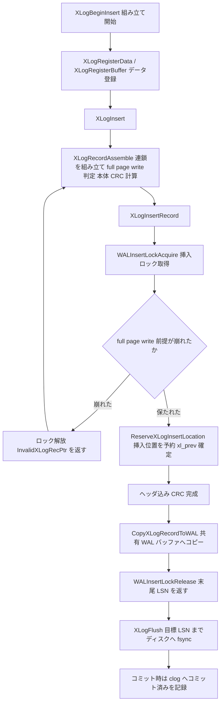

# 第38章 WAL の仕組み

> **本章で読むソース**
>
> - [`src/include/access/xlogrecord.h`](https://github.com/postgres/postgres/blob/REL_18_4/src/include/access/xlogrecord.h)
> - [`src/backend/access/transam/xloginsert.c`](https://github.com/postgres/postgres/blob/REL_18_4/src/backend/access/transam/xloginsert.c)
> - [`src/backend/access/transam/xlog.c`](https://github.com/postgres/postgres/blob/REL_18_4/src/backend/access/transam/xlog.c)

## この章の狙い

第33章で、トランザクションのコミットは WAL にコミットレコードを書き、clog に「コミット済み」を刻む2つがそろって初めて成立すると述べた。
その「WAL にレコードを書く」とは何を意味するのか、本章はその中身を読む。

WAL（先行書き込みログ）は、データページそのものをディスクへ書く前に、変更を記録したログを先にディスクへ書くという規律である。
クラッシュしてもログが残っていれば、ログを再生してデータページの変更をやり直せる。
逆に言えば、データページをディスクへ書き出す前には、そのページを変更したログがディスクへ達していなければならない。
この順序が守られているかぎり、いつクラッシュしても、最後にディスクへ達したログの地点まで状態を復元できる。

本章はこの規律を、レコードの組み立てから永続化までの順に追う。
まず WAL レコードの構成（`XLogRecord`）と、ログ内の位置を表す LSN を読む。
次にレコードを組み立てる `XLogBeginInsert`/`XLogRegisterData`/`XLogInsert`（`xloginsert.c`）を読み、組み立てた結果を共有 WAL バッファへ書き込む `XLogInsertRecord`（`xlog.c`）を読む。
続いて永続化を担う `XLogFlush` を読み、コミット時にコミットレコードまでをフラッシュする WAL 規律が第33章とどうつながるかを確認する。
チェックポイント後の最初の更新でページ全体を記録する full page write も読む。

最後に、本章のコードに織り込まれた最適化を1つ機構レベルで説明する。
挿入位置をアトミックに予約する短い区間だけを直列化し、レコードの実体コピーは複数バックエンドが並行に行える、という設計である。

## 前提

第33章でトランザクションの開始、コミット、アボートを読み、コミットが `RecordTransactionCommit` で WAL と clog に書かれることを見た。
第27章で MVCC と可視性判定を読み、変更がページに加わることを前提にしてきた。
第22章で共有バッファとバッファ管理を読み、ダーティページがいつディスクへ書き出されるかを見た。

本章は、それらの変更が「ページに書かれる前にログへ書かれる」順序を保証する層に集中する。
チェックポイントの全体像は第39章、クラッシュ後のログ再生（REDO）は第40章で扱う。

## WAL レコードの構成と LSN

WAL に書かれるすべての変更は、レコードという単位を持つ。
レコードは固定長のヘッダ `XLogRecord` で始まり、その後ろにブロック参照やデータが続く。

[`src/include/access/xlogrecord.h` L41-L55](https://github.com/postgres/postgres/blob/REL_18_4/src/include/access/xlogrecord.h#L41-L55)

```c
typedef struct XLogRecord
{
	uint32		xl_tot_len;		/* total len of entire record */
	TransactionId xl_xid;		/* xact id */
	XLogRecPtr	xl_prev;		/* ptr to previous record in log */
	uint8		xl_info;		/* flag bits, see below */
	RmgrId		xl_rmid;		/* resource manager for this record */
	/* 2 bytes of padding here, initialize to zero */
	pg_crc32c	xl_crc;			/* CRC for this record */

	/* XLogRecordBlockHeaders and XLogRecordDataHeader follow, no padding */

} XLogRecord;

#define SizeOfXLogRecord	(offsetof(XLogRecord, xl_crc) + sizeof(pg_crc32c))
```

各フィールドの役割は次のとおりである。
`xl_tot_len` はヘッダを含むレコード全体の長さである。
`xl_xid` はこのレコードを書いたトランザクションの xid である。
`xl_prev` は1つ前のレコードのログ内位置を指す後ろ向きのリンクで、再生時にログの連鎖をたどる手がかりになる。
`xl_info` は上位4ビットを資源マネージャ（rmgr）が自由に使い、下位を `XLogInsert` が内部的に使うフラグである。
`xl_rmid` はこのレコードを再生する資源マネージャの ID で、ヒープ、各種インデックス、トランザクション管理などがそれぞれ自分のレコード形式と再生処理を持つ。
末尾の `xl_crc` はレコード全体の CRC で、再生時に破損を検出する。

レコードの全体配置はヘッダのコメントに図示されている。

[`src/include/access/xlogrecord.h` L20-L40](https://github.com/postgres/postgres/blob/REL_18_4/src/include/access/xlogrecord.h#L20-L40)

```c
/*
 * The overall layout of an XLOG record is:
 *		Fixed-size header (XLogRecord struct)
 *		XLogRecordBlockHeader struct
 *		XLogRecordBlockHeader struct
 *		...
 *		XLogRecordDataHeader[Short|Long] struct
 *		block data
 *		block data
 *		...
 *		main data
 *
 * There can be zero or more XLogRecordBlockHeaders, and 0 or more bytes of
 * rmgr-specific data not associated with a block.  XLogRecord structs
 * always start on MAXALIGN boundaries in the WAL files, but the rest of
 * the fields are not aligned.
 *
 * The XLogRecordBlockHeader, XLogRecordDataHeaderShort and
 * XLogRecordDataHeaderLong structs all begin with a single 'id' byte. It's
 * used to distinguish between block references, and the main data structs.
 */
```

固定長ヘッダの後ろには、変更したブロックを参照する `XLogRecordBlockHeader` が0個以上続く。
その後ろに、ブロックに結びつかない rmgr 固有のデータ（main data）が続く。
`XLogRecord` は WAL ファイル中で必ず MAXALIGN の境界から始まるが、それ以降のフィールドは詰めて並べられ、整列されない。

レコードのログ内位置は LSN（log sequence number）で表す。
LSN の実体は次のとおり、64 ビットの整数である。

[`src/include/access/xlogdefs.h` L17-L21](https://github.com/postgres/postgres/blob/REL_18_4/src/include/access/xlogdefs.h#L17-L21)

```c
/*
 * Pointer to a location in the XLOG.  These pointers are 64 bits wide,
 * because we don't want them ever to overflow.
 */
typedef uint64 XLogRecPtr;
```

LSN は WAL の先頭から数えたバイト位置である。
レコードを書くたびに LSN は前へ進み、過去に戻ることはない。
変更されたデータページにも、そのページを最後に変更したレコードの末尾 LSN が記録される。
このページ LSN こそが、WAL 規律を機械的に表現する値になる。
ページを書き出す前に、そのページ LSN までの WAL をフラッシュしておけば、ページに反映された変更のログは必ずディスクに残っている。

## レコードの組み立て

レコードの組み立ては `xloginsert.c` が担う。
バックエンドはまず `XLogBeginInsert` で組み立ての開始を宣言する。

[`src/backend/access/transam/xloginsert.c` L148-L163](https://github.com/postgres/postgres/blob/REL_18_4/src/backend/access/transam/xloginsert.c#L148-L163)

```c
void
XLogBeginInsert(void)
{
	Assert(max_registered_block_id == 0);
	Assert(mainrdata_last == (XLogRecData *) &mainrdata_head);
	Assert(mainrdata_len == 0);

	/* cross-check on whether we should be here or not */
	if (!XLogInsertAllowed())
		elog(ERROR, "cannot make new WAL entries during recovery");

	if (begininsert_called)
		elog(ERROR, "XLogBeginInsert was already called");

	begininsert_called = true;
}
```

この関数は組み立て用の作業領域がきれいな状態であることを確認し、再生中（リカバリ中）に新しい WAL を書こうとしていないかを検査する。
組み立てに使う領域はバックエンドごとの静的変数であり、レコードを1つずつ順に組み立てる前提になっている。

開始したら、レコードに載せたいデータを登録する。
ブロックに結びつかない本体データは `XLogRegisterData` で登録する。

[`src/backend/access/transam/xloginsert.c` L363-L389](https://github.com/postgres/postgres/blob/REL_18_4/src/backend/access/transam/xloginsert.c#L363-L389)

```c
void
XLogRegisterData(const void *data, uint32 len)
{
	XLogRecData *rdata;

	Assert(begininsert_called);

	if (num_rdatas >= max_rdatas)
		ereport(ERROR,
				(errmsg_internal("too much WAL data"),
				 errdetail_internal("%d out of %d data segments are already in use.",
									num_rdatas, max_rdatas)));
	rdata = &rdatas[num_rdatas++];

	rdata->data = data;
	rdata->len = len;

	/*
	 * we use the mainrdata_last pointer to track the end of the chain, so no
	 * need to clear 'next' here.
	 */

	mainrdata_last->next = rdata;
	mainrdata_last = rdata;

	mainrdata_len += len;
}
```

ここで重要なのは、データを即座にコピーするのではなく、データへのポインタと長さの組（`XLogRecData`）を連鎖につなぐだけだという点である。
呼び出し側が渡したバッファをそのまま指すので、登録は安く、実際のコピーはあとでまとめて行う。
ブロックに結びつくデータは `XLogRegisterBuffer` でブロックを登録してから `XLogRegisterBufData` で登録するが、考え方は同じである。

登録が済んだら `XLogInsert` を呼ぶ。

[`src/backend/access/transam/xloginsert.c` L473-L530](https://github.com/postgres/postgres/blob/REL_18_4/src/backend/access/transam/xloginsert.c#L473-L530)

```c
XLogRecPtr
XLogInsert(RmgrId rmid, uint8 info)
{
	XLogRecPtr	EndPos;

	/* XLogBeginInsert() must have been called. */
	if (!begininsert_called)
		elog(ERROR, "XLogBeginInsert was not called");

	/*
	 * The caller can set rmgr bits, XLR_SPECIAL_REL_UPDATE and
	 * XLR_CHECK_CONSISTENCY; the rest are reserved for use by me.
	 */
	if ((info & ~(XLR_RMGR_INFO_MASK |
				  XLR_SPECIAL_REL_UPDATE |
				  XLR_CHECK_CONSISTENCY)) != 0)
		elog(PANIC, "invalid xlog info mask %02X", info);

	TRACE_POSTGRESQL_WAL_INSERT(rmid, info);

	/*
	 * In bootstrap mode, we don't actually log anything but XLOG resources;
	 * return a phony record pointer.
	 */
	if (IsBootstrapProcessingMode() && rmid != RM_XLOG_ID)
	{
		XLogResetInsertion();
		EndPos = SizeOfXLogLongPHD; /* start of 1st chkpt record */
		return EndPos;
	}

	do
	{
		XLogRecPtr	RedoRecPtr;
		bool		doPageWrites;
		bool		topxid_included = false;
		XLogRecPtr	fpw_lsn;
		XLogRecData *rdt;
		int			num_fpi = 0;

		/*
		 * Get values needed to decide whether to do full-page writes. Since
		 * we don't yet have an insertion lock, these could change under us,
		 * but XLogInsertRecord will recheck them once it has a lock.
		 */
		GetFullPageWriteInfo(&RedoRecPtr, &doPageWrites);

		rdt = XLogRecordAssemble(rmid, info, RedoRecPtr, doPageWrites,
								 &fpw_lsn, &num_fpi, &topxid_included);

		EndPos = XLogInsertRecord(rdt, fpw_lsn, curinsert_flags, num_fpi,
								  topxid_included);
	} while (EndPos == InvalidXLogRecPtr);

	XLogResetInsertion();

	return EndPos;
}
```

`XLogInsert` は2段階で動く。
`XLogRecordAssemble` で登録済みのデータからレコードの本体（`XLogRecData` の連鎖）を組み立て、`XLogInsertRecord` でそれを共有 WAL バッファへ書き込む。
注目すべきは `do ... while (EndPos == InvalidXLogRecPtr)` のループである。
`XLogInsertRecord` は、レコードを書く直前に full page write の前提が崩れていたことに気付くと `InvalidXLogRecPtr` を返す。
そのときは組み立てからやり直す。
この再試行が必要になる理由は、組み立て段階ではまだ挿入ロックを持っておらず、`GetFullPageWriteInfo` で読んだ値が他のバックエンドによって変わりうるからである。

`XLogRecordAssemble` は登録された各ブロックについて、ページ全体を記録するか（full page write）を決め、ヘッダを埋め、本体データの CRC を計算する。
CRC の計算とヘッダの最終化は次のとおりである。

[`src/backend/access/transam/xloginsert.c` L903-L934](https://github.com/postgres/postgres/blob/REL_18_4/src/backend/access/transam/xloginsert.c#L903-L934)

```c
	INIT_CRC32C(rdata_crc);
	COMP_CRC32C(rdata_crc, hdr_scratch + SizeOfXLogRecord, hdr_rdt.len - SizeOfXLogRecord);
	for (rdt = hdr_rdt.next; rdt != NULL; rdt = rdt->next)
		COMP_CRC32C(rdata_crc, rdt->data, rdt->len);

	/*
	 * Ensure that the XLogRecord is not too large.
	 *
	 * XLogReader machinery is only able to handle records up to a certain
	 * size (ignoring machine resource limitations), so make sure that we will
	 * not emit records larger than the sizes advertised to be supported.
	 */
	if (total_len > XLogRecordMaxSize)
		ereport(ERROR,
				(errmsg_internal("oversized WAL record"),
				 errdetail_internal("WAL record would be %" PRIu64 " bytes (of maximum %u bytes); rmid %u flags %u.",
									total_len, XLogRecordMaxSize, rmid, info)));

	/*
	 * Fill in the fields in the record header. Prev-link is filled in later,
	 * once we know where in the WAL the record will be inserted. The CRC does
	 * not include the record header yet.
	 */
	rechdr->xl_xid = GetCurrentTransactionIdIfAny();
	rechdr->xl_tot_len = (uint32) total_len;
	rechdr->xl_info = info;
	rechdr->xl_rmid = rmid;
	rechdr->xl_prev = InvalidXLogRecPtr;
	rechdr->xl_crc = rdata_crc;

	return &hdr_rdt;
}
```

CRC はこの時点では本体データ部分（ヘッダを除く）だけで計算する。
`xl_prev` はまだ埋められない。
レコードが WAL のどこに入るかは、共有バッファへの書き込み段階で挿入位置を確保して初めて決まるからである。
ヘッダの CRC への取り込みと `xl_prev` の確定は、次に読む `XLogInsertRecord` の中で行われる。

## 共有 WAL バッファへの書き込み

組み立てたレコードを共有 WAL バッファへ書き込むのが `xlog.c` の `XLogInsertRecord` である。
この関数の冒頭コメントが、書き込みを2段階に分ける設計を説明している。

[`src/backend/access/transam/xlog.c` L787-L819](https://github.com/postgres/postgres/blob/REL_18_4/src/backend/access/transam/xlog.c#L787-L819)

```c
	/*----------
	 *
	 * We have now done all the preparatory work we can without holding a
	 * lock or modifying shared state. From here on, inserting the new WAL
	 * record to the shared WAL buffer cache is a two-step process:
	 *
	 * 1. Reserve the right amount of space from the WAL. The current head of
	 *	  reserved space is kept in Insert->CurrBytePos, and is protected by
	 *	  insertpos_lck.
	 *
	 * 2. Copy the record to the reserved WAL space. This involves finding the
	 *	  correct WAL buffer containing the reserved space, and copying the
	 *	  record in place. This can be done concurrently in multiple processes.
	 *
	 * To keep track of which insertions are still in-progress, each concurrent
	 * inserter acquires an insertion lock. In addition to just indicating that
	 * an insertion is in progress, the lock tells others how far the inserter
	 * has progressed. There is a small fixed number of insertion locks,
	 * determined by NUM_XLOGINSERT_LOCKS. When an inserter crosses a page
	 * boundary, it updates the value stored in the lock to the how far it has
	 * inserted, to allow the previous buffer to be flushed.
	 *
	 * Holding onto an insertion lock also protects RedoRecPtr and
	 * fullPageWrites from changing until the insertion is finished.
	 *
	 * Step 2 can usually be done completely in parallel. If the required WAL
	 * page is not initialized yet, you have to grab WALBufMappingLock to
	 * initialize it, but the WAL writer tries to do that ahead of insertions
	 * to avoid that from happening in the critical path.
	 *
	 *----------
	 */
	START_CRIT_SECTION();
```

第1段階は、レコードの長さぶんの場所を WAL の中に予約する。
第2段階は、予約した場所にレコードの実体をコピーする。
複数のバックエンドが並行にレコードを書き込めるように、各バックエンドは挿入ロック（insertion lock）を取得する。
挿入ロックは `NUM_XLOGINSERT_LOCKS` 個だけ用意され、どこまで書き込んだかを他のバックエンドに知らせる役割も持つ。

通常のレコードでは、まず挿入ロックを1つ取り、挿入位置を予約する。

[`src/backend/access/transam/xlog.c` L821-L870](https://github.com/postgres/postgres/blob/REL_18_4/src/backend/access/transam/xlog.c#L821-L870)

```c
	if (likely(class == WALINSERT_NORMAL))
	{
		WALInsertLockAcquire();

		/*
		 * Check to see if my copy of RedoRecPtr is out of date. If so, may
		 * have to go back and have the caller recompute everything. This can
		 * only happen just after a checkpoint, so it's better to be slow in
		 * this case and fast otherwise.
		 *
		 * Also check to see if fullPageWrites was just turned on or there's a
		 * running backup (which forces full-page writes); if we weren't
		 * already doing full-page writes then go back and recompute.
		 *
		 * If we aren't doing full-page writes then RedoRecPtr doesn't
		 * actually affect the contents of the XLOG record, so we'll update
		 * our local copy but not force a recomputation.  (If doPageWrites was
		 * just turned off, we could recompute the record without full pages,
		 * but we choose not to bother.)
		 */
		if (RedoRecPtr != Insert->RedoRecPtr)
		{
			Assert(RedoRecPtr < Insert->RedoRecPtr);
			RedoRecPtr = Insert->RedoRecPtr;
		}
		doPageWrites = (Insert->fullPageWrites || Insert->runningBackups > 0);

		if (doPageWrites &&
			(!prevDoPageWrites ||
			 (fpw_lsn != InvalidXLogRecPtr && fpw_lsn <= RedoRecPtr)))
		{
			/*
			 * Oops, some buffer now needs to be backed up that the caller
			 * didn't back up.  Start over.
			 */
			WALInsertLockRelease();
			END_CRIT_SECTION();
			return InvalidXLogRecPtr;
		}

		/*
		 * Reserve space for the record in the WAL. This also sets the xl_prev
		 * pointer.
		 */
		ReserveXLogInsertLocation(rechdr->xl_tot_len, &StartPos, &EndPos,
								  &rechdr->xl_prev);

		/* Normal records are always inserted. */
		inserted = true;
	}
```

挿入ロックを取った直後に、組み立て段階で使った `RedoRecPtr` が古くなっていないかを再検査する。
チェックポイント直後には `Insert->RedoRecPtr` が進んでいることがあり、その場合は full page write の前提が崩れているおそれがある。
前提が崩れていれば、ロックを離して `InvalidXLogRecPtr` を返し、`XLogInsert` のループに組み立てからやり直させる。
前提が保たれていれば、`ReserveXLogInsertLocation` で挿入位置を予約し、同時に `xl_prev` を埋める。

予約が済むと、`xl_prev` が確定したのでヘッダを含めた CRC を完成させ、レコードの実体を予約した場所へコピーする。

[`src/backend/access/transam/xlog.c` L907-L924](https://github.com/postgres/postgres/blob/REL_18_4/src/backend/access/transam/xlog.c#L907-L924)

```c
	if (inserted)
	{
		/*
		 * Now that xl_prev has been filled in, calculate CRC of the record
		 * header.
		 */
		rdata_crc = rechdr->xl_crc;
		COMP_CRC32C(rdata_crc, rechdr, offsetof(XLogRecord, xl_crc));
		FIN_CRC32C(rdata_crc);
		rechdr->xl_crc = rdata_crc;

		/*
		 * All the record data, including the header, is now ready to be
		 * inserted. Copy the record in the space reserved.
		 */
		CopyXLogRecordToWAL(rechdr->xl_tot_len,
							class == WALINSERT_SPECIAL_SWITCH, rdata,
							StartPos, EndPos, insertTLI);
```

`CopyXLogRecordToWAL` が `XLogRecData` の連鎖をたどり、予約済みの WAL バッファへバイト列を書き込む。
書き込みが済んだら挿入ロックを離す。
このとき、ページ境界をまたいだなら共有の書き込み要求位置 `LogwrtRqst.Write` を進め、後続のフラッシュがどこまで書けばよいかを知らせる。

ここまでで、レコードは共有 WAL バッファ（メモリ上）に載った。
だがまだディスクには達していない。
永続化は次の `XLogFlush` が担う。

## 挿入位置のアトミックな予約という最適化

`XLogInsertRecord` の設計の要は、直列化が必要な区間を「挿入位置の予約」だけに絞り込んだ点にある。
`ReserveXLogInsertLocation` がその予約を行う。

[`src/backend/access/transam/xlog.c` L1124-L1146](https://github.com/postgres/postgres/blob/REL_18_4/src/backend/access/transam/xlog.c#L1124-L1146)

```c
	/*
	 * The duration the spinlock needs to be held is minimized by minimizing
	 * the calculations that have to be done while holding the lock. The
	 * current tip of reserved WAL is kept in CurrBytePos, as a byte position
	 * that only counts "usable" bytes in WAL, that is, it excludes all WAL
	 * page headers. The mapping between "usable" byte positions and physical
	 * positions (XLogRecPtrs) can be done outside the locked region, and
	 * because the usable byte position doesn't include any headers, reserving
	 * X bytes from WAL is almost as simple as "CurrBytePos += X".
	 */
	SpinLockAcquire(&Insert->insertpos_lck);

	startbytepos = Insert->CurrBytePos;
	endbytepos = startbytepos + size;
	prevbytepos = Insert->PrevBytePos;
	Insert->CurrBytePos = endbytepos;
	Insert->PrevBytePos = startbytepos;

	SpinLockRelease(&Insert->insertpos_lck);

	*StartPos = XLogBytePosToRecPtr(startbytepos);
	*EndPos = XLogBytePosToEndRecPtr(endbytepos);
	*PrevPtr = XLogBytePosToRecPtr(prevbytepos);
```

スピンロック `insertpos_lck` を握っている区間は、予約済み WAL の先頭 `CurrBytePos` を読んで `size` だけ進め、書き戻すだけである。
バイト位置と物理的な LSN の変換（`XLogBytePosToRecPtr` など）は、ロックの外で行う。
この変換をロックの外に出せるのは、`CurrBytePos` がページヘッダを含まない「使用可能バイト」だけを数える位置だからである。
ヘッダを含めずに数えれば、X バイトの予約は実質 `CurrBytePos += X` という足し算1つで済み、ロック区間が極小になる。

この設計が速い理由は、全バックエンドが奪い合う唯一の直列化点（スピンロック区間）を、足し算と読み書きだけの数命令に切り詰めたからである。
レコードの実体コピー（`CopyXLogRecordToWAL`）は予約した別々の場所への書き込みなので、複数のバックエンドが同時に進められる。
この性質を関数のコメントは「これが直列化しなければならない性能上の急所であり、残りはほぼ並行に行える」と述べている。

[`src/backend/access/transam/xlog.c` L1098-L1101](https://github.com/postgres/postgres/blob/REL_18_4/src/backend/access/transam/xlog.c#L1098-L1101)

```c
 * This is the performance critical part of XLogInsert that must be serialized
 * across backends. The rest can happen mostly in parallel. Try to keep this
 * section as short as possible, insertpos_lck can be heavily contended on a
 * busy system.
```

挿入ロック自体も、競合を散らす工夫を持つ。
`WALInsertLockAcquire` は、前回使ったロックをまず試す。

[`src/backend/access/transam/xlog.c` L1389-L1411](https://github.com/postgres/postgres/blob/REL_18_4/src/backend/access/transam/xlog.c#L1389-L1411)

```c
	static int	lockToTry = -1;

	if (lockToTry == -1)
		lockToTry = MyProcNumber % NUM_XLOGINSERT_LOCKS;
	MyLockNo = lockToTry;

	/*
	 * The insertingAt value is initially set to 0, as we don't know our
	 * insert location yet.
	 */
	immed = LWLockAcquire(&WALInsertLocks[MyLockNo].l.lock, LW_EXCLUSIVE);
	if (!immed)
	{
		/*
		 * If we couldn't get the lock immediately, try another lock next
		 * time.  On a system with more insertion locks than concurrent
		 * inserters, this causes all the inserters to eventually migrate to a
		 * lock that no-one else is using.  On a system with more inserters
		 * than locks, it still helps to distribute the inserters evenly
		 * across the locks.
		 */
		lockToTry = (lockToTry + 1) % NUM_XLOGINSERT_LOCKS;
	}
```

前回のロックがすぐ取れれば、同じロックを使い続けることでキャッシュラインの跳ね返りを避けられる。
すぐ取れなければ次回は別のロックを試し、バックエンドを空いているロックへ徐々に移していく。
こうして、複数のバックエンドが少数の挿入ロックへ均等に散らばる。

## 永続化と WAL 規律

メモリ上の WAL バッファをディスクへ確実に書き出すのが `XLogFlush` である。

[`src/backend/access/transam/xlog.c` L2779-L2801](https://github.com/postgres/postgres/blob/REL_18_4/src/backend/access/transam/xlog.c#L2779-L2801)

```c
void
XLogFlush(XLogRecPtr record)
{
	XLogRecPtr	WriteRqstPtr;
	XLogwrtRqst WriteRqst;
	TimeLineID	insertTLI = XLogCtl->InsertTimeLineID;

	/*
	 * During REDO, we are reading not writing WAL.  Therefore, instead of
	 * trying to flush the WAL, we should update minRecoveryPoint instead. We
	 * test XLogInsertAllowed(), not InRecovery, because we need checkpointer
	 * to act this way too, and because when it tries to write the
	 * end-of-recovery checkpoint, it should indeed flush.
	 */
	if (!XLogInsertAllowed())
	{
		UpdateMinRecoveryPoint(record, false);
		return;
	}

	/* Quick exit if already known flushed */
	if (record <= LogwrtResult.Flush)
		return;
```

引数 `record` は「ここまでをディスクへ達させてほしい」という目標 LSN である。
すでにその LSN までフラッシュ済みなら、`record <= LogwrtResult.Flush` の判定で即座に戻る。
この早期復帰が、同じ地点へのフラッシュ要求が重なったときの無駄を省く。

まだフラッシュが必要なら、`WALWriteLock` を取って `XLogWrite` を呼び、目標 LSN までを書いて fsync する。
このとき複数のバックエンドのフラッシュ要求を1回の fsync にまとめる工夫がある。
fsync は高価なので、ロックを待つ間に他のバックエンドが要求を出していれば、まとめて書いてしまう。

[`src/backend/access/transam/xlog.c` L2813-L2822](https://github.com/postgres/postgres/blob/REL_18_4/src/backend/access/transam/xlog.c#L2813-L2822)

```c
	/*
	 * Since fsync is usually a horribly expensive operation, we try to
	 * piggyback as much data as we can on each fsync: if we see any more data
	 * entered into the xlog buffer, we'll write and fsync that too, so that
	 * the final value of LogwrtResult.Flush is as large as possible. This
	 * gives us some chance of avoiding another fsync immediately after.
	 */

	/* initialize to given target; may increase below */
	WriteRqstPtr = record;
```

これがグループコミットの基礎である。
ロックの取得を `LWLockAcquireOrWait` で行い、ロックを待っている間に別のバックエンドがフラッシュを済ませてくれたら自分は何もせず戻る、という形で、多数のコミットが少数の fsync に集約される。

`XLogFlush` がコミットとどう結びつくかは、第33章で読んだ `RecordTransactionCommit` に現れる。

[`src/backend/access/transam/xact.c` L1498-L1509](https://github.com/postgres/postgres/blob/REL_18_4/src/backend/access/transam/xact.c#L1498-L1509)

```c
	if ((wrote_xlog && markXidCommitted &&
		 synchronous_commit > SYNCHRONOUS_COMMIT_OFF) ||
		forceSyncCommit || nrels > 0)
	{
		XLogFlush(XactLastRecEnd);

		/*
		 * Now we may update the CLOG, if we wrote a COMMIT record above
		 */
		if (markXidCommitted)
			TransactionIdCommitTree(xid, nchildren, children);
	}
```

`XactLastRecEnd` は、このトランザクションが最後に書いた WAL レコードの末尾 LSN であり、コミットレコードもそこに含まれる。
コミットが完了したと応答する前に `XLogFlush(XactLastRecEnd)` を呼び、コミットレコードまでがディスクへ達したことを保証する。
フラッシュが終わって初めて clog に「コミット済み」を刻む（`TransactionIdCommitTree`）。
この順序により、クライアントにコミット成功を返した後にクラッシュしても、コミットレコードはディスクに残っており、再生でコミットを復元できる。
WAL 規律の「ログを先に永続化する」が、コミットの局面で具体化したものがこの一連の処理である。

## full page write

WAL レコードは多くの場合、ページの一部だけを書き換える差分を記録する。
だがこの差分再生には前提がある。
再生の出発点となるディスク上のページが、壊れていない完全なページであることである。

ところがディスクへのページ書き込みは、たとえば 8KB のページの途中で電源が落ちると、前半だけが書かれて後半が古いまま、という中途半端な状態になりうる。
この破れたページ（torn page）に差分だけを適用しても、正しいページは復元できない。
これを防ぐのが full page write である。
チェックポイント後にそのページを最初に変更するときだけ、差分ではなくページ全体をレコードに載せる。
ページ全体があれば、再生はそれを丸ごと上書きすればよく、再生前のディスク上のページが破れていても問題にならない。

ページ全体を載せるかどうかの判定は `XLogRecordAssemble` の中にある。

[`src/backend/access/transam/xloginsert.c` L604-L626](https://github.com/postgres/postgres/blob/REL_18_4/src/backend/access/transam/xloginsert.c#L604-L626)

```c
		/* Determine if this block needs to be backed up */
		if (regbuf->flags & REGBUF_FORCE_IMAGE)
			needs_backup = true;
		else if (regbuf->flags & REGBUF_NO_IMAGE)
			needs_backup = false;
		else if (!doPageWrites)
			needs_backup = false;
		else
		{
			/*
			 * We assume page LSN is first data on *every* page that can be
			 * passed to XLogInsert, whether it has the standard page layout
			 * or not.
			 */
			XLogRecPtr	page_lsn = PageGetLSN(regbuf->page);

			needs_backup = (page_lsn <= RedoRecPtr);
			if (!needs_backup)
			{
				if (*fpw_lsn == InvalidXLogRecPtr || page_lsn < *fpw_lsn)
					*fpw_lsn = page_lsn;
			}
		}
```

判定の核心は `needs_backup = (page_lsn <= RedoRecPtr)` の一行である。
`RedoRecPtr` は直近のチェックポイントが再生を開始する LSN である。
ページの LSN がそれ以下なら、このページはチェックポイント以降まだ変更されていない、つまりチェックポイント後の最初の変更だと分かるので、ページ全体を記録する。
逆にページ LSN が `RedoRecPtr` より新しければ、チェックポイント後すでにこのページ全体が WAL に載っているはずなので、差分だけでよい。
ここで `needs_backup` が偽になったとき、`*fpw_lsn` にそのページの LSN を控えておく。
このページ LSN が、`XLogInsertRecord` で `fpw_lsn <= RedoRecPtr` を再検査するときの判断材料になる。

full page write は WAL を膨らませる。
そのため、ページ全体を載せるのはチェックポイント後の最初の変更だけに限り、2回目以降は差分に戻す。
この絞り込みによって、torn page への防御と WAL 量の抑制を両立させている。

## レコードの組み立てとフラッシュの流れ

ここまでの流れを図にまとめる。



レコードはメモリ上の連鎖として組み立てられ、挿入位置を予約してから共有 WAL バッファへコピーされる。
ディスクへの永続化は `XLogFlush` が担い、コミットの局面ではコミットレコードまでをフラッシュしてから clog を更新する。
この順序が「ログをデータより先に永続化する」WAL 規律を実現している。

## まとめ

本章では WAL レコードの組み立てから永続化までを読んだ。
レコードは固定長ヘッダ `XLogRecord` で始まり、ログ内の位置は 64 ビットの LSN で表す。
組み立ては `xloginsert.c` が担い、データへのポインタを連鎖につなぐだけで安く済ませ、`XLogRecordAssemble` でまとめて本体を作り CRC を計算する。
共有 WAL バッファへの書き込みは `XLogInsertRecord` が2段階で行い、挿入位置の予約だけをスピンロックで直列化し、レコードの実体コピーは並行に進める。
永続化は `XLogFlush` が担い、コミット時には `RecordTransactionCommit` がコミットレコードまでをフラッシュしてから clog を更新することで、WAL 規律を保証する。

最適化として、挿入位置のアトミックな予約を機構レベルで読んだ。
全バックエンドが奪い合う直列化点を `CurrBytePos += X` の数命令へ切り詰め、ロック区間の外でバイト位置を物理 LSN へ変換することで、レコードの組み立てとコピーを複数バックエンドが並行に行えるようにしている。
full page write は、チェックポイント後の最初の変更でページ全体を記録し、torn page から再生の出発点を守る工夫である。

## 関連する章

- [第33章 トランザクション管理](../part08-transactions-concurrency/33-transaction-management.md)
- [第27章 MVCC と可視性判定](../part06-table-mvcc/27-mvcc-and-visibility.md)
- [第22章 共有バッファとバッファ管理](../part05-storage-buffer/22-buffer-manager.md)
