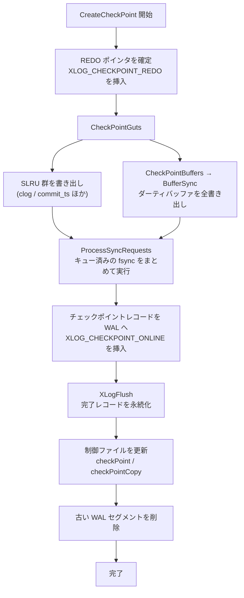

# 第39章 チェックポイント

> **本章で読むソース**
>
> - [`src/backend/postmaster/checkpointer.c`](https://github.com/postgres/postgres/blob/REL_18_4/src/backend/postmaster/checkpointer.c)
> - [`src/backend/access/transam/xlog.c`](https://github.com/postgres/postgres/blob/REL_18_4/src/backend/access/transam/xlog.c)
> - [`src/backend/storage/buffer/bufmgr.c`](https://github.com/postgres/postgres/blob/REL_18_4/src/backend/storage/buffer/bufmgr.c)

## この章の狙い

PostgreSQL は、ページの変更をまず WAL に追記し、変更後のページ本体は共有バッファ上に溜めたまま遅延して書き戻す。
この方式は書き込みを軽くする一方で、クラッシュ時にはディスク上のデータファイルが古いままになる。
そのため再起動時には、WAL を先頭から読み直してデータファイルへ変更を適用する必要がある。
だが WAL を無限に遡るわけにはいかない。
そこで、ある時点までの変更がすべてデータファイルへ反映されたことを保証し、「ここより前の WAL は再生しなくてよい」という基準点を作る。
この基準点を作る操作が**チェックポイント**である。

本章は、チェックポイントを実行する専用プロセスである**チェックポインタ**のループと、その本体である `CreateCheckPoint` を読む。
中心となる事実は単純である。
ダーティバッファを残らず書き出し、その完了後にチェックポイントレコードを WAL へ刻み、最後に制御ファイルへ基準点を記録する。
この三段の順序が、リカバリの正しさを支えている。

本章を貫く着眼点は、書き出しの平滑化にある。
共有バッファの全ダーティページを一気に `fsync` まで走らせれば、その瞬間ディスクへ I/O が集中し、通常の問い合わせが巻き添えで遅くなる。
チェックポインタは書き出しを時間軸に沿って引き延ばし、次のチェックポイントまでの猶予のうちの一定割合を使って少しずつページを流す。
この仕組みが、リカバリの基準点作りを前景の処理から切り離している。

## 前提

WAL の追記と `XLogFlush` による永続化、REDO ポインタの意味は[第38章](38-wal.md)で扱う。
本章はそれらを使う側であり、チェックポイントが WAL のどこを基準点に選ぶかを読む。
共有バッファとダーティページ、`SyncOneBuffer` によるページ書き出しは[第22章](../part05-storage-buffer/22-buffer-manager.md)で扱った。
チェックポインタは独立した補助プロセスであり、プロセスモデルは[第4章](../part00-introduction/02-architecture-overview.md)で概観している。
クラッシュ時に WAL を再生してデータファイルを復元する手順そのものは[第40章](40-crash-recovery.md)に送り、本章はその起点を作るところまでを読む。

## チェックポインタのループ

チェックポイントは専用の補助プロセス、チェックポインタが担う。
その本体 `CheckpointerMain` は、エラー回復用の `sigsetjmp` を据えたあと、無限ループに入る。
ループの一周ごとに、自分を起こした要因を調べ、チェックポイントを実行すべきかを判断する。

ループは要求と時刻の二つの契機を見る。
バックエンドが共有メモリ上の `ckpt_flags` を立てていれば要求による起動、前回からの経過秒が `CheckPointTimeout`（`checkpoint_timeout`）を超えていれば時刻による起動である。

[`src/backend/postmaster/checkpointer.c` L376-L396](https://github.com/postgres/postgres/blob/REL_18_4/src/backend/postmaster/checkpointer.c#L376-L396)

```c
		if (((volatile CheckpointerShmemStruct *) CheckpointerShmem)->ckpt_flags)
		{
			do_checkpoint = true;
			chkpt_or_rstpt_requested = true;
		}

		/*
		 * Force a checkpoint if too much time has elapsed since the last one.
		 * Note that we count a timed checkpoint in stats only when this
		 * occurs without an external request, but we set the CAUSE_TIME flag
		 * bit even if there is also an external request.
		 */
		now = (pg_time_t) time(NULL);
		elapsed_secs = now - last_checkpoint_time;
		if (elapsed_secs >= CheckPointTimeout)
		{
			if (!do_checkpoint)
				chkpt_or_rstpt_timed = true;
			do_checkpoint = true;
			flags |= CHECKPOINT_CAUSE_TIME;
		}
```

どちらの契機もなければ、ループ末尾で次の起床予定時刻まで `WaitLatch` でスリープする。
バックエンドがチェックポイントを要求するときはラッチを立てて起こすため、このスリープは時間切れだけでなく要求でも明ける。

実行すると決めると、要求フラグを取り込んで何のためのチェックポイントかを確定する。
リカバリ中であればチェックポイントの代わりに**リスタートポイント**を作るが、本章では通常運転のチェックポイントに絞る。

[`src/backend/postmaster/checkpointer.c` L468-L474](https://github.com/postgres/postgres/blob/REL_18_4/src/backend/postmaster/checkpointer.c#L468-L474)

```c
			ckpt_active = true;
			if (do_restartpoint)
				ckpt_start_recptr = GetXLogReplayRecPtr(NULL);
			else
				ckpt_start_recptr = GetInsertRecPtr();
			ckpt_start_time = now;
			ckpt_cached_elapsed = 0;
```

`ckpt_start_recptr` と `ckpt_start_time` は、開始時点の WAL 位置と時刻を控える。
これらは後で進捗の物差しになり、書き出しをどれだけ平滑化するかの基準を与える。
ここまでで前置きが整い、`CreateCheckPoint(flags)` が呼ばれる。

なお `last_checkpoint_time` には、終了時刻ではなく開始時刻 `now` を記録する。
時刻起動のチェックポイントを一定間隔で並べるための選択であり、長いチェックポイントが次の間隔を食いつぶさないようにしている。

## CreateCheckPoint の三段

`CreateCheckPoint` がチェックポイントの本体である。
この関数は、REDO ポインタの確定、ダーティデータの書き出し、チェックポイントレコードの挿入、制御ファイルの更新を順に行う。
まず、この関数が何のために存在するかをコメントが述べている。

[`src/backend/access/transam/xlog.c` L6906-L6915](https://github.com/postgres/postgres/blob/REL_18_4/src/backend/access/transam/xlog.c#L6906-L6915)

```c
 * If !shutdown then we are writing an online checkpoint. An XLOG_CHECKPOINT_REDO
 * record is inserted into WAL at the logical location of the checkpoint, before
 * flushing anything to disk, and when the checkpoint is eventually completed,
 * and it is from this point that WAL replay will begin in the case of a recovery
 * from this checkpoint. Once everything is written to disk, an
 * XLOG_CHECKPOINT_ONLINE record is written to complete the checkpoint, and
 * points back to the earlier XLOG_CHECKPOINT_REDO record. This mechanism allows
 * other write-ahead log records to be written while the checkpoint is in
 * progress, but we must be very careful about order of operations. This function
 * may take many minutes to execute on a busy system.
```

通常運転のチェックポイント（オンラインチェックポイント）では、二つのレコードが対になる。
書き出しを始める前に `XLOG_CHECKPOINT_REDO` を挿入し、その LSN を REDO ポインタとする。
書き出しがすべて終わったあとに `XLOG_CHECKPOINT_ONLINE` を挿入してチェックポイントを締め、これが前者の REDO ポインタを指し戻す。
二つに分けるのは、書き出しに何分もかかるあいだ、他のバックエンドが WAL を書き続けられるようにするためである。

### REDO ポインタを刻む

オンラインチェックポイントの REDO ポインタは、`XLOG_CHECKPOINT_REDO` レコードを挿入した位置に置く。
このレコードを書いた瞬間の WAL 位置が、リカバリの開始点になる。

[`src/backend/access/transam/xlog.c` L7094-L7108](https://github.com/postgres/postgres/blob/REL_18_4/src/backend/access/transam/xlog.c#L7094-L7108)

```c
	if (!shutdown)
	{
		/* Include WAL level in record for WAL summarizer's benefit. */
		XLogBeginInsert();
		XLogRegisterData(&wal_level, sizeof(wal_level));
		(void) XLogInsert(RM_XLOG_ID, XLOG_CHECKPOINT_REDO);

		/*
		 * XLogInsertRecord will have updated XLogCtl->Insert.RedoRecPtr in
		 * shared memory and RedoRecPtr in backend-local memory, but we need
		 * to copy that into the record that will be inserted when the
		 * checkpoint is complete.
		 */
		checkPoint.redo = RedoRecPtr;
	}
```

REDO ポインタを書き出し前に決めるのは、書き出しの最中に他のバックエンドがダーティにしたページを、このチェックポイントの対象から外すためである。
REDO ポインタより後に書かれた WAL は、たとえ対応するページがまだディスクに無くても、リカバリが再生して埋め合わせる。
逆に REDO ポインタより前の変更は、このチェックポイントが必ずディスクへ落とすと約束する。

### ダーティデータを書き出す

REDO ポインタを刻んだら、チェックポイントレコードの中身を組み立て、共有メモリ上のダーティデータをすべてディスクへ書き出す。
書き出しの本体は `CheckPointGuts` にまとまっている。

[`src/backend/access/transam/xlog.c` L7549-L7577](https://github.com/postgres/postgres/blob/REL_18_4/src/backend/access/transam/xlog.c#L7549-L7577)

```c
static void
CheckPointGuts(XLogRecPtr checkPointRedo, int flags)
{
	CheckPointRelationMap();
	CheckPointReplicationSlots(flags & CHECKPOINT_IS_SHUTDOWN);
	CheckPointSnapBuild();
	CheckPointLogicalRewriteHeap();
	CheckPointReplicationOrigin();

	/* Write out all dirty data in SLRUs and the main buffer pool */
	TRACE_POSTGRESQL_BUFFER_CHECKPOINT_START(flags);
	CheckpointStats.ckpt_write_t = GetCurrentTimestamp();
	CheckPointCLOG();
	CheckPointCommitTs();
	CheckPointSUBTRANS();
	CheckPointMultiXact();
	CheckPointPredicate();
	CheckPointBuffers(flags);

	/* Perform all queued up fsyncs */
	TRACE_POSTGRESQL_BUFFER_CHECKPOINT_SYNC_START();
	CheckpointStats.ckpt_sync_t = GetCurrentTimestamp();
	ProcessSyncRequests();
	CheckpointStats.ckpt_sync_end_t = GetCurrentTimestamp();
	TRACE_POSTGRESQL_BUFFER_CHECKPOINT_DONE();

	/* We deliberately delay 2PC checkpointing as long as possible */
	CheckPointTwoPhase(checkPointRedo);
}
```

`CheckPointGuts` は、clog や commit_ts といった SLRU 群と、主役である共有バッファプールの両方を書き出す。
共有バッファの書き出しを担うのが `CheckPointBuffers` で、その中身は `BufferSync` を呼ぶだけの薄い層である。

[`src/backend/storage/buffer/bufmgr.c` L4209-L4213](https://github.com/postgres/postgres/blob/REL_18_4/src/backend/storage/buffer/bufmgr.c#L4209-L4213)

```c
void
CheckPointBuffers(int flags)
{
	BufferSync(flags);
}
```

書き出した個々のページを一つずつ `fsync` するわけではない。
`CheckPointGuts` は、まず全ページを書いてから、末尾の `ProcessSyncRequests` でまとめて `fsync` を流す。
ページ書き込みと `fsync` を分離することで、OS のページキャッシュにまとめて書き込みを溜め、同期回数を減らせる。

### チェックポイントレコードと制御ファイル

書き出しが終わると、`CreateCheckPoint` はチェックポイントレコードを WAL へ挿入し、`XLogFlush` でそれを永続化する。

[`src/backend/access/transam/xlog.c` L7250-L7256](https://github.com/postgres/postgres/blob/REL_18_4/src/backend/access/transam/xlog.c#L7250-L7256)

```c
	XLogBeginInsert();
	XLogRegisterData(&checkPoint, sizeof(checkPoint));
	recptr = XLogInsert(RM_XLOG_ID,
						shutdown ? XLOG_CHECKPOINT_SHUTDOWN :
						XLOG_CHECKPOINT_ONLINE);

	XLogFlush(recptr);
```

このレコード（オンラインチェックポイントなら `XLOG_CHECKPOINT_ONLINE`）が、チェックポイントの完了を WAL 上に刻む印である。
レコードには先ほど確定した REDO ポインタ `checkPoint.redo` が含まれ、リカバリの開始点を指す。
`XLogFlush` でこのレコードが確実にディスクへ落ちて初めて、チェックポイントは「完了した」と言える。

最後に、`CreateCheckPoint` は**制御ファイル**（`pg_control`）を更新する。
制御ファイルは、起動時に最初に読まれる小さなファイルであり、最新のチェックポイントがどこにあるかを記録する。

[`src/backend/access/transam/xlog.c` L7290-L7307](https://github.com/postgres/postgres/blob/REL_18_4/src/backend/access/transam/xlog.c#L7290-L7307)

```c
	LWLockAcquire(ControlFileLock, LW_EXCLUSIVE);
	if (shutdown)
		ControlFile->state = DB_SHUTDOWNED;
	ControlFile->checkPoint = ProcLastRecPtr;
	ControlFile->checkPointCopy = checkPoint;
	/* crash recovery should always recover to the end of WAL */
	ControlFile->minRecoveryPoint = InvalidXLogRecPtr;
	ControlFile->minRecoveryPointTLI = 0;

	/*
	 * Persist unloggedLSN value. It's reset on crash recovery, so this goes
	 * unused on non-shutdown checkpoints, but seems useful to store it always
	 * for debugging purposes.
	 */
	ControlFile->unloggedLSN = pg_atomic_read_membarrier_u64(&XLogCtl->unloggedLSN);

	UpdateControlFile();
	LWLockRelease(ControlFileLock);
```

`ControlFile->checkPoint` に、いま書いたチェックポイントレコードの位置 `ProcLastRecPtr` を記録する。
`checkPointCopy` にはレコードの中身そのものを写し、REDO ポインタを含むメタ情報を起動時にすぐ読めるようにする。
制御ファイルの更新が、三段の最後の段である。

この順序は崩せない。
仮にチェックポイントレコードより先に制御ファイルを書いてしまうと、その間にクラッシュしたとき、制御ファイルが指す基準点に対応する完了レコードが WAL に無く、リカバリの整合が崩れる。
ダーティデータの書き出しを終え、完了レコードを `XLogFlush` で永続化してから制御ファイルを進める。
この一方向の順序が、制御ファイルの指す位置を常に「すでに到達済みの基準点」に保つ。

### CreateCheckPoint の手順

ここまでの三段を図にまとめる。



完了レコードの永続化が終わったあと、`CreateCheckPoint` はもう不要になった古い WAL セグメントを削除する。
新しい REDO ポインタより前の WAL は、これ以降のリカバリで読まれないため捨ててよい。
チェックポイントが基準点を前へ進めることが、WAL の蓄積を解放する契機にもなっている。

## なぜ「ここより前の WAL は再生不要」と言えるのか

チェックポイントの完了は、二つの事実を同時に保証する。
第一に、REDO ポインタより前の変更を含むダーティページは、`BufferSync` がすべて書き出し、`ProcessSyncRequests` がすべて `fsync` した。
第二に、その完了をチェックポイントレコードが WAL 上に刻み、制御ファイルがその位置を指している。

この二つから、REDO ポインタより前の変更はすべてデータファイルへ反映済みだと分かる。
ゆえにクラッシュ後のリカバリは、制御ファイルが指すチェックポイントの REDO ポインタから WAL を読み始めればよく、それより前を再生する必要がない。
リカバリが基準点より前を読まずに済む理由は「チェックポイントが新しいから」ではない。
基準点より前の変更がすべてディスクに落ちていることを、書き出しの完了とレコードの永続化という順序で保証しているからである。

REDO ポインタより後にダーティ化したページは、まだディスクに無いかもしれない。
だがそれらの変更は WAL に残っており、リカバリが REDO ポインタから前進再生する過程で改めて適用される。
この前進再生そのものは[第40章](40-crash-recovery.md)で読む。

## 書き出しの平滑化という最適化

`CreateCheckPoint` は、ダーティページを書き出すあいだ I/O を時間軸へ引き延ばす。
これがこの章の中心となる最適化である。
全ダーティページを休みなく書けば、その瞬間ディスクへ書き込みが集中し、同じディスクを使う通常の問い合わせが待たされる。
そこで `BufferSync` は、一ページ書くごとに `CheckpointWriteDelay` を呼び、進捗に応じて短いスリープを挟む。

[`src/backend/storage/buffer/bufmgr.c` L3581-L3586](https://github.com/postgres/postgres/blob/REL_18_4/src/backend/storage/buffer/bufmgr.c#L3581-L3586)

```c
		/*
		 * Sleep to throttle our I/O rate.
		 *
		 * (This will check for barrier events even if it doesn't sleep.)
		 */
		CheckpointWriteDelay(flags, (double) num_processed / num_to_scan);
```

第二引数は進捗率である。
書き出すべきページ総数 `num_to_scan` のうち、いま何ページ目まで処理したかの割合を渡す。
`CheckpointWriteDelay` は、この進捗が時間の進みに対して先行しているなら少し休み、遅れているなら休まず追い上げる。

[`src/backend/postmaster/checkpointer.c` L784-L816](https://github.com/postgres/postgres/blob/REL_18_4/src/backend/postmaster/checkpointer.c#L784-L816)

```c
	if (!(flags & CHECKPOINT_IMMEDIATE) &&
		!ShutdownXLOGPending &&
		!ShutdownRequestPending &&
		!ImmediateCheckpointRequested() &&
		IsCheckpointOnSchedule(progress))
	{
		if (ConfigReloadPending)
		{
			ConfigReloadPending = false;
			ProcessConfigFile(PGC_SIGHUP);
			/* update shmem copies of config variables */
			UpdateSharedMemoryConfig();
		}

		AbsorbSyncRequests();
		absorb_counter = WRITES_PER_ABSORB;

		CheckArchiveTimeout();

		/* Report interim statistics to the cumulative stats system */
		pgstat_report_checkpointer();

		/*
		 * This sleep used to be connected to bgwriter_delay, typically 200ms.
		 * That resulted in more frequent wakeups if not much work to do.
		 * Checkpointer and bgwriter are no longer related so take the Big
		 * Sleep.
		 */
		WaitLatch(MyLatch, WL_LATCH_SET | WL_EXIT_ON_PM_DEATH | WL_TIMEOUT,
				  100,
				  WAIT_EVENT_CHECKPOINT_WRITE_DELAY);
		ResetLatch(MyLatch);
	}
```

休むかどうかの判断は `IsCheckpointOnSchedule` が下す。
この関数は、進捗率と「前回からどれだけ時刻や WAL 量が進んだか」を比べ、進捗が時間に先行していれば予定どおりと見なす。

[`src/backend/postmaster/checkpointer.c` L851-L910](https://github.com/postgres/postgres/blob/REL_18_4/src/backend/postmaster/checkpointer.c#L851-L910)

```c
	/* Scale progress according to checkpoint_completion_target. */
	progress *= CheckPointCompletionTarget;

	/*
	 * Check against the cached value first. Only do the more expensive
	 * calculations once we reach the target previously calculated. Since
	 * neither time or WAL insert pointer moves backwards, a freshly
	 * calculated value can only be greater than or equal to the cached value.
	 */
	if (progress < ckpt_cached_elapsed)
		return false;

	/*
	 * Check progress against WAL segments written and CheckPointSegments.
	 *
	 * We compare the current WAL insert location against the location
	 * computed before calling CreateCheckPoint. The code in XLogInsert that
	 * actually triggers a checkpoint when CheckPointSegments is exceeded
	 * compares against RedoRecPtr, so this is not completely accurate.
	 * However, it's good enough for our purposes, we're only calculating an
	 * estimate anyway.
	 *
	 * During recovery, we compare last replayed WAL record's location with
	 * the location computed before calling CreateRestartPoint. That maintains
	 * the same pacing as we have during checkpoints in normal operation, but
	 * we might exceed max_wal_size by a fair amount. That's because there can
	 * be a large gap between a checkpoint's redo-pointer and the checkpoint
	 * record itself, and we only start the restartpoint after we've seen the
	 * checkpoint record. (The gap is typically up to CheckPointSegments *
	 * checkpoint_completion_target where checkpoint_completion_target is the
	 * value that was in effect when the WAL was generated).
	 */
	if (RecoveryInProgress())
		recptr = GetXLogReplayRecPtr(NULL);
	else
		recptr = GetInsertRecPtr();
	elapsed_xlogs = (((double) (recptr - ckpt_start_recptr)) /
					 wal_segment_size) / CheckPointSegments;

	if (progress < elapsed_xlogs)
	{
		ckpt_cached_elapsed = elapsed_xlogs;
		return false;
	}

	/*
	 * Check progress against time elapsed and checkpoint_timeout.
	 */
	gettimeofday(&now, NULL);
	elapsed_time = ((double) ((pg_time_t) now.tv_sec - ckpt_start_time) +
					now.tv_usec / 1000000.0) / CheckPointTimeout;

	if (progress < elapsed_time)
	{
		ckpt_cached_elapsed = elapsed_time;
		return false;
	}

	/* It looks like we're on schedule. */
	return true;
```

先頭で進捗率に `CheckPointCompletionTarget`（GUC の `checkpoint_completion_target`）を掛けている点が肝である。
この値は既定で 0.9 であり、進捗率を 0.9 倍に縮めて時間の物差しと比べる。
その結果、書き出しは「次のチェックポイントまでの猶予の 9 割」を使い切るペースに引き伸ばされる。
猶予の終盤に書き出しが集中しないよう、あえてゆっくり流すわけである。

進捗の物差しは二本立てである。
一本は経過時刻を `CheckPointTimeout` で割った割合、もう一本は開始時から進んだ WAL 量を `CheckPointSegments`（`max_wal_size` から導く）で割った割合である。
時間でも WAL 量でも、先に進んだほうが基準になる。
WAL の生成が速ければ時間より早く書き出しを進め、次のチェックポイントが来る前に書き終えるためである。

この平滑化が効くのは、機構として次の連鎖が成り立つからである。
進捗が時間に先行している → `CheckpointWriteDelay` が `WaitLatch` で 100 ミリ秒休む → そのあいだディスク帯域が通常の問い合わせに空く → 書き出しの瞬間的な集中が崩れる。
猶予全体へ書き込みを薄く塗り広げることで、チェックポイントの I/O が前景の処理を巻き込む度合いを下げている。
ただし `CHECKPOINT_IMMEDIATE` が立つ要求では、この遅延を入れずにできるだけ速く書き切る。
シャットダウンや即時要求では、平滑化より早期完了が優先される。

書き出しのスリープ中も `AbsorbSyncRequests` を呼んでいる。
バックエンドが投げた `fsync` 要求のキューを取り込み続け、休んでいるあいだに要求が溢れて詰まるのを防ぐためである。

## まとめ

チェックポイントは、リカバリの起点となる基準点を作る操作である。
チェックポインタは無限ループで要求と時刻の契機を待ち、いずれかが立つと `CreateCheckPoint` を呼ぶ。
`CreateCheckPoint` はオンラインチェックポイントで REDO ポインタを刻み、`CheckPointGuts` がダーティバッファと SLRU をすべて書き出して `fsync` し、チェックポイントレコードを WAL へ挿入して `XLogFlush` で永続化し、最後に制御ファイルを更新する。
この一方向の順序が、制御ファイルの指す位置を常に「到達済みの基準点」に保つ。
ゆえにリカバリは、その REDO ポインタから WAL を読み始めればよく、それより前を再生しなくてよい。
書き出しは `checkpoint_completion_target` に従って猶予の一定割合へ引き伸ばされ、I/O の瞬間的な集中を避ける。

## 関連する章

- [第38章　WAL の仕組み](38-wal.md)：本章が刻む REDO ポインタと `XLogFlush` の内部、WAL レコード挿入の仕組み。
- [第40章　クラッシュリカバリと REDO](40-crash-recovery.md)：本章が作った基準点から WAL を前進再生し、データファイルを復元する側。
- [第22章　共有バッファとバッファ管理](../part05-storage-buffer/22-buffer-manager.md)：`BufferSync` が書き出すダーティバッファと、`SyncOneBuffer` によるページ書き出し。
- [第41章　レプリケーション](41-replication.md)：スタンバイ側でチェックポイントに対応するリスタートポイントを作る仕組み。
