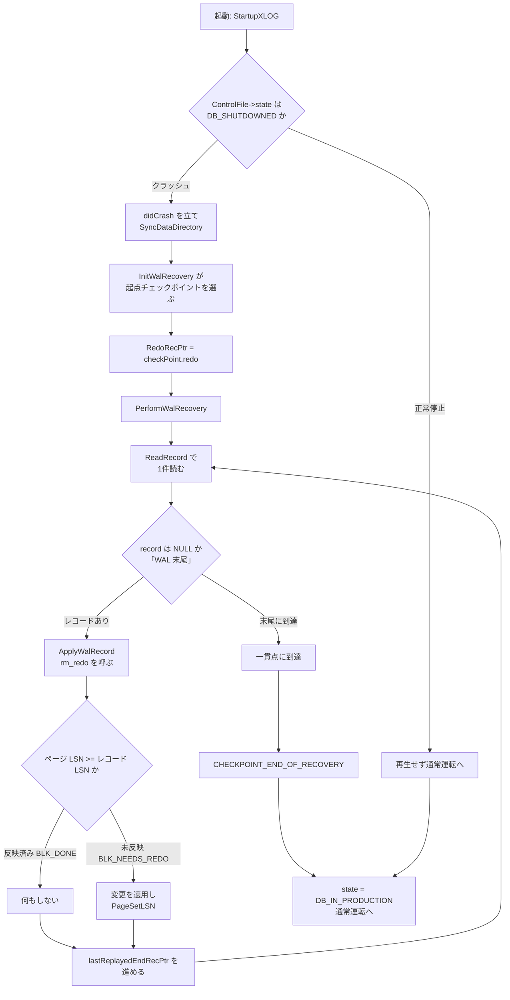

# 第40章 クラッシュリカバリと REDO

> **本章で読むソース**
>
> - [`src/backend/access/transam/xlog.c`](https://github.com/postgres/postgres/blob/REL_18_4/src/backend/access/transam/xlog.c)
> - [`src/backend/access/transam/xlogrecovery.c`](https://github.com/postgres/postgres/blob/REL_18_4/src/backend/access/transam/xlogrecovery.c)
> - [`src/backend/access/transam/xlogutils.c`](https://github.com/postgres/postgres/blob/REL_18_4/src/backend/access/transam/xlogutils.c)
> - [`src/backend/access/heap/heapam_xlog.c`](https://github.com/postgres/postgres/blob/REL_18_4/src/backend/access/heap/heapam_xlog.c)
> - [`src/include/access/xlog_internal.h`](https://github.com/postgres/postgres/blob/REL_18_4/src/include/access/xlog_internal.h)

## この章の狙い

第38章で、ページを変更する前にその差分を WAL へ書き、ログを先に永続化する先行書き込みログ（WAL）の規律を読んだ。
第39章では、その WAL の起点を切り直すチェックポイントが、どこから再生を始めればよいかを示す REDO 位置を制御ファイルへ刻むことを読んだ。
本章は、その仕込みを使う側を読む。
プロセスがクラッシュで止まり、共有バッファ上の新しいページがディスクに書かれないまま消えた状態から、起動プロセスが WAL を再生してデータベースを一貫した状態へ戻す道筋を追う。

読む順序は、起動時の3つの判断に沿う。
まず制御ファイルの状態から「リカバリが要るか」を決める `StartupXLOG`。
次に直近チェックポイントの REDO 位置から WAL レコードを順に適用する再生ループ `PerformWalRecovery`。
最後に、各レコードの再適用が何度繰り返しても安全である理由、すなわちページの LSN とレコードの LSN を比べて適用済みの更新を飛ばす冪等性の仕組みを読む。
この LSN 比較が、本章で機構レベルに掘る最適化である。

## 前提

第38章で WAL レコードと LSN の関係を、第39章でチェックポイントが REDO 位置を制御ファイルへ書くことを読んだ。
本章は起動プロセス側に立ち、制御ファイルに残された REDO 位置を入口として再生を始める。
共有バッファとページレイアウト（ページヘッダの `pd_lsn`）は第22章と第24章で読んだものを用いる。
レプリケーションやスタンバイでの継続的な再生は第41章に譲り、本章はクラッシュからの一度きりの復旧（クラッシュリカバリ）に絞る。

## リカバリの要否を決める `StartupXLOG`

起動プロセスの本体が `StartupXLOG` である。
最初の判断材料は制御ファイル（`pg_control`）に記録されたデータベースの状態である。
`StartupXLOG` はまずチェックポイント位置の妥当性を確かめ、続いて `ControlFile->state` を分岐して、前回の停止がどういう状況だったかをログに記す。

[`src/backend/access/transam/xlog.c` L5502-L5553](https://github.com/postgres/postgres/blob/REL_18_4/src/backend/access/transam/xlog.c#L5502-L5553)

```c
	switch (ControlFile->state)
	{
		case DB_SHUTDOWNED:

			/*
			 * This is the expected case, so don't be chatty in standalone
			 * mode
			 */
			ereport(IsPostmasterEnvironment ? LOG : NOTICE,
					(errmsg("database system was shut down at %s",
							str_time(ControlFile->time))));
			break;

		case DB_SHUTDOWNED_IN_RECOVERY:
			ereport(LOG,
					(errmsg("database system was shut down in recovery at %s",
							str_time(ControlFile->time))));
			break;

		case DB_SHUTDOWNING:
			ereport(LOG,
					(errmsg("database system shutdown was interrupted; last known up at %s",
							str_time(ControlFile->time))));
			break;

		case DB_IN_CRASH_RECOVERY:
			ereport(LOG,
					(errmsg("database system was interrupted while in recovery at %s",
							str_time(ControlFile->time)),
					 errhint("This probably means that some data is corrupted and"
							 " you will have to use the last backup for recovery.")));
			break;

		case DB_IN_ARCHIVE_RECOVERY:
			ereport(LOG,
					(errmsg("database system was interrupted while in recovery at log time %s",
							str_time(ControlFile->checkPointCopy.time)),
					 errhint("If this has occurred more than once some data might be corrupted"
							 " and you might need to choose an earlier recovery target.")));
			break;

		case DB_IN_PRODUCTION:
			ereport(LOG,
					(errmsg("database system was interrupted; last known up at %s",
							str_time(ControlFile->time))));
			break;

		default:
			ereport(FATAL,
					(errcode(ERRCODE_DATA_CORRUPTED),
					 errmsg("control file contains invalid database cluster state")));
	}
```

正常停止なら制御ファイルの状態は `DB_SHUTDOWNED` になっている。
それ以外、たとえば `DB_IN_PRODUCTION`（運転中に落ちた）なら、共有バッファ上の更新がディスクへ書き切れていない可能性がある。
この区別がこの後の処理を二分する。

状態が `DB_SHUTDOWNED` でも `DB_SHUTDOWNED_IN_RECOVERY` でもないとき、前回はクリーンに止まらなかったと判断し、`didCrash` を立ててデータディレクトリ全体を `fsync` する。

[`src/backend/access/transam/xlog.c` L5587-L5595](https://github.com/postgres/postgres/blob/REL_18_4/src/backend/access/transam/xlog.c#L5587-L5595)

```c
	if (ControlFile->state != DB_SHUTDOWNED &&
		ControlFile->state != DB_SHUTDOWNED_IN_RECOVERY)
	{
		RemoveTempXlogFiles();
		SyncDataDirectory();
		didCrash = true;
	}
	else
		didCrash = false;
```

リカバリの起点をどこに置くかは、`InitWalRecovery` が制御ファイルと（あれば）バックアップラベルを解析して決める。
この呼び出しが、再生を始めるべきチェックポイントを選び、メモリ上の制御ファイル像を更新したうえで、リカバリが必要かどうかを示す `InRecovery` を設定する。
選ばれたチェックポイントの内容は `checkPoint` に取り出され、次の `nextXid` などの共有変数の初期化に使われる。

[`src/backend/access/transam/xlog.c` L5605-L5619](https://github.com/postgres/postgres/blob/REL_18_4/src/backend/access/transam/xlog.c#L5605-L5619)

```c
	InitWalRecovery(ControlFile, &wasShutdown,
					&haveBackupLabel, &haveTblspcMap);
	checkPoint = ControlFile->checkPointCopy;

	/* initialize shared memory variables from the checkpoint record */
	TransamVariables->nextXid = checkPoint.nextXid;
	TransamVariables->nextOid = checkPoint.nextOid;
	TransamVariables->oidCount = 0;
	MultiXactSetNextMXact(checkPoint.nextMulti, checkPoint.nextMultiOffset);
	AdvanceOldestClogXid(checkPoint.oldestXid);
	SetTransactionIdLimit(checkPoint.oldestXid, checkPoint.oldestXidDB);
	SetMultiXactIdLimit(checkPoint.oldestMulti, checkPoint.oldestMultiDB, true);
	SetCommitTsLimit(checkPoint.oldestCommitTsXid,
					 checkPoint.newestCommitTsXid);
	XLogCtl->ckptFullXid = checkPoint.nextXid;
```

再生の起点は、このチェックポイント自体の位置ではなく、チェックポイントレコードが指す REDO 位置である。
チェックポイント実行中も他のバックエンドは更新を続けているため、再生はチェックポイント開始時点の LSN（`checkPoint.redo`）まで戻ってから始める必要がある。
`StartupXLOG` はその REDO 位置を共有構造へ控える。

[`src/backend/access/transam/xlog.c` L5725-L5728](https://github.com/postgres/postgres/blob/REL_18_4/src/backend/access/transam/xlog.c#L5725-L5728)

```c
	lastFullPageWrites = checkPoint.fullPageWrites;

	RedoRecPtr = XLogCtl->RedoRecPtr = XLogCtl->Insert.RedoRecPtr = checkPoint.redo;
	doPageWrites = lastFullPageWrites;
```

`InRecovery` が立っていれば、制御ファイルの状態をリカバリ中へ更新したうえで、再生ループ本体の `PerformWalRecovery` を呼ぶ。
正常停止後の起動ならこの分岐に入らず、再生はまったく行わない。

[`src/backend/access/transam/xlog.c` L5883-L5890](https://github.com/postgres/postgres/blob/REL_18_4/src/backend/access/transam/xlog.c#L5883-L5890)

```c
		/*
		 * We're all set for replaying the WAL now. Do it.
		 */
		PerformWalRecovery();
		performedWalRecovery = true;
	}
	else
		performedWalRecovery = false;
```

## WAL を順に適用する `PerformWalRecovery`

`PerformWalRecovery` は、REDO 位置から WAL の末尾へ向かってレコードを1件ずつ読み、適用していく。
ループに入る前に、再生開始位置の最初のレコードを読む。
チェックポイントの REDO 位置がチェックポイントレコードより手前なら、その位置まで戻って読み直す。

[`src/backend/access/transam/xlogrecovery.c` L1717-L1745](https://github.com/postgres/postgres/blob/REL_18_4/src/backend/access/transam/xlogrecovery.c#L1717-L1745)

```c
	/*
	 * Find the first record that logically follows the checkpoint --- it
	 * might physically precede it, though.
	 */
	if (RedoStartLSN < CheckPointLoc)
	{
		/* back up to find the record */
		replayTLI = RedoStartTLI;
		XLogPrefetcherBeginRead(xlogprefetcher, RedoStartLSN);
		record = ReadRecord(xlogprefetcher, PANIC, false, replayTLI);

		/*
		 * If a checkpoint record's redo pointer points back to an earlier
		 * LSN, the record at that LSN should be an XLOG_CHECKPOINT_REDO
		 * record.
		 */
		if (record->xl_rmid != RM_XLOG_ID ||
			(record->xl_info & ~XLR_INFO_MASK) != XLOG_CHECKPOINT_REDO)
			ereport(FATAL,
					(errmsg("unexpected record type found at redo point %X/%X",
							LSN_FORMAT_ARGS(xlogreader->ReadRecPtr))));
	}
	else
	{
		/* just have to read next record after CheckPoint */
		Assert(xlogreader->ReadRecPtr == CheckPointLoc);
		replayTLI = CheckPointTLI;
		record = ReadRecord(xlogprefetcher, LOG, false, replayTLI);
	}
```

ここから再生ループが回る。
1件のレコードを適用し、回復目標に達したか確かめ、達していなければ次のレコードを読む。
読み出した次のレコードが `NULL`、つまり WAL の末尾に達すればループを抜ける。
回復目標（`recovery_target_*`）はポイントインタイムリカバリで使う停止条件で、クラッシュリカバリでは設定されないため、末尾まで読み切ることになる。

[`src/backend/access/transam/xlogrecovery.c` L1766-L1852](https://github.com/postgres/postgres/blob/REL_18_4/src/backend/access/transam/xlogrecovery.c#L1766-L1852)

```c
		/*
		 * main redo apply loop
		 */
		do
		{
			if (!StandbyMode)
				ereport_startup_progress("redo in progress, elapsed time: %ld.%02d s, current LSN: %X/%X",
										 LSN_FORMAT_ARGS(xlogreader->ReadRecPtr));

// ... (中略) ...

			/*
			 * Apply the record
			 */
			ApplyWalRecord(xlogreader, record, &replayTLI);

			/* Exit loop if we reached inclusive recovery target */
			if (recoveryStopsAfter(xlogreader))
			{
				reachedRecoveryTarget = true;
				break;
			}

			/* Else, try to fetch the next WAL record */
			record = ReadRecord(xlogprefetcher, LOG, false, replayTLI);
		} while (record != NULL);
```

1件分の適用を担うのが `ApplyWalRecord` である。
中心は、レコードの所属リソースマネージャの再生関数 `rm_redo` をテーブル経由で呼び出す一行に集約される。

[`src/backend/access/transam/xlogrecovery.c` L2003-L2011](https://github.com/postgres/postgres/blob/REL_18_4/src/backend/access/transam/xlogrecovery.c#L2003-L2011)

```c
	/*
	 * Some XLOG record types that are related to recovery are processed
	 * directly here, rather than in xlog_redo()
	 */
	if (record->xl_rmid == RM_XLOG_ID)
		xlogrecovery_redo(xlogreader, *replayTLI);

	/* Now apply the WAL record itself */
	GetRmgr(record->xl_rmid).rm_redo(xlogreader);
```

`rm_redo` は、リソースマネージャ（ヒープ、各種インデックス、トランザクション管理など）ごとに用意された関数ポインタである。
その型は `RmgrData` 構造体に定義されている。

[`src/include/access/xlog_internal.h` L349-L360](https://github.com/postgres/postgres/blob/REL_18_4/src/include/access/xlog_internal.h#L349-L360)

```c
typedef struct RmgrData
{
	const char *rm_name;
	void		(*rm_redo) (XLogReaderState *record);
	void		(*rm_desc) (StringInfo buf, XLogReaderState *record);
	const char *(*rm_identify) (uint8 info);
	void		(*rm_startup) (void);
	void		(*rm_cleanup) (void);
	void		(*rm_mask) (char *pagedata, BlockNumber blkno);
	void		(*rm_decode) (struct LogicalDecodingContext *ctx,
							  struct XLogRecordBuffer *buf);
} RmgrData;
```

WAL レコードのヘッダにある `xl_rmid` がどのリソースマネージャのレコードかを示し、`GetRmgr` がそのテーブルエントリを引く。
再生ループ自身は、レコードの中身が何を意味するかを知らない。
意味の解釈はすべて `rm_redo` に委ねられ、再生ループはディスパッチに徹する。
この分業のおかげで、新しいアクセスメソッドはリソースマネージャを1つ登録するだけで再生対象に加わり、再生ループの本体には手を入れずに済む。

レコードを適用し終えると、`ApplyWalRecord` は再生済み位置 `lastReplayedEndRecPtr` をレコード末尾の LSN へ進める。
この値は、後述の一貫点の判定に使われる。

[`src/backend/access/transam/xlogrecovery.c` L2024-L2032](https://github.com/postgres/postgres/blob/REL_18_4/src/backend/access/transam/xlogrecovery.c#L2024-L2032)

```c
	/*
	 * Update lastReplayedEndRecPtr after this record has been successfully
	 * replayed.
	 */
	SpinLockAcquire(&XLogRecoveryCtl->info_lck);
	XLogRecoveryCtl->lastReplayedReadRecPtr = xlogreader->ReadRecPtr;
	XLogRecoveryCtl->lastReplayedEndRecPtr = xlogreader->EndRecPtr;
	XLogRecoveryCtl->lastReplayedTLI = *replayTLI;
	SpinLockRelease(&XLogRecoveryCtl->info_lck);
```

## 適用済みの更新を飛ばす冪等な redo

再生は、チェックポイントの REDO 位置という安全に手前へ取った地点から始まる。
そのため、すでにディスクへ反映済みの更新を含むレコードも再び適用しようとする。
たとえば、あるページの変更がチェックポイント前にディスクへ書かれていても、その変更を記録した WAL レコードは REDO 位置より後にあるかもしれない。
このとき同じ更新を二重に適用すると、ページが壊れる。
これを避けるため、各更新の再適用は冪等でなければならない。

冪等性を支えるのが、ページの LSN とレコードの LSN の比較である。
再生関数がページを読むときに使う `XLogReadBufferForRedo` は、対象ページを共有バッファへ読み込み、そのレコードを適用すべきかどうかを判定して返す。
返り値の意味は関数コメントに列挙されている。

[`src/backend/access/transam/xlogutils.c` L277-L284](https://github.com/postgres/postgres/blob/REL_18_4/src/backend/access/transam/xlogutils.c#L277-L284)

```c
 * Returns one of the following:
 *
 *	BLK_NEEDS_REDO	- changes from the WAL record need to be applied
 *	BLK_DONE		- block doesn't need replaying
 *	BLK_RESTORED	- block was restored from a full-page image included in
 *					  the record
 *	BLK_NOTFOUND	- block was not found (because it was truncated away by
 *					  an operation later in the WAL stream)
```

判定の本体は `XLogReadBufferForRedoExtended` にある。
このレコードがフルページイメージを含む場合は、CRC を通っている WAL 側のページ像を無条件で復元して `BLK_RESTORED` を返す。
含まない場合は、レコード末尾の LSN とページに記録された LSN を比べる。

[`src/backend/access/transam/xlogutils.c` L408-L427](https://github.com/postgres/postgres/blob/REL_18_4/src/backend/access/transam/xlogutils.c#L408-L427)

```c
	else
	{
		*buf = XLogReadBufferExtended(rlocator, forknum, blkno, mode, prefetch_buffer);
		if (BufferIsValid(*buf))
		{
			if (mode != RBM_ZERO_AND_LOCK && mode != RBM_ZERO_AND_CLEANUP_LOCK)
			{
				if (get_cleanup_lock)
					LockBufferForCleanup(*buf);
				else
					LockBuffer(*buf, BUFFER_LOCK_EXCLUSIVE);
			}
			if (lsn <= PageGetLSN(BufferGetPage(*buf)))
				return BLK_DONE;
			else
				return BLK_NEEDS_REDO;
		}
		else
			return BLK_NOTFOUND;
	}
```

ここで `lsn` はレコード末尾の LSN（`record->EndRecPtr`）である。
ページの `pd_lsn` は、そのページに最後に反映された WAL レコードの末尾 LSN を保持する。
ページの LSN がレコードの LSN 以上なら、この変更はすでに反映済みなので `BLK_DONE` を返し、再生関数は何もしない。
ページの LSN が小さいときに限り `BLK_NEEDS_REDO` を返し、再生関数が変更を適用する。

この LSN がページに書き込まれる位置が、冪等性の要である。
ヒープへのタプル挿入の再生 `heap_xlog_insert` を例に取る。
`XLogReadBufferForRedo` が `BLK_NEEDS_REDO` を返したときだけページへタプルを足し、その直後にページの LSN をこのレコードの LSN へ更新している。

[`src/backend/access/heap/heapam_xlog.c` L470-L514](https://github.com/postgres/postgres/blob/REL_18_4/src/backend/access/heap/heapam_xlog.c#L470-L514)

```c
	else
		action = XLogReadBufferForRedo(record, 0, &buffer);
	if (action == BLK_NEEDS_REDO)
	{
		Size		datalen;
		char	   *data;

		page = BufferGetPage(buffer);
// ... (中略) ...
		if (PageAddItem(page, (Item) htup, newlen, xlrec->offnum,
						true, true) == InvalidOffsetNumber)
			elog(PANIC, "failed to add tuple");

		freespace = PageGetHeapFreeSpace(page); /* needed to update FSM below */

		PageSetLSN(page, lsn);

		if (xlrec->flags & XLH_INSERT_ALL_VISIBLE_CLEARED)
			PageClearAllVisible(page);

		MarkBufferDirty(buffer);
```

`PageSetLSN(page, lsn)` によって、適用の事実がページ自身に刻まれる。
次にこの同じレコードを再生しようとしても、ページの LSN はすでにこのレコードの LSN に達しているため、`XLogReadBufferForRedo` は `BLK_DONE` を返し、二重適用は起きない。
更新を「適用したかどうか」の記録を別に持たず、変更したページそのものに進捗を埋め込むこの設計により、再生は何度繰り返しても同じ結果に収束する。
再生の途中でもう一度クラッシュしても、また REDO 位置から読み直せばよいのは、この冪等性が成り立つからである。

## 一貫点への到達と通常運転への移行

クラッシュリカバリでは、WAL を末尾まで読み切った時点が一貫した状態に戻った地点である。
一貫点の判定は `CheckRecoveryConsistency` が担う。
クラッシュリカバリでは制御ファイルの `minRecoveryPoint` が無効なので、この関数は冒頭で早期に戻り、すべての WAL を再生し終えるまで一貫状態に達したとは見なさない。

[`src/backend/access/transam/xlogrecovery.c` L2201-L2208](https://github.com/postgres/postgres/blob/REL_18_4/src/backend/access/transam/xlogrecovery.c#L2201-L2208)

```c
	/*
	 * During crash recovery, we don't reach a consistent state until we've
	 * replayed all the WAL.
	 */
	if (XLogRecPtrIsInvalid(minRecoveryPoint))
		return;

	Assert(InArchiveRecovery);
```

アーカイブリカバリでは事情が異なり、`minRecoveryPoint` まで再生した時点で一貫状態に達したと判断する。
そのとき `reachedConsistency` を立て、postmaster へ通知して読み取り専用の接続を許す。

[`src/backend/access/transam/xlogrecovery.c` L2249-L2271](https://github.com/postgres/postgres/blob/REL_18_4/src/backend/access/transam/xlogrecovery.c#L2249-L2271)

```c
	if (!reachedConsistency && !backupEndRequired &&
		minRecoveryPoint <= lastReplayedEndRecPtr)
	{
		/*
		 * Check to see if the XLOG sequence contained any unresolved
		 * references to uninitialized pages.
		 */
		XLogCheckInvalidPages();

		/*
		 * Check that pg_tblspc doesn't contain any real directories. Replay
		 * of Database/CREATE_* records may have created fictitious tablespace
		 * directories that should have been removed by the time consistency
		 * was reached.
		 */
		CheckTablespaceDirectory();

		reachedConsistency = true;
		SendPostmasterSignal(PMSIGNAL_RECOVERY_CONSISTENT);
		ereport(LOG,
				(errmsg("consistent recovery state reached at %X/%X",
						LSN_FORMAT_ARGS(lastReplayedEndRecPtr))));
	}
```

再生ループを抜けると、制御は `StartupXLOG` に戻る。
通常運転へ移る前に、リカバリの成果をディスクへ確定させる必要がある。
それを行うのが `PerformRecoveryXLogAction` で、クラッシュリカバリの通常経路では末尾の到達を示すフラグを付けたチェックポイントを要求し、完了まで待つ。

[`src/backend/access/transam/xlog.c` L6355-L6360](https://github.com/postgres/postgres/blob/REL_18_4/src/backend/access/transam/xlog.c#L6355-L6360)

```c
	else
	{
		RequestCheckpoint(CHECKPOINT_END_OF_RECOVERY |
						  CHECKPOINT_IMMEDIATE |
						  CHECKPOINT_WAIT);
	}
```

最後に、制御ファイルの状態を `DB_IN_PRODUCTION` へ、共有のリカバリ状態を `RECOVERY_STATE_DONE` へ進める。
この更新を境に、他のバックエンドが WAL を書き込んでよい通常運転へ移る。

[`src/backend/access/transam/xlog.c` L6204-L6212](https://github.com/postgres/postgres/blob/REL_18_4/src/backend/access/transam/xlog.c#L6204-L6212)

```c
	LWLockAcquire(ControlFileLock, LW_EXCLUSIVE);
	ControlFile->state = DB_IN_PRODUCTION;

	SpinLockAcquire(&XLogCtl->info_lck);
	XLogCtl->SharedRecoveryState = RECOVERY_STATE_DONE;
	SpinLockRelease(&XLogCtl->info_lck);

	UpdateControlFile();
	LWLockRelease(ControlFileLock);
```

ここまでの流れを図にすると、制御ファイルの状態判定から REDO ループを経て一貫点に至り、通常運転へ移るまでを一本の道として描ける。



## 高速化の工夫

本章で機構レベルに掘る工夫は、ページの LSN とレコードの LSN を比べて適用済みの更新を飛ばす点である。
再生は、安全のためチェックポイント前の REDO 位置という手前から始まるので、すでにディスクへ反映済みの更新を含むレコードも必ず通過する。
更新を「適用したかどうか」の台帳を別に持つなら、レコードごとにその台帳を引き当てる照合が要る。
PostgreSQL はこれを、変更したページの `pd_lsn` にそのとき適用したレコードの末尾 LSN を書き込むことで省く。
判定は対象ページ1枚を読み、`lsn <= PageGetLSN(...)` という1回の LSN 比較に帰着し、補助構造の参照も照合表の保守もいらない。

この設計が効くのは、再生が冪等になるからである。
ページに進捗が刻まれているため、同じレコードを二度適用しても二度目は `BLK_DONE` で素通りし、結果は変わらない。
その帰結として、再生の途中で再びクラッシュしても、また同じ REDO 位置から読み直せば一貫状態へ収束する。
チェックポイントが REDO 位置を手前へ取れるのも、この素通りが許されているからであり、第39章で読んだ「再生はチェックポイント前から始める」という割り切りと表裏一体である。

## まとめ

クラッシュリカバリは、制御ファイルの状態判定、REDO 位置からの再生ループ、各更新の冪等な適用という3つの仕組みでできている。
`StartupXLOG` は制御ファイルが `DB_SHUTDOWNED` 以外を示すときにリカバリが要ると判断し、直近チェックポイントの REDO 位置を起点に選ぶ。
`PerformWalRecovery` は WAL を末尾まで順に読み、`ApplyWalRecord` がレコードごとに所属リソースマネージャの `rm_redo` を呼び出す。
各 `rm_redo` は `XLogReadBufferForRedo` でページの LSN とレコードの LSN を比べ、反映済みなら飛ばし、未反映なら適用して `PageSetLSN` で進捗をページに刻む。
この LSN 比較が再生を冪等にし、手前から安全に再生を始めることと、途中でのクラッシュ再発に耐えることの両方を支える。
末尾まで再生すれば一貫点に達し、末尾到達のチェックポイントを経て制御ファイルを `DB_IN_PRODUCTION` へ進め、通常運転へ移る。

## 関連する章

- [第38章 WAL の仕組み](38-wal.md)
- [第39章 チェックポイント](39-checkpoints.md)
- [第41章 レプリケーション](41-replication.md)
- [第22章 共有バッファとバッファ管理](../part05-storage-buffer/22-buffer-manager.md)
- [第24章 ページとタプルのレイアウト](../part05-storage-buffer/24-page-and-tuple-layout.md)
