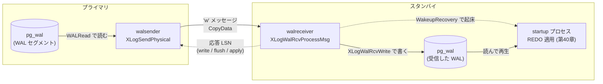

# 第41章 レプリケーション

> **本章で読むソース**
>
> - [`src/backend/replication/walsender.c`](https://github.com/postgres/postgres/blob/REL_18_4/src/backend/replication/walsender.c)
> - [`src/backend/replication/walreceiver.c`](https://github.com/postgres/postgres/blob/REL_18_4/src/backend/replication/walreceiver.c)
> - [`src/backend/replication/syncrep.c`](https://github.com/postgres/postgres/blob/REL_18_4/src/backend/replication/syncrep.c)
> - [`src/backend/replication/logical/logical.c`](https://github.com/postgres/postgres/blob/REL_18_4/src/backend/replication/logical/logical.c)
> - [`src/backend/access/transam/xlog.c`](https://github.com/postgres/postgres/blob/REL_18_4/src/backend/access/transam/xlog.c)

## この章の狙い

第40章で、クラッシュリカバリは保存された WAL を先頭から読み、各レコードの REDO を適用してページを復元すると読んだ。
レプリケーションは、この再生機構をもう1台のサーバへ延長したものである。
プライマリで生成された WAL を、ディスクへ書き留めるだけでなくネットワーク越しに別サーバへ流し、受け手はそれを自分の `pg_wal` に書いて同じ REDO を適用し続ける。
こうしてレプリカは、プライマリの状態を WAL の粒度で追いかけ続ける。

本章は、この WAL の流れを2つのプロセスの境界として読む。
プライマリ側で WAL を送り出す `walsender`（`walsender.c`）と、レプリカ側で WAL を受け取って書く `walreceiver`（`walreceiver.c`）である。
受け取った WAL を実際に再生するのは第40章で読んだスタートアッププロセスであり、`walreceiver` はそこへ「新しい WAL が届いた」と知らせる役を担う。
この WAL を物理的にそのまま送る方式を**ストリーミングレプリケーション**と呼ぶ。

物理的な WAL 転送を読んだあとで、その上に積まれた3つの仕組みを概観する。
WAL をいつまで `pg_wal` に残すかを決める**レプリケーションスロット**、コミットを待たせて耐久性を上げる**同期レプリケーション**、そして WAL をデコードして行単位の変更へ翻訳する**ロジカルレプリケーション**である。
ロジカルレプリケーションは入口だけを読み、深入りはしない。

## 前提

第38章で WAL レコードの構造と LSN を、第39章でチェックポイントを、第40章で WAL を先頭から読んで REDO を適用するリカバリの本体を読んだ。
本章はその WAL を別プロセスへ転送する層を読むので、LSN（WAL 上の位置）と REDO の概念は前提にする。
プロセスの起動とラッチによる待機は第4章と第7章で、共有メモリ上の状態の受け渡しは第5章で読んだ。

用語は[用語集]に従う。
WAL を生成する側を**プライマリ**、受け取って再生する側を**スタンバイ**または**レプリカ**と呼び、「主」とは訳さない。

## ストリーミングレプリケーションの全体像

ストリーミングレプリケーションは、3つのプロセスが WAL という1本の流れを順に受け渡す構造になっている。
プライマリの `walsender` が WAL をディスクから読んでネットワークへ書き、スタンバイの `walreceiver` がそれを受けて自分の `pg_wal` へ書き、第40章のスタートアッププロセスがその WAL を読んで REDO を適用する。
3者は別プロセスであり、共有メモリ上の LSN とラッチによる起床通知で連携する。



左から右へ WAL が流れ、右から左へは「どこまで受け取ったか」を示す応答 LSN が戻る。
この戻りの LSN が、後述する同期レプリケーションでコミットの待機を解く材料になる。
以下、左端の `walsender` から順に読む。

## プライマリ側 `walsender` が COPY を開始する

`walsender` は、スタンバイから接続を受けると専用のコマンドを解釈するモードに入る。
スタンバイが `START_REPLICATION` を送ると、`StartReplication` がストリーミングの準備を整える。
このうち、実際に WAL を流し始める手前の処理を読む。

[`src/backend/replication/walsender.c` L928-L974](https://github.com/postgres/postgres/blob/REL_18_4/src/backend/replication/walsender.c#L928-L974)

```c
	/* If there is nothing to stream, don't even enter COPY mode */
	if (!sendTimeLineIsHistoric || cmd->startpoint < sendTimeLineValidUpto)
	{
		/*
		 * When we first start replication the standby will be behind the
		 * primary. For some applications, for example synchronous
		 * replication, it is important to have a clear state for this initial
		 * catchup mode, so we can trigger actions when we change streaming
		 * state later. We may stay in this state for a long time, which is
		 * exactly why we want to be able to monitor whether or not we are
		 * still here.
		 */
		WalSndSetState(WALSNDSTATE_CATCHUP);

		/* Send a CopyBothResponse message, and start streaming */
		pq_beginmessage(&buf, PqMsg_CopyBothResponse);
		pq_sendbyte(&buf, 0);
		pq_sendint16(&buf, 0);
		pq_endmessage(&buf);
		pq_flush();

		/*
		 * Don't allow a request to stream from a future point in WAL that
		 * hasn't been flushed to disk in this server yet.
		 */
		if (FlushPtr < cmd->startpoint)
		{
			ereport(ERROR,
					(errmsg("requested starting point %X/%X is ahead of the WAL flush position of this server %X/%X",
							LSN_FORMAT_ARGS(cmd->startpoint),
							LSN_FORMAT_ARGS(FlushPtr))));
		}

		/* Start streaming from the requested point */
		sentPtr = cmd->startpoint;

		/* Initialize shared memory status, too */
		SpinLockAcquire(&MyWalSnd->mutex);
		MyWalSnd->sentPtr = sentPtr;
		SpinLockRelease(&MyWalSnd->mutex);

		SyncRepInitConfig();

		/* Main loop of walsender */
		replication_active = true;

		WalSndLoop(XLogSendPhysical);
```

スタンバイは接続時に「どの LSN から WAL を欲しいか」を `cmd->startpoint` で指定する。
`walsender` は状態を `WALSNDSTATE_CATCHUP` に移し、フロントエンドプロトコルの双方向 COPY モード（`CopyBothResponse`）を開いてから、`sentPtr`（次に送る位置）を要求された LSN にそろえる。
`CATCHUP` は、スタンバイがまだプライマリに追いついていない初期状態を表す。
追いついた時点で状態を `WALSNDSTATE_STREAMING` へ移すのは、同期レプリケーションが「ここから先のコミットは待たせてよい」と判断する境目を明確にするためである。

準備が終わると `WalSndLoop(XLogSendPhysical)` に入る。
物理レプリケーションでは送信の実体として `XLogSendPhysical` を渡し、後述するロジカルレプリケーションでは別の関数を渡す。
送信ループ本体は送信方式に依存しない形に切り出されている。

## 送信ループ `WalSndLoop`

`WalSndLoop` は、渡されたコールバックを呼んで WAL を送り、送るものがなければラッチで待つループである。

[`src/backend/replication/walsender.c` L2821-L2865](https://github.com/postgres/postgres/blob/REL_18_4/src/backend/replication/walsender.c#L2821-L2865)

```c
	for (;;)
	{
		/* Clear any already-pending wakeups */
		ResetLatch(MyLatch);

		CHECK_FOR_INTERRUPTS();

		/* Process any requests or signals received recently */
		if (ConfigReloadPending)
		{
			ConfigReloadPending = false;
			ProcessConfigFile(PGC_SIGHUP);
			SyncRepInitConfig();
		}

		/* Check for input from the client */
		ProcessRepliesIfAny();

		/*
		 * If we have received CopyDone from the client, sent CopyDone
		 * ourselves, and the output buffer is empty, it's time to exit
		 * streaming.
		 */
		if (streamingDoneReceiving && streamingDoneSending &&
			!pq_is_send_pending())
			break;

		/*
		 * If we don't have any pending data in the output buffer, try to send
		 * some more.  If there is some, we don't bother to call send_data
		 * again until we've flushed it ... but we'd better assume we are not
		 * caught up.
		 */
		if (!pq_is_send_pending())
			send_data();
		else
			WalSndCaughtUp = false;

		/* Try to flush pending output to the client */
		if (pq_flush_if_writable() != 0)
			WalSndShutdown();

		/* If nothing remains to be sent right now ... */
		if (WalSndCaughtUp && !pq_is_send_pending())
		{
```

ループは毎回ラッチをリセットしてから `ProcessRepliesIfAny` でスタンバイからの応答を読み、出力バッファが空なら `send_data`（ここでは `XLogSendPhysical`）を呼んで WAL を1メッセージ分積む。
送るべき WAL が尽きると `WalSndCaughtUp` が真になり、ループ後半でラッチ待ちに入る。
プライマリで新しい WAL がフラッシュされると、その経路から `walsender` のラッチが起こされ、ループが回って続きを送る。
ポーリングではなくラッチによる起床なので、WAL が増えていない間は CPU を使わずにスリープできる。

## 物理 WAL を送る `XLogSendPhysical`

`XLogSendPhysical` は、どこまで安全に送れるかを決め、その範囲の WAL をディスクから読んで1メッセージに詰める。
まず、プライマリで現タイムラインを送る通常ケースの「上限」を読む。

[`src/backend/replication/walsender.c` L3210-L3223](https://github.com/postgres/postgres/blob/REL_18_4/src/backend/replication/walsender.c#L3210-L3223)

```c
	else
	{
		/*
		 * Streaming the current timeline on a primary.
		 *
		 * Attempt to send all data that's already been written out and
		 * fsync'd to disk.  We cannot go further than what's been written out
		 * given the current implementation of WALRead().  And in any case
		 * it's unsafe to send WAL that is not securely down to disk on the
		 * primary: if the primary subsequently crashes and restarts, standbys
		 * must not have applied any WAL that got lost on the primary.
		 */
		SendRqstPtr = GetFlushRecPtr(NULL);
	}
```

送ってよい上限はフラッシュ済み位置（`GetFlushRecPtr`）までである。
これは耐久性の要請による。
まだ fsync されていない WAL をスタンバイへ送ってしまうと、その直後にプライマリがクラッシュして当該 WAL を失った場合、スタンバイだけが「プライマリに存在しない変更」を適用した状態になりかねない。
プライマリに残ることが保証された WAL だけを送ることで、スタンバイがプライマリより先行する事態を防ぐ。

上限が決まると、1メッセージで送る長さを決めて WAL を読み出す。

[`src/backend/replication/walsender.c` L3291-L3320](https://github.com/postgres/postgres/blob/REL_18_4/src/backend/replication/walsender.c#L3291-L3320)

```c
	/*
	 * Figure out how much to send in one message. If there's no more than
	 * MAX_SEND_SIZE bytes to send, send everything. Otherwise send
	 * MAX_SEND_SIZE bytes, but round back to logfile or page boundary.
	 *
	 * The rounding is not only for performance reasons. Walreceiver relies on
	 * the fact that we never split a WAL record across two messages. Since a
	 * long WAL record is split at page boundary into continuation records,
	 * page boundary is always a safe cut-off point. We also assume that
	 * SendRqstPtr never points to the middle of a WAL record.
	 */
	startptr = sentPtr;
	endptr = startptr;
	endptr += MAX_SEND_SIZE;

	/* if we went beyond SendRqstPtr, back off */
	if (SendRqstPtr <= endptr)
	{
		endptr = SendRqstPtr;
		if (sendTimeLineIsHistoric)
			WalSndCaughtUp = false;
		else
			WalSndCaughtUp = true;
	}
	else
	{
		/* round down to page boundary. */
		endptr -= (endptr % XLOG_BLCKSZ);
		WalSndCaughtUp = false;
	}
```

1メッセージの上限 `MAX_SEND_SIZE` は WAL ブロックの16倍である。

[`src/backend/replication/walsender.c` L111](https://github.com/postgres/postgres/blob/REL_18_4/src/backend/replication/walsender.c#L111)

```c
#define MAX_SEND_SIZE (XLOG_BLCKSZ * 16)
```

送る量が `MAX_SEND_SIZE` を超えるときは、末尾を WAL ページ境界（`XLOG_BLCKSZ`）へ切り下げる。
コメントが述べるとおり、これは性能だけの工夫ではない。
長い WAL レコードはページをまたいで続くが、ページ境界では継続レコードとして区切られる。
そのためページ境界は安全な切断点になる。
ここで切ることで、メッセージの境界は必ずページ境界（継続レコードの区切り）に揃い、レコードの断片がページの途中で2つのメッセージに割れることがない。
受け手はメッセージ境界を気にせず WAL を書ける。
切り出した範囲は `'w'`（WAL データ）メッセージとして COPY ストリームに流される。

## スタンバイ側 `walreceiver` が受けて書く

スタンバイ側では `walreceiver` が COPY ストリームからメッセージを読み、種類ごとに処理する。
受信ループは、読めるだけ読んでまとめてフラッシュする形になっている。

[`src/backend/replication/walreceiver.c` L445-L491](https://github.com/postgres/postgres/blob/REL_18_4/src/backend/replication/walreceiver.c#L445-L491)

```c
				len = walrcv_receive(wrconn, &buf, &wait_fd);
				if (len != 0)
				{
					/*
					 * Process the received data, and any subsequent data we
					 * can read without blocking.
					 */
					for (;;)
					{
						if (len > 0)
						{
							/*
							 * Something was received from primary, so adjust
							 * the ping and terminate wakeup times.
							 */
							now = GetCurrentTimestamp();
							WalRcvComputeNextWakeup(WALRCV_WAKEUP_TERMINATE,
													now);
							WalRcvComputeNextWakeup(WALRCV_WAKEUP_PING, now);
							XLogWalRcvProcessMsg(buf[0], &buf[1], len - 1,
												 startpointTLI);
						}
						else if (len == 0)
							break;
						else if (len < 0)
						{
							ereport(LOG,
									(errmsg("replication terminated by primary server"),
									 errdetail("End of WAL reached on timeline %u at %X/%X.",
											   startpointTLI,
											   LSN_FORMAT_ARGS(LogstreamResult.Write))));
							endofwal = true;
							break;
						}
						len = walrcv_receive(wrconn, &buf, &wait_fd);
					}

					/* Let the primary know that we received some data. */
					XLogWalRcvSendReply(false, false);

					/*
					 * If we've written some records, flush them to disk and
					 * let the startup process and primary server know about
					 * them.
					 */
					XLogWalRcvFlush(false, startpointTLI);
				}
```

内側の `for` ループは、ブロックせずに読めるメッセージを `XLogWalRcvProcessMsg` で連続処理する。
読めるものを処理し切ってから、まとめて `XLogWalRcvSendReply` で受信を応答し、`XLogWalRcvFlush` でディスクへフラッシュする。
メッセージ1件ごとに fsync するのではなく、いったん書きためてからまとめてフラッシュするので、fsync の回数を減らせる。

メッセージの解釈は `XLogWalRcvProcessMsg` が型ごとに行う。
`'w'`（WAL データ）の処理を読む。

[`src/backend/replication/walreceiver.c` L829-L852](https://github.com/postgres/postgres/blob/REL_18_4/src/backend/replication/walreceiver.c#L829-L852)

```c
		case 'w':				/* WAL records */
			{
				StringInfoData incoming_message;

				hdrlen = sizeof(int64) + sizeof(int64) + sizeof(int64);
				if (len < hdrlen)
					ereport(ERROR,
							(errcode(ERRCODE_PROTOCOL_VIOLATION),
							 errmsg_internal("invalid WAL message received from primary")));

				/* initialize a StringInfo with the given buffer */
				initReadOnlyStringInfo(&incoming_message, buf, hdrlen);

				/* read the fields */
				dataStart = pq_getmsgint64(&incoming_message);
				walEnd = pq_getmsgint64(&incoming_message);
				sendTime = pq_getmsgint64(&incoming_message);
				ProcessWalSndrMessage(walEnd, sendTime);

				buf += hdrlen;
				len -= hdrlen;
				XLogWalRcvWrite(buf, len, dataStart, tli);
				break;
			}
```

メッセージ先頭の固定長ヘッダから3つの LSN とタイムスタンプを読み、本体を `XLogWalRcvWrite` でディスクへ書く。
`dataStart` はこのメッセージが運ぶ WAL の開始 LSN であり、書き込み先のセグメント内オフセットを決める。
`'k'`（キープアライブ）の場合は WAL を運ばず、必要なら即座に応答を返す。

## スタートアッププロセスへの受け渡し

`walreceiver` は受け取った WAL を書くだけで、再生はしない。
再生は第40章で読んだスタートアッププロセスの仕事である。
両者をつなぐのが `XLogWalRcvFlush` の末尾にある起床通知である。

[`src/backend/replication/walreceiver.c` L989-L1010](https://github.com/postgres/postgres/blob/REL_18_4/src/backend/replication/walreceiver.c#L989-L1010)

```c
	if (LogstreamResult.Flush < LogstreamResult.Write)
	{
		WalRcvData *walrcv = WalRcv;

		issue_xlog_fsync(recvFile, recvSegNo, tli);

		LogstreamResult.Flush = LogstreamResult.Write;

		/* Update shared-memory status */
		SpinLockAcquire(&walrcv->mutex);
		if (walrcv->flushedUpto < LogstreamResult.Flush)
		{
			walrcv->latestChunkStart = walrcv->flushedUpto;
			walrcv->flushedUpto = LogstreamResult.Flush;
			walrcv->receivedTLI = tli;
		}
		SpinLockRelease(&walrcv->mutex);

		/* Signal the startup process and walsender that new WAL has arrived */
		WakeupRecovery();
		if (AllowCascadeReplication())
			WalSndWakeup(true, false);
```

WAL をディスクへ fsync したあと、共有メモリの `flushedUpto`（どこまでフラッシュ済みか）を更新し、`WakeupRecovery` でスタートアッププロセスのラッチを起こす。
起こされたスタートアッププロセスは `flushedUpto` まで WAL を読んで REDO を適用し、レプリカの状態をそこまで進める。
ここで「fsync 済みの位置」を共有することが効いている。
スタートアッププロセスはフラッシュ済みの WAL だけを再生するので、レプリカ自身がクラッシュしても、再生済みのページに対応する WAL は必ずディスクに残っている。
`AllowCascadeReplication` が真なら、さらに下流のスタンバイへ転送する `walsender` も起こす。
これによりレプリカの下にレプリカを連ねるカスケード構成が成り立つ。

ここまでが、WAL がプライマリからスタンバイへ流れ、再生されるまでの本流である。
以降は、この本流の上に積まれた3つの仕組みを概観する。

## レプリケーションスロットによる WAL 保持

ストリーミングが成立するには、スタンバイがまだ受け取っていない WAL がプライマリの `pg_wal` に残っている必要がある。
ところがプライマリは、チェックポイントのたびに不要になった古い WAL セグメントを消そうとする。
スタンバイが一時的に切れている間に必要な WAL が消されると、再接続しても続きを送れない。
これを防ぐのが**レプリケーションスロット**で、各スロットが「ここまでは消すな」という下限 LSN（`restart_lsn`）を保持する。

WAL を消してよい下限を決める `KeepLogSeg` が、このスロットの下限を読む。

[`src/backend/access/transam/xlog.c` L7996-L8062](https://github.com/postgres/postgres/blob/REL_18_4/src/backend/access/transam/xlog.c#L7996-L8062)

```c
KeepLogSeg(XLogRecPtr recptr, XLogSegNo *logSegNo)
{
	XLogSegNo	currSegNo;
	XLogSegNo	segno;
	XLogRecPtr	keep;

	XLByteToSeg(recptr, currSegNo, wal_segment_size);
	segno = currSegNo;

	/* Calculate how many segments are kept by slots. */
	keep = XLogGetReplicationSlotMinimumLSN();
	if (keep != InvalidXLogRecPtr && keep < recptr)
	{
		XLByteToSeg(keep, segno, wal_segment_size);

		/*
		 * Account for max_slot_wal_keep_size to avoid keeping more than
		 * configured.  However, don't do that during a binary upgrade: if
		 * slots were to be invalidated because of this, it would not be
		 * possible to preserve logical ones during the upgrade.
		 */
		if (max_slot_wal_keep_size_mb >= 0 && !IsBinaryUpgrade)
		{
			uint64		slot_keep_segs;

			slot_keep_segs =
				ConvertToXSegs(max_slot_wal_keep_size_mb, wal_segment_size);

			if (currSegNo - segno > slot_keep_segs)
				segno = currSegNo - slot_keep_segs;
		}
	}

	/*
	 * If WAL summarization is in use, don't remove WAL that has yet to be
	 * summarized.
	 */
	keep = GetOldestUnsummarizedLSN(NULL, NULL);
	if (keep != InvalidXLogRecPtr)
	{
		XLogSegNo	unsummarized_segno;

		XLByteToSeg(keep, unsummarized_segno, wal_segment_size);
		if (unsummarized_segno < segno)
			segno = unsummarized_segno;
	}

	/* but, keep at least wal_keep_size if that's set */
	if (wal_keep_size_mb > 0)
	{
		uint64		keep_segs;

		keep_segs = ConvertToXSegs(wal_keep_size_mb, wal_segment_size);
		if (currSegNo - segno < keep_segs)
		{
			/* avoid underflow, don't go below 1 */
			if (currSegNo <= keep_segs)
				segno = 1;
			else
				segno = currSegNo - keep_segs;
		}
	}

	/* don't delete WAL segments newer than the calculated segment */
	if (segno < *logSegNo)
		*logSegNo = segno;
}
```

`XLogGetReplicationSlotMinimumLSN` が全スロットの `restart_lsn` の最小値を返し、`KeepLogSeg` はその位置を含むセグメント以降を保持対象にする。
スロットなしで `wal_keep_size` だけに頼ると、設定した本数を超えて遅れたスタンバイは WAL を失う。
スロットは「実際に必要な分」を LSN で表すので、遅れの大小によらず必要な WAL を残せる。
一方で、切断されたスタンバイの分まで無制限に WAL を残すとディスクを圧迫する。
そのため `max_slot_wal_keep_size` が上限を与え、これを超えるとスロットを無効化して WAL の消去を許す。
保持の正確さとディスク使用量の安全弁を、同じ関数の中で両立させている。

## 同期レプリケーションと非同期レプリケーション

ここまでの WAL 転送は、コミットの完了を待たせない。
プライマリはコミットの WAL をローカルに fsync した時点でクライアントへ完了を返し、その WAL がスタンバイに届いたかは関知しない。
これが**非同期レプリケーション**で、プライマリ障害時には未転送のコミットを失う可能性がある。

**同期レプリケーション**は、コミットがスタンバイへ届く（あるいは適用される）まで完了の返答を遅らせる。
その待機の入口が `SyncRepWaitForLSN` で、コミットのたびに呼ばれる。

[`src/backend/replication/syncrep.c` L159-L181](https://github.com/postgres/postgres/blob/REL_18_4/src/backend/replication/syncrep.c#L159-L181)

```c
	/*
	 * Fast exit if user has not requested sync replication, or there are no
	 * sync replication standby names defined.
	 *
	 * Since this routine gets called every commit time, it's important to
	 * exit quickly if sync replication is not requested.
	 *
	 * We check WalSndCtl->sync_standbys_status flag without the lock and exit
	 * immediately if SYNC_STANDBY_INIT is set (the checkpointer has
	 * initialized this data) but SYNC_STANDBY_DEFINED is missing (no sync
	 * replication requested).
	 *
	 * If SYNC_STANDBY_DEFINED is set, we need to check the status again later
	 * while holding the lock, to check the flag and operate the sync rep
	 * queue atomically.  This is necessary to avoid the race condition
	 * described in SyncRepUpdateSyncStandbysDefined().  On the other hand, if
	 * SYNC_STANDBY_DEFINED is not set, the lock is not necessary because we
	 * don't touch the queue.
	 */
	if (!SyncRepRequested() ||
		((((volatile WalSndCtlData *) WalSndCtl)->sync_standbys_status) &
		 (SYNC_STANDBY_INIT | SYNC_STANDBY_DEFINED)) == SYNC_STANDBY_INIT)
		return;
```

この関数はすべてのコミットで呼ばれるため、同期レプリケーションを使っていない場合の素通りを最優先で速くしている。
共有メモリのフラグ `sync_standbys_status` をロックなしで読み、同期スタンバイが定義されていなければその場で `return` する。
非同期構成では `SyncRepLock` の取得すら行わないので、コミット経路にほとんど負荷を足さない。

同期スタンバイが定義されている場合は、コミットの LSN を `MyProc->waitLSN` に記録して待機キューへ並び、`walsender` がスタンバイからの応答 LSN を受け取って自分の `waitLSN` を追い越したときに起こされる。
どのレベルまで待つか（書き込み、フラッシュ、適用）は `SyncRepWaitMode` が表し、これが本章冒頭の図で右から左へ戻る応答 LSN と対応する。

## ロジカルレプリケーションの入口

ここまではプライマリの WAL をそのままの形で送る物理レプリケーションだった。
**ロジカルレプリケーション**は、WAL をデコードして「どの行がどう変わったか」という論理的な変更へ翻訳し、それを送る。
物理的なバイト列ではなく行単位の変更を送るので、テーブル単位の選択的な複製や、異なるメジャーバージョン間の複製ができる。
本章では入口だけを読み、デコードの詳細には立ち入らない。

ロジカルデコードの開始時に呼ばれる `CreateInitDecodingContext` のうち、後続のデコードの安全性を支える `catalog_xmin` の確保を読む。

[`src/backend/replication/logical/logical.c` L425-L443](https://github.com/postgres/postgres/blob/REL_18_4/src/backend/replication/logical/logical.c#L425-L443)

```c
	LWLockAcquire(ReplicationSlotControlLock, LW_EXCLUSIVE);
	LWLockAcquire(ProcArrayLock, LW_EXCLUSIVE);

	xmin_horizon = GetOldestSafeDecodingTransactionId(!need_full_snapshot);

	SpinLockAcquire(&slot->mutex);
	slot->effective_catalog_xmin = xmin_horizon;
	slot->data.catalog_xmin = xmin_horizon;
	if (need_full_snapshot)
		slot->effective_xmin = xmin_horizon;
	SpinLockRelease(&slot->mutex);

	ReplicationSlotsComputeRequiredXmin(true);

	LWLockRelease(ProcArrayLock);
	LWLockRelease(ReplicationSlotControlLock);

	ReplicationSlotMarkDirty();
	ReplicationSlotSave();
```

ロジカルデコードは WAL を行へ翻訳する際、その行が属するテーブルの定義をシステムカタログから引く必要がある。
ところが VACUUM は、誰も見ていないと判断したカタログの古い行を掃除してしまう。
デコードの途中で必要なカタログ行が消えていると翻訳できない。
そこでロジカルスロットは `catalog_xmin`（このスロットがデコードに必要とするカタログの最古 XID）をスロットに記録する。
`ReplicationSlotsComputeRequiredXmin` を通じてこの下限が VACUUM の掃除可能範囲に反映され、必要なカタログ行が保護される。
ここで `ProcArrayLock` を排他で握るのは、`GetOldestSafeDecodingTransactionId` で安全な下限を計算してからスロットに記録するまでの間に、他のバックエンドがその下限より新しい所まで掃除を進めてしまう競合を防ぐためである。

WAL の保持を `restart_lsn` で、カタログの保持を `catalog_xmin` で同時に押さえることで、ロジカルレプリケーションはスロットの仕組みを物理レプリケーションと共有しつつ、行への翻訳に必要な追加の保護だけを上乗せしている。

## まとめ

レプリケーションは、第40章で読んだ WAL の再生機構を別サーバへ延長したものである。
プライマリの `walsender`（`XLogSendPhysical`）がフラッシュ済みの WAL を読んでページ境界で切り、`'w'` メッセージで送る。
スタンバイの `walreceiver`（`XLogWalRcvProcessMsg`、`XLogWalRcvWrite`）がそれを受けて `pg_wal` へ書き、`XLogWalRcvFlush` の `WakeupRecovery` でスタートアッププロセスを起こす。
起こされたスタートアッププロセスが第40章の REDO でレプリカを進める。

本章で読んだ機構レベルの工夫は次のとおりである。
`XLogSendPhysical` は1メッセージの末尾を WAL ページ境界へ切り下げる。
長い WAL レコードはページ境界で継続レコードに区切られるため、ページ境界は安全な切断点であり、メッセージの境界は継続レコードの区切りにのみ落ちる。
これにより受け手はメッセージ境界を気にせず WAL を書ける。
`walsender` はフラッシュ済み位置までしか送らないので、プライマリ障害時にレプリカがプライマリより先行することがない。
レプリケーションスロットは `KeepLogSeg` を通じて必要な WAL の保持を LSN で正確に表し、`max_slot_wal_keep_size` で上限も与える。
同期レプリケーションの `SyncRepWaitForLSN` は、非同期構成での素通りをロックなしの一読で済ませ、コミット経路への負荷を抑える。
ロジカルレプリケーションは `catalog_xmin` を追加で押さえ、デコードに必要なカタログ行を VACUUM から守る。

## 関連する章

- [第38章 WAL の仕組み](38-wal.md)：本章が転送する WAL レコードと LSN の構造。
- [第39章 チェックポイント](39-checkpoints.md)：古い WAL セグメントを消去する側で、`KeepLogSeg` の保持下限を使う。
- [第40章 クラッシュリカバリと REDO](40-crash-recovery.md)：`walreceiver` が起こすスタートアッププロセスの再生本体。
- [第7章 ラッチとシグナル処理](../part01-process-memory/07-latches-and-signals.md)：`walsender` と `walreceiver` がポーリングを避けるラッチ待機の仕組み。
- [第37章 スナップショットと ProcArray](../part08-transactions-concurrency/37-snapshots-and-procarray.md)：ロジカルスロットの `catalog_xmin` が反映される xmin horizon の計算。
