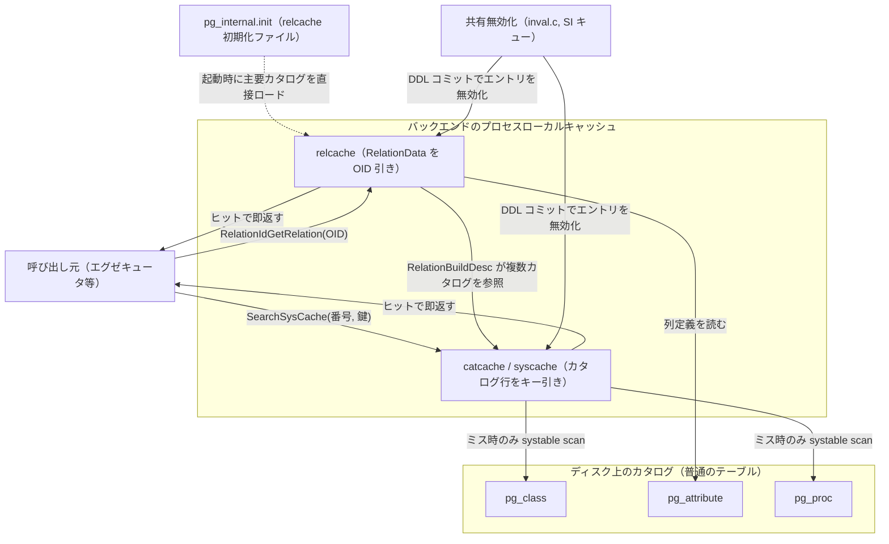

# 第42章 システムカタログとキャッシュ

> **本章で読むソース**
>
> - [`src/include/utils/rel.h`](https://github.com/postgres/postgres/blob/REL_18_4/src/include/utils/rel.h)
> - [`src/backend/utils/cache/relcache.c`](https://github.com/postgres/postgres/blob/REL_18_4/src/backend/utils/cache/relcache.c)
> - [`src/backend/utils/cache/catcache.c`](https://github.com/postgres/postgres/blob/REL_18_4/src/backend/utils/cache/catcache.c)
> - [`src/include/utils/catcache.h`](https://github.com/postgres/postgres/blob/REL_18_4/src/include/utils/catcache.h)
> - [`src/backend/utils/cache/syscache.c`](https://github.com/postgres/postgres/blob/REL_18_4/src/backend/utils/cache/syscache.c)
> - [`src/backend/utils/cache/inval.c`](https://github.com/postgres/postgres/blob/REL_18_4/src/backend/utils/cache/inval.c)

## この章の狙い

PostgreSQL は、テーブルの定義、列の型、関数のシグネチャ、インデックスの構成といった**スキーマ情報**を、専用のデータ構造ではなく普通のテーブルに格納している。
これらのテーブルを**システムカタログ**と呼ぶ。
`pg_class` がリレーションを、`pg_attribute` が列を、`pg_proc` が関数を、それぞれ1行1件で持つ。
カタログ自体が MVCC で管理されるタプルの集まりなので、DDL はカタログ行の挿入や更新として実装でき、トランザクションのロールバックがそのままスキーマ変更の取り消しになる。

しかしこの一様さには代償がある。
たとえば `SELECT * FROM t` を1回実行するだけでも、エグゼキュータは `t` の `pg_class` 行、各列の `pg_attribute` 行、使う関数や演算子の `pg_proc` 行を引く必要がある。
これらを毎回インデックススキャンで取りにいけば、問い合わせ本体より定義の参照のほうが重くなりかねない。

本章は、この参照を高速化する2段のプロセスローカルキャッシュを読む。
カタログ行をキー引きでキャッシュする**catcache**（その上位インタフェースが**syscache**）と、1つのリレーションのオープンに必要な情報を1つの構造体にまとめてキャッシュする**relcache**である。
最後に、別のバックエンドが DDL でカタログを書き換えたとき、各プロセスのローカルキャッシュをどう無効化するか（`inval.c`）を読み、キャッシュ無効化という機構の側からこの設計を見る。

## 前提

第25章で、リレーションをオープンすると `Relation` 構造体が得られ、その `rd_tableam` がテーブルアクセスメソッドの関数ポインタ表を指す、という事実を使った。
本章はその `Relation`（実体は `RelationData`）が何を抱え、どこで構築され、いつ捨てられるかを読む。
キャッシュエントリの寿命はメモリコンテキスト（第6章）に紐づくので、`CacheMemoryContext` という長寿命のコンテキストが登場する。

カタログがインデックススキャンや逐次スキャンで読まれる仕組みそのもの（`systable_beginscan` など）は、第26章のヒープアクセスと第30章のインデックスアクセスメソッドで読んだ範囲に立つ。
本章はそのスキャンを「キャッシュミスのときだけ走らせる」ための層を見る。

## システムカタログは普通のテーブルである

`pg_class` も `pg_attribute` も、ユーザーが作るテーブルと同じヒープであり、同じページレイアウトを持ち、同じ可視性判定で読まれる。
違うのは、起動時に必ず存在することと、専用の OID とインデックスを持つことだけである。
このため、あるカタログ行をキー引きするコードは、結局「どのカタログのどのインデックスを、どのキーで引くか」を指定して `systable_beginscan` を呼ぶだけで書ける。
catcache の定義表も、その3点（カタログ OID、インデックス OID、キー列番号）を並べたものになっている。

たとえば `pg_class` には OID 引きと「名前空間つき名前」引きの2つのキャッシュが、`pg_attribute` には「リレーション OID と列番号」引きと「リレーション OID と列名」引きの2つが宣言されている。

[`src/include/catalog/pg_class.h` L162-L163](https://github.com/postgres/postgres/blob/REL_18_4/src/include/catalog/pg_class.h#L162-L163)

```c
MAKE_SYSCACHE(RELOID, pg_class_oid_index, 128);
MAKE_SYSCACHE(RELNAMENSP, pg_class_relname_nsp_index, 128);
```

[`src/include/catalog/pg_attribute.h` L221-L222](https://github.com/postgres/postgres/blob/REL_18_4/src/include/catalog/pg_attribute.h#L221-L222)

```c
MAKE_SYSCACHE(ATTNAME, pg_attribute_relid_attnam_index, 32);
MAKE_SYSCACHE(ATTNUM, pg_attribute_relid_attnum_index, 128);
```

`MAKE_SYSCACHE` は、キャッシュ識別子と裏付けるインデックス、ハッシュバケット数を1行で宣言するマクロである。
これらの宣言はビルド時に集約され、`syscache.c` が読み込む `cacheinfo` 配列になる。
配列の各要素は次の構造体で、カタログ OID、インデックス OID、キー数、キー列番号、バケット数を持つ。

[`src/backend/utils/cache/syscache.c` L69-L76](https://github.com/postgres/postgres/blob/REL_18_4/src/backend/utils/cache/syscache.c#L69-L76)

```c
struct cachedesc
{
	Oid			reloid;			/* OID of the relation being cached */
	Oid			indoid;			/* OID of index relation for this cache */
	int			nkeys;			/* # of keys needed for cache lookup */
	int			key[4];			/* attribute numbers of key attrs */
	int			nbuckets;		/* number of hash buckets for this cache */
};
```

つまり syscache とは、カタログごとに「このインデックスをこのキーで引く」という手順を表で持ち、その結果をプロセスローカルにメモした層である。

## catcache：カタログ行をキー引きでキャッシュする

`InitCatalogCache` は起動時に `cacheinfo` 配列を1周し、各エントリについて `InitCatCache` を呼んでキャッシュ構造体を1つずつ作る。
ここではメモリの確保とハッシュ表の初期化だけを行い、データベースへのアクセスはしない。

[`src/backend/utils/cache/syscache.c` L118-L136](https://github.com/postgres/postgres/blob/REL_18_4/src/backend/utils/cache/syscache.c#L118-L136)

```c
	for (cacheId = 0; cacheId < SysCacheSize; cacheId++)
	{
		/*
		 * Assert that every enumeration value defined in syscache.h has been
		 * populated in the cacheinfo array.
		 */
		Assert(OidIsValid(cacheinfo[cacheId].reloid));
		Assert(OidIsValid(cacheinfo[cacheId].indoid));
		/* .nbuckets and .key[] are checked by InitCatCache() */

		SysCache[cacheId] = InitCatCache(cacheId,
										 cacheinfo[cacheId].reloid,
										 cacheinfo[cacheId].indoid,
										 cacheinfo[cacheId].nkeys,
										 cacheinfo[cacheId].key,
										 cacheinfo[cacheId].nbuckets);
		if (!PointerIsValid(SysCache[cacheId]))
			elog(ERROR, "could not initialize cache %u (%d)",
				 cacheinfo[cacheId].reloid, cacheId);
```

各キャッシュは `CatCache` 構造体で表される。
ハッシュバケットの配列、キーごとのハッシュ関数と等値判定関数、キー列番号、そしてヒープスキャン用に前計算したスキャンキーを持つ。

[`src/include/utils/catcache.h` L44-L65](https://github.com/postgres/postgres/blob/REL_18_4/src/include/utils/catcache.h#L44-L65)

```c
typedef struct catcache
{
	int			id;				/* cache identifier --- see syscache.h */
	int			cc_nbuckets;	/* # of hash buckets in this cache */
	TupleDesc	cc_tupdesc;		/* tuple descriptor (copied from reldesc) */
	dlist_head *cc_bucket;		/* hash buckets */
	CCHashFN	cc_hashfunc[CATCACHE_MAXKEYS];	/* hash function for each key */
	CCFastEqualFN cc_fastequal[CATCACHE_MAXKEYS];	/* fast equal function for
													 * each key */
	int			cc_keyno[CATCACHE_MAXKEYS]; /* AttrNumber of each key */
	int			cc_nkeys;		/* # of keys (1..CATCACHE_MAXKEYS) */
	int			cc_ntup;		/* # of tuples currently in this cache */
	int			cc_nlist;		/* # of CatCLists currently in this cache */
	int			cc_nlbuckets;	/* # of CatCList hash buckets in this cache */
	dlist_head *cc_lbucket;		/* hash buckets for CatCLists */
	const char *cc_relname;		/* name of relation the tuples come from */
	Oid			cc_reloid;		/* OID of relation the tuples come from */
	Oid			cc_indexoid;	/* OID of index matching cache keys */
	bool		cc_relisshared; /* is relation shared across databases? */
	slist_node	cc_next;		/* list link */
	ScanKeyData cc_skey[CATCACHE_MAXKEYS];	/* precomputed key info for heap
											 * scans */
```

キャッシュに入る1件は `CatCTup` である。
キーのハッシュ値、キー値の配列、所属バケットの双方向リストのリンク、参照カウント、そして本体のタプルを持つ。
この構造体には注目すべき2つの仕掛けがある。

[`src/include/utils/catcache.h` L88-L136](https://github.com/postgres/postgres/blob/REL_18_4/src/include/utils/catcache.h#L88-L136)

```c
typedef struct catctup
{
	int			ct_magic;		/* for identifying CatCTup entries */
#define CT_MAGIC   0x57261502

	uint32		hash_value;		/* hash value for this tuple's keys */

	/*
	 * Lookup keys for the entry. By-reference datums point into the tuple for
	 * positive cache entries, and are separately allocated for negative ones.
	 */
	Datum		keys[CATCACHE_MAXKEYS];

	/*
	 * Each tuple in a cache is a member of a dlist that stores the elements
	 * of its hash bucket.  We keep each dlist in LRU order to speed repeated
	 * lookups.
	 */
	dlist_node	cache_elem;		/* list member of per-bucket list */

	/*
	 * A tuple marked "dead" must not be returned by subsequent searches.
	 * However, it won't be physically deleted from the cache until its
	 * refcount goes to zero.  (If it's a member of a CatCList, the list's
	 * refcount must go to zero, too; also, remember to mark the list dead at
	 * the same time the tuple is marked.)
	 *
	 * A negative cache entry is an assertion that there is no tuple matching
	 * a particular key.  This is just as useful as a normal entry so far as
	 * avoiding catalog searches is concerned.  Management of positive and
	 * negative entries is identical.
	 */
	int			refcount;		/* number of active references */
	bool		dead;			/* dead but not yet removed? */
	bool		negative;		/* negative cache entry? */
	HeapTupleData tuple;		/* tuple management header */

	/*
	 * The tuple may also be a member of at most one CatCList.  (If a single
	 * catcache is list-searched with varying numbers of keys, we may have to
	 * make multiple entries for the same tuple because of this restriction.
	 * Currently, that's not expected to be common, so we accept the potential
	 * inefficiency.)
	 */
	struct catclist *c_list;	/* containing CatCList, or NULL if none */

	CatCache   *my_cache;		/* link to owning catcache */
	/* properly aligned tuple data follows, unless a negative entry */
} CatCTup;
```

1つは `dead` と `refcount` の組である。
無効化されたタプルはただちに `dead` を立てるが、参照中（`refcount` が正）のあいだは物理的に消さない。
これにより、検索結果を握っている呼び出し元の足元でメモリが消える事故を防ぎつつ、その結果を以後の検索からは外せる。

もう1つは `negative` フラグが表す**負キャッシュ**である。
「このキーに一致する行は存在しない」という事実も、存在する行と同じくカタログスキャンの省略に使える。
本体だけ NULL の偽タプルにキーを載せてキャッシュしておけば、存在しない名前の解決を繰り返しても、毎回スキャンせずに即座に「なし」を返せる。

### 検索：バケット走査と LRU 並べ替え

検索の中心は `SearchCatCacheInternal` である。
キーからハッシュ値を計算し、バケットを1つ選び、その双方向リストを走査する。
死んでいるエントリやハッシュ値が違うエントリを飛ばし、キーが一致した1件で止まる。

[`src/backend/utils/cache/catcache.c` L1445-L1499](https://github.com/postgres/postgres/blob/REL_18_4/src/backend/utils/cache/catcache.c#L1445-L1499)

```c
	bucket = &cache->cc_bucket[hashIndex];
	dlist_foreach(iter, bucket)
	{
		ct = dlist_container(CatCTup, cache_elem, iter.cur);

		if (ct->dead)
			continue;			/* ignore dead entries */

		if (ct->hash_value != hashValue)
			continue;			/* quickly skip entry if wrong hash val */

		if (!CatalogCacheCompareTuple(cache, nkeys, ct->keys, arguments))
			continue;

		/*
		 * We found a match in the cache.  Move it to the front of the list
		 * for its hashbucket, in order to speed subsequent searches.  (The
		 * most frequently accessed elements in any hashbucket will tend to be
		 * near the front of the hashbucket's list.)
		 */
		dlist_move_head(bucket, &ct->cache_elem);

		/*
		 * If it's a positive entry, bump its refcount and return it. If it's
		 * negative, we can report failure to the caller.
		 */
		if (!ct->negative)
		{
			ResourceOwnerEnlarge(CurrentResourceOwner);
			ct->refcount++;
			ResourceOwnerRememberCatCacheRef(CurrentResourceOwner, &ct->tuple);

			CACHE_elog(DEBUG2, "SearchCatCache(%s): found in bucket %d",
					   cache->cc_relname, hashIndex);

#ifdef CATCACHE_STATS
			cache->cc_hits++;
#endif

			return &ct->tuple;
		}
		else
		{
			CACHE_elog(DEBUG2, "SearchCatCache(%s): found neg entry in bucket %d",
					   cache->cc_relname, hashIndex);

#ifdef CATCACHE_STATS
			cache->cc_neg_hits++;
#endif

			return NULL;
		}
	}

	return SearchCatCacheMiss(cache, nkeys, hashValue, hashIndex, v1, v2, v3, v4);
```

一致したエントリは `dlist_move_head` でバケットリストの先頭へ移される。
よく引かれる行ほどリストの前方に集まるので、同じ行の再検索は走査を短く済ませられる。
ハッシュで衝突した同一バケット内に複数のエントリが並んでいても、頻出のものが先に当たる。
当たったのが正エントリなら参照カウントを上げてタプルを返し、負エントリなら NULL を返してカタログを引かずに「なし」を伝える。

### キャッシュミス：カタログを引いて入れる

バケットに無ければ `SearchCatCacheMiss` がカタログ本体を引く。
キャッシュ定義に書かれたインデックスを使い、`table_open` から `systable_beginscan` でキーに一致する行を探す。
見つかれば `CatalogCacheCreateEntry` で `CatCTup` を作ってバケットに入れ、見つからなければ偽タプルで負エントリを作る。

[`src/backend/utils/cache/catcache.c` L1600-L1632](https://github.com/postgres/postgres/blob/REL_18_4/src/backend/utils/cache/catcache.c#L1600-L1632)

```c
	/*
	 * If tuple was not found, we need to build a negative cache entry
	 * containing a fake tuple.  The fake tuple has the correct key columns,
	 * but nulls everywhere else.
	 *
	 * In bootstrap mode, we don't build negative entries, because the cache
	 * invalidation mechanism isn't alive and can't clear them if the tuple
	 * gets created later.  (Bootstrap doesn't do UPDATEs, so it doesn't need
	 * cache inval for that.)
	 */
	if (ct == NULL)
	{
		if (IsBootstrapProcessingMode())
			return NULL;

		ct = CatalogCacheCreateEntry(cache, NULL, arguments,
									 hashValue, hashIndex);

		/* Creating a negative cache entry shouldn't fail */
		Assert(ct != NULL);

		CACHE_elog(DEBUG2, "SearchCatCache(%s): Contains %d/%d tuples",
				   cache->cc_relname, cache->cc_ntup, CacheHdr->ch_ntup);
		CACHE_elog(DEBUG2, "SearchCatCache(%s): put neg entry in bucket %d",
				   cache->cc_relname, hashIndex);

		/*
		 * We are not returning the negative entry to the caller, so leave its
		 * refcount zero.
		 */

		return NULL;
	}
```

ミス処理が `SearchCatCacheInternal` から別関数に切り出され、しかもインライン展開を禁じてあるのは、当たり経路（ヒット）の命令列をできるだけ小さく保つためである。
ヒットが大多数を占めるという前提に立った配置で、関数冒頭のコメントもその意図を述べている。

### syscache：番号で catcache を呼ぶ薄い層

呼び出し側が触るのは syscache の関数である。
`SearchSysCache` はキャッシュ識別子（番号）を受け取り、対応する `CatCache` を `SysCache` 配列から引いて `SearchCatCache` に委ねるだけの薄いラッパーである。

[`src/backend/utils/cache/syscache.c` L207-L218](https://github.com/postgres/postgres/blob/REL_18_4/src/backend/utils/cache/syscache.c#L207-L218)

```c
HeapTuple
SearchSysCache(int cacheId,
			   Datum key1,
			   Datum key2,
			   Datum key3,
			   Datum key4)
{
	Assert(cacheId >= 0 && cacheId < SysCacheSize &&
		   PointerIsValid(SysCache[cacheId]));

	return SearchCatCache(SysCache[cacheId], key1, key2, key3, key4);
}
```

呼び出し元は `SearchSysCache1(RELOID, ...)` のように番号と鍵を渡すだけでよく、どのインデックスをどう引くかという手順は `cacheinfo` 表の側に閉じている。
返ったタプルは参照カウント付きの「キャッシュの写し」であり、書き換えてはならず、使い終えたら `ReleaseSysCache` で参照を返す。

## relcache：リレーションのオープン情報をまとめてキャッシュする

catcache はカタログの1行をキャッシュするが、リレーションを1つ開いて使うには複数のカタログ行を組み合わせた情報が要る。
`pg_class` の1行、各列の `pg_attribute` 行から組み立てたタプル記述子、テーブルアクセスメソッドの表、インデックスなら演算子族やサポート関数といった具合である。
relcache はこれらをまとめた `RelationData` を1リレーションにつき1つ作り、OID 引きのハッシュ表に入れる。

`RelationData` の先頭は次のようになっている。

[`src/include/utils/rel.h` L55-L66](https://github.com/postgres/postgres/blob/REL_18_4/src/include/utils/rel.h#L55-L66)

```c
typedef struct RelationData
{
	RelFileLocator rd_locator;	/* relation physical identifier */
	SMgrRelation rd_smgr;		/* cached file handle, or NULL */
	int			rd_refcnt;		/* reference count */
	ProcNumber	rd_backend;		/* owning backend's proc number, if temp rel */
	bool		rd_islocaltemp; /* rel is a temp rel of this session */
	bool		rd_isnailed;	/* rel is nailed in cache */
	bool		rd_isvalid;		/* relcache entry is valid */
	bool		rd_indexvalid;	/* is rd_indexlist valid? (also rd_pkindex and
								 * rd_replidindex) */
	bool		rd_statvalid;	/* is rd_statlist valid? */
```

ここから先には、`pg_class` の写し `rd_rel`、タプル記述子 `rd_att`、リレーション OID `rd_id`、書き換えルール、トリガー、行レベルセキュリティ、インデックス一覧、テーブルアクセスメソッドの表 `rd_tableam`、インデックス用の演算子族やサポート関数の配列などが続く。
1度組み立ててしまえば、以後そのリレーションを開くたびにこの構造体を再利用でき、複数のカタログを引き直す必要がない。
`rd_isvalid` はこの組み立て済み情報がまだ有効かを表し、`rd_refcnt` は誰かがこのエントリを使用中かを数える。

### `RelationIdGetRelation`：まずキャッシュを引く

リレーションを OID で開く入口が `RelationIdGetRelation` である。
最初に OID 引きのハッシュ表 `RelationIdCache` を引き、当たればそれを返す。
無ければ `RelationBuildDesc` に組み立てさせて表に入れる。

[`src/backend/utils/cache/relcache.c` L2098-L2146](https://github.com/postgres/postgres/blob/REL_18_4/src/backend/utils/cache/relcache.c#L2098-L2146)

```c
Relation
RelationIdGetRelation(Oid relationId)
{
	Relation	rd;

	AssertCouldGetRelation();

	/*
	 * first try to find reldesc in the cache
	 */
	RelationIdCacheLookup(relationId, rd);

	if (RelationIsValid(rd))
	{
		/* return NULL for dropped relations */
		if (rd->rd_droppedSubid != InvalidSubTransactionId)
		{
			Assert(!rd->rd_isvalid);
			return NULL;
		}

		RelationIncrementReferenceCount(rd);
		/* revalidate cache entry if necessary */
		if (!rd->rd_isvalid)
		{
			RelationRebuildRelation(rd);

			/*
			 * Normally entries need to be valid here, but before the relcache
			 * has been initialized, not enough infrastructure exists to
			 * perform pg_class lookups. The structure of such entries doesn't
			 * change, but we still want to update the rd_rel entry. So
			 * rd_isvalid = false is left in place for a later lookup.
			 */
			Assert(rd->rd_isvalid ||
				   (rd->rd_isnailed && !criticalRelcachesBuilt));
		}
		return rd;
	}

	/*
	 * no reldesc in the cache, so have RelationBuildDesc() build one and add
	 * it.
	 */
	rd = RelationBuildDesc(relationId, true);
	if (RelationIsValid(rd))
		RelationIncrementReferenceCount(rd);
	return rd;
}
```

ヒット時には参照カウントを上げてそのまま返すが、エントリが無効化されていれば（`rd_isvalid` が偽なら）`RelationRebuildRelation` で再構築してから返す。
ハッシュ表の出し入れは `RelationIdCacheLookup` と `RelationCacheInsert` というマクロにまとめられている。

[`src/backend/utils/cache/relcache.c` L231-L241](https://github.com/postgres/postgres/blob/REL_18_4/src/backend/utils/cache/relcache.c#L231-L241)

```c
#define RelationIdCacheLookup(ID, RELATION) \
do { \
	RelIdCacheEnt *hentry; \
	hentry = (RelIdCacheEnt *) hash_search(RelationIdCache, \
										   &(ID), \
										   HASH_FIND, NULL); \
	if (hentry) \
		RELATION = hentry->reldesc; \
	else \
		RELATION = NULL; \
} while(0)
```

### `RelationBuildDesc`：複数のカタログから1つにまとめる

キャッシュミスのときに `RelationData` を組み立てるのが `RelationBuildDesc` である。
この関数が、本章の主題である「カタログテーブルから relcache を作る」流れの本体にあたる。

[`src/backend/utils/cache/relcache.c` L1058-L1065](https://github.com/postgres/postgres/blob/REL_18_4/src/backend/utils/cache/relcache.c#L1058-L1065)

```c
static Relation
RelationBuildDesc(Oid targetRelId, bool insertIt)
{
	int			in_progress_offset;
	Relation	relation;
	Oid			relid;
	HeapTuple	pg_class_tuple;
	Form_pg_class relp;
```

まず `ScanPgRelation` で対象 OID の `pg_class` 行を取り、`AllocateRelationDesc` で `RelationData` を確保して `rd_rel` にその写しを置く。
続いて `RelationBuildTupleDesc` が `pg_attribute` を引いて列の定義からタプル記述子 `rd_att` を組む。
そのうえでリレーションの種別に応じてアクセスメソッド情報を初期化する。
インデックスなら `RelationInitIndexAccessInfo`、テーブル系なら `RelationInitTableAccessMethod` が呼ばれ、後者が `rd_tableam` を埋める。

[`src/backend/utils/cache/relcache.c` L1222-L1230](https://github.com/postgres/postgres/blob/REL_18_4/src/backend/utils/cache/relcache.c#L1222-L1230)

```c
	/*
	 * initialize access method information
	 */
	if (relation->rd_rel->relkind == RELKIND_INDEX ||
		relation->rd_rel->relkind == RELKIND_PARTITIONED_INDEX)
		RelationInitIndexAccessInfo(relation);
	else if (RELKIND_HAS_TABLE_AM(relation->rd_rel->relkind) ||
			 relation->rd_rel->relkind == RELKIND_SEQUENCE)
		RelationInitTableAccessMethod(relation);
```

このあと書き換えルール、トリガー、行レベルセキュリティ、ロック情報、物理アドレスを順に初期化する。
組み立て中に対象リレーションの無効化メッセージが届いていたら、できかけの `RelationData` を捨てて先頭からやり直す。

[`src/backend/utils/cache/relcache.c` L1313-L1317](https://github.com/postgres/postgres/blob/REL_18_4/src/backend/utils/cache/relcache.c#L1313-L1317)

```c
	if (insertIt)
		RelationCacheInsert(relation, true);

	/* It's fully valid */
	relation->rd_isvalid = true;
```

最後に `insertIt` が真ならハッシュ表へ入れ、`rd_isvalid` を立てて完成とする。
この組み立て中に PostgreSQL は `pg_class`、`pg_attribute`、`pg_am` といった複数のカタログを引くが、それらの参照自体も catcache を経由するので、温まったプロセスではカタログ本体へのスキャンはほとんど発生しない。

## キャッシュの無効化：DDL を他プロセスへ伝える

catcache も relcache もプロセスローカルである。
あるバックエンドが `ALTER TABLE` で列を足せば、自分の relcache は組み立て直せるが、同じテーブルを開いている別のバックエンドのキャッシュは古いままになる。
この食い違いを正すのが共有無効化（shared invalidation、`inval.c`）である。

無効化の起点は、カタログ行を書き換えるコードが呼ぶ `CacheInvalidateHeapTuple` である。
更新や削除の対象タプルを「コマンド境界で無効化すべきもの」として記録し、`pg_class` や `pg_attribute`、`pg_index` の行に対する操作なら、そのリレーションの relcache フラッシュも併せて登録する。

[`src/backend/utils/cache/inval.c` L1570-L1577](https://github.com/postgres/postgres/blob/REL_18_4/src/backend/utils/cache/inval.c#L1570-L1577)

```c
void
CacheInvalidateHeapTuple(Relation relation,
						 HeapTuple tuple,
						 HeapTuple newtuple)
{
	CacheInvalidateHeapTupleCommon(relation, tuple, newtuple,
								   PrepareInvalidationState);
}
```

ここで即座にキャッシュを消さないのは、MVCC の可視性規則のためである。
更新や削除をしても、同じコマンドのあいだは古いタプルがまだ有効と見なされる。
そこで無効化メッセージはいったん溜め、コマンド境界とトランザクションコミットで処理する。
コミット時には、溜めたメッセージを共有メモリの無効化キュー（SI キュー）へ流し、他のバックエンドに古いエントリの破棄を促す。

各バックエンドはキューから受け取ったメッセージを `LocalExecuteInvalidationMessage` で1件ずつ適用する。
メッセージの種別ごとに、catcache の該当エントリ、relcache の該当リレーション、スナップショットなどを無効化する。

[`src/backend/utils/cache/inval.c` L823-L865](https://github.com/postgres/postgres/blob/REL_18_4/src/backend/utils/cache/inval.c#L823-L865)

```c
LocalExecuteInvalidationMessage(SharedInvalidationMessage *msg)
{
	if (msg->id >= 0)
	{
		if (msg->cc.dbId == MyDatabaseId || msg->cc.dbId == InvalidOid)
		{
			InvalidateCatalogSnapshot();

			SysCacheInvalidate(msg->cc.id, msg->cc.hashValue);

			CallSyscacheCallbacks(msg->cc.id, msg->cc.hashValue);
		}
	}
	else if (msg->id == SHAREDINVALCATALOG_ID)
	{
		if (msg->cat.dbId == MyDatabaseId || msg->cat.dbId == InvalidOid)
		{
			InvalidateCatalogSnapshot();

			CatalogCacheFlushCatalog(msg->cat.catId);

			/* CatalogCacheFlushCatalog calls CallSyscacheCallbacks as needed */
		}
	}
	else if (msg->id == SHAREDINVALRELCACHE_ID)
	{
		if (msg->rc.dbId == MyDatabaseId || msg->rc.dbId == InvalidOid)
		{
			int			i;

			if (msg->rc.relId == InvalidOid)
				RelationCacheInvalidate(false);
			else
				RelationCacheInvalidateEntry(msg->rc.relId);

			for (i = 0; i < relcache_callback_count; i++)
			{
				struct RELCACHECALLBACK *ccitem = relcache_callback_list + i;

				ccitem->function(ccitem->arg, msg->rc.relId);
			}
		}
	}
```

正のメッセージ番号は catcache 用で、対象キャッシュのハッシュ値が一致するエントリを無効化する。
`SHAREDINVALRELCACHE_ID` は relcache 用で、特定リレーションのエントリ、または OID が無効なら relcache 全体を無効化する。
relcache のエントリは、参照カウントが正のあいだは破棄せず `rd_isvalid` を倒すだけにしておき、次に `RelationIdGetRelation` で引かれたときに `RelationRebuildRelation` で組み立て直す。
この遅延再構築により、別プロセスの DDL によってキャッシュの古さが波及しても、各バックエンドは次の参照時に最新のカタログから情報を作り直せる。

## 高速化の工夫：起動コストを消す relcache 初期化ファイル

ここまでの2段キャッシュは、プロセスが温まった後の参照を速くする。
しかし新しいバックエンドが起動するたびに、`pg_class` や `pg_attribute` を引いて主要カタログの relcache をゼロから組むのは無視できないコストになる。
これを避けるのが**relcache 初期化ファイル**である。

`RelationData` の組み立てに必要なカタログ行を読むには、そのカタログ自身の relcache が要る。
たとえば `pg_class` を OID 引きするには `pg_class` の relcache とそのインデックスの relcache が必要であり、純粋な手順では循環する。
PostgreSQL はこの循環を断つために、起動時に最低限必要なエントリを**ピン留め**（nailed）して特別扱いし、さらに主要カタログのできあがった relcache エントリを `pg_internal.init` というファイルに直列化しておく。

新しいバックエンドは、まずこのファイルを読み込もうとする。

[`src/backend/utils/cache/relcache.c` L6167-L6189](https://github.com/postgres/postgres/blob/REL_18_4/src/backend/utils/cache/relcache.c#L6167-L6189)

```c
load_relcache_init_file(bool shared)
{
	FILE	   *fp;
	char		initfilename[MAXPGPATH];
	Relation   *rels;
	int			relno,
				num_rels,
				max_rels,
				nailed_rels,
				nailed_indexes,
				magic;
	int			i;

	if (shared)
		snprintf(initfilename, sizeof(initfilename), "global/%s",
				 RELCACHE_INIT_FILENAME);
	else
		snprintf(initfilename, sizeof(initfilename), "%s/%s",
				 DatabasePath, RELCACHE_INIT_FILENAME);

	fp = AllocateFile(initfilename, PG_BINARY_R);
	if (fp == NULL)
		return false;
```

ファイルがあれば、そこから主要カタログの `RelationData` を直接読み込んで relcache に並べ、`pg_attribute` を引き直す手間を省く。
無ければ通常どおり組み立てたうえで `write_relcache_init_file` がファイルを書き、次回以降のバックエンドが使えるようにする。
カタログを変える DDL があればこのファイルは破棄され、次の起動で作り直される。

この工夫が機構として速いのは、起動時に最も確実に必要な少数のカタログについて、「複数カタログを引いて構造体を組む」という再現可能だが高くつく計算を、ディスク上の直列化結果の読み込み1回に置き換えているからである。
温まった後の参照を速くする catcache や relcache のヒットとは別に、プロセスの立ち上がり自体を速くする層がここに置かれている。

## キャッシュ階層のまとめ図

カタログテーブルから2段のキャッシュを経て、リレーションのオープン情報に至る経路を図にすると次のようになる。



## まとめ

システムカタログは専用構造ではなく普通のテーブルであり、スキーマ情報も MVCC で管理されるタプルとして読み書きされる。
この一様さが生むカタログ参照のコストを、PostgreSQL はプロセスローカルな2段のキャッシュで吸収する。
catcache はカタログの1行をキー引きでメモし、負キャッシュによって「存在しない」という結果まで再利用する。
syscache はその catcache を番号で呼ぶ薄いラッパーで、どのインデックスをどう引くかという手順を表の側に閉じ込める。
relcache はリレーションを開くのに必要な複数カタログの情報を `RelationData` に1つにまとめ、`RelationBuildDesc` が組み立てたものを OID 引きでキャッシュする。

これらはプロセスローカルなので、DDL による変更は共有無効化メッセージで全バックエンドへ配り、各プロセスが該当エントリを無効化して次の参照で作り直す。
さらに relcache 初期化ファイルは、主要カタログの組み立て結果を直列化しておくことで、新しいバックエンドの立ち上がりからカタログスキャンを取り除く。
温まった後の参照を速くするキャッシュヒットと、立ち上がり自体を速くする初期化ファイルが、別々の層として組み合わさっている。

## 関連する章

- [第6章 メモリコンテキストと palloc](../part01-process-memory/06-memory-contexts.md)：キャッシュエントリの寿命を支える `CacheMemoryContext`。
- [第25章 テーブルアクセスメソッド](../part06-table-mvcc/25-table-access-method.md)：relcache の `rd_tableam` が指す関数ポインタ表。
- [第30章 インデックスアクセスメソッド](../part07-indexes/30-index-access-method.md)：relcache がインデックス用に持つ演算子族やサポート関数。
