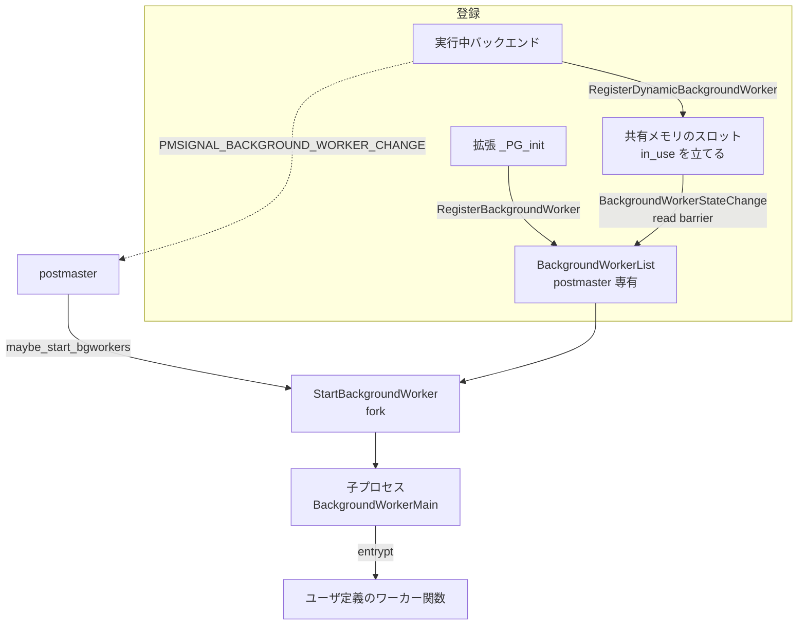
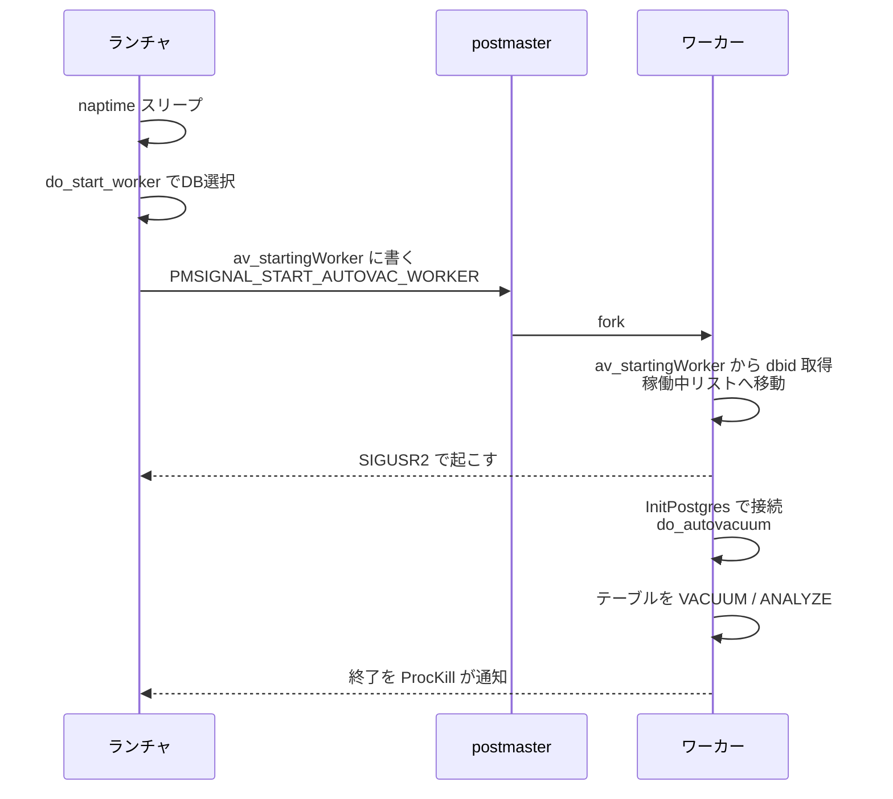

# 第43章 バックグラウンドワーカーと autovacuum

> **本章で読むソース**
>
> - [`src/backend/postmaster/bgworker.c`](https://github.com/postgres/postgres/blob/REL_18_4/src/backend/postmaster/bgworker.c)
> - [`src/backend/postmaster/postmaster.c`](https://github.com/postgres/postgres/blob/REL_18_4/src/backend/postmaster/postmaster.c)
> - [`src/backend/postmaster/autovacuum.c`](https://github.com/postgres/postgres/blob/REL_18_4/src/backend/postmaster/autovacuum.c)

## この章の狙い

第4章で、`postmaster` を起動から停止までを貫く1つの状態機械として読んだ。
接続ごとのバックエンドや、チェックポインタなどの常駐補助プロセスは、すべて `postmaster` の子として生まれた。
本章は、この枠組みに外から追加できる**バックグラウンドワーカー**と、その代表例である autovacuum を読む。

バックグラウンドワーカーは、拡張やコアのコードが「こういうプロセスを動かしたい」と登録すると、`postmaster` がそれを子として起動してくれる仕組みである。
拡張は `postmaster` のメインループを書き換えることなく、常駐プロセスを1つ増やせる。
autovacuum は、この仕組みとは別系統の専用プロセスでありながら、設計の発想を共有している。
ランチャという1つのプロセスが対象データベースを選び、ワーカーを次々と起動し、ワーカーが肥大したテーブルを VACUUM または ANALYZE する。

本章では、まずバックグラウンドワーカーの登録と起動を読み、`postmaster` がロックを取れないという制約のもとで状態をどう受け渡すかを確かめる。
次に autovacuum のランチャとワーカーの関係を読み、起動の判断がどのしきい値で下されるかをたどる。

## 前提

第4章で、`postmaster` が `fork()` で子プロセスを生み、`pmState` という状態変数で全体を制御すると読んだ。
本章の `StartBackgroundWorker` や `maybe_start_bgworkers` は、その `postmaster` のメインループ（`ServerLoop`）から呼ばれる関数である。

第28章で、追記型のストレージではデッドタプルが増えてテーブルが肥大し、VACUUM がそれを回収すると読んだ。
autovacuum は、その VACUUM を人手を介さず自動で起動する層であり、VACUUM 本体の処理は前章に譲る。
本章が扱うのは「いつ、どのテーブルに VACUUM をかけるか」という判断と、それを担うプロセスの構造である。

## バックグラウンドワーカーの登録

バックグラウンドワーカーには2つの登録経路がある。
1つは `shared_preload_libraries` で読み込まれた拡張が起動時に登録する静的な経路で、`RegisterBackgroundWorker` が担う。
もう1つは、すでに動いているバックエンドが実行中に登録する動的な経路で、`RegisterDynamicBackgroundWorker` が担う。

静的な登録は `postmaster` プロセスの中だけで許される。

[`src/backend/postmaster/bgworker.c` L939-L969](https://github.com/postgres/postgres/blob/REL_18_4/src/backend/postmaster/bgworker.c#L939-L969)

```c
void
RegisterBackgroundWorker(BackgroundWorker *worker)
{
	RegisteredBgWorker *rw;
	static int	numworkers = 0;

	/*
	 * Static background workers can only be registered in the postmaster
	 * process.
	 */
	if (IsUnderPostmaster || !IsPostmasterEnvironment)
	{
		/*
		 * In EXEC_BACKEND or single-user mode, we process
		 * shared_preload_libraries in backend processes too.  We cannot
		 * register static background workers at that stage, but many
		 * libraries' _PG_init() functions don't distinguish whether they're
		 * being loaded in the postmaster or in a backend, they just check
		 * process_shared_preload_libraries_in_progress.  It's a bit sloppy,
		 * but for historical reasons we tolerate it.  In EXEC_BACKEND mode,
		 * the background workers should already have been registered when the
		 * library was loaded in postmaster.
		 */
		if (process_shared_preload_libraries_in_progress)
			return;
		ereport(LOG,
				(errcode(ERRCODE_FEATURE_NOT_SUPPORTED),
				 errmsg("background worker \"%s\": must be registered in \"shared_preload_libraries\"",
						worker->bgw_name)));
		return;
	}
```

登録の本体は、ワーカーの定義 `BackgroundWorker` をコピーして `BackgroundWorkerList` という二重リンクリストの先頭へ挿入するだけである。

[`src/backend/postmaster/bgworker.c` L1013-L1033](https://github.com/postgres/postgres/blob/REL_18_4/src/backend/postmaster/bgworker.c#L1013-L1033)

```c
	/*
	 * Copy the registration data into the registered workers list.
	 */
	rw = MemoryContextAllocExtended(PostmasterContext,
									sizeof(RegisteredBgWorker),
									MCXT_ALLOC_NO_OOM);
	if (rw == NULL)
	{
		ereport(LOG,
				(errcode(ERRCODE_OUT_OF_MEMORY),
				 errmsg("out of memory")));
		return;
	}

	rw->rw_worker = *worker;
	rw->rw_pid = 0;
	rw->rw_crashed_at = 0;
	rw->rw_terminate = false;

	dlist_push_head(&BackgroundWorkerList, &rw->rw_lnode);
}
```

この `BackgroundWorkerList` は `postmaster` のプライベートメモリにあり、ソースのコメントもそう明言している。

[`src/backend/postmaster/bgworker.c` L37-L40](https://github.com/postgres/postgres/blob/REL_18_4/src/backend/postmaster/bgworker.c#L37-L40)

```c
/*
 * The postmaster's list of registered background workers, in private memory.
 */
dlist_head	BackgroundWorkerList = DLIST_STATIC_INIT(BackgroundWorkerList);
```

リストが `postmaster` 専有なら、起動時に登録した静的ワーカーをそのまま起動できる。
問題は、後から実行中のバックエンドが動的に登録する場合である。
バックエンドは `postmaster` のプライベートメモリには触れないので、別の受け渡し場所が要る。

## ロックを使わない受け渡し

動的登録の受け渡しは共有メモリ上のスロット配列で行う。
スロットの設計には、`postmaster` がロックを取れないという制約が効いている。
コメントがその理由を述べている。

[`src/backend/postmaster/bgworker.c` L42-L63](https://github.com/postgres/postgres/blob/REL_18_4/src/backend/postmaster/bgworker.c#L42-L63)

```c
/*
 * BackgroundWorkerSlots exist in shared memory and can be accessed (via
 * the BackgroundWorkerArray) by both the postmaster and by regular backends.
 * However, the postmaster cannot take locks, even spinlocks, because this
 * might allow it to crash or become wedged if shared memory gets corrupted.
 * Such an outcome is intolerable.  Therefore, we need a lockless protocol
 * for coordinating access to this data.
 *
 * The 'in_use' flag is used to hand off responsibility for the slot between
 * the postmaster and the rest of the system.  When 'in_use' is false,
 * the postmaster will ignore the slot entirely, except for the 'in_use' flag
 * itself, which it may read.  In this state, regular backends may modify the
 * slot.  Once a backend sets 'in_use' to true, the slot becomes the
 * responsibility of the postmaster.  Regular backends may no longer modify it,
 * but the postmaster may examine it.  Thus, a backend initializing a slot
 * must fully initialize the slot - and insert a write memory barrier - before
 * marking it as in use.
 *
 * As an exception, however, even when the slot is in use, regular backends
 * may set the 'terminate' flag for a slot, telling the postmaster not
 * to restart it.  Once the background worker is no longer running, the slot
 * will be released for reuse.
```

`postmaster` がスピンロックすら取れないのは、共有メモリが壊れていた場合にロック獲得でハングまたはクラッシュすると、サーバ全体が巻き添えになるからである。
そこで、スロット1つの所有権を `in_use` フラグ1個で受け渡す。
`in_use` が偽のあいだはバックエンドがスロットを書き換えてよく、`postmaster` はフラグ以外を見ない。
バックエンドが中身を完全に書き込み、書き込みメモリバリアを挟んでから `in_use` を真にした瞬間、所有権は `postmaster` へ移る。

動的登録の側は、空きスロットを線形に探し、見つけたら中身を埋めて最後に `in_use` を立てる。

[`src/backend/postmaster/bgworker.c` L1099-L1125](https://github.com/postgres/postgres/blob/REL_18_4/src/backend/postmaster/bgworker.c#L1099-L1125)

```c
		if (!slot->in_use)
		{
			memcpy(&slot->worker, worker, sizeof(BackgroundWorker));
			slot->pid = InvalidPid; /* indicates not started yet */
			slot->generation++;
			slot->terminate = false;
			generation = slot->generation;
			if (parallel)
				BackgroundWorkerData->parallel_register_count++;

			/*
			 * Make sure postmaster doesn't see the slot as in use before it
			 * sees the new contents.
			 */
			pg_write_barrier();

			slot->in_use = true;
			success = true;
			break;
		}
	}

	LWLockRelease(BackgroundWorkerLock);

	/* If we found a slot, tell the postmaster to notice the change. */
	if (success)
		SendPostmasterSignal(PMSIGNAL_BACKGROUND_WORKER_CHANGE);
```

`pg_write_barrier` は、スロットの中身を書き込んだ後に `in_use = true` が見えることを保証する。
これがなければ、`postmaster` が `in_use` だけ先に観測して、まだ埋まっていないスロットを起動してしまう。
バックエンドどうしはこのスロット探索のあいだ `BackgroundWorkerLock` で排他する。
`postmaster` だけがこのロックの外にいて、フラグとバリアだけで協調する。

書き込みが終わると、バックエンドは `PMSIGNAL_BACKGROUND_WORKER_CHANGE` で `postmaster` を起こす。
`postmaster` はこのシグナルを受けて `BackgroundWorkerStateChange` を呼び、共有メモリのスロットを走査して、新しく `in_use` になったものを自分のプライベートリストへ取り込む。
取り込むときに `in_use` を読むより前に `pg_read_barrier` を置き、中身が見える前にフラグを見ないようにする。

[`src/backend/postmaster/bgworker.c` L275-L286](https://github.com/postgres/postgres/blob/REL_18_4/src/backend/postmaster/bgworker.c#L275-L286)

```c
		if (!slot->in_use)
			continue;

		/*
		 * Make sure we don't see the in_use flag before the updated slot
		 * contents.
		 */
		pg_read_barrier();

		/* See whether we already know about this worker. */
		rw = FindRegisteredWorkerBySlotNumber(slotno);
		if (rw != NULL)
```

書き込み側のバリアと読み込み側のバリアが対になり、ロックを使わずに「中身が先、フラグが後」という順序を両側で守る。
これが、`postmaster` をロックから切り離したまま安全な受け渡しを成り立たせる機構である。

## postmaster による起動

登録されたワーカーを実際に `fork()` するのは `postmaster` 側の `maybe_start_bgworkers` である。
`postmaster` のメインループは、起動が必要なワーカーがあるとこの関数を呼ぶ。
関数は `BackgroundWorkerList` をたどり、まだ動いていないワーカーのうち、いま起動してよいものを `StartBackgroundWorker` で起動する。

[`src/backend/postmaster/postmaster.c` L4235-L4250](https://github.com/postgres/postgres/blob/REL_18_4/src/backend/postmaster/postmaster.c#L4235-L4250)

```c
	dlist_foreach_modify(iter, &BackgroundWorkerList)
	{
		RegisteredBgWorker *rw;

		rw = dlist_container(RegisteredBgWorker, rw_lnode, iter.cur);

		/* ignore if already running */
		if (rw->rw_pid != 0)
			continue;

		/* if marked for death, clean up and remove from list */
		if (rw->rw_terminate)
		{
			ForgetBackgroundWorker(rw);
			continue;
		}
```

この関数には、1回の呼び出しで起動する数に上限を設ける工夫がある。

[`src/backend/postmaster/postmaster.c` L4212-L4216](https://github.com/postgres/postgres/blob/REL_18_4/src/backend/postmaster/postmaster.c#L4212-L4216)

```c
static void
maybe_start_bgworkers(void)
{
#define MAX_BGWORKERS_TO_LAUNCH 100
	int			num_launched = 0;
```

`MAX_BGWORKERS_TO_LAUNCH` 個まで起動したら、いったん関数を抜けて `StartWorkerNeeded` を立てる。
`postmaster` のメインループは、このフラグが立っているあいだはブロックせずに `maybe_start_bgworkers` を呼び直す。
多数のワーカーが一度に起動待ちになっても、`postmaster` がその処理に長く占有されず、接続受理などの他の仕事を挟めるようにするためである。

起動の可否は `bgworker_should_start_now` が `pmState` に応じて判断する。
ワーカーには起動タイミングの希望（`bgw_start_time`）があり、`postmaster` の起動直後に動いてよいもの、リカバリ完了後でないと動けないものなどがある。

[`src/backend/postmaster/postmaster.c` L4180-L4198](https://github.com/postgres/postgres/blob/REL_18_4/src/backend/postmaster/postmaster.c#L4180-L4198)

```c
		case PM_RUN:
			if (start_time == BgWorkerStart_RecoveryFinished)
				return true;
			/* fall through */

		case PM_HOT_STANDBY:
			if (start_time == BgWorkerStart_ConsistentState)
				return true;
			/* fall through */

		case PM_RECOVERY:
		case PM_STARTUP:
		case PM_INIT:
			if (start_time == BgWorkerStart_PostmasterStart)
				return true;
			/* fall through */
	}

	return false;
```

`fall through` で下の段へ流れる構造により、状態が進むほど起動を許すワーカーの種類が増える。
たとえば `PM_RUN` まで来れば、リカバリ完了後に動くもの、整合状態で動くもの、起動直後に動くもののすべてが許される。

`fork()` した子プロセスは `BackgroundWorkerMain` から走り始める。
子は登録時に指定された関数名 `bgw_function_name` をライブラリから引き、その関数を呼ぶ。

[`src/backend/postmaster/bgworker.c` L827-L846](https://github.com/postgres/postgres/blob/REL_18_4/src/backend/postmaster/bgworker.c#L827-L846)

```c
	/*
	 * Look up the entry point function, loading its library if necessary.
	 */
	entrypt = LookupBackgroundWorkerFunction(worker->bgw_library_name,
											 worker->bgw_function_name);

	/*
	 * Note that in normal processes, we would call InitPostgres here.  For a
	 * worker, however, we don't know what database to connect to, yet; so we
	 * need to wait until the user code does it via
	 * BackgroundWorkerInitializeConnection().
	 */

	/*
	 * Now invoke the user-defined worker code
	 */
	entrypt(worker->bgw_main_arg);

	/* ... and if it returns, we're done */
	proc_exit(0);
```

通常のバックエンドと違い、ワーカーはこの時点で接続先データベースを決めていない。
拡張のコードが必要に応じて `BackgroundWorkerInitializeConnection` で接続する。
ここまでが、登録から起動、ユーザコードの実行までの流れである。

下の図に、静的登録と動的登録の2経路と、`postmaster` による起動をまとめる。



## autovacuum のランチャとワーカー

autovacuum は、バックグラウンドワーカーの汎用機構とは別に、`postmaster` が直接起動する専用プロセスとして実装されている。
構成は2層である。
常駐する**ランチャ**（`AutoVacLauncherMain`）が1つあり、対象データベースを選んでは**ワーカー**（`AutoVacWorkerMain`）の起動を `postmaster` に依頼する。
ワーカーは選ばれたデータベースに接続し、肥大したテーブルを VACUUM または ANALYZE して終了する。

ランチャの主ループは、ナップタイム（`autovacuum_naptime`）だけスリープし、起きるたびに新しいワーカーを起動してよいかを確かめる。

[`src/backend/postmaster/autovacuum.c` L572-L599](https://github.com/postgres/postgres/blob/REL_18_4/src/backend/postmaster/autovacuum.c#L572-L599)

```c
	/* loop until shutdown request */
	while (!ShutdownRequestPending)
	{
		struct timeval nap;
		TimestampTz current_time = 0;
		bool		can_launch;

		/*
		 * This loop is a bit different from the normal use of WaitLatch,
		 * because we'd like to sleep before the first launch of a child
		 * process.  So it's WaitLatch, then ResetLatch, then check for
		 * wakening conditions.
		 */

		launcher_determine_sleep(av_worker_available(), false, &nap);

		/*
		 * Wait until naptime expires or we get some type of signal (all the
		 * signal handlers will wake us by calling SetLatch).
		 */
		(void) WaitLatch(MyLatch,
						 WL_LATCH_SET | WL_TIMEOUT | WL_EXIT_ON_PM_DEATH,
						 (nap.tv_sec * 1000L) + (nap.tv_usec / 1000L),
						 WAIT_EVENT_AUTOVACUUM_MAIN);

		ResetLatch(MyLatch);

		ProcessAutoVacLauncherInterrupts();
```

ランチャはワーカーを直接 `fork()` しない。
対象データベースを共有メモリの `av_startingWorker` に書き、`postmaster` へシグナルを送って起動を頼む。

[`src/backend/postmaster/autovacuum.c` L1260-L1273](https://github.com/postgres/postgres/blob/REL_18_4/src/backend/postmaster/autovacuum.c#L1260-L1273)

```c
		wptr = dclist_pop_head_node(&AutoVacuumShmem->av_freeWorkers);

		worker = dlist_container(WorkerInfoData, wi_links, wptr);
		worker->wi_dboid = avdb->adw_datid;
		worker->wi_proc = NULL;
		worker->wi_launchtime = GetCurrentTimestamp();

		AutoVacuumShmem->av_startingWorker = worker;

		LWLockRelease(AutovacuumLock);

		SendPostmasterSignal(PMSIGNAL_START_AUTOVAC_WORKER);

		retval = avdb->adw_datid;
```

起動を `postmaster` に集約するのは、子プロセスを `fork()` できるのが `postmaster` だけだからである。
`av_startingWorker` が空になるまで次のワーカーは起動されないので、起動中のワーカーは同時に1つに限られる。
起動したワーカーは、接続先データベースの ID を `av_startingWorker` から受け取り、自分を起動中の枠から外して稼働中リストへ移し、ランチャを起こす。

[`src/backend/postmaster/autovacuum.c` L1523-L1545](https://github.com/postgres/postgres/blob/REL_18_4/src/backend/postmaster/autovacuum.c#L1523-L1545)

```c
	if (AutoVacuumShmem->av_startingWorker != NULL)
	{
		MyWorkerInfo = AutoVacuumShmem->av_startingWorker;
		dbid = MyWorkerInfo->wi_dboid;
		MyWorkerInfo->wi_proc = MyProc;

		/* insert into the running list */
		dlist_push_head(&AutoVacuumShmem->av_runningWorkers,
						&MyWorkerInfo->wi_links);

		/*
		 * remove from the "starting" pointer, so that the launcher can start
		 * a new worker if required
		 */
		AutoVacuumShmem->av_startingWorker = NULL;
		LWLockRelease(AutovacuumLock);

		on_shmem_exit(FreeWorkerInfo, 0);

		/* wake up the launcher */
		if (AutoVacuumShmem->av_launcherpid != 0)
			kill(AutoVacuumShmem->av_launcherpid, SIGUSR2);
	}
```

ワーカーは接続先データベースが決まると `InitPostgres` で接続し、`do_autovacuum` でそのデータベースの全テーブルを走査する。

[`src/backend/postmaster/autovacuum.c` L1576-L1590](https://github.com/postgres/postgres/blob/REL_18_4/src/backend/postmaster/autovacuum.c#L1576-L1590)

```c
		InitPostgres(NULL, dbid, NULL, InvalidOid,
					 INIT_PG_OVERRIDE_ALLOW_CONNS,
					 dbname);
		SetProcessingMode(NormalProcessing);
		set_ps_display(dbname);
		ereport(DEBUG1,
				(errmsg_internal("autovacuum: processing database \"%s\"", dbname)));

		if (PostAuthDelay)
			pg_usleep(PostAuthDelay * 1000000L);

		/* And do an appropriate amount of work */
		recentXid = ReadNextTransactionId();
		recentMulti = ReadNextMultiXactId();
		do_autovacuum();
```

下の図に、ランチャとワーカーと `postmaster` の関係をまとめる。



## どのデータベースを選ぶか

ランチャがデータベースを選ぶ関数は `do_start_worker` である。
基本は、最後に autovacuum した時刻がもっとも古いデータベースを選ぶ。
ただし、トランザクション ID の周回（Xid wraparound）の危険があるデータベースは、それを最優先する。

[`src/backend/postmaster/autovacuum.c` L1144-L1156](https://github.com/postgres/postgres/blob/REL_18_4/src/backend/postmaster/autovacuum.c#L1144-L1156)

```c
	/*
	 * Choose a database to connect to.  We pick the database that was least
	 * recently auto-vacuumed, or one that needs vacuuming to prevent Xid
	 * wraparound-related data loss.  If any db at risk of Xid wraparound is
	 * found, we pick the one with oldest datfrozenxid, independently of
	 * autovacuum times; similarly we pick the one with the oldest datminmxid
	 * if any is in MultiXactId wraparound.  Note that those in Xid wraparound
	 * danger are given more priority than those in multi wraparound danger.
	 *
	 * Note that a database with no stats entry is not considered, except for
	 * Xid wraparound purposes.  The theory is that if no one has ever
	 * connected to it since the stats were last initialized, it doesn't need
	 * vacuuming.
```

周回の危険は、データベースの `datfrozenxid` が `autovacuum_freeze_max_age` 個前のトランザクション ID より古いかどうかで測る。
危険なデータベースが1つでもあれば、`for_xid_wrap` を立てて、もっとも `datfrozenxid` が古いものを選び続ける。

[`src/backend/postmaster/autovacuum.c` L1174-L1195](https://github.com/postgres/postgres/blob/REL_18_4/src/backend/postmaster/autovacuum.c#L1174-L1195)

```c
		/* Check to see if this one is at risk of wraparound */
		if (TransactionIdPrecedes(tmp->adw_frozenxid, xidForceLimit))
		{
			if (avdb == NULL ||
				TransactionIdPrecedes(tmp->adw_frozenxid,
									  avdb->adw_frozenxid))
				avdb = tmp;
			for_xid_wrap = true;
			continue;
		}
		else if (for_xid_wrap)
			continue;			/* ignore not-at-risk DBs */
		else if (MultiXactIdPrecedes(tmp->adw_minmulti, multiForceLimit))
		{
			if (avdb == NULL ||
				MultiXactIdPrecedes(tmp->adw_minmulti, avdb->adw_minmulti))
				avdb = tmp;
			for_multi_wrap = true;
			continue;
		}
		else if (for_multi_wrap)
			continue;			/* ignore not-at-risk DBs */
```

周回はデータ損失に直結するため、`autovacuum` の通常の順番を飛び越えてでも優先される。
通常時は時刻の古い順で公平に巡回し、危険時だけ優先度を切り替えるという二段構えになっている。

## どのテーブルを処理するか

データベースに接続したワーカーは、その中の各テーブルについて VACUUM か ANALYZE が要るかを判定する。
判定の中心は `relation_needs_vacanalyze` で、デッドタプルの数がしきい値を超えたら VACUUM すると決める。
しきい値の式はコメントに書かれている。

[`src/backend/postmaster/autovacuum.c` L2939-L2954](https://github.com/postgres/postgres/blob/REL_18_4/src/backend/postmaster/autovacuum.c#L2939-L2954)

```c
 * A table needs to be vacuumed if the number of dead tuples exceeds a
 * threshold.  This threshold is calculated as
 *
 * threshold = vac_base_thresh + vac_scale_factor * reltuples
 * if (threshold > vac_max_thresh)
 *     threshold = vac_max_thresh;
 *
 * For analyze, the analysis done is that the number of tuples inserted,
 * deleted and updated since the last analyze exceeds a threshold calculated
 * in the same fashion as above.  Note that the cumulative stats system stores
 * the number of tuples (both live and dead) that there were as of the last
 * analyze.  This is asymmetric to the VACUUM case.
 *
 * We also force vacuum if the table's relfrozenxid is more than freeze_max_age
 * transactions back, and if its relminmxid is more than
 * multixact_freeze_max_age multixacts back.
```

しきい値は固定の基準値（`vac_base_thresh`）に、行数に比例する項（`vac_scale_factor * reltuples`）を足したものである。
比例項があるおかげで、大きなテーブルほど許容するデッドタプル数が増え、小さなテーブルの少量の更新で過剰に VACUUM が走るのを避ける。
一方で、巨大テーブルでしきい値が際限なく大きくならないよう、上限（`vac_max_thresh`）で頭打ちにする。

判定の実体は次のとおりである。
周回の危険があれば `force_vacuum` が立ち、しきい値とは無関係に VACUUM を強制する。

[`src/backend/postmaster/autovacuum.c` L3056-L3073](https://github.com/postgres/postgres/blob/REL_18_4/src/backend/postmaster/autovacuum.c#L3056-L3073)

```c
	/* Force vacuum if table is at risk of wraparound */
	xidForceLimit = recentXid - freeze_max_age;
	if (xidForceLimit < FirstNormalTransactionId)
		xidForceLimit -= FirstNormalTransactionId;
	relfrozenxid = classForm->relfrozenxid;
	force_vacuum = (TransactionIdIsNormal(relfrozenxid) &&
					TransactionIdPrecedes(relfrozenxid, xidForceLimit));
	if (!force_vacuum)
	{
		MultiXactId relminmxid = classForm->relminmxid;

		multiForceLimit = recentMulti - multixact_freeze_max_age;
		if (multiForceLimit < FirstMultiXactId)
			multiForceLimit -= FirstMultiXactId;
		force_vacuum = MultiXactIdIsValid(relminmxid) &&
			MultiXactIdPrecedes(relminmxid, multiForceLimit);
	}
	*wraparound = force_vacuum;
```

しきい値の比較と強制の論理和が最終判断になる。

[`src/backend/postmaster/autovacuum.c` L3122-L3147](https://github.com/postgres/postgres/blob/REL_18_4/src/backend/postmaster/autovacuum.c#L3122-L3147)

```c
		vacthresh = (float4) vac_base_thresh + vac_scale_factor * reltuples;
		if (vac_max_thresh >= 0 && vacthresh > (float4) vac_max_thresh)
			vacthresh = (float4) vac_max_thresh;

		vacinsthresh = (float4) vac_ins_base_thresh +
			vac_ins_scale_factor * reltuples * pcnt_unfrozen;
		anlthresh = (float4) anl_base_thresh + anl_scale_factor * reltuples;

		/*
		 * Note that we don't need to take special consideration for stat
		 * reset, because if that happens, the last vacuum and analyze counts
		 * will be reset too.
		 */
		if (vac_ins_base_thresh >= 0)
			elog(DEBUG3, "%s: vac: %.0f (threshold %.0f), ins: %.0f (threshold %.0f), anl: %.0f (threshold %.0f)",
				 NameStr(classForm->relname),
				 vactuples, vacthresh, instuples, vacinsthresh, anltuples, anlthresh);
		else
			elog(DEBUG3, "%s: vac: %.0f (threshold %.0f), ins: (disabled), anl: %.0f (threshold %.0f)",
				 NameStr(classForm->relname),
				 vactuples, vacthresh, anltuples, anlthresh);

		/* Determine if this table needs vacuum or analyze. */
		*dovacuum = force_vacuum || (vactuples > vacthresh) ||
			(vac_ins_base_thresh >= 0 && instuples > vacinsthresh);
		*doanalyze = (anltuples > anlthresh);
```

VACUUM を起動する条件は、周回強制か、デッドタプルがしきい値超過か、挿入専用テーブル向けの挿入しきい値超過のいずれかである。
ANALYZE は、前回の解析以降に変更された行数が解析しきい値を超えたときに走る。
判定に使うデッドタプル数や変更行数は、累積統計システム（次章で扱う）が保持する値を読む。

## 最適化の工夫 ワーカーをナップタイムに均す

autovacuum の設計でとくに効いているのが、ワーカーの起動をナップタイムの中に均等にばらまく仕組みである。
ランチャは候補データベースを `DatabaseList` という二重リンクリストで持ち、各データベースに「次にワーカーを起動する時刻」を割り当てる。
リストを作り直す `rebuild_database_list` は、データベースを `autovacuum_naptime` を等分した間隔で並べる。

[`src/backend/postmaster/autovacuum.c` L1032-L1041](https://github.com/postgres/postgres/blob/REL_18_4/src/backend/postmaster/autovacuum.c#L1032-L1041)

```c
		/*
		 * Determine the time interval between databases in the schedule. If
		 * we see that the configured naptime would take us to sleep times
		 * lower than our min sleep time (which launcher_determine_sleep is
		 * coded not to allow), silently use a larger naptime (but don't touch
		 * the GUC variable).
		 */
		millis_increment = 1000.0 * autovacuum_naptime / nelems;
		if (millis_increment <= MIN_AUTOVAC_SLEEPTIME)
			millis_increment = MIN_AUTOVAC_SLEEPTIME * 1.1;
```

データベースが `nelems` 個あれば、隣り合う起動時刻の間隔は `autovacuum_naptime / nelems` になる。
ランチャは次に起動すべきデータベース（リスト末尾）の時刻まで眠り、その1個を起動して、また次まで眠る。

[`src/backend/postmaster/autovacuum.c` L719-L737](https://github.com/postgres/postgres/blob/REL_18_4/src/backend/postmaster/autovacuum.c#L719-L737)

```c
		else
		{
			/*
			 * because rebuild_database_list constructs a list with most
			 * distant adl_next_worker first, we obtain our database from the
			 * tail of the list.
			 */
			avl_dbase  *avdb;

			avdb = dlist_tail_element(avl_dbase, adl_node, &DatabaseList);

			/*
			 * launch a worker if next_worker is right now or it is in the
			 * past
			 */
			if (TimestampDifferenceExceeds(avdb->adl_next_worker,
										   current_time, 0))
				launch_worker(current_time);
		}
```

なぜこの均し方が効くのか。
もしランチャが naptime ごとに全データベース分のワーカーを一斉に起動すると、起動の瞬間に I/O とプロセス生成の負荷が集中する。
時刻をずらしておけば、同じ naptime のあいだに同じ数のワーカーを起動しつつ、その負荷が時間軸に広がる。
さらに、起動したデータベースの次回時刻には naptime を足し込むので（`launch_worker`）、各データベースはおよそ naptime ごとに一度ずつ、互いにずれた位相で巡回される。
1つのデータベースに偏らず、かつ瞬間負荷を立てないという2つの要求を、リストの順序と時刻割り当てだけで同時に満たしている。

## まとめ

本章は、`postmaster` が管理する追加のワーカープロセスを2種類読んだ。

汎用のバックグラウンドワーカーは、`RegisterBackgroundWorker` による静的登録と `RegisterDynamicBackgroundWorker` による動的登録の2経路を持つ。
動的登録では、`postmaster` がロックを取れないという制約のもとで、共有メモリのスロットを `in_use` フラグ1個と、書き込みと読み込みのメモリバリアで受け渡す。
`postmaster` は `maybe_start_bgworkers` でリストをたどり、`pmState` が許すワーカーを `fork()` し、子は `BackgroundWorkerMain` から登録された関数へ入る。

autovacuum は、常駐するランチャと使い捨てのワーカーの2層からなる。
ランチャは対象データベースを選んで `postmaster` に起動を依頼し、ワーカーはそのデータベースの各テーブルについて `relation_needs_vacanalyze` で VACUUM と ANALYZE の要否を判定する。
判定は、固定値に行数比例項を足したしきい値とデッドタプル数の比較が基本で、トランザクション ID 周回の危険があれば、しきい値を無視して VACUUM を強制する。
最適化としては、ランチャがワーカーの起動時刻を `autovacuum_naptime` の中に均等にばらまき、巡回の公平さと瞬間負荷の抑制を両立させていることを読んだ。

## 関連する章

- [第4章 postmaster とプロセスの起動](../part01-process-memory/04-postmaster-and-processes.md)
- [第28章 VACUUM と HOT](../part06-table-mvcc/28-vacuum-and-hot.md)
- [第44章 統計情報とプランナ統計](44-statistics-and-planner-stats.md)
