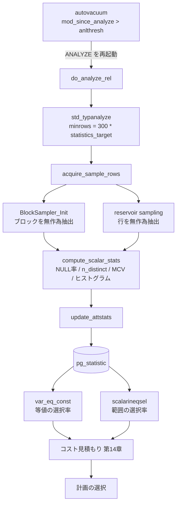

# 第44章 統計情報とプランナ統計

> **本章で読むソース**
>
> - [`src/backend/commands/analyze.c`](https://github.com/postgres/postgres/blob/REL_18_4/src/backend/commands/analyze.c)
> - [`src/backend/utils/misc/sampling.c`](https://github.com/postgres/postgres/blob/REL_18_4/src/backend/utils/misc/sampling.c)
> - [`src/backend/utils/adt/selfuncs.c`](https://github.com/postgres/postgres/blob/REL_18_4/src/backend/utils/adt/selfuncs.c)
> - [`src/include/catalog/pg_statistic.h`](https://github.com/postgres/postgres/blob/REL_18_4/src/include/catalog/pg_statistic.h)
> - [`src/backend/postmaster/autovacuum.c`](https://github.com/postgres/postgres/blob/REL_18_4/src/backend/postmaster/autovacuum.c)

## この章の狙い

第14章で、プランナがパスごとにコストを見積もり、最も安いパスを選ぶ仕組みを読んだ。
そこでは `baserel->rows`（テーブルの推定行数）や `WHERE` 句の選択率を所与として扱った。
本章は、その所与がどこから来るかを読む。

コスト見積もりは、各テーブルが何行あり、`WHERE col = 5` のような条件がそのうち何行を通すかを推定して初めて成り立つ。
この推定を支えるのが、列ごとの分布をまとめた**統計情報**である。
統計情報は `ANALYZE` コマンドがテーブルを読んで計算し、システムカタログ `pg_statistic` に格納する。
プランナはコスト見積もりのたびに `pg_statistic` を引き、選択率を推定する。

本章は、統計の収集側（`ANALYZE`）と利用側（プランナの選択率推定）を順に追う。
収集側では、巨大テーブルでも全行を読まずに済ませる標本抽出の工夫を読む。
利用側では、最頻値とヒストグラムという二種類の分布表現が、等値条件と範囲条件の選択率にどう効くかを読む。
本書の最終章として、収集された統計が古くなったときに何が起きるか、そしてそれを防ぐ autovacuum との接続まで見る。

## 前提

第14章で、コスト計算関数 `cost_seqscan` が `baserel->tuples` と `baserel->rows` を使うところまでを読んだ。
これらの行数は、プランナがコスト計算の前にサイズ見積もりを行って埋める値であり、その源が `pg_statistic` の統計と `pg_class` の `reltuples` である。
第43章で、autovacuum が VACUUM だけでなく ANALYZE も起動し、テーブルの変更量に応じて統計を更新することに触れた。
本章はその ANALYZE の中身を読む。

統計は標本に基づく推定値であり、厳密な真値ではない。
プランナはこの推定をコストの相対比較に使うため、多少の誤差は許容される。
問題になるのは、テーブルの中身が大きく変わったのに統計が古いまま放置され、推定が現実から大きくずれる場合である。

## ANALYZE の全体像 do_analyze_rel

1テーブルに対する `ANALYZE` の本体が `do_analyze_rel` である。
解析対象の列を決め、必要な標本行数を見積もり、標本を抽出し、列ごとに統計を計算し、`pg_statistic` へ書き出す。

まず、各列が必要とする標本行数の最大値を取り、抽出する標本サイズ `targrows` を決める。

[`src/backend/commands/analyze.c` L490-L521](https://github.com/postgres/postgres/blob/REL_18_4/src/backend/commands/analyze.c#L490-L521)

```c
	/*
	 * Determine how many rows we need to sample, using the worst case from
	 * all analyzable columns.  We use a lower bound of 100 rows to avoid
	 * possible overflow in Vitter's algorithm.  (Note: that will also be the
	 * target in the corner case where there are no analyzable columns.)
	 */
	targrows = 100;
	for (i = 0; i < attr_cnt; i++)
	{
		if (targrows < vacattrstats[i]->minrows)
			targrows = vacattrstats[i]->minrows;
	}
	for (ind = 0; ind < nindexes; ind++)
	{
		AnlIndexData *thisdata = &indexdata[ind];

		for (i = 0; i < thisdata->attr_cnt; i++)
		{
			if (targrows < thisdata->vacattrstats[i]->minrows)
				targrows = thisdata->vacattrstats[i]->minrows;
		}
	}

	/*
	 * Look at extended statistics objects too, as those may define custom
	 * statistics target. So we may need to sample more rows and then build
	 * the statistics with enough detail.
	 */
	minrows = ComputeExtStatisticsRows(onerel, attr_cnt, vacattrstats);

	if (targrows < minrows)
		targrows = minrows;
```

各列の `minrows` は、列の型に応じた解析関数が決める。
この `targrows` は、テーブルの総行数に依存しない。
10万行のテーブルでも10億行のテーブルでも、抽出する標本サイズは同じになる。
この定数オーダーの標本サイズが、巨大テーブルでも統計収集コストを抑える鍵であり、後の節で根拠を読む。

標本サイズが決まると、`acquire_sample_rows` で標本を抽出し、列ごとに `compute_stats` を呼んで統計を計算する。

[`src/backend/commands/analyze.c` L545-L585](https://github.com/postgres/postgres/blob/REL_18_4/src/backend/commands/analyze.c#L545-L585)

```c
	if (numrows > 0)
	{
		MemoryContext col_context,
					old_context;

		pgstat_progress_update_param(PROGRESS_ANALYZE_PHASE,
									 PROGRESS_ANALYZE_PHASE_COMPUTE_STATS);

		col_context = AllocSetContextCreate(anl_context,
											"Analyze Column",
											ALLOCSET_DEFAULT_SIZES);
		old_context = MemoryContextSwitchTo(col_context);

		for (i = 0; i < attr_cnt; i++)
		{
			VacAttrStats *stats = vacattrstats[i];
			AttributeOpts *aopt;

			stats->rows = rows;
			stats->tupDesc = onerel->rd_att;
			stats->compute_stats(stats,
								 std_fetch_func,
								 numrows,
								 totalrows);

			/*
			 * If the appropriate flavor of the n_distinct option is
			 * specified, override with the corresponding value.
			 */
			aopt = get_attribute_options(onerel->rd_id, stats->tupattnum);
			if (aopt != NULL)
			{
				float8		n_distinct;

				n_distinct = inh ? aopt->n_distinct_inherited : aopt->n_distinct;
				if (n_distinct != 0.0)
					stats->stadistinct = n_distinct;
			}

			MemoryContextReset(col_context);
		}
```

`compute_stats` は列の型ごとに差し替えられる関数ポインタで、スカラ型なら `compute_scalar_stats` が入る。
計算結果は `VacAttrStats` 構造体に溜められ、列を処理し終えると `update_attstats` で `pg_statistic` へ書き出される。

[`src/backend/commands/analyze.c` L596-L614](https://github.com/postgres/postgres/blob/REL_18_4/src/backend/commands/analyze.c#L596-L614)

```c
		/*
		 * Emit the completed stats rows into pg_statistic, replacing any
		 * previous statistics for the target columns.  (If there are stats in
		 * pg_statistic for columns we didn't process, we leave them alone.)
		 */
		update_attstats(RelationGetRelid(onerel), inh,
						attr_cnt, vacattrstats);

		for (ind = 0; ind < nindexes; ind++)
		{
			AnlIndexData *thisdata = &indexdata[ind];

			update_attstats(RelationGetRelid(Irel[ind]), false,
							thisdata->attr_cnt, thisdata->vacattrstats);
		}

		/* Build extended statistics (if there are any). */
		BuildRelationExtStatistics(onerel, inh, totalrows, numrows, rows,
								   attr_cnt, vacattrstats);
```

## 標本行数の決め方 std_typanalyze

`minrows` を決めるのは、スカラ型に対する標準の解析準備 `std_typanalyze` である。
比較演算子の有無を見て計算アルゴリズムを選び、必要な標本サイズを `300 * attstattarget` と置く。

[`src/backend/commands/analyze.c` L1917-L1955](https://github.com/postgres/postgres/blob/REL_18_4/src/backend/commands/analyze.c#L1917-L1955)

```c
	if (OidIsValid(eqopr) && OidIsValid(ltopr))
	{
		/* Seems to be a scalar datatype */
		stats->compute_stats = compute_scalar_stats;
		/*--------------------
		 * The following choice of minrows is based on the paper
		 * "Random sampling for histogram construction: how much is enough?"
		 * by Surajit Chaudhuri, Rajeev Motwani and Vivek Narasayya, in
		 * Proceedings of ACM SIGMOD International Conference on Management
		 * of Data, 1998, Pages 436-447.  Their Corollary 1 to Theorem 5
		 * says that for table size n, histogram size k, maximum relative
		 * error in bin size f, and error probability gamma, the minimum
		 * random sample size is
		 *		r = 4 * k * ln(2*n/gamma) / f^2
		 * Taking f = 0.5, gamma = 0.01, n = 10^6 rows, we obtain
		 *		r = 305.82 * k
		 * Note that because of the log function, the dependence on n is
		 * quite weak; even at n = 10^12, a 300*k sample gives <= 0.66
		 * bin size error with probability 0.99.  So there's no real need to
		 * scale for n, which is a good thing because we don't necessarily
		 * know it at this point.
		 *--------------------
		 */
		stats->minrows = 300 * stats->attstattarget;
	}
	else if (OidIsValid(eqopr))
	{
		/* We can still recognize distinct values */
		stats->compute_stats = compute_distinct_stats;
		/* Might as well use the same minrows as above */
		stats->minrows = 300 * stats->attstattarget;
	}
	else
	{
		/* Can't do much but the trivial stuff */
		stats->compute_stats = compute_trivial_stats;
		/* Might as well use the same minrows as above */
		stats->minrows = 300 * stats->attstattarget;
	}
```

ここに標本統計の理論的な裏付けがある。
`attstattarget`（既定100、GUC `default_statistics_target` に由来）をヒストグラムのビン数 k と見ると、標本サイズは `300 * k` で済む。
コメントが引く Chaudhuri らの定理によれば、必要な標本サイズはテーブル行数 n に対し対数でしか増えない。
n が 10^6 から 10^12 へ百万倍になっても、`300 * k` のままビンサイズ誤差は確率0.99で0.66以下に収まる。
だからテーブルの大きさで標本を増やす必要がなく、`ANALYZE` 時点で総行数を知らなくてよい。
これが、`targrows` を総行数に依存させない設計の根拠である。

## 標本抽出 acquire_sample_rows

`acquire_sample_rows` は、`targrows` 行の標本を集める。
ここで二段の無作為抽出を踏む。
まずブロック（ページ）を無作為に選び、次に選んだブロックを走査しながら行を無作為に選ぶ。

ブロックの抽出は `BlockSampler_Init` が用意し、行の抽出は Vitter のリザーバ法で行う。

[`src/backend/commands/analyze.c` L1221-L1251](https://github.com/postgres/postgres/blob/REL_18_4/src/backend/commands/analyze.c#L1221-L1251)

```c
	totalblocks = RelationGetNumberOfBlocks(onerel);

	/* Need a cutoff xmin for HeapTupleSatisfiesVacuum */
	OldestXmin = GetOldestNonRemovableTransactionId(onerel);

	/* Prepare for sampling block numbers */
	randseed = pg_prng_uint32(&pg_global_prng_state);
	nblocks = BlockSampler_Init(&bs, totalblocks, targrows, randseed);

	/* Report sampling block numbers */
	pgstat_progress_update_param(PROGRESS_ANALYZE_BLOCKS_TOTAL,
								 nblocks);

	/* Prepare for sampling rows */
	reservoir_init_selection_state(&rstate, targrows);

	scan = table_beginscan_analyze(onerel);
	slot = table_slot_create(onerel, NULL);

	/*
	 * It is safe to use batching, as block_sampling_read_stream_next never
	 * blocks.
	 */
	stream = read_stream_begin_relation(READ_STREAM_MAINTENANCE |
										READ_STREAM_USE_BATCHING,
										vac_strategy,
										scan->rs_rd,
										MAIN_FORKNUM,
										block_sampling_read_stream_next,
										&bs,
										0);
```

選んだブロックを順に読み、行ごとにリザーバ法を適用する。
最初の `targrows` 行はそのままリザーバに入れ、それ以降は確率的に既存の標本と置き換える。

[`src/backend/commands/analyze.c` L1272-L1300](https://github.com/postgres/postgres/blob/REL_18_4/src/backend/commands/analyze.c#L1272-L1300)

```c
			if (numrows < targrows)
				rows[numrows++] = ExecCopySlotHeapTuple(slot);
			else
			{
				/*
				 * t in Vitter's paper is the number of records already
				 * processed.  If we need to compute a new S value, we must
				 * use the not-yet-incremented value of samplerows as t.
				 */
				if (rowstoskip < 0)
					rowstoskip = reservoir_get_next_S(&rstate, samplerows, targrows);

				if (rowstoskip <= 0)
				{
					/*
					 * Found a suitable tuple, so save it, replacing one old
					 * tuple at random
					 */
					int			k = (int) (targrows * sampler_random_fract(&rstate.randstate));

					Assert(k >= 0 && k < targrows);
					heap_freetuple(rows[k]);
					rows[k] = ExecCopySlotHeapTuple(slot);
				}

				rowstoskip -= 1;
			}

			samplerows += 1;
```

リザーバ法は、全体の件数を事前に知らなくても、走査し終えた時点でリザーバが真の無作為標本になるという性質を持つ。
1パスの走査で固定サイズの標本を得られるため、テーブルを二度読む必要がない。

標本から、テーブル全体の行数も推定する。
走査したブロックの平均行密度が、走査しなかったブロックでも同じだと仮定して外挿する。

[`src/backend/commands/analyze.c` L1324-L1340](https://github.com/postgres/postgres/blob/REL_18_4/src/backend/commands/analyze.c#L1324-L1340)

```c
	/*
	 * Estimate total numbers of live and dead rows in relation, extrapolating
	 * on the assumption that the average tuple density in pages we didn't
	 * scan is the same as in the pages we did scan.  Since what we scanned is
	 * a random sample of the pages in the relation, this should be a good
	 * assumption.
	 */
	if (bs.m > 0)
	{
		*totalrows = floor((liverows / bs.m) * totalblocks + 0.5);
		*totaldeadrows = floor((deadrows / bs.m) * totalblocks + 0.5);
	}
	else
	{
		*totalrows = 0.0;
		*totaldeadrows = 0.0;
	}
```

`bs.m` は実際に走査したブロック数である。
走査ブロックで見えた生存行 `liverows` を1ブロックあたりに均し、総ブロック数 `totalblocks` を掛けて全体の行数とする。
この `totalrows` が `pg_class.reltuples` に書かれ、プランナのサイズ見積もりの基礎になる。

### ブロック抽出が読み取り量を抑える仕組み

`BlockSampler_Init` は、テーブルの総ブロック数 `totalblocks` から `targrows` 件のブロックを選ぶ準備をする。

[`src/backend/utils/misc/sampling.c` L39-L55](https://github.com/postgres/postgres/blob/REL_18_4/src/backend/utils/misc/sampling.c#L39-L55)

```c
BlockSampler_Init(BlockSampler bs, BlockNumber nblocks, int samplesize,
				  uint32 randseed)
{
	bs->N = nblocks;			/* measured table size */

	/*
	 * If we decide to reduce samplesize for tables that have less or not much
	 * more than samplesize blocks, here is the place to do it.
	 */
	bs->n = samplesize;
	bs->t = 0;					/* blocks scanned so far */
	bs->m = 0;					/* blocks selected so far */

	sampler_random_init_state(randseed, &bs->randstate);

	return Min(bs->n, bs->N);
}
```

選ぶブロック数の上限が `samplesize`（すなわち `targrows`）であり、これも総行数に依存しない定数オーダーである。
`ANALYZE` が読むのは、選ばれた高々 `targrows` 個のブロックだけになる。
テーブルが何百万ブロックあっても、ディスクから実際に読むのはその一部で済む。
**これが本章の高速化の工夫の核心である**。
全行を読んで分布を厳密に求める代わりに、定数サイズのブロック標本だけを読み、そこから分布を推定する。
標本サイズが総行数に対し対数でしか増えないという理論的裏付け（前節の Chaudhuri らの定理）があるからこそ、この近似が許される。
収集コストがテーブルの大きさにほぼ依存しなくなり、巨大テーブルでも `ANALYZE` が現実的な時間で終わる。

## 計算される統計 compute_scalar_stats

`compute_scalar_stats` は、標本から列の統計を計算する。
標本を値で整列し、NULL 率、平均幅、相異なる値の数、最頻値、ヒストグラムを求める。

まず NULL 率と平均幅、そして相異なる値の数 `stadistinct` を計算する。
標本に一度しか現れない値の数 f1 から、母集団全体の相異なる値の数を推定する点が要である。

[`src/backend/commands/analyze.c` L2608-L2649](https://github.com/postgres/postgres/blob/REL_18_4/src/backend/commands/analyze.c#L2608-L2649)

```c
		else
		{
			/*----------
			 * Estimate the number of distinct values using the estimator
			 * proposed by Haas and Stokes in IBM Research Report RJ 10025:
			 *		n*d / (n - f1 + f1*n/N)
			 * where f1 is the number of distinct values that occurred
			 * exactly once in our sample of n rows (from a total of N),
			 * and d is the total number of distinct values in the sample.
			 * This is their Duj1 estimator; the other estimators they
			 * recommend are considerably more complex, and are numerically
			 * very unstable when n is much smaller than N.
			 *
			 * In this calculation, we consider only non-nulls.  We used to
			 * include rows with null values in the n and N counts, but that
			 * leads to inaccurate answers in columns with many nulls, and
			 * it's intuitively bogus anyway considering the desired result is
			 * the number of distinct non-null values.
			 *
			 * Overwidth values are assumed to have been distinct.
			 *----------
			 */
			int			f1 = ndistinct - nmultiple + toowide_cnt;
			int			d = f1 + nmultiple;
			double		n = samplerows - null_cnt;
			double		N = totalrows * (1.0 - stats->stanullfrac);
			double		stadistinct;

			/* N == 0 shouldn't happen, but just in case ... */
			if (N > 0)
				stadistinct = (n * d) / ((n - f1) + f1 * n / N);
			else
				stadistinct = 0;

			/* Clamp to sane range in case of roundoff error */
			if (stadistinct < d)
				stadistinct = d;
			if (stadistinct > N)
				stadistinct = N;
			/* And round to integer */
			stats->stadistinct = floor(stadistinct + 0.5);
		}
```

相異なる値の数を標本だけから素朴に数えると、母集団の値の数を取りこぼす。
標本に一度しか出ない値が多いほど、標本外にまだ別の値が潜む見込みが高い。
Haas と Stokes の推定量はこの直感を式にしたもので、一度だけ現れた値の数 f1 を使って母集団の相異なる値の数を補正する。

求めた値の数は、テーブルの総行数に対する割合が大きいときは負の倍率として保存する。

[`src/backend/commands/analyze.c` L2651-L2658](https://github.com/postgres/postgres/blob/REL_18_4/src/backend/commands/analyze.c#L2651-L2658)

```c
		/*
		 * If we estimated the number of distinct values at more than 10% of
		 * the total row count (a very arbitrary limit), then assume that
		 * stadistinct should scale with the row count rather than be a fixed
		 * value.
		 */
		if (stats->stadistinct > 0.1 * totalrows)
			stats->stadistinct = -(stats->stadistinct / totalrows);
```

`stadistinct` を負値で持つのは、行数が増減しても相異なる値の数が行数に比例し続ける列に備えるためである。
この符号の約束は `pg_statistic.h` のコメントが定めており、利用側の `get_variable_numdistinct` がそのまま解釈する。

## pg_statistic のレイアウト

計算した統計は `pg_statistic` の1行に収まる。
そのカラム定義を読む。

[`src/include/catalog/pg_statistic.h` L30-L69](https://github.com/postgres/postgres/blob/REL_18_4/src/include/catalog/pg_statistic.h#L30-L69)

```c
{
	/* These fields form the unique key for the entry: */
	Oid			starelid BKI_LOOKUP(pg_class);	/* relation containing
												 * attribute */
	int16		staattnum;		/* attribute (column) stats are for */
	bool		stainherit;		/* true if inheritance children are included */

	/* the fraction of the column's entries that are NULL: */
	float4		stanullfrac;

	/*
	 * stawidth is the average width in bytes of non-null entries.  For
	 * fixed-width datatypes this is of course the same as the typlen, but for
	 * var-width types it is more useful.  Note that this is the average width
	 * of the data as actually stored, post-TOASTing (eg, for a
	 * moved-out-of-line value, only the size of the pointer object is
	 * counted).  This is the appropriate definition for the primary use of
	 * the statistic, which is to estimate sizes of in-memory hash tables of
	 * tuples.
	 */
	int32		stawidth;

	/* ----------------
	 * stadistinct indicates the (approximate) number of distinct non-null
	 * data values in the column.  The interpretation is:
	 *		0		unknown or not computed
	 *		> 0		actual number of distinct values
	 *		< 0		negative of multiplier for number of rows
	 * The special negative case allows us to cope with columns that are
	 * unique (stadistinct = -1) or nearly so (for example, a column in which
	 * non-null values appear about twice on the average could be represented
	 * by stadistinct = -0.5 if there are no nulls, or -0.4 if 20% of the
	 * column is nulls).  Because the number-of-rows statistic in pg_class may
	 * be updated more frequently than pg_statistic is, it's important to be
	 * able to describe such situations as a multiple of the number of rows,
	 * rather than a fixed number of distinct values.  But in other cases a
	 * fixed number is correct (eg, a boolean column).
	 * ----------------
	 */
	float4		stadistinct;
```

`starelid`、`staattnum`、`stainherit` が主キーで、どのテーブルのどの列の統計かを示す。
`stanullfrac`、`stawidth`、`stadistinct` は、型に依らず固定の意味を持つ三つの量である。
分布そのものは固定スロットには入れず、種別つきの汎用スロットに格納する。

[`src/include/catalog/pg_statistic.h` L71-L98](https://github.com/postgres/postgres/blob/REL_18_4/src/include/catalog/pg_statistic.h#L71-L98)

```c
	/* ----------------
	 * To allow keeping statistics on different kinds of datatypes,
	 * we do not hard-wire any particular meaning for the remaining
	 * statistical fields.  Instead, we provide several "slots" in which
	 * statistical data can be placed.  Each slot includes:
	 *		kind			integer code identifying kind of data (see below)
	 *		op				OID of associated operator, if needed
	 *		coll			OID of relevant collation, or 0 if none
	 *		numbers			float4 array (for statistical values)
	 *		values			anyarray (for representations of data values)
	 * The ID, operator, and collation fields are never NULL; they are zeroes
	 * in an unused slot.  The numbers and values fields are NULL in an
	 * unused slot, and might also be NULL in a used slot if the slot kind
	 * has no need for one or the other.
	 * ----------------
	 */

	int16		stakind1;
	int16		stakind2;
	int16		stakind3;
	int16		stakind4;
	int16		stakind5;

	Oid			staop1 BKI_LOOKUP_OPT(pg_operator);
	Oid			staop2 BKI_LOOKUP_OPT(pg_operator);
	Oid			staop3 BKI_LOOKUP_OPT(pg_operator);
	Oid			staop4 BKI_LOOKUP_OPT(pg_operator);
	Oid			staop5 BKI_LOOKUP_OPT(pg_operator);
```

5つの汎用スロット（`stakindN`、`staopN`、`stanumbersN`、`stavaluesN`）があり、それぞれが1種類の分布データを持つ。
種別コードは `stakindN` が示す。
スカラ型では、種別1の最頻値リストと種別2のヒストグラムがよく使われる。

[`src/include/catalog/pg_statistic.h` L179-L210](https://github.com/postgres/postgres/blob/REL_18_4/src/include/catalog/pg_statistic.h#L179-L210)

```c
/*
 * In a "most common values" slot, staop is the OID of the "=" operator
 * used to decide whether values are the same or not, and stacoll is the
 * collation used (same as column's collation).  stavalues contains
 * the K most common non-null values appearing in the column, and stanumbers
 * contains their frequencies (fractions of total row count).  The values
 * shall be ordered in decreasing frequency.  Note that since the arrays are
 * variable-size, K may be chosen at ANALYZE time.  Values should not appear
 * in MCV unless they have been observed to occur more than once; a unique
 * column will have no MCV slot.
 */
#define STATISTIC_KIND_MCV	1

/*
 * A "histogram" slot describes the distribution of scalar data.  staop is
 * the OID of the "<" operator that describes the sort ordering, and stacoll
 * is the relevant collation.  (In theory more than one histogram could appear,
 * if a datatype has more than one useful sort operator or we care about more
 * than one collation.  Currently the collation will always be that of the
 * underlying column.)  stavalues contains M (>=2) non-null values that
 * divide the non-null column data values into M-1 bins of approximately equal
 * population.  The first stavalues item is the MIN and the last is the MAX.
 * stanumbers is not used and should be NULL.  IMPORTANT POINT: if an MCV
 * slot is also provided, then the histogram describes the data distribution
 * *after removing the values listed in MCV* (thus, it's a "compressed
 * histogram" in the technical parlance).  This allows a more accurate
 * representation of the distribution of a column with some very-common
 * values.  In a column with only a few distinct values, it's possible that
 * the MCV list describes the entire data population; in this case the
 * histogram reduces to empty and should be omitted.
 */
#define STATISTIC_KIND_HISTOGRAM  2
```

**最頻値リスト**（種別1、MCV）は、列に頻出する K 個の値と、それぞれの出現頻度を持つ。
頻度は行全体に対する割合で、降順に並ぶ。
**ヒストグラム**（種別2）は、最頻値を除いた残りの値を、ほぼ等量の M-1 個のビンに分ける M 個の境界値を持つ。
最頻値で偏りの大きい値を別枠にし、残りをヒストグラムで均等分割することで、偏った分布も少ない情報で表せる。

`update_attstats` は、これらのスロットを `pg_statistic` のタプルに詰めて書き込む。

[`src/backend/commands/analyze.c` L1691-L1711](https://github.com/postgres/postgres/blob/REL_18_4/src/backend/commands/analyze.c#L1691-L1711)

```c
		values[Anum_pg_statistic_starelid - 1] = ObjectIdGetDatum(relid);
		values[Anum_pg_statistic_staattnum - 1] = Int16GetDatum(stats->tupattnum);
		values[Anum_pg_statistic_stainherit - 1] = BoolGetDatum(inh);
		values[Anum_pg_statistic_stanullfrac - 1] = Float4GetDatum(stats->stanullfrac);
		values[Anum_pg_statistic_stawidth - 1] = Int32GetDatum(stats->stawidth);
		values[Anum_pg_statistic_stadistinct - 1] = Float4GetDatum(stats->stadistinct);
		i = Anum_pg_statistic_stakind1 - 1;
		for (k = 0; k < STATISTIC_NUM_SLOTS; k++)
		{
			values[i++] = Int16GetDatum(stats->stakind[k]); /* stakindN */
		}
		i = Anum_pg_statistic_staop1 - 1;
		for (k = 0; k < STATISTIC_NUM_SLOTS; k++)
		{
			values[i++] = ObjectIdGetDatum(stats->staop[k]);	/* staopN */
		}
		i = Anum_pg_statistic_stacoll1 - 1;
		for (k = 0; k < STATISTIC_NUM_SLOTS; k++)
		{
			values[i++] = ObjectIdGetDatum(stats->stacoll[k]);	/* stacollN */
		}
```

## プランナでの利用 eqsel

ここから利用側に移る。
プランナは選択率推定関数を通じて `pg_statistic` を引く。
等値条件 `col = const` の選択率を見積もるのが `eqsel` であり、その中核が `var_eq_const` である。

`var_eq_const` は、まず定数が最頻値リストのどれかと等しいかを調べる。

[`src/backend/utils/adt/selfuncs.c` L350-L412](https://github.com/postgres/postgres/blob/REL_18_4/src/backend/utils/adt/selfuncs.c#L350-L412)

```c
		/*
		 * Is the constant "=" to any of the column's most common values?
		 * (Although the given operator may not really be "=", we will assume
		 * that seeing whether it returns TRUE is an appropriate test.  If you
		 * don't like this, maybe you shouldn't be using eqsel for your
		 * operator...)
		 */
		if (get_attstatsslot(&sslot, vardata->statsTuple,
							 STATISTIC_KIND_MCV, InvalidOid,
							 ATTSTATSSLOT_VALUES | ATTSTATSSLOT_NUMBERS))
		{
			LOCAL_FCINFO(fcinfo, 2);
			FmgrInfo	eqproc;

			fmgr_info(opfuncoid, &eqproc);

			/*
			 * Save a few cycles by setting up the fcinfo struct just once.
			 * Using FunctionCallInvoke directly also avoids failure if the
			 * eqproc returns NULL, though really equality functions should
			 * never do that.
			 */
			InitFunctionCallInfoData(*fcinfo, &eqproc, 2, collation,
									 NULL, NULL);
			fcinfo->args[0].isnull = false;
			fcinfo->args[1].isnull = false;
			/* be careful to apply operator right way 'round */
			if (varonleft)
				fcinfo->args[1].value = constval;
			else
				fcinfo->args[0].value = constval;

			for (i = 0; i < sslot.nvalues; i++)
			{
				Datum		fresult;

				if (varonleft)
					fcinfo->args[0].value = sslot.values[i];
				else
					fcinfo->args[1].value = sslot.values[i];
				fcinfo->isnull = false;
				fresult = FunctionCallInvoke(fcinfo);
				if (!fcinfo->isnull && DatumGetBool(fresult))
				{
					match = true;
					break;
				}
			}
		}
		else
		{
			/* no most-common-value info available */
			i = 0;				/* keep compiler quiet */
		}

		if (match)
		{
			/*
			 * Constant is "=" to this common value.  We know selectivity
			 * exactly (or as exactly as ANALYZE could calculate it, anyway).
			 */
			selec = sslot.numbers[i];
		}
```

定数が最頻値の一つと一致すれば、選択率はその最頻値の頻度 `sslot.numbers[i]` そのものになる。
最頻値リストには値ごとの実測頻度が入っているため、この場合の選択率はほぼ正確に分かる。

最頻値に一致しないときは、最頻値が占める割合を除いた残りを、最頻値以外の相異なる値で均等に割る。

[`src/backend/utils/adt/selfuncs.c` L413-L444](https://github.com/postgres/postgres/blob/REL_18_4/src/backend/utils/adt/selfuncs.c#L413-L444)

```c
		else
		{
			/*
			 * Comparison is against a constant that is neither NULL nor any
			 * of the common values.  Its selectivity cannot be more than
			 * this:
			 */
			double		sumcommon = 0.0;
			double		otherdistinct;

			for (i = 0; i < sslot.nnumbers; i++)
				sumcommon += sslot.numbers[i];
			selec = 1.0 - sumcommon - nullfrac;
			CLAMP_PROBABILITY(selec);

			/*
			 * and in fact it's probably a good deal less. We approximate that
			 * all the not-common values share this remaining fraction
			 * equally, so we divide by the number of other distinct values.
			 */
			otherdistinct = get_variable_numdistinct(vardata, &isdefault) -
				sslot.nnumbers;
			if (otherdistinct > 1)
				selec /= otherdistinct;

			/*
			 * Another cross-check: selectivity shouldn't be estimated as more
			 * than the least common "most common value".
			 */
			if (sslot.nnumbers > 0 && selec > sslot.numbers[sslot.nnumbers - 1])
				selec = sslot.numbers[sslot.nnumbers - 1];
		}
```

NULL と最頻値が占める割合を引いた残りが、最頻値以外の値が現れる確率である。
それを最頻値以外の相異なる値の数で割り、1つの値あたりの選択率とする。
ここで相異なる値の数 `otherdistinct` を得るのに `get_variable_numdistinct` を呼ぶ。

`get_variable_numdistinct` は `stadistinct` を解釈する。
正値ならそのまま値の数とし、負値なら行数に対する倍率として扱う。

[`src/backend/utils/adt/selfuncs.c` L6357-L6382](https://github.com/postgres/postgres/blob/REL_18_4/src/backend/utils/adt/selfuncs.c#L6357-L6382)

```c
	/*
	 * If we had an absolute estimate, use that.
	 */
	if (stadistinct > 0.0)
		return clamp_row_est(stadistinct);

	/*
	 * Otherwise we need to get the relation size; punt if not available.
	 */
	if (vardata->rel == NULL)
	{
		*isdefault = true;
		return DEFAULT_NUM_DISTINCT;
	}
	ntuples = vardata->rel->tuples;
	if (ntuples <= 0.0)
	{
		*isdefault = true;
		return DEFAULT_NUM_DISTINCT;
	}

	/*
	 * If we had a relative estimate, use that.
	 */
	if (stadistinct < 0.0)
		return clamp_row_est(-stadistinct * ntuples);
```

負の `stadistinct` を `ntuples` に掛けて相異なる値の数を復元する点が、`pg_statistic.h` の符号の約束と対応している。
`pg_class.reltuples` が `pg_statistic` より頻繁に更新されても、倍率で持っておけば最新の行数に追従できる。

## 範囲条件の選択率 scalarineqsel

不等号条件 `col < const` の選択率は `scalarineqsel` が見積もる。
こちらは最頻値とヒストグラムの両方を使う。

[`src/backend/utils/adt/selfuncs.c` L683-L719](https://github.com/postgres/postgres/blob/REL_18_4/src/backend/utils/adt/selfuncs.c#L683-L719)

```c
	/*
	 * If we have most-common-values info, add up the fractions of the MCV
	 * entries that satisfy MCV OP CONST.  These fractions contribute directly
	 * to the result selectivity.  Also add up the total fraction represented
	 * by MCV entries.
	 */
	mcv_selec = mcv_selectivity(vardata, &opproc, collation, constval, true,
								&sumcommon);

	/*
	 * If there is a histogram, determine which bin the constant falls in, and
	 * compute the resulting contribution to selectivity.
	 */
	hist_selec = ineq_histogram_selectivity(root, vardata,
											operator, &opproc, isgt, iseq,
											collation,
											constval, consttype);

	/*
	 * Now merge the results from the MCV and histogram calculations,
	 * realizing that the histogram covers only the non-null values that are
	 * not listed in MCV.
	 */
	selec = 1.0 - stats->stanullfrac - sumcommon;

	if (hist_selec >= 0.0)
		selec *= hist_selec;
	else
	{
		/*
		 * If no histogram but there are values not accounted for by MCV,
		 * arbitrarily assume half of them will match.
		 */
		selec *= 0.5;
	}

	selec += mcv_selec;
```

最頻値リストからは、条件を満たす最頻値の頻度を直に足す（`mcv_selec`）。
ヒストグラムからは、定数がどのビンに落ちるかを二分探索で求め、そのビンまでの割合を選択率とする（`hist_selec`）。
ヒストグラムは最頻値を除いた残りの分布を表すので、両者は重ならず、`(1 - NULL率 - 最頻値の割合) * hist_selec + mcv_selec` として合成できる。
最頻値が偏りの大きい値を、ヒストグラムが連続した範囲を担い、二つを足し合わせて範囲条件の選択率を組み立てる。

`ineq_histogram_selectivity` は、ヒストグラムの境界値を二分探索し、定数が落ちるビンを特定する。

[`src/backend/utils/adt/selfuncs.c` L1072-L1103](https://github.com/postgres/postgres/blob/REL_18_4/src/backend/utils/adt/selfuncs.c#L1072-L1103)

```c
	if (HeapTupleIsValid(vardata->statsTuple) &&
		statistic_proc_security_check(vardata, opproc->fn_oid) &&
		get_attstatsslot(&sslot, vardata->statsTuple,
						 STATISTIC_KIND_HISTOGRAM, InvalidOid,
						 ATTSTATSSLOT_VALUES))
	{
		if (sslot.nvalues > 1 &&
			sslot.stacoll == collation &&
			comparison_ops_are_compatible(sslot.staop, opoid))
		{
			/*
			 * Use binary search to find the desired location, namely the
			 * right end of the histogram bin containing the comparison value,
			 * which is the leftmost entry for which the comparison operator
			 * succeeds (if isgt) or fails (if !isgt).
			 *
			 * In this loop, we pay no attention to whether the operator iseq
			 * or not; that detail will be mopped up below.  (We cannot tell,
			 * anyway, whether the operator thinks the values are equal.)
			 *
			 * If the binary search accesses the first or last histogram
			 * entry, we try to replace that endpoint with the true column min
			 * or max as found by get_actual_variable_range().  This
			 * ameliorates misestimates when the min or max is moving as a
			 * result of changes since the last ANALYZE.  Note that this could
			 * result in effectively including MCVs into the histogram that
			 * weren't there before, but we don't try to correct for that.
			 */
			double		histfrac;
			int			lobound = 0;	/* first possible slot to search */
			int			hibound = sslot.nvalues;	/* last+1 slot to search */
			bool		have_end = false;
```

ヒストグラムのビンはほぼ等量に作られているため、定数が k 番目のビンに落ちれば、それより小さい値の割合はおよそ k / (ビン数) になる。
ビン内では値が一様分布すると仮定して、ビン内の位置で線形補間する。
等量分割のおかげで、各ビンが担う行数の割合がそろい、少ない境界値で分布全体を近似できる。

## 統計が古いと何が起きるか

ここまでの推定は、すべて `pg_statistic` の統計が現実を反映している前提に立つ。
統計が古くなると、`var_eq_const` が引く最頻値の頻度や `ineq_histogram_selectivity` が引くヒストグラムの境界が実態とずれ、選択率がずれる。

選択率のずれは行数見積もりのずれになり、第14章で読んだコスト見積もりを通じて計画選択に波及する。
たとえば、新しく大量に挿入された値域を `WHERE` 句が指していても、ヒストグラムにその値域が現れていなければ、プランナは「該当行はごく少ない」と誤って見積もる。
少数の行しか返らないと思えばインデックススキャンや入れ子ループが安く見えるが、実際には大量の行が該当し、選んだ計画が遅くなる。
`ineq_histogram_selectivity` のコメントが、ヒストグラム端点を実測の最小値最大値で置き換えて「前回の `ANALYZE` 以降に最小最大が動いた場合の誤推定を和らげる」と述べるのも、この種のずれへの部分的な対策である。

このずれを防ぐのが、統計を変更量に応じて自動更新する仕組みである。

## autovacuum による ANALYZE の自動起動

第43章で読んだ autovacuum は、VACUUM だけでなく ANALYZE も起動する。
テーブルごとに、前回の `ANALYZE` 以降の変更行数がしきい値を超えたかを判定する。

[`src/backend/postmaster/autovacuum.c` L3097-L3147](https://github.com/postgres/postgres/blob/REL_18_4/src/backend/postmaster/autovacuum.c#L3097-L3147)

```c
		vactuples = tabentry->dead_tuples;
		instuples = tabentry->ins_since_vacuum;
		anltuples = tabentry->mod_since_analyze;

		/* If the table hasn't yet been vacuumed, take reltuples as zero */
		if (reltuples < 0)
			reltuples = 0;

		/*
		 * If we have data for relallfrozen, calculate the unfrozen percentage
		 * of the table to modify insert scale factor. This helps us decide
		 * whether or not to vacuum an insert-heavy table based on the number
		 * of inserts to the more "active" part of the table.
		 */
		if (relpages > 0 && relallfrozen > 0)
		{
			/*
			 * It could be the stats were updated manually and relallfrozen >
			 * relpages. Clamp relallfrozen to relpages to avoid nonsensical
			 * calculations.
			 */
			relallfrozen = Min(relallfrozen, relpages);
			pcnt_unfrozen = 1 - ((float4) relallfrozen / relpages);
		}

		vacthresh = (float4) vac_base_thresh + vac_scale_factor * reltuples;
		if (vac_max_thresh >= 0 && vacthresh > (float4) vac_max_thresh)
			vacthresh = (float4) vac_max_thresh;

		vacinsthresh = (float4) vac_ins_base_thresh +
			vac_ins_scale_factor * reltuples * pcnt_unfrozen;
		anlthresh = (float4) anl_base_thresh + anl_scale_factor * reltuples;

		/*
		 * Note that we don't need to take special consideration for stat
		 * reset, because if that happens, the last vacuum and analyze counts
		 * will be reset too.
		 */
		if (vac_ins_base_thresh >= 0)
			elog(DEBUG3, "%s: vac: %.0f (threshold %.0f), ins: %.0f (threshold %.0f), anl: %.0f (threshold %.0f)",
				 NameStr(classForm->relname),
				 vactuples, vacthresh, instuples, vacinsthresh, anltuples, anlthresh);
		else
			elog(DEBUG3, "%s: vac: %.0f (threshold %.0f), ins: (disabled), anl: %.0f (threshold %.0f)",
				 NameStr(classForm->relname),
				 vactuples, vacthresh, anltuples, anlthresh);

		/* Determine if this table needs vacuum or analyze. */
		*dovacuum = force_vacuum || (vactuples > vacthresh) ||
			(vac_ins_base_thresh >= 0 && instuples > vacinsthresh);
		*doanalyze = (anltuples > anlthresh);
```

`anltuples`（前回 `ANALYZE` 以降に変更された行数 `mod_since_analyze`）が、しきい値 `anlthresh` を超えると `*doanalyze` が立つ。
しきい値は `anl_base_thresh + anl_scale_factor * reltuples` で、基準値（既定50）にテーブル行数の一定割合（既定10%）を足したものである。
行数に比例する項を持つため、大きいテーブルほど絶対変更量が多くないと再解析されず、小さいテーブルほど少しの変更で再解析される。
この比例しきい値が、統計の鮮度を保ちながら `ANALYZE` の頻度を抑える。
変更が一定割合に達した列だけが再標本され、`pg_statistic` が現実に追従し続ける。

## 全体の流れ

収集側と利用側を一枚にまとめる。
`ANALYZE` がブロックと行を二段で標本抽出し、列ごとに統計を計算して `pg_statistic` に格納する。
プランナはその `pg_statistic` を引いて選択率を見積もり、コスト計算に渡す。
変更量がしきい値を超えると、autovacuum が `ANALYZE` を再起動して統計を更新する。



図の右下の閉路に注目したい。
テーブルの変更が `pg_statistic` を古くし、autovacuum がそれを検知して `ANALYZE` を回し、統計を現実に戻す。
この循環が、プランナのコスト見積もりが現実からずれ続けないための仕組みである。

## まとめ

本章では、プランナのコスト見積もりを支える統計情報の収集と利用を読んだ。
`do_analyze_rel` が、テーブルから定数サイズの標本を抽出し、列ごとに NULL 率、相異なる値の数、最頻値、ヒストグラムを計算して `pg_statistic` へ格納する。
標本サイズが総行数に対し対数でしか増えないという理論的裏付けにより、`BlockSampler_Init` は定数オーダーのブロックだけを読み、巨大テーブルでも収集コストを抑える。
プランナ側では `var_eq_const` が最頻値から等値の選択率を、`scalarineqsel` が最頻値とヒストグラムから範囲の選択率を見積もり、第14章のコスト計算へ渡す。
統計が古くなると見積もりがずれて計画が悪化するため、autovacuum が変更量に応じて `ANALYZE` を再起動し、統計を現実に追従させる。

本書は、プロセスモデルから問い合わせ処理、エグゼキュータ、ストレージとバッファ管理、MVCC とバキューム、インデックス、トランザクションと並行制御、WAL とリカバリ、そしてシステムカタログと運用基盤までを読み進めてきた。
最後に置いた統計情報は、これらの層が積み上げた仕組みの上で、プランナがどの実行手段を選ぶかという判断を現実のデータ分布に結びつける役割を担う。

## 関連する章

- [第14章 パス生成とコスト見積もり](../part03-query-frontend/14-paths-and-costing.md)
- [第28章 VACUUM と HOT](../part06-table-mvcc/28-vacuum-and-hot.md)
- [第42章 システムカタログとキャッシュ](42-system-catalogs-and-caches.md)
- [第43章 バックグラウンドワーカーと autovacuum](43-background-workers-autovacuum.md)
