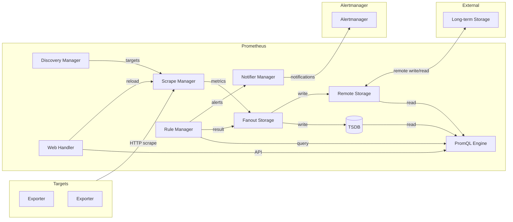

# 第1章 アーキテクチャ全体像

> 本章で読むソース
>
> - [`cmd/prometheus/main.go`](https://github.com/prometheus/prometheus/blob/v3.12.0/cmd/prometheus/main.go)
> - [`config/config.go`](https://github.com/prometheus/prometheus/blob/v3.12.0/config/config.go)
> - [`storage/fanout.go`](https://github.com/prometheus/prometheus/blob/v3.12.0/storage/fanout.go)

## この章の狙い

Prometheus がどのような設計思想で作られ、全体としてどのサブシステムが協調して動作するかを把握する。
コードの詳細に入る前に、**データの流れとコンポーネント間の責務**を鳥瞰する。

## 前提

Prometheus の基本的な概念（メトリクス、ラベル、Pull モデル）を知っていることを前提とする。

## Pull ベース監視と多次元データモデル

Prometheus は**Pull モデル**を採用する監視システムである。
監視対象のエクスポーターに対し、Prometheus 自身が定期的に HTTP でメトリクスを取得しにいく。
この方式により、バースト的なトラフィックで監視対象が過負荷になることを防ぎ、ネットワークの分断に対しても監視サーバー側でリトライ制御ができる。

データモデルは**多次元**である。
メトリクス名と一組のラベル（キーと値のペア）で時系列を一意に識別する。
このラベルによる柔軟な絞り込みが PromQL の強力なクエリ性能を支える。

## メインバイナリの構造

エントリポイントは [`cmd/prometheus/main.go`](https://github.com/prometheus/prometheus/blob/v3.12.0/cmd/prometheus/main.go) の `main()` 関数である。

[`main()` 関数](https://github.com/prometheus/prometheus/blob/v3.12.0/cmd/prometheus/main.go#L361-L1601)は次の大きな処理を順に実行する。

1. **フラグ解析**（kingpin ライブラリを使用）
2. **設定ファイルの読み込み**（`config.LoadFile()`）
3. **サブシステムの初期化**（storage, scrape, discovery, rule, notifier, web）
4. **goroutine 管理**（`oklog/run.Group` による起動・停止）

## サブシステム一覧

Prometheus は次の主要サブシステムから構成される。

### Scrape（スクレイプ）

`scrape.Manager` がスクレイピングの管理を担当する。
サービスディスカバリーから受け取ったターゲットリストに従い、定期的に HTTP でメトリクスを取得し、`storage.Appendable` に書き込む。

### TSDB（時系列データベース）

`tsdb.DB` がローカルストレージを担当する。
スクレイプされたサンプルをメモリ上の Head に書き込み、一定間隔でディスク上のブロックにコンパクションする。
WAL による耐久性も保証する。

### PromQL（クエリ言語）

`promql.Engine` が PromQL のクエリ実行を担当する。
パーサーがクエリ文字列を AST に変換し、エンジンがストレージからデータを読み出して評価する。

### Rules（ルール評価）

`rules.Manager` が記録ルールとアラートルールの定周期評価を担当する。
評価結果は `fanoutStorage` に書き込まれ、アラートは `notifier.Manager` へ送られる。

### Notifier（アラート通知）

`notifier.Manager` が Alertmanager へのアラート送信を担当する。
ルールマネージャから受け取ったアラートをキューイングし、設定された Alertmanager にバッチ送信する。

### Discovery（サービスディスカバリー）

`discovery.Manager` が Kubernetes やファイル、DNS など複数の SD 機構からターゲットの変更を検出し、scrape と notify の各マネージャに伝える。

### Web（HTTP API / UI）

`web.Handler` が Prometheus の HTTP インタフェースを提供する。
PromQL API、管理 API、設定のリロード、シャットダウンなどを処理する。

### Remote Storage（リモートストレージ）

`remote.Storage` がリモート書き込み・読み出しを担当する。
スクレイプしたデータを外部の長期ストレージに転送したり、リモートのデータをクエリ時に参照したりする。

## サブシステムの配線

`main()` 内でこれらのサブシステムがどのように接続されるかを見る。

[`main.go` L898-L903](https://github.com/prometheus/prometheus/blob/v3.12.0/cmd/prometheus/main.go#L898-L903) ではストレージ層の配線が行われる。

```go
var (
    localStorage  = &readyStorage{stats: tsdb.NewDBStats()}
    scraper       = &readyScrapeManager{}
    remoteStorage = remote.NewStorage(logger.With("component", "remote"), prometheus.DefaultRegisterer, localStorage.StartTime, localStoragePath, time.Duration(cfg.RemoteFlushDeadline), scraper, cfg.scrape.EnableTypeAndUnitLabels)
    fanoutStorage = storage.NewFanout(logger, localStorage, remoteStorage)
)
```

`readyStorage` は起動時に TSDB がまだ開かれていない状態でもインタフェースを満たすためのラッパーである。
`storage.NewFanout` は [`storage/fanout.go`](https://github.com/prometheus/prometheus/blob/v3.12.0/storage/fanout.go) で定義され、ローカルストレージを primary、リモートストレージを secondary として束ねる。
書き込みは両方にファンアウトし、読み出しはマージクエリで結果を統合する。

[`main.go` L946-L956](https://github.com/prometheus/prometheus/blob/v3.12.0/cmd/prometheus/main.go#L946-L956) ではスクレイプマネージャが作成される。

```go
scrapeManager, err := scrape.NewManager(
    &cfg.scrape,
    logger.With("component", "scrape manager"),
    logging.NewJSONFileLogger,
    nil, fanoutStorage,
    prometheus.DefaultRegisterer,
)
```

`fanoutStorage` がスクレイプマネージャの書き込み先として渡される。
スクレイプしたデータはローカル TSDB とリモートストレージの両方に同時に書き込まれる。

[`main.go` L988-L1008](https://github.com/prometheus/prometheus/blob/v3.12.0/cmd/prometheus/main.go#L988-L1008) ではルールマネージャが作成される。

```go
ruleManager = rules.NewManager(&rules.ManagerOptions{
    ...
    Appendable:             fanoutStorage,
    Queryable:              localStorage,
    QueryFunc:              rules.EngineQueryFunc(queryEngine, fanoutStorage),
    NotifyFunc:             rules.SendAlerts(notifierManager, cfg.web.ExternalURL.String()),
    ...
})
```

`Appendable` に `fanoutStorage`、`NotifyFunc` に `notifierManager` の送信関数を渡すことで、ルールの評価結果はストレージと Alertmanager の両方に届く。

## oklog/run.Group による goroutine 管理

Prometheus は [`oklog/run.Group`](https://github.com/oklog/run) を使って複数の goroutine の起動と停止を管理する。

[`main.go` L1210-L1599](https://github.com/prometheus/prometheus/blob/v3.12.0/cmd/prometheus/main.go#L1210-L1599) の構造は次の通りである。

```go
var g run.Group
{
	// Termination handler.
	term := make(chan os.Signal, 1)
	signal.Notify(term, os.Interrupt, syscall.SIGTERM)
	cancel := make(chan struct{})
	g.Add(
		func() error {
			select {
			case sig := <-term:
				logger.Warn("Received an OS signal, exiting gracefully...", "signal", sig.String())
				reloadReady.Close()
			case <-webHandler.Quit():
				logger.Warn("Received termination request via web service, exiting gracefully...")
			case <-cancel:
				reloadReady.Close()
			}
			return nil
		},
		func(error) {
			close(cancel)
			webHandler.SetReady(web.Stopping)
			notifs.AddNotification(notifications.ShuttingDown)
		},
	)
}
{
	// Scrape discovery manager.
	g.Add(
		func() error {
			err := discoveryManagerScrape.Run()
			logger.Info("Scrape discovery manager stopped")
			return err
		},
		func(error) {
			logger.Info("Stopping scrape discovery manager...")
			cancelScrape()
		},
	)
}
{
	// Notify discovery manager.
	g.Add(
		func() error {
			err := discoveryManagerNotify.Run()
			logger.Info("Notify discovery manager stopped")
			return err
		},
		func(error) {
			logger.Info("Stopping notify discovery manager...")
			cancelNotify()
		},
	)
}
if !agentMode {
	// Rule manager.
	g.Add(
		func() error {
			<-reloadReady.C
			ruleManager.Run()
			logger.Info("Rule manager stopped")
			return nil
		},
		func(error) {
			logger.Info("Stopping rule manager manager...")
			ruleManager.Stop()
		},
	)
}
{
	// Scrape manager.
	g.Add(
		func() error {
			<-reloadReady.C
			err := scrapeManager.Run(discoveryManagerScrape.SyncCh())
			logger.Info("Scrape manager stopped")
			return err
		},
		func(error) {
			logger.Info("Stopping scrape manager...")
			scrapeManager.Stop()
		},
	)
}
{
	// Tracing manager.
	g.Add(
		func() error {
			<-reloadReady.C
			tracingManager.Run()
			logger.Info("Tracing manager stopped")
			return nil
		},
		func(error) {
			logger.Info("Stopping tracing manager...")
			tracingManager.Stop()
		},
	)
}
{
	// Reload handler.
	// ... (中略) ...
}
{
	// Initial configuration loading.
	// ... (中略) ...
}
if !agentMode {
	// TSDB.
	// ... (中略) ...
}
if agentMode {
	// WAL storage.
	// ... (中略) ...
}
{
	// Web handler.
	g.Add(
		func() error {
			if err := webHandler.Run(ctxWeb, listeners, *webConfig); err != nil {
				return fmt.Errorf("error starting web server: %w", err)
			}
			logger.Info("Web handler stopped")
			return nil
		},
		func(error) {
			logger.Info("Stopping web handler...")
			cancelWeb()
		},
	)
}
{
	// Notifier.
	g.Add(
		func() error {
			<-reloadReady.C
			notifierManager.Run(discoveryManagerNotify.SyncCh())
			logger.Info("Notifier manager stopped")
			return nil
		},
		func(error) {
			logger.Info("Stopping notifier manager...")
			notifierManager.Stop()
		},
	)
}
func() {
	if err := g.Run(); err != nil {
		logger.Error("Fatal error", "err", err)
		os.Exit(1)
	}
}()
```

各 `g.Add()` は execute 関数と interrupt 関数のペアを受け取る。
`g.Run()` は全 execute 関数を goroutine で起動し、いずれかが終了するか割り込みを受け取ると、他のすべての interrupt 関数を呼び出して graceful shutdown を行う。

`reloadReady` チャネル（`main.go` L1189）は TSDB のオープンを待ってからリロードとスクレイパーの起動を開始する同期機構である。

## リローダー

設定変更時に各サブシステムを更新するため、`reloader` のスライスが [`main.go` L1062-L1173](https://github.com/prometheus/prometheus/blob/v3.12.0/cmd/prometheus/main.go#L1062-L1173) で定義される。

```go
reloaders := []reloader{
	{
		name: "db_storage",
		reloader: func() func(*config.Config) error {
			lastTSDBRetention := config.TSDBRetentionConfig{}
			return func(cfg *config.Config) error {
				err := localStorage.ApplyConfig(cfg)
				if err != nil || agentMode || cfg.StorageConfig.TSDBConfig == nil || cfg.StorageConfig.TSDBConfig.Retention == nil {
					return err
				}
				// ... (中略) ...
			}()
	}, {
		name:     "remote_storage",
		reloader: remoteStorage.ApplyConfig,
	}, {
		name:     "web_handler",
		reloader: webHandler.ApplyConfig,
	}, {
		name: "query_engine",
		reloader: func(cfg *config.Config) error {
			// ... (中略) ...
		},
	}, {
		// The Scrape and notifier managers need to reload before the Discovery manager as
		// they need to read the most updated config when receiving the new targets list.
		name:     "scrape",
		reloader: scrapeManager.ApplyConfig,
	}, {
		name: "scrape_sd",
		reloader: func(cfg *config.Config) error {
			// ... (中略) ...
		},
	}, {
		name:     "notify",
		reloader: notifierManager.ApplyConfig,
	}, {
		name: "notify_sd",
		reloader: func(cfg *config.Config) error {
			// ... (中略) ...
		},
	}, {
		name: "rules",
		reloader: func(cfg *config.Config) error {
			// ... (中略) ...
		},
	}, {
		name:     "tracing",
		reloader: tracingManager.ApplyConfig,
	},
}
```

各リローダーは `func(*config.Config) error` の型を持ち、設定変更時に順次呼び出される。
この設計により、各サブシステムは自身の設定更新ロジックだけを実装すればよく、全体のリロードシーケンスは `reloadConfig()` 関数が一元管理する。

## 全体アーキテクチャ図



データは左から右に流れる。
サービスディスカバリーがターゲットを発見し、スクレイプマネージャがメトリクスを取得する。
取得したデータは Fanout Storage を通じてローカル TSDB とリモートストレージの両方に書き込まれる。
PromQL エンジンは両方のストレージからクエリし、ルールマネージャはその結果を評価してアラートを生成する。

## 高速化・最適化の工夫

Fanout Storage のプライマリ／セカンダリ分離（[`storage/fanout.go` L45-L51](https://github.com/prometheus/prometheus/blob/v3.12.0/storage/fanout.go#L45-L51)）は、リモートストレージの障害がローカルストレージの動作に影響しない設計である。
クエリ時にセカンダリがエラーを返してもプライマリの結果は破棄されず、セカンダリのエラーは警告として返される。
これにより、リモートストレージの一時的な障害が PromQL クエリの可用性に直結しない。

## まとめ

Prometheus のメインバイナリは `cmd/prometheus/main.go` の `main()` 関数が起点であり、`oklog/run.Group` による goroutine 管理とリローダー機構でサブシステム間の結合を疎に保つ。
各サブシステムは scape → storage → query → rule → notify の順にデータが流れるパイプラインを構成する。

## 関連する章

- [第2章 設定と起動フロー](02-config-and-startup.md)（起動シーケンスの詳細）
- [第3章 スクレイピング機構](../part01-scrape/03-scrape-mechanism.md)（スクレイプマネージャの詳細）
