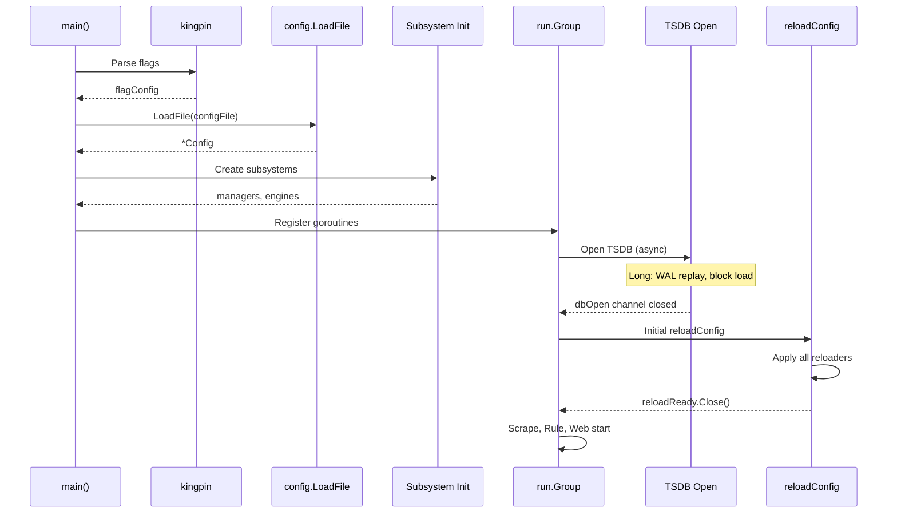

# 第2章 設定と起動フロー

> 本章で読むソース
>
> - [`cmd/prometheus/main.go`](https://github.com/prometheus/prometheus/blob/v3.12.0/cmd/prometheus/main.go)
> - [`config/config.go`](https://github.com/prometheus/prometheus/blob/v3.12.0/config/config.go)
> - [`config/reload.go`](https://github.com/prometheus/prometheus/blob/v3.12.0/config/reload.go)

## この章の狙い

Prometheus の起動から初期化完了までの一連の流れを、コードを追いながら理解する。
設定ファイルのパース方法、設定変更時のリロード機構、そして各サブシステムがどの順序で立ち上がるかを把握する。

## 前提

第1章のアーキテクチャ全体像を理解していることを前提とする。

## Config 構造体

設定は [`config/config.go`](https://github.com/prometheus/prometheus/blob/v3.12.0/config/config.go) の [`Config` 構造体](https://github.com/prometheus/prometheus/blob/v3.12.0/config/config.go#L292-L307)で表現される。

```go
type Config struct {
    GlobalConfig      GlobalConfig    `yaml:"global"`
    Runtime           RuntimeConfig   `yaml:"runtime,omitempty"`
    AlertingConfig    AlertingConfig  `yaml:"alerting,omitempty"`
    RuleFiles         []string        `yaml:"rule_files,omitempty"`
    ScrapeConfigFiles []string        `yaml:"scrape_config_files,omitempty"`
    ScrapeConfigs     []*ScrapeConfig `yaml:"scrape_configs,omitempty"`
    StorageConfig     StorageConfig   `yaml:"storage,omitempty"`
    TracingConfig     TracingConfig   `yaml:"tracing,omitempty"`
    RemoteWriteConfigs []*RemoteWriteConfig `yaml:"remote_write,omitempty"`
    RemoteReadConfigs  []*RemoteReadConfig  `yaml:"remote_read,omitempty"`
    OTLPConfig         OTLPConfig           `yaml:"otlp,omitempty"`
    loaded bool
}
```

各フィールドは YAML タグでマッピングされる。
以下が主要な構成要素である。

### GlobalConfig

[`GlobalConfig`](https://github.com/prometheus/prometheus/blob/v3.12.0/config/config.go#L483-L541) は全スクレイプジョブおよびルール評価に適用されるグローバルなデフォルト値を保持する。

```go
type GlobalConfig struct {
	// How frequently to scrape targets by default.
	ScrapeInterval model.Duration `yaml:"scrape_interval,omitempty"`
	// The default timeout when scraping targets.
	ScrapeTimeout model.Duration `yaml:"scrape_timeout,omitempty"`
	// How frequently to evaluate rules by default.
	EvaluationInterval model.Duration `yaml:"evaluation_interval,omitempty"`
	// The labels to add to any timeseries that this Prometheus instance scrapes.
	ExternalLabels labels.Labels `yaml:"external_labels,omitempty"`
	// ... (中略) ...
	// Whether to enable additional scrape metrics.
	ExtraScrapeMetrics *bool `yaml:"extra_scrape_metrics,omitempty"`
}
```

デフォルト値は [`DefaultGlobalConfig`](https://github.com/prometheus/prometheus/blob/v3.12.0/config/config.go#L173-L192) で定義される。
ScrapeInterval は 1 分、ScrapeTimeout は 10 秒、EvaluationInterval は 1 分である。

### ScrapeConfig

[`ScrapeConfig`](https://github.com/prometheus/prometheus/blob/v3.12.0/config/config.go#L764-L853) は個別のスクレイプジョブを定義する。
JobName が必須であり、MetricsPath のデフォルトは `/metrics`、Scheme のデフォルトは `http` である。

### その他の Config 構造体

`AlertingConfig`、`RemoteWriteConfig`、`RemoteReadConfig`、`StorageConfig`（TSDB と Exemplars）などがトップレベルの `Config` の配下に並ぶ。

## LoadFile の流れ

設定ファイルの読み込みは [`LoadFile()`](https://github.com/prometheus/prometheus/blob/v3.12.0/config/config.go#L131-L157) から始まる。

```go
func LoadFile(filename string, agentMode bool, logger *slog.Logger) (*Config, error) {
    content, err := os.ReadFile(filename)
    if err != nil {
        return nil, err
    }
    cfg, err := Load(string(content), logger)
    if err != nil {
        return nil, fmt.Errorf("parsing YAML file %s: %w", filename, err)
    }
    if agentMode {
        if len(cfg.AlertingConfig.AlertmanagerConfigs) > 0 || ... {
            return nil, errors.New("field alerting is not allowed in agent mode")
        }
        // ...
    }
    cfg.SetDirectory(filepath.Dir(filename))
    return cfg, nil
}
```

内部で呼ばれる [`Load()`](https://github.com/prometheus/prometheus/blob/v3.12.0/config/config.go#L74-L127) が実際の YAML パースとデフォルト値の適用を行う。

```go
func Load(s string, logger *slog.Logger) (*Config, error) {
    cfg := &Config{}
    *cfg = DefaultConfig
    err := yaml.UnmarshalStrict([]byte(s), cfg)
    if err != nil {
        return nil, err
    }
    // TSDBConfig の nil チェックとデフォルト適用
    if cfg.StorageConfig.TSDBConfig == nil {
        retention := DefaultTSDBRetentionConfig
        cfg.StorageConfig.TSDBConfig = &TSDBConfig{Retention: &retention}
    }
    // 外部ラベルの環境変数展開
    cfg.GlobalConfig.ExternalLabels.Range(func(v labels.Label) {
        newV := os.Expand(v.Value, func(s string) string {
            if s == "$" { return "$" }
            if v := os.Getenv(s); v != "" { return v }
            return ""
        })
        // ...
    })
    cfg.loaded = true
    return cfg, nil
}
```

処理の流れは次の通りである。

1. **ファイル読み込み**: `os.ReadFile` で YAML ファイルを丸ごと読み込む
2. **デフォルト適用**: `DefaultConfig` がベースになる
3. **YAML パース**: `yaml.UnmarshalStrict` で strict モードでパースする（未知のフィールドはエラー）
4. **UnmarshalYAML**: 各構造体の `UnmarshalYAML` メソッドが自動的に呼ばれ、デフォルト値の上書きやバリデーションを行う
5. **環境変数展開**: `GlobalConfig.ExternalLabels` の値に `os.Expand` を適用し、`${VAR}` 形式の環境変数を展開する
6. **バリデーション**: スクレイプ設定の重複チェック、タイムアウトとインターバルの大小関係のチェックなどを行う
7. **パス解決**: `SetDirectory` で相対パスを設定ファイルのディレクトリからの絶対パスに変換する

## 起動シーケンス

[`main()`](https://github.com/prometheus/prometheus/blob/v3.12.0/cmd/prometheus/main.go#L361-L1601) の起動シーケンスを追う。

### フェーズ1：フラグ解析（L361-L649）

`kingpin` ライブラリでコマンドラインフラグを解析する。
フラグの値は [`flagConfig` 構造体](https://github.com/prometheus/prometheus/blob/v3.12.0/cmd/prometheus/main.go#L183-L227)に格納される。

```go
type flagConfig struct {
	configFile string

	agentStoragePath            string
	serverStoragePath           string
	notifier                    notifier.Options
	forGracePeriod              model.Duration
	outageTolerance             model.Duration
	resendDelay                 model.Duration
	maxConcurrentEvals          int64
	web                         web.Options
	scrape                      scrape.Options
	tsdb                        tsdbOptions
	agent                       agentOptions
	// ... (中略) ...
	promslogConfig promslog.Config
}
```

主要なフラグは次の通りである。

- `--config.file`: 設定ファイルパス（デフォルト `prometheus.yml`）
- `--web.listen-address`: リッスンアドレス（デフォルト `0.0.0.0:9090`）
- `--storage.tsdb.path`: TSDB データ格納パス（デフォルト `data/`）
- `--agent`: エージェントモードの有効化

### フェーズ2：設定読み込み（L722-L751）

```go
var cfgFile *config.Config
if cfgFile, err = config.LoadFile(cfg.configFile, agentMode, promslog.NewNopLogger()); err != nil {
    // エラー処理
    os.Exit(2)
}
```

設定ファイルのパースエラーはこの時点で異常終了する。
設定ファイルが正常に読めない場合、他のコンポーネントを起動する前に失敗させることで、無効な設定での起動を防止する。

### フェーズ3：サブシステム初期化（L898-L1052）

ストレージ、ディスカバリーマネージャ、スクレイプマネージャ、PromQL エンジン、ルールマネージャ、Web ハンドラが順に作成される。
この段階ではまだ goroutine は起動せず、データ構造の構築だけを行う。

### フェーズ4：goroutine 起動（L1210-L1599）

`oklog/run.Group` に各サブシステムの execute/interrupt ペアを登録し、`g.Run()` を呼び出す。
ここで初めて各サブシステムのメインループ（スクレイプ、ディスカバリー、Web サーバーなど）が goroutine として起動する。

### フェーズ5：TSDB オープン（L1434-L1494）

TSDB のオープンは最も時間のかかる処理である。
WAL のリプレイやブロックの読み込みが行われる。
TSDB が開かれると `dbOpen` チャネルがクローズされ、それを待っていた初期設定リロードが実行される。

### フェーズ6：初期設定リロード（L1404-L1433）

```go
if err := reloadConfig(cfg.configFile, cfg.tsdb.EnableExemplarStorage, logger, noStepSubqueryInterval, func(bool) {}, reloaders...); err != nil {
    return fmt.Errorf("error loading config from %q: %w", cfg.configFile, err)
}
reloadReady.Close()
webHandler.SetReady(web.Ready)
```

TSDB オープン後に初めて `reloadConfig()` が呼ばれ、全リローダーが設定を適用する。
この後 `reloadReady` がクローズされ、スクレイプマネージャやルールマネージャが実際の動作を開始する。

## 起動シーケンス図



起動は逐次的に進むが、TSDB オープンだけは非同期的に実行され、その完了を `dbOpen` チャネルで待つ設計になっている。

## リロード機構

Prometheus は稼働中に設定を再読み込みできる。
トリガーは三つある。

### SIGHUP によるリロード

[`main.go` L1324-L1402](https://github.com/prometheus/prometheus/blob/v3.12.0/cmd/prometheus/main.go#L1324-L1402) で SIGHUP シグナルを `hup` チャネルで受信し、`reloadConfig()` を呼び出す。

```go
hup := make(chan os.Signal, 1)
signal.Notify(hup, syscall.SIGHUP)
// ...
for {
    select {
    case <-hup:
        if err := reloadConfig(cfg.configFile, cfg.tsdb.EnableExemplarStorage, logger, noStepSubqueryInterval, callback, reloaders...); err != nil {
            logger.Error("Error reloading config", "err", err)
        }
    // ...
    }
}
```

### HTTP によるリロード

`webHandler.Reload()` チャネル経由で HTTP API（`/-/reload`）からのリロード要求を受け付ける。
`--web.enable-lifecycle` フラグが有効な場合にのみ動作する。

### 自動リロード

`--config.auto-reload` フラグが有効な場合、指定された間隔（デフォルト 30 秒）で設定ファイルのチェックサムを比較し、変更を検出すると自動リロードする。
チェックサムは [`config/reload.go`](https://github.com/prometheus/prometheus/blob/v3.12.0/config/reload.go) の [`GenerateChecksum()`](https://github.com/prometheus/prometheus/blob/v3.12.0/config/reload.go#L33-L93) で生成される。
設定ファイル自体に加えて、`rule_files` と `scrape_config_files` で参照されるファイルの内容もハッシュに含める。

```go
func GenerateChecksum(yamlFilePath string) (string, error) {
	hash := sha256.New()

	yamlContent, err := os.ReadFile(yamlFilePath)
	if err != nil {
		return "", fmt.Errorf("error reading YAML file: %w", err)
	}
	_, err = hash.Write(yamlContent)
	if err != nil {
		return "", fmt.Errorf("error writing YAML file to hash: %w", err)
	}

	var config ExternalFilesConfig
	if err := yaml.Unmarshal(yamlContent, &config); err != nil {
		return "", fmt.Errorf("error unmarshalling YAML: %w", err)
	}

	dir := filepath.Dir(yamlFilePath)

	for i, file := range config.RuleFiles {
		config.RuleFiles[i] = promconfig.JoinDir(dir, file)
	}
	for i, file := range config.ScrapeConfigFiles {
		config.ScrapeConfigFiles[i] = promconfig.JoinDir(dir, file)
	}

	files := map[string][]string{
		"r": config.RuleFiles,         // "r" for rule files
		"s": config.ScrapeConfigFiles, // "s" for scrape config files
	}

	for _, prefix := range []string{"r", "s"} {
		for _, pattern := range files[prefix] {
			// ... (中略) ...
		}
	}

	return hex.EncodeToString(hash.Sum(nil)), nil
}
```

## reloadConfig の内部

[`reloadConfig()`](https://github.com/prometheus/prometheus/blob/v3.12.0/cmd/prometheus/main.go#L1659-L1703) はリロードの中核関数である。

```go
func reloadConfig(filename string, enableExemplarStorage bool, logger *slog.Logger, noStepSubqueryInterval *safePromQLNoStepSubqueryInterval, callback func(bool), rls ...reloader) (err error) {
    start := time.Now()
    logger.Info("Loading configuration file", "filename", filename)
    defer func() {
        if err == nil {
            configSuccess.Set(1)
            configSuccessTime.SetToCurrentTime()
            callback(true)
        } else {
            configSuccess.Set(0)
            callback(false)
        }
    }()
    conf, err := config.LoadFile(filename, agentMode, logger)
    if err != nil {
        return fmt.Errorf("couldn't load configuration (--config.file=%q): %w", filename, err)
    }
    failed := false
    for _, rl := range rls {
        rstart := time.Now()
        if err := rl.reloader(conf); err != nil {
            logger.Error("Failed to apply configuration", "err", err)
            failed = true
        }
        timingsLogger = timingsLogger.With(rl.name, time.Since(rstart))
    }
    if failed {
        return fmt.Errorf("one or more errors occurred while applying the new configuration")
    }
    noStepSubqueryInterval.Set(conf.GlobalConfig.EvaluationInterval)
    timingsLogger.Info("Completed loading of configuration file", "filename", filename, "totalDuration", time.Since(start))
    return nil
}
```

処理の流れは次の通りである。

1. **設定ファイル再読み込み**: `config.LoadFile()` で最新の設定をパースする
2. **逐次適用**: 各リローダーを順番に呼び出す
3. **部分失敗の処理**: 一部のリローダーが失敗しても全体は止めず、`failed` フラグでエラーを記録する
4. **メトリクス更新**: 成功時は `prometheus_config_last_reload_successful` を 1 に、失敗時は 0 に設定する

リローダーの実行順序には依存関係が考慮されている。
[`main.go` L1113-L1115](https://github.com/prometheus/prometheus/blob/v3.12.0/cmd/prometheus/main.go#L1113-L1115) のコメントが示す通り、scrape と notifier のリローダーは discovery のリローダーより前に実行される必要がある。
新しいターゲットリストを受信する前に、各マネージャが最新の設定を保持していなければならないためである。

## 高速化・最適化の工夫

リロード処理は**部分失敗を許容する**設計である。
すべてのリローダーが成功しなければならないわけではなく、一部のサブシステムで設定適用に失敗しても、他のサブシステムは新しい設定で動作し続ける。
これにより、たとえばリモートストレージの設定が不正でもスクレイピング自体は継続でき、監視の欠落を最小限に抑える。

設定変更の検出に**SHA256 チェックサム**（`config/reload.go`）を使用する設計も、無駄なリロードを防止する。
設定ファイル本体だけでなく、そこから参照される全ファイルの内容をハッシュに含めることで、`rule_files` や `scrape_config_files` の変更も検出できる。
これにより自動リロード機能はファイル変更を正確に検知し、オーバーヘッドの少ないポーリングを実現する。

## まとめ

起動フローはフラグ解析 → 設定読み込み → サブシステム初期化 → goroutine 起動 → TSDB オープン → 初期リロードの順に進む。
リロード機構は SIGHUP、HTTP API、自動チェックサム監視の三経路を持ち、`reloadConfig()` が全リローダーを逐次実行することで設定変更を反映する。

## 関連する章

- [第1章 アーキテクチャ全体像](01-architecture-overview.md)（サブシステム間の配線）
