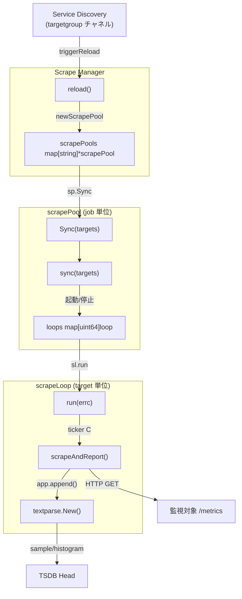

# 第3章 スクレイピング機構

> 本章で読むソース
>
> - [`scrape/manager.go`](https://github.com/prometheus/prometheus/blob/v3.12.0/scrape/manager.go)
> - [`scrape/scrape.go`](https://github.com/prometheus/prometheus/blob/v3.12.0/scrape/scrape.go)
> - [`scrape/target.go`](https://github.com/prometheus/prometheus/blob/v3.12.0/scrape/target.go)
> - [`model/textparse/interface.go`](https://github.com/prometheus/prometheus/blob/v3.12.0/model/textparse/interface.go)

## この章の狙い

Prometheus がターゲットからメトリクスを取得（スクレイプ）する一連の流れを理解する。
Scrape Manager が設定を解釈して scrapePool を管理し、各 scrapeLoop がターゲットを定周期で HTTP 取得し、パースして TSDB に書き込むまでの全経路を追う。

## 前提

第2章で設定ファイルの読み込みと各サブシステムの初期化を説明した。
第4章でサービスディスカバリーがターゲットリストを生成する仕組みを扱う。
本章ではその中間層にあたるスクレイプの実行機構に集中する。

## スクレイプの全体像

Scrape Manager は最上位の管理役である。
設定に従ってターゲットグループごとに **scrapePool** を作成し、各プール内でターゲットごとに **scrapeLoop** が動作する。



## Manager 構造体

Manager は scrapeConfigs と scrapePools の2つのマップを持ち、設定とプールを対応づける。

[`scrape/manager.go L186-L207`](https://github.com/prometheus/prometheus/blob/v3.12.0/scrape/manager.go#L186-L207)

```go
type Manager struct {
	opts   *Options
	logger *slog.Logger

	appendable   storage.Appendable
	appendableV2 storage.AppendableV2

	graceShut chan struct{}

	offsetSeed             uint64     // Global offsetSeed seed is used to spread scrape workload across HA setup.
	mtxScrape              sync.Mutex // Guards the fields below.
	scrapeConfigs          map[string]*config.ScrapeConfig
	scrapePools            map[string]*scrapePool
	newScrapeFailureLogger func(string) (*logging.JSONFileLogger, error)
	scrapeFailureLoggers   map[string]FailureLogger
	targetSets             map[string][]*targetgroup.Group
	buffers                *pool.Pool

	triggerReload chan struct{}

	metrics *scrapeMetrics
}
```

`offsetSeed` は HA 構成で複数の Prometheus が同時にスクレイプしないよう、スクレイプ時刻にハッシュベースのジッターを加えるためのグローバルシードである。

### Run と reloader

`Run()` はサービスディスカバリーからのターゲット更新チャネルを待ち受け、更新があるたびに `triggerReload` チャネルへ通知を送る。

[`scrape/manager.go L211-L230`](https://github.com/prometheus/prometheus/blob/v3.12.0/scrape/manager.go#L211-L230)

```go
func (m *Manager) Run(tsets <-chan map[string][]*targetgroup.Group) error {
	go m.reloader()
	for {
		select {
		case ts, ok := <-tsets:
			if !ok {
				break
			}
			m.updateTsets(ts)

			select {
			case m.triggerReload <- struct{}{}:
			default:
			}

		case <-m.graceShut:
			return nil
		}
	}
}
```

`triggerReload` はバッファサイズ1のチャネルであり、既にリロードが予約されている場合は追加の通知をキューに入れず捨てる。
これにより高頻度の更新をバッチ処理する。

`reloader()` は内部で5秒間隔（デフォルト）のティッカーを回し、`triggerReload` に通知が来ていた場合だけ `reload()` を実行する。
これでディスカバリーの更新が短時間に連続しても、スクレイププールの再構築は5秒に1回に抑制される。

### reload によるプール管理

`reload()` は `targetSets` に含まれるジョブ名ごとに scrapePool が存在するか確認し、なければ `newScrapePool()` で作成する。

[`scrape/manager.go L271-L305`](https://github.com/prometheus/prometheus/blob/v3.12.0/scrape/manager.go#L271-L305)

```go
func (m *Manager) reload() {
	m.mtxScrape.Lock()
	var wg sync.WaitGroup
	for setName, groups := range m.targetSets {
		if _, ok := m.scrapePools[setName]; !ok {
			scrapeConfig, ok := m.scrapeConfigs[setName]
			if !ok {
				m.logger.Error("error reloading target set", "err", "invalid config id:"+setName)
				continue
			}
			m.metrics.targetScrapePools.Inc()
			sp, err := newScrapePool(scrapeConfig, m.appendable, m.appendableV2, m.offsetSeed, m.logger.With("scrape_pool", setName), m.buffers, m.opts, m.metrics)
			if err != nil {
				m.metrics.targetScrapePoolsFailed.Inc()
				m.logger.Error("error creating new scrape pool", "err", err, "scrape_pool", setName)
				continue
			}
			m.scrapePools[setName] = sp
			// ...scrapeFailureLogger の設定...
		}

		wg.Add(1)
		// Run the sync in parallel as these take a while and at high load can't catch up.
		go func(sp *scrapePool, groups []*targetgroup.Group) {
			sp.Sync(groups)
			wg.Done()
		}(m.scrapePools[setName], groups)
	}
	m.mtxScrape.Unlock()
	wg.Wait()
}
```

各プールの `Sync()` はゴルーチンで並列実行される。
コメント「Run the sync in parallel as these take a while and at high load can't catch up.」が示すとおり、ターゲット数が多い環境では同期処理そのものがボトルネックになりうるため、プール間で並列化している。

## scrapePool：ジョブ単位の管理

scrapePool は1つのスクレイプジョブ（例 `job: "node"`）に対応する。
ターゲットを管理し、各ターゲットのスクレイプループを保持する。

[`scrape/scrape.go L84-L116`](https://github.com/prometheus/prometheus/blob/v3.12.0/scrape/scrape.go#L84-L116)

```go
type scrapePool struct {
	appendable   storage.Appendable
	appendableV2 storage.AppendableV2
	logger       *slog.Logger
	ctx          context.Context
	cancel       context.CancelFunc
	options      *Options

	// mtx must not be taken after targetMtx.
	mtx    sync.Mutex
	config *config.ScrapeConfig
	client *http.Client
	loops  map[uint64]loop

	symbolTable           *labels.SymbolTable
	lastSymbolTableCheck  time.Time
	initialSymbolTableLen int

	targetMtx sync.Mutex
	// activeTargets and loops must always be synchronized to have the same
	// set of hashes.
	activeTargets       map[uint64]*Target
	droppedTargets      []*Target // Subject to KeepDroppedTargets limit.
	droppedTargetsCount int       // Count of all dropped targets.
	scrapeFailureLogger FailureLogger

	// newLoop injection for testing purposes.
	injectTestNewLoop func(scrapeLoopOptions) loop

	metrics    *scrapeMetrics
	buffers    *pool.Pool
	offsetSeed uint64
}
```

`loops` と `activeTargets` は同一のハッシュ集合を持つ。
コメントに「activeTargets and loops must always be synchronized to have the same set of hashes」とあり、リロード時は両方を一貫して更新する。

symbolTable はターゲットのラベル文字列をインターン（同一文字列を共有）するためのシンボルテーブルであり、メモリ消費を抑える。

### Sync と sync

`Sync()` は `targetgroup.Group` のスライスから Target インスタンスを生成し、ラベルが空のものはドロップ対象に分類してから `sync()` を呼ぶ。

[`scrape/scrape.go L393-L437`](https://github.com/prometheus/prometheus/blob/v3.12.0/scrape/scrape.go#L393-L437)

```go
func (sp *scrapePool) Sync(tgs []*targetgroup.Group) {
	sp.mtx.Lock()
	defer sp.mtx.Unlock()
	start := time.Now()

	sp.targetMtx.Lock()
	var all []*Target
	var targets []*Target
	lb := labels.NewBuilderWithSymbolTable(sp.symbolTable)
	sp.droppedTargets = []*Target{}
	sp.droppedTargetsCount = 0
	for _, tg := range tgs {
		targets, failures := TargetsFromGroup(tg, sp.config, targets, lb)
		for _, err := range failures {
			sp.logger.Error("Creating target failed", "err", err)
		}
		sp.metrics.targetSyncFailed.WithLabelValues(sp.config.JobName).Add(float64(len(failures)))
		for _, t := range targets {
			// Replicate .Labels().IsEmpty() with a loop here to avoid generating garbage.
			nonEmpty := false
			t.LabelsRange(func(labels.Label) { nonEmpty = true })
			switch {
			case nonEmpty:
				all = append(all, t)
			default:
				if sp.config.KeepDroppedTargets == 0 || uint(len(sp.droppedTargets)) < sp.config.KeepDroppedTargets {
					sp.droppedTargets = append(sp.droppedTargets, t)
				}
				sp.droppedTargetsCount++
			}
		}
	}
	sp.metrics.targetScrapePoolSymbolTableItems.WithLabelValues(sp.config.JobName).Set(float64(sp.symbolTable.Len()))
	sp.targetMtx.Unlock()
	sp.sync(all)
	sp.checkSymbolTable()

	sp.metrics.targetSyncIntervalLength.WithLabelValues(sp.config.JobName).Observe(
		time.Since(start).Seconds(),
	)
	sp.metrics.targetSyncIntervalLengthHistogram.WithLabelValues(sp.config.JobName).Observe(
		time.Since(start).Seconds(),
	)
	sp.metrics.targetScrapePoolSyncsCounter.WithLabelValues(sp.config.JobName).Inc()
}
```

空ラベルの判定で `t.LabelsRange()` を使っているのはガベージの削減である。
`.Labels().IsEmpty()` では Labels 構造体をヒープにエスケープしてしまうが、`LabelsRange` でコールバックを使えば不要なアロケーションを避けられる。

`sync()` は内部でループの重複排除、新しいターゲット向けのループ起動、消えたターゲットのループ停止を行う。

## scrapeLoop：ターゲット単位の取得と報告

scrapeLoop は1つのターゲットに対応する。
`loop` インターフェースを実装する。

[`scrape/scrape.go L809-L816`](https://github.com/prometheus/prometheus/blob/v3.12.0/scrape/scrape.go#L809-L816)

```go
type loop interface {
	run(errc chan<- error)
	setForcedError(err error)
	setScrapeFailureLogger(FailureLogger)
	stop()
	getCache() *scrapeCache
	disableEndOfRunStalenessMarkers()
}
```

### run：スクレイプのメインループ

`run()` は interval 間隔で `scrapeAndReport()` を呼び出す無限ループである。

[`scrape/scrape.go L1263-L1332`](https://github.com/prometheus/prometheus/blob/v3.12.0/scrape/scrape.go#L1263-L1332)

```go
func (sl *scrapeLoop) run(errc chan<- error) {
	var (
		last   time.Time
		ticker = time.NewTicker(sl.interval)
	)
	defer func() {
		if sl.scrapeOnShutdown {
			last = sl.scrapeAndReport(last, time.Now().Round(0), errc)
		}
		close(sl.stopped)
		if sl.parentCtx.Err() == nil {
			if !sl.disabledEndOfRunStalenessMarkers.Load() {
				sl.endOfRunStaleness(last, ticker, sl.interval)
			}
		}
		ticker.Stop()
	}()

	offset := sl.getScrapeOffset()
	if offset > 0 {
		select {
		case <-time.After(offset):
		case <-sl.ctx.Done():
			return
		}
	}

	ticker.Reset(sl.interval)
	alignedScrapeTime := time.Now().Round(0)

	for {
		select {
		case <-sl.ctx.Done():
			return
		default:
		}

		scrapeTime := time.Now().Round(0)
		if AlignScrapeTimestamps {
			tolerance := min(sl.interval/100, ScrapeTimestampTolerance)
			for scrapeTime.Sub(alignedScrapeTime) >= sl.interval {
				alignedScrapeTime = alignedScrapeTime.Add(sl.interval)
			}
			if scrapeTime.Sub(alignedScrapeTime) <= tolerance {
				scrapeTime = alignedScrapeTime
			}
		}

		last = sl.scrapeAndReport(last, scrapeTime, errc)

		select {
		case <-sl.ctx.Done():
			return
		case <-ticker.C:
		}
	}
}
```

起動時の `offset` はターゲットのハッシュに基づくジッターであり、全ターゲットが同時にスクレイプしないように分散させる。
defer 内の `endOfRunStaleness` はループ終了時にスタネルマーカーを書き込む処理である。

### scrapeAndReport：HTTP 取得と TSDB への書き込み

`scrapeAndReport()` は1回のスクレイプを実行する。

[`scrape/scrape.go L1346-L1465`](https://github.com/prometheus/prometheus/blob/v3.12.0/scrape/scrape.go#L1346-L1465)

```go
func (sl *scrapeLoop) scrapeAndReport(last, appendTime time.Time, errc chan<- error) time.Time {
	start := time.Now()

	if !last.IsZero() {
		sl.metrics.targetIntervalLength.WithLabelValues(sl.interval.String()).Observe(
			time.Since(last).Seconds(),
		)
		sl.metrics.targetIntervalLengthHistogram.WithLabelValues(sl.interval.String()).Observe(
			time.Since(last).Seconds(),
		)
	}

	var total, added, seriesAdded, bytesRead int
	var err, appErr, scrapeErr error

	app := sl.appender()
	defer func() {
		if err != nil {
			_ = app.Rollback()
			return
		}
		err = app.Commit()
		if sl.reportExtraMetrics {
			totalDuration := time.Since(start)
			sl.metrics.targetScrapeDuration.Observe(totalDuration.Seconds())
		}
		if err != nil {
			sl.l.Error("Scrape commit failed", "err", err)
		}
	}()

	defer func() {
		if err = sl.report(app, appendTime, time.Since(start), total, added, seriesAdded, bytesRead, scrapeErr); err != nil {
			sl.l.Warn("Appending scrape report failed", "err", err)
		}
	}()

	if forcedErr := sl.getForcedError(); forcedErr != nil {
		scrapeErr = forcedErr
		// Add stale markers.
		if _, _, _, err := app.append([]byte{}, "", appendTime); err != nil {
			_ = app.Rollback()
			app = sl.appender()
			sl.l.Warn("Append failed", "err", err)
		}
		if errc != nil {
			select {
			case errc <- forcedErr:
			case <-sl.ctx.Done():
			}
		}
		return start
	}

	var contentType string
	var resp *http.Response
	var b []byte
	var buf *bytes.Buffer
	scrapeCtx, cancel := context.WithTimeout(sl.parentCtx, sl.timeout)
	resp, scrapeErr = sl.scraper.scrape(scrapeCtx)
	if scrapeErr == nil {
		b = sl.buffers.Get(sl.lastScrapeSize).([]byte)
		defer sl.buffers.Put(b)
		buf = bytes.NewBuffer(b)
		contentType, scrapeErr = sl.scraper.readResponse(scrapeCtx, resp, buf)
	}
	cancel()

	// ...(エラーハンドリング)...

	total, added, seriesAdded, appErr = app.append(b, contentType, appendTime)
	// ...(失敗時は空スクレイプで stale marker)...

	if scrapeErr == nil {
		scrapeErr = appErr
	}
	// ... (中略) ...
	return start
}
```

この関数の重要な設計判断は次の2点である。

1つ目は **アペンダーの取得を1回に抑えること** である。
成功時は1つの Appender を取得し、`append()` → `Commit()` の順で使う。
`Rollback()` は defer 内でエラー時のみ呼ばれる。
これにより TSDB への書き込みトランザクションが最小限になる。

2つ目は **scrape そのものは sl.parentCtx（プロセス終了時のみキャンセル）を使うが、appenderCtx は reload でキャンセルしない** ことである。
コメントに「This function uses sl.appenderCtx instead of sl.ctx on purpose. A scrape should only be cancelled on shutdown, not on reloads.」とある。
reload 時にループは停止するが、進行中のスクレイプは最後まで完了させる。

## Target：スクレイプ対象

Target は1つの HTTP/HTTPS エンドポイントを表す。

[`scrape/target.go L47-L61`](https://github.com/prometheus/prometheus/blob/v3.12.0/scrape/target.go#L47-L61)

```go
type Target struct {
	// Any labels that are added to this target and its metrics.
	labels labels.Labels
	// ScrapeConfig used to create this target.
	scrapeConfig *config.ScrapeConfig
	// Target and TargetGroup labels used to create this target.
	tLabels, tgLabels model.LabelSet

	mtx                sync.RWMutex
	lastError          error
	lastScrape         time.Time
	lastScrapeDuration time.Duration
	health             TargetHealth
	metadata           MetricMetadataStore
}
```

`health` はスクレイプの成否を表す文字列定数（`unknown` / `up` / `down`）である。

### ハッシュベースのオフセット

`offset()` はターゲットごとの初回スクレイプ時刻をずらす。

[`scrape/target.go L155-L169`](https://github.com/prometheus/prometheus/blob/v3.12.0/scrape/target.go#L155-L169)

```go
// offset returns the time until the next scrape cycle for the target.
// It includes the global server offsetSeed for scrapes from multiple Prometheus to try to be at different times.
func (t *Target) offset(interval time.Duration, offsetSeed uint64) time.Duration {
	now := time.Now().UnixNano()

	// Base is a pinned to absolute time, no matter how often offset is called.
	var (
		base   = int64(interval) - now%int64(interval)
		offset = (t.hash() ^ offsetSeed) % uint64(interval)
		next   = base + int64(offset)
	)

	if next > int64(interval) {
		next -= int64(interval)
	}
	return time.Duration(next)
}
```

`t.hash() ^ offsetSeed` によって、同一ターゲットでも Prometheus インスタンスごとに異なるオフセットが生成される。
これにより HA 構成で同じターゲットを複数の Prometheus が同時にスクレイプするのを防ぐ。

## パースパイプライン

### Parser インターフェース

`textparse` パッケージはスクレイプ応答のボディをパースする。

[`model/textparse/interface.go L29-L87`](https://github.com/prometheus/prometheus/blob/v3.12.0/model/textparse/interface.go#L29-L87)

```go
type Parser interface {
	Series() ([]byte, *int64, float64)

	Histogram() ([]byte, *int64, *histogram.Histogram, *histogram.FloatHistogram)

	Help() ([]byte, []byte)

	Type() ([]byte, model.MetricType)

	Unit() ([]byte, []byte)

	Comment() []byte

	Labels(l *labels.Labels)

	Exemplar(l *exemplar.Exemplar) bool

	StartTimestamp() int64

	Next() (Entry, error)
}
```

`Next()` で次のエントリに進み、`Series()` / `Histogram()` でデータを取得する。
エントリの種類は `EntryInvalid`, `EntryType`, `EntryHelp`, `EntrySeries`, `EntryHistogram`, `EntryComment` などで区別する。

### パーサーの生成

`textparse.New()` は Content-Type に応じて適切なパーサーを返す。

[`model/textparse/interface.go L166-L201`](https://github.com/prometheus/prometheus/blob/v3.12.0/model/textparse/interface.go#L166-L201)

```go
func New(b []byte, contentType string, st *labels.SymbolTable, opts ParserOptions) (Parser, error) {
	if st == nil {
		st = labels.NewSymbolTable()
	}

	mediaType, err := extractMediaType(contentType, opts.FallbackContentType)
	// err may be nil or something we want to warn about.

	var baseParser Parser
	switch mediaType {
	case "application/openmetrics-text":
		baseParser = NewOpenMetricsParser(b, st, func(o *openMetricsParserOptions) {
			o.skipSTSeries = opts.OpenMetricsSkipSTSeries
			o.enableTypeAndUnitLabels = opts.EnableTypeAndUnitLabels
		})
	case "application/vnd.google.protobuf":
		return NewProtobufParser(
			b,
			opts.IgnoreNativeHistograms,
			opts.KeepClassicOnClassicAndNativeHistograms,
			opts.ConvertClassicHistogramsToNHCB,
			opts.EnableTypeAndUnitLabels,
			st,
		), err
	case "text/plain":
		baseParser = NewPromParser(b, st, opts.EnableTypeAndUnitLabels)
	default:
		return nil, err
	}

	if baseParser != nil && opts.ConvertClassicHistogramsToNHCB {
		baseParser = NewNHCBParser(baseParser, st, opts.KeepClassicOnClassicAndNativeHistograms)
	}

	return baseParser, err
}
```

Prometheus は3種類のパース書式をサポートする。

1. **OpenMetrics 形式**（`application/openmetrics-text`）：最新の仕様で `_created` タイムスタンプやネイティブヒストグラムに対応する
2. **Protobuf 形式**（`application/vnd.google.protobuf`）：gRPC の Write-Request と同じ protobuf スキーマを使い、効率的なパースが可能
3. **Prometheus 形式**（`text/plain`）：従来の Exposition 形式

`NewNHCBParser` でラップすると、クラシックヒストグラムを NHCB（Native Histogram Custom Buckets）に変換できる。

### append ループ

scrapeLoopAppender の `append()` はパーサーを生成し、`Next()` で全エントリをイテレートする。

[`scrape/scrape.go L1595-L1714`](https://github.com/prometheus/prometheus/blob/v3.12.0/scrape/scrape.go#L1595-L1714)

```go
func (sl *scrapeLoopAppender) append(b []byte, contentType string, ts time.Time) (total, added, seriesAdded int, err error) {
	defTime := timestamp.FromTime(ts)

	if len(b) == 0 {
		// Empty scrape. Just update the stale makers and swap the cache (but don't flush it).
		err = sl.updateStaleMarkers(sl.Appender, defTime)
		sl.cache.iterDone(false)
		return total, added, seriesAdded, err
	}

	p, err := textparse.New(b, contentType, sl.symbolTable, textparse.ParserOptions{
		EnableTypeAndUnitLabels:                 sl.enableTypeAndUnitLabels,
		IgnoreNativeHistograms:                  !sl.enableNativeHistogramScraping,
		ConvertClassicHistogramsToNHCB:          sl.convertClassicHistToNHCB,
		KeepClassicOnClassicAndNativeHistograms: sl.alwaysScrapeClassicHist,
		OpenMetricsSkipSTSeries:                 sl.enableSTZeroIngestion,
		FallbackContentType:                     sl.fallbackScrapeProtocol,
	})
	// ...(nil/error チェック)...

loop:
	for {
		var (
			et                       textparse.Entry
			sampleAdded, isHistogram bool
			met                      []byte
			parsedTimestamp          *int64
			val                      float64
			h                        *histogram.Histogram
			fh                       *histogram.FloatHistogram
		)
		if et, err = p.Next(); err != nil {
			if errors.Is(err, io.EOF) {
				err = nil
			}
			break
		}
		switch et {
		case textparse.EntryType:
			// ...キャッシュにメタデータを保存...
			continue
		case textparse.EntryHistogram:
			isHistogram = true
		default:
		}
		total++

		// ...パースした値を Appender に追加...
	}
	// ... (中略) ...
}
```

1つのエントリが `EntrySeries`（float64 値）または `EntryHistogram`（ネイティブヒストグラム）の場合、`sl.Append()` を呼び出して TSDB に書き込む。
メタデータ（TYPE/HELP/UNIT）は `scrapeCache` に蓄積され、後続のエントリから参照される。

## スクレイプの高速化・最適化の工夫

本章からは3つの最適化を指摘できる。

1つ目は **トリガー通知のバッファサイズ1によるバッチ処理** である。
`triggerReload` チャネルはバッファサイズ1であり、既にリロードが予約されている場合は追加の通知を捨てる。
これによりディスカバリーの更新がバーストしても reload の呼び出し回数が抑制される。

2つ目は **ハッシュベースのオフセットによる負荷分散** である。
各ターゲットは自身のハッシュとグローバルシードからオフセットを計算し、スクレイプの開始時刻を分散させる。
HA 構成ではインスタンスごとに異なるシードを使うことで、同一ターゲットへの同時アクセスを避ける。

3つ目は **プール間の並列同期** である。
`reload()` 内では各 scrapePool の `Sync()` をゴルーチンで並列に実行する。
多数のジョブがある環境で逐次同期すると全体のリロード時間がターゲット数に比例して増えるが、並列化によってそれが抑制される。

## まとめ

Scrape Manager はサービスディスカバリーからのターゲット更新を受け取り、ジョブ単位の scrapePool を作成・管理する。
各 scrapePool はターゲット単位の scrapeLoop を保持し、scrapeLoop が定周期で HTTP スクレイプを実行する。
スクレイプ結果は textparse でパースされ、TSDB の Appender を通じて書き込まれる。
オフセットによる負荷分散とバッファサイズ1のトリガー通知によるバッチ処理が、多数のターゲットを効率的に管理するための工夫である。

## 関連する章

- [第2章 設定と起動](../part00-overview/02-config-and-startup.md)：設定ファイルから Scrape Manager が初期化される流れ
- [第4章 サービスディスカバリー](04-service-discovery.md)：ターゲットリストの動的生成と Manager への供給
- [第5章 TSDB アーキテクチャ](../part02-tsdb/05-tsdb-architecture.md)：スクレイプ結果が格納されるストレージ層
