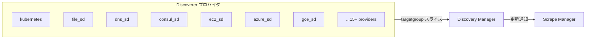
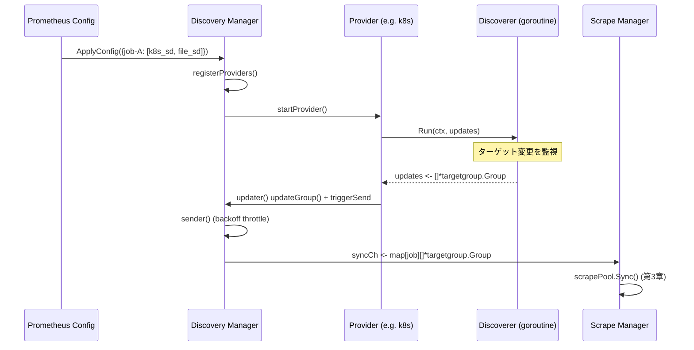

# 第4章 サービスディスカバリー

> 本章で読むソース
>
> - [`discovery/discovery.go`](https://github.com/prometheus/prometheus/blob/v3.12.0/discovery/discovery.go)
> - [`discovery/manager.go`](https://github.com/prometheus/prometheus/blob/v3.12.0/discovery/manager.go)
> - [`discovery/targetgroup/targetgroup.go`](https://github.com/prometheus/prometheus/blob/v3.12.0/discovery/targetgroup/targetgroup.go)

## この章の狙い

Prometheus がスクレイプ対象のリストを動的に取得する仕組みを理解する。
サービスディスカバリーは設定ファイルの静的ターゲットだけでなく、クラウドや DNS、Kubernetes などの外部システムからターゲットを自動検出する手段を提供する。

## 前提

第3章で Manager が `targetgroup.Group` のチャネルを受け取り、scrapePool を構成することを説明した。
本章ではそのチャネルの送り手側を扱う。

## パイプラインの全体像

サービスディスカバリーは**Discoverer**インターフェースを実装したプロバイダ群と、それらを束ねる**Manager**から構成される。



各プロバイダは独立したゴルーチンで動作し、ターゲットの変更を検出するとチャネルに **targetgroup.Group** のスライスを送信する。
Discovery Manager はすべてのプロバイダからの更新を集約し、ジョブ名でグループ化して Scrape Manager へ送る。

## Discoverer インターフェース

`discovery` パッケージの中心は `Discoverer` インターフェースである。

[`discovery/discovery.go L27-L40`](https://github.com/prometheus/prometheus/blob/v3.12.0/discovery/discovery.go#L27-L40)

```go
// Discoverer provides information about target groups. It maintains a set
// of sources from which TargetGroups can originate. Whenever a discovery provider
// detects a potential change, it sends the TargetGroup through its channel.
//
// Discoverer does not know if an actual change happened.
// It does guarantee that it sends the new TargetGroup whenever a change happens.
//
// Discoverers should initially send a full set of all discoverable TargetGroups.
type Discoverer interface {
	// Run hands a channel to the discovery provider (Consul, DNS, etc.) through which
	// it can send updated target groups. It must return when the context is canceled.
	// It should not close the update channel on returning.
	Run(ctx context.Context, up chan<- []*targetgroup.Group)
}
```

`Run()` はコンテキストと出力チャネルを受け取り、ターゲットグループの更新を送信し続ける。
コンテキストがキャンセルされると終了する。
チャネルをクローズしてはならないという規約がある（コメント "It should not close the update channel on returning"）。

## Config インターフェース

設定オブジェクトは `Config` インターフェースを実装する。

[`discovery/discovery.go L95-L106`](https://github.com/prometheus/prometheus/blob/v3.12.0/discovery/discovery.go#L95-L106)

```go
// A Config provides the configuration and constructor for a Discoverer.
type Config interface {
	// Name returns the name of the discovery mechanism.
	Name() string

	// NewDiscoverer returns a Discoverer for the Config
	// with the given DiscovererOptions.
	NewDiscoverer(DiscovererOptions) (Discoverer, error)

	// NewDiscovererMetrics returns the metrics used by the service discovery.
	NewDiscovererMetrics(prometheus.Registerer, RefreshMetricsInstantiator) DiscovererMetrics
}
```

`Name()` はディスカバリーの種類を識別する文字列（`"kubernetes"`, `"file"`, `"dns"` など）を返す。
`NewDiscoverer()` は設定から Discoverer インスタンスを生成する。

`Configs`（`discovery/discovery.go L110`）は `[]Config` のエイリアスであり、YAML の `unmarshal` 時にリフレクションを使って各ディスカバリー固有の設定構造体に振り分ける。

### 登録機構

各ディスカバリープロバイダは `init()` 関数で `discovery.RegisterDiscoverer()` を呼び出して自身を登録する。
登録は `discovery/registry.go` の内部マップに格納され、YAML のマーシャリング時に型名から設定構造体を解決する。

```go
// registry.go (概念)
var configs = map[string]Config{}

func RegisterDiscoverer(config Config) {
    configs[config.Name()] = config
}
```

## targetgroup.Group

ディスカバリーとスクレイプマネージャの間でやり取りされるデータ構造が **targetgroup.Group** である。

[`discovery/targetgroup/targetgroup.go L23-L33`](https://github.com/prometheus/prometheus/blob/v3.12.0/discovery/targetgroup/targetgroup.go#L23-L33)

```go
// Group is a set of targets with a common label set(production , test, staging etc.).
type Group struct {
	// Targets is a list of targets identified by a label set. Each target is
	// uniquely identifiable in the group by its address label.
	Targets []model.LabelSet
	// Labels is a set of labels that is common across all targets in the group.
	Labels model.LabelSet

	// Source is an identifier that describes a group of targets.
	Source string
}
```

`Targets` はターゲットごとのラベルセットのリストである。
各ターゲットには最低限 `__address__` ラベルが含まれる。

`Labels` はグループ内の全ターゲットに共通のラベルセットである。
例えば Kubernetes の namespace ラベルなどがここに入る。

`Source` はターゲットグループを一意に識別する文字列であり、更新の差分検出に使われる。

YAML との相互変換では、`targets` フィールドは文字列のリスト（各要素はアドレス）として表現される。
`UnmarshalYAML()` はこれを自動的に `[]model.LabelSet` に変換する（`L40-L56`）。

## Manager

Discovery Manager はすべてのプロバイダを統括する。

[`discovery/manager.go L170-L205`](https://github.com/prometheus/prometheus/blob/v3.12.0/discovery/manager.go#L170-L205)

```go
// Manager maintains a set of discovery providers and sends each update to a map channel.
// Targets are grouped by the target set name.
type Manager struct {
	logger   *slog.Logger
	name     string
	httpOpts []config.HTTPClientOption
	mtx      sync.RWMutex
	ctx      context.Context

	// Some Discoverers(e.g. k8s) send only the updates for a given target group,
	// so we use map[tg.Source]*targetgroup.Group to know which group to update.
	targets    map[poolKey]map[string]*targetgroup.Group
	targetsMtx sync.Mutex

	// providers keeps track of SD providers.
	providers []*Provider
	// The sync channel sends the updates as a map where the key is the job value from the scrape config.
	syncCh chan map[string][]*targetgroup.Group

	// How long to wait before sending updates to the channel. The variable
	// should only be modified in unit tests.
	updatert time.Duration

	// The triggerSend channel signals to the Manager that new updates have been received from providers.
	triggerSend chan struct{}

	// lastProvider counts providers registered during Manager's lifetime.
	lastProvider uint

	// A registerer for all service discovery metrics.
	registerer prometheus.Registerer

	metrics   *Metrics
	sdMetrics *SDMetrics

	// featureRegistry is used to track which service discovery providers are configured.
	featureRegistry features.Collector
}
```

### Provider

プロバイダは `Provider` 構造体でラップされる。

[`discovery/manager.go L40-L54`](https://github.com/prometheus/prometheus/blob/v3.12.0/discovery/manager.go#L40-L54)

```go
// Provider holds a Discoverer instance, its configuration, cancel func and its subscribers.
type Provider struct {
	name   string
	d      Discoverer
	config any

	cancel context.CancelFunc
	// done should be called after cleaning up resources associated with cancelled provider.
	done func()

	mu   sync.RWMutex
	subs map[string]struct{}

	// newSubs is used to temporary store subs to be used upon config reload completion.
	newSubs map[string]struct{}
}
```

`subs` はこのプロバイダを購読しているジョブ名の集合である。
一つのプロバイダ（例えば同一の Kubernetes クラスタ設定）が複数のジョブから参照される場合、`subs` に複数のジョブ名が入る。

### Manager.Run()

Manager のエントリポイントは `Run()` である。
`sender()` ゴルーチンを起動し、コンテキストのキャンセルを待つ。

[`discovery/manager.go L219-L225`](https://github.com/prometheus/prometheus/blob/v3.12.0/discovery/manager.go#L219-L225)

```go
// Run starts the background processing.
func (m *Manager) Run() error {
	go m.sender()
	<-m.ctx.Done()
	m.cancelDiscoverers()
	return m.ctx.Err()
}
```

### SyncCh()

Scrape Manager は `SyncCh()` を通じてターゲット更新を受け取る。

[`discovery/manager.go L227-L230`](https://github.com/prometheus/prometheus/blob/v3.12.0/discovery/manager.go#L227-L230)

```go
// SyncCh returns a read only channel used by all the clients to receive target updates.
func (m *Manager) SyncCh() <-chan map[string][]*targetgroup.Group {
	return m.syncCh
}
```

### ApplyConfig()

`ApplyConfig()` は設定の変更時に新しいプロバイダを起動し、不要になったプロバイダを停止する。

[`discovery/manager.go L234-L333`](https://github.com/prometheus/prometheus/blob/v3.12.0/discovery/manager.go#L234-L333)

```go
func (m *Manager) ApplyConfig(cfg map[string]Configs) error {
	m.mtx.Lock()
	defer m.mtx.Unlock()

	var failedCount int
	for name, scfg := range cfg {
		failedCount += m.registerProviders(scfg, name)
	}
	m.metrics.FailedConfigs.Set(float64(failedCount))

	var (
		wg           sync.WaitGroup
		newProviders []*Provider
	)
	for _, prov := range m.providers {
		// ... (中略) ...
	}
	// Currently downstream managers expect full target state upon config reload, so we must oblige.
	// While startProvider does pull the trigger, it may take some time to do so, therefore
	// we pull the trigger as soon as possible so that downstream managers can populate their state.
	// See https://github.com/prometheus/prometheus/pull/8639 for details.
	// This also helps making the downstream managers drop stale targets as soon as possible.
	// See https://github.com/prometheus/prometheus/pull/13147 for details.
	if len(m.providers) > 0 {
		select {
		case m.triggerSend <- struct{}{}:
		default:
		}
	}
	m.providers = newProviders
	wg.Wait()

	return nil
}
```

`ApplyConfig()` は与えられた設定に基づいてプロバイダを起動・停止する。
設定が空のジョブに対しては `StaticConfig{{}}`（空のターゲットグループ）が追加される（`L569`）。
これにより該当ジョブの scrapePool は空のターゲットリストで更新され、既存のターゲットが確実に削除される。

### startProvider()

`startProvider()` はプロバイダの Discoverer を起動し、その更新チャネルを受け取る `updater()` ゴルーチンを開始する。

[`discovery/manager.go L350-L361`](https://github.com/prometheus/prometheus/blob/v3.12.0/discovery/manager.go#L350-L361)

```go
func (m *Manager) startProvider(ctx context.Context, p *Provider) {
	m.logger.Debug("Starting provider", "provider", p.name, "subs", fmt.Sprintf("%v", p.subs))
	ctx, cancel := context.WithCancel(ctx)
	updates := make(chan []*targetgroup.Group)

	p.mu.Lock()
	p.cancel = cancel
	p.mu.Unlock()

	go p.d.Run(ctx, updates)
	go m.updater(ctx, p, updates)
}
```

### updater()

`updater()` はプロバイダからの更新を受信し、`updateGroup()` で内部マップを更新してから `triggerSend` チャネルに通知する。

[`discovery/manager.go L381-L409`](https://github.com/prometheus/prometheus/blob/v3.12.0/discovery/manager.go#L381-L409)

```go
func (m *Manager) updater(ctx context.Context, p *Provider, updates chan []*targetgroup.Group) {
	// Ensure targets from this provider are cleaned up.
	defer m.cleaner(p)
	for {
		select {
		case <-ctx.Done():
			return
		case tgs, ok := <-updates:
			m.metrics.ReceivedUpdates.Inc()
			if !ok {
				m.logger.Debug("Discoverer channel closed", "provider", p.name)
				// Wait for provider cancellation to ensure targets are cleaned up when expected.
				<-ctx.Done()
				return
			}

			p.mu.RLock()
			for s := range p.subs {
				m.updateGroup(poolKey{setName: s, provider: p.name}, tgs)
			}
			p.mu.RUnlock()

			select {
			case m.triggerSend <- struct{}{}:
			default:
			}
		}
	}
}
```

### sender()

[`discovery/manager.go L411-L452`](https://github.com/prometheus/prometheus/blob/v3.12.0/discovery/manager.go#L411-L452)

`sender()` は `triggerSend` を受け取ると、指数バックオフ間隔を考慮しながら `syncCh` へ全ターゲットグループのマップを送信する。

```go
func (m *Manager) sender() {
	defer func() {
		close(m.syncCh)
	}()
	// Some discoverers send updates too often, so we throttle these with a backoff interval that
	// increases the interval up to m.updatert delay.
	lastSent := time.Now().Add(-1 * m.updatert)
	b := &backoff.ExponentialBackOff{
		InitialInterval:     100 * time.Millisecond,
		RandomizationFactor: backoff.DefaultRandomizationFactor,
		Multiplier:          backoff.DefaultMultiplier,
		MaxInterval:         m.updatert,
	}

	for {
		select {
		case <-m.ctx.Done():
			return
		case <-time.After(b.NextBackOff()):
			select {
			case <-m.triggerSend:
				m.metrics.SentUpdates.Inc()
				select {
				case m.syncCh <- m.allGroups():
					lastSent = time.Now()
				default:
					m.metrics.DelayedUpdates.Inc()
					m.logger.Debug("Discovery receiver's channel was full so will retry the next cycle")
					// Ensure we don't miss this update.
					select {
					case m.triggerSend <- struct{}{}:
					default:
					}
				}
			default:
			}
			if time.Since(lastSent) > m.updatert {
				b.Reset() // Nothing happened for a while, start again from low interval for prompt updates.
			}
		}
	}
}
```

バックオフは `InitialInterval = 100ms` から始まり、`MaxInterval = updatert`（デフォルト5秒）まで増加する。
長時間更新がない場合は `b.Reset()` で初期値に戻る。
これにより高頻度で更新が来るプロバイダのバーストを吸収する。

`syncCh` の受信側が満杯の場合、`DelayedUpdates` カウンタがインクリメントされ、更新は再送される。
これによりブロッキングを回避する。

### allGroups()

[`discovery/manager.go L488-L521`](https://github.com/prometheus/prometheus/blob/v3.12.0/discovery/manager.go#L488-L521)

`allGroups()` は全プロバイダの全ターゲットグループをジョブ名でグループ化して返す。

```go
func (m *Manager) allGroups() map[string][]*targetgroup.Group {
	tSets := map[string][]*targetgroup.Group{}
	n := map[string]int{}

	m.mtx.RLock()
	for _, p := range m.providers {
		p.mu.RLock()
		m.targetsMtx.Lock()
		for s := range p.subs {
			// Send empty lists for subs without any targets to make sure old stale targets are dropped by consumers.
			// See: https://github.com/prometheus/prometheus/issues/12858 for details.
			if _, ok := tSets[s]; !ok {
				tSets[s] = []*targetgroup.Group{}
				n[s] = 0
			}
			if tsets, ok := m.targets[poolKey{s, p.name}]; ok {
				for _, tg := range tsets {
					tSets[s] = append(tSets[s], tg)
					n[s] += len(tg.Targets)
				}
			}
		}
		m.targetsMtx.Unlock()
		p.mu.RUnlock()
	}
	m.mtx.RUnlock()

	for setName, v := range n {
		m.metrics.DiscoveredTargets.WithLabelValues(setName).Set(float64(v))
		m.metrics.LastUpdated.WithLabelValues(setName).SetToCurrentTime()
	}

	return tSets
}
```

購読者がいるジョブには空リストが必ず送られる。
これはプロバイダが全ターゲットを失った場合でも、Scrape Manager が古いターゲットをクリーンアップできるようにするための設計である。

## StaticConfig

最も単純なディスカバリーは **StaticConfig** である。

[`discovery/discovery.go L150-L164`](https://github.com/prometheus/prometheus/blob/v3.12.0/discovery/discovery.go#L150-L164)

```go
// A StaticConfig is a Config that provides a static list of targets.
type StaticConfig []*targetgroup.Group

// Name returns the name of the service discovery mechanism.
func (StaticConfig) Name() string { return "static" }

// NewDiscoverer returns a Discoverer for the Config.
func (c StaticConfig) NewDiscoverer(DiscovererOptions) (Discoverer, error) {
	return staticDiscoverer(c), nil
}

// NewDiscovererMetrics returns NoopDiscovererMetrics because no metrics are
// needed for this service discovery mechanism.
func (StaticConfig) NewDiscovererMetrics(prometheus.Registerer, RefreshMetricsInstantiator) DiscovererMetrics {
	return &NoopDiscovererMetrics{}
}
```

[`discovery/discovery.go L168-L175`](https://github.com/prometheus/prometheus/blob/v3.12.0/discovery/discovery.go#L168-L175)

`staticDiscoverer.Run()` はターゲットグループを一度だけチャネルに送信して終了する。

```go
func (c staticDiscoverer) Run(ctx context.Context, up chan<- []*targetgroup.Group) {
	// TODO: existing implementation closes up chan, but documentation explicitly forbids it...?
	defer close(up)
	select {
	case <-ctx.Done():
	case up <- c:
	}
}
```

## プロバイダ一覧（v3.12.0）

Prometheus v3.12.0 は以下のプロバイダを標準搭載する。

| プロバイダ | Config 型 | 特徴 |
|---|---|---|
| `static` | `StaticConfig` | 設定ファイルに直書きした固定ターゲット |
| `file_sd` | `file.SDConfig` | ファイルに書かれたターゲットリストを監視 |
| `dns_sd` | `dns.SDConfig` | DNS SRV レコードからターゲット解決 |
| `kubernetes` | `kubernetes.SDConfig` | Kubernetes API から Pod/Service/Node/Endpoint を検出 |
| `consul` | `consul.SDConfig` | Consul サービスカタログ |
| `ec2` | `aws.EC2SDConfig` | AWS EC2 インスタンス |
| `azure` | `azure.SDConfig` | Azure Virtual Machines / Scale Sets |
| `gce` | `gce.SDConfig` | Google Compute Engine |
| `openstack` | `openstack.SDConfig` | OpenStack インスタンス |
| `marathon` | `marathon.SDConfig` | Marathon アプリケーション |
| `eureka` | `eureka.SDConfig` | Netflix Eureka |
| `hetzner` | `hetzner.SDConfig` | Hetzner Cloud / Robot |
| `digitalocean` | `digitalocean.SDConfig` | DigitalOcean Droplets |
| `linode` | `linode.SDConfig` | Linode インスタンス |
| `dnsmasq` / `moby` / `docker` | 各種 | Docker / moby エンジン |
| `http_sd` | `http.SDConfig` | HTTP エンドポイントからターゲットリスト取得 |
| `nomad` | `nomad.SDConfig` | HashiCorp Nomad |
| `ionos` | `ionos.SDConfig` | IONOS Cloud API |
| `outscale` | `outscale.SDConfig` | Outscale インスタンス |
| `ovhcloud` | `ovhcloud.SDConfig` | OVHcloud |
| `puppetdb` | `puppetdb.SDConfig` | PuppetDB |
| `scaleway` | `scaleway.SDConfig` | Scaleway インスタンス |
| `triton` | `triton.SDConfig` | Triton コンテナ |
| `vultr` | `vultr.SDConfig` | Vultr インスタンス |
| `xds` | `xds.SDConfig` | xDS（Envoy 制御プレーン）|
| `uyuni` | `uyuni.SDConfig` | Uyuni サーバー管理 |
| `stackit` | `stackit.SDConfig` | STACKIT クラウド |
| `zookeeper` | `zookeeper.SDConfig` | ZooKeeper サーバーセット |

これらの多くは `refresh/` パッケージを内部で利用する。
`refresh.Discoverer` は定期的なポーリング（`RefreshInterval`）でターゲットリストを取得し、変更を検出する共通の仕組みを提供する。

## ディスカバリーパイプライン



プロバイダの Discoverer がターゲットの変更を検出すると、`targetgroup.Group` のスライスが updater ゴルーチンに届く。
updater は内部マップを更新し、`triggerSend` チャネルに通知する。
sender ゴルーチンはバックオフで間引きながら `syncCh` に全ターゲットグループを送信する。
Scrape Manager はこれを受け取り、scrapePool の Sync を実行する。

## まとめ

サービスディスカバリーは `Discoverer` インターフェースで抽象化され、20種類以上のプロバイダがプラグイン方式で実装されている。
Discovery Manager はすべてのプロバイダの出力を集約し、バックオフによるスロットルをかけながら Scrape Manager へ渡す。
StaticConfig は一度だけ送信して終了する最も単純なプロバイダであり、設定ファイルの静的ターゲットを表現する。
更新のバースト吸収や空グループの明示的送信により、Scrape Manager 側の負荷を抑えながら正確なターゲット状態を維持する設計になっている。

## 関連する章

- 第2章（設定と起動フロー）: Discovery Manager の起動と Scrape Manager への接続
- 第3章（スクレイピング機構）: ターゲットグループの受け取りと scrapePool への反映
