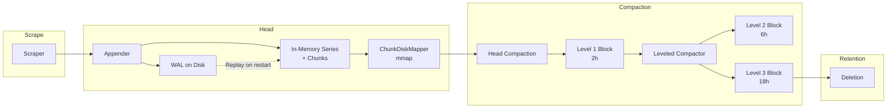

# 第5章 TSDB アーキテクチャ

> **本章で読むソース**
>
> - [`tsdb/db.go`](https://github.com/prometheus/prometheus/blob/v3.12.0/tsdb/db.go)
> - [`tsdb/block.go`](https://github.com/prometheus/prometheus/blob/v3.12.0/tsdb/block.go)
> - [`tsdb/options.go`](https://github.com/prometheus/prometheus/blob/v3.12.0/tsdb/options.go)（Options は `db.go` 内で定義）

## この章の狙い

Prometheus の時系列データベース（TSDB）全体の構造を把握する。
DB の起動からデータの流れ、コンパクション、リテンションまでのライフサイクルを概観し、以降の章で扱う Head、ブロック、コンパクション、クエリに対する地図を提供する。

## 前提

第1章で概観したアーキテクチャのうち、ストレージ層の詳細に入る。
HTTP サーバーやスクレイパーから渡されたサンプルが、どのような経路でディスクに保存され、検索可能になるかを追う。

## DB 構造体と起動

TSDB の中核は `tsdb/db.go` の **DB 構造体**（`tsdb/db.go:291`）である。
DB は以下のフィールドで構成される。

```go
// tsdb/db.go:291-352
type DB struct {
    dir    string
    locker *tsdbutil.DirLocker
    logger         *slog.Logger
    metrics        *dbMetrics
    opts           *Options
    chunkPool      chunkenc.Pool
    compactor      Compactor
    blocksToDelete BlocksToDeleteFunc

    mtx    sync.RWMutex
    blocks []*Block

    lastGarbageCollectedMmapRef chunks.ChunkDiskMapperRef

    head *Head

    compactc chan struct{}
    donec    chan struct{}
    stopc    chan struct{}

    cmtx sync.Mutex
    autoCompactMtx sync.Mutex
    autoCompact    bool
    retentionMtx sync.RWMutex
    compactCancel context.CancelFunc

    oooWasEnabled atomic.Bool
    lastHeadCompactionTime time.Time

    writeNotified wlog.WriteNotified
    registerer prometheus.Registerer

    blockQuerierFunc BlockQuerierFunc
    blockChunkQuerierFunc BlockChunkQuerierFunc
    fsSizeFunc FsSizeFunc
}
```

DB は大きく **Head**（メモリー上のアクティブなデータ）、**Blocks**（ディスク上の不変ブロック列）、**Compactor**（ブロックを統合するコンパクター）の3要素で構成される。

起動は `Open()`（`tsdb/db.go:868`）から始まる。
`Open()` 内の `open()`（`tsdb/db.go:934`）が実際の初期化を実行する。

```go
// tsdb/db.go:934
func open(dir string, l *slog.Logger, r prometheus.Registerer, opts *Options, rngs []int64, stats *DBStats) (_ *DB, returnedErr error) {
// ... (中略) ...
```

起動の流れは次の通りである。

1. ディレクトリ作成とロックファイルの獲得
2. WAL（Write Ahead Log）と WBL（Write Behind Log）のオープン
3. Head の作成（`NewHead()`）
4. `reload()` による既存ブロックの読み込み
5. `head.Init()` による WAL/WBL のリプレイ
6. バックグラウンド goroutine `db.run()` の起動

`db.run()`（`tsdb/db.go:1188`）は `BlockReloadInterval`（デフォルト1分）ごとに `reloadBlocks()` を実行し、新しく作成されたブロックを検出してロードする。

## Options

Options（`tsdb/db.go:102-277`）は TSDB の動作を制御する設定構造体である。
主要なパラメーターを以下に示す。

- **RetentionDuration**: データ保持期間（デフォルト15日）
- **MinBlockDuration / MaxBlockDuration**: 最小・最大ブロック時間幅（デフォルト2時間）
- **StripeSize**: Head の系列ハッシュマップのサイズ
- **SamplesPerChunk**: 1チャンクあたりの目標サンプル数（デフォルト120）
- **WALCompression**: WAL の圧縮方式
- **OutOfOrderTimeWindow**: 許容する追い書き時間窓
- **EnableExemplarStorage**: エグゼンプラー保存の有効化
- **EnableMemorySnapshotOnShutdown**: シャットダウン時にメモリーチャンクをスナップショット

## データの流れ

スクレイプされたサンプルは次の経路でディスクに永続化される。



1. スクレイパーがサンプルを **Head** の Appender に送る
2. Appender は WAL に書き込み、同時にメモリー上の系列とチャンクを更新する
3. チャンクが満杯になると **ChunkDiskMapper** によって mmap ファイルに追い出される
4. Head が一定時間経過すると **Head Compaction** により Level 1 ブロック（2時間）としてディスクに書き出される
5. **Leveled Compactor** が複数のブロックを統合し、より大きなブロック（Level 2: 6時間、Level 3: 18時間、...）にコンパクションする
6. リテンション期間を過ぎたブロックは削除される

## Compactor

Compactor インターフェース（`tsdb/compact.go:54-77`）は Plan と Compact の2つを定義する。
Plan はコンパクションすべきブロックディレクトリを返し、Compact が実際の統合を実行する。

LeveledCompactor（`tsdb/compact.go:80-93`）は `ranges` フィールドで指数関数的なブロックサイズを持つ。
`ranges` は `ExponentialBlockRanges()`（`tsdb/compact.go:41-49`）で生成される。デフォルトでは 2時間 × 3^ステップ で [2h, 6h, 18h, 54h, ...] となる。

## ブロックの読み込み

ブロックは `OpenBlock()`（`tsdb/block.go:339-390`）で開かれる。
Block 構造体（`tsdb/block.go:313-335`）は以下の読み取りインターフェースを保持する。

- **IndexReader**: ラベルとポスティングの索引
- **ChunkReader**: チャンクデータの読み出し
- **Tombstones.Reader**: 削除マーカー

Block は不変（immutable）であり、いったんディスクに書き込まれると変更されない。
削除はトゥームストーンとして記録され、次のコンパクションで物理的に除去される。

## まとめ

TSDB は Head（メモリー）＋ Blocks（ディスク）＋ Compactor の3層で構成される。
データは Head で受け付けられ、時間経過とともにブロックへとコンパクションされ、リテンションに従って削除される。
このアーキテクチャにより、Prometheus はスクレイプされた大量のサンプルを効率的に保存し、古いデータを自動的に整理できる。

## 関連する章

- 第6章 Head と WAL（Head の内部構造と WAL の詳細）
- 第7章 ブロックフォーマットとコンパクション（ブロックの物理フォーマットとコンパクション戦略）
- 第8章 クエリと読み出し（保存されたデータの検索方法）
