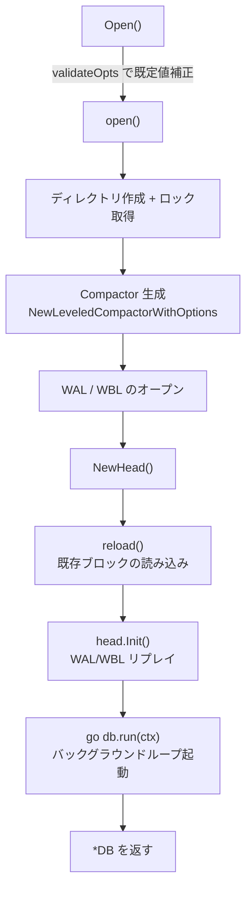
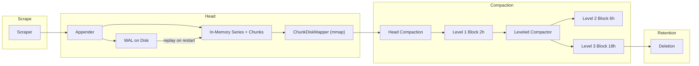

# 第5章 TSDB アーキテクチャ

> 本章で読むソース
>
> - [`tsdb/db.go`](https://github.com/prometheus/prometheus/blob/v3.12.0/tsdb/db.go)
> - [`tsdb/block.go`](https://github.com/prometheus/prometheus/blob/v3.12.0/tsdb/block.go)
> - [`tsdb/compact.go`](https://github.com/prometheus/prometheus/blob/v3.12.0/tsdb/compact.go)

## この章の狙い

Prometheus の時系列データベース（**TSDB**）全体の構造とライフサイクルを把握する。
`DB` 構造体がどのフィールドで何を束ねているか、起動時にどの順序で各コンポーネントを初期化するか、バックグラウンドのゴルーチンがどのようにコンパクションとリテンションを駆動するかを、入口関数から順に追う。
本章は Head、ブロック、コンパクション、クエリを扱う以降の章に対する地図を提供する層に集中し、各コンポーネントの内部詳細には踏み込まない。

## 前提

第1章で概観したアーキテクチャのうち、ストレージ層の骨格に入る。
第3章で追ったスクレイプ結果は Head の Appender へ渡され、そこから WAL とメモリー上の系列に書き込まれる。
本章はその受け皿となる `DB` が、メモリー上の Head とディスク上のブロック列をどう管理し、時間経過に沿ってデータをどこへ移すかを扱う。

## DB 構造体

TSDB の中核は `tsdb/db.go` の `DB` 構造体である。

[`tsdb/db.go L291-L352`](https://github.com/prometheus/prometheus/blob/v3.12.0/tsdb/db.go#L291-L352)

```go
type DB struct {
	dir    string
	locker *tsdbutil.DirLocker

	logger         *slog.Logger
	metrics        *dbMetrics
	opts           *Options
	chunkPool      chunkenc.Pool
	compactor      Compactor
	blocksToDelete BlocksToDeleteFunc

	// mtx must be held when modifying the general block layout or lastGarbageCollectedMmapRef.
	mtx    sync.RWMutex
	blocks []*Block

	// ... (中略) ...

	head *Head

	compactc chan struct{}
	donec    chan struct{}
	stopc    chan struct{}

	// cmtx ensures that compactions and deletions don't run simultaneously.
	cmtx sync.Mutex

	// ... (中略) ...

	// lastHeadCompactionTime is the last wall clock time when the head block compaction was started,
	// irrespective of success or failure. This does not include out-of-order compaction and stale series compaction.
	lastHeadCompactionTime time.Time

	// ... (中略) ...
}
```

`DB` は大きく3つの要素を束ねる。
`head` はメモリー上のアクティブなデータを保持する **Head** である。
`blocks` はディスク上の不変ブロック列であり、`mtx` で保護される。
`compactor` は複数のブロックを1つに統合する **Compactor** である。

残りのフィールドは制御用である。
`compactc` はコンパクション要求を伝えるチャネルであり、`stopc` と `donec` はシャットダウンの合図と完了通知に使う。
`cmtx` はコンパクションと削除が同時に走らないことを保証するミューテックスであり、コメント「cmtx ensures that compactions and deletions don't run simultaneously」がその役割を示す。
`chunkPool` はチャンクのバイトスライスを再利用するプールであり、後述の最適化で用いる。

## Options

`DB` の動作は `Options` 構造体で制御する。

[`tsdb/db.go L118-L157`](https://github.com/prometheus/prometheus/blob/v3.12.0/tsdb/db.go#L118-L157)

```go
	// Duration of persisted data to keep.
	// Unit agnostic as long as unit is consistent with MinBlockDuration and MaxBlockDuration.
	// Typically it is in milliseconds.
	RetentionDuration int64

	// ... (中略) ...

	// The timestamp range of head blocks after which they get persisted.
	// It's the minimum duration of any persisted block.
	// Unit agnostic as long as unit is consistent with RetentionDuration and MaxBlockDuration.
	// Typically it is in milliseconds.
	MinBlockDuration int64

	// The maximum timestamp range of compacted blocks.
	// Unit agnostic as long as unit is consistent with MinBlockDuration and RetentionDuration.
	// Typically it is in milliseconds.
	MaxBlockDuration int64
```

主要なパラメーターと `DefaultOptions()` が与える既定値は次のとおりである。

- **RetentionDuration**：データ保持期間で既定は15日
- **MinBlockDuration / MaxBlockDuration**：永続化されるブロックの最小と最大の時間幅で既定はいずれも2時間
- **StripeSize**：Head の系列ハッシュマップのサイズ
- **SamplesPerChunk**：1チャンクあたりの目標サンプル数で既定は120
- **WALCompression**：WAL レコードの圧縮方式
- **OutOfOrderTimeWindow**：許容する追い書き（out of order）の時間窓
- **BlockReloadInterval**：バックグラウンドでブロックを再読み込みする間隔で既定は1分

これらの既定値は `DefaultOptions()`（`tsdb/db.go` L76-L99）で与えられ、`validateOpts()` が範囲外の値を補正する。

## 起動シーケンス

`DB` の起動は入口関数 `Open()` から始まり、実初期化を担う `open()` へ委譲される。



### 入口関数 Open

`Open()` は `Options` を検証し、ブロックの時間幅の候補列 `rngs` を確定してから `open()` を呼ぶ。

[`tsdb/db.go L868-L884`](https://github.com/prometheus/prometheus/blob/v3.12.0/tsdb/db.go#L868-L884)

```go
func Open(dir string, l *slog.Logger, r prometheus.Registerer, opts *Options, stats *DBStats) (db *DB, err error) {
	var rngs []int64
	opts, rngs = validateOpts(opts, nil)

	// Register TSDB features if a registry is provided.
	if opts.FeatureRegistry != nil {
		// ... (中略) ...
	}

	return open(dir, l, r, opts, rngs, stats)
}
```

`rngs` は `validateOpts()` の中で `ExponentialBlockRanges(opts.MinBlockDuration, 10, 3)` として生成される。
これはコンパクション後のブロックが取りうる時間幅の階層であり、後述の Compactor がこの列に沿ってブロックを統合する。

### 初期化本体 open

`open()` はまずディレクトリを作り、`DB` の値を組み立てる。

[`tsdb/db.go L971-L997`](https://github.com/prometheus/prometheus/blob/v3.12.0/tsdb/db.go#L971-L997)

```go
	db := &DB{
		dir:            dir,
		logger:         l,
		opts:           opts,
		compactc:       make(chan struct{}, 1),
		donec:          make(chan struct{}),
		stopc:          make(chan struct{}),
		autoCompact:    true,
		chunkPool:      chunkenc.NewPool(),
		blocksToDelete: opts.BlocksToDelete,
		registerer:     r,
	}
	defer func() {
		// Close files if startup fails somewhere.
		if returnedErr == nil {
			return
		}

		close(db.donec) // DB is never run if it was an error, so close this channel here.
		if err := db.Close(); err != nil {
			returnedErr = errors.Join(returnedErr, fmt.Errorf("close DB after failed startup: %w", err))
		}
	}()

	if db.blocksToDelete == nil {
		db.blocksToDelete = DefaultBlocksToDelete(db)
	}
```

`compactc` はバッファサイズ1のチャネルとして作られる。
起動途中でエラーが起きた場合は `defer` 内で `donec` を閉じてから `Close()` を呼び、開いたファイルを片付ける。

このあと `open()` はロックファイルを取得し、`NewLeveledCompactorWithOptions()` で Compactor を生成し、WAL と WBL をオープンして `NewHead()` で Head を作る。
これらを済ませたのち、既存ブロックの読み込みと WAL リプレイ、バックグラウンドループ起動に進む。

[`tsdb/db.go L1110-L1160`](https://github.com/prometheus/prometheus/blob/v3.12.0/tsdb/db.go#L1110-L1160)

```go
	// Calling db.reload() calls db.reloadBlocks() which requires cmtx to be locked.
	db.cmtx.Lock()
	if err := db.reload(); err != nil {
		db.cmtx.Unlock()
		return nil, err
	}
	db.cmtx.Unlock()

	// Set the min valid time for the ingested samples
	// to be no lower than the maxt of the last block.
	minValidTime := int64(math.MinInt64)
	// ... (中略) ...
	inOrderMaxTime, ok := db.inOrderBlocksMaxTime()
	if ok {
		minValidTime = inOrderMaxTime
	}

	if initErr := db.head.Init(minValidTime); initErr != nil {
		db.head.metrics.walCorruptionsTotal.Inc()
		var e *errLoadWbl
		if errors.As(initErr, &e) {
			db.logger.Warn("Encountered WBL read error, attempting repair", "err", initErr)
			if err := wbl.Repair(e.err); err != nil {
				return nil, fmt.Errorf("repair corrupted WBL: %w", err)
			}
			db.logger.Info("Successfully repaired WBL")
		} else {
			// ... (中略) ...
		}
	}

	// ... (中略) ...

	go db.run(ctx)

	return db, nil
}
```

この後半に、起動が分岐する要点が二つ現れる。
一つは `db.reload()` である。
`reload()` はディスク上の既存ブロックディレクトリを走査して読み込むため、まっさらな新規ディレクトリでは何も読み込まず、既存のデータディレクトリからの再起動ではそこにあるブロック群を復元する。
もう一つは Head の起点となる `minValidTime` である。
既存ブロックがあれば、その最大時刻 `inOrderMaxTime` を Head が受け付ける最小有効時刻に設定し、ブロックへ既に永続化した時間帯のサンプルを Head が二重に取り込まないようにする。
`db.head.Init(minValidTime)` が WAL と WBL をリプレイしてメモリー上の系列を復元し、破損を検出した場合は `Repair()` で修復を試みる。
最後に `go db.run(ctx)` でバックグラウンドループを起動してから `*DB` を返す。

## バックグラウンドループ run

`run()` は `DB` の寿命のあいだ回り続けるゴルーチンであり、定期的なブロック再読み込みとコンパクションを駆動する。

[`tsdb/db.go L1188-L1256`](https://github.com/prometheus/prometheus/blob/v3.12.0/tsdb/db.go#L1188-L1256)

```go
func (db *DB) run(ctx context.Context) {
	defer close(db.donec)

	backoff := time.Duration(0)

	for {
		select {
		case <-db.stopc:
			return
		case <-time.After(backoff):
		}

		select {
		case <-time.After(db.opts.BlockReloadInterval):
			db.cmtx.Lock()
			if err := db.reloadBlocks(); err != nil {
				db.logger.Error("reloadBlocks", "err", err)
			}
			db.cmtx.Unlock()

			select {
			case db.compactc <- struct{}{}:
			default:
			}
			// We attempt mmapping of head chunks regularly.
			db.head.mmapHeadChunks()

			// ... (中略：stale series 比率が閾値を超えたら即時コンパクション) ...

		case <-db.compactc:
			db.metrics.compactionsTriggered.Inc()

			db.autoCompactMtx.Lock()
			if db.autoCompact {
				if err := db.Compact(ctx); err != nil {
					db.logger.Error("compaction failed", "err", err)
					backoff = exponential(backoff, 1*time.Second, 1*time.Minute)
				} else {
					backoff = 0
				}
			} else {
				db.metrics.compactionsSkipped.Inc()
			}
			db.autoCompactMtx.Unlock()
		case <-db.stopc:
			return
		}
	}
}
```

ループは二つのタイマー起点で動く。
一つは `BlockReloadInterval`（既定1分）ごとのタイマーであり、発火すると `reloadBlocks()` で新しく現れたブロックを取り込み、続いて `compactc` へ非ブロッキングで合図を送る。
`compactc` はバッファサイズ1なので、すでに合図が積まれていれば `default` 節で捨てられ、要求が溜まりすぎない。
もう一つの起点が `compactc` の受信であり、`autoCompact` が有効なら `db.Compact(ctx)` を呼ぶ。
コンパクションが失敗すると `backoff` を指数的に伸ばし、ループ先頭の `time.After(backoff)` で次の反復を遅らせる。
成功すると `backoff` を 0 に戻す。

## Compact の全体制御

`Compact()` は Head のコンパクションとブロックのコンパクションを一つの流れに束ねる。

[`tsdb/db.go L1421-L1513`](https://github.com/prometheus/prometheus/blob/v3.12.0/tsdb/db.go#L1421-L1513)

```go
func (db *DB) Compact(ctx context.Context) (returnErr error) {
	db.cmtx.Lock()
	defer db.cmtx.Unlock()
	// ... (中略：失敗時のメトリクス計上) ...

	lastBlockMaxt := int64(math.MinInt64)
	defer func() {
		if err := db.head.truncateWAL(lastBlockMaxt); err != nil {
			returnErr = errors.Join(returnErr, fmt.Errorf("WAL truncation in Compact defer: %w", err))
		}
	}()

	start := time.Now()
	// Check whether we have pending head blocks that are ready to be persisted.
	// They have the highest priority.
	for {
		select {
		case <-db.stopc:
			return nil
		default:
		}

		if !db.head.compactable() {
			// ... (中略：遅延カウンターのリセット) ...
			break
		}

		// ... (中略：遅延判定) ...
		mint := db.head.MinTime()
		maxt := rangeForTimestamp(mint, db.head.chunkRange.Load())

		// Wrap head into a range that bounds all reads to it.
		rh := NewRangeHeadWithIsolationDisabled(db.head, mint, maxt-1)

		db.head.WaitForAppendersOverlapping(rh.MaxTime())

		if err := db.compactHead(rh); err != nil {
			return fmt.Errorf("compact head: %w", err)
		}
		// Consider only successful compactions for WAL truncation.
		lastBlockMaxt = maxt
	}

	// ... (中略：WAL 切り詰めと所要時間の警告) ...

	if lastBlockMaxt != math.MinInt64 {
		// The head was compacted, so we compact OOO head as well.
		if err := db.compactOOOHead(ctx); err != nil {
			return fmt.Errorf("compact ooo head: %w", err)
		}
	}

	return db.compactBlocks()
}
```

処理は3段からなる。
まず先頭の `for` ループが、`head.compactable()` が真である限り Head の古い時間帯を切り出してブロック化する。
`head.compactable()` は Head が保持する時間幅が `chunkRange`（既定2時間）の1.5倍を超えたときに真を返す判定であり、これが満たされる限りループは Head を2時間ずつブロックへ排出し続ける。
Head を切り出したあと、追い書きがあった場合は `compactOOOHead()` で out of order 用の Head も同様に処理する。
最後に `compactBlocks()` がディスク上のブロックどうしの統合を実行する。
`Compact()` 全体は `cmtx` を握るため、コンパクションと削除が同時に走らない。

### compactHead：Head からブロックへ

`compactHead()` は Head の指定範囲を Compactor でブロックに書き出し、再読み込みで反映する。

[`tsdb/db.go L1643-L1669`](https://github.com/prometheus/prometheus/blob/v3.12.0/tsdb/db.go#L1643-L1669)

```go
func (db *DB) compactHead(head *RangeHead) error {
	db.lastHeadCompactionTime = time.Now()

	uids, err := db.compactor.Write(db.dir, head, head.MinTime(), head.BlockMaxTime(), nil)
	if err != nil {
		return fmt.Errorf("persist head block: %w", err)
	}

	if err := db.reloadBlocks(); err != nil {
		errs := []error{
			fmt.Errorf("reloadBlocks blocks: %w", err),
		}
		for _, uid := range uids {
			if errRemoveAll := os.RemoveAll(filepath.Join(db.dir, uid.String())); errRemoveAll != nil {
				errs = append(errs, fmt.Errorf("delete persisted head block after failed db reloadBlocks:%s: %w", uid, errRemoveAll))
			}
		}
		return errors.Join(errs...)
	}
	if err = db.head.truncateMemory(head.BlockMaxTime()); err != nil {
		return fmt.Errorf("head memory truncate: %w", err)
	}

	db.head.RebuildSymbolTable(db.logger)

	return nil
}
```

`compactor.Write()` が新しいブロックをディスクへ書き出す。
書き出し後に `reloadBlocks()` を呼び、成功した場合のみ `truncateMemory()` で Head から永続化済みの時間帯を切り落とす。
`reloadBlocks()` が失敗したときは、書き出したブロックを `os.RemoveAll` で消してから合成エラーを返し、中途半端なブロックが残らないようにする。

### compactBlocks：ブロックどうしの統合

`compactBlocks()` は Compactor の `Plan()` が返す計画に従ってブロックを統合する。

[`tsdb/db.go L1728-L1770`](https://github.com/prometheus/prometheus/blob/v3.12.0/tsdb/db.go#L1728-L1770)

```go
func (db *DB) compactBlocks() (err error) {
	// Check for compactions of multiple blocks.
	for {
		// If we have a lot of blocks to compact the whole process might take
		// long enough that we end up with a HEAD block that needs to be written.
		// Check if that's the case and stop compactions early.
		if db.head.compactable() && !db.waitingForCompactionDelay() {
			db.logger.Warn("aborting block compactions to persist the head block")
			return nil
		}

		plan, err := db.compactor.Plan(db.dir)
		if err != nil {
			return fmt.Errorf("plan compaction: %w", err)
		}
		if len(plan) == 0 {
			break
		}

		// ... (中略：stopc の確認) ...

		uids, err := db.compactor.Compact(db.dir, plan, db.blocks)
		if err != nil {
			return fmt.Errorf("compact %s: %w", plan, err)
		}

		if err := db.reloadBlocks(); err != nil {
			// ... (中略：失敗時は書き出したブロックを削除) ...
			return errors.Join(errs...)
		}
	}

	return nil
}
```

ループの先頭で `head.compactable()` を再確認し、Head が新たにブロック化を要するほど溜まっていればブロック統合を打ち切る。
コメント「aborting block compactions to persist the head block」が示すとおり、Head の排出を優先し、ブロック統合が長引いて Head 側が滞るのを避ける。
`Plan()` が空を返せばループを抜ける。

### Compactor インターフェース

Compactor は3つのメソッドを持つ。

[`tsdb/compact.go L52-L77`](https://github.com/prometheus/prometheus/blob/v3.12.0/tsdb/compact.go#L52-L77)

```go
type Compactor interface {
	// Plan returns a set of directories that can be compacted concurrently.
	// The directories can be overlapping.
	// Results returned when compactions are in progress are undefined.
	Plan(dir string) ([]string, error)

	// Write persists one or more Blocks into a directory.
	// ... (中略) ...
	Write(dest string, b BlockReader, mint, maxt int64, base *BlockMeta) ([]ulid.ULID, error)

	// Compact runs compaction against the provided directories. Must
	// only be called concurrently with results of Plan().
	// ... (中略) ...
	Compact(dest string, dirs []string, open []*Block) ([]ulid.ULID, error)
}
```

`Plan()` は統合すべきブロックディレクトリの集合を返し、`Write()` は `BlockReader`（Head の範囲ビューを含む）を1つのブロックとして書き出し、`Compact()` は複数ディレクトリを統合する。
Prometheus の実装は `LeveledCompactor` である。

[`tsdb/compact.go L79-L93`](https://github.com/prometheus/prometheus/blob/v3.12.0/tsdb/compact.go#L79-L93)

```go
// LeveledCompactor implements the Compactor interface.
type LeveledCompactor struct {
	metrics                     *CompactorMetrics
	logger                      *slog.Logger
	ranges                      []int64
	chunkPool                   chunkenc.Pool
	ctx                         context.Context
	maxBlockChunkSegmentSize    int64
	useUncachedIO               bool
	mergeFunc                   storage.VerticalChunkSeriesMergeFunc
	blockExcludeFunc            BlockExcludeFilterFunc
	postingsEncoder             index.PostingsEncoder
	postingsDecoderFactory      PostingsDecoderFactory
	enableOverlappingCompaction bool
}
```

`ranges` フィールドがブロックの取りうる時間幅の階層を保持し、`Plan()` がこの階層に沿って統合対象を選ぶ。
`ranges` は `ExponentialBlockRanges()` で生成される。

[`tsdb/compact.go L40-L50`](https://github.com/prometheus/prometheus/blob/v3.12.0/tsdb/compact.go#L40-L50)

```go
// ExponentialBlockRanges returns the time ranges based on the stepSize.
func ExponentialBlockRanges(minSize int64, steps, stepSize int) []int64 {
	ranges := make([]int64, 0, steps)
	curRange := minSize
	for range steps {
		ranges = append(ranges, curRange)
		curRange *= int64(stepSize)
	}

	return ranges
}
```

`minSize` を2時間、`stepSize` を3として呼ぶと `[2h, 6h, 18h, 54h, ...]` の列が得られる。
ブロックはこの幅の階層を上りながら統合され、1つのブロックが覆う時間帯が指数的に広がる。

## リテンションとブロック削除

古いブロックの削除は、専用の削除ループではなく `reloadBlocks()` の一部として行われる。

`reload()` はブロックの再読み込みと Head の切り詰めをまとめた薄い入口である。

[`tsdb/db.go L1783-L1797`](https://github.com/prometheus/prometheus/blob/v3.12.0/tsdb/db.go#L1783-L1797)

```go
// reload reloads blocks and truncates the head and its WAL.
// The db.cmtx mutex should be held before calling this method.
func (db *DB) reload() error {
	if err := db.reloadBlocks(); err != nil {
		return fmt.Errorf("reloadBlocks: %w", err)
	}
	maxt, ok := db.inOrderBlocksMaxTime()
	if !ok {
		return nil
	}
	if err := db.head.Truncate(maxt); err != nil {
		return fmt.Errorf("head truncate: %w", err)
	}
	return nil
}
```

実体は `reloadBlocks()` にある。
この関数はディスク上のブロックを開き、削除対象を選び、生きているブロックだけを `db.blocks` に差し替える。

[`tsdb/db.go L1854-L1908`](https://github.com/prometheus/prometheus/blob/v3.12.0/tsdb/db.go#L1854-L1908)

```go
	var (
		toLoad     []*Block
		blocksSize int64
	)
	// All deletable blocks should be unloaded.
	for _, block := range loadable {
		if _, ok := deletable[block.Meta().ULID]; ok {
			deletable[block.Meta().ULID] = block
			continue
		}

		toLoad = append(toLoad, block)
		blocksSize += block.Size()
	}
	db.metrics.blocksBytes.Set(float64(blocksSize))

	slices.SortFunc(toLoad, func(a, b *Block) int {
		// ... (中略：MinTime 昇順に整列) ...
	})

	// Swap new blocks first for subsequently created readers to be seen.
	db.mtx.Lock()
	oldBlocks := db.blocks
	db.blocks = toLoad
	db.mtx.Unlock()

	// ... (中略：重複ブロックの検査) ...

	// Append blocks to old, deletable blocks, so we can close them.
	for _, b := range oldBlocks {
		if _, ok := deletable[b.Meta().ULID]; ok {
			deletable[b.Meta().ULID] = b
		}
	}
	if err := db.deleteBlocks(deletable); err != nil {
		return fmt.Errorf("delete %v blocks: %w", len(deletable), err)
	}
	return nil
}
```

生存ブロックを `MinTime` 昇順に整列し、`db.mtx` を短く握って `db.blocks` を新しいスライスへ差し替える。
コメント「Swap new blocks first for subsequently created readers to be seen」が示すとおり、削除の物理処理より先にスライスを差し替えるため、以後に生成されるクエリアは新しいブロック構成を見る。

削除対象の選定は `deletableBlocks()` が担う。

[`tsdb/db.go L1947-L1979`](https://github.com/prometheus/prometheus/blob/v3.12.0/tsdb/db.go#L1947-L1979)

```go
// deletableBlocks returns all currently loaded blocks past retention policy or already compacted into a new block.
func deletableBlocks(db *DB, blocks []*Block) map[ulid.ULID]struct{} {
	deletable := make(map[ulid.ULID]struct{})

	// Sort the blocks by time - newest to oldest (largest to smallest timestamp).
	// This ensures that the retentions will remove the oldest  blocks.
	slices.SortFunc(blocks, func(a, b *Block) int {
		// ... (中略：MaxTime 降順に整列) ...
	})

	for _, block := range blocks {
		if block.Meta().Compaction.Deletable {
			deletable[block.Meta().ULID] = struct{}{}
		}
	}

	for ulid := range BeyondTimeRetention(db, blocks) {
		deletable[ulid] = struct{}{}
	}

	for ulid := range BeyondSizeRetention(db, blocks) {
		deletable[ulid] = struct{}{}
	}

	return deletable
}
```

削除対象は3つの基準の和集合である。
1つ目はコンパクションで新しいブロックに取り込まれ `Deletable` が立ったブロックである。
2つ目が時間リテンションを超えたブロック、3つ目がサイズリテンションを超えたブロックである。
時間リテンションの判定は `BeyondTimeRetention()` にある。

[`tsdb/db.go L1983-L2003`](https://github.com/prometheus/prometheus/blob/v3.12.0/tsdb/db.go#L1983-L2003)

```go
func BeyondTimeRetention(db *DB, blocks []*Block) (deletable map[ulid.ULID]struct{}) {
	// Time retention is disabled or no blocks to work with.
	retentionDuration := db.getRetentionDuration()
	if len(blocks) == 0 || retentionDuration == 0 {
		return deletable
	}

	deletable = make(map[ulid.ULID]struct{})
	for i, block := range blocks {
		// The difference between the first block and this block is greater than or equal to
		// the retention period so any blocks after that are added as deletable.
		if i > 0 && blocks[0].Meta().MaxTime-block.Meta().MaxTime >= retentionDuration {
			for _, b := range blocks[i:] {
				deletable[b.meta.ULID] = struct{}{}
			}
			db.metrics.timeRetentionCount.Inc()
			break
		}
	}
	return deletable
}
```

ブロックは `MaxTime` 降順に並んでいるため、`blocks[0]` は最新ブロックである。
最新ブロックの `MaxTime` からの差が保持期間以上になった位置を見つけると、そこから後ろ（より古い側）のブロックをまとめて削除対象にする。

物理削除は `deleteBlocks()` が行う。

[`tsdb/db.go L2052-L2081`](https://github.com/prometheus/prometheus/blob/v3.12.0/tsdb/db.go#L2052-L2081)

```go
func (db *DB) deleteBlocks(blocks map[ulid.ULID]*Block) error {
	for ulid, block := range blocks {
		if block != nil {
			if err := block.Close(); err != nil {
				db.logger.Warn("Closing block failed", "err", err, "block", ulid)
			}
		}

		toDelete := filepath.Join(db.dir, ulid.String())
		switch _, err := os.Stat(toDelete); {
		case os.IsNotExist(err):
			// Noop.
			continue
		case err != nil:
			return fmt.Errorf("stat dir %v: %w", toDelete, err)
		}

		// Replace atomically to avoid partial block when process would crash during deletion.
		tmpToDelete := filepath.Join(db.dir, fmt.Sprintf("%s%s", ulid, tmpForDeletionBlockDirSuffix))
		if err := fileutil.Replace(toDelete, tmpToDelete); err != nil {
			return fmt.Errorf("replace of obsolete block for deletion %s: %w", ulid, err)
		}
		if err := os.RemoveAll(tmpToDelete); err != nil {
			return fmt.Errorf("delete obsolete block %s: %w", ulid, err)
		}
		db.logger.Info("Deleting obsolete block", "block", ulid)
	}

	return nil
}
```

メモリーに載っているブロックは、まず `Close()` で待機中のリーダーの完了を待ってから消す。
ディレクトリはいったん削除用の一時名へ改名してから `os.RemoveAll` で消す。
コメント「Replace atomically to avoid partial block when process would crash during deletion」が示すとおり、改名を先に行うことで、削除の途中でプロセスが落ちても中途半端なブロックが本来の名前で残らない。

## ブロックの読み込み

ディスク上の各ブロックは `Block` 構造体として表される。

[`tsdb/block.go L313-L335`](https://github.com/prometheus/prometheus/blob/v3.12.0/tsdb/block.go#L313-L335)

```go
type Block struct {
	mtx            sync.RWMutex
	closing        bool
	pendingReaders sync.WaitGroup

	dir  string
	meta BlockMeta

	// ... (中略) ...

	chunkr     ChunkReader
	indexr     IndexReader
	tombstones tombstones.Reader

	logger *slog.Logger

	// ... (中略) ...
}
```

`Block` は3つの読み取りインターフェースを保持する。
`indexr` はラベルとポスティングの索引、`chunkr` はチャンクデータの読み出し、`tombstones` は削除マーカーである。
`pendingReaders` は進行中のクエリアを数える待機グループであり、`Close()` はこれがゼロになるまで待ってからファイルを閉じる。
これにより、読み出し中のブロックが削除やクローズで消える競合を防ぐ。

各ブロックのメタ情報は `BlockMeta` に入る。

[`tsdb/block.go L164-L181`](https://github.com/prometheus/prometheus/blob/v3.12.0/tsdb/block.go#L164-L181)

```go
type BlockMeta struct {
	// Unique identifier for the block and its contents. Changes on compaction.
	ULID ulid.ULID `json:"ulid"`

	// MinTime and MaxTime specify the time range all samples
	// in the block are in.
	MinTime int64 `json:"minTime"`
	MaxTime int64 `json:"maxTime"`

	// Stats about the contents of the block.
	Stats BlockStats `json:"stats,omitempty"`

	// Information on compactions the block was created from.
	Compaction BlockMetaCompaction `json:"compaction"`

	// Version of the index format.
	Version int `json:"version"`
}
```

`ULID` はブロックの一意な識別子であり、コンパクションで内容が変わると新しい値になる。
`MinTime` と `MaxTime` はブロックが覆う時間帯であり、リテンション判定とクエリの範囲絞り込みの双方で使う。
`Compaction` はこのブロックがどの親ブロックから作られたか（`Parents`）や、削除してよいか（`Deletable`）を保持し、リテンションの計算に使われる。

ブロックのオープンは `OpenBlock()` が担う。

[`tsdb/block.go L339-L390`](https://github.com/prometheus/prometheus/blob/v3.12.0/tsdb/block.go#L339-L390)

```go
func OpenBlock(logger *slog.Logger, dir string, pool chunkenc.Pool, postingsDecoderFactory PostingsDecoderFactory) (pb *Block, err error) {
	if logger == nil {
		logger = promslog.NewNopLogger()
	}
	var closers []io.Closer
	defer func() {
		if err != nil {
			err = errors.Join(err, closeAll(closers))
		}
	}()
	meta, sizeMeta, err := readMetaFile(dir)
	if err != nil {
		return nil, err
	}

	cr, err := chunks.NewDirReader(chunkDir(dir), pool)
	if err != nil {
		return nil, err
	}
	closers = append(closers, cr)

	// ... (中略：index リーダーと tombstones リーダーのオープン) ...

	pb = &Block{
		dir:               dir,
		meta:              *meta,
		chunkr:            cr,
		indexr:            ir,
		tombstones:        tr,
		symbolTableSize:   ir.SymbolTableSize(),
		logger:            logger,
		// ... (中略) ...
	}
	return pb, nil
}
```

`OpenBlock()` は `meta.json` を読み、チャンク、索引、トゥームストーンの各リーダーを開いて `Block` に束ねる。
`pool`（`chunkenc.Pool`）を渡すのは、チャンク構造体を都度アロケートせず再利用するためである。
`Block` は不変であり、いったんディスクに書かれると内容は変更されない。
系列の削除はトゥームストーンとして記録され、次のコンパクションで物理的に除かれる。

## データの流れ

ここまでの各段を一枚にまとめると、スクレイプされたサンプルは次の経路でディスクへ移る。



1. スクレイパーがサンプルを Head の Appender に送る。
2. Appender は `Commit` でまず WAL へ書き込み、成功後にメモリー上の系列とチャンクへ反映する。
3. チャンクが満杯になると ChunkDiskMapper が mmap ファイルへ追い出す。
4. Head が一定時間ぶんを溜めると Head Compaction が Level 1 ブロック（2時間）としてディスクへ書き出す。
5. Leveled Compactor が複数のブロックを統合し、より大きなブロック（6時間、18時間と続く）にする。
6. リテンション期間を過ぎたブロックは `reloadBlocks()` の中で削除される。

## Close：シャットダウン

`Close()` はバックグラウンドループを止め、ブロックと Head を順に閉じる。

[`tsdb/db.go L2214-L2247`](https://github.com/prometheus/prometheus/blob/v3.12.0/tsdb/db.go#L2214-L2247)

```go
// Close the partition.
func (db *DB) Close() error {
	// Allow close-after-close operation for simpler use (e.g. tests).
	select {
	case <-db.donec:
		return nil
	default:
	}

	close(db.stopc)
	if db.compactCancel != nil {
		db.compactCancel()
	}
	<-db.donec

	db.mtx.Lock()
	defer db.mtx.Unlock()

	var g errgroup.Group

	// blocks also contains all head blocks.
	for _, pb := range db.blocks {
		g.Go(pb.Close)
	}

	errs := []error{
		g.Wait(),
		db.locker.Release(),
	}
	if db.head != nil {
		errs = append(errs, db.head.Close())
	}
	return errors.Join(errs...)
}
```

シャットダウンは3段で進む。
まず `stopc` を閉じて `run()` に停止を伝え、`compactCancel()` で進行中のコンパクションを打ち切る。
次に `<-db.donec` で `run()` の終了を待ち、バックグラウンド処理が確実に止まってから片付けに入る。
最後に各ブロックを `errgroup` で並列に閉じ、ロックを解放し、Head を閉じる。
`donec` は先頭で確認しているため、二重に `Close()` を呼んでも安全である。

## 高速化・最適化の工夫

本章の範囲からは、機構レベルの工夫を3つ挙げられる。

1つ目は `chunkPool` によるチャンク構造体の再利用である。
`open()` は `chunkenc.NewPool()` で作ったプールを `DB` と Compactor、そして各ブロックの `OpenBlock()` に共有する。
ブロックを開くたびにチャンクのバイトスライスを新規アロケートすると、大量のブロックを持つ環境では GC の負荷が跳ね上がる。
プールから使い回すことで、この割り当てコストを省く。

2つ目はバックグラウンドゴルーチンによる非同期の `reloadBlocks()` である。
新しいブロックの検出とスライスの差し替えは `run()` の中で定期的に行われ、スクレイプの書き込み経路とは別のゴルーチンで動く。
差し替え時に `db.mtx` を握る区間はスライスの入れ替えだけに絞られ、ブロックの物理削除はロックの外で行う。
これにより、書き込みや読み出しがブロック管理のために長く待たされない。

3つ目は削除の物理処理より先にブロックスライスを差し替える順序である。
`reloadBlocks()` は生存ブロックを `db.blocks` に差し替えてから `deleteBlocks()` を呼ぶ。
以後に生成されるクエリアは新しいスライスを見るため、削除対象を掴んだままのクエリアが宙に浮くことを避けつつ、削除自体はリーダーの完了を待って安全に行える。

## まとめ

`DB` はメモリー上の Head、ディスク上のブロック列、両者を橋渡しする Compactor を束ねる。
`Open()` から `open()` へ入り、ロックの取得、Compactor と WAL と Head の生成、`reload()` による既存ブロックの復元、`head.Init()` による WAL リプレイを経て、`run()` のゴルーチンを起動する。
`run()` は定期タイマーで `reloadBlocks()` と `Compact()` を駆動し、`Compact()` は Head の排出とブロックの統合を一つの流れにまとめる。
リテンションは専用ループを持たず、`reloadBlocks()` の中で削除対象を選び、スライスの差し替えと物理削除を安全な順序で行う。
このライフサイクルにより、Prometheus はスクレイプされたサンプルを効率よく永続化し、古いデータを自動的に整理する。

## 関連する章

- [第6章 Head と WAL](06-head-and-wal.md)：Head の内部構造と WAL の詳細
- [第7章 ブロックフォーマットとコンパクション](07-block-format-and-compaction.md)：ブロックの物理フォーマットとコンパクション戦略
- [第8章 クエリと読み出し](08-query-and-read.md)：保存されたデータの検索方法
