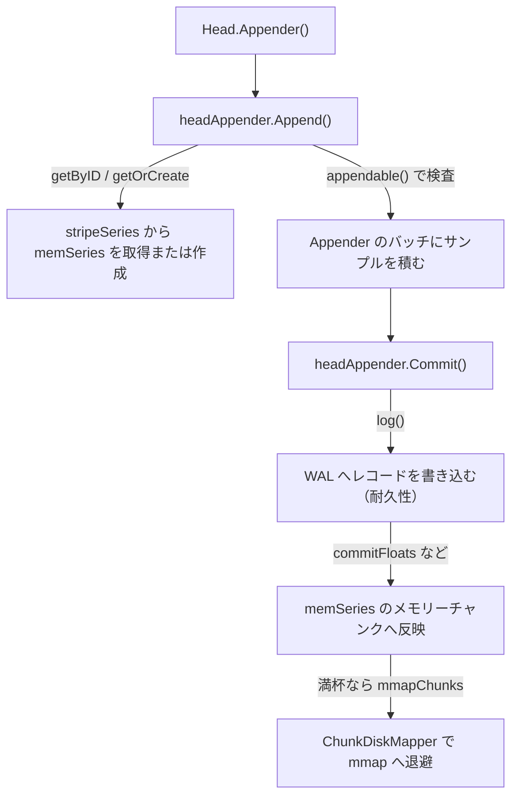
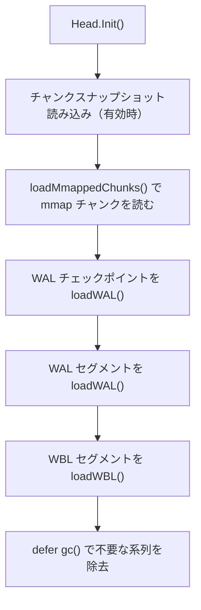

# 第6章 Head と WAL

> 本章で読むソース
>
> - [`tsdb/head.go`](https://github.com/prometheus/prometheus/blob/v3.12.0/tsdb/head.go)
> - [`tsdb/head_append.go`](https://github.com/prometheus/prometheus/blob/v3.12.0/tsdb/head_append.go)
> - [`tsdb/head_wal.go`](https://github.com/prometheus/prometheus/blob/v3.12.0/tsdb/head_wal.go)
> - [`tsdb/wlog/wlog.go`](https://github.com/prometheus/prometheus/blob/v3.12.0/tsdb/wlog/wlog.go)
> - [`tsdb/chunks/head_chunks.go`](https://github.com/prometheus/prometheus/blob/v3.12.0/tsdb/chunks/head_chunks.go)

## この章の狙い

TSDB のなかで最も書き込み頻度が高いのが **Head** である。
本章では Head の内部構造と、その耐久性を支える **WAL**（Write Ahead Log）を読む。
メモリー上の系列格納、Appender による書き込みのトランザクション、チャンクの mmap 退避、起動時のリプレイという一連の仕組みを、入口関数から主要分岐まで追う。

## 前提

第5章で TSDB 全体のデータの流れを把握していることを前提とする。
Head は DB の最前線に位置し、すべての書き込み要求を最初に受け付ける。
ブロックの物理フォーマットや Head からブロックへのコンパクションは第7章、Head 上のデータ検索は第8章で扱う。
本章は Head の書き込みパスと WAL に集中する。

## Head 構造体

Head はメモリー上でアクティブな時系列データを保持する構造体である。
主要フィールドを抜き出すと次のようになる。

[`tsdb/head.go L71-L153`](https://github.com/prometheus/prometheus/blob/v3.12.0/tsdb/head.go#L71-L153)

```go
type Head struct {
	chunkRange               atomic.Int64
	numSeries                atomic.Uint64
	numStaleSeries           atomic.Uint64
	minOOOTime, maxOOOTime   atomic.Int64
	minTime, maxTime         atomic.Int64
	minValidTime             atomic.Int64
	// ... (中略) ...
	metrics         *headMetrics
	opts            *HeadOptions
	wal, wbl        *wlog.WL
	// ... (中略) ...
	// All series addressable by their ID or hash.
	series *stripeSeries

	// ... (中略) ...
	postings *index.MemPostings // Postings lists for terms.

	tombstones *tombstones.MemTombstones

	iso *isolation

	oooIso *oooIsolation
	// ... (中略) ...
	// chunkDiskMapper is used to write and read Head chunks to/from disk.
	chunkDiskMapper *chunks.ChunkDiskMapper
	// ... (中略) ...
}
```

書き込みパスに関わるフィールドは4つに整理できる。
**series** は全系列を ID とラベルハッシュの両方から引ける格納庫、**postings** はラベルから系列を逆引きする転置索引である。
**chunkDiskMapper** は満杯になったチャンクを mmap でディスクへ退避する機構、**wal** と **wbl** は永続化ログである。
`iso` と `oooIso` は読み書きの分離（isolation）を担い、コミット前のサンプルが読み出しに混ざらないよう世代を管理する。

## stripeSeries：系列のシャーディング

Head の系列格納には **stripeSeries** というシャーディング構造が使われる。

[`tsdb/head.go L2069-L2089`](https://github.com/prometheus/prometheus/blob/v3.12.0/tsdb/head.go#L2069-L2089)

```go
type stripeSeries struct {
	size                    int
	series                  []map[chunks.HeadSeriesRef]*memSeries // Sharded by ref. A series ref is the value of `size` when the series was being newly added.
	hashes                  []seriesHashmap                       // Sharded by label hash.
	locks                   []stripeLock                          // Sharded by ref for series access, by label hash for hashes access.
	mmapReady               []paddedAtomicInt32                   // Per-stripe count of series with headChunkCount >= 2 (ready for mmapping).
	seriesLifecycleCallback SeriesLifecycleCallback
}

type stripeLock struct {
	sync.RWMutex
	// Padding to avoid multiple locks being on the same cache line.
	_ [40]byte
}

// paddedAtomicInt32 is an atomic int32 padded to 64 bytes to avoid false sharing.
type paddedAtomicInt32 struct {
	stdatomic.Int32
	// Padding to avoid multiple counters being on the same cache line.
	_ [60]byte
}
```

`size` 個のバケット（ストライプ）に系列を分散させ、各ストライプが独立した `stripeLock` を持つ。
ID から引く `series` は系列参照値でシャードし、ラベルハッシュから引く `hashes` はハッシュ値でシャードする。
`stripeLock` は `sync.RWMutex` の後ろに40バイトのパディングを置き、複数のロックが同じ CPU キャッシュラインに載る偽共有（false sharing）を避けている。

系列を ID から引くとき、`getByID` は該当ストライプの読み取りロックだけを取る。

[`tsdb/head.go L2419-L2456`](https://github.com/prometheus/prometheus/blob/v3.12.0/tsdb/head.go#L2419-L2456)

```go
func (s *stripeSeries) getByID(id chunks.HeadSeriesRef) *memSeries {
	i := s.refStripe(id)

	s.locks[i].RLock()
	series := s.series[i][id]
	s.locks[i].RUnlock()

	return series
}

// ... (中略) ...

func (s *stripeSeries) setUnlessAlreadySet(hash uint64, lset labels.Labels, series *memSeries) (*memSeries, bool) {
	i := hash & uint64(s.size-1)
	s.locks[i].Lock()
	if prev := s.hashes[i].get(hash, lset); prev != nil {
		s.locks[i].Unlock()
		return prev, false
	}
	s.hashes[i].set(hash, series)
	s.locks[i].Unlock()

	stripe := s.refStripe(series.ref)

	s.locks[stripe].Lock()
	s.series[stripe][series.ref] = series
	s.locks[stripe].Unlock()

	return series, true
}
```

`refStripe` はストライプ番号を `uint64(ref) & uint64(s.size-1)` で求める。
`size` は2の冪であり、剰余ではなくビット積で高速にシャードを選べる。
異なるストライプに属する系列の参照、追加、GC は互いのロックを取り合わないため、多数の系列へ並行に書き込むワークロードでロック競合が起きにくい。

## memSeries：メモリー上の系列とチャンク連結リスト

**memSeries** は1つの時系列を表す。

[`tsdb/head.go L2505-L2565`](https://github.com/prometheus/prometheus/blob/v3.12.0/tsdb/head.go#L2505-L2565)

```go
type memSeries struct {
	// Members up to the Mutex are not changed after construction, so can be accessed without a lock.
	ref  chunks.HeadSeriesRef
	meta *metadata.Metadata
	// ... (中略) ...
	// Everything after here should only be accessed with the lock held.
	sync.Mutex

	lset labels.Labels // Locking required with -tags dedupelabels, not otherwise.

	// Immutable chunks on disk that have not yet gone into a block, in order of ascending time stamps.
	// ... (中略) ...
	mmappedChunks []*mmappedChunk
	// Most recent chunks in memory that are still being built or waiting to be mmapped.
	// This is a linked list, headChunks points to the most recent chunk, headChunks.prev points
	// to older chunk and so on.
	headChunks   *memChunk
	firstChunkID chunks.HeadChunkID // HeadChunkID for mmappedChunks[0]

	ooo *memSeriesOOOFields
	// ... (中略) ...
	headChunkCount stdatomic.Uint32
	// ... (中略) ...
	// Current appender for the head chunk. Set when a new head chunk is cut.
	app chunkenc.Appender

	// txs is nil if isolation is disabled.
	txs *txRing
}
```

1つの系列は、ディスクへ退避済みの `mmappedChunks`（mmap された過去チャンクの配列）と、メモリー上でまだ書き込み中の `headChunks`（連結リスト）を持つ。
連結リストの各要素は `memChunk` である。

[`tsdb/head.go L2679-L2683`](https://github.com/prometheus/prometheus/blob/v3.12.0/tsdb/head.go#L2679-L2683)

```go
type memChunk struct {
	chunk            chunkenc.Chunk
	minTime, maxTime int64
	prev             *memChunk // Link to the previous element on the list.
}
```

`headChunks` が最新のチャンクを指し、`prev` ポインターで古いチャンクへとたどる。
新しいチャンクを切り出すと、それが連結リストの先頭になり、退避待ちの古いチャンクが後ろにつながる。
`headChunkCount` はこの連結リストの要素数を原子的に数えており、後述する mmap 退避の判定に使われる。

## Appender の取得と書き込みパス

書き込みは `Head.Appender` から始まる。

[`tsdb/head_append.go L161-L192`](https://github.com/prometheus/prometheus/blob/v3.12.0/tsdb/head_append.go#L161-L192)

```go
func (h *Head) Appender(context.Context) storage.Appender {
	h.metrics.activeAppenders.Inc()

	// The head cache might not have a starting point yet. The init appender
	// picks up the first appended timestamp as the base.
	if !h.initialized() {
		return &initAppender{
			head: h,
		}
	}
	return h.appender()
}

func (h *Head) appender() *headAppender {
	minValidTime := h.appendableMinValidTime()
	appendID, cleanupAppendIDsBelow := h.iso.newAppendID(minValidTime) // Every appender gets an ID that is cleared upon commit/rollback.
	return &headAppender{
		headAppenderBase: headAppenderBase{
			head:                  h,
			minValidTime:          minValidTime,
			headMaxt:              h.MaxTime(),
			oooTimeWindow:         h.opts.OutOfOrderTimeWindow.Load(),
			// ... (中略) ...
			appendID:              appendID,
			cleanupAppendIDsBelow: cleanupAppendIDsBelow,
			storeST:               h.opts.EnableSTStorage.Load(),
			useXOR2:               h.opts.EnableXOR2Encoding.Load(),
		},
	}
}
```

Head がまだ初期化されていなければ、最初のサンプルの時刻を基準に採用する `initAppender` を返す。
初期化済みなら `appender()` が `headAppender` を組み立てる。
このとき `iso.newAppendID` で採番される `appendID` は、コミットまたはロールバックで解除されるまでこの Appender の書き込みを識別し、読み出しからの分離に使われる。

`Append` はサンプルを1件受け取る。

[`tsdb/head_append.go L429-L499`](https://github.com/prometheus/prometheus/blob/v3.12.0/tsdb/head_append.go#L429-L499)

```go
func (a *headAppender) Append(ref storage.SeriesRef, lset labels.Labels, t int64, v float64) (storage.SeriesRef, error) {
	// Fail fast if OOO is disabled and the sample is out of bounds.
	if a.oooTimeWindow == 0 && t < a.minValidTime {
		a.head.metrics.outOfBoundSamples.WithLabelValues(sampleMetricTypeFloat).Inc()
		return 0, storage.ErrOutOfBounds
	}

	s := a.head.series.getByID(chunks.HeadSeriesRef(ref))
	if s == nil {
		var err error
		s, _, err = a.getOrCreate(lset)
		if err != nil {
			return 0, err
		}
	}
	// ... (中略) ...
	s.Lock()
	defer s.Unlock()
	isOOO, delta, err := s.appendable(t, v, a.headMaxt, a.minValidTime, a.oooTimeWindow)
	// ... (中略) ...
	if err != nil {
		// ... (エラー種別ごとにメトリクスを加算) ...
		return 0, err
	}

	b := a.getCurrentBatch(stFloat, s.ref)
	b.floats = append(b.floats, record.RefSample{
		Ref: s.ref,
		T:   t,
		V:   v,
	})
	b.floatSeries = append(b.floatSeries, s)
	return storage.SeriesRef(s.ref), nil
}
```

`Append` の役割は3つに分かれる。
まず参照値から `getByID` で系列を引き、なければ `getOrCreate` で作成する。
次に `appendable` で、そのサンプルが順序どおりか、追い書き（out-of-order）か、範囲外かを判定する。
最後に、受理したサンプルを Appender 内のバッチ（`b.floats`）へ積むだけで戻る。

ここで重要なのは、`Append` の時点ではまだ WAL にもメモリーチャンクにも書き込まないことである。
サンプルは Appender のバッチに溜められ、実際の永続化とメモリー反映は次の `Commit` でまとめて行われる。

## Commit：WAL 書き込みとメモリー反映のトランザクション

`Commit` は Appender に溜めたサンプルを確定させる。

[`tsdb/head_append.go L1715-L1808`](https://github.com/prometheus/prometheus/blob/v3.12.0/tsdb/head_append.go#L1715-L1808)

```go
func (a *headAppenderBase) Commit() (err error) {
	if a.closed {
		return ErrAppenderClosed
	}

	h := a.head
	// ... (中略：バッファの返却を defer 登録) ...
	if err := a.log(); err != nil {
		_ = a.Rollback() // Most likely the same error will happen again.
		return fmt.Errorf("write to WAL: %w", err)
	}

	if h.writeNotified != nil {
		h.writeNotified.Notify()
	}

	acc := &appenderCommitContext{
		// ... (中略：コミット用の集計コンテキスト) ...
	}
	// ... (中略) ...
	for _, b := range a.batches {
		// Do not change the order of these calls. We depend on it for
		// correct commit order of samples and for the staleness marker
		// handling.
		a.commitFloats(b, acc)
		a.commitHistograms(b, acc)
		a.commitFloatHistograms(b, acc)
		commitMetadata(b)
	}
	// ... (中略) ...
	h.updateMinMaxTime(acc.inOrderMint, acc.inOrderMaxt)
	h.updateMinOOOMaxOOOTime(acc.oooMinT, acc.oooMaxT)

	acc.collectOOORecords(a)
	if h.wbl != nil {
		if err := h.wbl.Log(acc.oooRecords...); err != nil {
			h.logger.Error("Failed to log out of order samples into the WAL", "err", err)
		}
	}
	return nil
}
```

`Commit` はまず `a.log()` を呼ぶ。
WAL 書き込みが失敗すれば `Rollback` してエラーを返し、メモリーには一切反映しない。
成功して初めて `commitFloats` などがバッチのサンプルを memSeries のチャンクへ書き込む。
この順序が Head のトランザクションの核心である。
永続化（WAL）を先に完了させ、メモリー反映を後に置くことで、コミットが成功したサンプルは必ず WAL に残る。
異常終了しても、WAL に書けたところまではリプレイで復元できる。

`log()` は Appender のバッチを WAL レコードへ符号化して書き込む。

[`tsdb/head_append.go L1057-L1143`](https://github.com/prometheus/prometheus/blob/v3.12.0/tsdb/head_append.go#L1057-L1143)

```go
func (a *headAppenderBase) log() error {
	if a.head.wal == nil {
		return nil
	}

	buf := a.head.getBytesBuffer()
	defer func() { a.head.putBytesBuffer(buf) }()

	var rec []byte
	enc := record.Encoder{EnableSTStorage: a.storeST}

	if len(a.seriesRefs) > 0 {
		rec = enc.Series(a.seriesRefs, buf)
		buf = rec[:0]

		if err := a.head.wal.Log(rec); err != nil {
			return fmt.Errorf("log series: %w", err)
		}
	}
	for _, b := range a.batches {
		// ... (中略：メタデータ、サンプル、ヒストグラムを順に符号化して Log) ...
		if len(b.floats) > 0 {
			rec = enc.Samples(b.floats, buf)
			buf = rec[:0]

			if err := a.head.wal.Log(rec); err != nil {
				return fmt.Errorf("log samples: %w", err)
			}
		}
		// ... (中略) ...
		// Exemplars should be logged after samples (float/native histogram/etc),
		// otherwise it might happen that we send the exemplars in a remote write
		// batch before the samples, which in turn means the exemplar is rejected
		// for missing series, since series are created due to samples.
		if len(b.exemplars) > 0 {
			rec = enc.Exemplars(exemplarsForEncoding(b.exemplars), buf)
			buf = rec[:0]

			if err := a.head.wal.Log(rec); err != nil {
				return fmt.Errorf("log exemplars: %w", err)
			}
		}
	}
	return nil
}
```

`log()` は新しい系列（`Series`）を先に書き、そのあとにサンプル、ヒストグラム、エグゼンプラーの順で書く。
系列レコードを先頭に置くのは、リプレイ側がサンプルを読む前に対応する系列を作成できるようにするためである。
バイトバッファーは `getBytesBuffer` で使い回し、レコードごとの割り当てを避ける。

書き込みパスの全体を図にすると次のようになる。



## WAL のセグメントとページ

WAL は `wlog` パッケージの `WL` 構造体として実装される。

[`tsdb/wlog/wlog.go L182-L199`](https://github.com/prometheus/prometheus/blob/v3.12.0/tsdb/wlog/wlog.go#L182-L199)

```go
type WL struct {
	dir         string
	logger      *slog.Logger
	segmentSize int
	mtx         sync.RWMutex
	segment     *Segment // Active segment.
	donePages   int      // Pages written to the segment.
	page        *page    // Active page.
	stopc       chan chan struct{}
	actorc      chan func()
	closed      bool // To allow calling Close() more than once without blocking.
	compress    compression.Type
	cEnc        compression.EncodeBuffer

	WriteNotified WriteNotified

	metrics *wlMetrics
}
```

WAL はセグメントファイルの列として構成され、各セグメントは固定サイズのページに分割される。
サイズはパッケージの定数で決まる。

[`tsdb/wlog/wlog.go L40-L45`](https://github.com/prometheus/prometheus/blob/v3.12.0/tsdb/wlog/wlog.go#L40-L45)

```go
const (
	DefaultSegmentSize = 128 * 1024 * 1024 // DefaultSegmentSize is 128 MB.
	pageSize           = 32 * 1024         // pageSize is 32KB.
	recordHeaderSize   = 7
	WblDirName         = "wbl"
)
```

1セグメントは既定で128MB、1ページは32KBである。
書き込みはまず `page`（メモリー上の32KBバッファー）に溜められ、ページ単位でディスクへ流される。
各レコードには7バイトのヘッダー（種別1バイト、長さ2バイト、CRC32 4バイト）が付く。

レコードの書き込みは `log` が担う。

[`tsdb/wlog/wlog.go L675-L714`](https://github.com/prometheus/prometheus/blob/v3.12.0/tsdb/wlog/wlog.go#L675-L714)

```go
func (w *WL) log(rec []byte, final bool) error {
	// When the last page flush failed the page will remain full.
	// When the page is full, need to flush it before trying to add more records to it.
	if w.page.full() {
		if err := w.flushPage(true); err != nil {
			return err
		}
	}
	// ... (中略：必要なら圧縮) ...
	// If the record is too big to fit within the active page in the current
	// segment, terminate the active segment and advance to the next one.
	// This ensures that records do not cross segment boundaries.
	left := w.page.remaining() - recordHeaderSize                                   // Free space in the active page.
	left += (pageSize - recordHeaderSize) * (w.pagesPerSegment() - w.donePages - 1) // Free pages in the active segment.

	if len(enc) > left {
		if _, err := w.nextSegment(true); err != nil {
			return err
		}
	}
	// ... (中略：レコードをページに詰め、ヘッダーと CRC を書く) ...
}
```

`log` はまず現在のセグメントに残る空き容量を計算し、レコードが入りきらなければ `nextSegment` で新しいセグメントへ進む。
コメントが述べるとおり、これはレコードがセグメント境界をまたがないようにするためである。
1レコードが1ページに収まらないときは、`recFirst`、`recMiddle`、`recLast` の型に分割して複数ページへ書く。

ページがディスクへ流れるのは `flushPage` である。

[`tsdb/wlog/wlog.go L583-L605`](https://github.com/prometheus/prometheus/blob/v3.12.0/tsdb/wlog/wlog.go#L583-L605)

```go
func (w *WL) flushPage(forceClear bool) error {
	w.metrics.pageFlushes.Inc()

	p := w.page
	shouldClear := forceClear || p.full()

	// No more data will fit into the page or an implicit clear.
	// Enqueue and clear it.
	if shouldClear {
		p.alloc = pageSize // Write till end of page.
	}

	n, err := w.segment.Write(p.buf[p.flushed:p.alloc])
	if err != nil {
		p.flushed += n
		return err
	}
	p.flushed += n
	// ... (中略：ページをクリアして次のページへ) ...
}
```

セグメントの切り替えでは、直前のセグメントの `fsync` と `Close` を `actorc` 経由の別ゴルーチンへ回し、書き込み側をブロックしない。
低頻度書き込みの環境では、`truncateWAL` が次のチェックポイント時に新しいセグメントを切ることで、WAL が必要以上に大きくなるのを防ぐ。

WAL レコードの種別は `record` パッケージで定義される。

[`tsdb/record/record.go L38-L66`](https://github.com/prometheus/prometheus/blob/v3.12.0/tsdb/record/record.go#L38-L66)

```go
const (
	// Unknown is returned for unrecognised WAL record types.
	Unknown Type = 255
	// Series is used to match WAL records of type Series.
	Series Type = 1
	// Samples is used to match WAL records of type Samples.
	Samples Type = 2
	// Tombstones is used to match WAL records of type Tombstones.
	Tombstones Type = 3
	// Exemplars is used to match WAL records of type Exemplars.
	Exemplars Type = 4
	// MmapMarkers is used to match OOO WBL records of type MmapMarkers.
	MmapMarkers Type = 5
	// Metadata is used to match WAL records of type Metadata.
	Metadata Type = 6
	// ... (中略) ...
	// SamplesV2 is an enhanced sample record with an encoding scheme that allows storing float samples with timestamp and an optional ST per sample.
	SamplesV2 Type = 11
	// ... (中略) ...
)
```

`Series` は系列の作成、`Samples` は float サンプル、`HistogramSamples` はヒストグラムサンプル、`Exemplars` はエグゼンプラーを表す。
`MmapMarkers` はチャンクが mmap へ追い出されたことを示すマーカーで、追い書き用の WBL で使われる。

## ChunkDiskMapper：チャンクの mmap 退避

Head のチャンクをメモリーに置き続けるとメモリーを圧迫する。
**ChunkDiskMapper** は満杯になったチャンクをディスクへ書き出し、mmap で読み取り可能にする機構である。

[`tsdb/chunks/head_chunks.go L193-L232`](https://github.com/prometheus/prometheus/blob/v3.12.0/tsdb/chunks/head_chunks.go#L193-L232)

```go
type ChunkDiskMapper struct {
	// Writer.
	dir             *os.File
	writeBufferSize int

	curFile         *os.File      // File being written to.
	curFileSequence int           // Index of current open file being appended to. 0 if no file is active.
	curFileOffset   atomic.Uint64 // Bytes written in current open file.
	curFileMaxt     int64         // Used for the size retention.
	// ... (中略) ...
	// Reader.
	// The int key in the map is the file number on the disk.
	mmappedChunkFiles map[int]*mmappedChunkFile // Contains the m-mapped files for each chunk file mapped with its index.
	closers           map[int]io.Closer         // Closers for resources behind the byte slices.
	readPathMtx       sync.RWMutex              // Mutex used to protect the above 2 maps.
	pool              chunkenc.Pool             // This is used when fetching a chunk from the disk to allocate a chunk.
	// ... (中略) ...
	chunkBuffer *chunkBuffer
	// ... (中略) ...
	writeQueue *chunkWriteQueue

	closed bool
}
```

チャンクデータは追記専用のファイル群に書かれ、各ファイルは番号（`curFileSequence`）で識別される。
書き込み済みのファイルは `mmappedChunkFiles` に mmap して保持し、ファイル全体を Go ヒープへ常駐させずに参照から該当位置へ直接到達できる。
`writeQueue` が非 nil のときは、書き込みが別ゴルーチンのキューへ回り、呼び出し側をブロックしない。

読み出しは `Chunk` が担う。

[`tsdb/chunks/head_chunks.go L808-L817`](https://github.com/prometheus/prometheus/blob/v3.12.0/tsdb/chunks/head_chunks.go#L808-L817)

```go
	// The chunk data itself.
	chkData := mmapFile.byteSlice.Range(chkDataEnd-int(chkDataLen), chkDataEnd)

	// Make a copy of the chunk data to prevent a panic occurring because the returned
	// chunk data slice references an mmap-ed file which could be closed after the
	// function returns but while the chunk is still in use.
	chkDataCopy := make([]byte, len(chkData))
	copy(chkDataCopy, chkData)

	chk, err := cdm.pool.Get(chunkenc.Encoding(chkEnc), chkDataCopy)
```

`Chunk` は mmap された `byteSlice` から該当チャンクの範囲だけを `Range` で切り出す。
その後 `chkDataCopy` へコピーしてから `pool.Get` でチャンク構造体を組み立てて返す。
このコピーは、返却するチャンクの寿命を mmap のクローズから切り離すためのものである。
`Close` でアンマップされたあともチャンクが参照され続けると、解放済み領域を指してパニックする恐れがあるためである。
つまり読み出しのコピー自体をなくしているわけではない。
mmap がなくす対象は、ファイル全体をあらかじめ Go ヒープへ読み込んで常駐させることと、読み出しのたびにファイルを開き直すコストである。

ファイルを切り替える判定は `shouldCutNewFile` にある。

[`tsdb/chunks/head_chunks.go L161-L170`](https://github.com/prometheus/prometheus/blob/v3.12.0/tsdb/chunks/head_chunks.go#L161-L170)

```go
func (f *chunkPos) shouldCutNewFile(bytesToWrite uint64) bool {
	if f.cutFile {
		return true
	}

	return f.offset == 0 || // First head chunk file.
		f.offset+bytesToWrite > MaxHeadChunkFileSize // Exceeds the max head chunk file size.
}
```

`MaxHeadChunkFileSize` は128MiB である。
次のチャンクを書くとこの上限を超える場合、新しいファイルへ切り替える。
チャンク参照はファイル番号とファイル内オフセットを詰めた8バイト値であり、読み出しはこの参照から直接該当位置を引ける。

実際の退避は `WriteChunk` を通る。

[`tsdb/chunks/head_chunks.go L457-L473`](https://github.com/prometheus/prometheus/blob/v3.12.0/tsdb/chunks/head_chunks.go#L457-L473)

```go
func (cdm *ChunkDiskMapper) WriteChunk(seriesRef HeadSeriesRef, mint, maxt int64, chk chunkenc.Chunk, isOOO bool, callback func(err error)) (chkRef ChunkDiskMapperRef) {
	// cdm.evtlPosMtx must be held to serialize the calls to cdm.evtlPos.getNextChunkRef() and the writing of the chunk (either with or without queue).
	cdm.evtlPosMtx.Lock()
	defer cdm.evtlPosMtx.Unlock()
	ref, cutFile := cdm.evtlPos.getNextChunkRef(chk)

	if cdm.writeQueue != nil {
		return cdm.writeChunkViaQueue(ref, isOOO, cutFile, seriesRef, mint, maxt, chk, callback)
	}

	err := cdm.writeChunk(seriesRef, mint, maxt, chk, ref, isOOO, cutFile)
	if callback != nil {
		callback(err)
	}

	return ref
}
```

`getNextChunkRef` がチャンク参照とファイル切り替えの要否を先に確定させるため、`WriteChunk` は書き込みの完了を待たずに参照を返せる。
memSeries 側は返ってきた参照で `mmappedChunks` を更新し、メモリーチャンクの実体を手放せる。

memSeries の退避は `mmapChunks` である。

[`tsdb/head_append.go L2215-L2241`](https://github.com/prometheus/prometheus/blob/v3.12.0/tsdb/head_append.go#L2215-L2241)

```go
func (s *memSeries) mmapChunks(chunkDiskMapper *chunks.ChunkDiskMapper) (count int) {
	if s.headChunks == nil || s.headChunks.prev == nil {
		// There is none or only one head chunk, so nothing to m-map here.
		return count
	}

	// Write chunks starting from the oldest one and stop before we get to current s.headChunks.
	for i := s.headChunks.len() - 1; i > 0; i-- {
		chk := s.headChunks.atOffset(i)
		chunkRef := chunkDiskMapper.WriteChunk(s.ref, chk.minTime, chk.maxTime, chk.chunk, false, handleChunkWriteError)
		s.mmappedChunks = append(s.mmappedChunks, &mmappedChunk{
			ref:        chunkRef,
			numSamples: uint16(chk.chunk.NumSamples()),
			minTime:    chk.minTime,
			maxTime:    chk.maxTime,
		})
		count++
	}

	// Remove the tail of the list, leaving only the most recent head chunk.
	s.headChunks.prev = nil
	s.headChunkCount.Store(1)

	return count
}
```

`mmapChunks` は最新のチャンクを1つ残し、それより古い連結リストの尾部をディスクへ書き出す。
書き出し後は `prev` を切り、`headChunkCount` を1に戻す。
最新チャンクを残すのは、書き込みが継続中のチャンクを mmap 対象にしないためである。

## mmap 退避の走査を省く最適化

Head 全体の mmap 退避は `mmapHeadChunks` が定期的に回す。
この関数には、走査コストを削る仕掛けがある。

[`tsdb/head.go L1961-L1985`](https://github.com/prometheus/prometheus/blob/v3.12.0/tsdb/head.go#L1961-L1985)

```go
func (h *Head) mmapHeadChunks() {
	var count int
	for i := range h.series.size {
		if h.series.mmapReady[i].Load() == 0 {
			continue // No series in this stripe need mmapping.
		}

		h.series.locks[i].RLock()
		for _, series := range h.series.series[i] {
			if series.headChunkCount.Load() < 2 { // < 2 means 0 or 1 head chunks, nothing to mmap.
				continue
			}

			series.Lock()
			n := series.mmapChunks(h.chunkDiskMapper)
			series.Unlock()
			if n > 0 {
				count += n
				h.series.decMmapReady(series.ref)
			}
		}
		h.series.locks[i].RUnlock()
	}
	h.metrics.mmapChunksTotal.Add(float64(count))
}
```

`stripeSeries` はストライプごとに `mmapReady` カウンターを持ち、退避対象の系列（`headChunkCount >= 2`）が新たに生じるたびに増やす。
`mmapHeadChunks` はカウンターが0のストライプをまるごと読み飛ばす。
退避すべき系列が1つもないストライプで、系列マップ全体を走査してロックを取る無駄を省ける。
`mmapReady` と `headChunkCount` はどちらも原子的に更新されるため、この判定にストライプロックは要らない。

## WBL（Write Behind Log）

追い書き（out-of-order）サンプルを扱うため、WAL とは別に **WBL**（Write Behind Log）がある。
`Head` 構造体の `wbl` フィールドがこれで、既定で `wbl/` ディレクトリに置かれる。
WBL のセグメント形式は WAL と同じ `WL` である。

`Commit` の末尾で、追い書きと判定されたサンプルは `acc.collectOOORecords` で WBL レコードにまとめられ、`h.wbl.Log` で書かれる。
WBL 書き込みは最善努力（best effort）であり、失敗してもサンプルは既にメモリーへ挿入済みのため、コミット自体は成功として扱う。
追い書きに対応するのは、遅れて届いたサンプルを、時間窓の範囲内で取りこぼさずに取り込むためである。

## Init：起動時のリプレイ

`Head.Init` は起動時に呼ばれ、ディスク上のデータからメモリー状態を復元する。

[`tsdb/head.go L686-L945`](https://github.com/prometheus/prometheus/blob/v3.12.0/tsdb/head.go#L686-L945)

```go
func (h *Head) Init(minValidTime int64) error {
	h.minValidTime.Store(minValidTime)
	defer h.resetWLReplayResources()
	defer func() {
		h.postings.EnsureOrder(h.opts.WALReplayConcurrency)
	}()
	defer h.gc() // After loading the wal remove the obsolete data from the head.
	// ... (中略) ...
	if snapshotLoaded || h.wal != nil {
		mmappedChunks, oooMmappedChunks, lastMmapRef, err = h.loadMmappedChunks(refSeries)
		// ... (中略：破損時は removeCorruptedMmappedChunks) ...
	}

	if h.wal == nil {
		h.logger.Info("WAL not found")
		return nil
	}
	// ... (中略) ...
	// Backfill the checkpoint first if it exists.
	dir, startFrom, err := wlog.LastCheckpoint(h.wal.Dir())
	// ... (中略) ...
	if err == nil && startFrom >= snapIdx {
		// ... (中略) ...
		if err := h.loadWAL(wlog.NewReader(sr), syms, multiRef, mmappedChunks, oooMmappedChunks); err != nil {
			return fmt.Errorf("backfill checkpoint: %w", err)
		}
		startFrom++
	}
	// ... (中略) ...
	// Backfill segments from the most recent checkpoint onwards.
	for i := startFrom; i <= endAt; i++ {
		// ... (中略：セグメントを開いて loadWAL) ...
		err = h.loadWAL(wlog.NewReader(sr), syms, multiRef, mmappedChunks, oooMmappedChunks)
		// ... (中略) ...
	}
	// ... (中略) ...
	if h.wbl != nil {
		// Replay WBL.
		// ... (中略：WBL セグメントを loadWBL) ...
	}
	// ... (中略) ...
	return nil
}
```

`Init` の復元は次の順で進む。

1. チャンクスナップショット（有効時）の読み込み
2. `loadMmappedChunks` による mmap チャンクの読み込み
3. WAL チェックポイントの `loadWAL`
4. WAL セグメントの `loadWAL`
5. WBL セグメントの `loadWBL`

最後に `defer` の `gc` が古い系列を掃除し、`EnsureOrder` が postings の索引順序を確定させる。



## WAL リプレイの並列化

`loadWAL` は WAL リプレイの本体である。
入口で系列 ID 空間を分割する複数のワーカーを起動する。

[`tsdb/head_wal.go L92-L130`](https://github.com/prometheus/prometheus/blob/v3.12.0/tsdb/head_wal.go#L92-L130)

```go
	// Start workers that each process samples for a partition of the series ID space.
	var (
		wg             sync.WaitGroup
		concurrency    = h.opts.WALReplayConcurrency
		processors     = make([]walSubsetProcessor, concurrency)
		exemplarsInput chan record.RefExemplar

		shards          = make([][]record.RefSample, concurrency)
		histogramShards = make([][]histogramRecord, concurrency)

		decoded                      = make(chan any, 10)
		decodeErr, seriesCreationErr error
	)
	// ... (中略) ...
	wg.Add(concurrency)
	for i := range concurrency {
		processors[i].setup()

		go func(wp *walSubsetProcessor) {
			missingSeries, unknownSamples, unknownHistograms, overlapping := wp.processWALSamples(h, mmappedChunks, oooMmappedChunks)
			// ... (中略) ...
			wg.Done()
		}(&processors[i])
	}
```

デコードは1つのゴルーチンがレコードを順に復号し、`decoded` チャネルへ流す。
復号されたサンプルは系列参照でシャードされ、担当ワーカーへ配られる。

[`tsdb/head_wal.go L285-L311`](https://github.com/prometheus/prometheus/blob/v3.12.0/tsdb/head_wal.go#L285-L311)

```go
			for len(samples) > 0 {
				m := min(len(samples), 5000)
				// ... (中略) ...
				for _, sam := range samples[:m] {
					if sam.T < minValidTime {
						continue // Before minValidTime: discard.
					}
					// ... (中略：重複系列の参照付け替え) ...
					mod := uint64(sam.Ref) % uint64(concurrency)
					shards[mod] = append(shards[mod], sam)
				}
				for i := range concurrency {
					if len(shards[i]) > 0 {
						processors[i].input <- walSubsetProcessorInputItem{samples: shards[i]}
						shards[i] = nil
					}
				}
				samples = samples[m:]
			}
```

サンプルは `ref % concurrency` で担当ワーカーへ振り分けられる。
ある系列は常に同じワーカーが処理するため、ワーカー間で同じ memSeries を触ることがなく、系列ロックの競合なしに並列でチャンクを再構築できる。
`concurrency` は `WALReplayConcurrency`（既定は GOMAXPROCS）で決まる。
サンプルを5000件ずつに区切るのは、大きなスクレイプで巨大なバッファーが多数同時に生存するのを防ぐためである。

## Head のデータ切り詰め

Head は無限に成長できないため、古い範囲を定期的に切り詰める。
メモリー側の切り詰めは `truncateMemory` が担う。

[`tsdb/head.go L1211-L1258`](https://github.com/prometheus/prometheus/blob/v3.12.0/tsdb/head.go#L1211-L1258)

```go
func (h *Head) truncateMemory(mint int64) (err error) {
	h.chunkSnapshotMtx.Lock()
	defer h.chunkSnapshotMtx.Unlock()
	// ... (中略) ...
	initialized := h.initialized()

	if h.MinTime() >= mint && initialized {
		return nil
	}
	// ... (中略) ...
	h.minTime.Store(mint)
	h.minValidTime.Store(mint)
	// ... (中略) ...
	// This was an initial call to Truncate after loading blocks on startup.
	// We haven't read back the WAL yet, so do not attempt to truncate it.
	if !initialized {
		return nil
	}

	h.metrics.headTruncateTotal.Inc()
	return h.truncateSeriesAndChunkDiskMapper("truncateMemory")
}
```

`truncateMemory` は Head の `minTime` を `mint` へ進め、`truncateSeriesAndChunkDiskMapper` で `mint` より古いチャンクをメモリーと mmap ファイルから GC する。
処理の前には、切り詰め範囲と重なる進行中のクエリを待ち合わせ、読み出し中のチャンクを消さないようにする。

WAL 側の切り詰めは `truncateWAL` が担う。

[`tsdb/head.go L1406-L1477`](https://github.com/prometheus/prometheus/blob/v3.12.0/tsdb/head.go#L1406-L1477)

```go
func (h *Head) truncateWAL(mint int64) error {
	h.chunkSnapshotMtx.Lock()
	defer h.chunkSnapshotMtx.Unlock()

	if h.wal == nil || mint <= h.lastWALTruncationTime.Load() {
		return nil
	}
	// ... (中略) ...
	first, last, err := wlog.Segments(h.wal.Dir())
	// ... (中略) ...
	// Start a new segment, so low ingestion volume TSDB don't have more WAL than needed.
	if _, err := h.wal.NextSegment(); err != nil {
		return fmt.Errorf("next segment: %w", err)
	}
	last-- // Never consider last segment for checkpoint.
	// ... (中略) ...
	// The lower two thirds of segments should contain mostly obsolete samples.
	last = first + (last-first)*2/3
	if last <= first {
		return nil
	}

	h.metrics.checkpointCreationTotal.Inc()
	if _, err = wlog.Checkpoint(h.logger, h.wal, first, last, h.keepSeriesInWALCheckpointFn(mint), mint, h.opts.EnableSTStorage.Load()); err != nil {
		// ... (中略) ...
	}
	if err := h.wal.Truncate(last + 1); err != nil {
		// ... (中略) ...
	}
	// ... (中略) ...
	return nil
}
```

`truncateWAL` はセグメント範囲の下位3分の2を対象に **チェックポイント** を作り、その範囲のセグメントを削除する。
チェックポイントは、まだ生きている系列の系列レコードと、`mint` 以降のサンプルだけを残して古いセグメントを圧縮したものである。
これにより、リプレイに必要な情報を保ったまま WAL の総量を抑えられる。
最新セグメントをチェックポイント対象から外すのは、書き込み中のセグメントを触らないためである。

## 高速化・最適化の工夫

本章で読んだ機構から、Head の設計を貫く最適化を3つ挙げられる。

1つ目は **stripeSeries によるロックの分散** である。
系列を2の冪個のストライプに分け、参照値やラベルハッシュのビット積で担当ストライプを選ぶ。
系列の参照、追加、GC が別ストライプに属する限りロックを取り合わないため、多数の系列への並行書き込みで競合が起きにくい。
`stripeLock` にパディングを詰めて偽共有を避ける点も、マルチコアでのロック効率に効く。

2つ目は **mmap 退避における走査の省略** である。
`stripeSeries` はストライプごとに `mmapReady` カウンターを持ち、`mmapHeadChunks` は退避対象がないストライプをまるごと読み飛ばす。
カウンター判定は原子操作だけで済み、ストライプロックを取らずに無駄な走査を落とせる。
退避後のチャンクはメモリーから消え、mmap 領域は参照から該当位置へ直接到達できる。
これにより、ファイル全体を Go ヒープへ常駐させることと、読み出しのたびにファイルを開き直すことの両方を避けられる。
返却するチャンクは pool を介してコピーするが、コピー対象は該当チャンク分のバイト列だけであり、ファイル全体ではない。

3つ目は **WAL リプレイの系列単位並列化** である。
リプレイはサンプルを `ref % concurrency` でシャードし、系列ごとに固定のワーカーが処理する。
同じ memSeries を複数ワーカーが触らないため、系列ロックの競合なしにチャンク再構築をコア数だけ並列化できる。

## まとめ

Head は stripeSeries で系列を分散格納し、ロックストリッピングで高並列な書き込みを実現する。
書き込みは Appender のバッチに溜められ、`Commit` が WAL への書き込みを先に済ませてからメモリーチャンクへ反映する。
この順序が、コミット済みサンプルの耐久性を保証する。
満杯になったチャンクは ChunkDiskMapper が mmap でディスクへ退避し、メモリー使用量を抑える。
起動時は `Init` が mmap チャンクと WAL、WBL を順にリプレイしてメモリー状態を復元し、リプレイは系列単位で並列化される。
追い書きサンプルは WBL で別管理され、`truncateMemory` と `truncateWAL` が古い範囲をメモリーと WAL の両面から切り詰める。

## 関連する章

- 第5章 TSDB アーキテクチャ（全体のデータフローと Head の位置づけ）
- 第7章 ブロックフォーマットとコンパクション（Head からブロックへの変換）
- 第8章 クエリと読み出し（Head 上のデータの検索）
