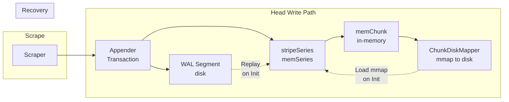

# 第6章 Head と WAL

> **本章で読むソース**
>
> - [`tsdb/head.go`](https://github.com/prometheus/prometheus/blob/v3.12.0/tsdb/head.go)
> - [`tsdb/wlog/wlog.go`](https://github.com/prometheus/prometheus/blob/v3.12.0/tsdb/wlog/wlog.go)
> - [`tsdb/chunks/head_chunks.go`](https://github.com/prometheus/prometheus/blob/v3.12.0/tsdb/chunks/head_chunks.go)

## この章の狙い

TSDB の中で最も書き込み頻度が高い Head の内部構造を理解する。
メモリー上のデータ構造、WAL による永続化、チャンクの mmap によるディスク退避、起動時のリプレイという一連の仕組みを追う。

## 前提

第5章で TSDB 全体のデータの流れを把握していることを前提とする。
Head は DB の最前線に位置し、すべての書き込み要求を最初に受け付ける。

## Head 構造体

Head（`tsdb/head.go:71-153`）はメモリー上でアクティブな時系列データを保持する。
以下の主要フィールドを持つ。

```go
// tsdb/head.go:71-153
type Head struct {
    chunkRange               atomic.Int64
    numSeries                atomic.Uint64
    numStaleSeries           atomic.Uint64
    minTime, maxTime         atomic.Int64
    minValidTime             atomic.Int64

    series *stripeSeries
    postings *index.MemPostings
    tombstones *tombstones.MemTombstones

    chunkDiskMapper *chunks.ChunkDiskMapper

    wal, wbl *wlog.WL

    iso *isolation
    oooIso *oooIsolation
    // ...
}
```

Head は **series**（全系列のマップ）、**postings**（ラベル用転置索引）、**chunkDiskMapper**（チャンクの mmap 管理）、**wal** と **wbl**（WAL と WBL）を内包する。

## stripeSeries：ロック競合の低減（最適化）

Head の系列格納には **stripeSeries**（`tsdb/head.go:2069-2076`）というストライピング構造が使われる。

```go
// tsdb/head.go:2069-2076
type stripeSeries struct {
    size                    int
    series                  []map[chunks.HeadSeriesRef]*memSeries
    hashes                  []seriesHashmap
    locks                   []stripeLock
    mmapReady               []paddedAtomicInt32
    seriesLifecycleCallback SeriesLifecycleCallback
}
```

stripeSize 個のバケット（ストライプ）に系列を分散させ、各ストライプが独立したロックを持つ。
これにより、系列の参照、追加、GC が異なるストライプに属するとき、ロックの競合が発生しない。

stripeLock（`tsdb/head.go:2078-2082`）は CPU キャッシュラインの偽共有（false sharing）を避けるためにパディングを入れており、マルチコア環境でのロック取得効率を高めている。

## メモリー上の系列（memSeries）

memSeries（`tsdb/head.go:2505-2565`）は一つの時系列を表す。

```go
// tsdb/head.go:2505-2565
type memSeries struct {
    ref  chunks.HeadSeriesRef
    lset labels.Labels
    mmappedChunks []*mmappedChunk   // ディスク上のmmapチャンク
    headChunks   *memChunk          // メモリー上の最新チャンク（連結リスト）
    firstChunkID chunks.HeadChunkID
    ooo *memSeriesOOOFields         // 追い書きチャンク
    headChunkCount stdatomic.Uint32
    app chunkenc.Appender
    // ...
}
```

1系列は mmap された過去チャンクの配列と、現在書き込み中のメモリーチャンクの連結リストを持つ。
連結リストの先頭（`headChunks`）が最新のチャンクで、`prev` ポインターで古いチャンクへとたどる。

## ChunkDiskMapper：チャンクの mmap 退避（最適化）

Head のチャンクはメモリー上に無制限に置き続けるとメモリー圧迫になる。
**ChunkDiskMapper**（`tsdb/chunks/head_chunks.go:193-232`）は満杯になったチャンクをディスクに書き出し、mmap で読み取り可能にする機構である。

```go
// tsdb/chunks/head_chunks.go:193-232
type ChunkDiskMapper struct {
    curFile         *os.File
    curFileSequence int
    curFileOffset   atomic.Uint64
    mmappedChunkFiles map[int]*mmappedChunkFile
    chunkBuffer    *chunkBuffer
    writeQueue     *chunkWriteQueue
    // ...
}
```

1ファイル128MiB の上限で、チャンクデータは追記専用ファイルとして書き込まれる。
書き込みは 4MiB のバッファーでバッチ処理され、チャンク参照は（ファイル番号, オフセット）の8バイト値で表現される。

## WAL（Write Ahead Log）

WAL（`tsdb/wlog/wlog.go`）は永続化の要である。
`Append()` は系列取得または作成、`pendingCommit = true` 設定、バッチへのサンプル追加までを行う。
WAL 書き込みは `Commit()` の先頭で `a.log()` を呼ぶ箇所で実行され、その後 Head への反映処理に進む。

WL 構造体（`tsdb/wlog/wlog.go` 内）は以下の特徴を持つ。

- **セグメント分割**: 128MB ごとに新しいセグメントファイルを作成する
- **ページバッファー**: 32KB のページ単位で書き込みをバッファリングする
- **CRC32 チェックサム**: 各レコードにチェックサムを付与し、破損検出を行う
- **チェックポイント**: 不要になった WAL セグメントを定期的に圧縮して削除する

WAL のレコードタイプには以下がある。

- **Series**: 新しい系列の作成
- **Samples**: float サンプル
- **Histograms**: ヒストグラムサンプル
- **Exemplars**: エグゼンプラー
- **MmapMarkers**: チャンクが mmap に追い出されたことを示すマーカー

## WBL（Write Behind Log）

追い書き（out-of-order）サンプルに対応するため、WAL とは別に **WBL**（Write Behind Log）が存在する。
WBL は `wbl/` ディレクトリに格納され、WAL と同様のセグメント形式を持つ。

## 起動時のリプレイ

Head の `Init()`（`tsdb/head.go:686-945`）は起動時に呼ばれ、以下の順でデータを復元する。

1. **チャンクスナップショット**（有効な場合）の読み込み
2. **mmap チャンク**の読み込み（`loadMmappedChunks()`）
3. **WAL チェックポイント**のリプレイ
4. **WAL セグメント**のリプレイ
5. **WBL セグメント**のリプレイ

WAL リプレイは並列実行され、`WALReplayConcurrency`（デフォルトは GOMAXPROCS）で制御される。

## Head のデータ切り詰め（Truncation）

Head は定期的に truncateMemory（`tsdb/head.go:1211`）と truncateWAL（`tsdb/head.go:1406`）を実行する。
truncateMemory は `mint` より古いチャンクをメモリーと mmap から削除し、truncateWAL は対応する WAL セグメントをチェックポイント化して削除する。

## Head Compaction（ブロック生成）

Head が一定の時間範囲（デフォルト2時間）を超えると、**Head Compaction** によりデータがブロックとしてディスクに書き出される。
この処理は DB の `run()`（`tsdb/db.go:1188`）内で `compactc` チャネルを介してトリガーされる。

コンパクションの流れは以下の通りである。

1. 新しい RangeHead を作成し、Head の一部を読み取り専用ビューとして切り出す
2. LeveledCompactor がそのビューに対して `Compact()` を実行する
3. 結果のブロックがディスクに書き出される
4. Head の該当範囲は切り詰められる

## 書き込みパス



1. スクレイパーからサンプルが Appender に届く
2. Appender は WAL にレコードを書き込む（耐久性の保証）
3. 同名のサンプルを stripeSeries 内の memSeries に追加する
4. チャンクがいっぱいになると mmap 経由でディスクに退避する
5. 異常停止後は WAL リプレイでメモリー状態を復元する

## まとめ

Head は stripeSeries によるロックストリッピングで高並列な書き込みを実現し、ChunkDiskMapper による mmap 退避でメモリー使用量を抑制する。
WAL は全サンプルの耐久性を保証し、起動時のリプレイでメモリー状態を復元する。
追い書きサンプルは WBL で別管理され、時間窓を設定することで柔軟な取り込みが可能になる。

## 関連する章

- 第5章 TSDB アーキテクチャ（全体のデータフロー）
- 第7章 ブロックフォーマットとコンパクション（Head からブロックへの変換）
- 第8章 クエリと読み出し（Head 上のデータの検索）
