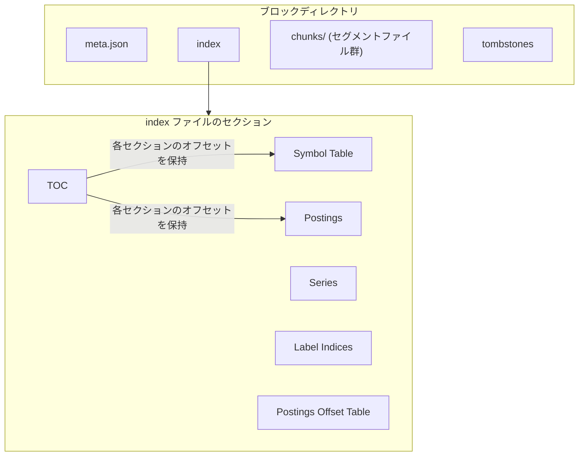
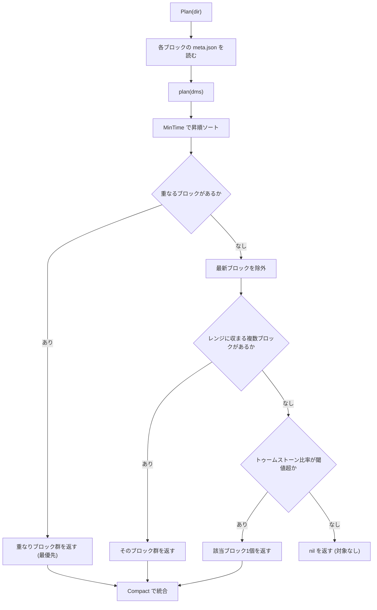
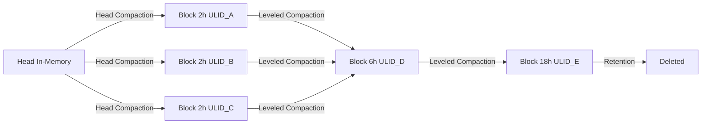

# 第7章 ブロックフォーマットとコンパクション

> 本章で読むソース
>
> - [`tsdb/block.go`](https://github.com/prometheus/prometheus/blob/v3.12.0/tsdb/block.go)
> - [`tsdb/index/index.go`](https://github.com/prometheus/prometheus/blob/v3.12.0/tsdb/index/index.go)
> - [`tsdb/chunkenc/xor.go`](https://github.com/prometheus/prometheus/blob/v3.12.0/tsdb/chunkenc/xor.go)
> - [`tsdb/chunks/chunks.go`](https://github.com/prometheus/prometheus/blob/v3.12.0/tsdb/chunks/chunks.go)
> - [`tsdb/compact.go`](https://github.com/prometheus/prometheus/blob/v3.12.0/tsdb/compact.go)

## この章の狙い

ブロックの物理フォーマットとコンパクション戦略を、ソースコードの実行経路に沿って理解する。
ブロックがどのようなファイルで構成されるか、索引とチャンクがどのようにエンコードされるか、複数のブロックがどのように選定されて一つに統合されるかを追う。

## 前提

第5章でブロックが TSDB の永続ストレージ単位であることを理解していることを前提とする。
第6章では Head 上のメモリーチャンクと mmap チャンク、WAL を扱った。
本章はディスク上に確定したブロックの内部フォーマットと、ブロックを統合するコンパクション処理に焦点を絞る。
クエリがブロック上のデータをどう読み出すかは第8章で扱う。

## ブロックの全体像

1つのブロックは連続した時間範囲のサンプルを収めた1つのディレクトリである。
ディレクトリ名はブロックを一意に識別する ULID であり、その下に4種類のファイルが並ぶ。

```text
<ULID>/
  meta.json       # ブロックのメタ情報（JSON）
  index           # ラベル索引とポスティング（単一ファイル）
  chunks/         # チャンクデータ（セグメントファイルのディレクトリ）
  tombstones      # 削除マーカー
```



`meta.json` はメタ情報を持ち、残りの3種類が実データを持つ。
`index` はラベルと系列の索引、`chunks/` はサンプル本体、`tombstones` は削除範囲である。

## Block 構造体

メモリー上でブロックを表すのが `Block` 構造体である。

[`tsdb/block.go L313-L335`](https://github.com/prometheus/prometheus/blob/v3.12.0/tsdb/block.go#L313-L335)

```go
type Block struct {
	mtx            sync.RWMutex
	closing        bool
	pendingReaders sync.WaitGroup

	dir  string
	meta BlockMeta

	// Symbol Table Size in bytes.
	// We maintain this variable to avoid recalculation every time.
	symbolTableSize uint64

	chunkr     ChunkReader
	indexr     IndexReader
	tombstones tombstones.Reader

	logger *slog.Logger

	numBytesChunks    int64
	numBytesIndex     int64
	numBytesTombstone int64
	numBytesMeta      int64
}
```

`chunkr`、`indexr`、`tombstones` の3つが、それぞれ `chunks/`、`index`、`tombstones` ファイルへのリーダーである。
`pendingReaders` は読み取り中のクエリを数える `WaitGroup` であり、ブロック削除時に進行中の読み取りが終わるのを待つために使う。
`symbolTableSize` はシンボルテーブルのバイト数を都度計算し直さないよう保持している値である。

`OpenBlock()` はディレクトリを開き、4種類のファイルからそれぞれのリーダーを作って `Block` を組み立てる。

[`tsdb/block.go L349-L368`](https://github.com/prometheus/prometheus/blob/v3.12.0/tsdb/block.go#L349-L368)

```go
	meta, sizeMeta, err := readMetaFile(dir)
	if err != nil {
		return nil, err
	}

	cr, err := chunks.NewDirReader(chunkDir(dir), pool)
	if err != nil {
		return nil, err
	}
	closers = append(closers, cr)

	decoder := index.DecodePostingsRaw
	if postingsDecoderFactory != nil {
		decoder = postingsDecoderFactory(meta)
	}
	ir, err := index.NewFileReader(filepath.Join(dir, indexFilename), decoder)
	if err != nil {
		return nil, err
	}
	closers = append(closers, ir)
```

`readMetaFile()` で `meta.json` を読み、`chunks.NewDirReader()` で `chunks/` ディレクトリを mmap し、`index.NewFileReader()` で `index` ファイルを mmap する。
リーダーはいずれもファイルをメモリーマップして開くため、ブロックを開くコストはファイル本体の読み込みではなくメタデータの解釈に限られる。

## meta.json

`meta.json` は `BlockMeta` 構造体を JSON 化したものである。

[`tsdb/block.go L164-L181`](https://github.com/prometheus/prometheus/blob/v3.12.0/tsdb/block.go#L164-L181)

```go
type BlockMeta struct {
	// Unique identifier for the block and its contents. Changes on compaction.
	ULID ulid.ULID `json:"ulid"`

	// MinTime and MaxTime specify the time range all samples
	// in the block are in.
	MinTime int64 `json:"minTime"`
	MaxTime int64 `json:"maxTime"`

	// Stats about the contents of the block.
	Stats BlockStats `json:"stats,omitempty"`

	// Information on compactions the block was created from.
	Compaction BlockMetaCompaction `json:"compaction"`

	// Version of the index format.
	Version int `json:"version"`
}
```

`MinTime` と `MaxTime` はブロックが収める時間範囲であり、この範囲はコンパクション対象の選定でそのまま使われる。
`Stats` は系列数、サンプル数、チャンク数、トゥームストーン数を持ち、後述するトゥームストーン比率の判定に使う。
`Compaction` はブロックがどのコンパクションから生まれたかを記録する。

[`tsdb/block.go L201-L216`](https://github.com/prometheus/prometheus/blob/v3.12.0/tsdb/block.go#L201-L216)

```go
type BlockMetaCompaction struct {
	// Maximum number of compaction cycles any source block has
	// gone through.
	Level int `json:"level"`
	// ULIDs of all source head blocks that went into the block.
	Sources []ulid.ULID `json:"sources,omitempty"`
	// Indicates that during compaction it resulted in a block without any samples
	// so it should be deleted on the next reloadBlocks.
	Deletable bool `json:"deletable,omitempty"`
	// Short descriptions of the direct blocks that were used to create
	// this block.
	Parents []BlockDesc `json:"parents,omitempty"`
	Failed  bool        `json:"failed,omitempty"`
	// Additional information about the compaction, for example, block created from out-of-order chunks.
	Hints []string `json:"hints,omitempty"`
}
```

`Level` はコンパクション回数であり、Head から書き出された直後のブロックが1、それらを統合したブロックが2と増えていく。
`Sources` は統合元となったすべての元ブロックの ULID、`Parents` は直接の親ブロックの記述である。
`Deletable` はコンパクションの結果サンプルが0件になったブロックに立てられるフラグで、次回のブロック再読み込み時に削除される。

## 索引フォーマット

`index` ファイルは複数のセクションが連なった単一ファイルである。
先頭から順に、シンボルテーブル、系列、ラベル索引、ポスティング、ポスティングオフセットテーブルが並び、末尾に各セクションの開始位置を示す TOC が置かれる。

### TOC

TOC はファイル末尾に固定長で置かれ、各セクションの開始オフセットを持つ。

[`tsdb/index/index.go L170-L178`](https://github.com/prometheus/prometheus/blob/v3.12.0/tsdb/index/index.go#L170-L178)

```go
// TOC represents the index Table Of Contents that states where each section of the index starts.
type TOC struct {
	Symbols           uint64
	Series            uint64
	LabelIndices      uint64
	LabelIndicesTable uint64
	Postings          uint64
	PostingsTable     uint64
}
```

TOC を末尾に置くのは、索引を書き出すときにはまだ各セクションの最終的な長さが確定していないためである。
リーダーはファイル末尾から TOC を読み、そこに書かれたオフセットへ直接シークして各セクションにアクセスする。

### Symbol Table

`Symbol Table` はラベル名とラベル値に現れるすべての文字列を辞書順に並べた辞書である。
系列やポスティングは文字列を直接持たず、この辞書への整数インデックスで参照する。

[`tsdb/index/index.go L537-L550`](https://github.com/prometheus/prometheus/blob/v3.12.0/tsdb/index/index.go#L537-L550)

```go
func (w *Writer) AddSymbol(sym string) error {
	if err := w.ensureStage(idxStageSymbols); err != nil {
		return err
	}
	if w.numSymbols != 0 && sym <= w.lastSymbol {
		return fmt.Errorf("symbol %q out-of-order", sym)
	}
	w.lastSymbol = sym
	w.symbolCache[sym] = uint32(w.numSymbols)
	w.numSymbols++
	w.buf1.Reset()
	w.buf1.PutUvarintStr(sym)
	return w.write(w.buf1.Get())
}
```

シンボルは辞書順で追加され、`symbolCache` が文字列から採番したインデックスへの対応を保持する。
系列を書くときはこのインデックスを使うため、同じラベル名やラベル値が何万系列に現れても、文字列自体は辞書に一度だけ格納される。

読み取り側は、辞書全体を配列として持つ代わりに疎な位置索引だけを持つ。

[`tsdb/index/index.go L1200-L1209`](https://github.com/prometheus/prometheus/blob/v3.12.0/tsdb/index/index.go#L1200-L1209)

```go
	} else {
		if int(o) >= s.seen {
			return "", fmt.Errorf("unknown symbol offset %d", o)
		}
		d.Skip(s.offsets[int(o/symbolFactor)])
		// Walk until we find the one we want.
		for i := o - (o / symbolFactor * symbolFactor); i > 0; i-- {
			d.UvarintBytes()
		}
	}
```

`symbolFactor` は32であり、リーダーは32個ごとに1つだけ位置を記録した `offsets` を持つ。
インデックス `o` の文字列を引くときは、`o/symbolFactor` 番目の記録位置へシークし、そこから残り最大31個を前方に読み飛ばす。
これにより、シンボル位置索引のメモリー使用量を辞書サイズの32分の1に抑えている。

### Series セクション

`Series` セクションは各系列のラベルセットとチャンク参照の一覧を持つ。
ラベルはシンボルインデックスの組で表され、チャンク参照は差分符号化される。

[`tsdb/index/index.go L494-L512`](https://github.com/prometheus/prometheus/blob/v3.12.0/tsdb/index/index.go#L494-L512)

```go
	w.buf2.PutUvarint(len(chunks))

	if len(chunks) > 0 {
		c := chunks[0]
		w.buf2.PutVarint64(c.MinTime)
		w.buf2.PutUvarint64(uint64(c.MaxTime - c.MinTime))
		w.buf2.PutUvarint64(uint64(c.Ref))
		t0 := c.MaxTime
		ref0 := int64(c.Ref)

		for _, c := range chunks[1:] {
			w.buf2.PutUvarint64(uint64(c.MinTime - t0))
			w.buf2.PutUvarint64(uint64(c.MaxTime - c.MinTime))
			t0 = c.MaxTime

			w.buf2.PutVarint64(int64(c.Ref) - ref0)
			ref0 = int64(c.Ref)
		}
	}
```

先頭チャンクだけ絶対値で `MinTime` とチャンク参照を書き、2つ目以降は直前チャンクとの差分を書く。
`MinTime` は直前チャンクの `MaxTime` からの差分、チャンク参照は直前参照からの差分である。
1系列に属するチャンクは時間順かつファイル上でも近い位置に並ぶため、差分は小さい整数になり、可変長整数で数バイトに収まる。

系列は `seriesByteAlign`（16バイト）境界に整列して書かれる。
そのため4バイトの系列参照で16倍のアドレス空間を指せるようになり、参照を小さく保ったまま大きな索引を扱える。

### Postings：転置索引による高速ラベル検索

`Postings` は、ラベル名とラベル値の組（例として `job="node"`）から、そのラベルを持つ全系列の参照へのマップである。
全系列を走査せずに条件に合う系列を絞り込むための転置索引であり、これがラベル検索を高速化する中心的なデータ構造である。

読み取りは `Reader.Postings()` が担う。

[`tsdb/index/index.go L1519-L1540`](https://github.com/prometheus/prometheus/blob/v3.12.0/tsdb/index/index.go#L1519-L1540)

```go
func (r *Reader) Postings(ctx context.Context, name string, values ...string) (Postings, error) {
	if r.version == FormatV1 {
		e, ok := r.postingsV1[name]
		if !ok {
			return EmptyPostings(), nil
		}
		res := make([]Postings, 0, len(values))
		for _, v := range values {
			postingsOff, ok := e[v]
			if !ok {
				continue
			}
			// Read from the postings table.
			d := encoding.NewDecbufAt(r.b, int(postingsOff), castagnoliTable)
			_, p, err := r.dec.DecodePostings(d)
			if err != nil {
				return nil, fmt.Errorf("decode postings: %w", err)
			}
			res = append(res, p)
		}
		return Merge(ctx, res...), nil
	}
```

指定したラベル名について、値ごとのポスティングリストを読み出して `Merge()` で合併する。
各ポスティングリストは系列参照を昇順に並べた整数列であり、クエリ側は複数ラベルのポスティングを積集合や合併で組み合わせて対象系列を確定する。
複数ラベルにまたがる積集合はソート済み整数列のマージとして O(n+m) で計算でき、その具体的な組み合わせ処理は第8章で扱う。

ポスティングオフセットテーブルも疎な索引としてメモリーに載る。

[`tsdb/index/index.go L1085-L1092`](https://github.com/prometheus/prometheus/blob/v3.12.0/tsdb/index/index.go#L1085-L1092)

```go
			if valueCount%symbolFactor == 0 {
				r.postings[string(name)] = append(r.postings[string(name)], postingOffset{value: string(value), off: off})
				lastName, lastValue = nil, nil
			} else {
				lastName, lastValue = name, value
				lastOff = off
			}
			valueCount++
```

オフセットテーブルはラベル名ごとに全ラベル値のディスク位置を持つが、メモリーには32個ごとの値（および先頭と末尾）だけを載せる。
目的の値はまず疎索引で近い位置を二分探索し、そこからディスク上のテーブルを前方に辿って見つける。
ラベル値が数百万種類あっても、常駐する索引はその32分の1で済む。

## チャンクストレージ

ブロックのチャンクは `chunks/` 下のセグメントファイルに格納される。
`ChunkWriter`（実体は `Writer`）と `ChunkReader`（実体は `Reader`）がブロック用のチャンク入出力を担う。
Head の `ChunkDiskMapper` と違い、ブロックのチャンクセグメントはコンパクション時に一度だけ書かれ、以後は読み取り専用になる。

### セグメントへのバッチ書き込み

`WriteChunks()` はチャンク群をセグメントサイズに収まる単位へまとめてから書き出す。

[`tsdb/chunks/chunks.go L505-L524`](https://github.com/prometheus/prometheus/blob/v3.12.0/tsdb/chunks/chunks.go#L505-L524)

```go
func (w *Writer) WriteChunks(chks ...Meta) error {
	var (
		batchSize  = int64(0)
		batchStart = 0
		batches    = make([][]Meta, 1)
		batchID    = 0
		firstBatch = true
	)

	for i, chk := range chks {
		// Each chunk contains: data length + encoding + the data itself + crc32
		chkSize := int64(MaxChunkLengthFieldSize) // The data length is a variable length field so use the maximum possible value.
		chkSize += ChunkEncodingSize              // The chunk encoding.
		chkSize += int64(len(chk.Chunk.Bytes()))  // The data itself.
		chkSize += crc32.Size                     // The 4 bytes of crc32.
		batchSize += chkSize

		// Cut a new batch when it is not the first chunk(to avoid empty segments) and
		// the batch is too large to fit in the current segment.
		cutNewBatch := (i != 0) && (batchSize+SegmentHeaderSize > w.segmentSize)
```

各チャンクは、長さフィールド、エンコーディング1バイト、データ本体、CRC32 の4要素で構成される。
累積サイズがセグメントサイズを超える手前でバッチを区切り、バッチごとに1つのセグメントファイルへ書き込む。
セグメントサイズに上限を設けることで、1つのチャンクファイルが際限なく肥大化するのを防ぎ、mmap の単位を扱いやすい大きさに保つ。

### チャンク参照の詰め込み

書き込んだチャンクの位置は `BlockChunkRef` という64ビット値1つで表される。

[`tsdb/chunks/chunks.go L106-L117`](https://github.com/prometheus/prometheus/blob/v3.12.0/tsdb/chunks/chunks.go#L106-L117)

```go
type BlockChunkRef uint64

// NewBlockChunkRef packs the file index and byte offset into a BlockChunkRef.
func NewBlockChunkRef(fileIndex, fileOffset uint64) BlockChunkRef {
	return BlockChunkRef(fileIndex<<32 | fileOffset)
}

func (b BlockChunkRef) Unpack() (int, int) {
	sgmIndex := int(b >> 32)
	chkStart := int((b << 32) >> 32)
	return sgmIndex, chkStart
}
```

上位4バイトにセグメントファイルの番号、下位4バイトにそのファイル内のバイトオフセットを詰める。
系列の索引はこの1つの整数を持てばよく、リーダーは `Unpack()` で番号とオフセットに分解して該当セグメントの該当位置へ直接シークする。

## XOR チャンクエンコーディング

TSDB はサンプルの型ごとに異なるチャンクエンコーディングを持つ。
float サンプルには XOR エンコーディングを使う。
これは Facebook が発表した [Gorilla の論文](https://www.vldb.org/pvldb/vol8/p1816-teller.pdf)の圧縮方式をもとにしている。

### XORChunk

[`tsdb/chunkenc/xor.go L60-L69`](https://github.com/prometheus/prometheus/blob/v3.12.0/tsdb/chunkenc/xor.go#L60-L69)

```go
// XORChunk holds XOR encoded sample data.
type XORChunk struct {
	b bstream
}

// NewXORChunk returns a new chunk with XOR encoding.
func NewXORChunk() *XORChunk {
	b := make([]byte, chunkHeaderSize, chunkAllocationSize)
	return &XORChunk{b: bstream{stream: b, count: 0}}
}
```

チャンクは `bstream` というビット列バッファ1つを持つだけである。
先頭2バイトのヘッダーにサンプル数を持ち、以降にタイムスタンプと値をビット単位で詰めていく。
サンプルは固定長でなくビット境界に隙間なく並ぶため、値が規則的なほどチャンクは小さくなる。

### タイムスタンプの差分の差分

3サンプル目以降のタイムスタンプは、差分の差分（dod）で符号化する。

[`tsdb/chunkenc/xor.go L182-L212`](https://github.com/prometheus/prometheus/blob/v3.12.0/tsdb/chunkenc/xor.go#L182-L212)

```go
	default:
		tDelta = uint64(t - a.t)
		dod := int64(tDelta - a.tDelta)

		// Gorilla has a max resolution of seconds, Prometheus milliseconds.
		// Thus we use higher value range steps with larger bit size.
		//
		// TODO(beorn7): This seems to needlessly jump to large bit
		// sizes even for very small deviations from zero. Timestamp
		// compression can probably benefit from some smaller bit
		// buckets. See also what was done for histogram encoding in
		// varbit.go.
		switch {
		case dod == 0:
			a.b.writeBit(zero)
		case bitRange(dod, 14):
			a.b.writeByte(0b10<<6 | (uint8(dod>>8) & (1<<6 - 1))) // 0b10 size code combined with 6 bits of dod.
			a.b.writeByte(uint8(dod))                             // Bottom 8 bits of dod.
		case bitRange(dod, 17):
			a.b.writeBits(0b110, 3)
			a.b.writeBits(uint64(dod), 17)
		case bitRange(dod, 20):
			a.b.writeBits(0b1110, 4)
			a.b.writeBits(uint64(dod), 20)
		default:
			a.b.writeBits(0b1111, 4)
			a.b.writeBits(uint64(dod), 64)
		}

		a.writeVDelta(v)
	}
```

`dod` は今回の差分 `tDelta` と前回の差分の差である。
スクレイプは一定間隔で実施されるため、差分はほぼ一定になり、`dod` はほとんどの場合0になる。
`dod` が0なら1ビット、収まる範囲に応じて14ビット、17ビット、20ビット、それを超える場合だけ64ビットと、値の大きさに応じてビット幅を段階的に選ぶ。
先頭の数ビットがどの幅を使ったかを示す接頭ビットになっており、リーダーはそれを見て読み取り幅を決める。

### 値の XOR エンコード

サンプル値は、直前の値との XOR を取って有効ビットだけを書く。

[`tsdb/chunkenc/xor.go L412-L434`](https://github.com/prometheus/prometheus/blob/v3.12.0/tsdb/chunkenc/xor.go#L412-L434)

```go
func xorWrite(b *bstream, newValue, currentValue float64, leading, trailing *uint8) {
	delta := math.Float64bits(newValue) ^ math.Float64bits(currentValue)

	if delta == 0 {
		b.writeBit(zero)
		return
	}
	b.writeBit(one)

	newLeading := uint8(bits.LeadingZeros64(delta))
	newTrailing := uint8(bits.TrailingZeros64(delta))

	// Clamp number of leading zeros to avoid overflow when encoding.
	if newLeading >= 32 {
		newLeading = 31
	}

	if *leading != 0xff && newLeading >= *leading && newTrailing >= *trailing {
		// In this case, we stick with the current leading/trailing.
		b.writeBit(zero)
		b.writeBits(delta>>*trailing, 64-int(*leading)-int(*trailing))
		return
	}
```

値を IEEE 754 の64ビット表現とみなし、直前の値との XOR を取る。
値が変わらなければ XOR は0になり、1ビットだけ書いて終わる。
値が変わっても、変化するのは仮数部の一部のビットに限られることが多い。
そのとき XOR 結果は先行ゼロと後続ゼロに挟まれた短い有効ビット列になり、前回と同じゼロ幅を再利用できるなら幅の再記録すら省ける。
再利用できない場合だけ、先行ゼロ数と有効ビット数を書いてから有効ビット列を書く。
Gorilla の論文では、この値の圧縮とタイムスタンプの圧縮を合わせて、実データで1サンプルあたり平均約1.37バイトに収まると報告されている。

### ヒストグラムエンコーディング

Native Histogram には専用のエンコーディングがある。
ヒストグラムはバケットのカウント値を持つため、XOR ではなくバケットごとの差分と可変長ビット符号化を組み合わせて圧縮する。

## LeveledCompactor

`LeveledCompactor` は複数のブロックを統合して新しいブロックを生成する実装である。

[`tsdb/compact.go L79-L93`](https://github.com/prometheus/prometheus/blob/v3.12.0/tsdb/compact.go#L79-L93)

```go
// LeveledCompactor implements the Compactor interface.
type LeveledCompactor struct {
	metrics                     *CompactorMetrics
	logger                      *slog.Logger
	ranges                      []int64
	chunkPool                   chunkenc.Pool
	ctx                         context.Context
	maxBlockChunkSegmentSize    int64
	useUncachedIO               bool
	mergeFunc                   storage.VerticalChunkSeriesMergeFunc
	blockExcludeFunc            BlockExcludeFilterFunc
	postingsEncoder             index.PostingsEncoder
	postingsDecoderFactory      PostingsDecoderFactory
	enableOverlappingCompaction bool
}
```

`ranges` はコンパクションが作りうるブロックの時間幅の一覧であり、選定処理の基準になる。
`mergeFunc` は重なり合うブロックを統合するときの系列マージ関数、`enableOverlappingCompaction` は重なりブロックの統合を有効にするかのフラグである。

### 指数関数的ブロック範囲

`ranges` は `ExponentialBlockRanges()` が生成する。

[`tsdb/compact.go L40-L50`](https://github.com/prometheus/prometheus/blob/v3.12.0/tsdb/compact.go#L40-L50)

```go
// ExponentialBlockRanges returns the time ranges based on the stepSize.
func ExponentialBlockRanges(minSize int64, steps, stepSize int) []int64 {
	ranges := make([]int64, 0, steps)
	curRange := minSize
	for range steps {
		ranges = append(ranges, curRange)
		curRange *= int64(stepSize)
	}

	return ranges
}
```

`stepSize` 倍ずつブロック幅を増やす。
デフォルトでは2時間を起点に3倍で増え、2時間、6時間、18時間、54時間と続く。
古いデータほど大きなブロックに畳み込まれるため、保持期間が長くてもブロック総数は幅に対して対数的にしか増えない。
クエリは開くブロック数に比例して索引をマージするコストを払うため、ブロック総数を抑えることが読み出しコストの抑制につながる。

## コンパクションの処理フロー

コンパクションは対象を選ぶ `Plan` と、選んだブロックを統合する `Compact` の2段階に分かれる。



### Plan：対象ブロックの選定

`plan()` は選定の本体である。
ソートしたブロック列に対して、重なり、通常レンジ、トゥームストーン比率の順に優先度をつけて対象を1組だけ返す。

[`tsdb/compact.go L295-L328`](https://github.com/prometheus/prometheus/blob/v3.12.0/tsdb/compact.go#L295-L328)

```go
	res := c.selectOverlappingDirs(dms)
	if len(res) > 0 {
		return res, nil
	}
	// No overlapping blocks, do compaction the usual way.
	// We do not include a recently created block with max(minTime), so the block which was just created from WAL.
	// This gives users a window of a full block size to piece-wise backup new data without having to care about data overlap.
	dms = dms[:len(dms)-1]

	for _, dm := range c.selectDirs(dms) {
		res = append(res, dm.dir)
	}
	if len(res) > 0 {
		return res, nil
	}

	// Compact any blocks with big enough time range that have >5% tombstones.
	for i := len(dms) - 1; i >= 0; i-- {
		meta := dms[i].meta
		if meta.MaxTime-meta.MinTime < c.ranges[len(c.ranges)/2] {
			// If the block is entirely deleted, then we don't care about the block being big enough.
			// TODO: This is assuming a single tombstone is for a distinct series, which might not be true.
			if meta.Stats.NumTombstones > 0 && meta.Stats.NumTombstones >= meta.Stats.NumSeries {
				return []string{dms[i].dir}, nil
			}
			break
		}
		if float64(meta.Stats.NumTombstones)/float64(meta.Stats.NumSeries+1) > 0.05 {
			return []string{dms[i].dir}, nil
		}
	}

	return nil, nil
}
```

最初に `selectOverlappingDirs()` を呼び、時間範囲が重なるブロックがあればそれを最優先で返す。
重なりがなければ、最新のブロックを除外してから `selectDirs()` で通常レンジの選定を行う。
最新ブロックを外すのは、直前に WAL から作られたばかりのブロックを即座に統合せず、利用者が1ブロック幅の猶予をもってバックアップできるようにするためである。
どちらでも対象が決まらないとき、最後にトゥームストーン比率を見る。
`ranges` の中央値以上の幅を持つブロックで、削除された系列が5%を超えるものがあれば、それ単独を統合対象として返して実データの削除を促す。
中央値未満の幅でも全系列が削除されているブロックは、幅を問わず対象にする。

重なり検出は `selectOverlappingDirs()` が担う。

[`tsdb/compact.go L371-L394`](https://github.com/prometheus/prometheus/blob/v3.12.0/tsdb/compact.go#L371-L394)

```go
func (c *LeveledCompactor) selectOverlappingDirs(ds []dirMeta) []string {
	if !c.enableOverlappingCompaction {
		return nil
	}
	if len(ds) < 2 {
		return nil
	}
	var overlappingDirs []string
	globalMaxt := ds[0].meta.MaxTime
	for i, d := range ds[1:] {
		if d.meta.MinTime < globalMaxt {
			if len(overlappingDirs) == 0 { // When it is the first overlap, need to add the last one as well.
				overlappingDirs = append(overlappingDirs, ds[i].dir)
			}
			overlappingDirs = append(overlappingDirs, d.dir)
		} else if len(overlappingDirs) > 0 {
			break
		}
		if d.meta.MaxTime > globalMaxt {
			globalMaxt = d.meta.MaxTime
		}
	}
	return overlappingDirs
}
```

入力はすでに `MinTime` でソートされている前提である。
それまでに見た最大の `MaxTime` を `globalMaxt` として持ち、次のブロックの `MinTime` がそれより小さければ範囲が重なっていると判定する。
重なりブロックを最優先で処理するのは、範囲が重なるブロックが残っているとクエリが同じ時刻のサンプルを複数ブロックから読むことになり、読み出しが乱れるためである。

通常レンジの選定は `selectDirs()` が担う。

[`tsdb/compact.go L339-L363`](https://github.com/prometheus/prometheus/blob/v3.12.0/tsdb/compact.go#L339-L363)

```go
	for _, iv := range c.ranges[1:] {
		parts := splitByRange(ds, iv)
		if len(parts) == 0 {
			continue
		}

	Outer:
		for _, p := range parts {
			// Do not select the range if it has a block whose compaction failed.
			for _, dm := range p {
				if dm.meta.Compaction.Failed {
					continue Outer
				}
			}

			mint := p[0].meta.MinTime
			maxt := p[len(p)-1].meta.MaxTime
			// Pick the range of blocks if it spans the full range (potentially with gaps)
			// or is before the most recent block.
			// This ensures we don't compact blocks prematurely when another one of the same
			// size still fits in the range.
			if (maxt-mint == iv || maxt <= highTime) && len(p) > 1 {
				return p
			}
		}
	}
```

`ranges` の2番目以降の幅を小さいほうから順に試す。
`splitByRange()` が各幅の境界でブロックをグループに分け、各グループのブロックがその幅を満たすか、より新しいブロックの手前に収まっていれば統合対象にする。
まだ同じ幅のブロックがその範囲に入る余地があるうちは統合を見送り、範囲が埋まってから畳み込むことで、途中段階での無駄な再統合を避ける。
統合に失敗した記録のあるブロックを含むグループは飛ばす。

### Compact：統合の実行

`Compact()` は選ばれたディレクトリ群を開き、統合後のメタ情報を計算してから `write()` を呼ぶ。

[`tsdb/compact.go L536-L543`](https://github.com/prometheus/prometheus/blob/v3.12.0/tsdb/compact.go#L536-L543)

```go
	uid := ulid.MustNew(ulid.Now(), rand.Reader)

	meta := CompactBlockMetas(uid, metas...)
	err := c.write(dest, meta, blockPopulator, blocks...)
	if err == nil {
		if meta.Stats.NumSamples == 0 {
			for _, b := range bs {
				b.meta.Compaction.Deletable = true
```

新しい ULID を採番し、`CompactBlockMetas()` で元ブロックの時間範囲を包含し、レベルを引き継いだメタ情報を作る。
統合の結果サンプルが0件になった場合は、元ブロックに `Deletable` を立てて次回の再読み込み時に消えるようにする。

`write()` が実際の書き出しを行う。

[`tsdb/compact.go L683-L708`](https://github.com/prometheus/prometheus/blob/v3.12.0/tsdb/compact.go#L683-L708)

```go
	var chunkw ChunkWriter

	chunkw, err = chunks.NewWriter(chunkDir(tmp), chunks.WithSegmentSize(c.maxBlockChunkSegmentSize), chunks.WithUncachedIO(c.useUncachedIO))
	if err != nil {
		return fmt.Errorf("open chunk writer: %w", err)
	}
	closers = append(closers, chunkw)
	// Record written chunk sizes on level 1 compactions.
	if meta.Compaction.Level == 1 {
		chunkw = &instrumentedChunkWriter{
			ChunkWriter: chunkw,
			size:        c.metrics.ChunkSize,
			samples:     c.metrics.ChunkSamples,
			trange:      c.metrics.ChunkRange,
		}
	}

	indexw, err := index.NewWriterWithEncoder(c.ctx, filepath.Join(tmp, indexFilename), c.postingsEncoder)
	if err != nil {
		return fmt.Errorf("open index writer: %w", err)
	}
	closers = append(closers, indexw)

	if err := blockPopulator.PopulateBlock(c.ctx, c.metrics, c.logger, c.chunkPool, c.mergeFunc, blocks, meta, indexw, chunkw, AllSortedPostings); err != nil {
		return fmt.Errorf("populate block: %w", err)
	}
```

書き出しはまず一時ディレクトリ（`tmp`）に対して行う。
チャンクライターと索引ライターを一時ディレクトリ内に開き、`PopulateBlock()` に全元ブロックを渡して中身を書き込ませる。

`PopulateBlock()` は元ブロックの系列をマージしながら書き込む。

[`tsdb/compact.go L875-L897`](https://github.com/prometheus/prometheus/blob/v3.12.0/tsdb/compact.go#L875-L897)

```go
	set := sets[0]
	if len(sets) > 1 {
		// Merge series using specified chunk series merger.
		// The default one is the compacting series merger.
		set = storage.NewMergeChunkSeriesSet(sets, 0, mergeFunc)
	}

	// Iterate over all sorted chunk series.
	for set.Next() {
		select {
		case <-ctx.Done():
			return ctx.Err()
		default:
		}
		s := set.At()
		chksIter = s.Iterator(chksIter)
		chks = chks[:0]
		for chksIter.Next() {
			// We are not iterating in a streaming way over chunks as
			// it's more efficient to do bulk write for index and
			// chunk file purposes.
			chks = append(chks, chksIter.At())
		}
```

複数の元ブロックがある場合は `NewMergeChunkSeriesSet()` で系列を1本のソート済みストリームに合流させる。
同じ系列が複数ブロックに現れる重なりのケースでは、`mergeFunc` がチャンクを時刻順にマージする。
合流したストリームから系列を1つずつ取り出し、そのチャンクをまとめてから書く。

[`tsdb/compact.go L907-L912`](https://github.com/prometheus/prometheus/blob/v3.12.0/tsdb/compact.go#L907-L912)

```go
		if err := chunkw.WriteChunks(chks...); err != nil {
			return fmt.Errorf("write chunks: %w", err)
		}
		if err := indexw.AddSeries(ref, s.Labels(), chks...); err != nil {
			return fmt.Errorf("add series: %w", err)
		}
```

系列ごとに、チャンクを `chunkw.WriteChunks()` でセグメントへ、系列本体を `indexw.AddSeries()` で索引へ書く。
索引に渡すチャンク参照は、直前に `WriteChunks()` が確定したセグメント位置である。

書き込みが終わると、`write()` はメタとトゥームストーンを置いて一時ディレクトリを正式なブロックへ改名する。

[`tsdb/compact.go L730-L766`](https://github.com/prometheus/prometheus/blob/v3.12.0/tsdb/compact.go#L730-L766)

```go
	// Populated block is empty, so exit early.
	if meta.Stats.NumSamples == 0 {
		return nil
	}

	if _, err = writeMetaFile(c.logger, tmp, meta); err != nil {
		return fmt.Errorf("write merged meta: %w", err)
	}

	// Create an empty tombstones file.
	if _, err := tombstones.WriteFile(c.logger, tmp, tombstones.NewMemTombstones()); err != nil {
		return fmt.Errorf("write new tombstones file: %w", err)
	}

	// ... (中略) ...

	// Block successfully written, make it visible in destination dir by moving it from tmp one.
	if err := fileutil.Replace(tmp, dir); err != nil {
		return fmt.Errorf("rename block dir: %w", err)
	}

	return nil
}
```

サンプルが0件なら空ブロックとして早期に戻る。
そうでなければ `meta.json` と空の `tombstones` ファイルを書き、ディレクトリを同期してから `fileutil.Replace()` で `tmp` を正式なブロックディレクトリへ改名する。
書き込みを一時ディレクトリで完結させてから最後に改名するため、途中でクラッシュしても中途半端なブロックが正式な名前で見えることはない。
改名はファイルシステム上でアトミックに近く、この一手でブロックが原子的に可視化される。

## トゥームストーン

トゥームストーンは削除された系列の時間範囲を記録する。
削除 API が呼ばれると、対象ブロックの `tombstones` ファイルにマーカーが追加される。
実データの削除はその場では行わず、`Plan` がトゥームストーン比率を見て対象に選んだ次のコンパクションで、削除範囲のチャンクを落としながら新しいブロックを書くときに反映される。
これにより、書き終えたブロックを不変に保ったまま削除を実現している。

## 高速化・最適化の工夫

本章で読んだコードからは、機構レベルの最適化を複数指摘できる。

1つ目はシンボルとポスティングの疎索引である。
シンボル位置索引もポスティングオフセットテーブルも、32個ごとに1つだけ位置をメモリーに載せ、目的の要素は近い記録位置からディスクを前方に辿って見つける。
常駐サイズを32分の1に抑えることで、系列数が膨大でも索引がメモリーを食い潰さない。

2つ目は XOR とタイムスタンプ差分による省ビット化である。
定間隔のスクレイプでは差分の差分がほぼ0になり、値の変化も仮数部の一部ビットに限られる。
省けるビットを接頭ビットで示して省くことで、実データを1サンプルあたり数ビットまで縮める。

3つ目は指数関数的ブロック範囲である。
古いデータほど大きなブロックへ畳み込むため、保持期間に対してブロック総数が対数的にしか増えない。
クエリが開くブロック数を抑えることが、索引マージのコストを抑えることに直結する。

## ブロックのライフサイクル



Head が満杯になると2時間幅のレベル1ブロックが書き出される。
3つのレベル1ブロックが `LeveledCompactor` により6時間幅のレベル2ブロックへ統合される。
統合がさらに進んで18時間幅のレベル3ブロックが生まれ、保持期間を超えたブロックは削除される。

## まとめ

ブロックは `meta.json`、`index`、`chunks/`、`tombstones` の4種類で構成される。
`index` はシンボルテーブル、系列、ラベル索引、ポスティング、TOC のセクションからなり、文字列をシンボルインデックスへ、系列やチャンク参照を差分符号へ縮める。
チャンクは XOR エンコーディングで float サンプルを高圧縮し、ポスティングによる転置索引でラベル検索を全系列走査なしに絞り込む。
`LeveledCompactor` は指数関数的なブロック範囲で総数を抑えつつ、重なり、通常レンジ、トゥームストーン比率の順に対象を選び、一時ディレクトリに書いてから改名する原子的なコンパクションを実行する。

## 関連する章

- [第5章 TSDB アーキテクチャ](05-tsdb-architecture.md)：ブロックとコンパクターの位置づけ
- [第6章 Head と WAL](06-head-and-wal.md)：ブロックの供給元となる Head とメモリーチャンク
- [第8章 クエリと読み出し](08-query-and-read.md)：ブロック上のポスティングとチャンクからのデータ検索
