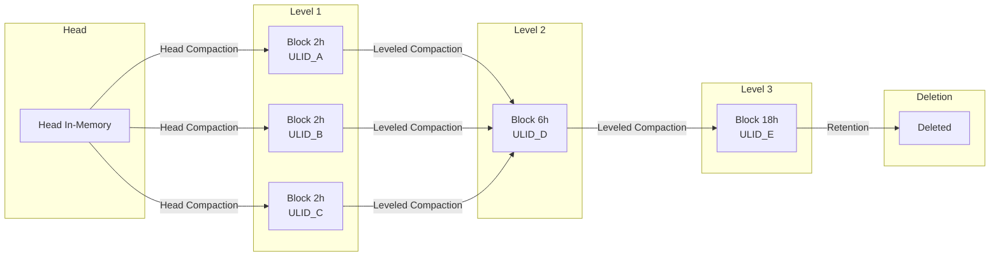

# 第7章 ブロックフォーマットとコンパクション

> **本章で読むソース**
>
> - [`tsdb/block.go`](https://github.com/prometheus/prometheus/blob/v3.12.0/tsdb/block.go)
> - [`tsdb/index/index.go`](https://github.com/prometheus/prometheus/blob/v3.12.0/tsdb/index/index.go)
> - [`tsdb/chunkenc/xor.go`](https://github.com/prometheus/prometheus/blob/v3.12.0/tsdb/chunkenc/xor.go)
> - [`tsdb/chunks/chunks.go`](https://github.com/prometheus/prometheus/blob/v3.12.0/tsdb/chunks/chunks.go)
> - [`tsdb/compact.go`](https://github.com/prometheus/prometheus/blob/v3.12.0/tsdb/compact.go)

## この章の狙い

ブロックの物理フォーマットとコンパクション戦略を理解する。
ブロックがどのようなファイルで構成され、チャンクがどのようにエンコードされ、複数のブロックがどのように統合されるかを追う。

## 前提

第5章でブロックが TSDB の永続ストレージ単位であることを理解していることを前提とする。
第6章では Head 上のメモリーチャンクと mmap チャンクを扱ったが、本章ではディスク上のブロックフォーマットに焦点を当てる。

## Block 構造体

Block（`tsdb/block.go:313-335`）はディスク上のブロックディレクトリに対応する構造体である。

```go
// tsdb/block.go:313-335
type Block struct {
    mtx            sync.RWMutex
    closing        bool
    pendingReaders sync.WaitGroup

    dir  string
    meta BlockMeta

    symbolTableSize uint64

    chunkr     ChunkReader
    indexr     IndexReader
    tombstones tombstones.Reader

    numBytesChunks    int64
    numBytesIndex     int64
    numBytesTombstone int64
    numBytesMeta      int64
}
```

ブロックディレクトリは以下で構成される。

```text
<ULID>/
  meta.json       # ブロックのメタ情報
  index           # ラベル索引とポスティング（ファイル）
  chunks/         # チャンクデータ（セグメントファイルのディレクトリ）
  tombstones      # 削除マーカー
```

## meta.json

`meta.json` は `BlockMeta`（`tsdb/block.go:164-181`）を JSON でシリアライズしたものである。

```go
// tsdb/block.go:164-181
type BlockMeta struct {
    ULID    ulid.ULID   `json:"ulid"`
    MinTime int64       `json:"minTime"`
    MaxTime int64       `json:"maxTime"`
    Stats   BlockStats  `json:"stats,omitempty"`
    Compaction BlockMetaCompaction `json:"compaction"`
    Version int         `json:"version"`
}
```

`Compaction` フィールド（`tsdb/block.go:201-216`）にはコンパクションレベル、ソースブロックの ULID、親ブロックの一覧が記録される。
これによりブロックの履歴を遡ることができる。

## 索引フォーマット

`index/` ファイル（`tsdb/index/index.go`）は以下のセクションで構成される。

- **Symbol Table**: ラベル名とラベル値で使われる文字列の辞書
- **Series**: 各系列のラベルセットとチャンク参照の一覧
- **Label Indices**: ラベル名→値の索引
- **Postings**: ラベル名+値→系列参照への転置索引
- **Postings Table**: ポスティングのオフセットテーブル

TOC（Table of Contents, `tsdb/index/index.go:171-178`）が各セクションの開始オフセットを保持する。

## ポスティング：転置索引による高速ラベル検索（最適化）

Postings は **ラベル名+値の組（例：`job="node"`）から、そのラベルを持つすべての系列の参照（ID）へのマップ**である。

クエリ `{job="node", instance="server1"}` が来たとき、TSDB は以下の手順で該当系列を特定する。

1. `job="node"` のポスティングリストを取得する
2. `instance="server1"` のポスティングリストを取得する
3. 両者の積集合（intersection）を取る

これにより、全系列をスキャンすることなく瞬時に対象を絞り込める。
ポスティングリストはソート済みの整数列（series ref）であり、積集合はマージソート的に O(n+m) で計算される。

Writable index は `AddSeries()`（`tsdb/index/index.go` `Writer`）で系列を追加し、`AddSymbol()` でシンボルを追加する。
Reader は `Postings()`（`tsdb/index/index.go` `Reader`）で特定ラベルのポスティングを取得する。

## チャンクエンコーディング

TSDB はサンプルタイプごとに異なるチャンクエンコーディングを提供する。

### XOR エンコーディング（最適化）

float サンプルには **XOR エンコーディング**（`tsdb/chunkenc/xor.go`）が使われる。
これは Facebook の Gorilla ペーパーで発表された圧縮方式をベースにしている。

<https://www.vldb.org/pvldb/vol8/p1816-teller.pdf>

基本原理は以下の通りである。

- **タイムスタンプ**: デルタ・オブ・デルタ（dod）符号化
- **値**: 直前の値との XOR を計算し、先行ゼロと後続ゼロを省略

3つ目のサンプル以降、タイムスタンプは dod でエンコードされる（`tsdb/chunkenc/xor.go:184-209`）。
dod が小さいほど少ないビット数で表現できる。例えば dod=0 は1ビット、14ビット範囲なら2バイトで表現される。

値の XOR エンコード（`tsdb/chunkenc/xor.go:412-450`）では、新しい値と直前の値の XOR を計算し、先行・後続ゼロの数を管理する。
値の変動が小さい（変化が一部のビットだけ）場合、必要なビット数は大幅に削減される。

この方式により、通常の時系列データは1サンプルあたり平均 1.37 バイト程度に圧縮される。

### ヒストグラムエンコーディング

Native Histogram には専用のエンコーディングが使われる。
ヒストグラムはバケットのカウント値を持つため、XOR と異なりデルタ圧縮が適用される。

## チャンクストレージ（ブロック用）

ブロックのチャンクは `chunks/` ディレクトリ下のセグメントファイルに格納される。
ChunkWriter と ChunkReader（`tsdb/chunks/chunks.go`）がブロック用のチャンク入出力を提供する。

ブロック用のチャンクセグメントは、Head の ChunkDiskMapper とは異なり、コンパクション時に一度だけ書き込まれ、その後は読み取り専用となる。

## LeveledCompactor

LeveledCompactor（`tsdb/compact.go:80-93`）は複数のブロックを統合して新しいブロックを生成する。

### 指数関数的ブロック範囲（最適化）

`ExponentialBlockRanges()`（`tsdb/compact.go:41-49`）は n倍のステップでブロックサイズを増やす。

```go
// tsdb/compact.go:41-49
func ExponentialBlockRanges(minSize int64, steps, stepSize int) []int64 {
    ranges := make([]int64, 0, steps)
    curRange := minSize
    for range steps {
        ranges = append(ranges, curRange)
        curRange *= int64(stepSize)
    }
    return ranges
}
```

デフォルトは 2h → 6h → 18h → 54h → ... となる。
これにより、古いデータほど大きなブロックに統合され、ブロック総数を抑えられる。

### Plan と Compact

コンパクションは2段階で行われる。

1. **Plan**（`tsdb/compact.go:249`）: コンパクションすべきブロックを選択する
2. **Compact**（`tsdb/compact.go:485`）: 選択されたブロックを一つに統合する

Plan の優先順位は以下の通りである。

1. **重なり合うブロック**（`selectOverlappingDirs()`）: 時間範囲が重複しているブロックは即座にコンパクション対象
2. **同一範囲のブロック**（`selectDirs()`）: 指数関数的な範囲に収まる複数ブロック
3. **トゥームストーンが多いブロック**: 系列の5%以上が削除されているブロック

### Compact の内部処理

Compact（`tsdb/compact.go:489`）は以下の流れで動作する。

1. 入力ブロックから BlockReader を作成する
2. `CompactBlockMetas()` で新しいブロックのメタ情報を計算する
3. `write()`（`tsdb/compact.go:658`）で一時ディレクトリに新しいブロックを書き出す
   a. 全ブロックの系列をマージして ChunkWriter に書き込む
   b. IndexWriter で新しい索引を構築する
   c. meta.json を書き込む
   d. 空のトゥームストーンファイルを作成する
4. 一時ディレクトリを正式なブロックディレクトリにリネームする
5. ソースブロックを削除可能とマークする

## トゥームストーン

トゥームストーンは削除された系列の時間範囲を記録する。
削除 API が呼ばれると、対象ブロックにトゥームストーンが追加される。
実際のデータ削除は次のコンパクション時に行われる。これにより、ブロックの不変性を保ちながら削除を実現している。

## ブロックのライフサイクル



1. Head が満杯になると Level 1 ブロック（2時間）が生成される
2. 3つの Level 1 ブロックが Leveled Compactor により Level 2 ブロック（6時間）に統合される
3. さらに統合が進み、Level 3 ブロック（18時間）が生成される
4. リテンション期間を超えたブロックは削除される

## まとめ

ブロックは meta.json、index、chunks、tombstones の4ファイルで構成される。
XOR エンコーディングにより float サンプルを高圧縮し、転置索引によりラベル検索を高速化する。
Leveled Compactor は指数関数的なブロック範囲で空間増加を抑えつつ、重なりやトゥームストーンを考慮した Plan で効率的なコンパクションを実行する。

## 関連する章

- 第5章 TSDB アーキテクチャ（ブロックとコンパクターの位置づけ）
- 第6章 Head と WAL（ブロックの供給元）
- 第8章 クエリと読み出し（ブロック上のデータ検索）
