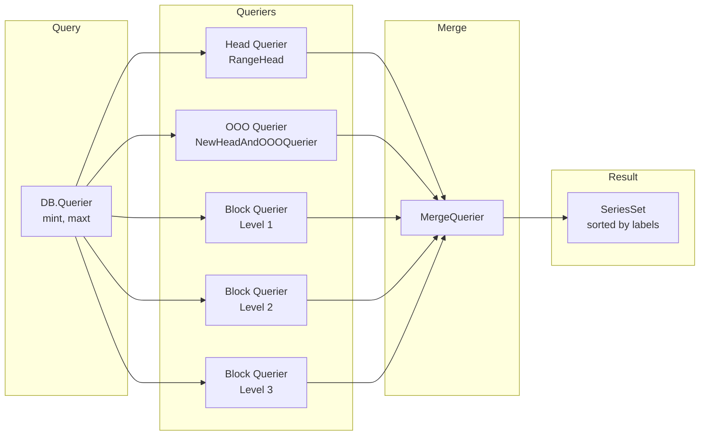

# 第8章 クエリと読み出し

> **本章で読むソース**
>
> - [`tsdb/querier.go`](https://github.com/prometheus/prometheus/blob/v3.12.0/tsdb/querier.go)
> - [`tsdb/db.go`](https://github.com/prometheus/prometheus/blob/v3.12.0/tsdb/db.go)
> - [`tsdb/ooo_head_read.go`](https://github.com/prometheus/prometheus/blob/v3.12.0/tsdb/ooo_head_read.go)

## この章の狙い

TSDB が保存されたデータをどのように検索し、複数のブロックや Head にまたがる結果をマージするかを理解する。
クエリの実行過程を追い、マージ最適化がどのように一貫性のある結果を提供するかを説明する。

## 前提

第5章から第7章で TSDB のデータ構造（Head、ブロック、索引、チャンク）を理解していることを前提とする。
本稿ではクエリインターフェースとその実装に焦点を当てる。

## DB.Querier の全体構造

`DB.Querier()`（`tsdb/db.go:2315-2389`）はクエリ実行のエントリーポイントである。

```go
// tsdb/db.go:2315-2389
func (db *DB) Querier(mint, maxt int64) (_ storage.Querier, err error) {
	var blocks []BlockReader

	db.mtx.RLock()
	defer db.mtx.RUnlock()

	for _, b := range db.blocks {
		if b.OverlapsClosedInterval(mint, maxt) {
			blocks = append(blocks, b)
		}
	}

	blockQueriers := make([]storage.Querier, 0, len(blocks)+1)

	defer func() {
		if err != nil {
			for _, q := range blockQueriers {
				_ = q.Close()
			}
		}
	}()

	overlapsOOO := overlapsClosedInterval(mint, maxt, db.head.MinOOOTime(), db.head.MaxOOOTime())
	var headQuerier storage.Querier
	inoMint := max(db.head.MinTime(), mint)
	if maxt >= db.head.MinTime() || overlapsOOO {
		rh := NewRangeHead(db.head, mint, maxt)
		headQuerier, err = db.blockQuerierFunc(rh, mint, maxt)
		if err != nil {
			return nil, fmt.Errorf("open block querier for head %s: %w", rh, err)
		}
		// ... (中略: truncation collision handling) ...
	}

	if overlapsOOO {
		isoState := db.head.oooIso.TrackReadAfter(db.lastGarbageCollectedMmapRef)
		headQuerier = NewHeadAndOOOQuerier(inoMint, mint, maxt, db.head, isoState, headQuerier)
	}

	if headQuerier != nil {
		blockQueriers = append(blockQueriers, headQuerier)
	}

	for _, b := range blocks {
		q, err := db.blockQuerierFunc(b, mint, maxt)
		if err != nil {
			return nil, fmt.Errorf("open querier for block %s: %w", b, err)
		}
		blockQueriers = append(blockQueriers, q)
	}

	return storage.NewMergeQuerier(blockQueriers, nil, storage.ChainedSeriesMerge), nil
}
```

次の3ステップで構成される。

1. Head を RangeHead でラップして Head 上のデータをブロックのように検索可能にする
2. 時間範囲に重なる永続ブロックを列挙する
3. すべての Querier を `NewMergeQuerier` でマージする

## blockBaseQuerier

`blockBaseQuerier`（`tsdb/querier.go:38-47`）は1つのブロック（または Head を RangeHead でラップしたもの）に対するクエリを実行する基本構造体である。

```go
// tsdb/querier.go:38-47
type blockBaseQuerier struct {
    blockID    ulid.ULID
    index      IndexReader
    chunks     ChunkReader
    tombstones tombstones.Reader
    closed bool
    mint, maxt int64
}
```

`newBlockBaseQuerier()`（`tsdb/querier.go:51-79`）は BlockReader から IndexReader、ChunkReader、Tombstones.Reader を取得して初期化する。

`Select()` メソッドは `selectSeriesSet()`（`tsdb/querier.go:180-214`）を呼び出し、以下の処理を行う。

1. `PostingsForMatchers()` でラベルマッチャーに適合する系列のポスティングリストを取得する
2. ポスティングリストをソートする（必要に応じて）
3. `newBlockSeriesSet()` で系列イテレーターを作成する

## PostingsForMatchers：ラベルマッチング

`PostingsForMatchers()`（`tsdb/querier.go:266-399`）は複数のラベルマッチャーを受け取り、それらを満たす系列のポスティングを計算する。

```go
// tsdb/querier.go:266-267
func PostingsForMatchers(ctx context.Context, ix IndexReader, ms ...*labels.Matcher) (index.Postings, error) {
```

処理の流れは以下の通りである。

- 各マッチャーに対応するポスティングリストを取得する
- マッチャーの種類（等価、正規表現、否定、否定正規表現）に応じて適切なリストを選ぶ
- 複数のポスティングリストを積集合（intersection）で絞り込む
- 否定マッチャーは差集合（subtraction）で除外する

例えば `{job=~"node.*", instance!="localhost"}` の場合、`job=~"node.*"` にマッチするポスティングと `instance="localhost"` のポスティングを計算し、前者から後者を引く。

## 系列イテレーター

`blockSeriesSet`（`tsdb/querier.go:1155-1171`）はポスティングリストを逐次処理し、各系列のチャンクデータを返すイテレーターである。

`blockSeriesEntry`（`tsdb/querier.go:770-783`）が1系列を表し、`Iterator()` でサンプルイテレーターを返す。
サンプルイテレーターは以下の要素を考慮する。

- **チャンクデータ**: ブロックまたは Head から読み出される
- **トゥームストーン**: 削除された時間範囲をスキップする（`DeletedIterator`、`tsdb/querier.go:1265-1341`）
- **時間範囲**: クエリで指定された mint/maxt の範囲外をトリミングする

## headQuerier と RangeHead

Head に対するクエリはブロックと異なり、メモリー上のデータと mmap チャンクの両方を検索する必要がある。
`RangeHead` は Head の一部時間範囲を切り出して BlockReader インターフェースで包むラッパーである。

RangeHead の `Index()` は Head の postings（メモリー上の転置索引）を返し、`Chunks()` は ChunkDiskMapper 経由で mmap チャンクとメモリーチャンクの両方を読み出す ChunkReader を返す。

## mergedQuerier：ブロック階層を横断するマージ（最適化）

`storage.NewMergeQuerier()`（`tsdb/db.go:2388` で使用）は複数の Querier を一つに統合する。
これにより、Head + 全ブロックにまたがるクエリ結果が1つの SeriesSet として得られる。

```go
// tsdb/db.go:2388
return storage.NewMergeQuerier(blockQueriers, nil, storage.ChainedSeriesMerge), nil
```

マージの動作は以下の通りである。

- 各 Querier が返す系列をラベルでグループ化する
- 同じラベルを持つ系列のチャンクを時間順にマージする
- 重複するチャンクは `ChainedSeriesMerge` で一貫性を保ちながら結合する

`ChainedSeriesMerge` は複数のチャンクイテレーターを直列につなぎ、時間の重なりを適切に処理する。
これにより、Head の最新データとブロックの古いデータの間に時間的なギャップや重なりがあっても、一貫した時系列が返される。

## チャンクキャッシュ

範囲クエリ（Step > 0）では、同じチャンクが複数回アクセスされる可能性がある。
`blockChunkQuerier`（`tsdb/querier.go:217-232`）は `EnableChunkCache` を呼び出して、ChunkReader にチャンクキャッシュを有効化させる（`tsdb/querier.go:186-189`）。

## 追い書きクエリ

追い書き（out-of-order）データがある場合、Head の Querier は `NewHeadAndOOOQuerier()`（`tsdb/ooo_head_read.go:567`）でラップされる。
この Querier は通常のインオーダーデータと追い書きデータをマージした結果を返す。

## クエリのマージ



1. DB.Querier は時間範囲に合致する全ブロック + Head の Querier を収集する
2. 追い書きがある場合は OOO Querier でラップする
3. すべての Querier を MergeQuerier で統合する
4. MergeQuerier は各 Querier から系列を逐次取得し、ラベルでグループ化してマージする
5. 結果は1つの SeriesSet として PromQL エンジンに返される

## まとめ

TSDB のクエリは blockBaseQuerier（単一ブロック）と mergedQuerier（複数ブロック＋Head の横断）の2階層で構成される。
ポスティングによる高速ラベル検索と MergeQuerier による透過的なデータ統合が、大量のブロックが存在しても一貫した結果を返す基盤となっている。
チャンクキャッシュは範囲クエリの性能を向上させるために追加で働く。

## 関連する章

- 第5章 TSDB アーキテクチャ（全体的なデータ構造）
- 第6章 Head と WAL（Head 上のデータ読み出し）
- 第7章 ブロックフォーマットとコンパクション（ブロック上のデータ読み出し）
