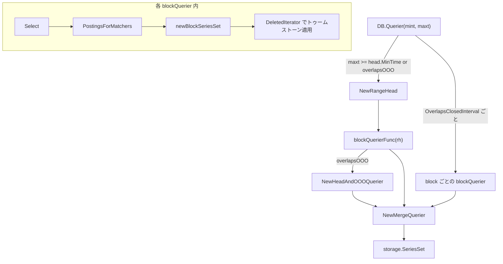

# 第8章 クエリと読み出し

> 本章で読むソース
>
> - [`tsdb/db.go`](https://github.com/prometheus/prometheus/blob/v3.12.0/tsdb/db.go)
> - [`tsdb/querier.go`](https://github.com/prometheus/prometheus/blob/v3.12.0/tsdb/querier.go)
> - [`tsdb/index/postings.go`](https://github.com/prometheus/prometheus/blob/v3.12.0/tsdb/index/postings.go)
> - [`tsdb/head.go`](https://github.com/prometheus/prometheus/blob/v3.12.0/tsdb/head.go)
> - [`tsdb/ooo_head_read.go`](https://github.com/prometheus/prometheus/blob/v3.12.0/tsdb/ooo_head_read.go)

## この章の狙い

TSDB は書き込まれたサンプルを Head と複数の永続ブロックに分けて保持する。
クエリはこの分割された保存先を横断し、ラベルマッチャーに適合する系列だけを集めて時間順のサンプル列として返さなければならない。
本章では入口の `DB.Querier()` から、ラベルマッチング、系列イテレーター、削除区間の適用、追い書きデータのマージまでの読み出し経路を追う。
PromQL エンジンがこの経路をどう呼び出すかではなく、TSDB がクエリ要求をどう分解して実行するかに焦点を当てる。

## 前提

第5章から第7章で TSDB のデータ構造（Head、永続ブロック、転置索引、チャンク）を理解していることを前提とする。
本章では、それらの構造の上に載る読み出しインターフェースとその実装に集中する。
ブロックの物理フォーマットやコンパクションのアルゴリズムには立ち入らない。

## クエリインターフェースの2階層

TSDB の読み出しは2階層に分かれる。
下層は1つのブロック、または Head を切り出した仮想ブロックに対して働く `blockBaseQuerier` である。
上層はその複数を束ねて1つの結果に統合する `storage.MergeQuerier` である。
`DB.Querier()` は時間範囲に重なる保存先ごとに下層の Querier を開き、それらを上層でまとめて返す。



## DB.Querier の全体制御

`DB.Querier()` はクエリ実行のエントリーポイントである。
指定された時間範囲 `[mint, maxt]` に対して、重なる保存先の Querier を集めて1つの `storage.Querier` にまとめる。

[`tsdb/db.go L2314-L2389`](https://github.com/prometheus/prometheus/blob/v3.12.0/tsdb/db.go#L2314-L2389)

```go
// Querier returns a new querier over the data partition for the given time range.
func (db *DB) Querier(mint, maxt int64) (_ storage.Querier, err error) {
	var blocks []BlockReader

	db.mtx.RLock()
	defer db.mtx.RUnlock()

	for _, b := range db.blocks {
		if b.OverlapsClosedInterval(mint, maxt) {
			blocks = append(blocks, b)
		}
	}

	blockQueriers := make([]storage.Querier, 0, len(blocks)+1) // +1 to allow for possible head querier.

	// ... (中略: エラー時に開いた Querier を閉じる defer) ...

	overlapsOOO := overlapsClosedInterval(mint, maxt, db.head.MinOOOTime(), db.head.MaxOOOTime())
	var headQuerier storage.Querier
	inoMint := max(db.head.MinTime(), mint)
	if maxt >= db.head.MinTime() || overlapsOOO {
		rh := NewRangeHead(db.head, mint, maxt)
		var err error
		headQuerier, err = db.blockQuerierFunc(rh, mint, maxt)
		if err != nil {
			return nil, fmt.Errorf("open block querier for head %s: %w", rh, err)
		}
		// ... (中略: truncation との衝突判定と再取得) ...
	}

	if overlapsOOO {
		// We need to fetch from in-order and out-of-order chunks: wrap the headQuerier.
		isoState := db.head.oooIso.TrackReadAfter(db.lastGarbageCollectedMmapRef)
		headQuerier = NewHeadAndOOOQuerier(inoMint, mint, maxt, db.head, isoState, headQuerier)
	}

	if headQuerier != nil {
		blockQueriers = append(blockQueriers, headQuerier)
	}

	for _, b := range blocks {
		q, err := db.blockQuerierFunc(b, mint, maxt)
		if err != nil {
			return nil, fmt.Errorf("open querier for block %s: %w", b, err)
		}
		blockQueriers = append(blockQueriers, q)
	}

	return storage.NewMergeQuerier(blockQueriers, nil, storage.ChainedSeriesMerge), nil
}
```

制御の分岐は次の順に読める。

まず永続ブロックを走査し、`OverlapsClosedInterval` がクエリ範囲と重なると判定したものだけを `blocks` に集める。
範囲外のブロックはこの時点で候補から外れるため、以降の索引読み出しの対象にもならない。

次に Head を対象に含めるかを2つの条件で決める。
`maxt >= db.head.MinTime()` はクエリの上限が Head の保持するインオーダーデータに届くことを表す。
`overlapsOOO` はクエリ範囲が Head の追い書き（out-of-order）データの時間範囲に重なることを表す。
どちらかが真なら Head を `NewRangeHead` で切り出し、`blockQuerierFunc` でブロックと同じ Querier に変換する。

`overlapsOOO` が真のときは、得た Head の Querier をさらに `NewHeadAndOOOQuerier` でラップする。
これによりインオーダーのチャンクと追い書きのチャンクの両方を読む Querier になる。
最後に Head 由来の Querier と各ブロックの Querier を1つのスライスに集め、`storage.NewMergeQuerier` で統合して返す。

`ChunkQuerier()` も同じ骨格を持ち、統合に `NewMergeChunkQuerier` と `NewCompactingChunkSeriesMerger` を使う点だけが異なる。

[`tsdb/db.go L2468-L2475`](https://github.com/prometheus/prometheus/blob/v3.12.0/tsdb/db.go#L2468-L2475)

```go
// ChunkQuerier returns a new chunk querier over the data partition for the given time range.
func (db *DB) ChunkQuerier(mint, maxt int64) (storage.ChunkQuerier, error) {
	blockQueriers, err := db.blockChunkQuerierForRange(mint, maxt)
	if err != nil {
		return nil, err
	}
	return storage.NewMergeChunkQuerier(blockQueriers, nil, storage.NewCompactingChunkSeriesMerger(storage.ChainedSeriesMerge)), nil
}
```

## blockBaseQuerier と Select

`blockBaseQuerier` は1つのブロック、または `RangeHead` で包んだ Head に対するクエリの基本構造体である。
索引、チャンク、トゥームストーンの3つのリーダーと、対象の時間範囲を保持する。

[`tsdb/querier.go L38-L47`](https://github.com/prometheus/prometheus/blob/v3.12.0/tsdb/querier.go#L38-L47)

```go
type blockBaseQuerier struct {
	blockID    ulid.ULID
	index      IndexReader
	chunks     ChunkReader
	tombstones tombstones.Reader

	closed bool

	mint, maxt int64
}
```

`newBlockBaseQuerier()` は `BlockReader` から3つのリーダーを開いて構造体を初期化する。
どれかの取得に失敗したら、それまでに開いたリーダーを閉じてからエラーを返す。
トゥームストーンが存在しないブロックには空の `MemTombstones` を割り当て、後段が nil を気にせず扱えるようにする。

[`tsdb/querier.go L51-L79`](https://github.com/prometheus/prometheus/blob/v3.12.0/tsdb/querier.go#L51-L79)

```go
func newBlockBaseQuerier(b BlockReader, mint, maxt int64) (*blockBaseQuerier, error) {
	indexr, err := b.Index()
	if err != nil {
		return nil, fmt.Errorf("open index reader: %w", err)
	}
	chunkr, err := b.Chunks()
	if err != nil {
		indexr.Close()
		return nil, fmt.Errorf("open chunk reader: %w", err)
	}
	tombsr, err := b.Tombstones()
	if err != nil {
		indexr.Close()
		chunkr.Close()
		return nil, fmt.Errorf("open tombstone reader: %w", err)
	}

	if tombsr == nil {
		tombsr = tombstones.NewMemTombstones()
	}
	return &blockBaseQuerier{
		blockID:    b.Meta().ULID,
		mint:       mint,
		maxt:       maxt,
		index:      indexr,
		chunks:     chunkr,
		tombstones: tombsr,
	}, nil
}
```

系列を取り出す `Select()` は `selectSeriesSet()` に委譲する。
この関数がラベルマッチングから系列イテレーターの生成までを組み立てる。

[`tsdb/querier.go L180-L214`](https://github.com/prometheus/prometheus/blob/v3.12.0/tsdb/querier.go#L180-L214)

```go
func selectSeriesSet(ctx context.Context, sortSeries bool, hints *storage.SelectHints, ms []*labels.Matcher,
	index IndexReader, chunks ChunkReader, tombstones tombstones.Reader, mint, maxt int64,
) storage.SeriesSet {
	disableTrimming := false
	sharded := hints != nil && hints.ShardCount > 0

	if hints != nil && hints.Step > 0 {
		if toggler, ok := chunks.(chunkCacheToggler); ok {
			toggler.EnableChunkCache()
		}
	}

	p, err := PostingsForMatchers(ctx, index, ms...)
	if err != nil {
		return storage.ErrSeriesSet(err)
	}
	if sharded {
		p = index.ShardedPostings(p, hints.ShardIndex, hints.ShardCount)
	}
	if sortSeries {
		p = index.SortedPostings(p)
	}

	if hints != nil {
		mint = hints.Start
		maxt = hints.End
		disableTrimming = hints.DisableTrimming
		if hints.Func == "series" {
			// When you're only looking up metadata (for example series API), you don't need to load any chunks.
			return newBlockSeriesSet(index, newNopChunkReader(), tombstones, p, mint, maxt, disableTrimming)
		}
	}

	return newBlockSeriesSet(index, chunks, tombstones, p, mint, maxt, disableTrimming)
}
```

`selectSeriesSet()` の処理は次の順に進む。

`PostingsForMatchers()` でマッチャーに適合する系列のポスティング（系列参照の並び）を1つのイテレーターとして得る。
`hints.ShardCount` が指定されていれば `ShardedPostings` でシャードに属する系列だけに絞る。
`sortSeries` が真なら `SortedPostings` でポスティングをラベル順にソートする。
`hints.Func == "series"` のメタデータ照会ではチャンクを読む必要がないため、`newNopChunkReader()` を渡してチャンク読み出しを丸ごと省く。
それ以外は実チャンクリーダーを渡し、`newBlockSeriesSet()` で系列イテレーターを作って返す。

## PostingsForMatchers：ラベルマッチング

`PostingsForMatchers()` は複数のラベルマッチャーを受け取り、それらをすべて満たす系列のポスティングを組み立てる。
索引から取り出す部分集合を「絞り込む側」（積集合に使う `its`）と「除外する側」（差集合に使う `notIts`）に振り分けるのが中心の仕事である。

[`tsdb/querier.go L264-L294`](https://github.com/prometheus/prometheus/blob/v3.12.0/tsdb/querier.go#L264-L294)

```go
// PostingsForMatchers assembles a single postings iterator against the index reader
// based on the given matchers. The resulting postings are not ordered by series.
func PostingsForMatchers(ctx context.Context, ix IndexReader, ms ...*labels.Matcher) (index.Postings, error) {
	if len(ms) == 1 && ms[0].Name == "" && ms[0].Value == "" {
		k, v := index.AllPostingsKey()
		return ix.Postings(ctx, k, v)
	}

	var its, notIts []index.Postings
	// See which label must be non-empty.
	// Optimization for case like {l=~".", l!="1"}.
	labelMustBeSet := make(map[string]bool, len(ms))
	for _, m := range ms {
		if !m.Matches("") {
			labelMustBeSet[m.Name] = true
		}
	}
	isSubtractingMatcher := func(m *labels.Matcher) bool {
		if !labelMustBeSet[m.Name] {
			return true
		}
		return (m.Type == labels.MatchNotEqual || m.Type == labels.MatchNotRegexp) && m.Matches("")
	}
	hasSubtractingMatchers, hasIntersectingMatchers := false, false
	for _, m := range ms {
		if isSubtractingMatcher(m) {
			hasSubtractingMatchers = true
		} else {
			hasIntersectingMatchers = true
		}
	}
```

まず `labelMustBeSet` に、空文字列にマッチしないマッチャーのラベル名を記録する。
このマップを使って `isSubtractingMatcher` が各マッチャーを絞り込み用か除外用かに分類する。
`instance!="localhost"` のような否定マッチャーで、かつ空値にマッチするものは除外側に回る。
除外用のマッチャーしかない場合は差し引く母集合がないため、全系列のポスティング（`AllPostingsKey`）を絞り込み側の基点として先に置く。

分類の後、マッチャーを並べ替えて絞り込み用を先頭に集める。
差集合の基点を小さく保つための工夫である。

[`tsdb/querier.go L308-L319`](https://github.com/prometheus/prometheus/blob/v3.12.0/tsdb/querier.go#L308-L319)

```go
	// Sort matchers to have the intersecting matchers first.
	// This way the base for subtraction is smaller and
	// there is no chance that the set we subtract from
	// contains postings of series that didn't exist when
	// we constructed the set we subtract by.
	slices.SortStableFunc(ms, func(i, j *labels.Matcher) int {
		if !isSubtractingMatcher(i) && isSubtractingMatcher(j) {
			return -1
		}

		return +1
	})
```

各マッチャーは種別ごとに処理される。
等価マッチャーは対応するラベル値のポスティングをそのまま取り、`.+` 正規表現は全ラベル値のポスティングを取り、否定マッチャーは `Inverse()` で反転してから除外側に積む。
最後に絞り込み側を積集合で1つにまとめ、除外側を順に差し引く。

[`tsdb/querier.go L405-L411`](https://github.com/prometheus/prometheus/blob/v3.12.0/tsdb/querier.go#L405-L411)

```go
	it := index.Intersect(its...)

	for _, n := range notIts {
		it = index.Without(it, n)
	}

	return it, nil
}
```

例えば `{job=~"node.*", instance!="localhost"}` では、`job=~"node.*"` に適合するポスティングが `its` に入り、`instance="localhost"` に適合するポスティングが `notIts` に入る。
前者の積集合から後者を差し引いた結果が、両方の条件を満たす系列のポスティングになる。

## ポスティング積集合と差集合の実行コスト（最適化）

ポスティングの積集合と差集合が速いのは、各ポスティングが系列参照の昇順で並んでいることを利用して、線形の一回走査で答えを出すからである。
`index.Intersect()` は入力が空なら即座に空を返し、1つだけならそのまま返す。
`EmptyPostings()` が混ざっていれば結果は必ず空になるため、走査に入る前に短絡する。

[`tsdb/index/postings.go L595-L607`](https://github.com/prometheus/prometheus/blob/v3.12.0/tsdb/index/postings.go#L595-L607)

```go
func Intersect(its ...Postings) Postings {
	if len(its) == 0 {
		return EmptyPostings()
	}
	if len(its) == 1 {
		return its[0]
	}
	if slices.Contains(its, EmptyPostings()) {
		return EmptyPostings()
	}

	return newIntersectPostings(its...)
}
```

複数のポスティングを積集合するときは、先頭を1つ進めてその値を目標にし、他のポスティングを目標へ `Seek` で合わせる。
全部が同じ値で揃えば交点が1つ見つかり、揃わなければ最大値を新しい目標にして繰り返す。

[`tsdb/index/postings.go L643-L667`](https://github.com/prometheus/prometheus/blob/v3.12.0/tsdb/index/postings.go#L643-L667)

```go
func (it *intersectPostings) Next() bool {
	// Move forward the first Postings and take its value as the target to match.
	if !it.postings[0].Next() {
		return false
	}
	target := it.postings[0].At()
	allEqual := true
	for _, p := range it.postings[1:] { // Now move forward all the other ones and check if they match.
		if !p.Next() {
			return false
		}
		at := p.At()
		if at > target { // This one is past the target, so pick up a new target to Seek at the end.
			target = at
			allEqual = false
		} else if at < target { // This one needs to Seek to the target, but carry on with other postings in case they have an even higher target.
			allEqual = false
		}
	}
	if allEqual {
		it.current = target
		return true
	}
	return it.Seek(target)
}
```

差集合を担う `removedPostings` も、母集合と除外集合の2つのカーソルを同時に前へ進める。
母集合の現在値が除外集合の現在値より小さければ結果として採用し、大きければ除外集合を追いつくまで `Seek` で進め、等しければその値を飛ばす。

[`tsdb/index/postings.go L778-L806`](https://github.com/prometheus/prometheus/blob/v3.12.0/tsdb/index/postings.go#L778-L806)

```go
func (rp *removedPostings) Next() bool {
	if !rp.initialized {
		rp.fok = rp.full.Next()
		rp.rok = rp.remove.Next()
		rp.initialized = true
	}
	for {
		if !rp.fok {
			return false
		}

		if !rp.rok {
			rp.cur = rp.full.At()
			rp.fok = rp.full.Next()
			return true
		}
		switch fcur, rcur := rp.full.At(), rp.remove.At(); {
		case fcur < rcur:
			rp.cur = fcur
			rp.fok = rp.full.Next()

			return true
		case rcur < fcur:
			// Forward the remove postings to the right position.
			rp.rok = rp.remove.Seek(fcur)
		default:
			// Skip the current posting.
			rp.fok = rp.full.Next()
		}
```

どちらのカーソルも後戻りしないため、2つの長さ n と m のポスティングに対する積集合と差集合は O(n+m) で終わる。
これは、両方を突き合わせるときに一方の全要素をもう一方の全要素と比較する O(n×m) を避けている。
索引が系列参照を昇順に保つという不変条件が、この線形マージを成立させている。

## 系列イテレーター

`newBlockSeriesSet()` はポスティングと3つのリーダーを束ね、系列を1つずつ返す `blockSeriesSet` を作る。
`blockSeriesSet` は共通実装の `blockBaseSeriesSet` を埋め込んでいる。

[`tsdb/querier.go L1152-L1180`](https://github.com/prometheus/prometheus/blob/v3.12.0/tsdb/querier.go#L1152-L1180)

```go
// blockSeriesSet allows to iterate over sorted, populated series with applied tombstones.
// Series with all deleted chunks are still present as Series with no samples.
// Samples from chunks are also trimmed to requested min and max time.
type blockSeriesSet struct {
	blockBaseSeriesSet
}

func newBlockSeriesSet(i IndexReader, c ChunkReader, t tombstones.Reader, p index.Postings, mint, maxt int64, disableTrimming bool) storage.SeriesSet {
	return &blockSeriesSet{
		blockBaseSeriesSet{
			index:           i,
			chunks:          c,
			tombstones:      t,
			p:               p,
			mint:            mint,
			maxt:            maxt,
			disableTrimming: disableTrimming,
		},
	}
}

func (b *blockSeriesSet) At() storage.Series {
	// At can be looped over before iterating, so save the current values locally.
	return &blockSeriesEntry{
		chunks:     b.chunks,
		blockID:    b.blockID,
		seriesData: b.curr,
	}
}
```

系列の前進を担う `blockBaseSeriesSet.Next()` は、ポスティングを1つ進めるたびに次を行う。
索引から系列のラベルとチャンクメタを引き、系列のトゥームストーン（削除区間）を取得する。
クエリ範囲に一切かからないチャンクや、削除区間で完全に覆われるチャンクを事前に除く。
残ったチャンクが範囲の端をはみ出すなら、はみ出した側を削除区間として追加し、トリミング対象にする。

[`tsdb/querier.go L574-L653`](https://github.com/prometheus/prometheus/blob/v3.12.0/tsdb/querier.go#L574-L653)

```go
func (b *blockBaseSeriesSet) Next() bool {
	for b.p.Next() {
		if err := b.index.Series(b.p.At(), &b.builder, &b.bufChks); err != nil {
			// Postings may be stale. Skip if no underlying series exists.
			if errors.Is(err, storage.ErrNotFound) {
				continue
			}
			b.err = fmt.Errorf("get series %d: %w", b.p.At(), err)
			return false
		}

		if len(b.bufChks) == 0 {
			continue
		}

		intervals, err := b.tombstones.Get(b.p.At())
		if err != nil {
			b.err = fmt.Errorf("get tombstones: %w", err)
			return false
		}

		// ... (中略: 範囲外や完全削除チャンクの事前除去とトリミング判定) ...

		if trimFront {
			intervals = intervals.Add(tombstones.Interval{Mint: math.MinInt64, Maxt: b.mint - 1})
		}
		if trimBack {
			intervals = intervals.Add(tombstones.Interval{Mint: b.maxt + 1, Maxt: math.MaxInt64})
		}

		b.curr.labels = b.builder.Labels()
		b.curr.chks = chks
		b.curr.intervals = intervals
		return true
	}
	return false
}
```

クエリ範囲からはみ出す部分を、専用のトリミング機構ではなく削除区間として表現しているのが要点である。
範囲の外側を仮想的な削除区間に変換しておけば、後段のサンプル読み出しは削除の適用だけを見ればよく、範囲外除去と削除適用を1つの経路で扱える。

`At()` が返す `blockSeriesEntry` は1系列を表し、`Iterator()` でサンプルイテレーターを生成する。
渡されたイテレーターが再利用可能な `populateWithDelSeriesIterator` なら、割り当てずに `reset` で使い回す。

[`tsdb/querier.go L770-L783`](https://github.com/prometheus/prometheus/blob/v3.12.0/tsdb/querier.go#L770-L783)

```go
type blockSeriesEntry struct {
	chunks  ChunkReader
	blockID ulid.ULID
	seriesData
}

func (s *blockSeriesEntry) Iterator(it chunkenc.Iterator) chunkenc.Iterator {
	pi, ok := it.(*populateWithDelSeriesIterator)
	if !ok {
		pi = &populateWithDelSeriesIterator{}
	}
	pi.reset(s.blockID, s.chunks, s.chks, s.intervals)
	return pi
}
```

## トゥームストーンと DeletedIterator

サンプルを1つずつ返す `populateWithDelSeriesIterator.Next()` は、系列のチャンクを順にたどる。
削除区間に重なるチャンクでは、生のチャンクイテレーターではなく削除区間を適用する `currDelIter` を使う。

[`tsdb/querier.go L812-L830`](https://github.com/prometheus/prometheus/blob/v3.12.0/tsdb/querier.go#L812-L830)

```go
func (p *populateWithDelSeriesIterator) Next() chunkenc.ValueType {
	if p.curr != nil {
		if valueType := p.curr.Next(); valueType != chunkenc.ValNone {
			return valueType
		}
	}

	for p.next(false) {
		if p.currDelIter != nil {
			p.curr = p.currDelIter
		} else {
			p.curr = p.currMeta.Chunk.Iterator(p.curr)
		}
		if valueType := p.curr.Next(); valueType != chunkenc.ValNone {
			return valueType
		}
	}
	return chunkenc.ValNone
}
```

チャンクごとに削除区間を切り替えているのは内部の `next()` である。
チャンクメタに重なる削除区間だけを `bufIter.Intervals` に集め、区間が1つでもあれば `currDelIter` に `DeletedIterator` を設定する。
区間がなければ `currDelIter` を nil にして、生のチャンクをそのまま読ませる。

[`tsdb/querier.go L718-L760`](https://github.com/prometheus/prometheus/blob/v3.12.0/tsdb/querier.go#L718-L760)

```go
	p.i++
	p.currMeta = p.metas[p.i]

	p.bufIter.Intervals = p.bufIter.Intervals[:0]
	for _, interval := range p.intervals {
		if p.currMeta.OverlapsClosedInterval(interval.Mint, interval.Maxt) {
			p.bufIter.Intervals = p.bufIter.Intervals.Add(interval)
		}
	}

	// ... (中略: 単一チャンクとイテラブルの取得) ...

	// Use the single chunk if possible.
	if p.currMeta.Chunk != nil {
		if len(p.bufIter.Intervals) == 0 {
			// If there is no overlap with deletion intervals and a single chunk is
			// returned, we can take chunk as it is.
			p.currDelIter = nil
			return true
		}
		// Otherwise we need to iterate over the samples in the single chunk
		// and create new chunks.
		p.bufIter.Iter = p.currMeta.Chunk.Iterator(p.bufIter.Iter)
		p.currDelIter = &p.bufIter
		return true
	}
```

`DeletedIterator` は元のイテレーターと削除区間の並びを持つラッパーである。

[`tsdb/querier.go L1265-L1270`](https://github.com/prometheus/prometheus/blob/v3.12.0/tsdb/querier.go#L1265-L1270)

```go
type DeletedIterator struct {
	// Iter is an Iterator to be wrapped.
	Iter chunkenc.Iterator
	// Intervals are the deletion intervals.
	Intervals tombstones.Intervals
}
```

`Next()` は元のイテレーターを1つ進めるたびに、そのタイムスタンプが削除区間に入るかを調べる。
区間内なら外側のループへ戻って次のサンプルへ飛ばし、区間を越えたら先頭の区間を捨てて後続と比べる。
削除区間もサンプルもタイムスタンプ昇順に並ぶため、区間の照合も一方向の走査で済む。

[`tsdb/querier.go L1324-L1341`](https://github.com/prometheus/prometheus/blob/v3.12.0/tsdb/querier.go#L1324-L1341)

```go
func (it *DeletedIterator) Next() chunkenc.ValueType {
Outer:
	for valueType := it.Iter.Next(); valueType != chunkenc.ValNone; valueType = it.Iter.Next() {
		ts := it.AtT()
		for _, tr := range it.Intervals {
			if tr.InBounds(ts) {
				continue Outer
			}

			if ts <= tr.Maxt {
				return valueType
			}
			it.Intervals = it.Intervals[1:]
		}
		return valueType
	}
	return chunkenc.ValNone
}
```

削除はチャンクを書き換えず、読み出し時に該当サンプルを飛ばすだけで表現される。
これがトゥームストーン方式であり、削除操作は区間の記録だけで完了し、実データの再構築はコンパクションまで遅延される。

## RangeHead：Head をブロックとして読む

Head はメモリー上のデータと mmap チャンクを持ち、永続ブロックとは読み出し口が異なる。
`RangeHead` はこの Head を `[mint, maxt]` の範囲に限定し、ブロックと同じ `BlockReader` インターフェースで見せるラッパーである。

[`tsdb/head.go L1586-L1600`](https://github.com/prometheus/prometheus/blob/v3.12.0/tsdb/head.go#L1586-L1600)

```go
func (h *RangeHead) Index() (IndexReader, error) {
	return h.head.indexRange(h.mint, h.maxt), nil
}

func (h *RangeHead) Chunks() (ChunkReader, error) {
	var isoState *isolationState
	if !h.isolationOff {
		isoState = h.head.iso.State(h.mint, h.maxt)
	}
	return h.head.chunksRange(h.mint, h.maxt, isoState)
}

func (h *RangeHead) Tombstones() (tombstones.Reader, error) {
	return h.head.tombstones, nil
}
```

`Index()` は Head の転置索引を範囲付きで返し、`Chunks()` は mmap チャンクとメモリーチャンクの両方を読む `ChunkReader` を返す。
`Chunks()` の中で `iso.State` を取るのは、読み出し中に進む書き込みから一貫したスナップショットを見るためである。
この共通インターフェース化によって、`blockBaseQuerier` は Head かブロックかを区別せず同じ経路で扱える。

## NewHeadAndOOOQuerier：追い書きデータのマージ

追い書き（out-of-order）データがある場合、Head の Querier は `NewHeadAndOOOQuerier()` でラップされる。
このラッパーはインオーダーと追い書きを合わせた索引リーダーとチャンクリーダーを組み立てる。

[`tsdb/ooo_head_read.go L567-L582`](https://github.com/prometheus/prometheus/blob/v3.12.0/tsdb/ooo_head_read.go#L567-L582)

```go
func NewHeadAndOOOQuerier(inoMint, mint, maxt int64, head *Head, oooIsoState *oooIsolationState, querier storage.Querier) storage.Querier {
	cr := &headChunkReader{
		head:     head,
		mint:     mint,
		maxt:     maxt,
		isoState: head.iso.State(mint, maxt),
	}
	return &HeadAndOOOQuerier{
		mint:    mint,
		maxt:    maxt,
		head:    head,
		index:   NewHeadAndOOOIndexReader(head, inoMint, mint, maxt, oooIsoState.minRef),
		chunkr:  NewHeadAndOOOChunkReader(head, mint, maxt, cr, oooIsoState, 0),
		querier: querier,
	}
}
```

`HeadAndOOOQuerier.Select()` は、この統合索引と統合チャンクリーダーを `selectSeriesSet()` に渡す。
その結果、ブロックの Querier と同じ関数で系列を組み立てながら、内部ではインオーダーと追い書きの両方のチャンクを読む。

[`tsdb/ooo_head_read.go L628-L630`](https://github.com/prometheus/prometheus/blob/v3.12.0/tsdb/ooo_head_read.go#L628-L630)

```go
func (q *HeadAndOOOQuerier) Select(ctx context.Context, sortSeries bool, hints *storage.SelectHints, matchers ...*labels.Matcher) storage.SeriesSet {
	return selectSeriesSet(ctx, sortSeries, hints, matchers, q.index, q.chunkr, q.head.tombstones, q.mint, q.maxt)
}
```

包んでいた元の Querier（`querier` フィールド）は `LabelNames` や `LabelValues` の委譲先として保持される。
系列の読み出しは統合リーダー側で行い、ラベル一覧の照会は元の Querier に任せる役割分担になっている。

## MergeQuerier：ブロック階層を横断するマージ

`DB.Querier()` の末尾で呼ばれる `storage.NewMergeQuerier()` は、Head と全ブロックの Querier を1つに統合する。
統合の系列マージには `storage.ChainedSeriesMerge` を使う。

[`tsdb/db.go L2388`](https://github.com/prometheus/prometheus/blob/v3.12.0/tsdb/db.go#L2388)

```go
	return storage.NewMergeQuerier(blockQueriers, nil, storage.ChainedSeriesMerge), nil
```

`MergeQuerier` の動作は次のとおりである。
各 Querier が返す系列をラベルでグループ化し、同じラベルを持つ系列のイテレーターを1つに束ねる。
`ChainedSeriesMerge` は束ねたイテレーターを時間順につなぎ、時間の重なりを解決しながら1本のサンプル列にする。
これにより、Head の新しいデータとブロックの古いデータの間にギャップや重なりがあっても、一貫した時系列が返る。
PromQL エンジンから見れば、保存先がいくつに分かれていても結果は1つの `SeriesSet` である。

## チャンクキャッシュ（最適化）

範囲クエリ（`Step > 0`）では、1つの系列の各チャンクが評価ステップごとに繰り返し読まれる可能性がある。
`selectSeriesSet()` は、チャンクリーダーが `chunkCacheToggler` を実装していれば `EnableChunkCache()` を呼ぶ。

[`tsdb/querier.go L173-L190`](https://github.com/prometheus/prometheus/blob/v3.12.0/tsdb/querier.go#L173-L190)

```go
// chunkCacheToggler is an optional interface implemented by chunk readers that
// support an in-memory head-chunk cache. The cache is only beneficial for range
// queries (Step > 0) where every chunk of a series is accessed.
type chunkCacheToggler interface {
	EnableChunkCache()
}

func selectSeriesSet(ctx context.Context, sortSeries bool, hints *storage.SelectHints, ms []*labels.Matcher,
	index IndexReader, chunks ChunkReader, tombstones tombstones.Reader, mint, maxt int64,
) storage.SeriesSet {
	disableTrimming := false
	sharded := hints != nil && hints.ShardCount > 0

	if hints != nil && hints.Step > 0 {
		if toggler, ok := chunks.(chunkCacheToggler); ok {
			toggler.EnableChunkCache()
		}
	}
```

キャッシュを範囲クエリのときだけ有効化するのが機構の要点である。
コメントが述べるとおり、キャッシュが効くのは同じチャンクへの再アクセスが起きる範囲クエリに限られる。
1点のみを返す瞬時クエリではチャンクは一度しか読まれないため、キャッシュの保持コストが無駄になる。
`hints.Step > 0` を条件にすることで、再アクセスが見込める場合だけメモリーを使う判断をしている。

## まとめ

TSDB のクエリは、単一の保存先を読む `blockBaseQuerier` と、複数を束ねる `MergeQuerier` の2階層で構成される。
`DB.Querier()` は時間範囲に重なるブロックと Head を選び、追い書きがあれば `NewHeadAndOOOQuerier` でラップし、すべてを統合して返す。
系列の選別は `PostingsForMatchers()` によるポスティングの積集合と差集合が担い、系列参照の昇順という不変条件のおかげで O(n+m) の線形マージで済む。
削除はトゥームストーンとして記録され、`DeletedIterator` が読み出し時に該当サンプルを飛ばす。
クエリ範囲からのはみ出しも削除区間として表現され、範囲外除去と削除適用が1つの経路に集約される。
範囲クエリではチャンクキャッシュが再アクセスのコストを抑える。

## 関連する章

- [第5章 TSDB アーキテクチャ](05-tsdb-architecture.md)：クエリ対象となるデータ構造の全体像
- [第6章 Head と WAL](06-head-and-wal.md)：RangeHead が包む Head の内部構造
- [第7章 ブロックフォーマットとコンパクション](07-block-format-and-compaction.md)：ブロック上の索引とチャンクの物理配置
